# Agent Dashboard - System Design and Technical Reference

Architectural overview and technical reference for the Agent Dashboard system, covering design goals, high-level architecture, data flow, server and client components, database design, WebSocket protocol, hook integration, MCP extension layer, Claude Code plugins & skills, state management, security considerations, performance characteristics, deployment modes, and technology choices.


---

## Table of Contents

- [System Overview](#system-overview)
- [High-Level Architecture](#high-level-architecture)
- [Data Flow](#data-flow)
- [Server Architecture](#server-architecture)
- [Client Architecture](#client-architecture)
- [Internationalization Architecture](#internationalization-architecture)
- [Database Design](#database-design)
- [WebSocket Protocol](#websocket-protocol)
- [Hook Integration](#hook-integration)
- [Import Pipeline](#import-pipeline)
- [Agent Extension Layer](#agent-extension-layer)
- [Plugin Marketplace](#plugin-marketplace)
- [MCP Integration](#mcp-integration)
- [State Management](#state-management)
- [Browser Notification System](#browser-notification-system)
- [Update Notifier Subsystem](#update-notifier-subsystem)
- [Tabby Companion Subsystem](#tabby-companion-subsystem)
- [VS Code Extension Architecture](#vs-code-extension-architecture)
- [Desktop App Architecture (macOS & Windows / Electron)](#desktop-app-architecture-macos--windows--electron)
- [Security Considerations](#security-considerations)
- [Performance Characteristics](#performance-characteristics)
- [Deployment Modes](#deployment-modes)
- [Statusline Utility](#statusline-utility)
- [Technology Choices](#technology-choices)
- [Build & Run Targets](#build--run-targets)

---

## System Overview

Agent Dashboard is a local-first monitoring platform for Claude Code sessions. It captures agent lifecycle events via Claude Code's native hook system, persists them in SQLite, and presents them through a React dashboard with real-time WebSocket updates.

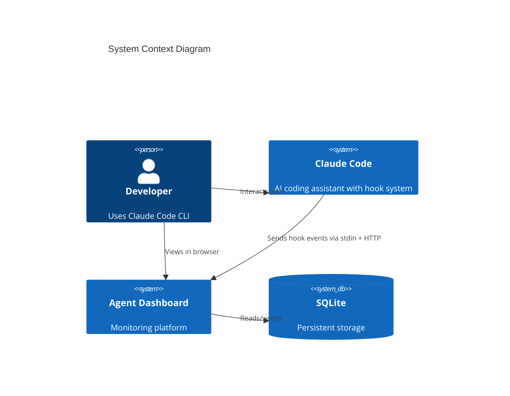

**Design goals:**

- Zero-config operation -- auto-discovers sessions from hook events
- Never block Claude Code -- hooks fail silently with timeouts
- Instant feedback -- WebSocket push, no polling
- Portable -- SQLite, no external services, runs on any OS with Node.js 18+
- Extensible -- plugin marketplace with 10 plugins (53 skills, 14 agents, 30 slash commands, 3 CLI tools)

---

## High-Level Architecture

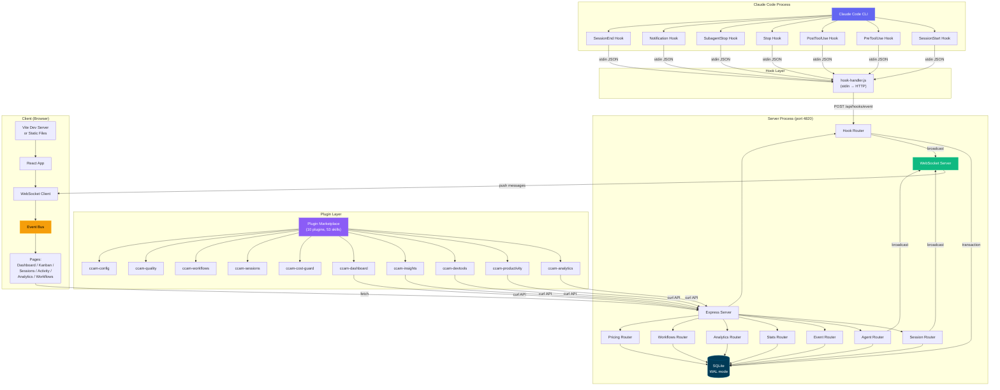

---

## Data Flow

### Event Ingestion Pipeline

```mermaid
sequenceDiagram
    participant CC as Claude Code
    participant HH as hook-handler.js
    participant API as POST /api/hooks/event
    participant TX as SQLite Transaction
    participant WS as WebSocket.broadcast()
    participant UI as React Client

    CC->>HH: stdin: {"session_id":"abc","tool_name":"Bash",...}
    Note over HH: Reads stdin, parses JSON,<br/>wraps with hook_type

    HH->>API: POST {"hook_type":"PreToolUse","data":{...}}
    Note over API: Validates hook_type + data

    API->>TX: BEGIN TRANSACTION
    TX->>TX: ensureSession(session_id)
    Note over TX: Creates session + main agent<br/>if first contact. Also persists<br/>data.transcript_path onto the session row<br/>(SQL-guarded, so subsequent events no-op).<br/>Syncs sessions.name from the transcript title<br/>(custom-title &gt; ai-title).

    TX->>TX: Process by hook_type
    Note over TX: Dispatches by hook_type. Maintains the agent and<br/>session state machines plus the awaiting_input_since flag.<br/>SubagentStop also triggers a JSONL scan that emits per_tool<br/>events under each subagent. See the hook table below for<br/>the full per_event behaviour.

    TX->>TX: insertEvent(...)
    TX->>TX: COMMIT

    API->>WS: broadcast("agent_updated", agent)
    API->>WS: broadcast("new_event", event)

    WS->>UI: {"type":"agent_updated","data":{...}}
    UI->>UI: eventBus.publish(msg)
    UI->>UI: Page re-renders with new data
```

### Client Data Loading Pattern

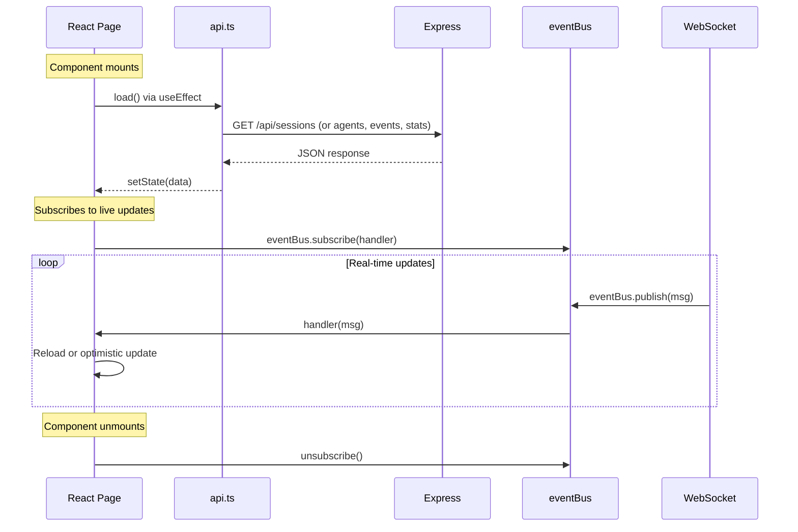

---

## Server Architecture

### Module Dependency Graph

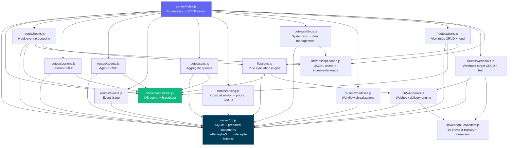

### Server Components

| Module                    | Responsibility                                                                                                                                                                                                                                                                                                                                                                                                                                                                                                                       |
|---------------------------|--------------------------------------------------------------------------------------------------------------------------------------------------------------------------------------------------------------------------------------------------------------------------------------------------------------------------------------------------------------------------------------------------------------------------------------------------------------------------------------------------------------------------------------|
| `server/index.js`         | Express app setup, middleware, route mounting, static file serving in production, HTTP server creation. Static middleware sets explicit `Cache-Control` headers — `immutable` for `/assets/*`, `no-cache, must-revalidate` for `index.html` / `sw.js` / `manifest.json`, a short revalidation window otherwise — so a rebuild always replaces the in-browser bundle without a hard refresh. Runs a periodic maintenance sweep — cadence derived from `DASHBOARD_STALE_MINUTES` (¼ of the threshold, clamped to 60 s – 5 min, default ~45 min) — that abandons stale sessions with transcript cache eviction and scans active sessions for new compaction entries by reading `sessions.transcript_path` directly (an O(active sessions) lookup; the previous `SELECT DISTINCT json_extract(events.data,'$.transcript_path')` scan grew with the events table and is gone). **Error detection watchdog** runs every 15 seconds: finds active sessions with no recent hook events (>10 s stale), re-reads their transcript files looking for API errors (401 auth, rate limits, quota exhaustion), derives transcript paths from session `cwd` for imported sessions, and marks sessions/agents as `error` when API errors are found — catches cases where the CLI doesn't fire a hook after API errors. The same watchdog also performs **user-interrupt (Esc) recovery**: `Esc` fires no hook, so a cancelled turn would otherwise leave the main agent stuck `working`. It detects this two ways — (a) the transcript's `[Request interrupted by user]` marker, surfaced as `result.pendingInterrupt` from `TranscriptCache` (computed from transcript ordering alone, immune to server/transcript clock skew), and (b) an idle-working fallback for an Esc pressed *before any output* (which writes no marker): when the main agent has been `working` with `current_tool` null and neither a hook event nor the transcript mtime has advanced for `DASHBOARD_WORKING_IDLE_SECONDS` (default 120) — and moves the session to **Waiting** (agent → `waiting`, `awaiting_input_since` stamped) with an `Interrupted` event. Triggers legacy session import (with active-session detection for recently-modified JSONL files) and compaction backfill on startup                                                                                                                                                                                                                    |
| `server/openapi.js`       | OpenAPI 3.0.3 document generator for the backend API (metadata, schemas, endpoint paths), merging supplementary fragments from `server/openapi-extra/` in `createOpenApiSpec()`. Feeds the raw spec endpoint (`/api/openapi.json`), Swagger UI (`/api/docs`), **ReDoc** (`/api/redoc`, served via `server/lib/redoc.js` with a self-hosted bundle — never a CDN), and the committed `openapi.yaml` regenerated by `npm run openapi:yaml`                                                                                                                                                                                                                                                          |
| `server/lib/redoc.js`     | Serves the **ReDoc** API reference (`/api/redoc`) as a self-hosted three-panel rendering of the OpenAPI spec, with the ReDoc bundle served locally from `/api/redoc/redoc.standalone.js` (bundled via the `redoc` dependency, never a CDN) so the reference works fully offline / air-gapped                                                                                                                                                                                                                                                                                                                                                                            |
| `server/openapi-extra/`   | Supplementary OpenAPI path/schema fragments merged into the spec by `createOpenApiSpec()` — covers `cc-config.js`, `push.js`, `run.js`, and `misc.js` route groups                                                                                                                                                                                                                                                                                                                                                                                                                                                                                                                    |
| `server/db.js`            | SQLite connection with WAL mode, schema migration (CREATE TABLE IF NOT EXISTS + ALTER TABLE for column additions), all prepared statements as a reusable `stmts` object. Tries `better-sqlite3` first, falls back to `node:sqlite` via `compat-sqlite.js`. Migrations use literal defaults for ALTER TABLE since SQLite does not support expressions like `strftime()` in column defaults added via ALTER TABLE                                                                                                                      |
| `server/compat-sqlite.js` | Compatibility wrapper that gives Node.js built-in `node:sqlite` (`DatabaseSync`) the same API as `better-sqlite3` — pragma, transaction, prepare. Used as automatic fallback when the native module is unavailable (Node 22+)                                                                                                                                                                                                                                                                                                        |
| `server/websocket.js`     | WebSocket server on `/ws` path, 30s heartbeat with ping/pong dead connection detection, typed broadcast function. Upgrades run through the same Host-header allowlist and optional `DASHBOARD_TOKEN` check as the HTTP surface (`isWebSocketAuthorized`)                                                                                                                                                                                                                                                                                                                                                  |
| `server/lib/security.js`  | Network-hardening module (fix for GHSA-gr74-4xfh-6jw9). `resolveHost()` picks the bind address — `127.0.0.1` by default, widened only by `DASHBOARD_HOST` (logs a warning for non-loopback binds). `hostGuard` rejects requests whose `Host` header isn't in the loopback set or `DASHBOARD_ALLOWED_HOSTS` (DNS-rebinding defense). `corsOptions()` allows only loopback origins while letting No-Origin (curl/CLI) requests through. `tokenGuard` + `isWebSocketAuthorized` enforce the optional `DASHBOARD_TOKEN` on `/api/*` and WebSocket upgrades (accepted as `Authorization: Bearer`, `x-dashboard-token`, or `?token=`; off by default). Exempt paths and token-matching helpers (`tokensMatch`, `extractToken`) live here too                                                                                                                  |
| `routes/hooks.js`         | Core event processing inside a SQLite transaction. Auto-creates sessions/agents. Handles 8 hook types: SessionStart, UserPromptSubmit, PreToolUse, PostToolUse, Stop, SubagentStop, Notification, SessionEnd, plus synthetic `Compaction` events. Manages the agent state machine plus the `awaiting_input_since` overlay (stamped on SessionStart for fresh CLIs, on non-error Stop, and on permission Notifications (which now also set agent status to `waiting`); cleared on UserPromptSubmit / PreToolUse / PostToolUse / SessionStart-resume / SessionEnd; SubagentStop intentionally does NOT clear it; and stamped by the 15 s watchdog on user-interrupt (Esc) recovery — see the `index.js` row — since `Esc` fires no hook). After `res.json()` returns on `SubagentStop`, fires a fire-and-forget `scanAndImportSubagents` (from `scripts/import-history.js`) that parses every `subagents/agent-*.jsonl`, pairs `tool_use` ↔ `tool_result` blocks by `tool_use_id`, and emits per-tool `PreToolUse` + `PostToolUse` events under each subagent's own `agent_id` — closes the gap where subagent-internal tool calls would otherwise never reach the events table. The same scan attributes each subagent's tokens to **its own model** (resolved from the subagent transcript) and stamps `metadata.model` on the subagent row (issue #185), so a tiered pipeline (Opus orchestrator + Sonnet/Haiku subagents) is priced per real model rather than entirely at the orchestrator's rate; the parent-model bucket is skipped to avoid colliding with the main-transcript token writer's compaction baseline logic. Session reactivation on resume (including Stop/SubagentStop reactivation for imported completed/abandoned sessions), orphaned-session cleanup uses `DASHBOARD_STALE_MINUTES` (default 180). Uses a shared `TranscriptCache` instance (`server/lib/transcript-cache.js`) for extraction of tokens, API errors, turn durations, thinking blocks, and usage extras — stat-based caching with incremental byte-offset reads avoids re-reading entire JSONL files on every event. Detects compaction via `isCompactSummary` in JSONL transcripts and creates compaction agents + events (deduplicated by uuid). Token baselines (`baseline_*` columns) preserve pre-compaction totals so no usage is lost. Cache entries are evicted on SessionEnd. **SessionEnd preserves error state** — if the session is in `error` when it exits, the error status is kept (previously always overwritten to `completed`). **Error recovery**: only `UserPromptSubmit` and `PreToolUse` can recover a session from `error` back to active. **Session naming**: on every event, syncs `sessions.name` from the transcript title surfaced by `TranscriptCache` and broadcasts `session_updated` — an explicit `custom-title` (`/rename`, `claude -n`, picker Ctrl+R) always wins, an `ai-title` (auto / plan-accept) only fills a placeholder/auto name (`Session <id8>` or a cwd-folder import name) so a user-chosen name is never clobbered. The guarded `updateSessionName` no-ops on the unchanged case, so the broadcast path stays quiet; the 15 s error-watchdog runs the same sync for idle sessions that fire no hook after a rename |
| `routes/sessions.js`      | Standard CRUD with pagination. GET includes agent count via LEFT JOIN. POST is idempotent on session ID. GET `/:id/transcript` also surfaces `custom-title` lines as synthetic `session_event` (rename) messages — deduped, with `ai-title` excluded — so TUI-only `/rename` (which writes no user/assistant turn) is still visible in the conversation viewer. It also surfaces `system`/`local_command` lines: newer Claude Code builds write a local slash command's invocation and captured output (`<command-name>`, `<local-command-stdout>`/`stderr`) as `system`/`local_command` entries with the TUI markup in a top-level `content` string (older builds used `user` messages), so the route re-emits those as user-side text and the client's `tuiSegments` parser renders the command pill + its output (e.g. `/color` → a `/color` pill plus "Session color set to: cyan"). Content-less `local_command` lines (e.g. `/clear`) and every other `system` subtype (`turn_duration`, `stop_hook_summary`, …) are dropped as noise |
| `routes/agents.js`        | CRUD with status/session_id filtering. PATCH broadcasts `agent_updated`                                                                                                                                                                                                                                                                                                                                                                                                                                                              |
| `routes/events.js`        | Read-only event listing with session_id filter and pagination                                                                                                                                                                                                                                                                                                                                                                                                                                                                        |
| `routes/stats.js`         | Single aggregate query returning total/active counts + status distributions                                                                                                                                                                                                                                                                                                                                                                                                                                                          |
| `routes/analytics.js`     | Extended analytics — token totals, tool usage counts, daily event/session trends, agent type distribution. The client-side analytics heatmap grid is aligned to a Sunday start for correct day-of-week positioning                                                                                                                                                                                                                                                                                                                   |
| `routes/pricing.js`       | Model pricing CRUD (list/upsert/delete) and per-session / global cost calculation with pattern-based model matching. Cost is computed per token bucket — keyed by (model, speed, inference_geo, service_tier) — applying fast-mode premium, US data-residency (1.1x), and Batch (0.5x) modifiers, the 5m/1h cache-write split, plus server-tool surcharges (web search $10/1k; code execution estimated by container-time with the monthly free-hours allowance; web fetch free). Feature rates + modifier math live in `lib/pricing-constants.js`; usage normalization in `lib/token-usage.js` |
| `routes/settings.js`      | System info (DB size, hook status, server uptime, transcript cache stats), data export as JSON, session cleanup (abandon stale, purge old), clear all data (including the fired-alert feed and webhook delivery log; alert *rules* and webhook *targets* are preserved as user configuration), reset pricing, reinstall hooks                                                                                                                                                                                                                                                                                                                                           |
| `routes/alerts.js`        | HTTP surface for the rules-based alerting engine: alert-rule CRUD (`GET/POST /api/alerts/rules`, `PATCH/DELETE /api/alerts/rules/:id` — rule_type is immutable after creation, config re-validated against the stored type on PATCH), the fired-alert feed (`GET /api/alerts` with `?unacked=true` + pagination, response carries `total` and `unacked` counts), and acknowledgement (`POST /api/alerts/:id/ack`, `POST /api/alerts/ack-all`, broadcasting `alert_updated`). Every rule mutation calls `invalidateRuleCache()` so the evaluation engine picks up changes immediately |
| `lib/alerts.js`           | Rule evaluation engine for the alerting feature. Four rule types: `event_pattern` (match `event_type` / `tool_name` / `summary_contains`, optionally requiring ≥ `count` matching events within `window_minutes` — counted via a dynamically built, statement-cached SQL query), `token_threshold` (session total tokens ≥ `total_tokens`, only evaluated on token-bearing events: PostToolUse / Stop / SubagentStop / SessionEnd), `inactivity` (active session whose `updated_at` — bumped on every ingested event — is older than `minutes`), and `status_duration` (agent stuck in `working`/`waiting` with no activity for `minutes`, joined against active sessions). Event-driven types run via `evaluateEvent()` called from `routes/hooks.js` **after** the ingest transaction commits and the HTTP response is sent — alerting can never slow down or fail hook ingestion, and `evaluateEvent` is itself fully try/catch-guarded per rule. Time-based types run via `sweepTimeRules()` on a 60 s unref'd interval (same pattern as the hooks watchdog). `fireAlert()` applies per-(rule, session, agent) cooldown dedup (`cooldown_seconds`, default 300) by checking the most recent `alert_events` row for the scope, then persists and broadcasts `alert_triggered`. Enabled rules are cached in memory (hook ingest is hot) and invalidated on every CRUD mutation. `validateRuleConfig()` normalizes + validates type-specific config and is shared with the routes. After persisting and broadcasting a fired alert, `fireAlert()` hands it to `lib/webhooks.js` `dispatchAlert()` fire-and-forget (lazy-required to keep the module graph acyclic) — webhook delivery never blocks or fails alert firing |
| `routes/webhooks.js`      | HTTP surface for universal webhook targets: target CRUD (`GET/POST /api/webhooks`, `PATCH/DELETE /api/webhooks/:id` — `type` is immutable after creation), a redacted provider catalog (`GET /api/webhooks/providers`, drives the UI form), a synchronous test probe (`POST /api/webhooks/:id/test` — always 200, the `ok` flag carries the downstream delivery result), and a per-target delivery log (`GET /api/webhooks/:id/deliveries`). Validation is registry-driven: required URL (per provider), per-provider config fields, https enforcement, generic-family secret/headers. **Security**: target URLs are masked (host + last 4 chars) and secret config fields + custom-header values are redacted in every response — full URLs, signing secrets, and credentials (routing keys, api keys, bot tokens) are stored server-side and never leave the server. PATCH uses "set-flag" semantics (omit `url`/`secret`/`headers`/`config` to leave unchanged); `config` is merged over the existing config so one field can change without re-sending secrets. Every mutation calls `invalidateWebhookCache()` |
| `lib/webhook-providers.js`| Declarative registry of the 14 first-class providers (+ generic). Each entry declares a `family` (`chat` / `api` / `generic`), a payload `format`ter, URL resolution (`urlFrom(config)` for Telegram/Opsgenie that derive the endpoint, `defaultUrl` for PagerDuty, or a user-supplied URL), optional `authFrom(config)` headers (Opsgenie GenieKey), and the credential `fields` the UI renders + the route validates. Formatters emit each platform's native body: Slack Block Kit, Discord embed, Teams Adaptive Card wrapped in the Power Automate Workflows `{ type: "message", attachments: [...] }` envelope (the legacy O365-connector MessageCard transport was retired May 2026), Google Chat text, Mattermost/Rocket.Chat Slack-style attachments, Telegram sendMessage (HTML), PagerDuty Events API v2 (with `dedup_key`), Opsgenie Alert API, Splunk On-Call/VictorOps, and the generic `{ event, alert }` envelope. A provider may also declare `verifyResponse(body)` to veto a 2xx that actually signals failure (Splunk On-Call returns 200 with `result:"failure"`). `publicProviders()` returns the redacted catalog. Adding a provider = one registry entry + a formatter — no route or delivery changes |
| `lib/webhooks.js`         | Universal webhook delivery engine driven by the provider registry. `buildRequest()` resolves the URL, formats the provider-native payload, and assembles headers (provider auth headers + generic-family custom headers + optional HMAC-SHA256 signature via `X-Webhook-Signature` / `X-Webhook-Timestamp`). `dispatchAlert()` fans a fired alert out to every enabled, in-scope target (optional per-rule scoping via `rule_ids`); each `deliver()` POSTs with an `AbortController` timeout and bounded retry/backoff (retries transport errors / 429 / 5xx, never other 4xx) and records the attempt-chain outcome in `webhook_deliveries` (pruned to the newest 2000 rows). Delivery is detached and fully fail-safe — it never throws into the alert path. Enabled targets are cached like alert rules; tunables (`WEBHOOK_TIMEOUT_MS`, `WEBHOOK_MAX_ATTEMPTS`, `WEBHOOK_RETRY_BASE_MS`) are env-overridable. `sendTest()` awaits a synthetic delivery for the test endpoint |
| `routes/workflows.js`     | Aggregate workflow visualization data (agent orchestration graphs, tool transition flows, collaboration networks, workflow pattern detection, model delegation, error propagation, concurrency timelines, session complexity metrics, compaction impact). Accepts `?status=active\|completed` query parameter to filter all data by session status. Per-session drill-in endpoint with agent tree, tool timeline, and event details |
| `lib/transcript-cache.js` | Stat-based JSONL transcript cache with incremental byte-offset reads. Shared between `hooks.js` (token extraction on every event) and the periodic compaction scanner (`index.js`). Extracts tokens, compaction entries, API errors (`isApiErrorMessage` + raw error responses), turn durations (`system` subtype `turn_duration`), thinking block counts, usage extras (service_tier, speed, inference_geo), user-interrupt markers (the transcript `[Request interrupted by user]` entry / `interruptedMessageId` field — surfaced as `pendingInterrupt`, computed from transcript ordering: latest interrupt vs latest real turn activity, both on Claude Code's clock), and the latest session title — `custom-title` (`/rename`, `claude -n`, picker Ctrl+R) and `ai-title` (auto / plan-accept), append-only so the last value wins, carried through both full and incremental reads. Uses `(path, mtime, size)` cache key — unchanged files return cached results instantly, grown files only parse new bytes, shrunk files (compaction) trigger full re-read. Each cache entry stores **only** `{mtimeMs, size, bytesRead, result}` — the previous shape that duplicated every growable array at both the top level and inside `result` is gone, halving steady-state memory per entry. Per-entry growable arrays (`turnDurations`, `errors`, `compaction.entries`, `usageExtras.*`) are bounded to `TRANSCRIPT_CACHE_MAX_ARRAY_LEN` (default `1000`, tail-kept) — older items remain in the `events` table thanks to hook dedup, so the cap only affects the in-memory view. Trimming runs both during parse (when an array reaches `2 * MAX_ARRAY_LEN`, amortized O(N)) and at finalize, so even a fresh full-file parse on a multi-day session cannot accumulate an unbounded transient before returning. **Chunked sync byte-stream reader** (`_streamRange`, 4 MiB chunks split on `0x0A` bytes — safe across UTF-8 multibyte sequences — with a growable per-line byte buffer capped at 64 MiB) replaces the previous `readFileSync("utf8")` so transcripts larger than V8's max JS string length (~512 MiB on 64-bit Node 20) parse without aborting Node with `FATAL ERROR: v8::ToLocalChecked Empty MaybeLocal`. Both full and incremental reads share the same line-level state machine (`_initParseState` / `_consumeLine` / `_finalizeState`). LRU eviction caps at 200 entries. Entries evicted on SessionEnd and abandoned session cleanup |
| `scripts/import-history.js` | Batch history importer used by (a) server startup auto-import, (b) the `/api/import/*` routes, (c) the `import-history` CLI, and (d) live `SubagentStop` ingestion via the exported `scanAndImportSubagents(dbModule, sessionId, transcriptPath)`. Exposes `importAllSessions(dbModule)` for the default `~/.claude/projects` tree, `syncDefaultProjects(dbModule, {mtimeCache})` (the incremental, mtime-fingerprinted re-sweep that backs the continuous background sync — parses only new/changed files and reports `[{sessionId, isNew}]`), and the generalized `importFromDirectory(dbModule, rootDir, {onProgress})` which walks any directory recursively, classifies each `.jsonl` as session vs subagent (with `findSessionSubagents` probing both `<proj>/<sid>/subagents/*` and `<proj>/subagents/<sid>/*` layouts), and funnels everything through the shared `parseSessionFile` + `importSession` pipeline. The durable transcript snapshot (`snapshotTranscript`) additionally preserves **nested** Workflow-tool inner-agent transcripts (`subagents/workflows/<runId>/agent-*.jsonl`) via the separate `findSessionWorkflowSubagents` probe — mirroring the run subpath so the read route resolves the snapshot identically to the live file, without pulling those nested agents into the flat sub-agent import (no double-count). `parseSubagentFile` extracts ordered `toolEvents` (tool_use + tool_result paired by `tool_use_id`) so `importSubagentFromJsonl` can emit per-tool `PreToolUse` + `PostToolUse` rows under each subagent's own `agent_id`. The importer dedups against live hook-created subagent rows via `findLiveSubagentForJsonl` (session + subagent_type + start-time within 30 s) so backfill never produces parallel `<sid>-jsonl-*` rows. **Re-import is fully incremental**: for each existing session a per-event-type high-water mark (`MAX(created_at) GROUP BY event_type`) is read up-front and only JSONL entries with `ts > cutoff[type]` are inserted for Stop / PostToolUse / TurnDuration / ToolError — so long-running sessions whose transcripts grow across multiple days continue to receive new events on every re-run instead of being blocked by the old "if zero of type X then dump all" check. `sessions.ended_at` is rolled forward to the JSONL's last activity when it surpasses the stored value, and `metadata.user_messages` / `assistant_messages` / `turn_count` are refreshed on every pass. `parseSessionFile` also captures the transcript title (`custom-title` / `ai-title`) and `importSession` prefers it for `sessions.name` over the cwd-folder fallback, backfilling existing auto/placeholder names on re-import (same precedence as the live hook sync). Other idempotency keys are unchanged: `data LIKE '%"tool_use_id":"X"%'` skips any tool event already inserted, compaction agents/events dedup by uuid, API errors dedup by summary, and `baseline_*` columns preserve pre-compaction token totals. Token totals, per-model cost, compactions, subagents, tool events, API errors, and turn durations are identical to live ingestion. Creates `APIError`, `TurnDuration`, and `ToolError` event types during import; subagent tool events carry `imported: true, source: "subagent_jsonl"` in their data payload so analytics can distinguish backfilled rows when needed |
| `server/routes/import.js`   | Express router for the Import History feature. Three endpoints funnel into the same pipeline: `POST /api/import/rescan` (default projects dir), `POST /api/import/scan-path` (arbitrary absolute dir with `~` expansion), `POST /api/import/upload` (multer multipart accepting `.jsonl`, `.meta.json`, `.zip`, `.tar`, `.tar.gz`, `.tgz`, `.gz`). `GET /api/import/guide` returns OS-aware instructions + archive command + default-dir stats. Each request uses a per-request temp dir (`req._ccamUploadDir` for multer staging, a separate `workDir` for extraction) that is reclaimed in `finally`. Progress is broadcast as `import.progress` websocket messages throttled at ~150 ms. Limits configurable via `CCAM_IMPORT_MAX_BYTES` / `CCAM_IMPORT_MAX_FILES` |
| `server/lib/archive.js`     | Safe archive extraction: `.zip` via `adm-zip`, `.tar`/`.tar.gz`/`.tgz` via `tar`, plain `.gz` via `zlib` in streaming mode. Every entry is validated through `safeJoin` which rejects absolute paths and `..` traversal before any bytes are written. Enforces a hard extraction cap (`MAX_EXTRACT_BYTES`, default 4 GB, tunable via `CCAM_IMPORT_MAX_EXTRACT_BYTES`) with `ExtractionLimitError` surfaced as HTTP 413 from the upload route — defense against zip/tar/gzip bombs. Also provides `detectKind` for filename-based dispatch and `mkTempDir`/`rmTempDir` helpers |
| `lib/cc-discovery.js`     | Read-only discovery of every Claude Code config surface for the Config Explorer page. Pure file reads; never writes. Surfaces: skills (`<root>/skills/<name>/SKILL.md`), subagents (`<root>/agents/*.md`), slash commands (`<root>/commands/*.md`), output styles (`<root>/output-styles/*.md`), plugins (`<CLAUDE_HOME>/plugins/installed_plugins.json` joined with `enabledPlugins` in settings + per-plugin `contributes` count by scanning the install dir + `plugin.json` metadata), marketplaces (`known_marketplaces.json` enriched with each `marketplace.json`), MCP servers (top-level + per-project from `~/.claude.json`), hooks (across user / project / project-local settings.json), keybindings (`<CLAUDE_HOME>/keybindings.json`), statusline config + `statusline.py` / `statusline-command.sh` content, hook scripts dir (`<CLAUDE_HOME>/hooks/`), settings (with secret-key redaction matching `/token\|secret\|password\|api[_-]?key\|auth/i`), memory (`CLAUDE.md` at user + project **plus** the per-project file-based auto-memory store — every `*.md` under `~/.claude/projects/<slug>/memory/`, returned as `scope:"auto-memory"` items carrying `project`, `name`, `isIndex`, and parsed `frontmatter`, so a `MEMORY.md` index and one file per remembered fact, often 100+, all surface). Path containment via `isUnder()` — every read must resolve under CLAUDE_HOME, project `.claude/`, or be a project CLAUDE.md. 256 KB read cap. Minimal YAML frontmatter parser handles `key: value` + quoted strings + indented continuation lines |
| `lib/cc-mutate.js`        | Create / overwrite / delete for the **low-risk text-file surfaces only** (skills, subagents, slash commands, output styles, memory — including the per-project file-based auto-memory store, mutated via `scope: "auto-memory"`, `type: "auto-memory"`, `project`, `name`, with its backups landing in `<memory-dir>/.cc-config-backups/auto-memory/`). Plugins, MCP, hooks-in-settings, and `settings.json` files are NEVER written from here — they have concurrent-write races with the live Claude Code CLI. Every mutation creates a timestamped backup at `<root>/cc-config-backups/<type>/<base>.<ISO>.bak[.dir]` BEFORE the change — backups land outside the directories Claude Code scans, so a deleted skill cannot resurface as a backup-named one. Writes are atomic: temp file in same dir → fsync → `renameSync`. Tmp removed on every failure path. Skill dirs are backed up whole (preserving bundled assets) before recursive removal. Strict `name` regex (`^[A-Za-z0-9][A-Za-z0-9._-]{0,63}$`), 256 KB content cap, double-checked path containment via `isUnder()` |
| `routes/cc-config.js`     | HTTP surface for the Claude Config Explorer. Read endpoints for every surface (skills, agents, commands, output-styles, plugins, marketplaces, mcp, hooks, hook-scripts, keybindings, statusline, settings, memory, file, overview), plus mutation endpoints (`PUT /file`, `DELETE /file`) that delegate to `cc-mutate.js`, plus a `GET /backups` listing for the recovery modal. After every successful PUT/DELETE the route broadcasts `cc_config_changed` over the WebSocket so any open `/cc-config` tab refetches without polling. All errors return structured `{error: {code, message}}` shapes mapped to 400/404/413/500 statuses |
| `lib/cc-watcher.js`       | Best-effort `fs.watch` over `~/.claude/` (recursive where the platform / Node version honors it — macOS / Windows always; Linux from Node 20) plus `~/.claude.json`. Coalesces bursts at 500 ms and broadcasts `cc_config_changed` with `{ source: "fs", paths: [...] }` so the Config Explorer picks up changes from external tools (CLI installs a plugin, manual `settings.json` edits, dropping a new skill) without a manual refresh. Started from `server/index.js` after the HTTP server boots; failures are caught and logged so a flaky watcher can't take the server down |
| `lib/stream-json-parser.js` | Newline-delimited JSON line buffer for parsing `claude --output-format stream-json` output. Reassembles arbitrarily chunked stdout into discrete envelopes. Robust: malformed lines are reported via an `onError` callback but never throw |
| `lib/run-spawner.js`      | Spawns and supervises `claude` subprocesses for the Run page. Two modes: **headless** (`-p "<prompt>"` in argv, stdin closed, exits after one turn) and **conversation** (`--input-format stream-json`, prompt + follow-ups piped over stdin, multi-turn). Conversation mode also supports `resumeSessionId` → `--resume <id>`; an empty `prompt` is permitted in this case (the spawner skips the initial stdin write so `claude` idles on the resumed transcript until the user POSTs a follow-up via `/run/:id/message`). The argv builder also passes through an optional `effort` (`low`/`medium`/`high`) → `--effort`. Output is always `--output-format stream-json --verbose --include-partial-messages` so the parser yields character-level deltas (`stream_event` envelopes) the UI can render token-by-token; each envelope is broadcast as `run_stream` over the existing WebSocket. Status transitions broadcast as `run_status`. Concurrency is effectively uncapped (default ceiling 10000 — matches the terminal TUI which has no cap; the cap is sanity-only to prevent fork-bomb footguns from a buggy client; override with `RUN_MAX_CONCURRENT`, NaN-safe). Per-handle bounded envelope log (cap 500) lets late-attaching clients replay history via `?envelopes=1`. The Run page additionally reconciles this in-memory log against the session's on-disk JSONL transcript on every attach (incl. clicking Resume / View on a row) — when the transcript has more user/assistant messages than the spawner saw (e.g., a resumed run whose prior history never traversed stdout), it supersedes; otherwise the spawner's log wins (it has stream_event deltas the transcript doesn't carry until each turn finalizes). This is what makes leaving a resumed run and coming back show the same chat the user saw initially. Completed handles reaped after 5 min; full transcripts persist via the normal hook ingestion pipeline because every spawned `claude` fires hooks like any other CLI session |
| `routes/run.js`           | HTTP surface for the Run feature. **Same-origin guard** on every route — browser requests must come from a localhost-ish Origin (`localhost`, `127.0.0.1`, `::1`, `0.0.0.0`); missing-Origin (curl/CLI) requests pass. When `DASHBOARD_TOKEN` is configured it is **also** required on these routes (same as the rest of `/api/*`). cwd sanitization: must be absolute and exist as a directory. `GET /` lists handles + concurrency state. `GET /binary` probes whether `claude` is on `PATH`. `GET /cwds` suggests cwds (dashboard + home + recent from sessions table). `GET /files?cwd=&q=` powers the Run page's `@`-file autocomplete: scoped fuzzy search inside `cwd` skipping `node_modules`, `.git`, `dist`, `build`, `.next`, `.cache`, `coverage`, `vendor`, etc., capped result count, ranked by basename match. `POST /` spawns (accepts `effort` in body). `POST /:id/message` sends a follow-up turn. `GET /:id` returns the handle; `?envelopes=1` includes the in-memory envelope log for re-attach. `DELETE /:id` SIGTERMs (escalates to SIGKILL after 5 s) |

### API Documentation

Both JSDoc and Swagger/OpenAPI 3.0.3 are used for API documentation. JSDoc comments in route handlers provide inline documentation and type hints, while the OpenAPI spec is generated centrally and rendered three ways for interactive and read-optimized API exploration.

| Layer | Source | Purpose |
|-------|--------|---------|
| Inline code docs | JSDoc blocks in `server/index.js`, `server/db.js`, `server/routes/*.js`, and `server/lib/*.js` | Explain route behavior, lifecycle logic, and internal contracts close to implementation |
| Machine-readable API contract | `server/openapi.js` (`createOpenApiSpec()`) + fragments under `server/openapi-extra/` | Defines OpenAPI 3.0.3 `info`, schemas, parameters, and all documented `/api/*` paths (75 path entries, comprehensive route coverage) |
| Interactive docs | `GET /api/openapi.json` and `GET /api/docs` | Exposes raw OpenAPI JSON and Swagger UI (try-it-out) for exploration and integration testing |
| Read-optimized reference | `GET /api/redoc` (served by `server/lib/redoc.js`) | ReDoc three-panel rendering of the same spec; the ReDoc bundle is self-hosted at `/api/redoc/redoc.standalone.js` (never a CDN) so it works offline / air-gapped |
| Committed spec snapshot | `openapi.yaml` (repo root) | Generated from `server/openapi.js` via `npm run openapi:yaml` — mirrors the live spec, never hand-edited |

The OpenAPI metadata is grounded in real project data (`package.json` version/license/repository/bugs), and route coverage is enforced in `server/__tests__/api.test.js` by asserting expected paths exist in the spec.

<p align="center">
  
</p>

<p align="center">
  
</p>

### Request Processing

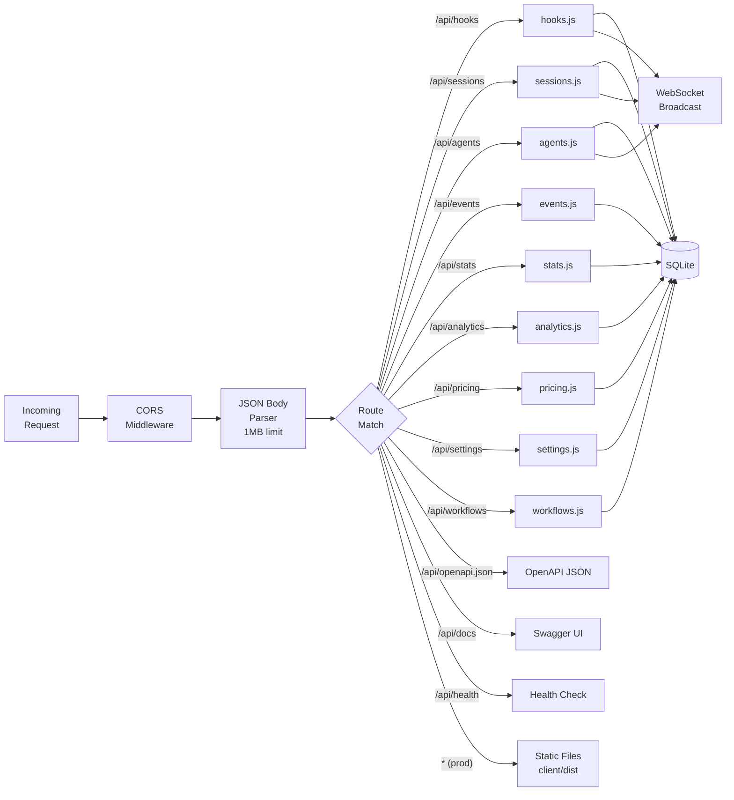

---

## Client Architecture

### Component Tree

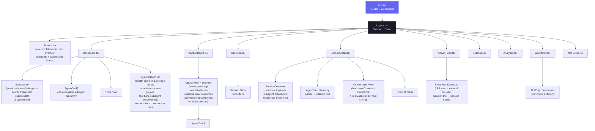

### Splash & loading UX

- **`SplashScreen.tsx`** — rendered by `App.tsx` as a fixed full-screen overlay alongside the router. Shows once per browser session (`sessionStorage` gate, read synchronously so a repeat mount never flashes). Time-aware greeting + localized tagline/subtexts (`splash` i18n namespace, en/zh/vi) + an animated node-graph brand mark on a dark backdrop (radial glow, drifting constellation, grain). The backdrop is **opaque from the first paint** (no entrance fade on the root) so the app rendered behind it never flashes through; only the inner content cascades in. Holds ~2.5 s, then fades out and unmounts; click-to-skip; honors `prefers-reduced-motion`. CSS-only keyframes, no added dependencies.
- **Loading skeletons** — the shared `Skeleton` primitive (`components/Skeleton.tsx`) uses Tailwind `animate-pulse`. `Analytics.tsx` now renders a pulsing `AnalyticsChartsSkeleton` for the whole chart region while `data` is null (previously it fell back to empty/zero charts).
- **`workflows/CompactionImpact.tsx`** — redesigned from a one-bar-per-session chart into a "sessions by compaction count" histogram (D3) with axis titles, stat tiles (total / sessions affected / avg / peak), an explanatory help line, a plain-English summary, and rich React-managed hover tooltips (full-height per-bucket hit-area + bar highlight) matching the other charts.
- **`Workflows.tsx` `Section`** — the right-aligned section subtitle is clamped to a single line (`truncate` + `max-w` + hover `title`) so a long translation never wraps and unbalances the header; the full text stays in the section's `i` popover.

### Self-hosted assets (no external CDN)

Nothing the dashboard or docs render is fetched from a third-party CDN at runtime — all fonts and scripts are served locally, so every surface works fully offline and leaks nothing to external hosts.

- **React app fonts** — Inter + JetBrains Mono are imported from `@fontsource` (latin subset) in `client/src/main.tsx`. Vite bundles the per-weight WOFF2 into `client/dist/assets/` with content hashes at build time; there is no Google Fonts `<link>`. Importing the `latin-*` subset entry points keeps the emitted set to one WOFF2 per weight.
- **Static pages (landing + wiki)** — load a self-hosted `@font-face` sheet at the repo-root `fonts/` directory (`fonts/fonts.css` + the `*.woff2` files). The root `index.html` references `fonts/fonts.css`; the wiki references `../fonts/fonts.css` (relative paths resolve under GitHub Pages).
- **Wiki Mermaid** — vendored as `wiki/mermaid.min.js` (the genuine minified `mermaid@10.9.6` from npm, with a provenance banner; `.prettierignore`d) and loaded via a local `<script>` instead of `cdn.jsdelivr.net`.
- **VS Code extension** — the inline `getErrorHtml()` error page dropped its Google Fonts loader for a system font stack (no bundler / local font path available in that webview).

Net effect: no `fonts.googleapis.com`, `fonts.gstatic.com`, or `cdn.jsdelivr.net` requests anywhere (verified by `git grep`).

### PWA Architecture

The project ships three independent Progressive Web Apps. Each has its own Web App Manifest and Service Worker, so the browser treats them as separate installable applications with isolated caches.

```
┌─────────────────────────────────────────────────────────────────┐
│                        PWA Surface Map                          │
├──────────────────┬──────────────────┬───────────────────────────┤
│   Dashboard      │   Landing Page   │         Wiki              │
│   (client/)      │   (root)         │         (wiki/)           │
├──────────────────┼──────────────────┼───────────────────────────┤
│ manifest.json    │ manifest.json    │ manifest.json             │
│ sw.js            │ sw.js            │ sw.js                     │
│ id: dashboard    │ id: landing      │ id: wiki                  │
├──────────────────┼──────────────────┼───────────────────────────┤
│ Precache:        │ Precache:        │ Precache:                 │
│ /, manifest,     │ index.html,      │ index.html, style.css,    │
│ favicon.svg      │ favicon, og-img, │ script.js, manifest,      │
│                  │ manifest         │ favicon                   │
│ Runtime cache:   │ Runtime cache:   │ Runtime cache:            │
│ JS/CSS bundles   │ screenshot PNGs  │ (all precached)           │
│ (cache-first)    │ (cache-first)    │                           │
│                  │                  │                           │
│ Skip: /api/*,    │ N/A              │ N/A                       │
│ /ws, __vite      │                  │                           │
│                  │                  │                           │
│ + Push notifs    │                  │                           │
│ (VAPID pipeline) │                  │                           │
└──────────────────┴──────────────────┴───────────────────────────┘
```

**Service Worker lifecycle (all three):**

1. **Install** → `skipWaiting()` — new SW activates immediately, no waiting for tabs to close.
2. **Activate** → old caches deleted (keyed by `CACHE_NAME`: `dashboard-v1`, `landing-v1`, `wiki-v1`). Bump the version string to force a cache bust.
3. **Fetch** → Navigation requests are network-first with offline fallback to cached HTML. Static assets are cache-first with runtime caching on miss.

**Dashboard SW specifics:** The fetch handler skips `/api/*`, `/ws`, and Vite HMR (`__vite`) URLs so live data and development tooling are never cached. Only responses with `response.type === "basic"` (same-origin) are stored. The existing push notification handlers (`push`, `notificationclick`) are preserved alongside the caching logic.

**Manifest icons:** All three manifests reference `favicon.svg` with `sizes="any"` and `type="image/svg+xml"` — supported in Chrome 107+, Firefox 110+, Edge 107+. Two icon entries per manifest: one with `purpose: "any"` and one with `purpose: "maskable"`.

**iOS meta tags:** All HTML files include `<meta name="apple-mobile-web-app-capable" content="yes">` and `<meta name="apple-mobile-web-app-status-bar-style" content="black-translucent">` for standalone home-screen mode on Safari.

### Client Module Graph

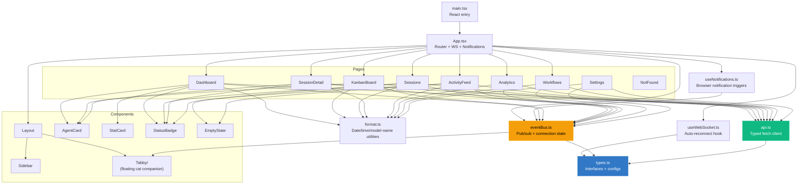

### Routing

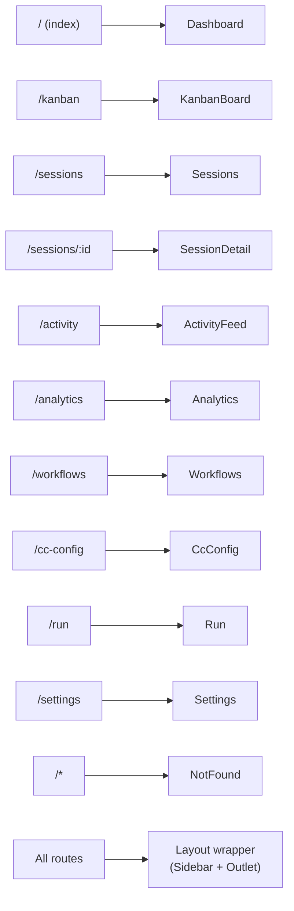

| Route           | Page          | Data Sources                                           |
| --------------- | ------------- | ------------------------------------------------------ |
| `/`             | Dashboard     | Two tabs (Monitor / Health). Monitor: `GET /api/stats`, `GET /api/agents`, `GET /api/events`, `GET /api/agents?session_id={sid}` (subagent hierarchy), dynamic item counts via `ResizeObserver`. Health: `GET /api/settings/info` + `GET /api/workflows` (5 s auto-refresh) — composite health score, storage donut, cache/error/success gauges, tool invocation bars, subagent effectiveness, model token distribution, compaction stats |
| `/kanban`       | KanbanBoard   | View toggle persisted in `localStorage`. Agents view: `GET /api/agents?status={each}` per-status (default 10000 cap). Sessions view: `GET /api/sessions?status={each}&limit=10000` per-status. Each column then paginates client-side at `COLUMN_PAGE_SIZE=10`; the WS subscription scopes to the active view. |
| `/sessions`     | Sessions      | `GET /api/sessions?status=&q=&limit=PAGE_SIZE&offset=page*PAGE_SIZE` — true server-side pagination. The search box passes `q` to the server (300 ms debounced). Response carries `total` for the paginator UI. Cost computation runs server-side over the visible page only. Polls `/api/run` (and listens for `run_status`) to badge any row whose session is currently being driven from `/run` with a clickable green **▶ Run** pill |
| `/sessions/:id` | SessionDetail | `GET /api/sessions/:id` (agents + events), `GET /api/sessions/:id/stats` (overview tiles, top tools, subagent breakdown, token totals — debounced live-refresh on `new_event`/`agent_*`/`session_updated`), `GET /api/sessions/:id/transcripts` (Conversation tab transcript list), `GET /api/sessions/:id/transcript` (cursor-paginated message stream, including inline `session_event` rename markers; optional `run_id` resolves a workflow inner agent's nested transcript). Probes `/api/run` (and listens for `run_status`) to surface a green "Open in Run page" banner when this session is currently being driven by an in-flight Run handle |
| `/activity`     | ActivityFeed  | `GET /api/events?limit=100` — click row to expand inline payload; "Session →" button navigates to `/sessions/:id` |
| `/analytics`    | Analytics     | `GET /api/analytics`                                   |
| `/workflows`    | Workflows     | `GET /api/workflows?status=active\|completed`, `GET /api/workflows/session/:id` + WebSocket auto-refresh (3s debounce) |
| `/cc-config`    | CcConfig      | 12-tab Claude Code configuration explorer. Reads via `GET /api/cc-config/{overview,skills,agents,commands,output-styles,plugins,marketplaces,mcp,hooks,hook-scripts,keybindings,statusline,settings,memory}`. Mutations for skills/agents/commands/output-styles/memory — including the per-project file-based auto-memory store (`*.md` under `~/.claude/projects/<slug>/memory/`, grouped by project and searchable in the Memory tab) — via `PUT /api/cc-config/file` + `DELETE /api/cc-config/file` (timestamped backups, atomic writes). `GET /api/cc-config/file?path=…` for single-file viewer. `GET /api/cc-config/backups` for the recovery modal. Subscribes to `cc_config_changed` WS messages for live refresh on both dashboard mutations and external file edits picked up by `cc-watcher`. The Settings tab leads with a client-side **Current configuration** summary that resolves the `/config` options (model, verbose, theme, output style, effort, auto-compact, notifications, …) across user / project / project-local scopes, showing defaults when unset. Live / Offline indicator next to the title |
| `/run`          | Run           | Spawns `claude` subprocesses with chat-style streaming UI. `GET /api/run/{binary,cwds,files}` for pre-flight + `@`-file autocomplete; `POST /api/run` to spawn (accepts `effort: low\|medium\|high`); `POST /api/run/:id/message` for follow-up turns; `DELETE /api/run/:id` to stop; `GET /api/run/:id?envelopes=1` for attach-with-history. WS messages: `run_stream` (includes `stream_event` deltas from `--include-partial-messages`), `run_status`, `run_input_ack`. Streaming pipeline: each WS envelope is dispatched through `flushSync` so React 18 doesn't batch bursts into a single render; a `useTypewriterEnvelopes` hook drips text/thinking deltas via `requestAnimationFrame` so even short replies type in; the merge code preserves `_streaming` and the delta-accumulated content array when claude's canonical `assistant` envelope arrives mid-stream so thinking blocks aren't dropped. Tier 1 TUI parity: collapsible-to-pill limitations banner, slash + `@`-file autocomplete (dropdowns open upward, slash matching uses tiered scoring), live token / context-window meter, status header. Live / Offline indicator next to the title |
| `/settings`     | Settings      | `GET /api/settings/info`, `GET /api/pricing`, `GET /api/pricing/cost` + `localStorage` for notification prefs |
| `/*`            | NotFound      | None (static 404 page)                                 |

### Activity Feed Interaction Model

The Activity Feed (`/activity`) separates two previously conflated interactions into distinct affordances:

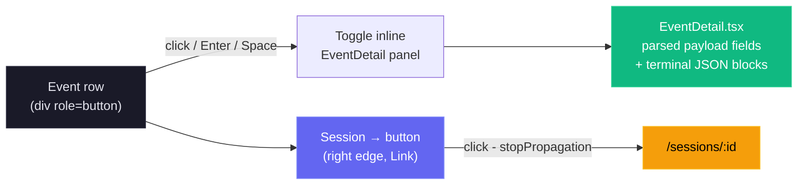

- **Row click** (anywhere except the Session button) toggles the `EventDetail` dropdown for the selected event. Chevron rotates 90° as a visual indicator.
- **Session → button** uses `e.stopPropagation()` to navigate to session details without triggering the expand toggle.
- Expanded state is tracked in a `Set<number>` (`expandedEvents`) allowing multiple rows to be open simultaneously.
- Keyboard accessible: `Enter` and `Space` on the row trigger expand; the Session button is a standard `<a>` element navigable by Tab.

### Workflows Page Architecture

The Workflows page (`/workflows`) is the most visualization-heavy page, composed of 12 child components in `client/src/components/workflows/`. Most D3.js rendering is done client-side using data from two API endpoints. The aggregate endpoint accepts an optional `?status=active|completed` query parameter to filter all workflow data by session status.

```mermaid
graph TD
    WF["Workflows.tsx<br/>Page orchestrator"]:::root
    API_AGG["GET /api/workflows?status=...<br/>Aggregate data (filterable)"]
    API_DI["GET /api/workflows/session/:id<br/>Session drill-in"]
    WS_D["WebSocket auto-refresh<br/>(3s debounce)"]

    WF --> API_AGG
    WF --> API_DI
    WS_D --> WF

    WF --> S1["WorkflowStats<br/>Summary cards"]
    WF --> S2["OrchestrationDAG<br/>Horizontal DAG —<br/>Sessions → Main → Subagents → Outcomes"]
    WF --> S3["ToolExecutionFlow<br/>d3-sankey tool transitions"]
    WF --> S4["AgentCollaborationNetwork<br/>Force-directed pipeline graph"]
    WF --> S5["SubagentEffectiveness<br/>SVG success rings +<br/>day-of-week sparklines"]
    WF --> S6["WorkflowPatterns<br/>Auto-detected sequences"]
    WF --> S7["ModelDelegationFlow<br/>Model → agent routing"]
    WF --> S8["ErrorPropagationMap<br/>React horizontal bars +<br/>API/session error support"]
    WF --> S9["ConcurrencyTimeline<br/>Swim-lane parallel execution"]
    WF --> S10["SessionComplexityScatter<br/>D3 bubble chart"]
    WF --> S11["CompactionImpact<br/>Token compression analysis"]
    WF --> S12["SessionDrillIn<br/>Searchable session explorer<br/>(3 tabs: tree / timeline / events)"]

    classDef root fill:#6366f1,stroke:#818cf8,color:#fff
```

| Component | Visualization | D3 Feature |
| --- | --- | --- |
| `OrchestrationDAG` | Horizontal DAG of aggregate spawning patterns | Custom DAG layout, capped at top 7 subagent types with overflow node |
| `ToolExecutionFlow` | Tool-to-tool transition Sankey diagram | `d3-sankey` |
| `AgentCollaborationNetwork` | Agent pipeline graph with directed edges | `d3-force` with arrowheads and frequency labels |
| `SubagentEffectiveness` | Scorecard grid with success rate rings | SVG arc rendering, day-of-week sparklines (Mon-Sun). Per-bar tooltip is rendered through `createPortal` to `document.body` and positioned with viewport-clamped fixed coordinates so it escapes the card's `overflow:hidden` (and any `hover:translate` containing block) and is never clipped by the card edge — fixes Sun/Sat/Mon/Fri visibility |
| `WorkflowPatterns` | Common orchestration sequences | Pattern detection from event data; clicking a row expands an inline detail panel with the full step chain, a stats grid, a deterministic narrative (shape buckets: solo / two-step / short / long; loop detection; frequency bucket: dominant > 50% / common > 25% / regular > 10% / niche), and a practical suggestion bucket. All copy is i18n-driven (`workflows.patterns.detail.*`) |
| `ModelDelegationFlow` | Model routing through agent hierarchies | Hierarchical layout |
| `ErrorPropagationMap` | Error clustering by hierarchy depth with API/session event errors | Pure React horizontal bars (replaced D3 bar chart), `eventErrors` support for API and session-level errors |
| `ConcurrencyTimeline` | Swim-lane parallel agent execution | Time-scaled horizontal bars |
| `SessionComplexityScatter` | Duration vs agents vs tokens | D3 bubble/scatter chart |
| `CompactionImpact` | Token compression events and recovery | Before/after comparison |
| `SessionDrillIn` | Per-session agent tree, tool timeline, events | Searchable dropdown with pagination, 3 tabs |

**Cross-filtering:** Clicking nodes in the OrchestrationDAG filters data in other sections. **JSON export:** All workflow data can be exported as JSON from the page header.

### Tooltip rendering strategy

Every chart in the Workflows page follows a single, deterministic tooltip pattern designed to avoid the failure modes of naive React tooltips (laggy mousemove re-renders, sticky tooltips after D3 re-renders, clipping by parent `overflow:hidden`):

- **One DOM-ref tooltip element per chart.** Each chart owns a single `<div ref={tipRef}>` that lives at the bottom of its render tree. D3 mouse handlers mutate that element's content imperatively (`textContent`, `appendChild`, inline `style`), so hovering never triggers a React re-render of the SVG.
- **No `mousemove` follow.** The tooltip is positioned once on `mouseenter` from the hovered element's `getBoundingClientRect()`, with viewport clamping (8 px margin) and an automatic flip below → above when there's no room. Position never updates as the cursor moves, which removes per-pixel state churn.
- **Container-level `mouseleave` fallback.** The chart's outer wrapper also calls `hideTip()` on leave. If a node-level handler is missed because D3 destroyed the element under the cursor on data refresh, the wrapper guarantees dismissal.
- **Re-render safety.** Each chart's render effect ends with `hideTip()` so any stale tooltip from before a websocket-driven refresh is cleared the moment new data arrives.
- **Fade transitions.** Tooltips stay in the DOM with `opacity: 0` and `pointer-events: none`, transitioning over 120 ms — show/hide feels smooth instead of flickering, and the element never intercepts pointer events that would prevent `mouseleave` from firing on the chart.
- **Portal escape for clipped containers.** `SubagentEffectiveness` cards use `overflow:hidden` plus a hover `translate` (which becomes the fixed-position containing block), so its sparkline tooltip is rendered with `react-dom.createPortal(…, document.body)` rather than as a child of the card. Coordinates are computed from the bar's bounding rect and clamped to the viewport, so the tooltip is visible on every day of the week regardless of the card's screen position.

### Structured info popovers

Two classes of explanatory popover sit on top of the chart layer, both i18n-driven:

- **Stat-card popovers** (`WorkflowStats.tsx`). Each of the six headline cards (Avg Agent Depth, Avg Subagents/Session, Agent Success Rate, Most Common Flow, Avg Compactions, Avg Duration) carries an info `i` icon at the bottom-right of the card. Hovering it opens a fixed-positioned, viewport-clamped popover with three sections: a value+label header, a "How it's calculated" paragraph (`workflows.stats.tooltip.calc.*`), and a "What this number means" paragraph that renders `"{value} {phrase} means {interpretation}"`. The interpretation comes from a deterministic, value-bucket function (`interp*`) — pure rule-based mapping with no AI generation, so the same input always yields the same explanation across all three locales.
- **Chart-section popovers** (`Workflows.tsx → ChartInfoPopover`). The `i` icon next to each section title (1–11) opens a structured "What this shows / How to read it / Why it matters" popover sourced from `workflows.chartInfo.<sectionKey>.*`. Each of the 11 charts has its own three-paragraph entry, fully translated to en/vi/zh.

Both popover classes use the same fixed-position + viewport-clamp algorithm: anchor right of the icon (or center for chart-section popovers), clamp to a viewport margin, and flip above when there isn't enough room below. They are never clipped by the sidebar, the right edge of the screen, or any ancestor's `overflow:hidden`.

---

## Internationalization Architecture

The client localization stack is powered by `i18next` + `react-i18next` (`client/src/i18n/index.ts`) and currently supports three languages: English (`en`), Chinese (`zh`), and Vietnamese (`vi`). Language detection prefers `localStorage` (`i18nextLng`) and falls back to the browser locale (`navigator`) with `en` as final fallback.

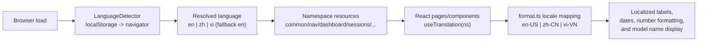

See [docs/I18N.md](docs/I18N.md) for resource strategy, key naming conventions, localization tests, troubleshooting, and rollout checklists.

**Coverage scope.** The translation layer extends end-to-end through the Workflows tooltip surfaces — `workflows.stats.tooltip.*` (calculation copy, deterministic value-bucket interpretations, metric phrases), `workflows.chartInfo.*` (per-chart "What / How to read / Why" entries for all 11 sections), `workflows.{orchestration,toolFlow,pipeline,modelDelegation,concurrency}.tooltip.*` (per-graph hover content), and `workflows.patterns.detail.*` (Workflow Patterns expansion narrative + suggestion buckets) — plus the Settings additions: `settings.pricing.tooltip.*` (pricing rule lookup, `%` wildcard syntax, manual-update reminder), `settings.claudeHome.*` (CLAUDE_HOME panel labels), and the full `settings.import.*` block (now translated to vi/zh, where the panel previously fell back to English).

---

## Database Design

### Entity Relationship Diagram

```mermaid
erDiagram
    sessions ||--o{ agents : has
    sessions ||--o{ events : has
    sessions ||--o{ token_usage : tracks
    agents ||--o{ events : generates
    agents ||--o{ agents : spawns

    sessions {
        TEXT id PK "UUID"
        TEXT name "Human-readable label"
        TEXT status "active|completed|error|abandoned"
        TEXT cwd "Working directory"
        TEXT model "Claude model ID"
        TEXT started_at "ISO 8601"
        TEXT ended_at "ISO 8601 or NULL"
        TEXT metadata "JSON blob"
        TEXT awaiting_input_since "ISO 8601 or NULL — set by waiting Notifications"
    }

    agents {
        TEXT id PK "UUID or session_id-main"
        TEXT session_id FK "References sessions.id"
        TEXT name "Main Agent — {session name} or subagent description"
        TEXT type "main|subagent"
        TEXT subagent_type "Explore|general-purpose|etc"
        TEXT status "working|waiting|completed|error"
        TEXT task "Current task description"
        TEXT current_tool "Active tool name or NULL"
        TEXT started_at "ISO 8601"
        TEXT ended_at "ISO 8601 or NULL"
        TEXT parent_agent_id FK "References agents.id"
        TEXT metadata "JSON blob"
        TEXT awaiting_input_since "ISO 8601 or NULL — main-agent waiting flag"
    }

    events {
        INTEGER id PK "Auto-increment"
        TEXT session_id FK "References sessions.id"
        TEXT agent_id FK "References agents.id"
        TEXT event_type "PreToolUse|PostToolUse|Stop|etc"
        TEXT tool_name "Tool that triggered the event"
        TEXT summary "Human-readable summary"
        TEXT data "Full event JSON"
        TEXT created_at "ISO 8601"
    }

    token_usage {
        TEXT session_id PK "FK to sessions + part of composite PK"
        TEXT model PK "Model identifier + part of composite PK"
        TEXT speed PK "standard or fast (fast mode) — pricing dimension"
        TEXT inference_geo PK "global or us (data residency) — pricing dimension"
        TEXT service_tier PK "standard or batch (Batch API) — pricing dimension"
        INTEGER input_tokens "Current JSONL total"
        INTEGER output_tokens "Current JSONL total"
        INTEGER cache_read_tokens "Current JSONL total"
        INTEGER cache_write_tokens "Total ephemeral cache writes (5m + 1h)"
        INTEGER cache_write_1h_tokens "Subset stored at the 1h tier; 5m = total - 1h"
        INTEGER web_search_requests "server_tool_use web search count"
        INTEGER web_fetch_requests "server_tool_use web fetch count"
        INTEGER code_execution_requests "server_tool_use code execution count"
        INTEGER baseline_input "Accumulated pre-compaction tokens (one per metric)"
    }

    model_pricing {
        TEXT model_pattern PK "SQL LIKE pattern e.g. claude-opus-4-6%"
        TEXT display_name "Human-readable name"
        REAL input_per_mtok "Cost per million input tokens"
        REAL output_per_mtok "Cost per million output tokens"
        REAL cache_read_per_mtok "Cost per million cache read tokens (cache hits)"
        REAL cache_write_per_mtok "Cost per million 5m cache-write tokens"
        REAL cache_write_1h_per_mtok "Cost per million 1h cache-write tokens"
        REAL fast_input_per_mtok "Fast-mode input rate (0 = none)"
        REAL fast_output_per_mtok "Fast-mode output rate (0 = none)"
        TEXT updated_at "ISO 8601"
    }

    push_subscriptions {
        TEXT endpoint PK "Subscription URL"
        TEXT p256dh "Public key"
        TEXT auth "Auth secret"
        TEXT created_at "ISO 8601"
    }

    alert_rules ||--o{ alert_events : fires

    alert_rules {
        TEXT id PK "UUID"
        TEXT name "User-facing rule name"
        TEXT rule_type "event_pattern|inactivity|status_duration|token_threshold"
        TEXT config "Type-specific JSON config"
        INTEGER enabled "1|0"
        INTEGER cooldown_seconds "Per-scope dedup window, default 300"
        TEXT created_at "ISO 8601"
        TEXT updated_at "ISO 8601"
    }

    alert_events {
        INTEGER id PK "Auto-increment"
        TEXT rule_id FK "References alert_rules.id, ON DELETE CASCADE"
        TEXT rule_name "Snapshot — survives rule edits"
        TEXT rule_type "Snapshot"
        TEXT session_id "No FK — alert history survives session cleanup"
        TEXT agent_id "Affected agent or NULL"
        TEXT message "Human-readable alert text"
        TEXT details "JSON context blob"
        TEXT triggered_at "ISO 8601"
        TEXT acknowledged_at "ISO 8601 or NULL"
    }

    webhook_targets ||--o{ webhook_deliveries : delivers

    webhook_targets {
        TEXT id PK "UUID"
        TEXT name "User-facing target name"
        TEXT type "provider key — slack|discord|teams|telegram|pagerduty|… (15)"
        TEXT url "Endpoint URL (may be '' when derived) — server-only, masked in responses"
        INTEGER enabled "1|0"
        TEXT secret "Generic-family HMAC-SHA256 signing secret or NULL"
        TEXT headers "Generic-family extra request headers (JSON) or NULL"
        TEXT rule_ids "JSON array scoping to rules, or NULL = all"
        TEXT config "Provider params JSON (routing_key, chat_id, …); secrets redacted in responses"
        TEXT created_at "ISO 8601"
        TEXT updated_at "ISO 8601"
    }

    webhook_deliveries {
        INTEGER id PK "Auto-increment"
        TEXT target_id FK "References webhook_targets.id, ON DELETE CASCADE"
        TEXT target_name "Snapshot"
        TEXT target_type "Snapshot"
        INTEGER alert_id "alert_events.id, NULL for test pings (no FK)"
        TEXT status "success|failed"
        INTEGER status_code "Last HTTP status or NULL"
        INTEGER attempts "Attempt-chain length"
        TEXT error "Failure reason or NULL"
        TEXT created_at "ISO 8601"
    }
```

### Indexes

| Index                  | Table    | Column(s)         | Purpose                        |
| ---------------------- | -------- | ----------------- | ------------------------------ |
| `idx_agents_session`   | agents   | `session_id`      | Fast agent lookup by session   |
| `idx_agents_status`    | agents   | `status`          | Kanban board column queries    |
| `idx_events_session`   | events   | `session_id`      | Session detail event list      |
| `idx_events_type`      | events   | `event_type`      | Filter events by type          |
| `idx_events_created`   | events   | `created_at DESC` | Activity feed ordering         |
| `idx_sessions_status`  | sessions | `status`          | Status filter on Sessions page and Kanban Sessions view |
| `idx_sessions_started` | sessions | `started_at DESC` | Default sort order             |
| `idx_alert_events_triggered` | alert_events | `triggered_at DESC` | Alert feed ordering      |
| `idx_alert_events_rule` | alert_events | `rule_id`        | Cooldown lookup per rule       |
| `idx_alert_events_session` | alert_events | `session_id`  | Per-session alert history      |
| `idx_webhook_deliveries_target` | webhook_deliveries | `target_id, created_at DESC` | Per-target delivery log + last-delivery lookup |
| `idx_webhook_deliveries_created` | webhook_deliveries | `created_at DESC` | Delivery-log pruning (newest 2000)  |

### SQLite Configuration

| Pragma         | Value  | Rationale                                                                  |
| -------------- | ------ | -------------------------------------------------------------------------- |
| `journal_mode` | `WAL`  | Concurrent reads during writes, better performance for read-heavy workload |
| `foreign_keys` | `ON`   | Referential integrity enforcement                                          |
| `busy_timeout` | `5000` | Wait up to 5s for write lock instead of failing immediately                |

### Prepared Statements

All queries use prepared statements (`db.prepare()`) for:

- **Security** -- parameterized queries prevent SQL injection
- **Performance** -- compiled once, executed many times
- **Reliability** -- syntax errors caught at startup, not runtime

Notable prepared statements include `findStaleSessions` (used by `SessionStart` to identify active sessions with no activity for a configurable number of minutes), `touchSession` (bumps `updated_at` on every event), and `reactivateSession` / `reactivateAgent` (used when a previously completed/abandoned session receives new work or stop events — Stop/SubagentStop reactivate completed/abandoned sessions to handle sessions imported before the server started).

---

## WebSocket Protocol

### Connection

- **Path:** `/ws`
- **Protocol:** Standard WebSocket (RFC 6455)
- **Heartbeat:** Server sends `ping` every 30 seconds; clients that don't `pong` are terminated

### Message Format

All messages are JSON with this envelope:

```typescript
{
  type: "session_created" | "session_updated" | "agent_created" | "agent_updated" | "new_event"
      | "alert_triggered" | "alert_updated" | "workflow_upserted";
  data: Session | Agent | DashboardEvent | AlertEvent | WorkflowRun;
  timestamp: string; // ISO 8601
}
```

### Message Flow

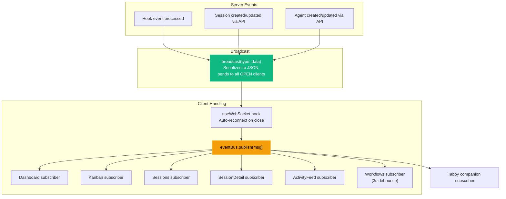

The **Tabby companion** (see [Tabby Companion Subsystem](#tabby-companion-subsystem)) is an additional read-only `eventBus` subscriber. It consumes the existing message envelope above and introduces **no new WebSocket message types** and no protocol changes.

### Client Reconnection

The `useWebSocket` hook implements automatic reconnection:

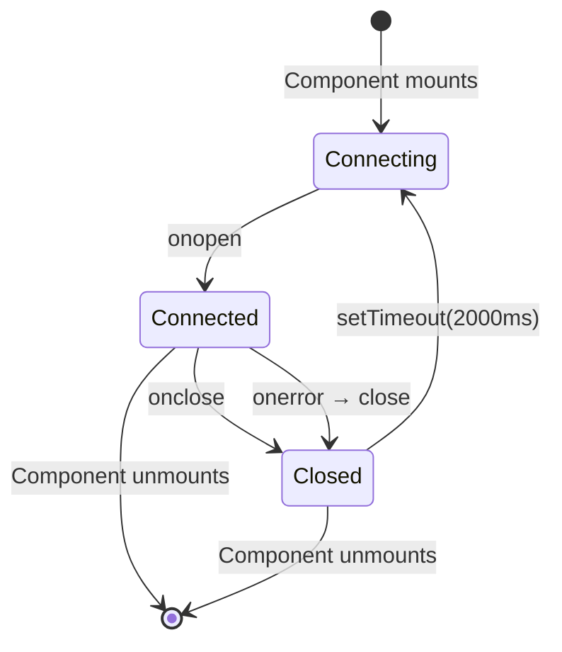

---

## Hook Integration

### Hook Handler Design

`scripts/hook-handler.js` is designed to be a minimal, fail-safe forwarder
that **fans out to every live dashboard** on the machine in parallel:

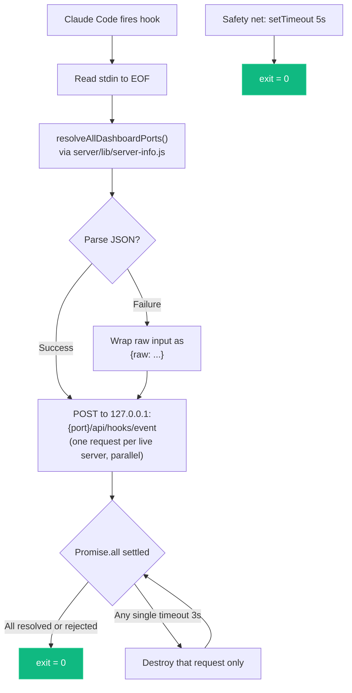

**Key design decisions:**

- Always exits 0 — never blocks Claude Code regardless of any server's state.
- 3-second HTTP timeout per target + 5-second process-wide safety net.
- Uses Node.js `http` module directly — no dependencies.
- Resolution order is **env override → discovery file → default**:
  - `CLAUDE_DASHBOARD_PORT` forces a single target (no fan-out, no discovery).
  - Otherwise `server/lib/server-info.js` reads `~/.claude/.agent-dashboard.json`, prunes dead-PID entries, and returns every live `port` for the handler to POST to in parallel.
  - If neither yields anything, the handler falls back to `4820`.
- Per-target promises never reject — a dead listener can't starve the others, and the handler can wait on `Promise.all` for clean exit timing.

### Hook Installation

`scripts/install-hooks.js` modifies `~/.claude/settings.json`:

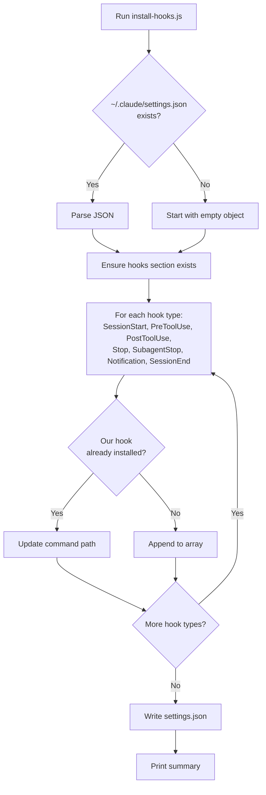

**Preserves existing hooks** -- only adds or updates entries containing `hook-handler.js`.

---

## Import Pipeline

The dashboard ships with a first-class **history importer** that backfills
sessions, agents, events, tokens, and costs from Claude Code JSONL
transcripts. Live hook ingestion and manual import share the exact same
parser (`parseSessionFile` + `importSession` in `scripts/import-history.js`),
which is the architectural contract that guarantees imported token and cost
values are identical to those captured in real time.

<p align="center">
  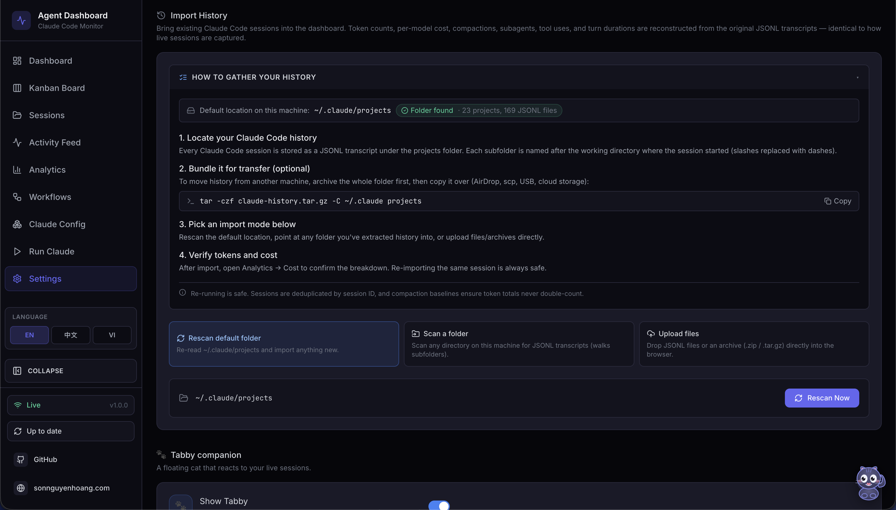
</p>

### Design goals

- **Accuracy by construction** — any code path that creates a session goes
  through a single `importSession` entry point. There is no "import math"
  distinct from "live math."
- **Idempotence** — re-importing the same source must never double-count.
  Session IDs are the dedup key; compaction `baseline_*` columns preserve
  pre-compaction token totals so re-ingesting a compacted transcript never
  shrinks historical cost.
- **Source flexibility** — users bring history from the default location,
  any folder, or a drag-dropped archive. A single generalized walker feeds
  the parser regardless of the source.
- **Safety** — archive extraction enforces path containment and an extraction
  size cap (zip/tar/gzip-bomb defense), and every request has its own
  staging directory reclaimed on both success and error paths.

### Component overview

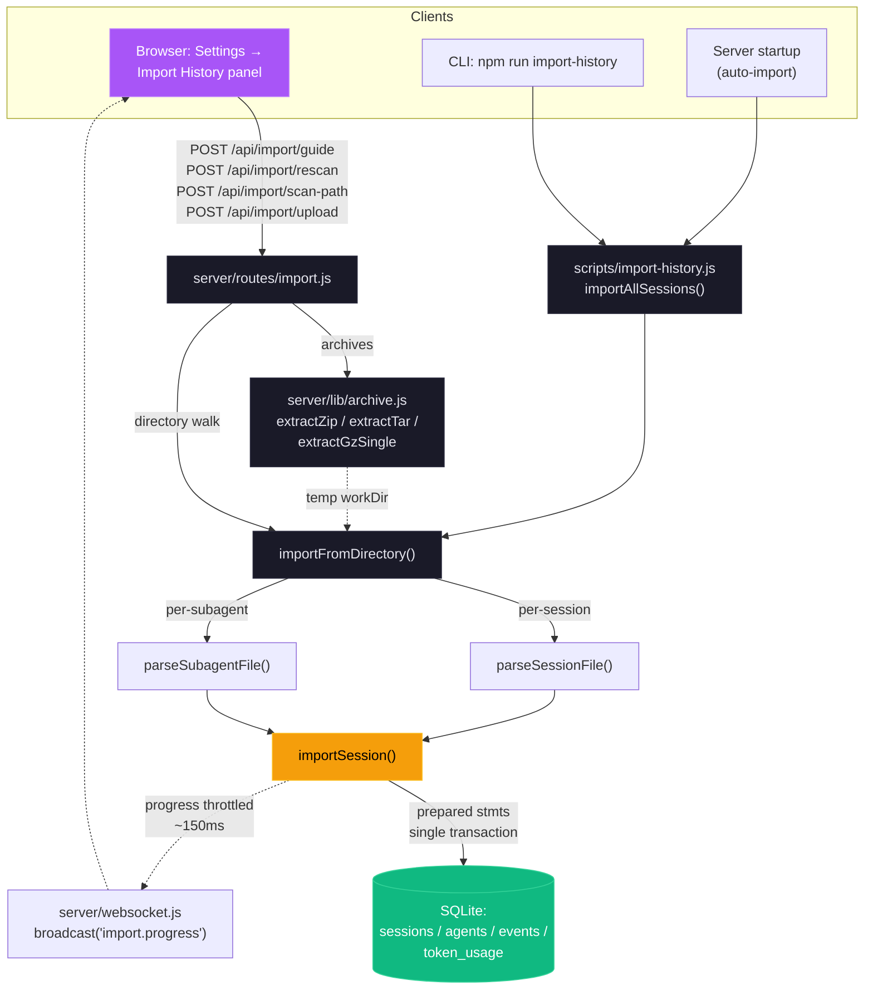

**Continuous background sync.** The startup auto-import
(`autoImportLegacySessions`) is a **one-time** backfill, marker-gated by
`.legacy-import.done` — so a project folder that appears *after* first launch,
and whose sessions never flow through hooks (e.g. a checkout run with host-only
hooks disabled), would otherwise stay invisible until a manual rescan. To close
that gap, `startSessionSync` (`server/index.js`) keeps `~/.claude/projects` in
sync through three triggers that share one `mtimeCache` and a single coalesced
sweep, the exported `syncDefaultProjects(dbModule, { mtimeCache })`:

1. **Immediate** — one sweep at startup, so a project the marker-gated backfill
   missed surfaces right away rather than after the first interval.
2. **Watcher** — a debounced `fs.watch` on the projects tree fires a sweep the
   instant a *new* session file or project folder appears (near-real-time, no
   poll wait). Events for files already in `mtimeCache` — active transcripts
   being appended to — are ignored, so a busy session never thrashes the
   importer. Recursive watching is used only on macOS/Windows (native, stable);
   on Linux, where Node's userland recursive watcher trips on the high-churn
   projects tree (same hazard `lib/cc-watcher.js` avoids), the root plus each
   immediate child folder are watched non-recursively instead.
3. **Poll** — a periodic safety-net sweep (watchers can miss events / not fire
   on network filesystems), tunable via `DASHBOARD_SESSION_SYNC_MS` (default
   30 s); `0` disables the poll but leaves the watcher running.

Each sweep re-parses **only** files whose mtime is new or has advanced (the
common "nothing changed" tick is just a handful of `stat` calls), funnels them
through the same `parseSessionFile` + `importSession` pipeline as every other
path, and broadcasts `session_created` for newly imported sessions /
`session_updated` for grown ones — the same events hooks emit, so the UI
refreshes live. All timers and watchers are `unref`'d and best-effort; nothing
here blocks shutdown or can take down the server.

### Upload request sequence

The upload path is the most complex of the three — it must accept multipart
data, extract archives safely, stage them on disk, then invoke the shared
importer. The sequence below captures the complete request/response path
including the failure modes explicitly guarded against.

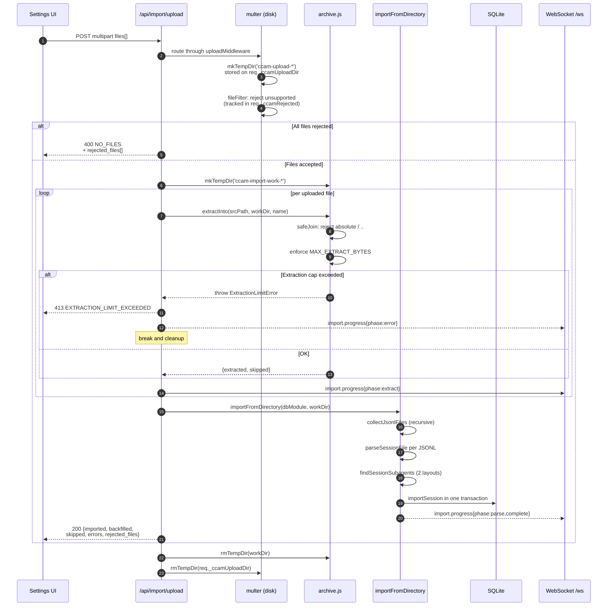

### Idempotence and cost accuracy

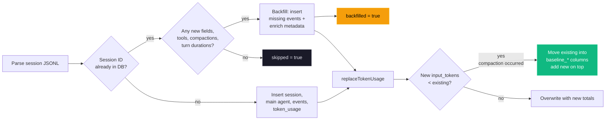

The `baseline_*` columns are why cost is **monotonic** with respect to
re-imports: the cost endpoint sums `input_tokens + baseline_input` (and
the matching `output`, `cache_read`, `cache_write` pairs) from the
`token_usage` table, so compacted sessions retain their pre-compaction
usage for billing purposes.

### Supported source layouts

| Layout                                          | Example                                      | Handling                                                                |
| ----------------------------------------------- | -------------------------------------------- | ----------------------------------------------------------------------- |
| Default Claude Code                             | `<proj>/<sid>.jsonl`                         | Session transcript                                                      |
| Default subagent                                | `<proj>/<sid>/subagents/agent-*.jsonl`       | Paired with parent on discovery                                         |
| Alternative subagent                            | `<proj>/subagents/<sid>/agent-*.jsonl`       | Paired with parent on discovery                                         |
| Workflow inner-agent (nested)                   | `<proj>/<sid>/subagents/workflows/<runId>/agent-*.jsonl` | Summarized by Workflow-run ingest; transcript resolved on read + preserved in the durable snapshot |
| Orphan subagent (no parent JSONL in source)     | `<proj>/subagents/<sid>/agent-*.jsonl`       | `importFromDirectory` probes both candidates; attaches if `sid` exists  |
| Flat JSONL drop                                 | `<root>/<sid>.jsonl`                         | Recognized as a loose session                                           |
| Archives (`.zip`, `.tar`, `.tar.gz`, `.tgz`)    | any of the above nested inside               | Extracted into a per-request temp dir, then walked by the same importer |
| Single-file gzip                                | `any.jsonl.gz`                               | Gunzipped in streaming mode with size cap                               |

### Safety model

| Threat                                      | Mitigation                                                                                           |
| ------------------------------------------- | ---------------------------------------------------------------------------------------------------- |
| Path traversal via archive entries          | `archive.safeJoin` resolves under the extraction root; any `..` or absolute path returns `null`      |
| Zip / tar / gzip bombs                      | `MAX_EXTRACT_BYTES` (default 4 GB) enforced by running byte counter; aborts with `ExtractionLimitError` |
| Per-file upload size abuse                  | multer `limits.fileSize = MAX_UPLOAD_BYTES` (default 1 GB)                                           |
| Too many files per request                  | multer `limits.files = MAX_UPLOAD_FILES` (default 2000)                                              |
| Unsupported file types                      | `fileFilter` drops them early and reports them in `rejected_files[]`                                 |
| Concurrent upload temp-dir collisions       | Per-request temp dir on `req._ccamUploadDir`; created in multer `destination`, cleaned in `finally`  |
| Arbitrary absolute path on `scan-path`      | Validated: must be absolute (after `~` expansion), exist, and be a directory                         |
| Relative / traversal paths on `scan-path`   | Rejected with `INVALID_INPUT`                                                                        |

### Environment variables

| Variable                          | Default     | Purpose                                                           |
| --------------------------------- | ----------- | ----------------------------------------------------------------- |
| `CCAM_IMPORT_MAX_BYTES`           | 1 GB        | Maximum size per uploaded file                                    |
| `CCAM_IMPORT_MAX_FILES`           | 2000        | Maximum files per upload request                                  |
| `CCAM_IMPORT_MAX_EXTRACT_BYTES`   | 4 GB        | Ceiling on total uncompressed bytes from any single archive       |

### WebSocket progress events

Every import emits `import.progress` messages on `/ws`. Messages are
throttled to at most one every ~150 ms to avoid flooding the channel on
multi-thousand-session imports; the terminal `complete` and `error` frames
are never throttled.

```json
{
  "type": "import.progress",
  "timestamp": "2026-04-18T15:48:34.123Z",
  "data": {
    "importId": "upload-1729264114000",
    "phase": "parse",
    "source": "upload",
    "processed": 184,
    "total": 512,
    "current": "/tmp/ccam-import-work-xyz/project/<uuid>.jsonl",
    "counters": { "imported": 120, "backfilled": 40, "skipped": 20, "errors": 4 }
  }
}
```

Phases: `start` → `scan` → `extract` (upload only) → `parse` →
`complete`, with `error` / `extract_error` replacing `complete` on failure.

---

## Workflow-Tool Run Ingestion

"Dynamic workflows" — the fleets of sub-agents spawned by the Claude Code
`Workflow` tool (and self-paced `/loop` runs) — are **invisible to hooks**.
Inner `agent()` calls emit no `PreToolUse`/`SubagentStop` events, so hook-based
ingestion can never see the fleet. Instead, everything is persisted on disk
under the launching session's transcript folder:

```
<projects>/<enc-cwd>/<sessionId>/
  workflows/
    scripts/<name>-wf_<runId>.js          # the workflow script — written at LAUNCH
    wf_<runId>.json                       # the run journal — written at COMPLETION
  subagents/
    workflows/<runId>/agent-<agentId>.jsonl  # inner-agent transcript (current builds — NESTED per run)
    agent-<agentId>.jsonl                    # flat layout — older builds / regular sub-agents
```

The run journal (`wf_<runId>.json`) is the first-class record: identity
(`runId`, `taskId`, `workflowName`), lifecycle (`status`, `startTime`,
`durationMs`, `defaultModel`), aggregates (`agentCount`, `totalTokens`,
`totalToolCalls`), `phases[]`, and `workflowProgress[]` — one entry per inner
agent with `agentId`, `agentType`, `model`, `state`, `label`, `phaseTitle`,
tokens, tool calls, duration, and previews. Critically,
`workflowProgress[].agentId` is the **exact** `agent-<agentId>.jsonl` basename,
so the workflow → inner-agent linkage is explicit. Current Claude Code builds
write that transcript **nested** under `subagents/workflows/<runId>/`; older
builds (and all regular sub-agents) write it **flat** under `subagents/`. Both
layouts are resolved on read — see "Reading full agent text in the UI" below.

### The terminal-journal constraint

`wf_<runId>.json` is written **only when the workflow finishes**. While a run
is in flight, its live state lives in a per-run dir
`subagents/workflows/<runId>/`: a streaming `journal.jsonl` (a `started` /
`result` event per inner agent) and the growing `agent-<id>.jsonl` transcripts.
The ingester handles both phases:

- **Completed runs** are ingested in full from the terminal journal: a
  `workflows` row (keyed by `run_id`) plus linked inner-agent rows, with phases
  and per-agent labels.
- **Running runs** (no terminal journal yet) are ingested **live** by
  `ingestLiveWorkflow`: it reads `journal.jsonl` for each agent's started/done
  state + result, and parses the live `agent-<id>.jsonl` transcripts (via
  `parseSubagentFile`) for real-time per-agent tokens, tool calls, duration, and
  model. It synthesizes a `progress[]` so the UI shows live activity
  (phase/label aren't known until the terminal journal lands). The run is
  `status: running` and **replaced by the terminal journal on completion**
  (idempotent upsert by `run_id`; launch time preserved). A launch script with
  no run dir yet falls back to a minimal `running` row.

### Ingestion module and triggers

`server/lib/workflow-ingest.js` (`ingestWorkflowsForSession`) reuses the
import pipeline's `parseSubagentFile` and `importSubagentFromJsonl`, so inner
agents become agent rows under the **same** `${sessionId}-jsonl-<agentId>` id
scheme the subagent importer already uses — ingestion therefore **converges**
with any prior subagent import (no duplicate rows). Each inner agent is stamped
with `agents.workflow_run_id` + `agents.workflow_phase`. The per-agent table in
the UI is read from the journal's `progress[]` JSON.

**Cost folding.** Inner agents are sidechain contexts whose token usage is NOT
in the parent transcript (the same reason `combineSessionTokens` *adds*
subagent tokens). So the fleet's real token split — parsed from each
`agent-<id>.jsonl` — is written into the session's `token_usage` under a
namespaced `service_tier = 'workflow'` bucket. That bucket is isolated from the
main-transcript writer's rows (which use the real tier), so the two never
collide or clobber, while `calculateCost` still sums them per model. The write
is a full recompute each ingest → `replaceTokenUsage`'s replace semantics make
it idempotent (no double-count across re-ingests).

Ingestion runs from four fail-safe, off-the-response-path triggers:

1. **Live** — `routes/hooks.js`, on `Stop` / `SubagentStop` / `SessionEnd`
   (the lifecycle hooks that bracket a workflow finishing).
2. **Real-time poll** — `startWorkflowPoll` (`server/index.js`) scans active
   sessions every ~12 s, skipping any whose workflow artifacts are unchanged.
   The newest-mtime fingerprint (`workflowsMaxMtime`) includes the **live**
   `journal.jsonl` + `agent-*.jsonl` of any in-flight run (bounded to runs
   without a terminal journal), so the poll re-ingests as a running workflow's
   tokens/tools/agents grow — the UI updates live without waiting for a hook or
   completion. Tunable via `DASHBOARD_WORKFLOW_POLL_MS` (0 disables).
3. **Periodic** — the `server/index.js` maintenance sweep, scanning active
   sessions' `workflows/` directories (flips `running` → `completed` when a
   journal lands without a subsequent hook).
4. **Backfill** — a one-time pass in `autoImportLegacySessions` ingests
   historical on-disk workflows for every recorded session.

Each ingest that changes anything broadcasts `workflow_upserted` and a
`session_updated` (so the cost views refetch) over WebSocket. Runs surface via
`GET /api/workflows/runs` (list) and `GET /api/workflows/runs/:runId` (detail
with linked agents + events), and are attached to the launching session via the
`workflows[]` field on `GET /api/sessions/:id`. The UI shows them in a
"Workflow Runs" panel on the Workflows page and a subsection on Session Detail.

### Reading full agent text in the UI

The run journal only carries **truncated** `promptPreview` / `resultPreview`
strings (Claude Code truncates them with a trailing `…`), so the panel alone can
never show an inner agent's complete prompt or result. The full text lives in the
per-agent `agent-<agentId>.jsonl` transcript, which the dashboard surfaces
on demand:

- **Dual-layout resolution.** `server/lib/claude-home.js` exposes
  `resolveAgentTranscriptInDir(subagentsDir, agentId, runId?)`, used by all three
  sub-agent path resolvers (`getSubagentTranscriptPath`,
  `findSubagentTranscriptPath`, `getSnapshotSubagentTranscriptPath`). It checks
  the **flat** path first (so regular sub-agents resolve exactly as before), then
  the **nested** `workflows/<runId>/` path. When `runId` is known the run dir is
  read directly; when it is unknown the nested tree is scanned and a match is
  returned only if **exactly one** run contains that `agentId` — an ambiguous id
  across runs resolves to `null` rather than guessing.
- **`run_id` query param.** `GET /api/sessions/:id/transcript` accepts an
  optional `run_id=wf_<…>` alongside `agent_id`, threaded into the resolver chain
  so a workflow inner agent's nested transcript is found deterministically. The
  endpoint shape is unchanged; the param is additive.
- **Lazy fetch on expand.** The Workflow Runs panel
  (`client/src/components/workflows/WorkflowRunsPanel.tsx`) fetches the transcript
  the first time a result row is expanded (deduped per `${run_id}::${agentId}`),
  derives prompt + result via `extractPromptResult`, and renders the full text —
  falling back to the journal teaser while loading, on error, or for schema-mode
  agents whose final turn is a tool call rather than text. Nothing is eagerly
  ingested into the DB. "Full text" means the complete message body up to the
  endpoint's per-message 10,240-char cap (`limit` ≤ 200 messages).
- **Durable snapshot.** The snapshot writer (`snapshotTranscript` in
  `scripts/import-history.js`) preserves nested workflow transcripts via the
  dedicated `findSessionWorkflowSubagents` discovery — mirroring the live
  `subagents/workflows/<runId>/` subpath into the snapshot dir — so the full text
  still resolves after Claude Code prunes the live files under its
  `cleanupPeriodDays` retention. This is kept **separate** from
  `findSessionSubagents` (flat sub-agents) so the regular sub-agent import path is
  unchanged and nested inner-agents are never double-counted.

### Schema

A `workflows` table (`run_id` PK, `session_id` FK `ON DELETE CASCADE`, status
as an open string, `phases`/`progress` as JSON blobs, `source` = `journal` |
`live`) plus two additive `agents` columns (`workflow_run_id`,
`workflow_phase`). No existing table, response shape, or WebSocket message type
changes.

---

## Agent Extension Layer

The repository includes a triple extension strategy:

- Claude Code-native extensions (`CLAUDE.md`, `.claude/rules`, `.claude/skills`)
- Codex-native extensions (`AGENTS.md`, `.codex/rules`, `.codex/agents`, `.codex/skills`)
- Plugin marketplace (`plugins/`, `.claude-plugin/marketplace.json`) — 10 plugins with 53 skills, 14 agents, 30 slash commands, 3 CLI tools
- Codex-native extensions (`AGENTS.md`, `.codex/rules`, `.codex/agents`, `.codex/skills`)

```mermaid
graph TD
    USER["Developer"] --> CLAUDE["Claude Code"]
    USER --> CODEX["Codex"]

    CLAUDE --> C_MEM["CLAUDE.md"]
    CLAUDE --> C_RULES[".claude/rules/*"]
    CLAUDE --> C_SKILLS[".claude/skills/*"]
    CLAUDE --> C_PLUGINS["plugins/<br/>10 plugins, 53 skills"]

    CODEX --> X_MEM["AGENTS.md"]
    CODEX --> X_RULES[".codex/rules/*.rules"]
    CODEX --> X_AGENTS[".codex/agents/*.toml"]
    CODEX --> X_SKILLS[".codex/skills/*"]

    style C_PLUGINS fill:#8b5cf6,stroke:#a78bfa,color:#fff
```

### Claude Code extension scope

- `CLAUDE.md` defines always-on project working agreements.
- `.claude/rules/` adds path-scoped guidance by file area.
- `.claude/skills/` provides reusable workflows:
  - onboarding
  - feature shipping
  - MCP operations
  - live issue debugging
- `.claude/agents/` provides specialized review workers:
  - backend reviewer
  - frontend reviewer
  - MCP reviewer
- `plugins/` provides distributable plugin marketplace (see [Plugin Marketplace](#plugin-marketplace)):
  - ccam-analytics (session reports, cost analysis, usage trends, productivity scoring)
  - ccam-productivity (standups, weekly reports, sprint summaries, workflow optimization)
  - ccam-devtools (session debugging, hook diagnostics, data export, health checks)
  - ccam-insights (pattern detection, anomaly alerting, optimization, session comparison)
  - ccam-dashboard (status checks, quick stats, MCP integration)
  - ccam-cost-guard (budget guardrails, week/month-end spend forecasting, cost-threshold alerts, model-routing savings)
  - ccam-sessions (session forensics: search, timeline, transcript replay, per-cwd rollup, cleanup)
  - ccam-workflows (multi-agent orchestration & fleet intelligence: DAG map, delegation audit, concurrency, error propagation, fleet runs)
  - ccam-quality (reliability & SLOs: error scan, API-error report, hook-failure audit, SLO check, regression alert)
  - ccam-config (Claude Code config & memory governance: config audit, memory review, skill/MCP/hook inventory)

### Codex extension scope

- `AGENTS.md` provides project-wide default behavior.
- `.codex/rules/default.rules` controls external execution decisions.
- `.codex/agents/` provides custom subagent templates.
- `.codex/skills/` provides reusable task workflows.

---

## Plugin Marketplace

The repository includes an official Claude Code plugin marketplace with ten production-ready plugins. These extend Claude Code itself (not just the dashboard) with skills, agents, slash commands, hooks, CLI tools, and MCP integration — all deeply grounded in the actual dashboard data model. The five original plugins (ccam-analytics, ccam-productivity, ccam-devtools, ccam-insights, ccam-dashboard) were each deepened with more agents/skills and a `commands/` dir of slash commands, and five new plugins were added: **ccam-cost-guard** (budget guardrails — set budgets, forecast week/month-end spend, cost-threshold alerts, model-routing savings, with a fail-safe Stop hook), **ccam-sessions** (session forensics — search, timeline, transcript replay, per-cwd rollup, cleanup), **ccam-workflows** (multi-agent orchestration & fleet intelligence — DAG map, delegation audit, concurrency, error propagation, fleet runs, built on the 11-dataset workflow intelligence API), **ccam-quality** (reliability & SLOs — error scan, API-error report, hook-failure audit, SLO check, regression alert), and **ccam-config** (Claude Code config & memory governance — config audit, memory review, skill/MCP/hook inventory via the Config Explorer API).

### Marketplace Architecture

```mermaid
graph TD
    subgraph Marketplace[".claude-plugin/marketplace.json"]
        M["Marketplace Manifest"]
    end

    subgraph Plugins["plugins/"]
        A["ccam-analytics<br/>4 skills, 1 agent, 1 CLI"]
        P["ccam-productivity<br/>4 skills, 1 agent"]
        D["ccam-devtools<br/>4 skills, 1 agent, 2 CLIs"]
        I["ccam-insights<br/>4 skills, 1 agent"]
        C["ccam-dashboard<br/>2 skills, MCP config"]
        G["ccam-cost-guard<br/>5 skills, 1 agent, Stop hook"]
        S["ccam-sessions<br/>5 skills, 1 agent"]
        W["ccam-workflows<br/>5 skills, 1 agent"]
        Q["ccam-quality<br/>5 skills, 1 agent"]
        F["ccam-config<br/>5 skills, 1 agent"]
    end

    subgraph API["Dashboard API (port 4820)"]
        STATS["/api/stats"]
        ANALYTICS["/api/analytics"]
        PRICING["/api/pricing/cost"]
        WORKFLOWS["/api/workflows/session/:id"]
        SESSIONS["/api/sessions"]
    end

    M --> A & P & D & I & C & G & S & W & Q & F
    A & P & I --> ANALYTICS & PRICING & WORKFLOWS
    D --> STATS & SESSIONS
    C --> STATS & ANALYTICS
    G --> PRICING & ANALYTICS
    S --> SESSIONS
    W --> WORKFLOWS
    Q --> STATS & SESSIONS
    F --> STATS

    style M fill:#6366f1,stroke:#818cf8,color:#fff
    style A fill:#10b981,stroke:#34d399,color:#fff
    style P fill:#f59e0b,stroke:#fbbf24,color:#000
    style D fill:#ef4444,stroke:#f87171,color:#fff
    style I fill:#8b5cf6,stroke:#a78bfa,color:#fff
    style C fill:#06b6d4,stroke:#22d3ee,color:#000
    style G fill:#ec4899,stroke:#f472b6,color:#fff
    style S fill:#14b8a6,stroke:#2dd4bf,color:#000
    style W fill:#a855f7,stroke:#c084fc,color:#fff
    style Q fill:#f43f5e,stroke:#fb7185,color:#fff
    style F fill:#3b82f6,stroke:#60a5fa,color:#fff
```

### Plugin Structure

Each plugin follows the official Claude Code plugin specification:

```
plugins/ccam-{name}/
├── .claude-plugin/
│   └── plugin.json              # Manifest: name, version, description, author
├── skills/
│   └── {skill-name}/
│       └── SKILL.md             # Skill definition with $ARGUMENTS placeholder
├── agents/
│   └── {agent-name}.md          # Agent: model, tools, instructions
├── hooks/
│   └── hooks.json               # Event hooks (fail-safe, non-blocking)
├── bin/
│   └── {cli-tool}               # Executable scripts (added to PATH)
├── .mcp.json                    # MCP server configuration (optional)
└── settings.json                # Plugin settings (optional)
```

Skills are namespaced: `/ccam-analytics:session-report`, `/ccam-productivity:daily-standup`, etc.

### Plugin Catalog

| Plugin | Skills | Agent | CLI Tools | Hooks |
|--------|--------|-------|-----------|-------|
| **ccam-analytics** | `session-report`, `cost-breakdown`, `usage-trends`, `productivity-score` | `analytics-advisor` | `ccam-stats` | Stop, SubagentStop |
| **ccam-cost-guard** | `budget-set`, `spend-forecast`, `cost-alert`, `model-savings`, `daily-budget-check` | `budget-sentinel` | — | Stop |
| **ccam-productivity** | `daily-standup`, `weekly-report`, `sprint-summary`, `workflow-optimizer` | `productivity-coach` | — | SessionStart, SessionEnd |
| **ccam-devtools** | `session-debug`, `hook-diagnostics`, `data-export`, `health-check` | `issue-triager` | `ccam-doctor`, `ccam-export` | — |
| **ccam-insights** | `pattern-detect`, `anomaly-alert`, `optimization-suggest`, `session-compare` | `insights-advisor` | — | — |
| **ccam-sessions** | `session-search`, `session-timeline`, `transcript-replay`, `cwd-rollup`, `session-cleanup` | `session-investigator` | — | — |
| **ccam-workflows** | `dag-map`, `delegation-audit`, `concurrency-report`, `error-propagation`, `fleet-runs` | `orchestration-analyst` | — | — |
| **ccam-quality** | `error-scan`, `api-error-report`, `hook-failure-audit`, `slo-check`, `regression-alert` | `reliability-engineer` | — | — |
| **ccam-config** | `config-audit`, `memory-review`, `skill-inventory`, `mcp-audit`, `hook-inventory` | `config-auditor` | — | — |
| **ccam-dashboard** | `dashboard-status`, `quick-stats` | — | — | — |

**Totals**: 10 plugins, 53 skills, 14 agents, 30 slash commands, 3 CLI tools, 3 hook configurations, 1 MCP config. Each plugin is installable via `claude plugin install <name>@hoangsonww-claude-code-agent-monitor`, and a server test (`server/__tests__/plugins-marketplace.test.js`) validates the marketplace↔directory bijection plus every `plugin.json`, agent, skill, and command.

### Data Model Grounding

Every skill and agent references the actual dashboard API response shapes:

| Data Source | Key Fields Used by Plugins |
|-------------|---------------------------|
| Token tracking | `input_tokens`, `output_tokens`, `cache_read_input_tokens`, `cache_creation_input_tokens` + 4 `baseline_*` columns (preserve pre-compaction data) |
| Cost engine | `(tokens / 1M) × rate_per_mtok` for each type; longest `model_pattern` match wins; pre-seeded Opus/Sonnet/Haiku rates |
| Session metadata | `thinking_blocks`, `turn_count`, `total_turn_duration_ms`, `usage_extras` (`{ service_tiers[], speeds[], inference_geos[] }`) |
| Event types | `PreToolUse`, `PostToolUse`, `Stop`, `SubagentStop`, `SessionStart`, `SessionEnd`, `Notification`, `Compaction`, `APIError`, `TurnDuration`, `ToolError`, `Interrupted` |
| Workflow intelligence | 11 datasets per session: `stats`, `orchestration` (DAG), `toolFlow` (transitions), `effectiveness`, `patterns`, `modelDelegation`, `errorPropagation` (by depth), `concurrency` (lanes), `complexity` (score), `compaction` (impact), `cooccurrence` (agent pairs) |
| Agent hierarchy | Recursive CTE with `parent_agent_id`, `subagent_type`, depth tracking |

### Key Derived Metrics

Plugins compute these from raw API data:

- **Cache efficiency**: `cache_read / (cache_read + input)` — trending up = improving prompt reuse
- **Compaction pressure**: `sum(baseline_*) / sum(effective_tokens)` — high = frequent context overflow
- **Tool success rate**: `PostToolUse count / PreToolUse count` — should be ~1.0; gap = tool failures
- **Turn velocity**: `turn_count / (total_turn_duration_ms / 1000)` — turns per second
- **Cost per completed session**: `total_cost / completed_sessions`

### Installation

```bash
# Marketplace install
claude plugin marketplace add hoangsonww/Claude-Code-Agent-Monitor
claude plugin install ccam-analytics@hoangsonww-claude-code-agent-monitor

# Local development testing
claude --plugin-dir plugins/ccam-analytics
```

Full documentation: [`docs/plugins.md`](docs/PLUGINS.md)

---

## MCP Integration

The repository includes an enterprise-grade local MCP server in `mcp/` that exposes dashboard functionality as tools for MCP hosts such as Claude Code and Claude Desktop. It supports three transport modes: stdio (for MCP host child-process integration), HTTP+SSE (for remote/networked clients), and an interactive REPL (for operator debugging).

### MCP Transport Selection

```mermaid
flowchart TD
    START["MCP Server Start"] --> ARG{"CLI arg or env?"}
    ARG -->|"--transport=stdio\nor default"| STDIO["stdio transport\nJSON-RPC over stdin/stdout"]
    ARG -->|"--transport=http\nor --http"| HTTP["HTTP + SSE transport\nExpress on :8819"]
    ARG -->|"--transport=repl\nor --repl"| REPL["Interactive REPL\nreadline with tab completion"]

    STDIO --> HOST["MCP Host\n(Claude Code / Desktop)"]
    HTTP --> ENDPOINTS["Endpoints:\n/mcp (Streamable HTTP)\n/sse (Legacy SSE)\n/messages (Legacy POST)\n/health (status)"]
    REPL --> CLI["Operator Terminal\ncolored output, JSON highlighting\ntool invocation, domain browsing"]

    style STDIO fill:#6366f1,stroke:#818cf8,color:#fff
    style HTTP fill:#f59e0b,stroke:#fbbf24,color:#000
    style REPL fill:#a855f7,stroke:#c084fc,color:#fff
```

### MCP Runtime Topology

```mermaid
graph LR
    HOST["MCP Host<br/>(Claude Code / Claude Desktop)"]
    HTTP_CLIENT["Remote MCP Client"]
    OPERATOR["Operator CLI"]

    MCP_STDIO["MCP Server<br/>stdio"]
    MCP_HTTP["MCP Server<br/>HTTP+SSE :8819"]
    MCP_REPL["MCP Server<br/>REPL"]

    API["Dashboard API<br/>http://127.0.0.1:4820/api/*"]
    DB["SQLite"]

    HOST -->|"stdin/stdout"| MCP_STDIO
    HTTP_CLIENT -->|"POST /mcp · GET /sse"| MCP_HTTP
    OPERATOR -->|"interactive CLI"| MCP_REPL

    MCP_STDIO -->|"validated HTTP"| API
    MCP_HTTP -->|"validated HTTP"| API
    MCP_REPL -->|"validated HTTP"| API
    API --> DB

    style HOST fill:#6366f1,stroke:#818cf8,color:#fff
    style HTTP_CLIENT fill:#f59e0b,stroke:#fbbf24,color:#000
    style OPERATOR fill:#a855f7,stroke:#c084fc,color:#fff
    style MCP_STDIO fill:#0f766e,stroke:#14b8a6,color:#fff
    style MCP_HTTP fill:#0f766e,stroke:#14b8a6,color:#fff
    style MCP_REPL fill:#0f766e,stroke:#14b8a6,color:#fff
    style API fill:#339933,stroke:#5cb85c,color:#fff
    style DB fill:#003B57,stroke:#005f8a,color:#fff
```

### MCP Module Architecture

```mermaid
graph TD
    ENTRY["src/index.ts<br/>(transport router)"]
    SERVER["src/server.ts"]
    CONFIG["config/app-config.ts"]
    CLIENT["clients/dashboard-api-client.ts"]
    CORE["core/*<br/>logger, tool-registry, tool-result"]
    POLICY["policy/tool-guards.ts"]
    TOOLS["tools/index.ts"]
    DOMAINS["tools/domains/*<br/>observability, sessions, agents,<br/>events, pricing, maintenance"]

    T_HTTP["transports/http-server.ts<br/>Express SSE + Streamable HTTP"]
    T_REPL["transports/repl.ts<br/>readline + tab completion"]
    T_COLL["transports/tool-collector.ts<br/>handler collection for REPL"]
    UI["ui/*<br/>banner, colors, formatter"]

    ENTRY --> CONFIG
    ENTRY --> SERVER
    ENTRY --> T_HTTP
    ENTRY --> T_REPL
    ENTRY --> T_COLL
    SERVER --> TOOLS
    TOOLS --> DOMAINS
    DOMAINS --> CLIENT
    DOMAINS --> POLICY
    DOMAINS --> CORE
    T_HTTP --> UI
    T_REPL --> UI
```

### MCP Safety Model

- API target is restricted to loopback hosts only (`127.0.0.1`, `localhost`, `::1`)
- Tool inputs are schema-validated with zod before execution
- Mutating tools require `MCP_DASHBOARD_ALLOW_MUTATIONS=true`
- Destructive tools additionally require `MCP_DASHBOARD_ALLOW_DESTRUCTIVE=true` and explicit confirmation token
- Logging is written to `stderr` only so stdio protocol traffic is never corrupted

### MCP Tool Domains

- Observability: health/stats/analytics/system/export/snapshot
- Sessions: list/get/create/update
- Agents: list/get/create/update
- Events: list + hook event ingestion
- Pricing: rule CRUD + total/per-session cost
- Maintenance: cleanup/reimport/reinstall-hooks/clear-data (guarded)

---

## State Management

### Client-Side Architecture

The client uses a deliberately simple state management approach:

```mermaid
graph TD
    subgraph "Data Sources"
        REST["REST API<br/>(initial load + refresh)"]
        WSM["WebSocket Messages<br/>(real-time updates)"]
        LS["localStorage<br/>(notification prefs)"]
    end

    subgraph "Distribution"
        EB["eventBus<br/>(Set-based pub/sub)"]
    end

    subgraph "App-Level Hooks"
        NOTIF_H["useNotifications<br/>reads prefs, fires<br/>browser notifications"]
        TABBY_H["useTabbyBrain<br/>derives cat mood +<br/>speech from WS stream"]
    end

    subgraph "Page State"
        US1["useState<br/>Dashboard"]
        US2["useState<br/>KanbanBoard"]
        US3["useState<br/>Sessions"]
        US4["useState<br/>SessionDetail"]
        US5["useState<br/>ActivityFeed"]
        US6["useState<br/>Analytics"]
        US8["useState<br/>Workflows"]
        US7["useState<br/>Settings"]
    end

    REST --> US1 & US2 & US3 & US4 & US5 & US6 & US8 & US7
    WSM --> EB
    EB --> US1 & US2 & US3 & US4 & US5 & US6 & US8 & US7
    EB --> NOTIF_H
    EB --> TABBY_H
    LS --> NOTIF_H
    LS --> TABBY_H
    LS --> US7
```

**Why no Redux / Zustand / Context:**

- Each page owns its data and lifecycle
- No cross-page state sharing needed (notification prefs use `localStorage` as the shared store)
- WebSocket events trigger reload or append, not complex state merging
- Simpler mental model, fewer abstraction layers, easier to debug

### Event Bus

The `eventBus` is a Set-based pub/sub with `subscribe()` returning an unsubscribe function. It also tracks WebSocket connection state, exposing `connected` (boolean getter), `setConnected(value)`, and `onConnection(handler)` so any component can subscribe to connection status changes.

```typescript
// Subscribe to messages in useEffect, unsubscribe on cleanup
useEffect(() => {
  return eventBus.subscribe((msg) => {
    if (msg.type === "agent_updated") load();
  });
}, [load]);

// Read connection state reactively (e.g. with useSyncExternalStore)
const wsConnected = useSyncExternalStore(eventBus.onConnection, () => eventBus.connected);
```

This pattern ensures:

- No memory leaks (cleanup on unmount)
- No stale closures (subscribe with latest callback ref)
- Only active pages receive messages
- Connection state is available to any component without prop drilling

---

## Browser Notification System

The dashboard implements a robust notification system using the Web Push API (VAPID) and Service Workers, allowing for reliable delivery even when the browser is backgrounded or closed.

### Notification Architecture

```mermaid
graph TD
    subgraph "Server Side"
        API_P["Push API<br/>(/api/push/*)"]
        WP["web-push lib<br/>(VAPID)"]
        DB_P["push_subscriptions<br/>table"]
        KEYS["vapid-keys.json<br/>(persisted)"]
    end

    subgraph "Client Side"
        SW["Service Worker<br/>(sw.js)"]
        PUSH["useNotifications hook<br/>(subscribes via SW)"]
        PREFS["localStorage<br/>(event preferences)"]
        BROWSER["Browser Push Service<br/>(FCM/Mozilla/Safari)"]
    end

    API_P --> WP
    WP -->|signed push| BROWSER
    BROWSER --> SW
    SW -->|showNotification| USER["Developer"]
    PUSH -->|subscribe| SW
    PUSH -->|POST /subscribe| API_P
    API_P --> DB_P
    WP -->|read keys| KEYS

    style SW fill:#f59e0b,stroke:#fbbf24,color:#000
    style BROWSER fill:#10b981,stroke:#34d399,color:#fff
```

### Key Components

| Component | Responsibility |
| --- | --- |
| **VAPID Pipeline** | Uses the `web-push` library on the server. VAPID keys are auto-generated on first run and persisted to `data/vapid-keys.json` to ensure subscription continuity. |
| **Service Worker** | Located at `client/public/sw.js`. It runs independently of the dashboard tab, listening for `push` events from the browser's push service. It handles `notificationclick` to focus/open the dashboard. |
| **macOS Audio Support** | Notifications are explicitly sent with `silent: false` and `sound: "default"`. This overrides macOS behavior that would otherwise suppress audio for web notifications. |
| **Subscription Management** | The dashboard registers the service worker and requests a `PushSubscription`. This subscription (endpoint and keys) is stored in the `push_subscriptions` table, indexed by endpoint. |
| **Event Routing** | When a WebSocket event (e.g., `session_created`) is broadcast, the server also triggers `sendPushToAll()`, which iterates through active subscriptions and sends signed VAPID payloads. |

### Notification Flow

```mermaid
flowchart TD
    EVENT["Server Event<br/>(e.g. SessionStart)"] --> PREFS{"User Prefs<br/>Enabled?"}
    PREFS -->|No| SKIP[Skip]
    PREFS -->|Yes| SUBS["Fetch all subscriptions<br/>from DB"]
    SUBS --> LOOP["For each subscription:"]
    LOOP --> SEND["webpush.sendNotification()"]
    SEND --> BROWSER["Browser Push Service"]
    BROWSER --> SW["Service Worker"]
    SW --> SHOW["showNotification(title, body)<br/>silent: false"]

    style SHOW fill:#10b981,stroke:#34d399,color:#fff
```

### Preference Storage

Notification preferences remain in `localStorage` (`agent-monitor-notifications`) for UI-side filtering, while the actual push delivery is managed by the server-side subscription store.

| Preference | UI Key | Logic |
| --- | --- | --- |
| Master Toggle | `enabled` | Controls whether the subscription is active |
| New Session | `onNewSession` | Filtered during push fan-out |
| Session Error | `onSessionError` | Filtered during push fan-out |
| Session Complete | `onSessionComplete` | Filtered during push fan-out |
| Subagent Spawn | `onSubagentSpawn` | Filtered during push fan-out |

### Service Worker Caching

The dashboard's Service Worker (`client/public/sw.js`) serves dual purposes: push notification delivery (described above) and runtime caching. The fetch handler is split by URL shape so a rebuild can never leave a user stuck on a stale UI:

- **Cache-first** for `/assets/*` — Vite emits content-hashed filenames, so a given URL is immutable for the lifetime of that build. Cached aggressively for fast warm starts; old entries simply never get re-requested when a new build ships different hashes.
- **Network-first with cache fallback** for everything else (navigations, the SW itself, `manifest.json`, icons, root `/`). The user always gets the freshest UI while online; the cache is only consulted when the network fails.
- **Bypass** for `/api/*`, `/ws`, and Vite HMR (`__vite`) — these are never cached.

Cache versioning is controlled by the `CACHE_NAME` constant (`dashboard-v2`). On activate, any caches whose key doesn't match are deleted, so bumping the version string forces a clean refresh. `skipWaiting()` + `clients.claim()` ensure the new SW takes over immediately.

`client/src/main.tsx` snapshots `navigator.serviceWorker.controller` before registration and listens for `controllerchange`: when a new SW activates on an already-controlled page, it reloads exactly once so the page picks up the new asset URLs without a hard refresh. The first install (no previous controller) does **not** reload.

These behaviors are reinforced by explicit `Cache-Control` headers from the production Express static middleware in `server/index.js`: `immutable, max-age=31536000` for `/assets/*`; `no-cache, must-revalidate` for `index.html`, `sw.js`, and `manifest.json`; a short revalidation window for other static files. The SPA fallback `sendFile` sends the same `no-cache` header. The native desktop shell (macOS and Windows) loads the dashboard from this same in-process server (`NODE_ENV=production`), so it inherits the policy automatically.

---

## Update Notifier Subsystem

The Update Notifier is a **detection-only** subsystem that tells the user when the dashboard's git checkout is behind its tracked upstream branch. It never mutates the checkout or restarts the server — those actions are intentionally left to the user in a terminal, because a process cannot reliably replace itself without an external supervisor.

<p align="center">
  
</p>

### Module Layout

```mermaid
graph TD
    subgraph Server
        LIB["update-check.js<br/>getUpdatesStatus"]
        SCHED["update-scheduler.js<br/>startUpdateScheduler"]
        ROUTE["routes/updates.js<br/>GET status, POST check"]
        WS["websocket.js<br/>broadcast update_status"]
    end

    subgraph Client
        API["lib/api.ts<br/>api.updates"]
        BUS["lib/eventBus.ts<br/>subscribe and publish"]
        MODAL["UpdateNotifier.tsx<br/>dismissedSha in localStorage"]
        SIDEBAR["Sidebar.tsx<br/>Check-for-updates button"]
    end

    SCHED -->|tick every 5 min| LIB
    ROUTE -->|on request| LIB
    SCHED -->|fingerprint changed| WS
    ROUTE -->|on POST check| WS
    WS -->|update_status frame| API
    API -->|mirror to bus| BUS
    WS --> BUS
    BUS --> MODAL
    BUS --> SIDEBAR
    SIDEBAR -->|click| API
    MODAL -->|click| API

    style WS fill:#6366f1,stroke:#818cf8,color:#fff
    style LIB fill:#10b981,stroke:#34d399,color:#fff
```

### Detection Pipeline

```mermaid
sequenceDiagram
    autonumber
    participant Sched as Scheduler
    participant Lib as update-check lib
    participant Git as git
    participant WS as WebSocket broadcast
    participant Client as Modal and Sidebar

    Sched->>Lib: tick
    Lib->>Lib: check .git exists
    alt not a git repo
        Lib-->>Sched: soft payload, git_repo false
    else git repo
        Lib->>Git: git remote, pick upstream then origin
        alt no remotes configured
            Lib-->>Sched: soft payload, no remotes message
        else
            Lib->>Git: git fetch canonical remote, 120s timeout
            alt fetch fails
                Lib-->>Sched: soft payload with fetch_error
            else
                Lib->>Git: rev-parse HEAD and canonical ref
                Lib->>Git: rev-list --count HEAD..ref
                Lib->>Git: read current branch and its tracked upstream
                Lib-->>Sched: full payload with situation and manual_command
            end
        end
    end
    Sched->>Sched: compute fingerprint
    alt fingerprint changed
        Sched->>WS: broadcast update_status
        WS->>Client: WS frame
        Client->>Client: syncFromPayload, render modal or badge
    else unchanged
        Sched->>Sched: skip broadcast
    end
```

### Component Responsibilities

| Component | Responsibility |
| --- | --- |
| **`server/lib/update-check.js`** | Pure function `getUpdatesStatus(root?, { skipFetch? })`. Runs every git call via `execFile` (no shell, 10s–120s timeouts). **Branch- and fork-aware:** prefers `upstream` over `origin` when both exist (standard fork convention), resolves `<remote>/master`/`/main`/`/HEAD`, reads the current branch and its tracked upstream, and shapes `manual_command` per situation: `git pull --ff-only` only when the local branch tracks the canonical ref; `git fetch <remote> && git merge --ff-only <ref>` for forks (local branch name matches canonical but tracks a different remote); `git fetch <remote>` only on a feature branch or detached HEAD. Non-git installs, missing remotes, fetch failures, and unresolvable upstream refs are returned as soft payloads — never throws. Adds `situation`, `situation_note`, `canonical_remote`, `current_branch`, `tracking_upstream`, and `tracks_canonical` to the response. |
| **`server/update-scheduler.js`** | Ticks the lib every `DASHBOARD_UPDATE_CHECK_INTERVAL_MS` (default 300 000, floor 60 000). First tick is scheduled 8s after server start with `.unref()` so it doesn't block shutdown. Broadcasts only when the fingerprint `{update_available, remote_sha, commits_behind, fetch_error, manual_command}` changes — `manual_command` is included so situation transitions (e.g. user switches branches, or adds an `upstream` remote) trigger a re-broadcast even when the SHA and commit count are unchanged. Emits a framed message to stdout on "up-to-date → behind" transitions, and only suggests "restart the dashboard" when the printed command actually rewrites the working tree. `DASHBOARD_UPDATE_CHECK=0\|false\|off` disables the scheduler entirely. |
| **`server/routes/updates.js`** | Two endpoints: `GET /status` (read-only check), `POST /check` (check + broadcast). Mounted under `/api/*`, so they ride the default loopback bind as their trust boundary and are gated by `DASHBOARD_TOKEN` when one is set. There is **no** `POST /apply` route. |
| **`UpdateNotifier.tsx`** | Modal. Hydrates from `api.updates.status()` on mount and mirrors the payload back into the local `eventBus` so the Sidebar can listen without a second git fetch. Subscribes to `update_status` WS frames for ongoing sync. Keeps `dismissedSha` in `localStorage` (`agent-monitor-update-dismissed-sha`) and in React state; a window event `dashboard:reset-update-dismissal` from the Sidebar clears both. ESC / backdrop click dismisses. |
| **`Sidebar.tsx`** | Always-visible "Check for updates" button in the footer. Subscribes to `update_status` (no own fetch). On click: clears dismissed SHA in localStorage, dispatches `dashboard:reset-update-dismissal`, then calls `api.updates.check()`. Visual state: emerald badge when `update_available`, amber when `fetch_error`, neutral otherwise. |

### Payload Shape

```ts
interface UpdateStatusPayload {
  git_repo: boolean;
  update_available: boolean;
  repo_root?: string;
  remote_ref?: string | null;          // "upstream/master" | "origin/main" | ...
  canonical_remote?: string | null;    // "upstream" preferred, else "origin"
  current_branch?: string | null;      // null on detached HEAD
  tracking_upstream?: string | null;   // e.g. "origin/feature/foo", null if no upstream
  tracks_canonical?: boolean;          // true when branch upstream === remote_ref
  situation?:                          // categorical hint for the UI
    | "tracking_canonical"
    | "fork_or_diverged_tracking"
    | "feature_branch"
    | "detached_head";
  situation_note?: string | null;      // human-readable explanation when not tracking_canonical
  local_sha?: string | null;
  remote_sha?: string | null;
  commits_behind?: number;
  manual_command?: string | null;      // shaped for the user's situation
  message?: string | null;
  fetch_error?: string;                // set when git fetch fails
}
```

The same shape is used by `GET /status`, `POST /check`, and the `update_status` WS message.

### Failure Mode Matrix

| Condition | Returned payload | User-visible effect |
| --- | --- | --- |
| Not a git clone | `{git_repo:false, update_available:false, message:"Install directory is not a git clone..."}` | Modal suppressed (`update_available` false). Sidebar stays neutral. |
| No remotes configured | `{git_repo:true, update_available:false, message:"No git remotes configured..."}` | Same as above. |
| `git fetch` failed (offline, auth) | `{git_repo:true, update_available:false, canonical_remote, fetch_error:"<stderr>"}` | Sidebar button goes amber; modal stays suppressed until a successful check. |
| Canonical default branch unresolvable | `{git_repo:true, update_available:false, canonical_remote, message:"Could not resolve <remote>/master..."}` | Modal suppressed. |
| Healthy, up to date | `{git_repo:true, update_available:false, commits_behind:0, situation:"tracking_canonical"\|...}` | Sidebar neutral, modal suppressed. |
| Healthy, behind, on canonical branch | `{update_available:true, situation:"tracking_canonical", manual_command:"...git pull --ff-only..."}` | Modal opens with `git pull` flow + restart hint. |
| Healthy, behind, fork (origin = fork, upstream = canonical) | `{update_available:true, situation:"fork_or_diverged_tracking", manual_command:"...git fetch upstream && git merge --ff-only upstream/master..."}` | Modal opens with merge flow + restart hint + `situation_note` explaining the divergence. |
| Healthy, behind, on a feature branch | `{update_available:true, situation:"feature_branch", manual_command:"...git fetch <remote>"}` | Modal opens; `situation_note` explains the user is off the canonical branch; restart hint suppressed because the working tree isn't being changed. |

### Why Detection-Only

The dashboard does not expose an apply/restart endpoint by design. A process cannot reliably replace itself without an external supervisor, and several real constraints make an in-process self-update path strictly worse than letting the user run two commands in a terminal:

- **Supervisor ambiguity.** `npm run dev` (concurrently), `npm start`, `pm2`, `systemd`, `launchd`, and Docker each need different restart logic; an in-process helper could only encode one of them and would silently mis-restart the rest.
- **Silent failures.** `npm install` / `npm run build` / port-release timing issues surface as a dead server with no user-facing feedback once the original process has exited.
- **No rollback.** A partial pull + install leaves a broken checkout with no atomic recovery — the working tree is mutated mid-flight.
- **Branch coverage.** Even with the situation-aware `manual_command` produced by the detection layer, an automatic apply would still need branch-aware integration (rebase vs merge vs switch) and merge-conflict handling. That belongs in the user's shell, not in a background daemon.

The detection layer carries all of the signal value: the dashboard tells the user *when* to update and *exactly what to run*; the user owns the *how* in their own shell.

---

## Tabby Companion Subsystem

Tabby is a **client-only** floating cat companion that reacts to live session activity. It is purely additive UI: there is **no server/backend code**, **no new API routes**, **no new WebSocket message types**, and **no database changes**. Tabby reuses the existing real-time event stream (the same `eventBus` every page already consumes) and the existing **Run** page for its "ask a real question" path. The entire subsystem lives under `client/src/components/Tabby/`.

The design follows a strict **pure-core / hook / presentational** split: a framework-free brain (a `WSMessage` reducer plus a mood state machine with an injected clock and zero side effects) is fully unit-tested in isolation, a single React hook is the only consumer of the global `eventBus` and the only owner of timers and side effects, and the SVG/markup components are pure presentational views driven by props.

### Module Layout

```mermaid
graph TD
    subgraph "Pure Core (framework-free, unit-tested)"
        BRAIN["brain.ts<br/>reduceTabby reducer +<br/>deriveMood state machine<br/>(injected clock, no side effects)"]
        INTENTS["intents.ts<br/>local Q&A over cached status;<br/>unmatched → Run handoff"]
        QUIPS["quips.ts<br/>mood → phrase pools"]
        PREFS["prefs.ts<br/>localStorage enabled/muted<br/>(cross-tab sync)"]
    end

    subgraph "Hook (only eventBus consumer)"
        HOOK["useTabbyBrain.ts<br/>wires brain to real timers<br/>(idle/sleep/stuck), speech-bubble<br/>queue, mute, clear-alerts"]
    end

    subgraph "Presentational (pure)"
        SHELL["Tabby.tsx<br/>shell: open/closed state,<br/>⌘B / Esc, reduced-motion,<br/>navigation"]
        AVATAR["CatAvatar.tsx<br/>SVG cat; data-mood drives CSS;<br/>cursor-tracking pupils"]
        BUBBLE["SpeechBubble.tsx<br/>bubble"]
        PANEL["TabbyPanel.tsx<br/>status + quick actions + Ask box"]
        CSS["tabby.css<br/>keyframes + per-mood expressions"]
    end

    BUS["lib/eventBus.ts<br/>(existing WS stream)"]

    BUS --> HOOK
    HOOK --> BRAIN
    HOOK --> QUIPS
    HOOK --> PREFS
    SHELL --> HOOK
    SHELL --> INTENTS
    SHELL --> AVATAR & BUBBLE & PANEL
    AVATAR --> CSS

    style BRAIN fill:#10b981,stroke:#34d399,color:#fff
    style BUS fill:#f59e0b,stroke:#fbbf24,color:#000
    style HOOK fill:#6366f1,stroke:#818cf8,color:#fff
```

### Data Flow

```mermaid
flowchart LR
    WSS["Server WebSocket<br/>broadcast"] --> UWS["useWebSocket"]
    UWS --> PUB["eventBus.publish"]
    PUB --> SUB["useTabbyBrain<br/>(subscriber)"]
    SUB --> DERIVED["derived state<br/>{ mood, status, bubble }"]
    DERIVED --> AVATAR["CatAvatar"]
    DERIVED --> BUBBLE["SpeechBubble"]
    DERIVED --> PANEL["TabbyPanel"]
    PANEL -->|"unmatched Ask"| RUN["/run?prompt=…<br/>(existing Run page)"]

    style PUB fill:#f59e0b,stroke:#fbbf24,color:#000
    style RUN fill:#10b981,stroke:#34d399,color:#fff
```

The mood state machine in `deriveMood` resolves to a single expression using a fixed priority order: `disconnected > worried > stuck > happy > thinking > watching > sleeping > idle`. The resolved mood is written to a `data-mood` attribute on the SVG cat, and `tabby.css` maps each mood to its keyframe animation and expression.

### Component Responsibilities

| Component | Responsibility |
| --- | --- |
| **`brain.ts`** | Pure, framework-free core. Exposes a `WSMessage` reducer (`reduceTabby`) and a mood state machine (`deriveMood`) with the priority order `disconnected > worried > stuck > happy > thinking > watching > sleeping > idle`. The clock is injected and there are zero side effects, so the brain is fully unit-tested in isolation. |
| **`useTabbyBrain.ts`** | The **only** consumer of the global `eventBus`. Wires the pure brain to real timers (idle / sleep / stuck), the speech-bubble queue, mute, and clear-alerts. Produces the derived `{ mood, status, bubble }` the presentational components render. |
| **`CatAvatar.tsx`** | Pure presentational SVG cat. The `data-mood` attribute drives CSS; pupils track the cursor. |
| **`SpeechBubble.tsx`** | Pure presentational speech bubble. |
| **`TabbyPanel.tsx`** | Pure presentational panel: status readout + quick actions + the Ask box. |
| **`Tabby.tsx`** | Shell component. Mounted once in `client/src/components/Layout.tsx` as a sibling of `UpdateNotifier`. Owns open/closed state, the `⌘B` / `Esc` shortcuts, reduced-motion detection, and navigation. |
| **`intents.ts`** | Pure local Q&A over the cached status snapshot. Queries that don't match a local intent become a handoff to the existing Run page via `/run?prompt=…`. |
| **`quips.ts`** | Pure mood → phrase pools. |
| **`prefs.ts`** | `localStorage`-backed enabled / muted preferences with cross-tab sync. |
| **`tabby.css`** | Keyframes and per-mood expressions; selected via the `data-mood` attribute. |

### Touchpoints Outside the Folder

Tabby's only contact with the rest of the app is four light, additive touchpoints — nothing in the server, database, or WebSocket protocol changes:

| File | Touchpoint |
| --- | --- |
| `client/src/components/Layout.tsx` | Mounts `<Tabby />` once, as a sibling of `<UpdateNotifier />`. |
| `client/src/pages/Settings.tsx` | On/off toggle wired to `tabbyPrefs` (`localStorage`). |
| `client/src/pages/Run.tsx` | Reads `?prompt=` to prefill the prompt box for Tabby's Ask handoff. |
| `client/src/i18n/locales/{en,zh,vi}/settings.json` | `tabby.*` strings for the Settings toggle (en / zh / vi). |

---

## VS Code Extension Architecture

The **Claude Code Agent Monitor** VS Code extension provides an integrated monitoring experience directly within the editor. It communicates with the local dashboard server via standard HTTP APIs and renders the dashboard UI in a webview.

<p align="center">
  
</p>

### Extension Components

| Component | Responsibility |
| --- | --- |
| **Extension Host** (`extension.js`) | Manages the extension lifecycle, registers commands, creates the status bar item, and coordinates the webview panel. |
| **Sidebar Provider** (`sidebar.js`) | Implements the `TreeDataProvider` for the Activity Bar. It performs background polling of the dashboard APIs (`/api/stats`, `/api/analytics`, `/api/sessions`) every 5 seconds. |
| **Status Bar Item** | Provides a persistent "Pulse" indicator in the VS Code status bar, showing active session and agent counts. |
| **Webview Panel** | A native VS Code tab that renders the dashboard React application. It supports deep linking to specific sessions or sub-pages. |

### Data Flow

```mermaid
graph TD
    subgraph "VS Code Process"
        SB[Status Bar]
        SIDE[Sidebar TreeView]
        WV[Webview Panel]
    end

    subgraph "Extension Host"
        EH[extension.js]
        SP[sidebar.js]
    end

    subgraph "Dashboard Server (localhost)"
        API["/api/stats<br/>/api/analytics<br/>/api/sessions"]
        DS[Express Server]
    end

    SIDE -->|Poll 5s| SP
    SP -->|HTTP GET| API
    EH -->|HTTP GET| API
    SB -->|Pulse| EH
    WV -->|Iframe src| DS
```

### Key Implementation Details

1. **Auto-Detection**: The extension checks both port `5173` (Vite dev server) and `4820` (Production server) on `localhost`. It prioritizes the production port for API data but can render the UI from either.
2. **Real-time Status**: The `SidebarProvider` uses a background loop with `onDidChangeTreeData` to automatically toggle between **Online** and **Offline** states as the local server starts or stops.
3. **Deep Linking**: Commands like `claude-code-agent-monitor.openDashboard` accept arguments (e.g., a session ID or page path like `analytics`) to route the webview to specific views within the React SPA.
4. **Theme Awareness**: The Activity Bar icon (`icon.svg` or `apple-touch-icon.png`) and sidebar icons use VS Code's `ThemeIcon` and `ThemeColor` to ensure they adapt to Light, Dark, and High Contrast themes.

For the extension source code, refer to the [vscode-extension/](./vscode-extension/) directory.

> [!TIP]
> Extension on VS Code Marketplace: [Claude Code Agent Monitor](https://marketplace.visualstudio.com/items?itemName=hoangsonw.claude-code-agent-monitor)

---

## Desktop App Architecture (macOS & Windows / Electron)

The `desktop/` workspace ships the dashboard as a **native desktop app** for **macOS** (`Claude Code Monitor.app`, distributed as a `.dmg`) **and Windows** (`Claude Code Monitor.exe`, distributed as an NSIS installer plus a no-install portable build). It is an Electron shell that **embeds the existing Express server in-process** and renders the already-built React client in a `BrowserWindow`. The desktop app does not reimplement the dashboard -- it `require()`s `server/index.js` directly, in the same Node runtime as the Electron main process, and points a Chromium window at it.

For the user-facing guide (download, install, Gatekeeper / SmartScreen, tray menu, auto-start), see [DESKTOP.md](./DESKTOP.md). For the full contributor/architecture reference -- including build performance, code signing, notarization, and CI details -- see [desktop/README.md](./desktop/README.md).

### Workspace Position

`desktop/` is a **sibling workspace**, not an npm-workspaces conversion. It has its own `package.json`, its own `node_modules`, and its own TypeScript toolchain. It pins **Electron 35** (bundled Node 22.16). It consumes the rest of the repo as plain files and touches no other workspace's runtime behavior.

```mermaid
flowchart TD
    subgraph repo["Claude-Code-Agent-Monitor (repo root)"]
        server["server/<br/>Express API · SQLite · WebSocket"]
        client["client/<br/>React + Vite SPA"]
        scripts["scripts/<br/>hook installer/handler, import, seed"]
        mcp["mcp/<br/>local MCP server"]
        vscode["vscode-extension/"]
        desktop["desktop/<br/>Electron shell (sibling workspace)"]
    end

    desktop -->|"require() in-process"| server
    desktop -->|"loads built SPA from"| client
    desktop -->|"auto-installs hooks via"| scripts
    server -->|"serves static"| client

    style desktop fill:#1f6feb,stroke:#1158c7,color:#fff
    style server fill:#238636,stroke:#196c2e,color:#fff
```

The **only** change outside `desktop/` is a behavior-preserving refactor of `server/index.js` (see [Background Services & Hook Bootstrap](#background-services--hook-bootstrap-1) below). `client/`, `scripts/`, `mcp/`, and `vscode-extension/` are untouched.

### Process Model

Electron runs a **main process** (Node.js) and one or more **renderer processes** (Chromium). In this app:

- The **main process** hosts the embedded Express server _and_ manages the window, tray, and menus. There is **no child process and no IPC** for the server -- it runs inside the main process's own event loop.
- The **renderer** is plain Chromium loading `http://127.0.0.1:<port>` -- exactly the same origin a normal browser would use. `preload.ts` is intentionally empty (`contextIsolation: true`, `nodeIntegration: false`, `webSecurity: true`), so the renderer has **zero privileged surface**.

```mermaid
flowchart LR
    subgraph main["Electron Main Process (Node 22 / Electron 35)"]
        boot["main.ts<br/>lifecycle"]
        host["server-host.ts<br/>embedded server"]
        express["server/index.js<br/>Express + WS + SQLite"]
        tray["tray.ts"]
        menu["menu.ts"]
        host --> express
        boot --> host
        boot --> tray
        boot --> menu
    end

    subgraph renderer["Renderer Process (Chromium)"]
        win["BrowserWindow<br/>React dashboard"]
        preload["preload.ts<br/>(empty -- no bridge)"]
    end

    express -->|"http + ws on 127.0.0.1:port"| win
    win -.->|loads| preload

    hooks["Claude Code hooks<br/>(separate node processes)"] -->|"POST /api/hooks/event"| express

    style main fill:#0d1117,stroke:#30363d,color:#e6edf3
    style renderer fill:#161b22,stroke:#30363d,color:#e6edf3
```

### In-Process Server Hosting

`server-host.ts` is the **only file** that imports `server/index.js`. The dashboard server already exports `{ createApp, startServer, startBackgroundServices }` and serves the built React client (`client/dist`) as static assets in production -- so the host imports that module directly, with no child process, no IPC, and no port marshalling.

| Component | Responsibility |
| --- | --- |
| **`main.ts`** | Main-process entry. Single-instance lock, app menu + tray wiring, dashboard window, `Restart Server`, lifecycle (`window-all-closed`, `before-quit`). |
| **`server-host.ts`** | In-process Express boot: port discovery, adoption, `better-sqlite3` ABI patch, `startBackgroundServices()` + hook bootstrap, clean DB close. Returns a `ServerHandle`. |
| **`window.ts`** | `BrowserWindow` with persisted geometry (`userData/window-state.json`). External links open in the system browser. Sets the window/taskbar `icon` to the colored app logo (`assets/icon.ico` on Windows, `icon.png` elsewhere) so an unpackaged `desktop:dev` run no longer shows the generic Electron icon. |
| **`menu.ts` / `tray.ts`** | Native application menu and menu-bar / notification-area (tray) icon. `tray.ts` selects a platform tray image — a macOS template glyph that the OS tints for the menu bar, or the colored `assets/icon.ico` for the Windows notification area (a black template would vanish on the dark taskbar). Tray uses a single-click dropdown (left or right) with a **live status snapshot** queried straight from SQLite at click time — server port, active sessions, working agents, events today — followed by *Open Dashboard*, *Open in Browser*, *Restart Server*, *Show Logs*, *Open at Login* (toggle), and *Quit*. The menu is rebuilt on each open so every value stays current. Snapshot rows are enabled and click-to-open-dashboard rather than disabled (which the OS dims). The application menu's *File ▸ Open Dashboard* (⌘1) is **macOS-only** — there the global menu bar persists after the window hides; on Windows/Linux the window-attached menu can't reopen a hidden window, so reopening is the tray's job. `focusOrCreateWindow` calls `show()` unconditionally so the tray reliably raises a backgrounded/minimized window (a bare `focus()` on Windows often only flashes the taskbar). |
| **`login-item.ts`** | Auto-start-at-login toggle through Electron's first-party `app.setLoginItemSettings` API on every platform. On macOS it drives the modern `SMAppService` Login Items (not a `LaunchAgent` plist); on Windows it writes a per-user `HKCU\Software\Microsoft\Windows\CurrentVersion\Run` entry. Login launches are tagged with a `--ccam-hidden` arg so the app can stay tray-only at startup — Windows has no `wasOpenedAtLogin` signal, so the arg is the cross-platform detection mechanism. |
| **`shell-path.ts`** | (macOS) Recovers the user's login-shell `PATH` at startup and merges it onto `process.env.PATH`, so the embedded server (and the `claude` CLI it spawns) is not limited to launchd's minimal `PATH`. On Windows the process already inherits the full user `PATH`, so no recovery is needed. |
| **`logger.ts`** | File logger to `~/Library/Logs/Claude Code Monitor/desktop.log` (macOS) or `%APPDATA%\Claude Code Monitor\logs\desktop.log` (Windows) -- the main process has no console when launched from Finder / Explorer. |
| **`constants.ts`** | Shared identifiers, including the `APP_ID` (`com.hoangsonww.ccam.desktop`) that `main.ts` sets as the Windows AppUserModelId. |

`server-host.ts` resolves the directory containing the bundled `server/` and `client/dist/` via `resolveAppRoot()`: `process.resourcesPath/app` when packaged, or the repo root (one directory up from `desktop/`) in development.

The `ServerHandle` returned to `main.ts`:

```ts
interface ServerHandle {
  url: string; // e.g. "http://127.0.0.1:4820"
  port: number;
  ownedByUs: boolean; // false when an existing server was adopted
  stop: () => Promise<void>;
}
```

### Port Discovery & Adoption

On startup `server-host.ts` picks a port, then either adopts an already-healthy server or boots its own. **Adoption** -- `probePort()` connects to `:4820`, then checks that the listener answers `GET /api/health` with `{ status: "ok" }`. If a healthy dashboard server is already running there (e.g. the user ran `npm start` in a terminal), the desktop app **adopts** it rather than double-binding -- no SQLite contention. An adopted server is not owned by the app, so quitting the app leaves it running.

```mermaid
flowchart TD
    start["startEmbeddedServer()"] --> forced{"CCAM_DESKTOP_BIND_PORT set?"}
    forced -->|yes| bind["bind exactly that port<br/>(no adoption, no fallback)"]
    forced -->|no| adopt{"healthy server<br/>already on :4820?"}
    adopt -->|yes| reuse["adopt it<br/>ownedByUs = false"]
    adopt -->|no| pick["pickFreePort()"]

    pick --> p1{":4820 free?"}
    p1 -->|yes| use4820["use 4820"]
    p1 -->|no| p2{"any of<br/>:4821–:4829 free?"}
    p2 -->|yes| usefb["use that"]
    p2 -->|no| p3{"any of<br/>:49152–:49500 free?"}
    p3 -->|yes| userand["use that"]
    p3 -->|no| fail["throw — no free port"]

    bind --> bootsrv["createApp() + startServer()"]
    use4820 --> bootsrv
    usefb --> bootsrv
    userand --> bootsrv
    bootsrv --> healthy["waitForHealthy()<br/>poll /api/health ≤ 30s"]
    healthy --> bg["bootstrapOwnedServer()"]
    bg --> handle["ServerHandle ownedByUs = true"]
    reuse --> handleR["ServerHandle ownedByUs = false"]

    style reuse fill:#9e6a03,stroke:#7d5300,color:#fff
    style fail fill:#da3633,stroke:#b62324,color:#fff
```

Port preference order is **4820 → 4821–4829 → a random port in 49152–49500**. Two environment overrides exist primarily for testing: `CCAM_DESKTOP_BIND_PORT` binds an exact port (disabling adoption and fallback, used by the smoke test), and `CCAM_DESKTOP_NO_ADOPT=1` always starts a fresh server. Before `require()`ing the server module, the host sets `NODE_ENV=production`, `DASHBOARD_PORT=<port>`, and `DASHBOARD_DATA_DIR=<userData>/data` (see [Writable Data Directory](#writable-data-directory) below) so the server reads them from `process.env`.

### Writable Data Directory

A packaged install directory is **read-only** in practice: on macOS a `.app` bundle installed under `/Applications`, code-signed, or run through **app translocation** cannot write to `Resources/app/`, and on Windows the NSIS install dir under `%ProgramFiles%` (or the read-only mount a portable build runs from) is no place for mutable state. The dashboard's SQLite database and the VAPID keypair (`server/lib/push.js`) are writable state, so they must not live inside the bundle / install dir. Before booting the embedded server, `server-host.ts` creates `app.getPath('userData')/data` and points the server at it via the `DASHBOARD_DATA_DIR` environment variable:

- `server/db.js` honors `DASHBOARD_DATA_DIR` for the SQLite file.
- `server/lib/push.js` honors it for the persisted VAPID keys.

The resulting per-user location is `~/Library/Application Support/Claude Code Monitor/data/` on macOS and `%APPDATA%\Claude Code Monitor\data\` on Windows. Because this lives outside the bundle / install dir, imported history and persisted events **survive an app reinstall or update** (the Windows NSIS uninstaller keeps this data by default). Without this, writing a database into the read-only install location failed on a packaged build and broke History Import and event persistence.

The standalone `node server/index.js` path is **unaffected**: `DASHBOARD_DATA_DIR` is unset there, and `server-host.ts` only sets it when it is not already defined -- so `server/db.js` falls back to its usual repo-relative default.

### Shell `PATH` Recovery (macOS)

This step is **macOS-only**. A macOS app launched from Finder, the Dock, or Login Items auto-start is spawned by `launchd`, which hands it a **minimal `PATH`** (roughly `/usr/bin:/bin:/usr/sbin:/sbin`) and does **not** source the user's shell profile. The dashboard's "Run Claude" feature (`server/routes/run.js`, `server/lib/run-spawner.js`) spawns the `claude` CLI, which is almost always installed somewhere only the shell `PATH` knows about (`/opt/homebrew/bin`, `~/.local/bin`, `~/.claude/local`, a Node version-manager's bin dir). Under launchd's `PATH`, `claude` cannot be resolved or spawned.

`shell-path.ts` repairs this **before the server boots**: at startup it runs the user's login+interactive shell once (`$SHELL -ilc`, so `.zprofile`/`.zshrc` are sourced), captures the resulting `PATH` between sentinel markers, and merges it -- plus a fallback list of common CLI install directories -- onto `process.env.PATH`. The merge is order-preserving and deduplicated, so it is idempotent. Because the embedded server runs in the same process, it and every `claude` it spawns inherit the corrected `PATH`. (A `claude` shell _alias_ or _function_ still cannot be spawned -- only a real executable on the `PATH` can.)

On **Windows** there is no equivalent step: a process launched from Explorer, the Start menu, or the `HKCU\…\Run` startup entry already inherits the full user `PATH`, so the embedded server can resolve `claude` directly.

### `better-sqlite3` Native-Module Handling

`better-sqlite3` is the only **native** module in the dependency tree, and a native module must be compiled against the exact Node ABI it runs on. The repo-root copy is built for the **system Node** (so `npm run test:server` works for contributors); Electron ships its **own Node ABI**.

The desktop workspace solves this without disturbing the root install: the desktop workspace has its own `better-sqlite3`, rebuilt for Electron's Node ABI by `electron-builder install-app-deps` (run in its `postinstall`). `server-host.ts` then installs a one-time, **process-local** patch to `Module._resolveFilename` that redirects `require("better-sqlite3")` -- from anywhere in the embedded server -- to that ABI-correct copy.

Desktop setup is **guarded** so a missing or unbuilt binary never escapes as a raw node-gyp trace or a runtime crash: `desktop/scripts/preflight.js` (shared by `install.js` and `prebuild.js`) verifies the Electron-ABI binary exists and, when it doesn't, prints actionable, copy-pasteable setup help -- the per-OS C++ toolchain prerequisites (or a no-toolchain alternative that fetches Electron's prebuilt binary directly) -- before exiting non-zero. `desktop:install` runs this on install; the `prebuild` gate enforces it before every `desktop:*` build, turning a would-be runtime failure into a build-time error.

```mermaid
flowchart TD
    subgraph desk["desktop/node_modules"]
        d1["better-sqlite3<br/>rebuilt for Electron's ABI<br/>(electron-builder install-app-deps)"]
    end
    subgraph root["node_modules (repo root)"]
        r1["better-sqlite3<br/>built for system Node<br/>(used by npm run test:server)"]
    end

    patch["ensureNativeModulesPatched()<br/>overrides Module._resolveFilename"]
    srv["server/db.js<br/>require('better-sqlite3')"]

    srv -->|"request intercepted"| patch
    patch -->|"redirected to"| d1
    patch -.->|"everything else<br/>passes through"| root

    style d1 fill:#238636,stroke:#196c2e,color:#fff
    style patch fill:#1f6feb,stroke:#1158c7,color:#fff
```

- The patch is installed exactly once, **before** `server/index.js` is `require()`d, and rewrites _only_ `require("better-sqlite3")` -- every other module resolves normally.
- `electron-builder.yml` therefore **excludes** the root `better-sqlite3` from the bundle (it would trip `@electron/universal`'s identical-file detector) and `asarUnpack`s the desktop copy (native `.node` files cannot live inside an `asar` archive).
- The `compat-sqlite` (`node:sqlite`) fallback remains a safety net -- one reason the desktop app pins **Electron 35**, whose bundled Node 22.16 has `node:sqlite`.

### Background Services & Hook Bootstrap

`node server/index.js` runs its production bootstrap from an `if (require.main === module)` block. Because the desktop app **`require()`s** that module, the block never fires -- so the bootstrap was extracted into an exported `startBackgroundServices()` that both paths call. This is a **behavior-preserving refactor** of `server/index.js`: the standalone server path is functionally unchanged.

```mermaid
flowchart LR
    subgraph standalone["node server/index.js"]
        s1["require.main === module"] --> s2["startBackgroundServices()"]
    end
    subgraph desktopapp["desktop app"]
        d1["server-host.ts<br/>bootstrapOwnedServer()"] --> d2["startBackgroundServices()"]
        d1 --> d3["installHooks()"]
    end

    d2 --> svc
    s2 --> svc
    subgraph svc["Background services"]
        u["update scheduler"]
        w["cc-watcher (Claude config watcher)"]
        r["orphaned-run reconciliation"]
    end

    style d1 fill:#1f6feb,stroke:#1158c7,color:#fff
```

`bootstrapOwnedServer()` runs **once** -- guarded by a module-level flag so a `Restart Server` does not double-register schedulers or watchers -- and:

1. Calls `startBackgroundServices()` -- the update scheduler, the `cc-watcher` config watcher, and one-time orphaned-run reconciliation.
2. Calls `installHooks()` -- writes the Claude Code hook configuration to `~/.claude/settings.json`, so an install-only user (DMG on macOS, `.exe` on Windows) gets events flowing without ever running `npm run install-hooks` from a checkout.

It runs only when the server is **owned** by the app -- an adopted server has already done its own bootstrap.

### App Lifecycle

```mermaid
sequenceDiagram
    autonumber
    participant OS as macOS / Windows
    participant Main as main.ts
    participant Host as server-host.ts
    participant Srv as server/index.js
    participant UI as BrowserWindow

    OS->>Main: launch app
    Main->>Main: setAppUserModelId (win32) · requestSingleInstanceLock()
    alt lock not acquired
        Main->>OS: exit(0) — focus existing instance
    end
    Main->>Host: ensureUserPath() — recover login-shell PATH (macOS only)
    Main->>Host: startEmbeddedServer()
    Host->>Host: probe :4820 — adopt if a healthy server answers
    alt no server to adopt
        Host->>Host: pickFreePort() · set DASHBOARD_DATA_DIR · patch better-sqlite3 ABI
        Host->>Srv: require() · createApp() · startServer(port)
        Host->>Srv: waitForHealthy() — poll /api/health ≤ 30s
        Host->>Srv: bootstrapOwnedServer() — schedulers, cc-watcher, install hooks
    end
    Host-->>Main: ServerHandle { url, port, ownedByUs, stop }
    Main->>Main: installApplicationMenu() · createTray()
    alt launched at login (--ccam-hidden / wasOpenedAtLogin)
        Main->>OS: stay tray-only, hide dock (macOS)
    else normal launch
        Main->>UI: createDashboardWindow(url)
        UI->>Srv: GET http://127.0.0.1:port
    end
    Note over Main: window "close" → hide (server keeps running)
    Note over Main: ⌘Q / Ctrl+Q → confirm (second press bypasses)
    Note over Main: before-quit → stop owned server + closeEmbeddedDatabase()
```

| Event | Behavior |
| --- | --- |
| **Second launch** | `requestSingleInstanceLock()` (enabled on **every platform**) fails -- the new process exits and the existing window is focused. |
| **Window close** | Intercepted -- the window **hides** (`hide()`); the server and tray keep running. |
| **`window-all-closed`** | App stays alive in tray-only mode (the handler is intentionally a no-op). |
| **Launched at login** | The dashboard window is **not** shown -- only the tray icon. Detected via macOS `wasOpenedAtLogin` (dock hidden, `openAsHidden`) or, on Windows, the `--ccam-hidden` arg written into the `HKCU\…\Run` startup command. |
| **Quit shortcut** | ⌘Q (macOS) / Ctrl+Q (Windows) shows a confirmation dialog; a second press bypasses it. |
| **`before-quit`** | If the server is owned: stop the HTTP server, then `closeEmbeddedDatabase()` for a clean WAL checkpoint, then `app.exit(0)`. The DB handle is closed here -- never on `Restart Server`, where the cached `server/db.js` singleton must stay usable. |

### Packaged App Layout

`electron-builder` produces `Claude Code Monitor.app` on macOS and `Claude Code Monitor.exe` (NSIS installer + portable) on Windows. On both platforms the Electron main-process code is compiled (`tsc` → `out/`) and packed into `app.asar`; the rest of the repo is shipped as **`extraResources`** -- plain files under the bundle's `Resources/app/` (macOS) or the install dir's `resources\app\` (Windows). The internal layout is the same shape on both:

```mermaid
flowchart TD
    appbundle["Claude Code Monitor.app (macOS)<br/>Claude Code Monitor install dir (Windows)"]
    appbundle --> contents["Contents/ (macOS)<br/>install root (Windows)"]
    contents --> macos["MacOS/ — Electron binary (macOS)<br/>Claude Code Monitor.exe (Windows)"]
    contents --> res["Resources/ (macOS)<br/>resources\ (Windows)"]
    res --> asar["app.asar<br/>(compiled out/**, package.json)"]
    res --> unpacked["app.asar.unpacked/<br/>node_modules/better-sqlite3 (.node)"]
    res --> appdir["app/"]
    appdir --> a1["server/   — Express server (no tests)"]
    appdir --> a2["client/dist/ — built React SPA"]
    appdir --> a3["scripts/  — hook-handler, install-hooks"]
    appdir --> a4["node_modules/ — server runtime deps"]
    appdir --> a5["package.json"]

    style asar fill:#1f6feb,stroke:#1158c7,color:#fff
    style appdir fill:#238636,stroke:#196c2e,color:#fff
```

At runtime `server-host.ts` resolves this root as `process.resourcesPath/app` when packaged, on both platforms. Everything under the packaged `app/` is **read-only** on a packaged, signed, or app-translocated macOS bundle and on a Windows install under `%ProgramFiles%` (or a portable build's mount) -- so all writable state (the SQLite database, VAPID keys) lives in the per-user data dir (`~/Library/Application Support/Claude Code Monitor/data/` on macOS, `%APPDATA%\Claude Code Monitor\data\` on Windows), **never inside the bundle / install dir** (see [Writable Data Directory](#writable-data-directory)).

On macOS `electron-builder` produces a **universal** (x64 + arm64) DMG (plus single-arch `arm64` / `x64` DMGs), ad-hoc signed by default so anyone can build a working `.dmg` without a paid Apple Developer account; real Developer ID signing and notarization are opt-in via environment variables (`CSC_LINK`, `APPLE_ID`, etc.). On Windows it produces an **NSIS installer `.exe`** and a **no-install portable `.exe`** (both x64), using `assets/icon.ico` (generated from the source PNG by `desktop/scripts/build-win-icon.ps1`) as the application and tray icon. **`electron-builder` packages for the host OS** -- DMGs build on macOS, Windows `.exe`s build on Windows -- so the two artifacts come from two CI jobs (see below). The `desktop/scripts/prebuild.js` guard also **self-heals** a `better-sqlite3` native binary that a prior cross-arch DMG build (`electron-builder --mac --x64/--arm64`) left compiled for the wrong CPU architecture -- it detects the mismatch via `file` and re-runs `electron-builder install-app-deps`, so `desktop:dev` and `desktop:test` do not fail with `ERR_DLOPEN_FAILED`; on Windows it shells the `.cmd` shims for `npm`/`npx`. CI runs a path-filtered `🍎 macOS Desktop (DMG)` job on `macos-latest` (artifact `ClaudeCodeMonitor-dmg`) and a `🪟 Windows Desktop (EXE)` job on `windows-latest` (artifact `ClaudeCodeMonitor-win`); the release attaches both. See [`desktop/README.md`](./desktop/README.md) for the full build pipeline, build-performance notes, and signing details.

### Relation to Standalone Deployment

The desktop app is a fourth deployment mode alongside Development, Production, and Container (see [Deployment Modes](#deployment-modes)). The data path is **identical to the standalone Production path** -- Claude Code hooks `POST /api/hooks/event` to the embedded Express server, which writes to SQLite and broadcasts over WebSocket to the renderer. The only structural difference is that the server runs inside the Electron main process instead of a standalone `node server/index.js`, and the renderer is a `BrowserWindow` rather than a browser tab pointed at the same origin.

---

## Security Considerations

| Area                   | Approach                                                                                                                                                   |
| ---------------------- | ---------------------------------------------------------------------------------------------------------------------------------------------------------- |
| **SQL injection**      | All queries use prepared statements with parameterized values                                                                                              |
| **Request size**       | Express JSON body parser limited to 1MB                                                                                                                    |
| **Input validation**   | Required fields checked before database operations; CHECK constraints on status enums                                                                      |
| **Hook safety**        | Hook handler always exits 0; 5s max lifetime; uses `127.0.0.1` not external hosts                                                                          |
| **CORS**               | Loopback-only (`corsOptions()` in `server/lib/security.js`): cross-origin pages can't read responses; No-Origin requests (curl/CLI) still pass. The legacy `Access-Control-Allow-Origin: *` via bare `cors()` is gone                                          |
| **Network posture**    | Server binds **`127.0.0.1` (loopback) by default** — not network-reachable out of the box (fix for GHSA-gr74-4xfh-6jw9; it previously bound `0.0.0.0` with no auth). Widen the bind via `DASHBOARD_HOST` (e.g. `0.0.0.0`), which logs a startup warning. A Host-header allowlist on HTTP + WebSocket upgrades blocks DNS-rebinding; extra LAN names go in `DASHBOARD_ALLOWED_HOSTS` (comma-separated) |
| **Auth (optional)**    | Off by default — the loopback bind is the trust boundary. Set `DASHBOARD_TOKEN` to gate every `/api/*` request **and** the WebSocket, presented as `Authorization: Bearer <token>`, an `x-dashboard-token` header, or `?token=`. Exempt even when set: `/api/health`, `/api/openapi.json`, `/api/docs`, and `/api/hooks` (local Claude Code hook ingestion) |
| **No secrets**         | No API keys, tokens, or credentials stored or transmitted                                                                                                  |
| **Dependency surface** | Minimal: 5 runtime server deps, 6 runtime client deps (includes `d3` and `d3-sankey` for Workflows visualizations)                                          |

---

## Performance Characteristics

| Metric                         | Value                        | Notes                                                            |
| ------------------------------ | ---------------------------- | ---------------------------------------------------------------- |
| **Server startup**             | < 200ms                      | SQLite opens instantly; schema migration is idempotent           |
| **Hook latency**               | < 5ms (cache hit), < 50ms (miss) | TranscriptCache: stat-check only on cache hit; incremental byte-offset read on file growth; full read only on first contact or compaction |
| **Client bundle**              | 200 KB JS, 17 KB CSS         | Gzipped: ~63 KB JS, ~4 KB CSS                                    |
| **WebSocket latency**          | < 5ms                        | Local loopback, JSON serialization only                          |
| **SQLite write throughput**    | ~50,000 inserts/sec          | WAL mode on SSD; far exceeds hook event rate                     |
| **Max events before slowdown** | ~1M rows                     | SQLite handles this easily; pagination prevents full-table scans |
| **Memory usage**               | ~30 MB server, ~15 MB client | SQLite in-process, no ORM overhead. TranscriptCache adds ~1 KB per active session (LRU-capped at 200 entries) |

### SQLite WAL Mode Benefits

```mermaid
graph LR
    subgraph "Without WAL"
        W1[Writer] -->|blocks| R1[Reader]
    end

    subgraph "With WAL"
        W2[Writer] --- R2[Reader]
        Note["Concurrent reads<br/>during writes"]
    end

    style Note fill:#10b981,stroke:#34d399,color:#fff
```

---

## Deployment Modes

### Development

```mermaid
graph LR
    subgraph "Terminal"
        DEV["npm run dev<br/>(concurrently)"]
    end

    DEV --> SERVER["node --watch server/index.js<br/>Port 4820<br/>Auto-restart on changes"]
    DEV --> VITE["vite dev server<br/>Port 5173<br/>HMR, proxies /api + /ws to 4820"]
    BROWSER["Browser"] --> VITE
    VITE -->|proxy| SERVER

    style VITE fill:#646CFF,stroke:#818cf8,color:#fff
    style SERVER fill:#339933,stroke:#5cb85c,color:#fff
```

### Production

```mermaid
graph LR
    BUILD["npm run build<br/>(vite build in client/)"] --> DIST["client/dist/<br/>Static files"]
    START["npm start"] --> SERVER["node server/index.js<br/>Port 4820"]
    SERVER -->|serves| DIST
    BROWSER["Browser"] --> SERVER

    style SERVER fill:#339933,stroke:#5cb85c,color:#fff
    style DIST fill:#646CFF,stroke:#818cf8,color:#fff
```

| Aspect            | Development                          | Production                      |
| ----------------- | ------------------------------------ | ------------------------------- |
| **Processes**     | 2 (Express + Vite)                   | 1 (Express)                     |
| **Client**        | Vite HMR on :5173                    | Static files from `client/dist` |
| **API proxy**     | Vite proxies `/api` + `/ws` to :4820 | Same origin, no proxy needed    |
| **File watching** | `node --watch` + Vite HMR            | None                            |
| **Source maps**   | Inline                               | External files                  |

### Desktop App (macOS & Windows)

The native desktop app (macOS `.app`/`.dmg`, Windows NSIS / portable `.exe`) is a self-contained deployment mode: a single Electron process embeds the Express server in-process and renders the React client in a `BrowserWindow`. No terminal, no separate `npm start`.

```mermaid
graph LR
    LAUNCH["Open Claude Code Monitor<br/>(.app / .exe)"] --> MAIN["Electron main process<br/>(Node 22 / Electron 35)"]
    MAIN --> HOST["server-host.ts<br/>port discovery + adopt"]
    HOST --> SERVER["server/index.js (in-process)<br/>Port 4820 → fallback"]
    SERVER -->|serves| DIST["client/dist/<br/>(extraResources)"]
    MAIN --> WIN["BrowserWindow"]
    WIN --> SERVER

    style MAIN fill:#1f6feb,stroke:#1158c7,color:#fff
    style SERVER fill:#339933,stroke:#5cb85c,color:#fff
    style DIST fill:#646CFF,stroke:#818cf8,color:#fff
```

The hook ingestion path (Claude Code hooks → `POST /api/hooks/event` → SQLite → WebSocket) is **identical to the standalone Production path** -- only the process that hosts the server differs. See [Desktop App Architecture](#desktop-app-architecture-macos--windows--electron) for the full design.

### MCP Sidecar (Optional)

The MCP server runs as a sidecar alongside the dashboard, connecting to the same API. It supports three transport modes:

```mermaid
graph LR
    subgraph "MCP Transports"
        M_STDIO["stdio\nnpm run mcp:start"]
        M_HTTP["HTTP+SSE\nnpm run mcp:start:http\n:8819"]
        M_REPL["REPL\nnpm run mcp:start:repl"]
    end

    HOST["MCP Host"] -->|"stdin/stdout"| M_STDIO
    RC["Remote Client"] -->|"POST /mcp · GET /sse"| M_HTTP
    OP["Operator"] -->|"interactive CLI"| M_REPL

    M_STDIO --> API["Dashboard API<br/>:4820"]
    M_HTTP --> API
    M_REPL --> API

    style M_STDIO fill:#0f766e,stroke:#14b8a6,color:#fff
    style M_HTTP fill:#0f766e,stroke:#14b8a6,color:#fff
    style M_REPL fill:#0f766e,stroke:#14b8a6,color:#fff
```

| Command | Purpose |
| --- | --- |
| `npm run mcp:install` | Install MCP package dependencies |
| `npm run mcp:build` | Compile MCP server to `mcp/build/` |
| `npm run mcp:start` | Start MCP server (stdio, for MCP hosts) |
| `npm run mcp:start:http` | Start MCP HTTP+SSE server on port 8819 |
| `npm run mcp:start:repl` | Start interactive MCP REPL |
| `npm run mcp:dev` | Run MCP server in dev mode (stdio, `tsx`) |
| `npm run mcp:dev:http` | Run MCP HTTP server in dev mode (`tsx`) |
| `npm run mcp:dev:repl` | Run MCP REPL in dev mode (`tsx`) |
| `npm run mcp:typecheck` | Type-check MCP source |
| `npm run mcp:docker:build` | Build MCP container image with Docker |
| `npm run mcp:podman:build` | Build MCP container image with Podman |

### Container (Docker / Podman)

A multi-stage `Dockerfile` builds the client and server into a single production image. Both Docker and Podman are fully supported — the image is OCI-compliant.

```mermaid
graph LR
    subgraph "Multi-Stage Build"
        S1["Stage 1: server-deps\nnode:22-alpine\nnpm ci --omit=dev"]
        S2["Stage 2: client-build\nnode:22-alpine\nnpm ci + vite build"]
        S3["Stage 3: runtime\nnode:22-alpine\nCopies node_modules + client/dist"]
        S1 --> S3
        S2 --> S3
    end

    subgraph "Container Runtime"
        VOL1["~/.claude (ro)\nlegacy session import"]
        VOL2["agent-monitor-data\nSQLite persistence"]
        S3 -->|"EXPOSE 4820"| SRV["node server/index.js\nport 4820"]
        VOL1 --> SRV
        VOL2 --> SRV
    end

    style S3 fill:#339933,stroke:#5cb85c,color:#fff
    style SRV fill:#6366f1,stroke:#818cf8,color:#fff
```

**Usage:**

```bash
# Docker Compose
docker compose up -d --build

# Podman Compose
CLAUDE_HOME="$HOME/.claude" podman compose up -d --build

# Plain Docker / Podman (equivalent)
docker build -t agent-monitor .
docker run -d -p 4820:4820 \
  -v "$HOME/.claude:/root/.claude:ro" \
  -v agent-monitor-data:/app/data \
  agent-monitor
```

> [!NOTE]
> **Hook note:** Claude Code hooks run on the host, not inside the container. The containerized server still receives hook events via HTTP on `localhost:4820` — run `npm run install-hooks` on the host after the container is up. `scripts/install-hooks.js` detects container execution and refuses there (issue #193) so it cannot write a container-internal handler path into a bind-mounted host `~/.claude`; the containerized server's boot-time auto-install is skipped for the same reason. Override with `CCAM_ALLOW_CONTAINER_HOOKS=1` only when Claude Code itself runs inside the container.

### Cloud Deployment

For production cloud deployments, the `deployments/` directory provides enterprise-grade infrastructure supporting four cloud providers and multiple deployment strategies.

```mermaid
graph TB
  subgraph "Deployment Pipeline"
    direction LR
    CI["CI Pipeline<br/>Build · Test · Scan"] --> DEPLOY["Deployment<br/>Helm · Kustomize · Terraform"]
    DEPLOY --> VERIFY["Verification<br/>Health Check · Smoke Tests"]
    VERIFY -->|Fail| ROLLBACK["Rollback<br/>Instant Revert"]
  end

  subgraph "Infrastructure"
    direction TB
    subgraph "Compute"
      BLUE["Blue Slot<br/>Current Version"]
      GREEN["Green Slot<br/>New Version"]
    end
    LB["Load Balancer<br/>TLS 1.3 · WebSocket<br/>Weighted Routing"]
    PV["Persistent Storage<br/>Encrypted NFS"]
    MON["Monitoring<br/>Prometheus · Grafana<br/>13 Alert Rules"]
    OTEL["OTel Collector<br/>Coralogix"]
  end

  LB -->|"Active"| BLUE
  LB -.->|"Standby"| GREEN
  BLUE & GREEN --> PV
  MON -->|"Scrape"| BLUE & GREEN
  BLUE & GREEN -->|"logs + metrics + traces"| OTEL

  style BLUE fill:#2563eb,color:#fff
  style GREEN fill:#16a34a,color:#fff
  style LB fill:#7c3aed,color:#fff
  style CI fill:#2088ff,color:#fff
  style OTEL fill:#4f46e5,color:#fff
```

| Capability | Details |
| --- | --- |
| **Cloud Providers** | AWS (ECS Fargate + ALB), GCP (Cloud Run + GCLB), Azure (ACI + App Gateway), OCI (OKE + LBaaS) |
| **Deployment Methods** | Helm chart, Kustomize overlays, Terraform modules |
| **Release Strategies** | Rolling update, blue-green (instant switchover), canary (automated analysis) |
| **Environments** | Dev, staging, production with per-environment configuration |
| **CI/CD** | GitHub Actions and GitLab CI pipelines with Trivy security scanning |
| **Observability** | Prometheus scraping, 13 alert rules, Grafana dashboard (16 panels), Alertmanager routing, Coralogix full-stack observability (logs, metrics, traces, SLO tracking) via OpenTelemetry Collector |
| **Operations** | Scripts for deploy, rollback, blue-green switch, database backup/restore, teardown |
| **Security** | Restricted PSS, network policies, TLS enforcement, OIDC auth, no long-lived credentials |

> [!NOTE]
> 📘 **Full guide:** See [DEPLOYMENT.md](DEPLOYMENT.md) for step-by-step deployment instructions, and [deployments/README.md](deployments/README.md) for the infrastructure technical reference.

---

## Statusline Utility

The `statusline/` directory contains a standalone CLI statusline for Claude Code, separate from the web dashboard. It renders a color-coded bar at the bottom of the Claude Code terminal showing model, user, working directory, git branch, context window usage, per-direction token counts, and session cost in USD.

### Model Name Formatting (Client)

The `client/src/lib/format.ts` module exports a `formatModelName()` utility that converts raw model identifiers stored in the database into human-readable display names throughout the UI (everywhere **except** the Settings page, which shows raw patterns for pricing rule configuration).

**Transformation rules:**

| Raw identifier | Formatted display |
| -------------- | ----------------- |
| `claude-opus-4-7-20260101` | Claude Opus 4.7 |
| `claude-sonnet-4-5-20250514` | Claude Sonnet 4.5 |
| `claude-haiku-3-5-latest` | Claude Haiku 3.5 |
| `claude-opus-4-7[1m]` | Claude Opus 4.7 (1M) |
| `gpt-4o-mini` | GPT-4o Mini |
| `gemini-1-5-pro` | Gemini 1.5 Pro |
| `anthropic/claude-opus-4-7` | Claude Opus 4.7 |

The function handles:
- Provider prefix stripping (`anthropic/`, `openai/`)
- Date suffix removal (`-YYYYMMDD`)
- `-latest` suffix removal
- Context-window tag extraction (`[1m]` → `(1M)`)
- Brand capitalization (Claude, GPT, Gemini)
- Version number dot-joining (hyphen-separated digits → dotted)
- Title-casing for word segments

Components that consume this: SessionDetail, Analytics (donut chart + breakdown), Dashboard (model stats), MessageList, SessionCard, AgentCard, SessionComplexityScatter, SessionDrillIn, ModelDelegationFlow, and EventDetail.

### Data Flow

```mermaid
sequenceDiagram
    participant CC as Claude Code
    participant SH as statusline-command.sh
    participant PY as statusline.py
    participant GIT as git CLI

    CC->>SH: stdin (JSON payload)
    SH->>PY: Pipes stdin through
    PY->>PY: Parse JSON (model, cwd, context_window, cost)
    PY->>GIT: git symbolic-ref --short HEAD
    GIT-->>PY: Branch name
    PY->>PY: Build ANSI-colored segments (incl. tokens by direction, cost)
    PY-->>CC: stdout (formatted statusline)
```

### Segments

| Segment      | Source                                | Color Logic                                                                          |
| ------------ | ------------------------------------- | ------------------------------------------------------------------------------------ |
| Model        | `data.model.display_name`             | Always cyan                                                                          |
| User         | `$USERNAME` / `$USER` env var         | Always green                                                                         |
| Working Dir  | `data.workspace.current_dir`          | Always yellow, `~` prefix for home                                                   |
| Git Branch   | `git symbolic-ref --short HEAD`       | Always magenta, hidden outside git repos                                             |
| Context Bar  | `data.context_window.used_percentage` | Green < 50%, Yellow 50–79%, Red >= 80%                                               |
| Token Counts | `data.context_window.current_usage`   | Green `↑` input, cyan `↓` output, dim `c` cache reads                                |
| Session Cost | `data.cost.total_cost_usd`            | Green < $5, Yellow $5–$20, Red >= $20 (shown on API and subscription plans)          |

### Integration

The statusline is configured in `~/.claude/settings.json` via the `statusLine` key:

```json
{
  "statusLine": {
    "type": "command",
    "command": "bash \"/path/to/.claude/statusline-command.sh\""
  }
}
```

Claude Code invokes this command on each update, piping a JSON payload to stdin. The script reads the JSON, extracts fields, runs `git` for branch info, and prints ANSI-formatted output to stdout.

**Design decisions:**

- **Python 3.6+** -- available on virtually all systems, handles ANSI and JSON natively
- **No dependencies** -- uses only stdlib (`sys`, `json`, `os`, `subprocess`)
- **Shell wrapper** -- `statusline-command.sh` sets `PYTHONUTF8=1` for Windows Unicode support and resolves the absolute path to the Python script
- **Fail-safe** -- exits silently on empty input or JSON parse errors, never blocks Claude Code

---

## Technology Choices

| Technology                      | Why This Over Alternatives                                                                                                                      |
| ------------------------------- | ----------------------------------------------------------------------------------------------------------------------------------------------- |
| **SQLite** (via `better-sqlite3` or built-in `node:sqlite`) | Zero-config, embedded, no server process. WAL mode gives concurrent reads. Synchronous API is simpler than async alternatives for this use case. Falls back to Node.js built-in `node:sqlite` when `better-sqlite3` cannot be compiled |
| **Express**                     | Battle-tested, minimal, well-understood. Overkill would be Fastify for this scale; underkill would be raw `http` module                         |
| **ws**                          | Fastest, most lightweight WebSocket library for Node. No Socket.IO overhead needed since we only push JSON messages                             |
| **React 18**                    | Stable, widely known, strong TypeScript support. No need for Server Components or RSC given this is a client-rendered SPA                       |
| **Vite**                        | Fast builds, native ESM, excellent dev experience. Proxy config handles the dev server split cleanly                                            |
| **Tailwind CSS**                | Utility-first approach keeps styles colocated with markup. No CSS module boilerplate. Custom theme config for the dark UI                       |
| **React Router 6**              | Standard routing for React SPAs. Layout routes with `<Outlet>` give clean shell composition                                                     |
| **Lucide React**                | Tree-shakeable icon library. Only imports what's used (~20 icons)                                                                               |
| **TypeScript Strict**           | Catches null/undefined bugs at compile time. `noUncheckedIndexedAccess` prevents array bounds issues                                            |

---

## Build & Run Targets

A root `Makefile` mirrors every npm script for developers who prefer `make`. Run `make help` for the full list.

```
make setup          Install all dependencies (root + client + MCP)
make dev            Start server + client in watch mode
make build          Build the React client for production
make start          Start the production server
make test           Run all tests (server + client)
make format         Format all files with Prettier
make mcp-build      Compile MCP TypeScript → JavaScript
make mcp-typecheck  Type-check MCP source without emitting
make docker-up      Start via docker-compose
make docker-down    Stop docker-compose stack
```

See `Makefile` for the complete set of 30 targets covering setup, dev, testing, formatting, MCP, data management, Codex extensions, and Docker/Podman workflows.
