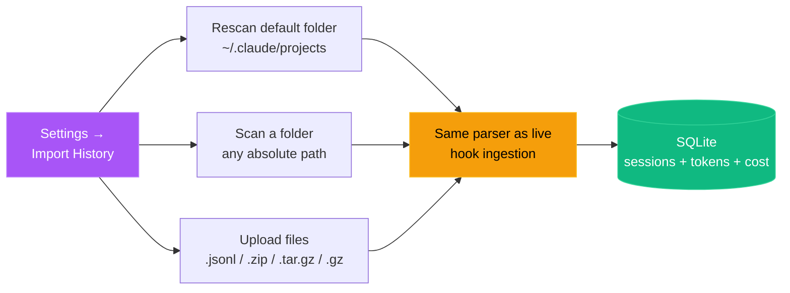
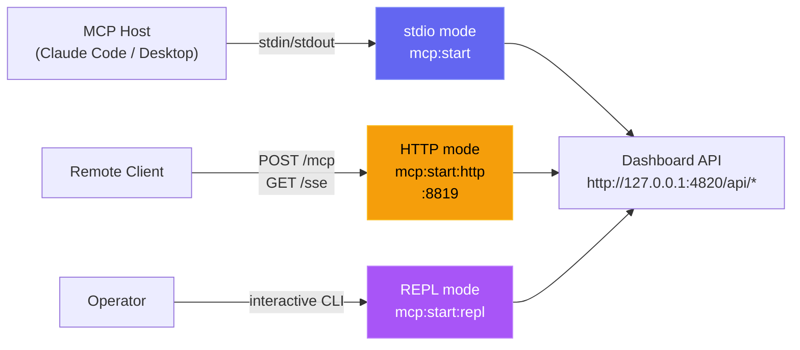

# Installation

A step-by-step guide to get the Claude Code Agent Monitor up and running on your machine, with optional sections for importing history, running in a container, and using the native desktop app (macOS & Windows).

## Requirements

| Requirement | Version | Notes |
|---|---|---|
| Node.js | 18+ (22+ recommended) | Required for server and client |
| npm | 9+ | Comes with Node.js |
| Claude Code | 2.x+ | Required for hook integration |
| Python | 3.6+ | Optional — statusline utility only |
| Git | Any | For cloning the repository |

---

## Step 1 — Clone the repository

```bash
git clone https://github.com/hoangsonww/Claude-Code-Agent-Monitor.git
cd Claude-Code-Agent-Monitor
```

---

## Step 2 — Install dependencies

```bash
npm run setup
```

This installs all server and client dependencies in a single command. It is equivalent to:

```bash
npm install
cd client && npm install
```

Or via Makefile (also installs MCP dependencies):

```bash
make setup
```

---

## Step 3 — Start the dashboard

```bash
npm run dev
```

This starts two processes concurrently:

| Process | URL | Description |
|---|---|---|
| Express server | http://localhost:4820 | API, WebSocket, SQLite |
| Vite dev server | http://localhost:5173 | React frontend with HMR |

Open **http://localhost:5173** in your browser.

> [!TIP]
> When you run the dashboard directly on the host with `npm run dev` or `npm start`, the server automatically writes the Claude Code hook configuration to `~/.claude/settings.json`. If you run the dashboard in Docker or Podman, install hooks from the host with `npm run install-hooks` after the container is up.

---

## Step 4 — Start a Claude Code session

Start a new Claude Code session from any directory **after** the dashboard server is running. The hooks will fire automatically and your sessions, agents, and events will appear in real-time.

```bash
# In a separate terminal, from any project directory:
claude
```

---

## Verification

After starting a Claude Code session, you should see:

- **Sessions page** — your session listed with status `Waiting` (a fresh CLI sitting at the prompt) or `Active` (mid-turn)
- **Agent Board** — a `Main Agent` card in the `Waiting` column until you type your first message; it flips to `Working` on `UserPromptSubmit` / `PreToolUse` and back to `Waiting` after each `Stop`
- **Activity Feed** — events streaming in as Claude Code uses tools
- **Dashboard** — stats updating in real-time
- **Settings page** — model pricing rules, hook configuration status, data export and cleanup tools

If nothing appears after 30 seconds, see [SETUP.md](./SETUP.md#troubleshooting).

### PWA install (optional)

The dashboard is a Progressive Web App. After opening it in a supported browser (Chrome, Edge, Firefox), you can install it to your dock / home screen:

1. Look for the **install icon** (⊕) in the browser address bar, or open the browser menu → "Install app"
2. Once installed, the dashboard launches in its own window with no browser chrome
3. Offline support: previously visited pages and assets are served from the Service Worker cache when the network is unavailable

The landing page and wiki are also installable PWAs with their own manifests and service workers — visit each in a browser to install independently.

---

## Step 5 — (Optional) Import existing Claude Code history

The server **automatically imports** every session under
`~/.claude/projects/` on startup, so if you've used Claude Code on this
machine before, your historical sessions, agents, events, token counts,
and cost totals should already be visible in the Sessions list.

To bring in history from another machine, a backup, or a `.tar.gz`
archive a teammate sent you, use **Settings → Import History** in the
UI. It supports three modes:



Re-imports are idempotent: sessions are deduplicated by UUID and
compaction baselines preserve pre-compaction token totals, so running
the importer twice never double-counts tokens or cost.

Verify it worked by opening the **Analytics** page and checking that
per-model token totals and estimated cost look correct. Full walkthrough
with per-OS archive commands in
[SETUP.md → Importing existing Claude Code history](./SETUP.md#importing-existing-claude-code-history).

<p align="center">
  
</p>

### Optional: tune import limits

If you regularly import very large archives, these environment variables
can be raised (the defaults are generous for typical use):

| Variable                          | Default | Purpose                                                     |
| --------------------------------- | ------- | ----------------------------------------------------------- |
| `CCAM_IMPORT_MAX_BYTES`           | 1 GB    | Maximum size per uploaded file                              |
| `CCAM_IMPORT_MAX_FILES`           | 2000    | Maximum files per upload request                            |
| `CCAM_IMPORT_MAX_EXTRACT_BYTES`   | 4 GB    | Ceiling on uncompressed bytes per archive (zip-bomb guard)  |

Set them before `npm run dev` or `npm start`:

```bash
CCAM_IMPORT_MAX_EXTRACT_BYTES=17179869184 npm start   # allow 16 GB extraction
```

---

## Production mode

To run as a single process serving the built client:

```bash
npm run build   # Build the React client
npm start       # Start Express serving client/dist on port 4820
```

Open **http://localhost:4820** in your browser.

---

## Desktop App (macOS & Windows) (optional)

If you'd rather not keep a terminal window open, the project also ships an Electron 35-based **native desktop app** (the `desktop/` workspace), available for both **macOS** and **Windows**. It embeds the Express server in-process, renders the built React client in a `BrowserWindow`, registers a menu-bar / notification-area (tray) icon, and offers a one-click "Open at Login" toggle. Everything you'd see in the browser at `localhost:4820` lives inside a single app you install once — distributed as a macOS `.app` (in a `.dmg`) and a Windows `.exe` (an NSIS installer plus a no-install portable build).

### Prerequisites

| For… | You need |
|---|---|
| Downloading a pre-built installer (macOS) | macOS — nothing else |
| Downloading a pre-built installer (Windows) | Windows 10/11 (x64) — nothing else |
| Building the DMG locally (macOS) | macOS, Node.js 18+ (22+ recommended), npm 9+, and **Xcode command-line tools** (`xcode-select --install`) so the native `better-sqlite3` module can be rebuilt for Electron's ABI |
| Building the `.exe` locally (Windows) | Windows, Node.js 18+ (22+ recommended), npm 9+. `better-sqlite3` is fetched as a **prebuilt Electron binary** by `npm run desktop:install`, so no Visual Studio C++ toolchain is needed in the common case. If the build _does_ fail, `npm run desktop:install` prints the exact fix (Visual Studio Build Tools + "Desktop development with C++") plus a no-toolchain alternative and exits non-zero rather than failing silently |

### Way 1 — Download a pre-built installer

The fastest path. There are two flavours:

**1a. From the latest GitHub Release** *(recommended — public, no sign-in)*

Open [**Releases → latest**](https://github.com/hoangsonww/Claude-Code-Agent-Monitor/releases/latest) and download the asset for your platform. CI publishes a new `vX.Y.Z` release automatically every time the version in `package.json` is bumped on `master`, so this link always points at the current shipping build.

| Platform | Asset | Notes |
|---|---|---|
| macOS (Apple Silicon) | `ClaudeCodeMonitor-<ver>-arm64.dmg` | drag into `/Applications` |
| macOS (Intel) | `ClaudeCodeMonitor-<ver>-x64.dmg` | drag into `/Applications` |
| Windows (installer) | `ClaudeCodeMonitor-Setup-<ver>-x64.exe` | per-user install, no admin |
| Windows (portable) | `ClaudeCodeMonitor-<ver>-x64-portable.exe` | run without installing |

**1b. From the per-commit CI artifact** *(useful for testing master before it's tagged — sign-in required, 14-day retention)*

Every green run of the desktop CI jobs uploads a packaged artifact — `ClaudeCodeMonitor-dmg` from the `🍎 macOS Desktop (DMG)` job and `ClaudeCodeMonitor-win` from the `🪟 Windows Desktop (EXE)` job:

- **Via the GitHub UI:** open the latest passing run under [Actions](https://github.com/hoangsonww/Claude-Code-Agent-Monitor/actions/workflows/ci.yml?query=branch%3Amaster+is%3Asuccess), scroll to **Artifacts**, and download `ClaudeCodeMonitor-dmg` (macOS) or `ClaudeCodeMonitor-win` (Windows).
- **Via the `gh` CLI:**

  ```bash
  gh run download <run-id> -R hoangsonww/Claude-Code-Agent-Monitor -n ClaudeCodeMonitor-dmg   # macOS
  gh run download <run-id> -R hoangsonww/Claude-Code-Agent-Monitor -n ClaudeCodeMonitor-win   # Windows
  ```

  Unzip the macOS artifact to get the `.dmg`s, or the Windows artifact to get the NSIS installer + portable `.exe`s.

Then jump to [Install the app](#install-the-app).

### Way 2 — Build the installer locally

From the project root, after `git clone`. electron-builder packages for the **host OS**, so build the macOS DMG on a Mac and the Windows `.exe` on Windows. The common prelude is the same:

```bash
npm run setup                # install root + client + vscode-extension deps
npm run build                # build the React client (the SPA the window loads)
npm run desktop:install      # install Electron + electron-builder into desktop/

# macOS (run on macOS):
npm run desktop:dmg:arm64    # fast single-arch DMG → desktop/release/

# Windows (run on Windows):
npm run desktop:win          # NSIS installer .exe → desktop/release/
```

The artifact lands in `desktop/release/`. Pick the build command that matches your goal:

| Command | Platform / Architecture | Speed | Use when |
|---|---|---|---|
| `npm run desktop:dmg` | macOS — Universal (x64 + arm64) | **Slow** | Building a release DMG for everyone |
| `npm run desktop:dmg:arm64` | macOS — Apple Silicon only | Fast (~1 min) | Building for your own Apple Silicon Mac |
| `npm run desktop:dmg:x64` | macOS — Intel only | Fast (~1 min) | Building for your own Intel Mac |
| `npm run desktop:win` | Windows — NSIS installer `.exe` (x64) | — | Building the per-user installer |
| `npm run desktop:win:portable` | Windows — portable `.exe` (x64) | — | Building the no-install portable build |
| `npm run desktop:install` | — | — | Install Electron + electron-builder deps; preflights the native `better-sqlite3` build and prints actionable setup help on failure |
| `npm run desktop:build` | — | — | TypeScript compile only (`out/`) |
| `npm run desktop:dev` | — | — | Build, then launch Electron locally |
| `npm run desktop:test` | — | — | Smoke test (spawn Electron, probe `/api/health`) |

> [!IMPORTANT]
> **DMGs build on macOS; Windows `.exe`s build on Windows** — electron-builder packages for the host OS. On macOS, the universal `npm run desktop:dmg` build is **intentionally slow** — it builds the app twice (one tree per architecture), merges both with `@electron/universal`, then signs every binary. Expect the silent `packaging arch=universal` step to sit for several minutes. **When building for your own Mac, use `desktop:dmg:arm64` or `desktop:dmg:x64`** — a single architecture finishes in roughly a minute. CI already builds both the universal DMG and the Windows `.exe`s for you (see Way 1).

### Install the app

**macOS.** Each `desktop:dmg*` build wipes `release/` and emits a single DMG —
`desktop:dmg:arm64` → `…-arm64.dmg`, `desktop:dmg:x64` → `…-x64.dmg`, universal
`desktop:dmg` → `…-universal.dmg` — and its mounted-volume title states the
architecture (e.g. *Claude Code Monitor (Apple Silicon)*). Install the one
matching your Mac: an x64 build on Apple Silicon makes macOS prompt for Rosetta.

```bash
open desktop/release/ClaudeCodeMonitor-*-arm64.dmg   # the arch you built
```

1. The DMG mounts — drag **Claude Code Monitor** into your `Applications` folder.
2. The DMG is ad-hoc signed, so macOS Gatekeeper shows a warning (*"Apple could not verify…"*) on first launch. Strip the quarantine attribute, then open it:

   ```bash
   xattr -cr "/Applications/Claude Code Monitor.app"
   open "/Applications/Claude Code Monitor.app"
   ```

   Alternatively, open  → *System Settings → Privacy & Security* and click *Open Anyway*.

**Windows.**

1. Run `ClaudeCodeMonitor-Setup-<ver>-x64.exe`. It installs **per-user** (no administrator elevation) and lets you pick the install directory — or run the `*-portable.exe` to launch without installing.
2. The installer is **unsigned** by default, so Windows **SmartScreen** may show *"Windows protected your PC"* on first launch — click **More info → Run anyway**.
3. Launch from the Start menu / desktop shortcut.

Once running, the embedded server boots on port `4820` (or adopts an already-healthy server on `4820`, or falls back to `4821`–`4829` / a random high port), the menu-bar / notification-area (tray) icon appears, and the dashboard window opens. **Hooks are installed automatically on first boot** — an install-only user does not need `npm run install-hooks`; just start a new Claude Code session. Closing the window hides it but keeps the server running; **Quit** from the tray exits.

> [!NOTE]
> The packaged app stores its SQLite database and VAPID keys in a per-user app-data directory **outside** the app bundle / install dir — `~/Library/Application Support/Claude Code Monitor/data/` on macOS, `%APPDATA%\Claude Code Monitor\data\` on Windows. Your imported history and events therefore **survive app reinstalls and updates** (the Windows NSIS uninstaller keeps this data by default). (Older macOS builds kept the database inside the bundle, which is read-only once installed and code-signed — that broke History Import; it is now fixed. If you are upgrading from a pre-fix build, there is a one-time data gap: re-run **Settings → Import History → Rescan** once.)

Full user guide: [`DESKTOP.md`](DESKTOP.md). Contributor / architecture reference: [`desktop/README.md`](desktop/README.md). Desktop-specific setup details (logs, auto-start, port adoption) are in [SETUP.md → Desktop App Setup](./SETUP.md#desktop-app-setup).

---

## Optional: Local MCP server

If you want AI agents to call dashboard functionality through MCP tools, run the local MCP server in `mcp/`:

```bash
npm run mcp:install
npm run mcp:build
npm run mcp:start              # stdio (for MCP host integration)
npm run mcp:start:http         # HTTP + SSE server on port 8819
npm run mcp:start:repl         # interactive CLI with tab completion
```

The MCP server supports three transport modes:



See [mcp/README.md](./mcp/README.md) for host config, tool catalog, and safety flags.

To build the MCP server as a container image instead:

```bash
npm run mcp:docker:build
# or
npm run mcp:podman:build
```

---

## Optional: Agent extension packs

This repository includes extension packs for both Claude Code and Codex.

- Claude Code loads project extensions from:
  - `CLAUDE.md`
  - `.claude/rules/`
  - `.claude/skills/`
  - `.claude/agents/`
- Codex project packs live under `.codex/`:
  - `AGENTS.md`
  - `.codex/rules/`
  - `.codex/agents/`
  - `.codex/skills/`

See [`.codex/README.md`](./.codex/README.md) for Codex extension details.

---

## Optional: VS Code extension

The **Claude Code Agent Monitor** is also available as a dedicated VS Code extension for seamless, integrated monitoring.

<p align="center">
  
</p>

### Features
- **Real-time Sidebar**: Monitor agent status, health, and usage stats in the Activity Bar.
- **Pulse Status Bar**: High-level session and agent counts in the bottom status bar.
- **Direct Navigation**: Jump to specific dashboard pages or recent sessions.
- **Embedded Dashboard**: Full dashboard interface within a native VS Code tab.

### Installation
1. Open the [vscode-extension](./vscode-extension) folder in VS Code.
2. Install via the Marketplace or package it manually:
   ```bash
   cd vscode-extension
   npm install
   # Generate .vsix for local install
   npm run package
   ```
3. After installation, ensure the main dashboard server is running (`npm run dev`).
4. Look for the **Radar icon** in your VS Code Activity Bar.

For advanced configuration, refer to the [.vscode](./.vscode) and [vscode-extension](./vscode-extension) directories.

> [!TIP]
> Extension on VS Code Marketplace: [Claude Code Agent Monitor](https://marketplace.visualstudio.com/items?itemName=hoangsonw.claude-code-agent-monitor)

---

## Container mode (Docker / Podman)

The repository includes both a multi-stage `Dockerfile` and a `docker-compose.yml` file. Docker and Podman are both supported.

### Compose

```bash
# Docker Compose
docker compose up -d --build

# Podman Compose
CLAUDE_HOME="$HOME/.claude" podman compose up -d --build
```

Open **http://localhost:4820** in your browser.

### Plain Docker / Podman

```bash
# Docker
docker build -t agent-monitor .
docker run -d --name agent-monitor \
  -p 4820:4820 \
  -v "$HOME/.claude:/root/.claude:ro" \
  -v agent-monitor-data:/app/data \
  agent-monitor

# Podman
podman build -t agent-monitor .
podman run -d --name agent-monitor \
  -p 4820:4820 \
  -v "$HOME/.claude:/root/.claude:ro" \
  -v agent-monitor-data:/app/data \
  agent-monitor
```

### Container notes

| Mount | Purpose |
|---|---|
| `~/.claude:/root/.claude:ro` | Lets the server import legacy Claude session history |
| `agent-monitor-data:/app/data` | Persists the SQLite database across container restarts |

> [!IMPORTANT]
> Claude Code hooks run on the host, not inside the container. After the container is healthy on `http://localhost:4820`, run `npm run install-hooks` on the host so Claude Code posts hook events back to the containerized server. The installer refuses to run inside a container (issue #193) to avoid writing a container-internal handler path into a bind-mounted `~/.claude`; use `CCAM_ALLOW_CONTAINER_HOOKS=1` only if you run Claude Code inside the same container.

<p align="center">
  
</p>

<p align="center">
  
</p>

<p align="center">
  
</p>

<p align="center">
  
</p>

<p align="center">
  
</p>

<p align="center">
  
</p>

---

## Troubleshooting

### `npm run setup` shows `better-sqlite3` errors

This is expected and **non-fatal**. `better-sqlite3` is a native C++ module listed as an optional dependency. If prebuilt binaries are not available for your Node version or platform, npm will print gyp/compilation errors but still complete successfully.

At runtime the server uses this fallback chain:

1. **`better-sqlite3`** — used when prebuilt binaries are available (Node 18/20/22 on Windows x64, macOS arm64/x64, Linux x64/arm64)
2. **`node:sqlite`** — Node.js built-in SQLite module, used automatically on Node 22+ when `better-sqlite3` is unavailable

If you see an error box at startup saying *"SQLite backend not available"*, either:

- **Upgrade to Node.js 22+** (recommended — zero native dependencies needed), or
- **Install build tools** so `better-sqlite3` can compile from source:
  - **Windows:** `npm install -g windows-build-tools` or install [Visual Studio Build Tools](https://visualstudio.microsoft.com/visual-cpp-build-tools/) with the C++ workload
  - **macOS:** `xcode-select --install`
  - **Linux:** `sudo apt install python3 make g++` (Debian/Ubuntu) or equivalent

  Then run: `npm rebuild better-sqlite3`

### Desktop build or install fails on the native dependency

Unlike the root server (which falls back to `node:sqlite`), the desktop app **requires** `better-sqlite3` built for Electron's ABI. If that build can't happen, `npm run desktop:install` (and the desktop `prebuild` gate that runs before every `desktop:*` build) now stops with copy-pasteable setup help instead of a raw node-gyp trace or a runtime crash: it lists the per-OS C++ toolchain prerequisites (Windows: Visual Studio Build Tools + "Desktop development with C++"; macOS: `xcode-select --install`; Linux: build-essential + python3), notes that Node LTS 20/22 ship prebuilt binaries, and offers a no-toolchain alternative:

```bash
cd desktop
npm install --ignore-scripts
node node_modules/electron/install.js
npx electron-builder install-app-deps
```

### `npm run dev` fails immediately

Ensure both server and client dependencies are installed:

```bash
npm run setup
```

If the error mentions a missing module like `express` or `react`, dependencies may be incomplete. Delete `node_modules` in both root and `client/`, then re-run setup:

```bash
rm -rf node_modules client/node_modules
npm run setup
```

### Server starts but client shows a blank page

The Vite dev server and Express server run on different ports. Make sure both are running (`npm run dev` starts both). Open **http://localhost:5173**, not `http://localhost:4820`, during development.

### No sessions appearing after starting Claude Code

See [SETUP.md — Troubleshooting](./SETUP.md#troubleshooting) for detailed hook debugging steps.

### Desktop App (macOS & Windows) issues

| Symptom | Cause | Fix |
|---|---|---|
| *"Apple could not verify…"* on first launch (macOS) | The DMG is ad-hoc signed (no paid Apple Developer ID) | `xattr -cr "/Applications/Claude Code Monitor.app"`, then open it — or use *System Settings → Privacy & Security → Open Anyway* |
| *"Windows protected your PC"* on first launch (Windows) | The `.exe` is unsigned by default, so SmartScreen prompts | Click **More info → Run anyway** |
| `npm run desktop:dmg` hangs on `packaging arch=universal` (macOS) | Not hung — the universal build merges two architectures and is intentionally slow | Wait it out, or use `npm run desktop:dmg:arm64` / `npm run desktop:dmg:x64` for a fast single-arch build |
| `entry file out/main.js does not exist` | `npm run clean` (in `desktop/`) deleted `out/`; `electron-builder` only packages, it does not compile | Re-run `npm run desktop:build` (or just use a `desktop:dmg*` / `desktop:win*` script, which chains the build) |
| Desktop window opens but is blank | The embedded server failed `/api/health` within 30 s | Check the desktop log (`~/Library/Logs/Claude Code Monitor/desktop.log` on macOS, `%APPDATA%\Claude Code Monitor\logs\desktop.log` on Windows), then tray → *Restart Server* |
| "Run Claude" says `claude` is not on your PATH | A Finder/Dock-launched macOS app only inherits launchd's minimal PATH, not your login-shell PATH (on Windows the process already inherits the user PATH) | The app recovers your login-shell PATH at startup so it can find and spawn the `claude` CLI. If it still fails, make sure `claude` is a real executable on your shell PATH — not a shell alias or function |
| Imported history vanished after updating the app | Older builds stored the database inside the (replaceable) `.app` bundle | Fixed — data now lives in the per-user app-data dir (`~/Library/Application Support/Claude Code Monitor/data/` on macOS, `%APPDATA%\Claude Code Monitor\data\` on Windows) and survives reinstalls/updates. After upgrading from a pre-fix build, re-run **Settings → Import History → Rescan** once |

---

## Ports

| Service | Default | Override |
|---|---|---|
| Dashboard server | `4820` | `DASHBOARD_PORT=xxxx npm run dev` |
| Client dev server | `5173` | Edit `client/vite.config.ts` |
