# Claude Code Agent Dashboard（Agent 监控面板）

### Claude Code Agent 活动实时监控平台 🚀

专业的 Dashboard，用于实时追踪和可视化你的 Claude Code Agent 会话、工具使用和子 Agent 编排。基于 Node.js、Express、React 和 SQLite 构建，通过 Claude Code 原生 Hook 系统直接集成，实现无缝的会话追踪和分析。


**语言支持 / Language Support**: English (`en`) · 中文 (`zh`) · 越南语 (`vi`)  

切换文档：[`README.md`](./README.md) · [`README-CN.md`](./README-CN.md) · [`README-VN.md`](./README-VN.md)

---

## 目录

- [概述](#概述)
- [多语言支持（i18n）](#多语言支持i18n)
- [功能特性](#功能特性)
- [快速开始](#快速开始)
- [工作原理](#工作原理)
- [配置](#配置)
- [npm 脚本](#npm-脚本)
- [插件市场](#插件市场)
- [Agent 扩展](#agent-扩展)
- [Tabby](#tabby)
- [MCP 集成](#mcp-集成)
- [API 参考](#api-参考)
- [Hook 事件](#hook-事件)
- [浏览器通知](#浏览器通知)
- [更新提醒](#更新提醒)
- [连接状态弹窗](#连接状态弹窗)
- [VS Code 扩展](#vs-code-扩展)
- [桌面应用（macOS 与 Windows）](#桌面应用macos-与-windows)
- [数据存储](#数据存储)
- [状态栏](#状态栏)
- [服务端架构](#服务端架构)
- [客户端路由](#客户端路由)
- [Hook 处理流程](#hook-处理流程)
- [部署模式](#部署模式)
- [项目结构](#项目结构)
- [常见问题](#常见问题)
- [许可证](#许可证)

---

## 概述

通过专业的暗色主题 Web 界面追踪会话、实时监控 Agent、可视化工具使用、观察子 Agent 编排。通过 Claude Code 原生 Hook 系统直接集成。


<a href="https://www.star-history.com/?repos=hoangsonww%2FClaude-Code-Agent-Monitor&type=date&legend=top-left">
 <picture>
   <source media="(prefers-color-scheme: dark)" srcset="https://api.star-history.com/chart?repos=hoangsonww/Claude-Code-Agent-Monitor&type=date&theme=dark&legend=top-left" />
   <source media="(prefers-color-scheme: light)" srcset="https://api.star-history.com/chart?repos=hoangsonww/Claude-Code-Agent-Monitor&type=date&legend=top-left" />
   
 </picture>
</a>

### 多语言支持（i18n）

Dashboard 内置多语言界面，支持 `en`、`zh`、`vi` 三种语言，适用于跨语言协作和团队共享。

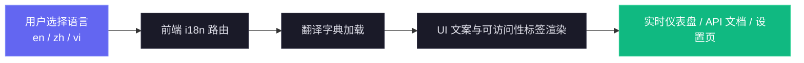

完整实现细节与排障指南请见 [docs/I18N.md](./docs/I18N.md)。

### 用户界面

配有精美的暗色主题、响应式设计和直观的导航，让你轻松浏览 Agent 活动：

<p align="center">
  
  <br>
  <em>📡 <strong>Dashboard · Monitor</strong> — 总览统计、活跃 Agent 卡片与最近活动流</em>
</p>

<p align="center">
  
  <br>
  <em>🩺 <strong>Dashboard · Health</strong> — 综合健康评分环、存储引擎甜甜圈图、缓存/错误/成功率仪表、工具调用条形图、子Agent效能、模型Token分布、压缩统计 — 每 5 秒自动刷新</em>
</p>

<p align="center">
  
  <br>
  <em>📋 <strong>Kanban 看板（Agent 视图）</strong> — Agent 按状态分布于 4 个列：工作中 / 等待中 / 已完成 / 错误。黄色的“等待中”列突出显示被用户阻塞的会话(权限请求、回合结束,或停在新会话的提示符前)。每张卡片一目了然地显示模型、费用和当前工具。</em>
</p>

<p align="center">
  
  <br>
  <em>🗂️ <strong>Kanban 看板（会话视图）</strong> — 会话按状态分布于 5 个列：活跃 / 等待中 / 已完成 / 错误 / 已废弃,可在同一页面切换。将鼠标悬停在任意列标题上可查看生命周期转换的提示说明。</em>
</p>

<p align="center">
  
  <br>
  <em>📂 <strong>会话</strong> — 包含费用、模型、Agent 数和时长的可搜索、可过滤、服务端分页的会话总表</em>
</p>

<p align="center">
  
  <br>
  <em>🤖 <strong>会话详情 · Agent</strong> — 实时概览卡片（事件、工具调用、子 Agent、压缩、错误、时长）、Top 工具用量条形图、子 Agent 类型分布、Token 流和 Agent 层级树</em>
</p>

<p align="center">
  
  <br>
  <em>💬 <strong>会话详情 · Conversation</strong> — 实时对话查看器，支持 markdown 渲染、带行号和复制按钮的语法高亮代码块，按工具样式化的工具调用块、捕获其 TUI 输出的斜杠命令气泡，以及内联的会话重命名标记</em>
</p>

<p align="center">
  
  <br>
  <em>🔬 <strong>会话详情 · Timeline</strong> — 按时间排序的事件时间线，支持多维过滤、按 `tool_use_id` 进行 Pre/Post 分组，以及工具感知的载荷渲染</em>
</p>

<p align="center">
  
  <br>
  <em>📰 <strong>活动流</strong> — 实时事件日志，支持暂停 / 恢复、分组、多维过滤，每行带"会话 →"跳转按钮</em>
</p>

<p align="center">
  
  <br>
  <em>📊 <strong>分析</strong> — 按模型的 Token 用量、工具使用频率、活动热力图与会话趋势，附在线 / 离线指示器</em>
</p>

<p align="center">
  
  <br>
  <em>🔀 <strong>工作流</strong> — Agent 编排 DAG、工具执行桑基图、协作网络，共 11 个交互式工作流智能模块</em>
</p>

<p align="center">
  
  <br>
  <em>🧬 <strong>工作流运行（工作流页面）</strong> — 由 <code>Workflow</code> 工具派生的「动态工作流」，依据磁盘上的运行日志重建：状态、Agent 数量、token 与工具调用，可展开为按 Agent 的明细（阶段、状态、token、工具、时长），并附经过人性化处理的结果预览</em>
</p>

<p align="center">
  
  <br>
  <em>🧬 <strong>工作流运行 · 展开</strong> — 展开的一次运行：可点击的彩色阶段筛选、按 Agent 的指标表，以及完整的可点击结果项列表，点击即可展开每个 Agent 的完整提示词与结果</em>
</p>

<p align="center">
  
  <br>
  <em>🧬 <strong>工作流运行（会话详情）</strong> — 同样的群组关联到其启动会话，因此会话的动态工作流子 Agent 及其已计入的 token 成本可在会话内直接查看</em>
</p>

<p align="center">
  
  <br>
  <em>🧰 <strong>Claude 配置浏览器</strong> — 12 标签页检查器，涵盖 Claude Code 知道的一切：技能、子代理、斜杠命令、输出样式、插件（含每个插件的贡献计数）、市场、MCP 服务器、Hook、设置（密钥脱敏）、记忆（用户与项目 `CLAUDE.md` 文件，外加按项目分组、可搜索的文件型记忆存储 —— `~/.claude/projects/<slug>/memory/` 下的每个 `*.md`）、快捷键与状态行。低风险文本文件表面支持创建/编辑/删除（含按项目的 auto-memory 文件），带强制时间戳备份</em>
</p>

<p align="center">
  
  <br>
  <em>▶️ <strong>运行 Claude</strong> — 直接在仪表盘内启动 <code>claude</code> 子进程。选择模式（对话 / 单次）、来源（新会话 vs 从完整历史中恢复）、工作目录（带最近 cwd 自动补全）、模型、权限模式与思考强度。路由上的同源守卫防止浏览器 drive-by spawn</em>
</p>

<p align="center">
  
  <br>
  <em>💬 <strong>运行 Claude · 实时流</strong> — 聊天式流式输出，通过 <code>--include-partial-messages</code> 实现真正的逐字符渲染。工具调用、工具结果与思考块均可折叠。标题栏的进行中运行切换器允许你将运行留在后台并稍后重新附加。会话 ID 一旦获知，"查看会话 →"即可深链至常规 Sessions UI</em>
</p>

<p align="center">
  
  <br>
  <em>⚙️ <strong>设置</strong> — 模型定价规则、Hook 安装状态、数据管理、通知偏好与系统信息</em>
</p>

<p align="center">
  
  <br>
  <em>🔔 <strong>设置 · 告警</strong> — 基于规则的告警引擎与出站 Webhook 集于一处：告警规则（事件模式 / 不活动 / agent 卡住 / token 阈值）支持按规则冷却，实时的已触发告警流，以及 14 个一等公民 Webhook 提供方（Slack、Discord、Teams、Google Chat、Mattermost、Rocket.Chat、Telegram、PagerDuty、Opsgenie、Splunk On-Call、Zapier、Make、n8n、Pipedream）加一个支持可选 HMAC 签名的通用 JSON 端点</em>
</p>

侧边栏提供快速访问 Dashboard、看板、会话列表、活动流、分析、工作流和设置。每个页面旨在通过实时更新和丰富的可视化，为你提供对 Claude Code Agent 活动的深度洞察。

---

## 功能特性

Dashboard 提供全面的功能来监控和分析你的 Claude Code 会话和 Agent：

| 功能 | 描述 |
|------|------|
| **Dashboard** | 两个标签页（存储于 `localStorage`）：**Monitor** — 概览统计（6 张统计卡片）、可折叠子 Agent 层级的活跃 Agent 卡片、近期活动流，项目数量通过 `ResizeObserver` 动态填满视口高度。**Health** — 综合系统健康评分环（加权：0.4 × 成功率 + 0.25 × 缓存命中率 + 0.25 × (100 − 错误率) + 0.1 × (100 − 堆内存 %)）、存储引擎甜甜圈图（记录分布）、缓存性能 / 错误率 / 成功率仪表、Top 8 工具调用水平条形图、子 Agent 效能条、模型 Token 分布、压缩影响统计。所有健康指标每 5 秒从 `/api/settings/info` 和 `/api/workflows` 自动刷新。所有图表均有跟随光标的工具提示并自动避免视口边缘溢出 |
| **看板** | 顶部带视图切换（在 `localStorage` 中持久化）：**Agent 视图** — 4 列（工作中 / 等待中 / 已完成 / 错误），以及**会话视图** — 5 列（活跃 / 等待中 / 已完成 / 错误 / 已废弃）。**等待中**列直接映射 Agent 的持久化 `waiting` 状态 — 当 Claude Code 停在提示符前(新会话、回合之间或被权限 Notification 阻塞)时设置,在用户继续操作(UserPromptSubmit / PreToolUse)时转换为 `working`。每个列标题都有 `?` 图标的工具提示解释生命周期。每列按状态从服务端独立获取(每列实际无上限),随后客户端按每列 10 张卡片分页,附「显示更多」按钮。WebSocket 订阅范围跟随当前视图(`agent_*` 与 `session_*` 帧),切换视图后另一类的更新不会触发重新加载。 |
| **会话** | 可搜索、可筛选、**服务端分页**的全量会话表。每次翻页请求 `/api/sessions?status=&q=&limit=10&offset=…`，因此费用计算只针对当前可见页运行——与数据库中会话总量无关。搜索框（`q=`）在服务端对 `id` / `name` / `cwd` 做不区分大小写匹配，附 300 毫秒防抖；响应包含 `total` 计数供分页器使用。状态筛选、搜索与翻页可组合。每个会话的可读**名称**从 Transcript 实时读取并保持同步——显式标题（`/rename`、`claude -n`、选择器 Ctrl+R 写入的 JSONL `custom-title` 行）优先，否则回退到自动生成的 `ai-title`；用户自定义的名称绝不会被自动标题覆盖。该名称（无名称时回退到短 ID）显示在 Agent 卡片、Dashboard、活动流以及 Run 恢复选择器上 |
| **会话详情** | 单会话实时概览面板，包含活跃 Agent 横幅（当前工具 + 任务）、六个统计卡片（事件数及事件/分钟速率、工具调用数、子 Agent 数、压缩次数、错误数、滚动计时的运行时长）、Top 工具使用条形图、子 Agent 类型分布、堆叠 Token 流图，以及事件类型胶囊云——所有内容均根据 Hook 事件实时刷新。下方：Agent 层级树（父/子）、完整事件时间线（多维筛选：状态、事件类型、工具、Agent、文本搜索、日期范围）、按 `tool_use_id` 进行 Pre/Post 分组、人类可读摘要块、工具感知的输入/响应渲染器（Bash 用终端、Edit 用统一 diff、Read/Write 用带行号代码、Grep 用匹配列表、MCP 工具用键值卡片），以及对话标签页：使用 markdown（标题、列表、引用块、表格、任务列表）、带行号和复制按钮的语法高亮代码块（js/ts、python、json、bash、html、css、sql、yaml、diff），以及按工具样式化的工具调用块（Bash → 终端、Edit → 旧/新并排、Write → 文件标签、Read → 路径胶囊、Grep → pattern 卡片）渲染对话记录 |
| **活动流** | 实时流式事件日志，支持暂停/恢复和分页；点击任意事件行可就地展开其完整 hook 载荷（内联 EventDetail 面板）；每行右侧的专属「会话 →」按钮可直接跳转至会话详情页，不影响当前展开状态 |
| **分析** | Token 使用量、工具频率、活动热力图（居中显示、按周排列从周日开始、日期名称提示）、会话趋势、在线/离线连接指示器。加载时图表区域显示带**脉冲动画的骨架占位符**（不仅是顶部统计卡），数据到达后再渲染真实图表 |
| **实时更新** | WebSocket 推送 — 无轮询，即时 UI 更新 |
| **自动发现** | 会话和 Agent 从 Hook 事件中自动创建 |
| **历史导入** | 启动时从 `~/.claude/` 导入会话。增强的 JSONL 提取：API 错误（配额/速率/无效请求）、回合耗时、入口点（cli/sdk-ts）、权限模式、思考块计数、用量附加信息（service_tier、speed、inference_geo）、工具结果错误，以及子 Agent JSONL 文件（`subagents/agent-*.jsonl` 含 `.meta.json`）。重新导入时回填已有会话。近期 JSONL 文件（< 10 分钟）以"活跃"状态导入 |
| **子 Agent 层级** | Dashboard 和会话详情页可折叠的父子 Agent 树。有子 Agent 的 Agent 显示展开/折叠箭头；叶子 Agent 显示圆点指示器。子 Agent 活跃时自动展开 |
| **后台 Agent** | 正确追踪后台子 Agent，不会提前标记为完成 |
| **子 Agent 工具归属** | 子 Agent 内部的工具调用(Read、Bash、Edit、Grep 等)只存在于每个子 Agent 自己的 JSONL 文件中 — Claude Code 不会为其触发任何 Hook。每次 `SubagentStop` 后,dashboard 触发 fire-and-forget 的 `scanAndImportSubagents`:解析每个 `subagents/agent-*.jsonl`,根据 `tool_use_id` 配对 `tool_use` 与 `tool_result` 块,并在子 Agent 自己的 `agent_id` 下发出 `PreToolUse` + `PostToolUse` 事件。具备幂等性(通过 `data LIKE '%"tool_use_id":"X"%'` 去重),并在按类型 + 启动时间在 30 秒内匹配到 hook 创建的 live 行时合并进去,因此不会创建并行的 `<sid>-jsonl-*` 行。同一路径在 `npm run setup` 启动导入时也会运行,实现完整的历史回填 — 早于 dashboard 安装的会话也能获得完整的每子 Agent 工具时间线。Activity Feed 和会话详情页将父链以 `main › coder › explorer` 形式渲染嵌套子 Agent |
| **成本追踪** | 按模型估算成本，支持可配置定价规则和按会话明细。压缩感知的 Token 核算在上下文压缩过程中保留总量。Transcript 读取通过增量字节偏移更新缓存，实现高效 Token 提取 |
| **Transcript 缓存** | 从 JSONL Transcript 实时提取：Token、压缩、API 错误（`isApiErrorMessage` 条目存储为 `APIError` 事件）、回合耗时（存储为 `TurnDuration` 事件）、思考块计数和用量附加信息（service_tier、speed、inference_geo）。会话元数据实时丰富这些字段 |
| **通知** | 基于 Web Push (VAPID) 的持久化浏览器通知。即使 Dashboard 标签页未聚焦或浏览器已关闭也能送达。特别针对 macOS 音效支持进行了配置。支持按事件配置开关及订阅管理 |
| **更新提醒** | 服务端定期以非阻塞方式执行 `git fetch`，将本地检出与所选规范远程的默认分支对比。**支持分支与 fork：** 若同时存在 `upstream` 和 `origin`，优先使用 `upstream`（fork 的常规约定）；命令也会根据用户处境调整——只有在本地分支真正跟踪规范引用时才建议 `git pull --ff-only`，否则给出 `git fetch`（fork 场景下加上 fast-forward 合并），让命令永不撒谎。侧边栏还有常驻的"检查更新"按钮及状态徽标。Dashboard **不会**自行拉取或重启——用户在终端中手动执行命令——因此该机制不会破坏开发会话、pm2/systemd/Docker 进程管理，也不会留下孤立进程 |
| **设置** | 系统信息、Hook 状态、模型定价管理、通知偏好、数据导出、会话清理。**模型定价**区块在标题旁提供一个信息浮层（`i` 图标），讲解规则匹配方式（首条匹配的模式生效）、SQL 风格 `%` 通配符的语法及具体示例（`claude-opus-4-7%`、`claude-%-haiku`、精确 id），并提醒：当 Anthropic 公布新价格时必须手动更新——已存储的会话仍保留入库时所用价格。CLAUDE_HOME 区块与 Import History 面板已完整覆盖 en/vi/zh 三语 i18n |
| **MCP 服务器（本地）** | 位于 `mcp/` 的企业级本地 MCP 服务器，支持三种传输模式（stdio、HTTP+SSE、交互式 REPL），6 个域共 25 个类型化工具，严格输入 Schema、重试/退避、仅限本地 API 强制执行，以及分层变更/破坏性安全门控。HTTP 模式在可配置端口上提供 Streamable HTTP（2025-11-25）和传统 SSE（2024-11-05）。REPL 模式提供带 Tab 补全和彩色输出的交互式工具调用 |
| **工作流** | 基于 D3.js 的可视化页面，包含 11 个交互式模块：Agent 编排 DAG、工具执行 Sankey 图、协作网络、子 Agent 有效性（按周 sparkline 通过 portal 渲染——可越过卡片的 `overflow:hidden`，并自动夹在视口内不再被裁切）、检测到的流程模式、模型委派流、错误传播图（带比率徽章的水平条形图、Agent 类型分解、API/会话错误卡片）、并发时间线、会话复杂度散点图、压缩影响分析和按会话下钻。**全方位、多语言的丰富 tooltip：** 每个图表标题旁都有一个 `i` 图标，可弹出结构化的「此图展示了什么 / 如何阅读 / 为何重要」浮层；悬停节点、边、条、气泡都会显示带有确定性、值相关解读的多段 tooltip（例如占源/占目标比例、成功率健康分级、Opus / Sonnet / Haiku 模型系列说明，以及前段/中段/后段等时间模式）。六张总览统计卡片各自在右下角带一个信息浮层，用自然语言解释指标的计算方式与当前数值含义。Tooltip 通过每张图唯一的 DOM ref 直接更新，并附带容器级 `mouseleave` 兜底，绝不会落后于光标或在重新渲染后残留。点击 **检测到的工作流模式** 中的任意一行会就地展开详情面板，包含完整步骤序列、统计网格、确定性叙述（循环检测、频率分级）和一条务实的建议。状态筛选标签（仅活跃 / 已完成 / 全部）可筛选全部 11 个模块。支持交叉筛选、JSON 导出和 3 秒防抖的实时 WebSocket 自动刷新。**工作流运行**面板呈现「动态工作流」——由 `Workflow` 工具（及自定节奏的 `/loop`）派生的 sub-agent 群组——它们不触发任何 hook，因此改为依据磁盘上的运行日志（`workflows/wf_<runId>.json`）重建：每次运行展示其阶段以及按 Agent 的 token / 工具调用 / 时长分解，并在日志写入前实时检测 `running` 状态，同时在每个会话详情页提供一个关联子区块 |
| **压缩追踪** | 从 JSONL Transcript 检测 `/compact` 事件,创建压缩 Agent 和事件。启动时回填历史压缩。周期性扫描器(频率从 `DASHBOARD_STALE_MINUTES` 派生)在无 Hook 触发时也能捕获压缩。共享 Transcript 缓存,避免重复文件读取 |
| **子会话/恢复会话** | 新事件到达时自动重新激活会话,正确处理 `/resume` 和孤立会话。周期性清理(每 ¼ 个 `DASHBOARD_STALE_MINUTES`,夹在 60 秒–5 分钟之间)标记遗漏事件检测的废弃会话 |
| **预存会话检测** | 服务器启动时已在运行的会话以"活跃"状态导入（基于近期 JSONL 文件修改时间）。Stop 事件也会重新激活已导入的完成/废弃会话，因此进行中的会话的第一个 Hook 始终会显示在 Dashboard 上 |
| **响应式设计** | 适配移动端的布局，堆叠网格、可滚动表格和可折叠侧边栏 |
| **界面本地化** | 内置语言切换，UI 文案与无障碍标签已覆盖英文（`en`）、中文（`zh`）和越南语（`vi`）。覆盖范围现已贯穿 Workflows 页面的所有 tooltip：统计卡片的计算说明与按值分桶的解读、每个图表的「此图展示什么 / 如何阅读 / 为何重要」浮层、所有图形悬停 tooltip（编排 DAG、工具流、Pipeline、模型委派、并发时间线）、Workflow Patterns 详情面板的叙述与建议、设置页 → 模型定价的信息浮层、CLAUDE_HOME 面板，以及完整的 Import History 流程 |
| **种子数据** | 内置种子脚本，用于演示和开发 |
| **状态栏** | 彩色编码的 CLI 状态栏，显示模型、上下文使用率、Git 分支、Token 数 |
| **模型名称格式化** | 整个 UI 中使用人性化的模型名称：原始标识符如 `claude-opus-4-7-20260101` 或 `claude-opus-4-7[1m]` 显示为"Claude Opus 4.7"或"Claude Opus 4.7 (1M)"。支持 Claude、GPT 和 Gemini 家族的自动版本号点连接、日期/latest 后缀剥离、提供商前缀移除和上下文窗口标签格式化。设置页保留原始名称以配置定价规则 |
| **插件市场** | 官方 Claude Code 插件市场，包含 10 个插件（ccam-analytics、ccam-productivity、ccam-devtools、ccam-insights、ccam-dashboard、ccam-cost-guard、ccam-sessions、ccam-workflows、ccam-quality、ccam-config）。53 个技能、14 个 Agent、30 个斜杠命令、3 个 CLI 工具、3 个 Hook 配置。全部基于实际数据模型 — Token 基线、定价引擎、工作流智能（11 个数据集）、会话元数据。通过 `claude plugin marketplace add` 安装 |
| **运行 Claude** | 直接从仪表盘启动 `claude` 子进程,带聊天式流式 UI。两种模式:**对话**(多轮 — stdin 持续打开,后续轮次以 stream-json 信封通过 stdin 传送)与 **单次**(headless,一个 prompt → 一个响应)。对话模式还支持通过 `claude --resume <id>` **恢复任何已有会话** — 使用可搜索选择器从你的完整会话历史中挑选。标题栏的进行中运行切换器允许你将运行留在后台、启动另一个、稍后重新附加。重新附加是持久的:客户端会把派生进程的内存信封日志(`?envelopes=1`)与会话磁盘上的 JSONL 转录文件协调,优先选择 user/assistant 消息更多的那一份,因此从已恢复的运行离开再回来会保留全部历史(派生进程只看到 spawn 之后的轮次;转录文件包含先前 + 当前)。模型下拉(Opus 4.7 / 1M / Sonnet 4.6 / Haiku 4.5 / 自定义)、permission-mode 选择器(对 `bypassPermissions` 显式警告)、**思考强度**字段(low / medium / high — 映射到 `--effort`)、cwd 自动补全(预填仪表盘自身 cwd 加最近会话 cwds)。通过 `--include-partial-messages` 实现真正的逐字符流式渲染,加上客户端 **打字机平滑层** 通过 `requestAnimationFrame` 让每个 `text_delta` / `thinking_delta` 逐字浮现 — 即便是短回复(claude 把整个回答打成一两块 chunk 的情况)也呈现为打字效果。合并代码在 claude 中途送达 canonical `assistant` 信封时保留 `_streaming` 标志和增量累积的 `content` 数组,所以 thinking 块不会在完成时丢失。WebSocket 分发为每个信封包裹 `flushSync`,避免 React 18 自动批处理把多个 deltas 合并成一次渲染。**TUI 对齐(Tier 1)**:**限制说明横幅** 可最小化为细条(永不消失)解释 stream-json 模式相对终端 TUI 能做和不能做什么;**带斜杠命令自动补全的提示编辑器** 使用分级评分(精确名称 → 前缀匹配 → 词边界 → 包含 → 子序列 → 描述匹配)列出用户 / 项目 / 插件命令(发送前在客户端按模板展开执行),并以"仅 CLI — 此处不会执行"标记呈现 `/clear`、`/model`、`/config` 等内置 CLI 命令;**`@` 文件引用** 通过对该 run 的 cwd 进行去抖模糊搜索(跳过 `node_modules`、`.git`、`dist`、`build` 等);**实时上下文窗口 / token 计** 显示输入 + 输出 + 缓存命中 token 与运行成本 — 实时流式时从 `stream_event` / `result.usage` 计算,从转录恢复 / 查看 / 重新附加时也从已完结的 assistant `usage` 块(input / output / cache-read / cache-creation)读取,因此不会卡在 0/200k;**状态头** 显示当前 model、effort、permission mode、cwd、session ID、信封计数与已运行时间。自动补全下拉框向上展开,避免与下方 cwd 选择器冲突。标题旁有 Live / Offline 指示器。路由上的同源守卫防止浏览器 drive-by spawn。并发实际上不设上限(默认安全上限 10000,与终端 TUI 一致 — 仅作为防止有缺陷客户端 fork-bomb 的兜底;通过 `RUN_MAX_CONCURRENT` 设置真正的上限)。统一的活动运行 / 历史模态框还提供两个一键跳转按钮:对话型历史行的 **Resume** 按钮立即派生 `claude --resume <id>` 并把过去的对话记录预填入聊天视图(无需重新输入 prompt — 派生的进程会在 stdin 上空转直到你发送跟进消息);单次型历史行的 **View** 按钮把已捕获的转录内联加载到 run 查看器中作只读展示(不派生进程 — 同一面板,无 Stop / 跟进控件)。生成的会话触发与任何 `claude` 进程相同的 hooks,因此自动出现在 Sessions / Analytics / Kanban / Workflows — 而 Sessions / SessionDetail 会为当前正由 Run 页驱动的会话显示绿色 **▶ Run** 徽标 / 横幅,可点击跳回 Run 页 |
| **Tabby** | 固定在每个页面右下角的可爱 SVG 小猫伴侣,会订阅实时会话 WebSocket 流并据此做出反应。**会做出反应的吉祥物**:基于实时会话流呈现 8 种情绪——空闲、观察、开心、担忧、卡住、思考、睡觉、断开连接;眼睛会追踪光标,每种情绪都有专属动画。**气泡台词**在值得关注的事件发生时弹出(会话开始/结束、出现错误、运行完成),带节流且可静音。点击小猫或按 **⌘B / Ctrl+B** 打开**面板**(Esc 关闭):实时状态行(N 个进行中 · M 个出错 · 连接状态)、快捷操作(跳转到 Run Claude / 活动 / 会话 / 出错的会话,静音,清除提醒)以及一个 **Ask** 提问框。Ask 提问框在本地回答简单的状态类问题;其他问题则交给现有的 **Run Claude** 页面(`/run?prompt=...`)以启动一个真正的 Claude Code 会话——**无需新增后端、无需 API 密钥**。完全构建在现有的 WebSocket 流之上,支持无障碍(键盘、`aria-live`、尊重 `prefers-reduced-motion`),可在「设置」中开关。代码位于 `client/src/components/Tabby/` |
| **告警与 Webhook** | 基于规则的告警引擎在服务端评估实时事件流,支持四种条件类型:**事件模式**(匹配事件类型 / 工具名 / 摘要子串,可选要求在时间窗口内出现 N 次匹配——例如「2 分钟内超过 5 个错误」)、**闲置**(活跃会话 N 分钟无事件)、**卡住的代理**(代理在 `working`/`waiting` 状态下 N 分钟无活动)和**令牌阈值**(会话总令牌超过上限)。每条规则都按 (规则、会话、代理) 维度做冷却去重。触发的告警显示在实时列表中(支持确认 / 全部确认),并扇出到 **14 个一等公民 Webhook 提供方**——**Slack**、**Discord**、**Microsoft Teams**(通过 Power Automate Workflows 的 Adaptive Card)、**Google Chat**、**Mattermost**、**Rocket.Chat**、**Telegram**(Bot API)、**PagerDuty**(Events API v2)、**Opsgenie**(Alert API)、**Splunk On-Call**(VictorOps)、**Zapier**、**Make**、**n8n**、**Pipedream**——以及任意通用 JSON 端点(可选 **HMAC-SHA256** 签名 + 自定义请求头)。每个提供方都有各自的原生负载格式,可按规则限定范围。投递与告警流程分离且完全失败安全:请求超时、有界重试/退避、响应体校验(Splunk On-Call 返回 200 但 `result:"failure"`)、同步的**「发送测试」**按钮以及每个目标的投递日志。URL、密钥和凭据均存储在服务端,**绝不**通过 API 返回(在所有响应中被掩码/脱敏)。规则与渠道在 **设置 → 告警** 中统一管理,每个字段都有解释性提示,并提供按提供方的设置指南(附说明:这些步骤可能已过时——请查阅官方文档) |
| **Claude 配置浏览器** | `/cc-config` 上的 12 标签页检查器,涵盖 Claude Code 知道的一切:技能、子代理、斜杠命令、输出样式、插件(每个插件包含贡献计数 + 来自 `plugin.json` 的作者/许可证/主页)、市场(包含从每个 `marketplace.json` 读取的插件计数)、MCP 服务器、Hook(含 `~/.claude/hooks/` 脚本列表)、设置(一目了然的**当前配置**摘要,跨 用户/项目/项目本地 作用域解析 `/config` 控制的选项——model、verbose、主题、输出样式、effort、自动压缩、通知 ……,未设置项显示为默认值,外加按文件的结构化键值视图 + 原始 JSON 切换、密钥脱敏)、记忆(用户与项目 `CLAUDE.md` 文件,外加按项目的文件型记忆存储 —— `~/.claude/projects/<slug>/memory/` 下的每个 `*.md`,即一个 `MEMORY.md` 索引加上每条记忆事实一个文件,通常 100+ 个;Memory 标签页按项目分组(可折叠)、将索引文件与逐条事实文件分开,并带搜索框)、快捷键(按上下文分组,使用 `<kbd>` 字符)、状态行(配置 + 脚本内容)。对低风险文本文件表面(技能 / 代理 / 命令 / 输出样式 / 记忆,含按项目的 auto-memory 文件),页面支持**带强制时间戳备份的创建/编辑/删除**(auto-memory 备份落在 `<memory-dir>/.cc-config-backups/auto-memory/`),原子写入到 Claude Code 不扫描的目录之外,加上带自动构建 `mv` 恢复命令的备份模态框。插件、MCP、settings 中的 hooks 和 `settings.json` 文件保持只读,带说明横幅 + 可复制的 CLI 命令,以便用户知道要自行运行的确切命令。**实时更新**:服务端运行的 `cc-watcher` 通过 `fs.watch` 监听 `~/.claude/`(平台支持时递归)以及 `~/.claude.json`,以 500 ms 去抖,在 Claude Code 配置变化时(无论是仪表盘修改还是外部工具如 CLI 安装插件、手动编辑 `settings.json`、放入新技能)广播 `cc_config_changed` WebSocket 消息。页面订阅并自动重新拉取;标题旁的 Live / Offline 标识显示 WebSocket 连接状态 |
| **启动画面** | 应用加载时每个浏览器会话显示一次的品牌开场画面:根据时间的问候语（早上好 / 下午好 / 晚上好 / 夜深了）、一句醒目的本地化标语与两行副文案,以及深色背景（径向光晕、星座连线、颗粒质感）上带动画的节点图品牌标记。从首帧起即**不透明**（应用内容不会闪现）,停留约 2.5 秒后淡出,点击任意处可跳过,尊重 `prefers-reduced-motion`,已本地化 en/zh/vi |
| **渐进式 Web 应用 (PWA)**          | 三个独立的 PWA — 仪表盘、着陆页和维基 — 每个都有自己的 Web App Manifest 和 Service Worker。将任意一个安装到主屏幕/Dock,获得无浏览器边框的独立应用体验。仪表盘 SW 对 Vite 哈希化的 `/assets/*` 资源采用 cache-first(URL 每次构建都不可变,缓存命中始终正确),其他所有内容(导航、SW 自身、`manifest.json`、图标、根 `/`)采用 network-first 并以缓存兜底。配合生产环境 Express 静态中间件上的显式 `Cache-Control` 头(`/assets/*` 用 `immutable, max-age=31536000`,`index.html`、`sw.js`、`manifest.json` 用 `no-cache, must-revalidate`),重新构建后浏览器中的代码始终自动刷新,无需硬刷新;`client/src/main.tsx` 中的 `controllerchange` 监听器会在新 SW 接管已被控制的页面时恰好重新加载一次(首次安装不会)。VAPID 推送通知管道完全保留。着陆页和维基 SW 预缓存各自的 shell 并在首次访问时延迟缓存图片,单次加载后即可离线访问。所有 manifest 使用 SVG 图标(`favicon.svg`,`sizes="any"`),包含 `apple-mobile-web-app-capable` + `apple-touch-icon` meta 标签以支持 iOS 独立模式 |
| **自托管资源（无 CDN）**           | 所有字体与脚本均**本地托管,零第三方 CDN 请求**。React 应用通过 `@fontsource` 打包 Inter + JetBrains Mono(latin 子集;由 Vite 输出为带内容哈希的 WOFF2 至 `dist/assets/`)。着陆页与维基加载本地的 `fonts/fonts.css` `@font-face` 样式表(维基用 `../fonts/`)。维基的 Mermaid 改为本地内置(`wiki/mermaid.min.js`,`mermaid@10.9.6`)而非 jsDelivr。VS Code 扩展的错误页改用系统字体栈。移除了所有 `fonts.googleapis.com` / `gstatic` / CDN 调用,因此仪表盘与文档可**完全离线**渲染,不向第三方泄露任何信息 |
| **桌面应用（macOS 与 Windows）**   | 用 Electron 35 构建的可选原生桌面应用，位于 `desktop/` 工作区，与 `client/`、`server/`、`mcp/`、`vscode-extension/` 平级。以 macOS `.app`（`.dmg`）**以及** Windows `.exe`（NSIS 安装包 + 免安装便携版）形式分发。它将现有的 Express 服务器**以进程内方式嵌入**（直接 `require()` `server/index.js` —— 没有子进程、没有 IPC），并在 `BrowserWindow` 中渲染已构建的 React 客户端。新增了原生标题栏、菜单栏 / 通知区域（托盘）图标（单击其下拉菜单会显示一份在点击时从 SQLite 实时拉取的**状态快照**：会话、Agent、今日事件）、原生应用菜单、开机自启（macOS 通过 `SMAppService` 登录项；Windows 通过按用户的 `HKCU\…\Run`）、一个 **⌘Q / Ctrl+Q 确认对话框**（再按一次即跳过）、关闭窗口只隐藏但服务器继续运行、单实例锁，以及 **在浏览器中打开**、**重启服务器**、**查看日志** 等托盘操作。优先使用端口 4820（回退到 4821–4829，再到随机高位端口），若 4820 上已有健康的 dashboard 在运行则直接采用而不重复绑定，并**与 Web dashboard 共存** —— `npm run dev` 与桌面应用可同时运行，Hook 会同时分发到两者。通知以原生操作系统弹窗（toast）形式触发（Web Push 在 Electron 中无法可靠工作）。首次由应用自有的服务器启动时，它会自动安装 Claude Code Hook 并启动后台服务，因此仅安装应用的用户无需任何手动设置即可让事件流转。详见 [`DESKTOP.md`](./DESKTOP.md) 与 [`desktop/README.md`](./desktop/README.md) |

---

## 快速开始

### 前置条件

- **Node.js** >= 18.0.0（推荐 22+）
- **npm** >= 9.0.0

### 1. 安装

```bash
git clone https://github.com/hoangsonww/Claude-Code-Agent-Monitor.git
cd Claude-Code-Agent-Monitor
npm run setup
```

### 2. 配置 Claude Code Hook

```bash
npm run install-hooks
```

此命令会在 `~/.claude/settings.json` 中添加 Hook 条目，将事件转发到 Dashboard。已有的 Hook 配置会被保留。

### 3. 启动

```bash
# 开发模式（服务端和客户端均支持热重载）
npm run dev

# 生产模式（单进程，构建后的客户端）
npm run build && npm start
```

> [!TIP]
> **Makefile 替代方案** — 如果你安装了 `make`，所有命令也可通过 `make` 执行。运行 `make help` 查看所有目标，或使用快捷命令如 `make dev`、`make build`、`make test` 等。

### 4. 访问

| 模式 | 地址 |
| ----------- | ----------------------- |
| 开发 | `http://localhost:5173` |
| 生产 | `http://localhost:4820` |

> [!NOTE]
> 服务器默认绑定 `127.0.0.1`（开箱即用不可从网络访问 —— GHSA-gr74-4xfh-6jw9）；如需在局域网暴露，请设置 `DASHBOARD_HOST` 和 `DASHBOARD_TOKEN`（设置后 `/api/*` 与 WebSocket 都需要该 token），并在 `DASHBOARD_ALLOWED_HOSTS` 中列出局域网主机名。参见 `.env.example` / `.github/SECURITY.md`。

### 5. 可选：构建并运行本地 MCP 服务器

```bash
npm run mcp:install
npm run mcp:build
npm run mcp:start              # stdio（默认 — 用于 MCP 宿主集成）
npm run mcp:start:http         # HTTP + SSE 服务器，端口 8819
npm run mcp:start:repl         # 带 Tab 补全的交互式 CLI
```

stdio 模式下，配置你的 MCP 宿主（Claude Code / Claude Desktop / 其他 MCP 客户端）：

- command: `node`
- args: `["<绝对路径>/mcp/build/index.js"]`

HTTP 模式下，远程 MCP 客户端连接 `http://127.0.0.1:8819/mcp`（Streamable HTTP）或 `http://127.0.0.1:8819/sse`（传统 SSE）。

详见 [mcp/README.md](./mcp/README.md) 了解完整的宿主配置、传输详情、安全标志和工具目录。

### 可选：生成演示数据

```bash
npm run seed
```

创建 8 个示例会话、23 个 Agent 和 106 个事件，让你可以立即浏览 UI。

### 替代方案：桌面应用（macOS 与 Windows）

如果你不想一直开着终端窗口，可以安装可选的**原生桌面应用**。它将 Express 服务器以进程内方式嵌入运行，提供菜单栏 / 通知区域（托盘）图标，并支持开机自启（macOS 登录项 / Windows 启动项）。

最快的方式是从 [最新 GitHub Release](https://github.com/hoangsonww/Claude-Code-Agent-Monitor/releases/latest) **下载预构建的安装包**（每当 `master` 上的 `package.json` 版本号被提升时，CI 都会自动发布一个新的 `vX.Y.Z`）：

- **macOS** —— 下载 `ClaudeCodeMonitor-<version>-arm64.dmg`（Apple Silicon）或 `-x64.dmg`（Intel），并将 **Claude Code Monitor.app** 拖入 `/Applications`。
- **Windows** —— 下载 `ClaudeCodeMonitor-Setup-<version>-x64.exe`（安装版）或 `ClaudeCodeMonitor-<version>-x64-portable.exe`（免安装版），然后运行它。

若希望自行构建：

```bash
npm run desktop:install        # 在 desktop/ 中安装 Electron + electron-builder（预检原生依赖；失败时打印安装帮助）
npm run desktop:dmg:arm64      # macOS：Apple Silicon 专用 DMG（快速）
npm run desktop:win            # Windows：NSIS 安装包 .exe（在 Windows 上运行）
```

> [!TIP]
> DMG 在 macOS 上构建，Windows `.exe` 在 Windows 上构建 —— electron-builder 针对宿主操作系统打包。为自己的 Mac 构建时，请使用架构专用命令（`desktop:dmg:arm64` 或 `desktop:dmg:x64`），它们速度快得多；通用版 `desktop:dmg` 会把应用构建两次再合并，仅在制作发布产物时才需要。

完整的生命周期语义、托盘/菜单功能、签名与公证钩子详见下文的 [桌面应用（macOS 与 Windows）](#桌面应用macos-与-windows) 章节，以及 [`DESKTOP.md`](./DESKTOP.md)。

### 替代方案：Docker / Podman

项目包含 `Dockerfile` 和 `docker-compose.yml`。同时支持 Docker 和 Podman。

**使用 Docker Compose：**

```bash
docker compose up -d --build
```

**使用 Podman Compose：**

```bash
CLAUDE_HOME="$HOME/.claude" podman compose up -d --build
```

**使用纯 Docker 或 Podman（无 Compose）：**

```bash
# Docker
docker build -t agent-monitor .
docker run -d --name agent-monitor \
  -p 4820:4820 \
  -v "$HOME/.claude:/root/.claude:ro" \
  -v agent-monitor-data:/app/data \
  agent-monitor

# Podman
podman build -t agent-monitor .
podman run -d --name agent-monitor \
  -p 4820:4820 \
  -v "$HOME/.claude:/root/.claude:ro" \
  -v agent-monitor-data:/app/data \
  agent-monitor
```

Dashboard 可通过 `http://localhost:4820` 访问。

**卷挂载：**

| 挂载 | 用途 |
|---|---|
| `~/.claude:/root/.claude:ro` | 读取历史会话用于导入 |
| `agent-monitor-data:/app/data` | 跨重启持久化 SQLite 数据库 |

> [!IMPORTANT]
> **注意：** Claude Code Hook 仍需指向宿主机上运行的 hook-handler 进程。容器本身不接收 Hook — 在宿主机上运行 `npm run install-hooks` 以配置 Hook 将数据 POST 到 `http://localhost:4820`。

---

## 工作原理

Dashboard 通过 Claude Code 原生 Hook 系统集成，提供 Agent 活动的实时监控。以下是架构和数据流概览：

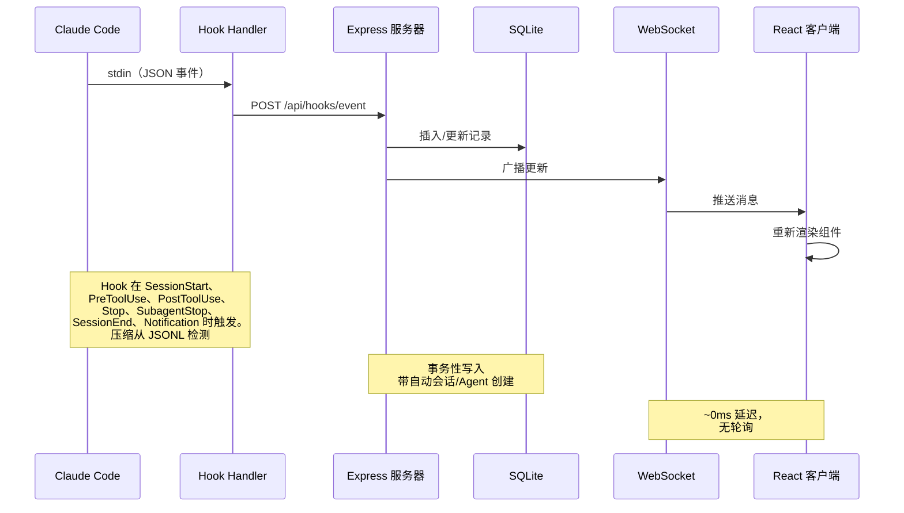

### Hook 生命周期

1. **Claude Code** 在会话开始、工具使用、回合结束、子 Agent 完成和会话退出时触发 Hook
2. **Hook Handler**（`scripts/hook-handler.js`）从 stdin 读取 JSON 事件并 POST 到 API。5 秒超时静默失败，永不阻塞 Claude Code
3. **服务器** 在 SQLite 事务内处理事件：
   - 首次接触时自动创建会话和主 Agent
   - 检测 `Agent` 工具调用以追踪子 Agent 创建
   - `SessionStart` 时,在会话和主 Agent 上盖上 `awaiting_input_since` 时间戳,使停在提示符前的全新 CLI 立即落入**等待中**
   - `UserPromptSubmit` 时(用户按下回车),清除等待标志并将主 Agent 提升为 `working` — 这是文本响应回合开始的唯一可靠信号,因为它们不发出 `PreToolUse`
   - `PreToolUse` 时将 Agent 设为 `working`(同时清除等待标志),`PostToolUse` 后保持 working 状态(也清除等待标志 — 用于处理用户在工具运行期间批准权限提示的场景)
   - 非错误 `Stop` 时,主 Agent 变为 `waiting` — Claude 完成本回合,主动权交给用户。错误 `Stop` 会将 Agent 和会话标记为 `error`。后台子 Agent 继续运行
   - 在权限 `Notification` 时（按消息模式匹配：`permission`、`waiting for input`、`needs your approval` 等），将 Agent 设为 `waiting` 并盖上 `awaiting_input_since`
   - `SubagentStop` 故意不清除等待标志 — 后台子 Agent 完成不能说明用户是否已响应
   - 通过 `SubagentStop` 单独标记子 Agent 为完成。`res.json()` 返回后,触发 fire-and-forget 的 `scanAndImportSubagents`,遍历会话的 `subagents/agent-*.jsonl` 文件,根据 `tool_use_id` 配对 `tool_use` ↔ `tool_result` 块,并在每个子 Agent 自己的 `agent_id` 下发出 `PreToolUse` + `PostToolUse` 事件 — 弥补子 Agent 内部工具调用对 dashboard 不可见的空白
   - `SessionEnd` 时（CLI 进程退出），清除等待标志。如果会话已处于 `error` 状态，则保留错误状态；否则将所有 Agent 和会话标记为 `completed`
   - `SessionStart` 时,任何无活动超过 `DASHBOARD_STALE_MINUTES`(默认 180 = 3 小时,可通过环境变量覆盖)的其他活跃会话自动标记为"abandoned",其 Agent 标记为完成。处理会话内的 `/resume`、Ctrl+C 和其他会话无 `SessionEnd` 而被孤立的场景
   - **错误恢复**：只有 `UserPromptSubmit` 和 `PreToolUse` 可以将会话从 `error` 恢复为 `active` — 表示用户主动进行了重试
   - 新工作事件到达时重新激活 completed/error/abandoned 会话(会话恢复)。Stop 和 SubagentStop 事件也会重新激活 completed/abandoned 会话 — 处理服务器启动前已导入的预存会话,其中第一个 Hook 事件可能是 Stop
   - 检测对话压缩(JSONL Transcript 中的 `isCompactSummary` 条目)并创建 `Compaction` Agent 和事件。Token 基线在压缩中保留,不丢失任何用量。Transcript 读取使用基于 stat 的缓存和增量字节偏移读取 — 仅解析自上次读取后追加的新字节,长会话约提速 50 倍
   - 从 JSONL Transcript 提取 API 错误(`isApiErrorMessage` 条目:配额限制、速率限制、invalid_request)和原始 `type: "error"` 响应,存储为 `APIError` 事件。回合耗时(`system` 子类型 `turn_duration`)存储为 `TurnDuration` 事件。工具结果错误(`toolUseResult.is_error`)追踪为 `ToolError` 事件
   - **错误检测看门狗** — 后台定时器每 15 秒运行一次，扫描没有近期 Hook 事件（>10 秒）的活跃会话。它重新读取 Transcript 文件查找 API 错误（认证失败、速率限制、配额耗尽），从会话 `cwd` 推导 Transcript 路径（用于没有 `transcript_path` 的导入会话），并在发现 API 错误时将会话/Agent 标记为 `error`。这可以捕获 Claude CLI 在 API 错误后不触发 Hook 的情况（例如 401 认证失败时 CLI 只显示错误并等待）
   - **用户中断（Esc）恢复** — 用户按 `Esc` 取消回合时**不会触发任何 Hook**（Claude Code 已知的限制），因此若不加干预，主 Agent 会永远卡在 `working` 状态。同一个 15 秒看门狗以两种方式恢复这些会话：(1) 当取消在 Transcript 中留下 `[Request interrupted by user]` 标记时（Esc 发生在已有部分输出之后），Transcript 缓存通过 `pendingInterrupt` 标记它 —— 该标志纯粹由 Transcript 顺序推导得出（最新的中断与最新的真实回合活动相比，使用同一时钟，因此即便是亚秒级取消也有效）—— 会话在约 15 秒内转入**等待中**；(2) 当 Esc 在**任何输出之前**按下时，Claude Code 完全不写入标记，因此应用空闲超时回退 —— 当主 Agent 处于 `working`、**没有进行中的工具**（`current_tool` 为 null），且 `DASHBOARD_WORKING_IDLE_SECONDS`（默认 `120`）期间**既无 Hook 事件也无 Transcript 推进**时，该回合被视为已死，会话转入**等待中**。两条路径都记录一个 `Interrupted` 事件，并将会话置于与正常 `Stop` 相同的等待中状态。流式输出（Transcript 仍在增长）和进行中的工具调用（`current_tool` 已设置）不受影响；罕见的误判会在下一次真实 Hook 时自愈
   - 周期性服务器清理捕获遗漏事件检测的废弃会话和新压缩(例如 `/compact` 不触发 Hook、会话创建后几秒内 `/resume`)。频率从 `DASHBOARD_STALE_MINUTES` 派生(¼ 阈值,夹在 60 秒–5 分钟之间)。清理共享 Hook Handler 的 Transcript 缓存,避免重复 I/O。废弃会话清理还会驱逐 Transcript 缓存条目以限制内存使用
4. **WebSocket** 将变更广播到所有已连接客户端
5. **UI** 接收更新并重新渲染受影响的组件

### Agent 状态机

持久化状态:`working | waiting | completed | error`。`awaiting_input_since`
字段是补充性的 — 它记录 Agent 开始等待的时间点,用于显示等待时长,但 `waiting`
现在是真正的持久化状态。

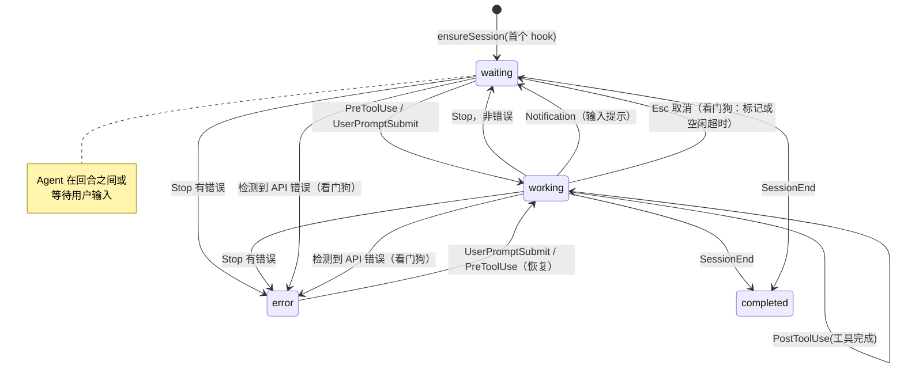

### 会话状态机

持久化状态:`active | completed | error | abandoned`。**等待中**会话状态
是 UI 覆盖层(status=`active` 加上 `awaiting_input_since` 被设置)。

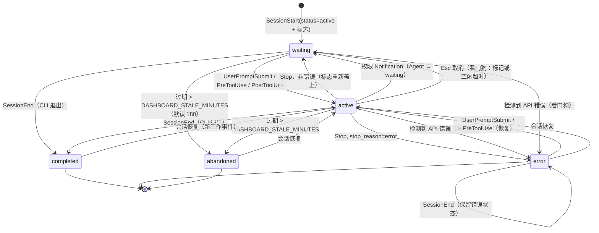

### 成本计算流程

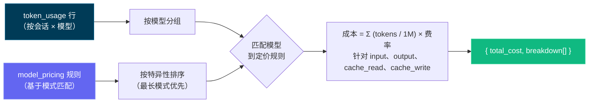

> [!IMPORTANT]
> 成本计算流程基于 Token 使用量和模型定价规则。确保你的定价规则是最新的以反映准确成本。通过设置页面更新模型定价表以保持准确的成本追踪 — Dashboard 不会自动从外部来源获取定价更新。设置定价规则后，Dashboard 会追溯应用于所有会话以保持一致的成本报告。

---

## 配置

| 环境变量 | 默认值 | 描述 |
| ----------------------- | ------------- | --------------------------------------------- |
| `DASHBOARD_PORT` | `4820` | Express 服务器端口 |
| `CLAUDE_DASHBOARD_PORT` | `4820` | Hook Handler 连接服务器使用的端口 |
| `DASHBOARD_WORKING_IDLE_SECONDS` | `120` | 用于恢复**在任何输出之前**以 `Esc` 取消（不会留下 Transcript 标记）回合的空闲工作超时。当主 Agent 处于 `working`、没有进行中的工具，且在此时长内既无 Hook 事件也无 Transcript 推进时，看门狗将会话转入**等待中**。调低可获得更迅捷的恢复，但代价是长时间静默思考的回合上偶尔出现误判（会自愈） |
| `NODE_ENV` | `development` | 设为 `production` 以提供构建后的客户端 |

---

## npm 脚本

| 命令 | 描述 |
| ----------------------- | ---------------------------------------------------------- |
| `npm run setup` | 安装服务端和客户端依赖 |
| `npm run dev` | 同时启动服务端（watch 模式）+ 客户端（Vite HMR） |
| `npm run dev:server` | 仅启动 Express 服务器（`--watch`） |
| `npm run dev:client` | 仅启动 Vite 开发服务器 |
| `npm run build` | 构建 React 客户端到 `client/dist/` |
| `npm start` | 启动生产服务器（提供构建后的客户端） |
| `npm run install-hooks` | 在 `~/.claude/settings.json` 中配置 Claude Code Hook |
| `npm run seed` | 用示例数据填充数据库 |
| `npm run import-history` | 从 `~/.claude/` 导入历史会话（启动时也会运行） |
| `npm run clear-data` | 删除所有会话、Agent、事件和 Token 用量 |
| `npm run mcp:install` | 安装本地 MCP 包（`mcp/`）的依赖 |
| `npm run mcp:build` | 构建 MCP 服务器 TypeScript 到 `mcp/build/` |
| `npm run mcp:start` | 启动 MCP 服务器（stdio 传输 — 用于 MCP 宿主） |
| `npm run mcp:start:http` | 启动 MCP 服务器（HTTP + SSE 传输，端口 8819） |
| `npm run mcp:start:repl` | 启动 MCP 服务器（带 Tab 补全的交互式 REPL） |
| `npm run mcp:dev` | 以开发模式运行 MCP 服务器（`tsx`，stdio） |
| `npm run mcp:dev:http` | 以开发模式运行 MCP 服务器（`tsx`，HTTP + SSE） |
| `npm run mcp:dev:repl` | 以开发模式运行 MCP 服务器（`tsx`，交互式 REPL） |
| `npm run mcp:typecheck` | 类型检查 MCP 源码，不生成构建输出 |
| `npm run mcp:docker:build` | 用 Docker 构建 MCP 容器镜像（`agent-dashboard-mcp:local`） |
| `npm run mcp:podman:build` | 用 Podman 构建 MCP 容器镜像（`localhost/agent-dashboard-mcp:local`） |
| `npm run desktop:install` | 在 `desktop/` 工作区安装 Electron + electron-builder（为 Electron 的 ABI 重新编译 `better-sqlite3`）；预检原生 `better-sqlite3` 构建，失败时打印可操作的安装帮助（含无工具链的替代方案） |
| `npm run desktop:build` | 预构建校验 + `tsc`，编译 Electron 主进程到 `desktop/out/` |
| `npm run desktop:dev` | 构建后启动 Electron，加载本地桌面应用 |
| `npm run desktop:test` | 运行桌面应用冒烟测试（启动 Electron 并探测 `/api/health`） |
| `npm run desktop:dmg` | **macOS：** 构建**通用版** DMG（x64 + arm64）— 用于发布，**构建较慢** |
| `npm run desktop:dmg:arm64` | **macOS：** 构建 Apple Silicon 专用 DMG — **快速** |
| `npm run desktop:dmg:x64` | **macOS：** 构建 Intel 专用 DMG — **快速** |
| `npm run desktop:win` | **Windows：** 构建 NSIS **安装包** `.exe`（x64）— 在 Windows 上运行 |
| `npm run desktop:win:portable` | **Windows：** 构建**免安装便携版** `.exe`（x64）— 在 Windows 上运行 |

---

## Agent 扩展

本仓库包含 Claude Code 和 Codex 的完整扩展层：

- Claude Code：`CLAUDE.md`、`.claude/rules/`、`.claude/skills/`
- Claude 子 Agent：`.claude/agents/`
- Codex：`AGENTS.md`、`.codex/rules/`、`.codex/agents/`、`.codex/skills/`

### 扩展架构

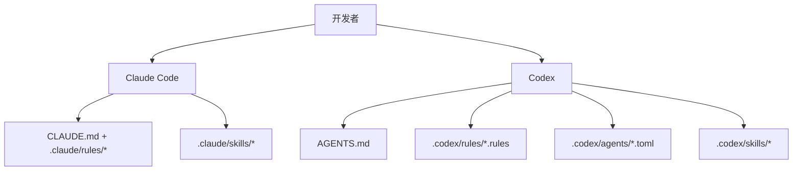

### Claude Code 层

- 持久上下文：
  - [`CLAUDE.md`](./CLAUDE.md)
- 路径作用域规则：
  - [`.claude/rules/backend-node.md`](./.claude/rules/backend-node.md)
  - [`.claude/rules/frontend-react.md`](./.claude/rules/frontend-react.md)
  - [`.claude/rules/mcp-typescript.md`](./.claude/rules/mcp-typescript.md)
  - [`.claude/rules/docs-markdown.md`](./.claude/rules/docs-markdown.md)
- 技能：
  - `repo-onboarding`
  - `ship-feature`
  - `mcp-operations`
  - `debug-live-issue`
- 子 Agent：
  - `backend-reviewer`
  - `frontend-reviewer`
  - `mcp-reviewer`

### Codex 层

- 持久上下文：
  - [`AGENTS.md`](./AGENTS.md)
- 执行策略：
  - [`.codex/rules/default.rules`](./.codex/rules/default.rules)
- 自定义子 Agent 模板：
  - [`.codex/agents/`](./.codex/agents)
- 技能：
  - [`.codex/skills/`](./.codex/skills)
- 设置：
  - [`.codex/README.md`](./.codex/README.md)

---

## Tabby

Tabby 是一只固定在**每个页面右下角**的可爱 SVG 小猫伴侣。它会订阅实时会话 WebSocket 流，并据此做出反应——既为仪表盘增添一丝活力，又提供随手可用的状态概览与快捷操作。它完全构建在现有的 WebSocket 流之上：**无需新增后端、无需 API 密钥。**

### 会做出反应的吉祥物

Tabby 基于实时会话流呈现 **8 种情绪**——空闲（idle）、观察（watching）、开心（happy）、担忧（worried）、卡住（stuck）、思考（thinking）、睡觉（sleeping）、断开连接（disconnected）。它的眼睛会追踪光标，每种情绪都有专属动画，让小猫始终反映当前的会话状态。

### 气泡台词

在值得关注的事件发生时（会话开始 / 结束、出现错误、运行完成），Tabby 会弹出**气泡台词**。台词带有节流，并且可以静音。

### 面板（⌘B / Ctrl+B）

点击小猫，或按 **⌘B / Ctrl+B** 打开面板（按 Esc 关闭）。面板包含：

- **实时状态行**：N 个进行中 · M 个出错 · 连接状态。
- **快捷操作**：跳转到 Run Claude / 活动 / 会话 / 出错的会话，静音，清除提醒。
- **Ask 提问框**：在本地回答简单的状态类问题；其他问题则交给现有的 **Run Claude** 页面（`/run?prompt=...`），以启动一个真正的 Claude Code 会话。**无需新增后端、无需 API 密钥。**

### 无障碍与设置

Tabby 完全构建在现有的 WebSocket 流之上，支持键盘操作、`aria-live`，并尊重 `prefers-reduced-motion` 设置。可在「设置」中随时启用或禁用 Tabby。相关代码位于 `client/src/components/Tabby/`。

---

## MCP 集成

本项目在 `mcp/` 目录下包含一个本地生产级 MCP 服务器，将 Dashboard 操作暴露为 AI Agent 的工具。支持三种传输模式以适应不同的集成场景。

### MCP 传输模式

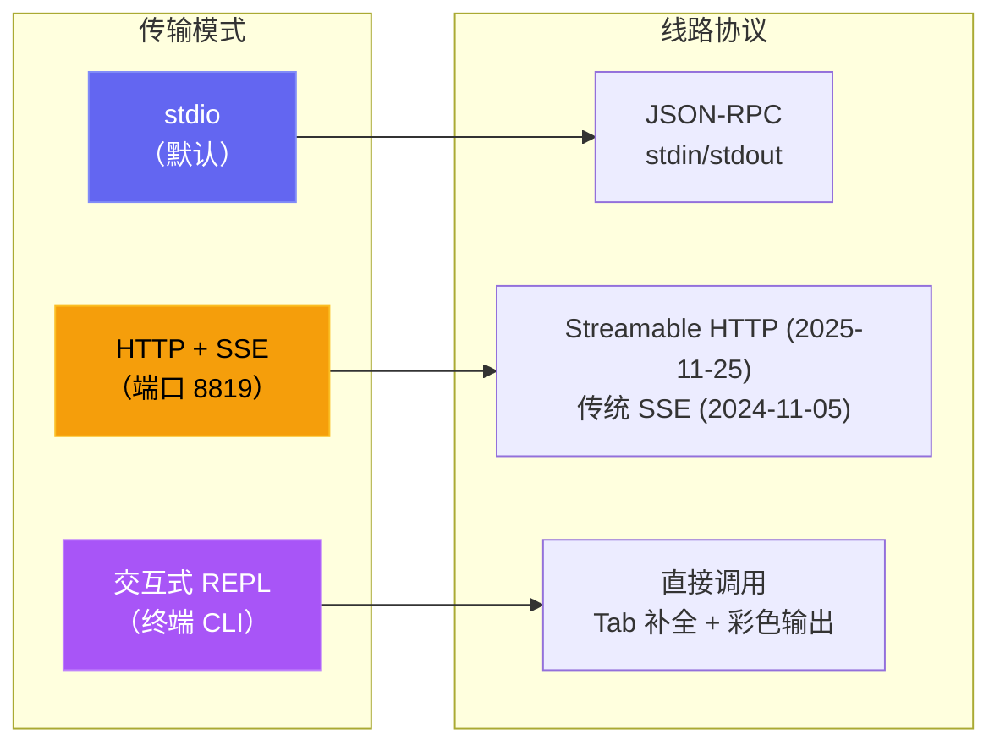

| 模式 | 命令 | 使用场景 |
| --- | --- | --- |
| **stdio** | `npm run mcp:start` | Claude Code、Claude Desktop、IDE MCP 宿主 |
| **HTTP** | `npm run mcp:start:http` | 远程 MCP 客户端、Web 集成、多会话 |
| **REPL** | `npm run mcp:start:repl` | 运维调试、手动工具调用、本地管理 |

<p align="center">
  
</p>

### MCP 架构

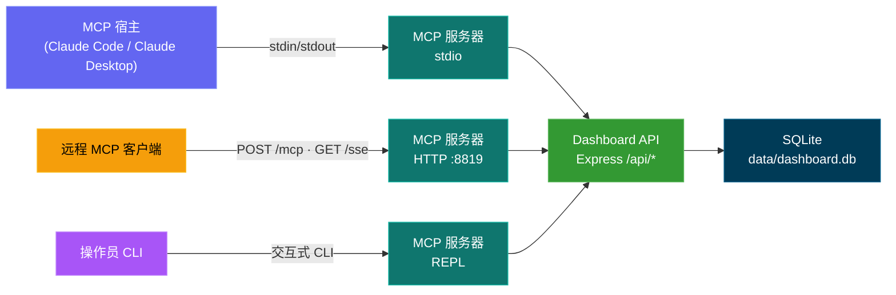

### MCP 工具全景

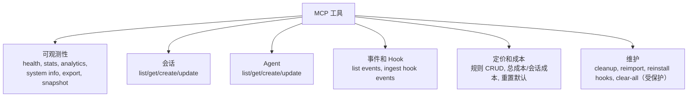

### MCP 安全模型

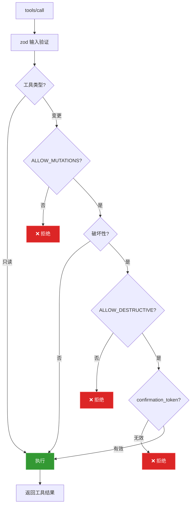

### MCP 运行模式

- 只读模式（默认）：`MCP_DASHBOARD_ALLOW_MUTATIONS=false`
- 管理模式：`MCP_DASHBOARD_ALLOW_MUTATIONS=true`
- 破坏性模式：需要同时满足：
  - `MCP_DASHBOARD_ALLOW_MUTATIONS=true`
  - `MCP_DASHBOARD_ALLOW_DESTRUCTIVE=true`
  - 工具输入 `confirmation_token: "CLEAR_ALL_DATA"`

完整详情：[mcp/README.md](./mcp/README.md)

---

## API 参考

所有端点返回 JSON。错误响应遵循格式 `{ error: { code, message } }`。

### OpenAPI / Swagger

| 方法 | 路径 | 描述 |
| ------ | ------------------- | ----------------------------------- |
| `GET` | `/api/openapi.json` | 原始 OpenAPI 3.0 规范 |
| `GET` | `/api/docs` | 交互式 Swagger UI 文档 |
| `GET` | `/api/redoc` | ReDoc 参考文档（针对阅读优化的三栏式 API 文档）。**自托管**：捆绑包从本地 `/api/redoc/redoc.standalone.js` 提供，不依赖 CDN，可离线使用 |

OpenAPI 文档由 `server/openapi.js` 生成，Swagger UI 由后端直接提供。

仓库根目录还提交了一份 `openapi.yaml`，它镜像实时规范，并通过 `npm run openapi:yaml` 重新生成（唯一可信来源为 `server/openapi.js`，切勿手动编辑）。

API 文档现已**全面覆盖**：每个后端路由都有文档说明（共 75 个路径条目），包含参数、Schema、字段描述与示例；新增文档的路由组包括 `/api/push`、`/api/cc-config`、`/api/run`、`/api/workflows/runs`、`/api/sessions/facets` 与 `/api/settings/claude-home`。

<p align="center">
  
</p>

<p align="center">
  
</p>

### 健康检查

| 方法 | 路径 | 描述 |
| ------ | ------------- | ------------------------------------- |
| `GET` | `/api/health` | 返回 `{ status: "ok", timestamp }` |

### 会话

| 方法    | 路径                            | 查询参数                                                         | 描述                                                                                              |
| ------- | ------------------------------- | ---------------------------------------------------------------- | ------------------------------------------------------------------------------------------------- |
| `GET`   | `/api/sessions`                 | `status`、`q`、`limit`、`offset`                                 | 列出会话（含 Agent 计数与每会话费用）。`q` 对 `id` / `name` / `cwd` 做不区分大小写搜索；`limit` 默认 50，最大 10000；响应包含 `total` 字段供分页器使用 |
| `GET`   | `/api/sessions/:id`             | --                                                               | 会话详情（含 Agent 和事件）                                                                       |
| `GET`   | `/api/sessions/:id/stats`       | --                                                               | 会话详情概览面板使用的聚合计数：事件总数、按类型分类的事件、Top 工具用量、错误数、按类型/状态的 Agent 数、子 Agent 类型分布、Token 总量、时间范围 |
| `GET`   | `/api/sessions/:id/transcripts` | --                                                               | 列出会话的可用 JSONL 转录文件（主 + 子 Agent + 压缩）                                              |
| `GET`   | `/api/sessions/:id/transcript`  | `agent_id`、`limit`、`offset`、`after`、`before`                 | 从指定转录文件流式读取消息，使用游标分页                                                          |
| `POST`  | `/api/sessions`                 | --                                                               | 创建会话（基于 `id` 幂等）                                                                        |
| `PATCH` | `/api/sessions/:id`             | --                                                               | 更新会话状态/元数据                                                                               |

### Agent

| 方法 | 路径 | 查询参数 | 描述 |
| ------- | ----------------- | ----------------------------------------- | ----------------------------- |
| `GET` | `/api/agents` | `status`、`session_id`、`limit`、`offset` | 列出 Agent（支持筛选） |
| `GET` | `/api/agents/:id` | -- | 单个 Agent 详情 |
| `POST` | `/api/agents` | -- | 创建 Agent |
| `PATCH` | `/api/agents/:id` | -- | 更新 Agent 状态/任务/工具 |

### 事件

| 方法 | 路径 | 查询参数 | 描述 |
| ------ | ------------- | ------------------------------- | -------------------------- |
| `GET` | `/api/events` | `session_id`、`limit`、`offset` | 列出事件（最新优先） |

### 统计

| 方法 | 路径 | 描述 |
| ------ | ------------ | ------------------------------------------------------ |
| `GET` | `/api/stats` | 聚合计数、状态分布、WS 连接数 |

### 分析

| 方法 | 路径 | 描述 |
| ------ | ---------------- | ---------------------------------------------------------- |
| `GET` | `/api/analytics` | 用于图表和趋势视图的 Token / 工具 / 会话聚合数据 |

### Hook

| 方法 | 路径 | 描述 |
| ------ | ------------------ | -------------------------------------------- |
| `POST` | `/api/hooks/event` | 接收并处理 Claude Code Hook 事件 |

**Hook 事件载荷：**

```json
{
  "hook_type": "PreToolUse",
  "data": {
    "session_id": "abc-123",
    "tool_name": "Bash",
    "tool_input": { "command": "ls -la" }
  }
}
```

### 定价

| 方法 | 路径 | 描述 |
| -------- | ------------------------ | ---------------------------------------- |
| `GET` | `/api/pricing` | 列出所有定价规则 |
| `PUT` | `/api/pricing` | 创建或更新定价规则 |
| `DELETE` | `/api/pricing/:pattern` | 删除定价规则 |
| `GET` | `/api/pricing/cost` | 所有会话的总成本 |
| `GET` | `/api/pricing/cost/:id` | 指定会话的成本明细 |

### 工作流

| 方法 | 路径 | 描述 |
| ------ | ----------------------------- | ------------------------------------------------------- |
| `GET` | `/api/workflows` | 聚合工作流数据（编排、工具、模式）。可选 `?status=active|completed` 查询参数按会话状态筛选全部 11 个数据模块 |
| `GET` | `/api/workflows/session/:id` | 按会话下钻（Agent 树、工具时间线、事件） |

### 设置

| 方法 | 路径 | 描述 |
| ------ | ------------------------------ | ------------------------------------------------ |
| `GET` | `/api/settings/info` | 系统信息、数据库统计、Hook 状态 |
| `POST` | `/api/settings/clear-data` | 删除所有会话、Agent、事件、Token 用量 |
| `POST` | `/api/settings/reinstall-hooks` | 重新安装 Claude Code Hook |
| `POST` | `/api/settings/reset-pricing` | 重置定价为默认值 |
| `GET` | `/api/settings/export` | 以 JSON 下载方式导出所有数据 |
| `POST` | `/api/settings/cleanup` | 废弃过期会话、清除旧数据 |

### 导入历史（Import History）

将已有的 Claude Code 会话从三种不同来源导入到仪表盘。三条路径都汇入
服务器用于实时采集的同一套解析管线（`parseSessionFile` +
`importSession`），因此导入后的 Token 数量、按模型计费、compactions、
子 Agent、工具调用以及回合耗时与实时捕获的结果**完全一致**。重复导入
是幂等的：会话以 UUID 去重，compaction `baseline_*` 列保留压缩前的
Token 总量，所以多次运行导入也绝不会重复计算用量或成本。

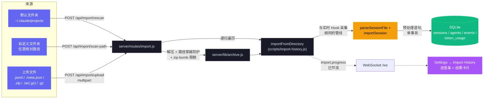

**API 路由**

| 方法   | 路径                    | 描述                                                             |
| ------ | ----------------------- | ---------------------------------------------------------------- |
| `GET`  | `/api/import/guide`     | 按操作系统返回路径、打包命令、支持扩展名与分步说明               |
| `POST` | `/api/import/rescan`    | 重新扫描默认目录 `~/.claude/projects`                            |
| `POST` | `/api/import/scan-path` | 扫描任意绝对路径的目录（body `{ path }`）；递归遍历子目录         |
| `POST` | `/api/import/upload`    | 多部分上传 `.jsonl`、`.meta.json`、`.zip`、`.tar(.gz)`、`.gz`    |

**支持的输入。** 独立的 `.jsonl` 会话转录、配套的 `.meta.json`
元数据文件，以及包含任意嵌套目录结构的归档文件（`.zip`、`.tar`、
`.tar.gz`/`.tgz`、`.gz`）。Claude Code 的两种官方布局都会被自动识别：
`<project>/<sessionId>/subagents/agent-*.jsonl`（默认）和
`<project>/subagents/<sessionId>/agent-*.jsonl`（备选）。

**准确性保证。** 会话按 UUID 去重；重复导入始终安全。compaction 的
`baseline_input` / `baseline_output` / `baseline_cache_read` /
`baseline_cache_write` 列保留了压缩之前的 Token 总量，因此重新导入
压缩后的 JSONL 永远不会抹掉历史成本。

**安全性。** 归档解压会对每个条目进行路径穿越校验（绝对路径和 `..`
路径段会被拒绝）。可配置的解压尺寸上限
（`CCAM_IMPORT_MAX_EXTRACT_BYTES`，默认 4 GB）可阻止 zip/tar/gzip
炸弹。上传大小按单文件（`CCAM_IMPORT_MAX_BYTES`，默认 1 GB）与单次
请求（`CCAM_IMPORT_MAX_FILES`，默认 2000）分别限制。每个请求使用
**独立**的临时目录，`finally` 中会被回收——即使 multer 提前拒绝了所有
文件也会被清理。

**进度。** 导入活动通过现有的 WebSocket 以 `import.progress` 消息广播
（`phase`：`start` / `scan` / `extract` / `parse` / `complete` /
`error`），并进行节流以避免在大批量导入时刷屏。

**UI。** 在 **Settings → Import History** 面板中使用拖放式向导，查看
分步指引、实时进度，以及导入完成后的结果卡片（imported / enriched /
skipped / errors 计数）。

<p align="center">
  
</p>

### WebSocket

连接 `ws://localhost:4820/ws` 接收实时推送消息：

```json
{
  "type": "agent_updated",
  "data": { "id": "...", "status": "working", "current_tool": "Edit" },
  "timestamp": "2026-03-05T15:43:01.800Z"
}
```

**消息类型：** `session_created`、`session_updated`、`agent_created`、`agent_updated`、`new_event`

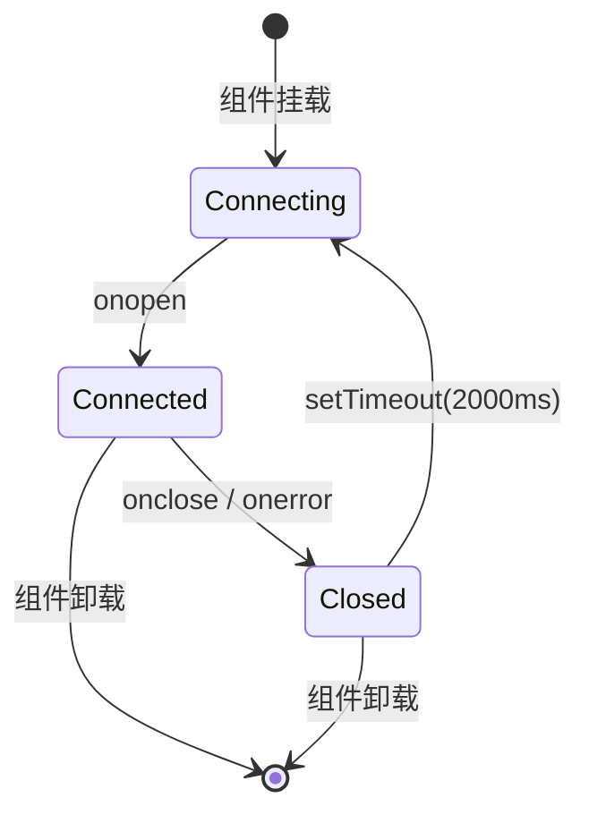

---

## Hook 事件

Dashboard 处理以下 Claude Code Hook 类型：

| Hook 类型 | 触发时机 | Dashboard 操作 |
| -------------- | ------------------------------ | -------------------------------------------------------------------------------------------- |
| `SessionStart` | Claude Code 会话开始 | 创建会话和主 Agent。盖上 `awaiting_input_since`,使新会话立即落入**等待中**。重新激活恢复的会话。废弃无活动超过 `DASHBOARD_STALE_MINUTES`(默认 180)的孤立会话 |
| `UserPromptSubmit` | 用户在提示符前按下回车 | 清除等待标志并将主 Agent 提升为 `working` — 文本响应回合开始的唯一可靠信号,因为它们不发出 `PreToolUse` |
| `PreToolUse` | Agent 开始使用工具 | 清除等待标志,设置 Agent 为 `working`,设置 `current_tool`。如果工具是 `Agent`,创建子 Agent 记录 |
| `PostToolUse` | 工具执行完成 | 清除等待标志(用于处理用户在工具运行期间批准权限提示的场景)。清除 `current_tool`。Agent 保持 `working` |
| `Stop` | Claude 完成响应 | 非错误：主 Agent → `waiting` — Claude 完成本回合，主动权交给用户。`stop_reason=error`：将 Agent 和会话标记为 `error`。后台子 Agent 继续运行 |
| `SubagentStop` | 后台 Agent 完成 | 通过描述、类型或任务匹配并完成子 Agent。故意不清除等待标志 — 子 Agent 完成不能说明用户是否已响应。**触发 fire-and-forget 的 JSONL 扫描**(`scanAndImportSubagents`),在子 Agent 自己的 `agent_id` 下为每个 tool 发出 `PreToolUse` + `PostToolUse` 事件,使 Timeline 显示子 Agent 运行的所有 tool,而不仅仅是 spawn 标记 |
| `Notification` | Agent 通知 | 记录事件。权限/输入提示消息将 Agent 设为 `waiting` 并盖上 `awaiting_input_since`（模式：`permission`、`waiting for input`、`needs your approval` 等）。压缩通知标记为 `Compaction` 事件。如果启用,触发浏览器通知 |
| `SessionEnd` | Claude Code CLI 进程退出 | 清除等待标志。如果会话已处于 `error` 状态，则保留错误状态；否则将所有 Agent 和会话标记为 `completed` |
| `Compaction` | JSONL 中检测到 `/compact` | 创建压缩子 Agent（类型 `compaction`）和 Compaction 事件。通过 Transcript JSONL 中的 `isCompactSummary` 条目检测。也可由周期性扫描器对活跃会话检测 |
| `APIError` | JSONL Transcript 中的 API 错误 | 从 `isApiErrorMessage` 条目（配额、速率限制、invalid_request）和原始 `type: "error"` 响应中提取。**立即将会话和 Agent 标记为 `error`** — 之前仅记录事件而不更改状态。存储为包含错误详情的事件 |
| `Interrupted` | 用户取消的回合（Esc） | 由看门狗合成 —— `Esc` 不触发任何 Hook，因此从 Transcript 的 `[Request interrupted by user]` 标记，或当 Esc 发生在任何输出之前时从空闲工作超时（`DASHBOARD_WORKING_IDLE_SECONDS`）检测出卡住的 `working` 会话。会话转入**等待中**（与正常 `Stop` 相同） |
| `TurnDuration` | JSONL Transcript 中的回合计时 | 从 `system` 子类型 `turn_duration` 消息中提取，含 `durationMs`。存储为回合级计时分析事件 |
| `ToolError` | JSONL 中的工具结果错误 | 从 `toolUseResult.is_error` 条目中提取。追踪工具级失败用于错误传播分析 |

---

## 浏览器通知

Dashboard 支持通过 Web Push (VAPID) 实现持久化浏览器通知。即使 Dashboard 标签页未聚焦或浏览器处于后台，也能提供实时警报。

### 工作原理

1. **启用** — 在设置页面通过主开关启用通知
2. **授权** — 在浏览器提示时授予权限 — 这将注册一个 Service Worker 并创建一个推送订阅
3. **配置** — 选择哪些事件触发通知：

| 事件 | 默认 | 描述 |
| ---------------------------- | ------- | --------------------------------------------------------------- |
| 新会话开始 | 开 | 新 Claude Code 会话创建时触发 |
| Claude 完成响应 | 关 | Claude 完成响应回合时 `Stop` 事件触发 |
| 会话关闭 | 关 | CLI 进程退出时 `SessionEnd` 触发 |
| 会话错误 | 开 | 会话以错误结束时触发 |
| 子 Agent 生成 | 关 | 后台子 Agent 创建时触发 |

此外，来自 Claude Code 的任何 `Notification` Hook 事件都会触发浏览器通知（只要主开关启用），不受按事件开关影响。

### 通知架构

- **VAPID 管道：** 服务端使用 `web-push` 进行安全消息传递。VAPID 密钥自动生成并存储在 `data/vapid-keys.json`。
- **Service Worker：** 专用 Worker (`client/public/sw.js`) 处理传入的 `push` 事件，并以 `silent: false` 显示通知，以确保在 macOS 上播放音效。
- **订阅：** 浏览器特定的端点存储在 SQLite 的 `push_subscriptions` 表中。
- **持久性：** 由于 Service Worker 在后台运行，即使浏览器已关闭，通知仍能送达。
- **测试通知：** 设置页面中的按钮可让你验证 VAPID 管道和音效播放。

---

## 更新提醒

Dashboard 会监视自身的 git 检出，当规范默认分支领先于 HEAD 时弹出模态框。**支持分支与 fork：** 若配置了 `upstream` 远程（fork 的常规约定），则优先于 `origin`；所选远程的 `master`/`main`/`HEAD` 即为对比引用。`manual_command` 会根据用户处境调整——只有在本地分支真正跟踪规范引用时才用 `git pull --ff-only`，否则用 `git fetch`（fork 场景再加上 fast-forward 合并），命令永不撒谎。用户得到的是要在终端里执行的确切命令——服务端**永远不会**自动拉取或重启自己，这样机制在开发会话、pm2/systemd/launchd/Docker 等进程管理以及远程部署中都保持可移植性。

<p align="center">
  
</p>

### 工作原理

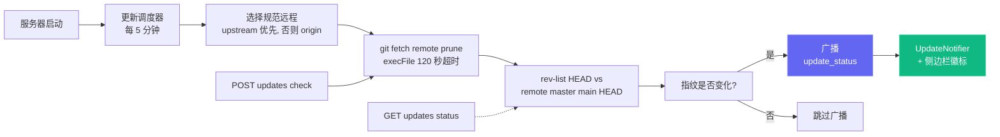

单次检查开销很小（针对所选规范远程的 `git fetch <remote> --prune`——若配置了 `upstream` 则优先使用，否则用 `origin`），使用 `execFile`（不经 shell）封装并设有 120 秒超时。各种失败场景——离线、非 git 安装、未配置远程、无法解析上游引用——都会返回**软失败载荷**（例如 `fetch_error: "..."`）而非抛错，因此不稳定的远程永远不会阻塞 Dashboard。

### UI 入口

| 位置 | 行为 |
| --- | --- |
| **模态框** (`client/src/components/UpdateNotifier.tsx`) | 当 `update_available === true` 且用户尚未针对当前 `remote_sha` 关闭过时出现。显示落后的提交数、所追踪的引用、可复制的命令，以及三个按钮：**复制命令**（主按钮）、**立即检查**、**关闭**。ESC 与点击背景也可关闭。基于 `remote_sha` 在 `localStorage` 中持久化，上游出现更新提交时会自动重新弹出。 |
| **侧边栏按钮** (`client/src/components/Sidebar.tsx`) | 常驻在底部的"检查更新"按钮。落后时显示翠绿边框与绿色徽标点，最近一次检查失败时为琥珀色。点击会清除之前的"关闭"状态，并触发 `POST /api/updates/check`。 |
| **服务器终端** | 当调度器状态从"最新"变为"落后"时，会向 stdout 打印一段带框的命令块，便于无头运行的用户也能看到。 |

### API 端点

| 端点 | 作用 |
| --- | --- |
| `GET /api/updates/status` | 只读检查：对规范远程运行 `git fetch`，比较 HEAD 与其默认分支，返回载荷。 |
| `POST /api/updates/check` | 相同的检查，但会同时通过 WebSocket 广播 `update_status`，让所有连接的客户端同步更新。 |

两个端点返回相同的载荷结构：

```json
{
  "git_repo": true,
  "update_available": true,
  "repo_root": "/Users/you/Claude-Code-Agent-Monitor",
  "remote_ref": "upstream/master",
  "canonical_remote": "upstream",
  "current_branch": "master",
  "tracking_upstream": "origin/master",
  "tracks_canonical": false,
  "situation": "fork_or_diverged_tracking",
  "local_sha": "abc1234...",
  "remote_sha": "def5678...",
  "commits_behind": 3,
  "manual_command": "cd \"/...\" && git fetch upstream && git merge --ff-only upstream/master && npm run setup",
  "situation_note": "You're on 'master' tracking 'origin/master'. This command fast-forwards your branch from upstream/master (the canonical default).",
  "message": "3 commit(s) on upstream/master not in your checkout."
}
```

`situation` 取值：`tracking_canonical`（典型克隆，本地分支跟踪规范引用——`git pull --ff-only` 即可）；`fork_or_diverged_tracking`（本地分支名与规范一致但跟踪了不同的远程，例如 fork——`git fetch <remote> && git merge --ff-only <ref>`）；`feature_branch`（不在规范默认分支上——只 fetch，由用户决定如何整合）；`detached_head`。

### 为何**没有**自动更新

这里没有 `POST /api/updates/apply`，也没有自重启脚本——这是有意为之。在没有外部进程管理的情况下让进程自我替换并不可靠：`npm run dev`（concurrently）、`npm start`、`pm2`、`systemd`、`launchd`、Docker 各自需要不同的重启逻辑，而 `git pull` / `npm install` 在一个即将退出的进程里失败时没有干净的回滚路径。只做检测能让行为在所有进程管理器、所有操作系统、所有分支状态下都保持可预测，同时仍然解决"什么时候需要拉取？"的信息缺口；实际的更新操作由用户在自己的 shell 中完成。

### 配置

| 环境变量 | 默认值 | 说明 |
| --- | --- | --- |
| `DASHBOARD_UPDATE_CHECK` | 启用 | 设为 `0` / `false` / `off` 可完全禁用调度器。 |
| `DASHBOARD_UPDATE_CHECK_INTERVAL_MS` | `300000`（5 分钟） | 两次自动检查的间隔。下限为 60 000 毫秒——低于此值会被钳制。 |

---

## 连接状态弹窗

点击侧边栏底部的 **Live** / **Disconnected** 标签，可打开一个关于 Dashboard WebSocket 传输的小型详情面板。它会显示当前的 `ws://` 端点、本次连接保持的时长、累计接收的事件数、以横向条形图展示的高频事件类型、最近 60 秒的吞吐量折线图，以及最近 8 个事件的活动列表。累计统计（总数、类型分布、最近列表）通过 `localStorage` 中的 `sidebar-connection-stats` 键持久化，可在刷新后保留；滚动折线图和"已连接时长"则有意保持临时性。底部的 **Reset** 按钮可一键清空所有数据。

<p align="center">
  
</p>

---

## VS Code 扩展

**Claude Code Agent Monitor** 现已作为官方 VS Code 扩展提供，让你无需离开编辑器即可监控 AI Agent。

<p align="center">
  
</p>

### 🚀 核心功能
- **实时侧边栏**：专用的 Activity Bar 视图，实时显示 Agent 状态（工作中、等待中、已完成、错误）。
- **使用分析**：直接在侧边栏追踪总 Token 消耗、实时美元成本和事件计数。
- **状态栏集成**：底部状态栏显示活跃会话和 Agent 的实时脉搏。
- **深度导航**：一键访问特定的 Dashboard 页面（看板、分析、设置）或近期会话。
- **集成标签页**：作为原生 VS Code Webview 标签页打开完整的监控面板。

### 📦 安装与设置
1. 打开 [vscode-extension](./vscode-extension) 目录。
2. 从 Marketplace 安装或使用 `vsce package` 自行打包安装。
3. 确保本地 Dashboard 服务器正在运行（`npm run dev`）。
4. 点击 VS Code Activity Bar 中的 **雷达图标** 即可开始使用。

有关详细的开发人员配置，请参阅 [.vscode](./.vscode) 和 [vscode-extension](./vscode-extension) 目录。

> [!TIP]
> Extension on VS Code Marketplace: [Claude Code Agent Monitor](https://marketplace.visualstudio.com/items?itemName=hoangsonw.claude-code-agent-monitor)

---

## 桌面应用（macOS 与 Windows）

Dashboard 现在还提供一个可选的**原生桌面应用**，将现有的服务端 + 客户端打包进单个应用，安装一次即可长期使用：macOS 版为一个 `.app`（以 `.dmg` 分发），Windows 版为一个 `.exe`（一个 NSIS 安装包，外加一个免安装的便携版）。你在浏览器 `localhost:4820` 看到的全部内容都运行在这个窗口里，并在其上叠加了原生操作系统的生命周期能力：托盘图标、应用菜单、开机自启集成，以及一个能干净关闭服务器的「退出」按钮。

<p align="center">
  
  <br>
  <em>🍎🪟 <strong>桌面应用</strong> —— 原生外壳:菜单栏 / 通知区域(托盘)图标、登录项自启动、单实例锁。同一套 Dashboard,运行在真正的操作系统窗口里(图为 macOS)。</em>
</p>

<p align="center">
  
  <br>
  <em>🪟 同一套 Dashboard 作为原生 Windows 应用运行 —— 通知区域(托盘)图标、原生窗口菜单与登录项自启动。</em>
</p>

> **状态：** v1，支持 macOS 与 Windows。Linux 构建作为后续工作跟踪 —— Electron 让它实现起来并不难，但每个平台都需要各自的 QA。自动更新（auto-updater）同样不在 v1 范围内，当前的更新方式是重新下载最新的安装包。

`desktop/` 是与 `client/`、`server/`、`mcp/`、`vscode-extension/` 平级的同级工作区，使用 **Electron 35** 构建。它**以进程内方式嵌入现有的 Express 服务器**——直接 `require()` `server/index.js`，运行在与 Electron 主进程相同的 Node 运行时中，**没有子进程、没有 IPC**——并在 `BrowserWindow` 中渲染已构建好的 React 客户端。

### 与 PWA 有何不同

[`#144`](https://github.com/hoangsonww/Claude-Code-Agent-Monitor/pull/144) 引入的 PWA 让 Dashboard 可以在 Chromium 系浏览器中安装，适合已经让服务器常驻运行的用户。桌面应用解决的是另一个正交问题：**无需终端窗口即可启动并保持服务器运行**。

| 能力 | PWA | 桌面应用 |
| ------------------------------- | --------------------------- | ------------------------ |
| 安装到 Dock / 应用程序文件夹 | ✅ | ✅ |
| 管理 Express 服务器 | ❌ —— 需用户单独 `npm start` | ✅ —— 进程内嵌入 |
| 开机自启 | ❌ | ✅ —— macOS 登录项 / Windows 启动项 |
| 菜单栏 / 通知区域（托盘）图标常驻状态 | ❌ | ✅ |
| 原生应用菜单（⌘ 快捷键等） | ❌ | ✅ |
| 浏览器重启后仍存活 | ⚠️ 取决于浏览器 | ✅ |

两者可以共存 —— 按你的工作流选择即可。

### 它在仓库中的位置

桌面应用本身**不改动任何其他工作区的运行时行为**。`desktop/` 之外唯一的改动是对 `server/index.js` 做了一次**保持行为不变的重构**：监听端口后的引导逻辑（更新调度器、Claude Code 配置监视器 `cc-watcher`、孤儿运行对账）被抽取为一个导出的 `startBackgroundServices()`，使嵌入式服务器与 `node server/index.js` 运行完全相同的逻辑。独立服务器的运行路径在功能上没有任何变化。

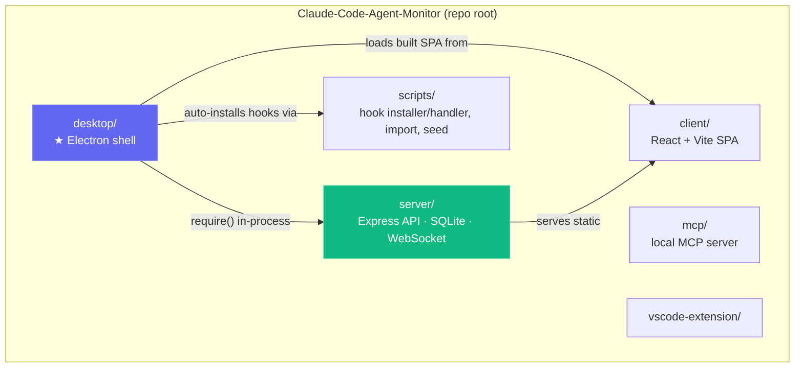

### 获取并安装

**方式 A —— 下载预构建的安装包（推荐）：**

从 [**Releases → latest**](https://github.com/hoangsonww/Claude-Code-Agent-Monitor/releases/latest) 下载（公开，无需登录 GitHub）。每当 `master` 上的 `package.json` 版本号被提升时，CI 都会自动发布一个新的 `vX.Y.Z`，因此该链接始终指向当前版本：

| 平台 | 资源文件 | 说明 |
| --- | --- | --- |
| macOS（Apple Silicon） | `ClaudeCodeMonitor-<ver>-arm64.dmg` | 拖入 `/Applications` |
| macOS（Intel） | `ClaudeCodeMonitor-<ver>-x64.dmg` | 拖入 `/Applications` |
| Windows（安装版） | `ClaudeCodeMonitor-Setup-<ver>-x64.exe` | 按用户安装，无需管理员权限 |
| Windows（便携版） | `ClaudeCodeMonitor-<ver>-x64-portable.exe` | 无需安装即可运行 |

若需要 **每次提交的最新构建**，可改用 CI 产物（需登录，保留 14 天）：来自 `🍎 macOS Desktop (DMG)` 作业的 `ClaudeCodeMonitor-dmg`，以及来自 `🪟 Windows Desktop (EXE)` 作业的 `ClaudeCodeMonitor-win`。

安装：

**macOS：**

1. 双击 `.dmg` 将其挂载。
2. 将 **Claude Code Monitor.app** 拖入你的 `/Applications`（应用程序）文件夹。
3. DMG 默认采用**临时签名（ad-hoc signed）**，因此首次启动时 macOS Gatekeeper 会发出警告（*"Apple could not verify…"*）。清除隔离属性：

   ```bash
   xattr -cr "/Applications/Claude Code Monitor.app"
   ```

   或者打开 **系统设置 → 隐私与安全性**，点击**仍要打开（Open Anyway）**。

4. 启动应用。托盘图标出现，Dashboard 窗口打开。

**Windows：**

1. 运行 `ClaudeCodeMonitor-Setup-<ver>-x64.exe`。它会**按用户**安装到 `%LOCALAPPDATA%\Programs\Claude Code Monitor`（无需管理员提权）并允许你选择安装目录；或运行 `*-portable.exe` 无需安装即可启动。
2. 安装包**默认未签名**，因此首次启动时 Windows **SmartScreen** 可能弹出「**Windows 已保护你的电脑**」（*"Windows protected your PC"*）—— 点击**更多信息（More info）→ 仍要运行（Run anyway）**。
3. 从开始菜单 / 桌面快捷方式启动。通知区域（托盘）图标出现，Dashboard 窗口打开。

<p align="center">
  
  <br>
  <em>Windows 安装包 · 第 1 步 —— <strong>选择安装选项</strong>（按用户「仅为我」对比全部用户）。</em>
</p>

<p align="center">
  
  <br>
  <em>Windows 安装包 · 第 2 步 —— <strong>选择安装位置</strong>（默认指向按用户的 <code>%LOCALAPPDATA%\Programs</code>）。</em>
</p>

<p align="center">
  
  <br>
  <em>Windows 安装包 · 第 3 步 —— <strong>完成安装</strong>（结束并启动应用）。</em>
</p>

**方式 B —— 本地构建：**

```bash
# 在项目根目录，git clone 之后：
npm run setup                # 安装根目录 + 客户端依赖、构建客户端、安装 Hook
npm run build                # 构建 React 客户端（client/dist）
npm run desktop:install      # 在 desktop/ 中安装 Electron + electron-builder（预检原生依赖；失败时打印安装帮助）
npm run desktop:dmg:arm64    # macOS：  快速的单架构 DMG → desktop/release/ClaudeCodeMonitor-<ver>-arm64.dmg
npm run desktop:win          # Windows：NSIS 安装包 → desktop/release/ClaudeCodeMonitor-Setup-<ver>-x64.exe
```

> [!NOTE]
> **DMG 在 macOS 上构建，Windows `.exe` 在 Windows 上构建** —— electron-builder 针对宿主操作系统打包。macOS 的通用版 `npm run desktop:dmg` 构建**有意设计得很慢**（它会把应用构建两次，再用 `@electron/universal` 合并）；为自己的 Mac 构建时请使用单架构的 `desktop:dmg:arm64` / `desktop:dmg:x64`。在 Windows 上，`npm run desktop:install` 会把 `better-sqlite3` 作为 Electron 预编译二进制拉取，因此常见情况下无需 Visual Studio C++ 工具链。若构建确实失败（没有预编译二进制，或缺少 C++ 工具链），`desktop:install` 会打印准确的分平台修复步骤外加一个无工具链的替代方案，并**显式失败（fail loudly）**，而非留下一个损坏的安装。

#### 原生依赖预检（preflight）

`npm run desktop:install` 会运行 `scripts/install.js`，它在重新编译 `better-sqlite3`（依赖树中唯一的原生模块）之前先做一次预检。若该原生构建失败，它会打印分平台的工具链前置条件，并**以非零状态退出**（绝不让你误以为安装成功）；桌面构建的 `prebuild.js` 也会以同样的方式提前失败（fail fast）。打印出的指引包含两类常见原因与一个无工具链的替代方案：

- **缺少 C++ 构建工具链**，模块无法从源码编译：
  - **Windows：** 安装带 **「Desktop development with C++」** 工作负载的 **Visual Studio Build Tools**。
  - **macOS：** `xcode-select --install`
  - **Linux：** 安装 `build-essential` + `python3`。
- **你的 Node.js 比任何已发布的 `better-sqlite3` 预编译二进制都新** —— 改用 Node LTS（20 或 22），它们自带预编译二进制，可完全避免编译。

或者，跳过源码编译、直接拉取 Electron 的预编译二进制（**无需 C++ 工具链**）：

```bash
cd desktop
npm install --ignore-scripts
node node_modules/electron/install.js
npx electron-builder install-app-deps
```

#### 首次启动：Gatekeeper / SmartScreen

安装包**默认未签名 / 临时签名**，因此首次启动时操作系统可能会发出警告。

**macOS** —— DMG 默认采用**临时签名（ad-hoc signing）**，在没有付费 Apple Developer ID 的情况下这是项目能提供的最高级别。macOS 首次打开时会警告「Apple 无法验证…」。两种绕过方式：

```bash
# 最简单：在打开前去掉隔离属性。
xattr -cr ~/Downloads/ClaudeCodeMonitor-*.dmg

# 或者在拖入「应用程序」之后去掉应用的隔离属性：
xattr -cr "/Applications/Claude Code Monitor.app"
```

也可以打开  → *系统设置 → 隐私与安全性*，滚动到被拦截的项目，点击*仍要打开*。

**Windows** —— 安装包**默认未签名**，因此首次启动时 **SmartScreen** 可能弹出「**Windows 已保护你的电脑**」（*"Windows protected your PC"*）—— 点击**更多信息（More info）→ 仍要运行（Run anyway）**。

### 启动后会发生什么

1. Electron 主进程挑选一个空闲端口 —— 优先 **4820**，其次回退到 4821–4829，若都被占用则使用一个随机的高位端口。
2. 如果端口 4820 上已有进程响应 `/api/health`（例如你已在终端运行 `npm start`），桌面应用会**直接采用（adopt）那个服务器**，不再启动第二个，避免重复绑定端口与 SQLite 争用。被采用的服务器不归应用所有 —— 退出应用时它仍会继续运行。
3. 否则，应用直接 `require()` `server/index.js` 在进程内启动 —— 与主进程同一个 Node 运行时、同一块内存，启动通常在两秒以内。
4. 在**首次由应用自有（owned）的服务器启动**时，应用会自动安装 Claude Code Hook（写入 `~/.claude/settings.json`），并启动后台服务（更新调度器、`cc-watcher` 配置监视器、孤儿运行对账）—— 这样**仅安装应用的用户无需从代码检出运行 `npm run install-hooks` 即可让事件流转**。
   - **（macOS）** 应用还会恢复你登录 Shell 的 `PATH`，使「运行 Claude」（Run Claude）功能能够找到并启动 `claude` CLI —— 从 Finder/Dock 启动的应用否则只会继承 launchd 提供的极简 `PATH`，会漏掉 `~/.local/bin`、`/opt/homebrew/bin`、版本管理器目录等位置的 CLI。（在 Windows 上，进程已继承用户 `PATH`。）
5. Dashboard 窗口打开 —— 除非应用是在登录时被启动的（macOS 通过登录项；Windows 通过带标记的 `HKCU\…\Run` 项），此时它会保持仅托盘模式。
6. 托盘（macOS 菜单栏 / Windows 通知区域）出现一个图标，菜单包含：*打开 Dashboard、在浏览器中打开、重启服务器、查看日志、开机自启（开关）、退出*。

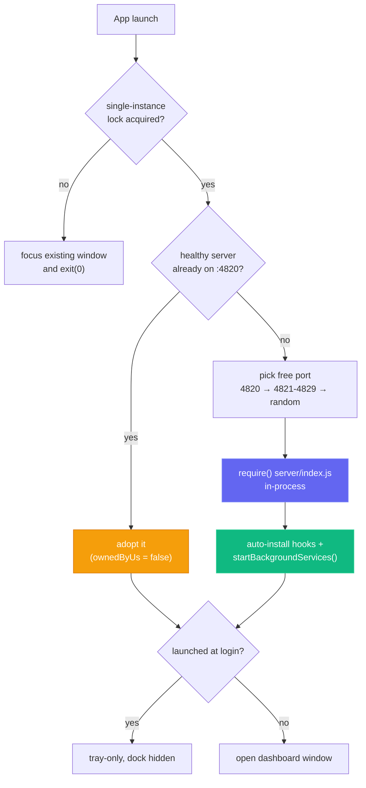

### 生命周期语义

- **托盘图标** —— 常驻状态面板（macOS 菜单栏 / Windows 通知区域）。左键单击切换 Dashboard 窗口的显示/隐藏；右键单击打开上下文菜单，包含**打开 Dashboard**、**在浏览器中打开**、**重启服务器**、**查看日志**、**开机自启**（开关）与**退出**。macOS 使用着色的模板图标；Windows 使用彩色的 `icon.ico`（纯黑模板图标在深色任务栏上会看不见）。
- **窗口与任务栏图标** —— `BrowserWindow` 已绑定彩色的应用 Logo（Windows 上为 `icon.ico`，其他平台为 `icon.png`），因此标题栏 / 任务栏显示的是真正的 Claude Code Monitor 图标 —— 即便是未打包的 `npm run desktop:dev` 运行，也不再显示通用的 Electron 图标。
- **原生应用菜单** —— 标准的 `About` / `File` / `Edit` / `View` / `Window` / `Help` 菜单，带 `⌘` / `Ctrl` 快捷键。其中 **File → Open Dashboard**（`⌘1`）项**仅在 macOS 上可用**：macOS 在窗口隐藏后仍保留全局菜单栏，因此该项能重新打开窗口 —— 而在 Windows/Linux 上，菜单是依附于窗口的，窗口隐藏时菜单快捷键无法触发，所以请改从托盘的 **Open Dashboard** 重新打开（即便窗口已最小化或被其他窗口遮挡，它也能可靠地将窗口**调到前台**）。
- **关闭窗口只是隐藏它。** 服务器继续运行，托盘图标保留。点击托盘即可重新调出窗口。
- **退出（⌘Q / Ctrl+Q，或托盘 → 退出）** 会优雅关闭嵌入式服务器、干净关闭 SQLite（完成 WAL checkpoint），然后退出。
- **开机自启开关：** 在托盘菜单（或应用菜单）中切换*开机自启*。在 macOS 上，它通过 `SMAppService` / `ServiceManagement` 框架注册 —— 你会在  → *系统设置 → 通用 → 登录项* 中看到该条目；在 Windows 上，它写入一个按用户的 `HKCU\Software\Microsoft\Windows\CurrentVersion\Run` 项，可在**任务管理器 → 启动**中看到。当应用在登录时被启动时，它以**仅托盘模式**启动，不会有窗口突然弹到用户面前。
- **单实例锁：** 重复启动只会聚焦已有窗口，不会产生第二个服务器，也不会发生端口冲突。（适用于所有平台。）
- **「在浏览器中打开」「重启服务器」「查看日志」** 均可从托盘菜单直接触发。日志位于 `~/Library/Logs/Claude Code Monitor/desktop.log`（macOS）或 `%APPDATA%\Claude Code Monitor\logs\desktop.log`（Windows）（菜单中的*查看日志*会打开该位置）。
- **你的数据**（SQLite 数据库与 VAPID 密钥）保存在按用户的应用数据目录中，位于应用包 / 安装目录**之外** —— macOS 为 `~/Library/Application Support/Claude Code Monitor/data/`，Windows 为 `%APPDATA%\Claude Code Monitor\data\`，因此能够**在应用重装与更新后继续保留**。已打包的应用包是只读的，把数据库写在其中会导致「历史导入」（History Import）与事件持久化失败；保存在应用数据目录修复了这一点，并意味着你导入的历史在替换或升级应用时不会受影响。（Windows 的 NSIS 卸载程序默认会保留这些数据。）
- **`claude` CLI**：在 macOS 上，应用在启动时会恢复你登录 Shell 的 `PATH` —— 因此即便从 Finder/Dock 启动的 macOS 应用通常只会继承 launchd 提供的极简 `PATH`，「运行 Claude」（Run Claude）功能依然能找到并启动 `claude` CLI。（在 Windows 上，所继承的用户 `PATH` 已包含它。）

### 构建命令

所有命令都可从**仓库根目录**运行。每个负责打包的脚本都会先运行 `npm run build`，因此你无需手动调用 `electron-builder`。

| 命令 | 作用 |
| ------------------------------- | ----------------------------------------------------------------------- |
| `npm run desktop:install` | 在 `desktop/` 中安装 Electron + electron-builder；为 Electron 的 ABI 重新编译 `better-sqlite3`；预检原生 `better-sqlite3` 构建，失败时打印可操作的安装帮助（含无工具链的替代方案） |
| `npm run desktop:build` | 预构建校验 + `tsc`，编译主进程到 `desktop/out/` |
| `npm run desktop:dev` | 构建后启动 Electron 加载本地应用 |
| `npm run desktop:test` | 冒烟测试（启动 Electron 并探测 `/api/health`），同样在 CI 上运行 |
| `npm run desktop:dmg` | **macOS：** 构建**通用版** DMG（x64 + arm64）。用于发布。**构建较慢。** |
| `npm run desktop:dmg:arm64` | **macOS：** 构建 Apple Silicon 专用 DMG。**快速。** |
| `npm run desktop:dmg:x64` | **macOS：** 构建 Intel 专用 DMG。**快速。** |
| `npm run desktop:win` | **Windows：** 构建 NSIS 安装包 `.exe`（x64）。 |
| `npm run desktop:win:portable` | **Windows：** 构建免安装的便携版 `.exe`（x64）。 |

> [!NOTE]
> **DMG 在 macOS 上构建，Windows `.exe` 在 Windows 上构建** —— electron-builder 针对宿主操作系统打包。macOS 的通用版 `npm run desktop:dmg` 构建**有意设计得很慢**（它会把应用构建两次，再用 `@electron/universal` 合并）；为自己的 Mac 构建时请使用单架构的 `desktop:dmg:arm64` / `desktop:dmg:x64`。在 Windows 上，`npm run desktop:install` 会把 `better-sqlite3` 作为 Electron 预编译二进制拉取，因此常见情况下无需 Visual Studio C++ 工具链。
>
> - 为**自己的 Mac** 构建 → 使用 `desktop:dmg:arm64`（Apple Silicon）或 `desktop:dmg:x64`（Intel）。单架构、无合并，大约 1 分钟即可完成。
> - 为**所有人构建发布产物** → 使用通用版 `desktop:dmg`，并预期它会耗时较久。CI 已经会构建 macOS DMG 与 Windows `.exe` 并分别上传为 `ClaudeCodeMonitor-dmg` 与 `ClaudeCodeMonitor-win` 产物，因此你很少需要在本地构建它们。
> - 无论哪种方式，macOS DMG 体积约为 **80 MB / 安装后约 250 MB**，Windows 安装包体积相当 —— 这是标准的 Electron 体积成本。

### 原生模块与签名

- **`better-sqlite3`**：依赖树中唯一的原生模块。桌面工作区在 `postinstall` 中通过 `electron-builder install-app-deps` 为 Electron 的 ABI 重新编译一份桌面专用的 `better-sqlite3`，因此不会干扰仓库根目录为系统 Node 构建的那一份（`npm run test:server` 仍可用）。若重新编译失败，服务器会回退到 Node 内置的 `node:sqlite`，应用依然能启动。
- **贡献者注意**：构建 DMG 会针对目标架构重新编译 `better-sqlite3`，可能让其不再匹配本机 CPU 架构。桌面应用的预构建（prebuild）步骤会自动为本机修复（auto-heal）这一情况，因此后续的 `desktop:dev` / `desktop:test` 无需手动处理。
- **代码签名**：macOS DMG 默认**临时签名**（`package` 脚本设置 `CSC_IDENTITY_AUTO_DISCOVERY=false`，确保不会误用钥匙串里已有的证书）。提供 `CSC_LINK`（base64 编码的 `.p12`）与 `CSC_KEY_PASSWORD` 时启用真正的 **Developer ID 签名**。**Windows** 构建默认**未签名**（首次启动时 SmartScreen 可能弹出 —— *更多信息 → 仍要运行*）；仅当通过 `CSC_LINK` + `CSC_KEY_PASSWORD` 显式提供证书时才启用 **Authenticode 签名**。
- **公证（notarization）**：可选启用。当 `APPLE_ID`、`APPLE_TEAM_ID`、`APPLE_APP_SPECIFIC_PASSWORD` 三者都设置时，`desktop/scripts/notarize.js`（`electron-builder` 的 `afterSign` 钩子）会执行公证；否则它什么也不做。

### 持续集成

`.github/workflows/ci.yml` 中有两个经过**路径过滤**的桌面作业（一个 `changes` 作业用 `dorny/paths-filter` 检测 `desktop/**` 的改动；这些作业也会在任何 `push` 时、或 PR 带有 `desktop` 标签时运行）：运行在 `macos-latest` 上的 `🍎 macOS Desktop (DMG)` 作业会构建**通用版 DMG**（对偶发的 `hdiutil detach` 失败会重试）并上传为 `ClaudeCodeMonitor-dmg` 产物（两个单架构 DMG）；运行在 `windows-latest` 上的 `🪟 Windows Desktop (EXE)` 作业会构建并上传为 `ClaudeCodeMonitor-win` 产物（NSIS 安装包 + 便携版）。在向 `master` 推送版本号提升时，`release` 作业会把 macOS DMG 与 Windows `.exe` **都**附加到所发布的 `vX.Y.Z` GitHub Release。Windows 图标（`desktop/assets/icon.ico`）已提交到仓库中（可用 `npm run build:win-icon` 从 `icon.png` 重新生成，基于 PowerShell + .NET，无需额外工具）。

### 桌面应用故障排查

| 现象 | 原因 / 解决方法 |
| ---------------------------------- | ---------------------------------------------------------------------------------------------------------------------------------------------- |
| 首次启动时 macOS 提示「Apple 无法验证…」 | DMG 默认临时签名。运行 `xattr -cr ~/Downloads/ClaudeCodeMonitor-*.dmg`（或对已安装的 `.app` 执行），或在*系统设置 → 隐私与安全性*中点击*仍要打开* |
| 首次启动时 Windows SmartScreen 提示「Windows 已保护你的电脑」 | 安装包默认未签名。点击**更多信息 → 仍要运行**即可启动 |
| 「运行 Claude」提示 `claude` 不在 PATH 上 | （macOS）从 Finder/Dock 启动的应用只会继承 launchd 的极简 `PATH`，而非你的 Shell `PATH`。已修复 —— 应用在启动时会恢复登录 Shell 的 `PATH`。若问题仍存在，请确认 `claude` 是真正的可执行文件（而非 Shell 别名或函数），并位于你的 Shell `PATH` 上。在 Windows 上，所继承的用户 `PATH` 已包含它 |
| 更新应用后导入的历史 / 会话消失 | 早期构建把数据库存放在（可被替换的）应用包内部。已修复 —— 数据现保存在 `~/Library/Application Support/Claude Code Monitor/data/`（macOS）或 `%APPDATA%\Claude Code Monitor\data\`（Windows），可在重装与更新后保留。从修复前的旧版本升级后，请再执行一次 **Import History → Rescan** |
| `desktop:dev` / `desktop:test` 报 `ERR_DLOPEN_FAILED` | 之前的 DMG 构建留下了为另一 CPU 架构编译的 `better-sqlite3`。预构建步骤会在下次构建时自动修复；如有需要可运行 `npm run desktop:install` |

更多细节请参阅面向用户的 [`DESKTOP.md`](./DESKTOP.md)，以及面向贡献者 / 架构的 [`desktop/README.md`](./desktop/README.md)。

---

## 数据存储

- **引擎：** SQLite 3，通过 `better-sqlite3`（可选）或 Node.js 内置 `node:sqlite`
- **位置：** `data/dashboard.db`
- **日志模式：** WAL（写入期间支持并发读取）
- **重置：** 删除 `data/dashboard.db` 清除所有数据

### 实体关系图

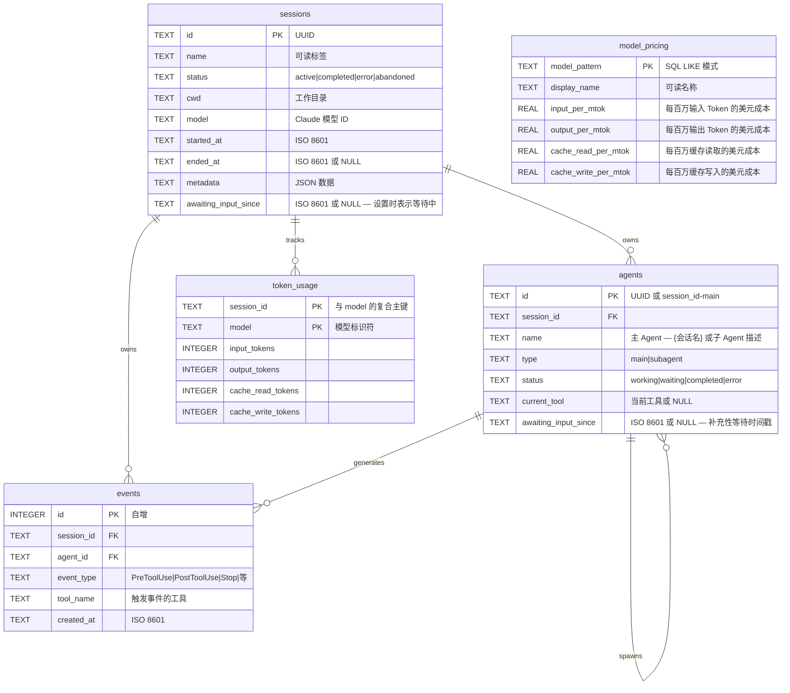

---

## 插件市场

通过官方 Agent Monitor 插件扩展 Claude Code — 分析、生产力工具、开发者工具、AI 洞察和 Dashboard 连接。

### 添加市场

```bash
claude plugin marketplace add hoangsonww/Claude-Code-Agent-Monitor
```

### 可用插件

| 插件 | 安装命令 | 技能 |
|--------|----------------|--------|
| **ccam-analytics** | `claude plugin install ccam-analytics@hoangsonww-claude-code-agent-monitor` | `session-report`、`cost-breakdown`、`usage-trends`、`productivity-score` |
| **ccam-cost-guard** | `claude plugin install ccam-cost-guard@hoangsonww-claude-code-agent-monitor` | `budget-set`、`spend-forecast`、`cost-alert`、`model-savings`、`daily-budget-check` |
| **ccam-productivity** | `claude plugin install ccam-productivity@hoangsonww-claude-code-agent-monitor` | `daily-standup`、`weekly-report`、`sprint-summary`、`workflow-optimizer` |
| **ccam-devtools** | `claude plugin install ccam-devtools@hoangsonww-claude-code-agent-monitor` | `session-debug`、`hook-diagnostics`、`data-export`、`health-check` |
| **ccam-insights** | `claude plugin install ccam-insights@hoangsonww-claude-code-agent-monitor` | `pattern-detect`、`anomaly-alert`、`optimization-suggest`、`session-compare` |
| **ccam-sessions** | `claude plugin install ccam-sessions@hoangsonww-claude-code-agent-monitor` | `session-search`、`session-timeline`、`transcript-replay`、`cwd-rollup`、`session-cleanup` |
| **ccam-workflows** | `claude plugin install ccam-workflows@hoangsonww-claude-code-agent-monitor` | `dag-map`、`delegation-audit`、`concurrency-report`、`error-propagation`、`fleet-runs` |
| **ccam-quality** | `claude plugin install ccam-quality@hoangsonww-claude-code-agent-monitor` | `error-scan`、`api-error-report`、`hook-failure-audit`、`slo-check`、`regression-alert` |
| **ccam-config** | `claude plugin install ccam-config@hoangsonww-claude-code-agent-monitor` | `config-audit`、`memory-review`、`skill-inventory`、`mcp-audit`、`hook-inventory` |
| **ccam-dashboard** | `claude plugin install ccam-dashboard@hoangsonww-claude-code-agent-monitor` | `dashboard-status`、`quick-stats` + MCP 服务器 |

### 包含的 CLI 工具

- `ccam-stats` — 终端 Dashboard（会话、成本、Token 含压缩基线）
- `ccam-doctor` — 系统诊断（API、数据库、Hook、数据新鲜度）
- `ccam-export` — 数据导出（JSON、CSV）用于会话、事件、分析、成本

### 使用示例

```bash
# 安装插件后在 Claude Code 中：
/ccam-analytics:session-report latest
/ccam-analytics:cost-breakdown this week
/ccam-productivity:daily-standup today
/ccam-insights:pattern-detect tools
/ccam-dashboard:quick-stats
```

📖 完整文档：[docs/plugins.md](docs/PLUGINS.md)

---

## 状态栏

Claude Code 的独立 CLI 状态栏工具，显示模型名称、用户、工作目录、Git 分支、上下文窗口使用率条和 Token 计数 — 全部使用 ANSI 转义序列彩色编码。

```
Sonnet 4.6 | nguyens6 | ~/agent-dashboard/client | main | ████████░░ 79% | 3↑ 2↓ 156586c
```

| 段 | 颜色 | 示例 |
| ----------- | -------------------- | ------------------- |
| 模型 | 青色 | `Sonnet 4.6` |
| 用户 | 绿色 | `nguyens6` |
| 工作目录 | 黄色 | `~/agent-dashboard` |
| Git 分支 | 品红色 | `main` |
| 上下文条 | 绿色 / 黄色 / 红色 | `████████░░ 79%` |
| Token | 暗色 | `3↑ 2↓ 156586c` |

参见 [`statusline/README.md`](statusline/README.md) 了解安装说明。

<p align="center">
  
</p>

---

## 服务端架构

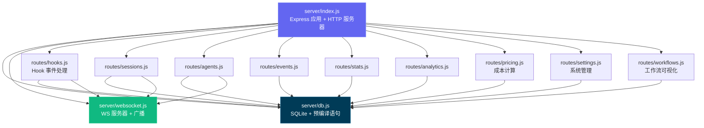

---

## 客户端路由

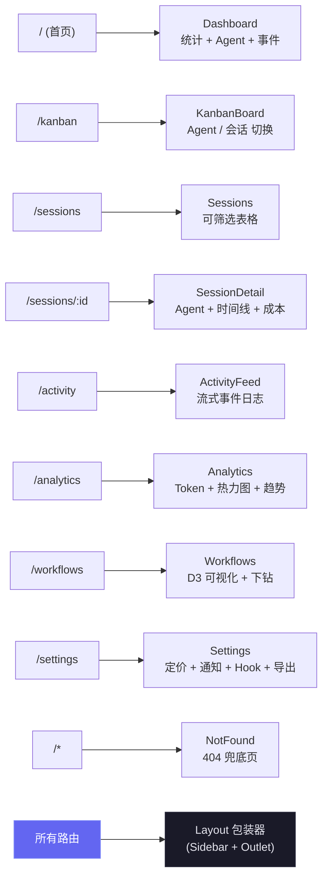

---

## Hook 处理流程

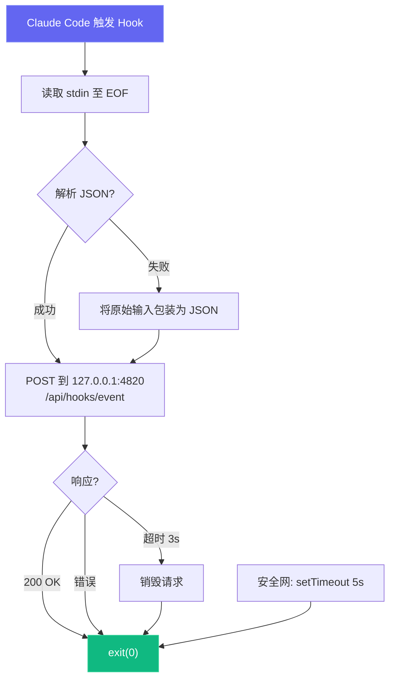

---

## 部署模式

我们支持开发和生产两种部署模式，使用不同的进程架构：

```mermaid
graph LR
    subgraph dev["开发模式 — 2 个进程"]
        D_CMD["npm run dev"] --> D_SRV["Express :4820<br/>node --watch"]
        D_CMD --> D_VITE["Vite :5173<br/>HMR"]
        D_BROWSER["浏览器"] --> D_VITE
        D_VITE -->|"代理 /api + /ws"| D_SRV
    end

    subgraph prod["生产模式 — 1 个进程"]
        P_BUILD["npm run build"] --> P_DIST["client/dist/"]
        P_START["npm start"] --> P_SRV["Express :4820<br/>静态文件 + API"]
        P_BROWSER["浏览器"] --> P_SRV
    end

    style D_VITE fill:#646CFF,stroke:#818cf8,color:#fff
    style D_SRV fill:#339933,stroke:#5cb85c,color:#fff
    style P_SRV fill:#339933,stroke:#5cb85c,color:#fff
    style P_DIST fill:#646CFF,stroke:#818cf8,color:#fff
```

可选的本地 MCP Sidecar（支持 stdio、HTTP+SSE 和 REPL 传输）：

```mermaid
graph LR
    subgraph "MCP 传输选项"
        M_STDIO["MCP 服务器 (stdio)<br/>npm run mcp:start"]
        M_HTTP["MCP 服务器 (HTTP)<br/>npm run mcp:start:http<br/>:8819"]
        M_REPL["MCP 服务器 (REPL)<br/>npm run mcp:start:repl"]
    end

    H["MCP 宿主"] -->|"stdin/stdout"| M_STDIO
    RC["远程客户端"] -->|"POST /mcp · GET /sse"| M_HTTP
    OP["操作员"] -->|"交互式 CLI"| M_REPL

    M_STDIO --> D["Dashboard 服务器<br/>:4820"]
    M_HTTP --> D
    M_REPL --> D

    style M_STDIO fill:#0f766e,stroke:#14b8a6,color:#fff
    style M_HTTP fill:#0f766e,stroke:#14b8a6,color:#fff
    style M_REPL fill:#0f766e,stroke:#14b8a6,color:#fff
```

### 云部署

`deployments/` 目录提供了云无关的企业级基础设施，用于将 Dashboard 部署到生产环境。支持 Helm、Kustomize 和 Terraform，覆盖 AWS、GCP、Azure 和 OCI，包含蓝绿部署、金丝雀部署和滚动更新策略。

```mermaid
graph TB
  subgraph "部署方法"
    HELM["⎈ Helm Chart<br/>参数化安装"]
    KUST["📦 Kustomize<br/>基于 Overlay 的补丁"]
    TF["🏗️ Terraform<br/>完整云资源配置"]
  end

  subgraph "云服务商"
    AWS["☁️ AWS<br/>ECS Fargate + ALB"]
    GCP["☁️ GCP<br/>Cloud Run + GCLB"]
    AZ["☁️ Azure<br/>ACI + App Gateway"]
    OCI["☁️ OCI<br/>OKE + LBaaS"]
  end

  subgraph "发布策略"
    ROLL["滚动更新"]
    BG["蓝绿部署"]
    CAN["金丝雀 + 分析"]
  end

  subgraph "可观测性"
    PROM["📊 Prometheus + Grafana"]
    CX["📡 Coralogix<br/>日志 · 指标 · 链路追踪 · SLO"]
  end

  HELM & KUST --> ROLL & BG & CAN
  TF --> AWS & GCP & AZ & OCI
  ROLL & BG & CAN --> PROM & CX

  style HELM fill:#0f1689,color:#fff
  style KUST fill:#326ce5,color:#fff
  style TF fill:#7b42bc,color:#fff
  style AWS fill:#ff9900,color:#fff
  style GCP fill:#4285f4,color:#fff
  style AZ fill:#0078d4,color:#fff
  style OCI fill:#f80000,color:#fff
  style PROM fill:#e6522c,color:#fff
  style CX fill:#1a1a2e,color:#fff
```

```bash
# Helm（Kubernetes 推荐）
helm install agent-monitor deployments/helm/agent-monitor \
  -f deployments/helm/agent-monitor/values-production.yaml \
  -n agent-monitor --create-namespace

# Kustomize
kubectl apply -k deployments/kubernetes/overlays/production

# Terraform（完整基础设施 + 应用）
cd deployments/terraform/providers/aws
terraform init && terraform apply -var-file=../../environments/production/terraform.tfvars

# 脚本编排器
./deployments/scripts/deploy.sh --env production --method helm --strategy blue-green
```

部署栈包含 CI/CD 管道（GitHub Actions + GitLab CI）、全面的监控（Prometheus、Grafana、含 13 条告警规则的 Alertmanager、配合 OpenTelemetry Collector 实现日志/指标/链路追踪/SLO 追踪的 Coralogix 全栈可观测性）、运维脚本（部署、回滚、蓝绿切换、备份/恢复、拆除），以及完整的安全体系（受限 Pod 安全标准、TLS 1.3、网络策略、Trivy 扫描）。

> [!NOTE]
> 📘 **完整部署指南：** 参见 [DEPLOYMENT.md](DEPLOYMENT.md) 了解分步说明、架构图和运维工作流。

---

## 项目结构

```
agent-dashboard/
|-- CLAUDE.md                   # Claude Code 项目记忆和工作约定
|-- AGENTS.md                   # Codex 项目指令
|-- package.json                # 根脚本（Dashboard + MCP 辅助）+ 服务端依赖
|-- .claude/
|   +-- rules/                  # 路径作用域的 Claude 规则
|   +-- skills/                 # Claude 可复用项目技能
|   +-- agents/                 # Claude 自定义子 Agent
|-- .claude-plugin/
|   +-- marketplace.json        # 插件市场清单（10 个插件）
|-- plugins/
|   |-- ccam-analytics/         # 分析：会话报告、成本明细、使用趋势、生产力评分
|   |   |-- .claude-plugin/plugin.json
|   |   |-- skills/ (4)         # session-report, cost-breakdown, usage-trends, productivity-score
|   |   |-- agents/             # analytics-advisor（Sonnet 模型）
|   |   |-- hooks/hooks.json    # Stop + SubagentStop 事件日志
|   |   +-- bin/ccam-stats      # 终端 Dashboard CLI
|   |-- ccam-productivity/      # 生产力：站会、报告、冲刺、工作流优化
|   |-- ccam-devtools/          # 开发工具：调试、诊断、导出、健康检查
|   |   +-- bin/                # ccam-doctor + ccam-export CLI
|   |-- ccam-insights/          # 洞察：模式、异常、优化、比较
|   |-- ccam-cost-guard/        # 成本护栏：预算、支出预测、成本告警、模型节省
|   |-- ccam-sessions/          # 会话取证：搜索、时间线、转录回放、按 cwd 汇总、清理
|   |-- ccam-workflows/         # 工作流编排：DAG 映射、委派审计、并发、舰队运行
|   |-- ccam-quality/           # 可靠性与 SLO：错误扫描、API 错误报告、Hook 失败审计、SLO 检查
|   |-- ccam-config/            # 配置与记忆治理：配置审计、记忆审查、技能/MCP/Hook 清单
|   +-- ccam-dashboard/         # Dashboard 连接器：状态、快速统计、MCP 集成
|       +-- .mcp.json           # MCP 服务器配置
|-- server/
|   |-- index.js                 # Express 应用、HTTP 服务器、静态文件服务
|   |-- db.js                    # SQLite Schema、迁移、预编译语句
|   |-- websocket.js             # WebSocket 服务器（含心跳）
|   +-- routes/
|       |-- hooks.js             # Hook 事件处理（事务性）
|       |-- sessions.js          # 会话 CRUD
|       |-- agents.js            # Agent CRUD
|       |-- events.js            # 事件列表
|       |-- stats.js             # 聚合统计
|       |-- analytics.js         # Token、工具和趋势分析
|       |-- workflows.js         # 聚合工作流数据和按会话下钻
|       |-- pricing.js           # 模型定价 CRUD 和成本计算
|       +-- settings.js          # 系统信息、数据管理、导出、清理
|   +-- lib/
|       +-- transcript-cache.js  # 基于 stat 的 JSONL Transcript 缓存，增量读取。采用 4 MiB 分块的同步字节流读取器并按行解析，避免一次性将整个文件加载为 JS 字符串，因此即使 JSONL 大于 V8 的最大字符串长度（64 位 Node 20 约 512 MiB）也能解析，不会让进程崩溃于 "FATAL ERROR: v8::ToLocalChecked Empty MaybeLocal"。提取 Token、压缩、API 错误、回合耗时、思考块和用量附加信息（service_tier、speed、inference_geo）
|   +-- compat-sqlite.js         # node:sqlite 兼容性封装（better-sqlite3 的后备方案）
|-- client/
|   |-- package.json             # 客户端依赖
|   |-- index.html               # HTML 入口
|   |-- vite.config.ts           # Vite + 代理配置
|   |-- tailwind.config.js       # 自定义暗色主题
|   |-- tsconfig.json            # 严格 TypeScript
|   +-- src/
|       |-- main.tsx             # React 入口
|       |-- App.tsx              # 路由 + WebSocket Provider
|       |-- index.css            # Tailwind + 自定义工具类
|       |-- lib/
|       |   |-- types.ts         # 共享 TypeScript 接口
|       |   |-- api.ts           # 类型化 fetch 客户端
|       |   |-- format.ts        # 日期/时间格式化工具
|       |   +-- eventBus.ts      # WebSocket 分发的发布/订阅
|       |-- hooks/
|       |   |-- useWebSocket.ts      # 自动重连 WebSocket hook
|       |   +-- useNotifications.ts  # WebSocket 事件触发的浏览器通知
|       |-- components/
|       |   |-- Layout.tsx       # 带 Sidebar + Outlet 的外壳
|       |   |-- Sidebar.tsx      # 导航 + 连接指示器
|       |   |-- AgentCard.tsx    # Agent 信息卡片（含状态）
|       |   |-- StatCard.tsx     # 指标卡片
|       |   |-- StatusBadge.tsx  # 彩色编码状态标签
|       |   |-- EmptyState.tsx   # 空列表占位符
|       |   +-- workflows/       # D3.js 工作流可视化组件
|       |       |-- OrchestrationDAG.tsx            # Agent 生成模式的水平 DAG
|       |       |-- ToolExecutionFlow.tsx           # 工具到工具转换的 d3-sankey 图
|       |       |-- AgentCollaborationNetwork.tsx   # 力导向 Agent 管道图
|       |       |-- SubagentEffectiveness.tsx       # 带 SVG 成功率环的记分卡网格
|       |       |-- WorkflowPatterns.tsx            # 自动检测的编排序列
|       |       |-- ModelDelegationFlow.tsx         # 通过 Agent 层级的模型路由
|       |       |-- ErrorPropagationMap.tsx         # 按层级深度的错误聚类
|       |       |-- ConcurrencyTimeline.tsx         # 泳道式并行 Agent 执行
|       |       |-- SessionComplexityScatter.tsx    # D3 气泡图（耗时 vs Agent vs Token）
|       |       |-- CompactionImpact.tsx            # Token 压缩事件和恢复
|       |       |-- WorkflowStats.tsx               # 聚合工作流统计
|       |       +-- SessionDrillIn.tsx              # 按会话的 Agent 树、工具时间线、事件
|       +-- pages/
|           |-- Dashboard.tsx      # 概览页
|           |-- KanbanBoard.tsx    # Agent / 会话切换的状态列
|           |-- Sessions.tsx       # 会话表格
|           |-- SessionDetail.tsx  # 单会话深入查看
|           |-- ActivityFeed.tsx   # 实时事件流
|           |-- Analytics.tsx      # Token 使用、热力图、趋势
|           |-- Workflows.tsx      # D3.js 工作流可视化和会话下钻
|           |-- Settings.tsx       # 模型定价、通知、Hook、导出、清理
|           +-- NotFound.tsx       # 404 兜底页
|-- scripts/
|   |-- hook-handler.js          # 轻量级 stdin-to-HTTP 转发器
|   |-- install-hooks.js         # 自动配置 ~/.claude/settings.json
|   |-- import-history.js        # 从 ~/.claude/ 导入会话，含增强 JSONL 提取（API 错误、回合耗时、入口点、权限模式、思考块、用量附加信息、工具错误、子 Agent JSONL 文件）。重新导入完全增量：在每次导入前按事件类型查询 `MAX(created_at) GROUP BY event_type` 作为基准，只插入 `ts > cutoff[type]` 的 JSONL 条目，长跨度会话即使 transcript 在多天内持续追加，也能在每次重跑时继续接收 Stop / PostToolUse / TurnDuration / ToolError 事件；同时在 JSONL 推进时前向更新 `sessions.ended_at`，并刷新消息计数元数据
|   +-- seed.js                  # 示例数据生成器
|-- mcp/
|   |-- package.json             # MCP 包脚本 + 依赖
|   |-- README.md                # MCP 设置、宿主配置、工具目录、安全模型
|   |-- src/
|   |   |-- index.ts             # MCP 运行时入口（传输路由器）
|   |   |-- server.ts            # MCP 服务器组装
|   |   |-- clients/             # 带重试/退避的 Dashboard API 客户端
|   |   |-- config/              # 环境/CLI 配置解析
|   |   |-- core/                # 日志器、工具注册、结果辅助
|   |   |-- policy/              # 变更/破坏性守卫
|   |   |-- tools/               # 领域特定工具模块（6 个域）
|   |   |-- transports/          # HTTP+SSE 服务器、REPL、工具收集器
|   |   |-- ui/                  # ANSI 横幅、颜色、格式化器、表格
|   |   +-- types/               # 共享 MCP 类型定义
|   +-- build/                   # 构建后的 MCP 运行时输出
|-- deployments/
|   |-- README.md                # 部署基础设施参考
|   |-- terraform/               # 云资源配置（AWS、GCP、Azure、OCI）
|   |   |-- modules/             # 可复用模块（网络、计算、数据库、负载均衡、监控）
|   |   |-- providers/           # 云特定实现
|   |   +-- environments/        # 按环境的 tfvars（dev、staging、production）
|   |-- kubernetes/              # Kustomize 清单
|   |   |-- base/                # 11 个基础资源（deployment、service、ingress、hpa 等）
|   |   |-- overlays/            # 环境 Overlay（dev、staging、production）
|   |   |-- components/          # 可选附加组件（mcp-sidecar、monitoring）
|   |   +-- strategies/          # 蓝绿和金丝雀部署策略
|   |-- helm/agent-monitor/      # Helm Chart，含 12 个模板和 4 组值
|   |-- scripts/                 # 运维脚本（部署、回滚、备份、拆除）
|   |-- monitoring/              # Prometheus、Grafana、Alertmanager、Coralogix（OTel Collector）
|   +-- ci/                      # CI/CD 管道（GitHub Actions、GitLab CI）
|-- .codex/
|   |-- config.toml              # Codex 运行时配置
|   |-- README.md                # Codex Agent 和技能设置指南
|   |-- rules/                   # Codex 执行策略规则
|   |-- agents/                  # Codex 自定义 Agent 模板
|   +-- skills/                  # Codex 项目技能
|-- desktop/
|   |-- README.md                # 桌面应用贡献者 / 架构参考
|   |-- electron-builder.yml     # DMG 打包配置；签名 / 公证钩子
|   |-- src/
|   |   |-- main.ts              # 主进程入口 —— 生命周期、对话框、装配
|   |   |-- server-host.ts       # 进程内 Express 启动、端口发现、服务器采用、SQLite 关闭
|   |   |-- window.ts            # BrowserWindow + 持久化窗口几何状态
|   |   |-- menu.ts              # 原生应用菜单（File ▸ Open Dashboard 仅在 macOS 上可用）
|   |   |-- tray.ts              # 菜单栏（托盘）图标 + 上下文菜单
|   |   |-- login-item.ts        # macOS 登录项（SMAppService）开机自启
|   |   +-- logger.ts            # 写入 desktop.log 的文件日志器
|   |-- scripts/                 # prebuild 校验、build-icons、notarize 钩子
|   +-- tests/smoke.test.mjs     # 启动 Electron 并探测 /api/health 的冒烟测试
|-- statusline/
|   |-- README.md                # 状态栏安装和使用指南
|   |-- statusline.py            # 渲染状态栏的 Python 脚本
|   +-- statusline-command.sh    # Claude Code statusLine 配置的 Shell 包装
+-- data/
    +-- dashboard.db             # SQLite 数据库（gitignored）
```

---

## 常见问题

| 问题 | 解决方案 |
| --------------------------------- | ---------------------------------------------------------------------------------------------------------------------------------------------------------------- |
| `better-sqlite3` 安装失败 | 这是非致命错误 — 服务器会自动回退到 Node.js 内置的 `node:sqlite`（Node 22+）。在旧版 Node 上，安装 Python 3 和 C++ 构建工具，然后运行 `npm rebuild better-sqlite3` |
| Hook 未触发 | 运行 `npm run install-hooks` 并重启 Claude Code。验证 `~/.claude/settings.json` 中存在 Hook 配置 |
| Dashboard 无数据 | 确保服务器正在运行（`npm run dev`）后再启动 Claude Code 会话。检查 `http://localhost:4820/api/health` |
| WebSocket 断开连接 | 客户端每 2 秒自动重连。检查端口 4820 未被防火墙阻止 |
| 重启后数据过期 | 数据库在重启间持久化。运行 `npm run seed` 获取新的演示数据，或删除 `data/dashboard.db` 重置 |
| MCP 工具连接失败 | 确认 Dashboard API 在 `MCP_DASHBOARD_BASE_URL` 上正常运行，并重新构建/启动 MCP（`npm run mcp:build`、`npm run mcp:start`） |

---

## 许可证

MIT。详见 [LICENSE](LICENSE)。
