# Bảng điều khiển Agent cho Claude Code

### Nền tảng giám sát thời gian thực cho hoạt động của Agent Claude Code 🚀

Bảng điều khiển chuyên nghiệp để theo dõi và trực quan hóa các phiên tác nhân Claude Code, cách sử dụng công cụ và điều phối tác nhân phụ trong thời gian thực. Được xây dựng bằng Node.js, Express, React và SQLite, nó tích hợp trực tiếp với Claude Code thông qua hệ thống hook gốc để theo dõi và phân tích phiên liền mạch.


**Hỗ trợ ngôn ngữ**: Tiếng Anh (`en`) · 中文 (`zh`) · Tiếng Việt (`vi`)

Tài liệu đã bản địa hóa: [`README.md`](./README.md) · [`README-CN.md`](./README-CN.md) · [`README-VN.md`](./README-VN.md)

---

## Mục lục

- [Tổng quan](#tổng-quan)
- [Quốc tế hóa (i18n)](#quốc-tế-hóa-i18n)
- [Tính Năng](#tính-năng)
- [Bắt đầu nhanh](#bắt-đầu-nhanh)
- [Nó hoạt động như thế nào](#nó-hoạt-động-như-thế-nào)
- [Cấu hình](#cấu-hình)
- [Tập lệnh npm](#tập-lệnh-npm)
- [Thị trường plugin](#thị-trường-plugin)
- [Tiện ích mở rộng Agent](#tiện-ích-mở-rộng-agent)
- [Tabby](#tabby)
- [Tích hợp MCP](#tích-hợp-mcp)
- [Tham chiếu API](#tham-chiếu-api)
- [Sự kiện móc nối](#sự-kiện-móc-nối)
- [Thông báo trình duyệt](#thông-báo-trình-duyệt)
- [Thông báo cập nhật](#thông-báo-cập-nhật)
- [Hộp thoại trạng thái kết nối](#hộp-thoại-trạng-thái-kết-nối)
- [Ứng dụng máy tính để bàn (macOS & Windows)](#ứng-dụng-máy-tính-để-bàn-macos--windows)
- [Tiện ích mở rộng VS Code](#tiện-ích-mở-rộng-vs-code)
- [Lưu trữ dữ liệu](#lưu-trữ-dữ-liệu)
- [Dòng trạng thái](#dòng-trạng-thái)
- [Kiến trúc máy chủ](#kiến-trúc-máy-chủ)
- [Định tuyến khách hàng](#định-tuyến-khách-hàng)
- [Luồng xử lý móc](#luồng-xử-lý-móc)
- [Chế độ triển khai](#chế-độ-triển-khai)
- [Cấu trúc dự án](#cấu-trúc-dự-án)
- [Khắc phục sự cố](#khắc-phục-sự-cố)
- [Giấy phép](#giấy-phép)

---

## Tổng quan

Theo dõi các phiên, giám sát tác nhân trong thời gian thực, trực quan hóa việc sử dụng công cụ và quan sát việc điều phối tác nhân phụ thông qua giao diện web có chủ đề tối chuyên nghiệp. Tích hợp trực tiếp với Claude Code thông qua hệ thống hook gốc của nó.

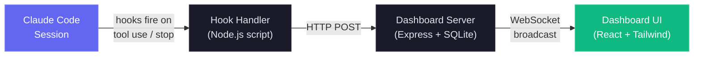

Ngoài bảng thông tin giám sát thời gian thực, nó còn bao gồm triển khai máy chủ MCP cục bộ trong `mcp/` hiển thị danh mục các công cụ để xem xét nội tâm và quản lý bảng thông tin, giúp dễ dàng tích hợp trực tiếp các hoạt động của bảng thông tin vào quy trình làm việc của Claude Code của bạn. Ngoài ra còn có một lớp mở rộng tác nhân, cung cấp các plugin, kỹ năng và tác nhân phụ của Claude Code để tương tác trên trang tổng quan, phân tích và thông tin về quy trình làm việc.

<a href="https://www.star-history.com/?repos=hoangsonww%2FClaude-Code-Agent-Monitor&type=date&legend=top-left">
 <picture>
   <source media="(prefers-color-scheme: dark)" srcset="https://api.star-history.com/chart?repos=hoangsonww/Claude-Code-Agent-Monitor&type=date&theme=dark&legend=top-left" />
   <source media="(prefers-color-scheme: light)" srcset="https://api.star-history.com/chart?repos=hoangsonww/Claude-Code-Agent-Monitor&type=date&legend=top-left" />
   
 </picture>
</a>

### Quốc tế hóa (i18n)

Giao diện người dùng đi kèm với tính năng chuyển đổi ngôn ngữ tích hợp cho tiếng Anh (`en`), tiếng Trung (`zh`) và tiếng Việt (`vi`). Tài nguyên ngôn ngữ được tải theo không gian tên và được lưu giữ trong bộ nhớ của trình duyệt để mang lại ưu tiên người dùng ổn định trong các lần làm mới.

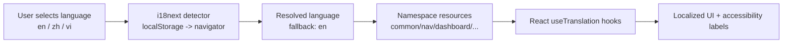

Để biết kiến ​​trúc đầy đủ và hướng dẫn vận hành, hãy xem [tài liệu/I18N.md](./docs/I18N.md).

### Giao diện người dùng

Đi kèm với chủ đề tối đẹp mắt, thiết kế đáp ứng và điều hướng trực quan để khám phá hoạt động của nhân viên hỗ trợ:

<p align="center">
  
  <br>
  <em>📡 <strong>Dashboard · Monitor</strong> — số liệu tổng hợp, thẻ Agent đang hoạt động và luồng hoạt động gần đây</em>
</p>

<p align="center">
  
  <br>
  <em>🩺 <strong>Dashboard · Health</strong> — vòng điểm sức khỏe tổng hợp, biểu đồ donut lưu trữ, thước đo cache / lỗi / thành công, thanh công cụ sử dụng, hiệu quả subagent, phân bổ token mô hình, thống kê nén — tự làm mới mỗi 5 giây</em>
</p>

<p align="center">
  
  <br>
  <em>📋 <strong>Bảng Kanban (Agent)</strong> — Agent xếp theo trạng thái trên 4 cột: Đang làm / Đang chờ / Hoàn tất / Lỗi. Cột Đang chờ màu vàng làm nổi bật các phiên đang bị chặn chờ người dùng phản hồi (lời nhắc xin quyền, cuối lượt, hoặc đang ở dòng nhập đầu phiên). Mỗi thẻ hiển thị model, chi phí và tool hiện tại ngay trong tầm mắt.</em>
</p>

<p align="center">
  
  <br>
  <em>🗂️ <strong>Bảng Kanban (Phiên)</strong> — phiên xếp theo trạng thái trên 5 cột: Hoạt động / Đang chờ / Hoàn tất / Lỗi / Bỏ dở, chuyển đổi trên cùng một trang. Di chuột qua tiêu đề cột để xem mô tả vòng đời chi tiết.</em>
</p>

<p align="center">
  
  <br>
  <em>📂 <strong>Phiên</strong> — bảng liệt kê toàn bộ phiên có tìm kiếm, bộ lọc và phân trang phía máy chủ, kèm chi phí, mô hình, số lượng Agent và thời lượng</em>
</p>

<p align="center">
  
  <br>
  <em>🤖 <strong>Chi tiết phiên · Agent</strong> — bảng tổng quan thời gian thực (sự kiện, lượt gọi công cụ, subagent, lần nén, lỗi, thời lượng), thanh sử dụng top công cụ, phân tích theo loại subagent, dòng chảy token và cây phân cấp Agent</em>
</p>

<p align="center">
  
  <br>
  <em>💬 <strong>Chi tiết phiên · Conversation</strong> — trình xem bản ghi trực tiếp với render markdown, khối code có syntax highlight (số dòng + nút sao chép), các khối tool call có style theo từng công cụ, pill lệnh slash kèm output TUI đã ghi lại, và chỉ báo đổi tên phiên inline</em>
</p>

<p align="center">
  
  <br>
  <em>🔬 <strong>Chi tiết phiên · Timeline</strong> — dòng thời gian sự kiện theo trình tự, có bộ lọc đa chiều, gom nhóm Pre/Post theo `tool_use_id`, và bộ render tải trọng nhận biết công cụ</em>
</p>

<p align="center">
  
  <br>
  <em>📰 <strong>Luồng hoạt động</strong> — nhật ký sự kiện thời gian thực có tạm dừng / tiếp tục, gom nhóm, bộ lọc đa chiều và nút "Phiên →" trên mỗi dòng</em>
</p>

<p align="center">
  
  <br>
  <em>📊 <strong>Phân tích</strong> — lượng token theo mô hình, tần suất công cụ, bản đồ nhiệt hoạt động và xu hướng phiên kèm chỉ báo trực tuyến / ngoại tuyến</em>
</p>

<p align="center">
  
  <br>
  <em>🔀 <strong>Quy trình</strong> — DAG điều phối Agent, sơ đồ Sankey thi hành công cụ, mạng cộng tác và 11 mô-đun trí tuệ quy trình tương tác</em>
</p>

<p align="center">
  
  <br>
  <em>🧬 <strong>Lần chạy quy trình (trang Quy trình)</strong> — các "quy trình động" do công cụ <code>Workflow</code> tạo ra, được dựng lại từ nhật ký chạy trên đĩa: trạng thái, số agent, token và lệnh gọi công cụ, mở rộng thành bảng phân tích theo từng agent (giai đoạn, trạng thái, token, công cụ, thời lượng) kèm bản xem trước kết quả đã được làm gọn</em>
</p>

<p align="center">
  
  <br>
  <em>🧬 <strong>Lần chạy quy trình · mở rộng</strong> — một lần chạy được mở ra: bộ lọc giai đoạn có màu và bấm được, bảng số liệu theo từng agent, và danh sách đầy đủ các mục kết quả bấm được để mở ra lời nhắc và kết quả đầy đủ của từng agent</em>
</p>

<p align="center">
  
  <br>
  <em>🧬 <strong>Lần chạy quy trình (chi tiết phiên)</strong> — cùng các nhóm đó được liên kết tới phiên khởi chạy, nên các sub-agent của quy trình động và chi phí token đã được gộp vào đều hiển thị ngay trong phiên</em>
</p>

<p align="center">
  
  <br>
  <em>🧰 <strong>Trình khám phá cấu hình Claude</strong> — Trình kiểm tra 12-tab cho mọi thứ Claude Code biết: skills, subagents, lệnh slash, output styles, plugin (kèm số đóng góp của từng plugin), marketplaces, máy chủ MCP, hooks, settings (ẩn key bí mật), memory (các tệp `CLAUDE.md` của user + project cùng kho memory dựa-trên-tệp theo từng dự án — mọi `*.md` dưới `~/.claude/projects/<slug>/memory/`, nhóm theo dự án và tìm kiếm được), keybindings và statusline. Hỗ trợ tạo / sửa / xoá trên các bề mặt tệp văn bản rủi ro thấp — kể cả các tệp auto-memory theo từng dự án — với sao lưu dấu thời gian bắt buộc</em>
</p>

<p align="center">
  
  <br>
  <em>▶️ <strong>Chạy Claude</strong> — Khởi chạy tiến trình con <code>claude</code> ngay trong dashboard. Chọn chế độ (Hội thoại / Một lần), nguồn (phiên mới vs tiếp tục từ lịch sử đầy đủ), thư mục làm việc (autocomplete với cwd gần đây), model, permission mode và mức suy nghĩ. Same-origin guard trên route ngăn drive-by spawn từ trình duyệt</em>
</p>

<p align="center">
  
  <br>
  <em>💬 <strong>Chạy Claude · luồng trực tiếp</strong> — đầu ra streaming kiểu chat với render từng ký tự thực sự nhờ <code>--include-partial-messages</code>. Tool uses, tool results và thinking blocks đều có thể thu gọn. Bộ chuyển đổi run đang chạy ở header cho phép để run chạy nền và gắn lại sau. "View session →" sẽ deep-link tới UI Sessions ngay khi có session ID</em>
</p>

<p align="center">
  
  <br>
  <em>⚙️ <strong>Cài đặt</strong> — quy tắc định giá mô hình, trạng thái cài đặt Hook, quản lý dữ liệu, tuỳ chọn thông báo và thông tin hệ thống</em>
</p>

<p align="center">
  
  <br>
  <em>🔔 <strong>Cài đặt · Cảnh báo</strong> — công cụ cảnh báo theo quy tắc và webhook gửi đi trong cùng một nơi: quy tắc cảnh báo (mẫu sự kiện / không hoạt động / agent bị treo / ngưỡng token) với cooldown theo từng quy tắc, nguồn cấp cảnh báo đã kích hoạt theo thời gian thực, và 14 nhà cung cấp webhook hạng nhất (Slack, Discord, Teams, Google Chat, Mattermost, Rocket.Chat, Telegram, PagerDuty, Opsgenie, Splunk On-Call, Zapier, Make, n8n, Pipedream) cùng một endpoint JSON tổng quát có tùy chọn ký HMAC</em>
</p>

Thanh bên cung cấp quyền truy cập nhanh vào Trang tổng quan, Bảng Kanban, danh sách Phiên, Nguồn cấp dữ liệu hoạt động, Phân tích, Quy trình công việc và Cài đặt. Mỗi trang được thiết kế để cung cấp cho bạn những hiểu biết sâu sắc về hoạt động Agent Claude Code của bạn với các cập nhật theo thời gian thực và hình ảnh trực quan phong phú.

---

## Tính Năng

Bảng điều khiển cung cấp một bộ tính năng toàn diện để giám sát và phân tích các phiên và Agent Claude Code của bạn:

| Tính năng                            | Sự miêu tả                                                                                                                                                                                                                                                                  |
|------------------------------------|------------------------------------------------------------------------------------------------------------------------------------------------------------------------------------------------------------------------------------------------------------------------------|
| **Bảng điều khiển**                      | Hai tab lưu trong `localStorage`: **Monitor** — số liệu thống kê tổng quan (6 thẻ), thẻ Agent đang hoạt động với hệ thống phân cấp Subagent có thể thu gọn, nguồn cấp dữ liệu hoạt động gần đây với số mục hiển thị tự động lấp đầy chiều cao viewport qua `ResizeObserver`. **Health** — vòng điểm sức khỏe hệ thống tổng hợp (trọng số: 0,4 × tỷ lệ thành công + 0,25 × tỷ lệ cache hit + 0,25 × (100 − tỷ lệ lỗi) + 0,1 × (100 − heap %)), biểu đồ donut phân bổ bản ghi, thước đo hiệu suất cache / tỷ lệ lỗi / tỷ lệ thành công, biểu đồ thanh ngang top 8 công cụ, thanh hiệu quả subagent, phân bổ token theo mô hình, và thống kê nén. Tự làm mới mỗi 5 giây từ `/api/settings/info` và `/api/workflows`. Tooltip theo con trỏ với phát hiện cạnh viewport trên mọi biểu đồ |
| **Bảng Kanban**                   | Hai chế độ với nút chuyển ở đầu trang (lưu trong `localStorage`): **Agent** — 4 cột (Đang làm / Đang chờ / Hoàn tất / Lỗi), và **Phiên** — 5 cột (Hoạt động / Đang chờ / Hoàn tất / Lỗi / Bỏ dở). Cột **Đang chờ** ánh xạ trực tiếp trạng thái lưu trữ `waiting` của Agent — được đặt khi Claude Code đang ngồi ở dòng nhập (phiên mới, giữa các lượt, hoặc đang bị chặn bởi Notification xin quyền) và chuyển sang `working` ngay khi người dùng tiếp tục (UserPromptSubmit / PreToolUse). Mỗi tiêu đề cột có biểu tượng `?` với tooltip giải thích vòng đời. Mỗi cột tìm nạp theo trạng thái từ máy chủ (không giới hạn thực tế mỗi cột), sau đó phân trang phía client với 10 thẻ mỗi cột kèm nút "Hiện thêm". Đăng ký WebSocket bám theo chế độ đang xem (`agent_*` so với `session_*`) nên cập nhật khác chế độ không gây tải lại. |
| **Phiên**                       | Bảng toàn bộ phiên có tìm kiếm, bộ lọc và **phân trang phía máy chủ**. Mỗi lần đổi trang gọi `/api/sessions?status=&q=&limit=10&offset=…`, nên tính toán chi phí chỉ chạy trên trang đang hiển thị — không phụ thuộc số phiên trong CSDL. Ô tìm kiếm (`q=`) thực hiện so khớp không phân biệt hoa thường trên `id` / `name` / `cwd` ở máy chủ với debounce 300 ms; phản hồi kèm `total` cho bộ phân trang. Bộ lọc trạng thái, tìm kiếm và phân trang kết hợp với nhau. Tên dễ đọc của mỗi phiên được đọc từ bản ghi và đồng bộ thời gian thực — tiêu đề rõ ràng do người dùng đặt qua `/rename`, `claude -n` hoặc `Ctrl+R` trong picker (dòng `custom-title` của JSONL) luôn thắng, nếu không thì dùng `ai-title` tự sinh; dashboard hiển thị tên đó (lùi về ID rút gọn khi chưa đặt) trên thẻ tác nhân, Dashboard, Activity Feed và picker tiếp tục của trang Run |
| **Chi tiết phiên**                 | Bảng tổng quan thời gian thực mỗi phiên với banner tác nhân đang hoạt động (công cụ + tác vụ hiện tại), sáu ô đếm (sự kiện kèm tốc độ sự kiện/phút, lượt gọi công cụ, subagent, lần nén, lỗi, thời lượng đang đếm), thanh sử dụng top công cụ, phân tích theo loại subagent, dải dòng chảy token, và đám mây chip loại sự kiện — tất cả được làm mới trực tiếp theo sự kiện hook. Bên dưới: cây phân cấp tác nhân, dòng thời gian sự kiện đầy đủ với bộ lọc đa chiều, nhóm Pre/Post theo `tool_use_id`, khối tóm tắt dễ đọc, bộ kết xuất nhận biết công cụ (terminal cho Bash, diff cho Edit, code có số dòng cho Read/Write, danh sách kết quả khớp cho Grep, thẻ key/value cho công cụ MCP), và tab Conversation hiển thị bản ghi với markdown (tiêu đề, danh sách, blockquote, bảng, danh sách công việc), khối code có syntax highlight (js/ts, python, json, bash, html, css, sql, yaml, diff) kèm số dòng và nút sao chép, cùng các khối tool call có style theo từng công cụ (Bash → terminal, Edit → cũ/mới song song, Write → nhãn file, Read → chip đường dẫn, Grep → thẻ pattern) |
| **Nguồn cấp dữ liệu hoạt động**                  | Nhật ký sự kiện phát trực tuyến theo thời gian thực với tính năng tạm dừng/tiếp tục và phân trang; nhấp vào bất kỳ hàng sự kiện nào để mở rộng nội dung hook payload ngay tại chỗ (bảng EventDetail nội tuyến); nút "Phiên →" chuyên biệt ở cuối mỗi hàng điều hướng trực tiếp đến chi tiết phiên mà không thu gọn feed                                                                   |
| **Phân tích**                      | Mức sử dụng mã thông báo, tần suất công cụ, bản đồ nhiệt hoạt động (trung tâm, căn chỉnh ngày trong tuần bắt đầu từ Chủ nhật, chú thích công cụ tên ngày), xu hướng phiên, chỉ báo kết nối trực tiếp/ngoại tuyến. Khi đang tải, vùng biểu đồ hiển thị các khung xương (skeleton) nhấp nháy chứ không chỉ các ô thống kê đầu trang |
| **Cập nhật trực tiếp**                   | Đẩy WebSocket -- không bỏ phiếu, cập nhật giao diện người dùng tức thì                                                                                                                                                                                                                             |
| **Tự động khám phá**                 | Phiên và tác nhân được tạo tự động từ các sự kiện hook                                                                                                                                                                                                               |
| **Nhập lịch sử**                 | Nhập phiên từ `~/.claude/` khi khởi động. Trích xuất JSONL nâng cao: Lỗi API (hạn ngạch/tỷ lệ/không hợp lệ_request), thời lượng lượt, điểm truy cập (cli/sdk-ts), chế độ cấp phép, số khối suy nghĩ, tính năng bổ sung sử dụng (service_tier, tốc độ, inference_geo), lỗi kết quả công cụ và tệp JSONL tác nhân phụ (`subagents/agent-*.jsonl` với `.meta.json`). Chèn lấp các phiên hiện có khi nhập lại. Các tệp JSONL gần đây (< 10 phút) được nhập dưới dạng "hoạt động" |
| **Phân cấp Subagent**             | Cây tác nhân cha-con có thể thu gọn trên Bảng điều khiển và Chi tiết phiên. Các Agent có các Subagent hiển thị các chữ V mở rộng/thu gọn; tác nhân lá hiển thị một chỉ báo dấu chấm. Tự động mở rộng khi các tác nhân phụ đang hoạt động                                                                           |
| **Agent nền**              | Theo dõi chính xác các tác nhân phụ có nền mà không cần hoàn thành sớm                                                                                                                                                                                                         |
| **Quy kết tool của Subagent** | Các tool call nội bộ của subagent (Read, Bash, Edit, Grep, …) chỉ tồn tại trong các tệp JSONL riêng của từng subagent — Claude Code không phát hook cho chúng. Mỗi lần `SubagentStop`, dashboard chạy fire-and-forget `scanAndImportSubagents`: phân tích từng `subagents/agent-*.jsonl`, ghép cặp khối `tool_use` với `tool_result` tương ứng theo `tool_use_id`, và phát các sự kiện `PreToolUse` + `PostToolUse` dưới `agent_id` của chính subagent đó. Có cơ chế idempotent (kiểm tra trùng bằng `data LIKE '%"tool_use_id":"X"%'`) và hợp nhất với row live do hook tạo trước đó khi khớp loại + thời điểm bắt đầu trong vòng 30 giây, nên không sinh row trùng `<sid>-jsonl-*`. Cùng đường này chạy trên import khởi động `npm run setup` để backfill toàn bộ — các phiên cũ trước khi cài dashboard đều có timeline tool đầy đủ cho từng subagent. Activity Feed và Chi tiết phiên hiển thị chuỗi cha-con dạng `main › coder › explorer` cho subagent lồng nhau |
| **Theo dõi chi phí**                  | Ước tính chi phí cho mỗi mô hình với các quy tắc định giá có thể định cấu hình và phân tích chi tiết theo từng phiên. Tính toán mã thông báo nhận biết nén sẽ duy trì tổng số trong các lần nén ngữ cảnh. Việc đọc bản ghi được lưu vào bộ nhớ đệm với các bản cập nhật bù byte tăng dần để trích xuất mã thông báo hiệu quả        |
| **Bộ nhớ đệm bản ghi**               | Trích xuất theo thời gian thực từ bản ghi JSONL: mã thông báo, nén, lỗi API (`isApiErrorMessage` được lưu trữ dưới dạng sự kiện `APIError`), thời lượng lượt (được lưu dưới dạng sự kiện `TurnDuration`), số lượng khối suy nghĩ và các tính năng bổ sung sử dụng (service_tier, tốc độ, inference_geo). Siêu dữ liệu phiên được làm phong phú với các trường này trong thời gian thực |
| **Thông báo**                  | Hệ thống Web Push (VAPID) đầy đủ để phân phối đáng tin cậy. Thông báo đến ngay cả khi tab ở chế độ nền hoặc trình duyệt đã đóng. Được cấu hình đặc biệt để hỗ trợ âm thanh trên macOS. Có thể định cấu hình chuyển đổi theo sự kiện với quản lý đăng ký |
| **Thông báo cập nhật**         | Máy chủ định kỳ chạy `git fetch` không chặn và so sánh checkout cục bộ với nhánh mặc định của remote chuẩn được chọn. **Nhận biết nhánh và fork:** nếu có cả `upstream` và `origin`, ưu tiên `upstream` (quy ước chuẩn cho fork); lệnh cũng tự điều chỉnh theo tình huống — chỉ đề xuất `git pull --ff-only` khi nhánh cục bộ thực sự theo dõi ref chuẩn, ngược lại đưa `git fetch` (kèm fast-forward merge ở trường hợp fork) để lệnh không bao giờ nói dối. Thanh bên cũng có nút "Kiểm tra cập nhật" thường trực kèm badge trạng thái. Bảng điều khiển **không bao giờ** tự pull hoặc tự khởi động lại — người dùng chạy lệnh trong terminal — nên cơ chế này không phá vỡ phiên dev, tiến trình dưới pm2/systemd/Docker, và không để lại tiến trình mồ côi |
| **Cài đặt**                       | Thông tin hệ thống, trạng thái hook, quản lý giá mô hình, tùy chọn thông báo, xuất dữ liệu, dọn dẹp phiên. Mục **Định giá mô hình** có một popover thông tin (biểu tượng `i` cạnh tiêu đề) giải thích cách tra cứu quy tắc (mẫu khớp đầu tiên thắng), cú pháp wildcard `%` kiểu SQL kèm ví dụ cụ thể (`claude-opus-4-7%`, `claude-%-haiku`, id chính xác), và nhắc nhở rằng giá phải được cập nhật thủ công khi Anthropic công bố giá mới — phiên đã lưu vẫn giữ nguyên giá tại thời điểm nạp. Khung CLAUDE_HOME và bảng Import History đã được i18n đầy đủ ở en/vi/zh |
| **Máy chủ MCP (Cục bộ)**             | Máy chủ MCP cục bộ cấp doanh nghiệp trong `mcp/` với ba chế độ truyền tải (stdio, HTTP+SSE, REPL tương tác), 25 công cụ được nhập trên 6 miền, lược đồ đầu vào nghiêm ngặt, thử lại/ngăn chặn, thực thi API chỉ dành cho máy chủ cục bộ và các cổng an toàn đột biến/phá hủy theo cấp bậc. Chế độ HTTP phục vụ HTTP có thể phát trực tuyến (25/11/2025) và SSE cũ (2024-11-05) trên cổng có thể định cấu hình. Chế độ REPL cung cấp lệnh gọi công cụ tương tác hoàn thành theo tab với đầu ra có màu |
| **Quy trình làm việc**                      | Trang trực quan hóa được hỗ trợ bởi D3.js với 11 phần tương tác: điều phối tác nhân DAG, thực thi công cụ Sơ đồ Sankey, mạng cộng tác, hiệu quả của tác nhân phụ (sparkline ngày trong tuần với tooltip render qua portal — thoát khỏi `overflow:hidden` của thẻ và bám trong viewport nên không bao giờ bị cắt), mẫu quy trình làm việc được phát hiện, luồng ủy quyền mô hình, bản đồ lan truyền lỗi (thanh ngang với huy hiệu tỷ lệ, phân tích loại tác nhân, thẻ lỗi API/phiên), dòng thời gian đồng thời, độ phức tạp phân tán phiên, phân tích tác động nén và thông tin chi tiết về mỗi phiên. **Tooltip phong phú, đa ngôn ngữ ở mọi nơi:** mỗi tiêu đề biểu đồ có một biểu tượng `i` mở popover có cấu trúc "Biểu đồ thể hiện điều gì / Cách đọc / Vì sao quan trọng"; hover vào node, cạnh, thanh hay bong bóng đều hiển thị tooltip nhiều phần với diễn giải xác định, phụ thuộc giá trị (ví dụ tỷ trọng nguồn/đích, các mức sức khỏe của tỷ lệ thành công, mô tả họ Opus / Sonnet / Haiku, mẫu thời gian dồn-trước / giữa-phiên / dồn-cuối). Mỗi trong 6 thẻ thống kê đầu trang có popover thông tin ở góc dưới-phải giải thích cách tính chỉ số và ý nghĩa của giá trị hiện tại bằng ngôn ngữ tự nhiên. Tooltip được cập nhật trực tiếp qua một ref DOM duy nhất cho mỗi biểu đồ kèm fallback `mouseleave` ở cấp container, nên không bao giờ giật theo con trỏ hoặc dính lại sau khi re-render. Bấm vào một dòng trong **Mẫu quy trình phát hiện được** sẽ mở rộng tại chỗ một bảng chi tiết với chuỗi bước đầy đủ, lưới thống kê, mô tả xác định (phát hiện vòng lặp, mức tần suất) và một gợi ý thực tiễn. Các tab lọc trạng thái (Chỉ hoạt động / Đã hoàn thành / Tất cả) lọc tất cả 11 phần. Lọc chéo, xuất JSON và tự động làm mới WebSocket theo thời gian thực với khả năng gỡ lỗi trong 3 giây. Bảng **Lần chạy quy trình** hiển thị các "quy trình động" — những nhóm sub-agent do công cụ `Workflow` (và `/loop` tự định nhịp) tạo ra — vốn không phát ra hook, nên được dựng lại từ nhật ký chạy trên đĩa (`workflows/wf_<runId>.json`): mỗi lần chạy hiển thị các giai đoạn và bảng phân tích token / lệnh gọi công cụ / thời lượng theo từng agent, kèm phát hiện `running` theo thời gian thực trước khi nhật ký được ghi và một mục liên kết trên mỗi trang Chi tiết phiên. Biểu đồ **Tác động nén** đã được thiết kế lại thành biểu đồ tần suất "số phiên theo số lần nén" với nhãn trục, các ô thống kê (tổng / số phiên bị ảnh hưởng / trung bình / cao nhất), dòng giải thích và tooltip phong phú khi hover |
| **Theo dõi quá trình nén**            | Phát hiện các sự kiện `/compact` từ bản ghi JSONL, tạo tác nhân và sự kiện nén. Chèn lấp các nén cũ khi khởi động. Máy quét định kỳ (tần suất được dẫn xuất từ `DASHBOARD_STALE_MINUTES`) phát hiện các vết nén ngay cả khi không có hook nào kích hoạt. Chia sẻ transcript cache để không xảy ra tình trạng đọc tệp trùng lặp |
| **Phiên đăng ký/Phiên tiếp tục**   | Tự động kích hoạt lại các phiên khi có sự kiện mới, xử lý chính xác các phiên `/resume` và phiên mồ côi. Quét định kỳ (mỗi ¼ của `DASHBOARD_STALE_MINUTES`, kẹp giữa 60s–5 phút) đánh dấu các phiên bị bỏ qua vượt qua khả năng phát hiện dựa trên sự kiện                                                                     |
| **Phát hiện phiên có sẵn** | Các phiên đã chạy khi máy chủ khởi động được nhập dưới dạng "hoạt động" (dựa trên sửa đổi tệp JSONL gần đây). Các sự kiện dừng cũng kích hoạt lại các phiên đã hoàn thành/bị bỏ rơi đã nhập, do đó, móc đầu tiên từ phiên đang diễn ra luôn hiển thị trên bảng điều khiển     |
| **Thiết kế đáp ứng**              | Bố cục thân thiện với thiết bị di động với lưới xếp chồng, bảng có thể cuộn và thanh bên có thể thu gọn                                                                                                                                                                                      |
| **Bản địa hóa giao diện người dùng**                | Chuyển đổi ngôn ngữ tích hợp với bản sao giao diện người dùng được dịch và nhãn trợ năng cho tiếng Anh (`en`), tiếng Trung (`zh`) và tiếng Việt (`vi`). Phạm vi đa ngôn ngữ trải dài hết toàn bộ tooltip ở trang Workflows: cách tính của các thẻ thống kê và các diễn giải theo bucket giá trị, popover "Cái gì / Cách đọc / Vì sao" cho mỗi biểu đồ, mọi tooltip hover trên đồ thị (orchestration, tool flow, pipeline, model delegation, concurrency), bảng chi tiết Workflow Patterns với mô tả và gợi ý, popover thông tin Settings → Định giá mô hình, khung CLAUDE_HOME và toàn bộ luồng Import History                                                                                                                                                                       |
| **Dữ liệu hạt giống**                      | Tập lệnh hạt giống tích hợp cho các bản demo và phát triển                                                                                                                                                                                                                               |
| **Dòng trạng thái**                     | Dòng trạng thái CLI được mã hóa màu hiển thị mô hình, cách sử dụng ngữ cảnh, nhánh git, mã thông báo                                                                                                                                                                                                  |
| **Định dạng tên mô hình**          | Tên mô hình thân thiện trong toàn bộ giao diện: các định danh thô như `claude-opus-4-7-20260101` hoặc `claude-opus-4-7[1m]` hiển thị dạng "Claude Opus 4.7" hoặc "Claude Opus 4.7 (1M)". Hỗ trợ các họ Claude, GPT và Gemini với tự động nối phiên bản bằng dấu chấm, loại bỏ hậu tố ngày/latest, xóa tiền tố nhà cung cấp và định dạng thẻ cửa sổ ngữ cảnh. Trang Cài đặt giữ nguyên tên thô để cấu hình quy tắc giá |
| **Thị trường plugin**             | Thị trường plugin Claude Code chính thức với 10 plugin (ccam-analytics, ccam-productivity, ccam-devtools, ccam-insights, ccam-dashboard, ccam-cost-guard, ccam-sessions, ccam-workflows, ccam-quality, ccam-config). 53 kỹ năng, 14 tác nhân, 30 lệnh slash, 3 công cụ CLI, 3 cấu hình hook. Tất cả đều dựa trên mô hình dữ liệu thực tế — đường cơ sở của mã thông báo, công cụ định giá, thông tin quy trình làm việc (11 bộ dữ liệu), siêu dữ liệu phiên. Cài đặt qua `claude plugin marketplace add` |
| **Chạy Claude**                    | Khởi chạy tiến trình con `claude` ngay trong dashboard với UI streaming kiểu chat. Hai chế độ: **Hội thoại** (đa lượt — stdin mở liên tục, các lượt tiếp theo được đẩy qua stdin dạng stream-json) và **Một lần** (headless, một prompt → một phản hồi). Chế độ hội thoại còn hỗ trợ **tiếp tục bất kỳ phiên nào đã có** qua `claude --resume <id>` — chọn từ toàn bộ lịch sử phiên với picker tìm kiếm. Bộ chuyển đổi run đang chạy ở header cho phép bạn để run chạy nền, khởi động run mới và gắn lại sau. Việc gắn lại là bền vững: client đối chiếu envelope log trong bộ nhớ của spawner (`?envelopes=1`) với file JSONL transcript trên đĩa của session và ưu tiên bên có nhiều thông điệp user/assistant hơn, nên rời một run đã resume rồi quay lại vẫn thấy nguyên vẹn lịch sử trước đó (spawner chỉ thấy các lượt sau khi spawn; file transcript có cả lịch sử trước + hiện tại). Dropdown model (Opus 4.7 / 1M / Sonnet 4.6 / Haiku 4.5 / tuỳ chỉnh), picker permission-mode với cảnh báo `bypassPermissions` rõ ràng, trường **mức độ suy nghĩ** (low / medium / high — ánh xạ tới `--effort`), autocomplete cwd điền sẵn cwd của dashboard cùng các cwd phiên gần đây. Render từng ký tự thực sự nhờ `--include-partial-messages`, cộng với **lớp làm mượt kiểu máy chữ** ở client dùng `requestAnimationFrame` để nhỏ giọt từng `text_delta` / `thinking_delta` — kể cả các phản hồi ngắn (claude gom toàn bộ vào 1-2 chunk) cũng hiện ra như đang gõ. Code merge giữ nguyên cờ `_streaming` và mảng `content` tích luỹ từ delta khi envelope `assistant` canonical đến giữa stream, nên thinking block không bị mất khi hoàn tất. Mỗi envelope WebSocket được dispatch qua `flushSync` để batching tự động của React 18 không gộp nhiều deltas thành một render. **Tương thích TUI (Tier 1)**: **banner giới hạn** thu gọn thành pill (không bao giờ biến mất) giải thích những gì stream-json làm được và không làm được; **trình soạn prompt với autocomplete lệnh slash** dùng chấm điểm theo bậc (tên chính xác → bắt đầu bằng → ranh giới từ → chứa → subsequence → mô tả chứa) liệt kê lệnh user / project / plugin (mở rộng theo template ở client trước khi gửi) và hiển thị các lệnh CLI built-in như `/clear`, `/model`, `/config` kèm nhãn "chỉ CLI — không chạy ở đây"; **tham chiếu file `@`** với fuzzy-search có debounce trên cwd của run (bỏ qua `node_modules`, `.git`, `dist`, `build`, …); **đồng hồ context window / token** trực tiếp hiển thị token input + output + cache-read và chi phí — khi streaming live tính từ `stream_event` / `result.usage`, khi nạp từ transcript trên resume / view / gắn-lại cũng đọc từ block `usage` của assistant đã hoàn tất (input / output / cache-read / cache-creation), nên không bị kẹt ở 0/200k; **header trạng thái** hiển thị model, effort, permission mode, cwd, session ID, số envelope và thời gian chạy. Dropdown autocomplete mở lên trên, không đè picker cwd phía dưới. Chip Live / Offline cạnh tiêu đề. Same-origin guard trên route ngăn chặn drive-by spawn từ trình duyệt. Concurrency thực tế không giới hạn (mức trần mặc định 10000, ngang với terminal TUI — chỉ để chặn fork-bomb từ client lỗi; đặt `RUN_MAX_CONCURRENT` nếu muốn giới hạn thật). Modal hợp nhất runs đang chạy / lịch sử cung cấp hai nút nhảy nhanh: **Resume** trên dòng hội thoại cũ lập tức spawn `claude --resume <id>` và nạp sẵn transcript vào chat view (không cần gõ lại prompt — tiến trình idle trên stdin cho đến khi bạn gửi follow-up); **View** trên dòng one-shot cũ nạp transcript đã ghi vào ngay run viewer ở chế độ chỉ-đọc (không spawn — cùng panel, không có Stop / ô gửi). Phiên được spawn kích hoạt cùng các hook như mọi tiến trình `claude`, nên tự động xuất hiện trong Sessions / Analytics / Kanban / Workflows — và Sessions / SessionDetail hiển thị huy hiệu / banner xanh **▶ Run** liên kết về trang Run cho mọi phiên đang được điều khiển từ đó |
| **Tabby** | Chú mèo SVG dễ thương được ghim ở góc dưới bên phải trên mọi trang, lắng nghe luồng phiên WebSocket thời gian thực và phản ứng theo đó. **Linh vật biết phản ứng**: 8 tâm trạng dựa trên luồng phiên thời gian thực — idle, watching, happy, worried, stuck, thinking, sleeping và disconnected; mắt mèo dõi theo con trỏ, mỗi tâm trạng có hoạt ảnh riêng. **Lời thoại bong bóng** bật lên khi có sự kiện đáng chú ý (phiên bắt đầu/kết thúc, có lỗi, lần chạy hoàn tất), được throttle và có thể tắt tiếng. Nhấp vào chú mèo hoặc nhấn **⌘B / Ctrl+B** để mở **bảng điều khiển** (Esc để đóng): dòng trạng thái thời gian thực (N đang chạy · M bị lỗi · trạng thái kết nối), các hành động nhanh (nhảy tới Run Claude / Activity / Sessions / các phiên bị lỗi, tắt tiếng, xóa cảnh báo) và một ô **Ask**. Ô Ask trả lời cục bộ các câu hỏi trạng thái đơn giản; những câu hỏi khác được chuyển sang trang **Run Claude** sẵn có (`/run?prompt=...`) để khởi chạy một phiên Claude Code thật sự — **không cần backend mới, không cần API key**. Được xây dựng hoàn toàn trên luồng WebSocket sẵn có, thân thiện với trợ năng (bàn phím, `aria-live`, tôn trọng `prefers-reduced-motion`), bật/tắt trong Settings. Mã nguồn tại `client/src/components/Tabby/` |
| **Cảnh báo & Webhook**             | Công cụ cảnh báo dựa trên quy tắc đánh giá luồng sự kiện trực tiếp ở phía máy chủ với bốn loại điều kiện: **event pattern** (khớp loại sự kiện / tên công cụ / chuỗi con trong tóm tắt, tùy chọn yêu cầu N lần khớp trong một cửa sổ thời gian — vd "hơn 5 lỗi trong 2 phút"), **không hoạt động** (phiên đang hoạt động nhưng im lặng N phút), **agent bị kẹt** (agent ở trạng thái `working`/`waiting` không hoạt động N phút) và **ngưỡng token** (tổng token của phiên vượt giới hạn). Mỗi loại có khử trùng lặp theo thời gian chờ trên từng (quy tắc, phiên, agent). Cảnh báo đã kích hoạt hiển thị trong nguồn cấp trực tiếp (kèm acknowledge / acknowledge-all) và được gửi tới **14 nhà cung cấp webhook hạng nhất** — **Slack**, **Discord**, **Microsoft Teams** (Adaptive Card qua Power Automate Workflows), **Google Chat**, **Mattermost**, **Rocket.Chat**, **Telegram** (Bot API), **PagerDuty** (Events API v2), **Opsgenie** (Alert API), **Splunk On-Call** (VictorOps), **Zapier**, **Make**, **n8n**, **Pipedream** — cùng bất kỳ endpoint JSON chung nào (tùy chọn ký **HMAC-SHA256** + header tùy chỉnh). Mỗi nhà cung cấp có payload gốc riêng; có thể giới hạn theo từng quy tắc. Việc gửi tách rời khỏi luồng cảnh báo, an toàn tuyệt đối: timeout theo yêu cầu, thử lại có giới hạn (retry/backoff), kiểm tra thân phản hồi (Splunk On-Call trả 200 kèm `result:"failure"`), nút **"Gửi thử"** đồng bộ và nhật ký gửi cho từng đích. URL, secret và thông tin xác thực được lưu ở phía máy chủ và **không bao giờ trả về** qua API (được che/ẩn trong mọi phản hồi). Quản lý quy tắc và kênh cùng nhau tại **Settings → Cảnh báo**, kèm tooltip giải thích từng trường và hướng dẫn thiết lập theo từng nhà cung cấp (có ghi chú rằng các bước có thể lỗi thời — hãy kiểm tra tài liệu chính thức) |
| **Trình khám phá cấu hình Claude** | Trình kiểm tra 12-tab tại `/cc-config` cho mọi thứ Claude Code biết: skills, subagents, lệnh slash, output styles, plugin (kèm số lượng đóng góp + author/license/homepage từ `plugin.json`), marketplaces (kèm số plugin đọc từ mỗi `marketplace.json`), máy chủ MCP, hooks (kèm danh sách script trong `~/.claude/hooks/`), settings (bản tóm tắt **Cấu hình hiện tại** xem nhanh các tuỳ chọn `/config` điều khiển — model, verbose, theme, output style, effort, auto-compact, thông báo, … — phân giải theo phạm vi user/project/project-local với tuỳ chọn chưa đặt hiển thị là mặc định, cùng chế độ key-value có cấu trúc theo từng tệp + chuyển đổi raw JSON, ẩn key bí mật), memory (các tệp `CLAUDE.md` của user + project **cùng** kho memory dựa-trên-tệp theo từng dự án — mọi `*.md` dưới `~/.claude/projects/<slug>/memory/`, tức một tệp chỉ mục `MEMORY.md` cộng một tệp cho mỗi sự kiện được ghi nhớ, thường 100+; nhóm theo dự án trong các mục thu gọn được, tách tệp chỉ mục khỏi tệp từng-sự-kiện, kèm ô tìm kiếm), keybindings (nhóm theo context với chip `<kbd>`), và statusline (config + nội dung script). Với các bề mặt tệp văn bản rủi ro thấp (skills / agents / commands / output styles / memory — kể cả các tệp auto-memory theo từng dự án), trang hỗ trợ **tạo / sửa / xoá kèm sao lưu bắt buộc có dấu thời gian**, ghi atomically ra ngoài các thư mục Claude Code quét, kèm modal Backups với lệnh `mv` khôi phục được dựng tự động. Plugins, MCP, hooks-trong-settings và file `settings.json` vẫn chỉ-đọc với banner giải thích + lệnh CLI có thể sao chép để người dùng biết chính xác lệnh nào cần tự chạy. **Cập nhật trực tiếp**: `cc-watcher` chạy phía server dùng `fs.watch` trên `~/.claude/` (đệ quy nếu nền tảng hỗ trợ) cùng `~/.claude.json`, debounce 500 ms, để phát thông điệp WebSocket `cc_config_changed` mỗi khi cấu hình Claude Code thay đổi — qua thao tác trên dashboard hoặc công cụ ngoài (CLI cài plugin, sửa tay `settings.json`, thả skill mới). Trang đăng ký và tự fetch lại; chip Live / Offline cạnh tiêu đề cho thấy trạng thái WebSocket |
| **Ứng dụng web tiến bộ (PWA)**    | Ba PWA độc lập — dashboard, trang chủ và wiki — mỗi cái có Web App Manifest và Service Worker riêng. Cài đặt bất kỳ cái nào lên màn hình chính / dock để trải nghiệm standalone không thanh trình duyệt. SW của dashboard phục vụ các bundle có hash của Vite tại `/assets/*` theo kiểu cache-first (URL bất biến theo mỗi build, nên cache hit luôn đúng) và xử lý mọi thứ khác (điều hướng, chính SW, `manifest.json`, icon, root `/`) theo kiểu network-first có cache dự phòng. Kết hợp với các header `Cache-Control` rõ ràng trên Express static middleware sản phẩm (`/assets/*` dùng `immutable, max-age=31536000`; `index.html`, `sw.js`, `manifest.json` dùng `no-cache, must-revalidate`), một bản build mới luôn thay thế bundle trong trình duyệt mà không cần hard refresh; listener `controllerchange` trong `client/src/main.tsx` sẽ tự reload đúng một lần khi SW mới tiếp quản trang đang được điều khiển (lần cài đặt đầu tiên thì không reload). Pipeline thông báo đẩy VAPID được giữ nguyên. SW trang chủ và wiki precache shell tương ứng và lazy-cache hình ảnh khi truy cập lần đầu, cho phép truy cập offline sau một lần tải. Tất cả manifest dùng icon SVG (`favicon.svg`) với `sizes="any"`, kèm meta tag `apple-mobile-web-app-capable` + `apple-touch-icon` cho chế độ standalone trên iOS |
| **Tài nguyên tự lưu trữ (không CDN)** | Toàn bộ font và script được phục vụ cục bộ — không có một request CDN bên thứ ba nào. Ứng dụng React đóng gói Inter + JetBrains Mono qua `@fontsource` (chỉ subset latin; WOFF2 gắn hash nội dung được Vite phát ra vào `dist/assets/` lúc build). Trang chủ và wiki nạp một bảng `@font-face` tự lưu trữ `fonts/fonts.css` (wiki dùng `../fonts/`). Mermaid của wiki được vendor cục bộ (`wiki/mermaid.min.js`, bản minified thật của `mermaid@10.9.6`) thay cho jsDelivr; trang lỗi của VS Code extension bỏ Google Fonts, lùi về font hệ thống. Loại bỏ mọi lệnh gọi tới `fonts.googleapis.com` / `gstatic` / CDN, nên dashboard và tài liệu render hoàn toàn offline và không rò rỉ gì cho bên thứ ba |
| **Màn hình splash thương hiệu** | Màn hình splash thương hiệu hiển thị một lần mỗi phiên trình duyệt khi tải ứng dụng — lời chào theo thời điểm trong ngày (Chào buổi sáng / chiều / tối), một dòng tiêu đề đậm cùng hai dòng phụ đã bản địa hóa, và một biểu tượng thương hiệu dạng đồ thị nút có hoạt ảnh trên nền tối (radial glow, chòm sao, hạt nhiễu). Đục hoàn toàn ngay từ khung hình đầu (không lóe nội dung ứng dụng phía sau), giữ ~2.5 giây rồi mờ dần, bấm để bỏ qua, tôn trọng `prefers-reduced-motion`, bản địa hóa en/zh/vi |
| **Ứng dụng máy tính để bàn (macOS & Windows)** | Ứng dụng máy tính để bàn gốc tùy chọn xây bằng Electron 35, nằm trong workspace `desktop/` cùng với `client/`, `server/`, `mcp/` và `vscode-extension/`. Phát hành dưới dạng `.app` macOS (`.dmg`) **và** `.exe` Windows (trình cài NSIS + bản portable không cần cài). Nó **nhúng máy chủ Express hiện có ngay trong tiến trình** (`require()` trực tiếp `server/index.js` — không có tiến trình con, không có IPC) và hiển thị ứng dụng React đã build trong một `BrowserWindow`. Bổ sung thanh tiêu đề gốc, biểu tượng tray ở menu-bar / khu vực thông báo mà nhấp một lần sẽ hiện **ảnh chụp trạng thái trực tiếp** (phiên, agent, sự kiện hôm nay) lấy từ SQLite tại thời điểm nhấp, trình đơn ứng dụng gốc, tự khởi động lúc đăng nhập (macOS Login Items qua `SMAppService`; Windows theo từng người dùng qua `HKCU\…\Run`), hộp thoại xác nhận **⌘Q / Ctrl+Q** (nhấn lần hai để bỏ qua), đóng cửa sổ thì ẩn đi nhưng máy chủ vẫn chạy, khóa một-phiên-bản, cùng các lệnh tray "Open in Browser", "Restart Server" và "Show Logs". Ưu tiên cổng 4820 (lùi về 4821–4829 rồi cổng cao ngẫu nhiên), tiếp quản một máy chủ khỏe mạnh sẵn có trên 4820 thay vì bind trùng, và **cùng tồn tại với dashboard web**. Thông báo bắn ra dưới dạng toast gốc của hệ điều hành (Web Push không hoạt động ổn định bên trong Electron). Lần khởi động đầu tiên với máy chủ do ứng dụng sở hữu sẽ tự cài hook Claude Code và chạy các dịch vụ nền, nên người dùng chỉ-cài-đặt cũng có sự kiện chảy về mà không cần thiết lập thủ công. Xem [`DESKTOP.md`](./DESKTOP.md) và [`desktop/README.md`](./desktop/README.md) |

---

## Bắt đầu nhanh

### Điều kiện tiên quyết

- **Node.js** >= 18.0.0 (khuyến nghị 22+)
- **npm** >= 9.0.0

### 1. Cài đặt

```bash
git clone https://github.com/hoangsonww/Claude-Code-Agent-Monitor.git
cd Claude-Code-Agent-Monitor
npm run setup
```

### 2. Cấu hình móc Claude Code

```bash
npm run install-hooks
```

Điều này thêm các mục hook vào `~/.claude/settings.json` để chuyển tiếp các sự kiện tới bảng điều khiển. Các móc hiện có được bảo tồn.

### 3. Bắt đầu

```bash
# Development (hot reload on both server and client)
npm run dev

# Production (single process, built client)
npm run build && npm start
```

> [!MẸO]
> **Makefile thay thế** — tất cả các lệnh cũng có sẵn thông qua `make` nếu bạn đã cài đặt nó trên hệ thống của mình. Chạy `make help` để xem mọi mục tiêu hoặc sử dụng các phím tắt như `make dev`, `make build`, `make test`, v.v.

### 4. Mở

| Cách thức        | URL                     |
| ----------- | ----------------------- |
| Phát triển | `http://localhost:5173` |
| Sản xuất  | `http://localhost:4820` |

### 5. Tùy chọn: Xây dựng và chạy máy chủ MCP cục bộ

```bash
npm run mcp:install
npm run mcp:build
npm run mcp:start              # stdio (default — for MCP host integration)
npm run mcp:start:http         # HTTP + SSE server on port 8819
npm run mcp:start:repl         # interactive CLI with tab completion
```

Đối với chế độ stdio, hãy định cấu hình máy chủ MCP của bạn (Claude Code / Claude Desktop / các máy khách MCP khác):

- lệnh: `node`
- lập luận: `["<ABSOLUTE_PATH>/mcp/build/index.js"]`

Đối với chế độ HTTP, hãy trỏ các máy khách MCP từ xa tới `http://127.0.0.1:8819/mcp` (HTTP có thể phát trực tuyến) hoặc `http://127.0.0.1:8819/sse` (SSE kế thừa).

Xem [mcp/README.md](./mcp/README.md) để biết cấu hình máy chủ đầy đủ, chi tiết vận chuyển, cờ an toàn và danh mục công cụ.

### Tùy chọn: Dữ liệu demo hạt giống

```bash
npm run seed
```

Tạo 8 phiên mẫu, 23 nhân viên hỗ trợ và 106 sự kiện để bạn có thể khám phá giao diện người dùng ngay lập tức.

### Thay thế: Docker/Podman

Bao gồm `Dockerfile` và `docker-compose.yml`. Cả Docker và Podman đều được hỗ trợ.

**Với Docker Compose:**

```bash
docker compose up -d --build
```

**Với Podman Compose:**

```bash
CLAUDE_HOME="$HOME/.claude" podman compose up -d --build
```

**Với Docker hoặc Podman đơn giản (không có Compose):**

```bash
# Docker
docker build -t agent-monitor .
docker run -d --name agent-monitor \
  -p 4820:4820 \
  -v "$HOME/.claude:/root/.claude:ro" \
  -v agent-monitor-data:/app/data \
  agent-monitor

# Podman
podman build -t agent-monitor .
podman run -d --name agent-monitor \
  -p 4820:4820 \
  -v "$HOME/.claude:/root/.claude:ro" \
  -v agent-monitor-data:/app/data \
  agent-monitor
```

Bảng điều khiển sau đó có sẵn tại `http://localhost:4820`.

> [!QUAN TRỌNG]
> **Phơi bày mạng:** Theo mặc định, máy chủ chỉ bind `127.0.0.1` (loopback) nên không truy cập được từ mạng (GHSA-gr74-4xfh-6jw9). Để mở ra LAN, đặt cả `DASHBOARD_HOST` (ví dụ `0.0.0.0`) **và** `DASHBOARD_TOKEN` — khi token được đặt, mọi yêu cầu `/api/*` cùng kết nối WebSocket đều phải xuất trình nó. Liệt kê các hostname LAN trong `DASHBOARD_ALLOWED_HOSTS` (phân tách bằng dấu phẩy). Xem `.env.example` và [`.github/SECURITY.md`](./.github/SECURITY.md) để biết chi tiết.

**Gắn kết âm lượng:**

| Gắn kết | Mục đích |
|---|---|
| `~/.claude:/root/.claude:ro` | Đọc lịch sử phiên kế thừa để nhập |
| `agent-monitor-data:/app/data` | Duy trì cơ sở dữ liệu SQLite trong suốt quá trình khởi động lại |

> [!QUAN TRỌNG]
> **Lưu ý:** Các hook của Claude Code vẫn phải trỏ đến một tiến trình xử lý hook đang chạy trên máy chủ. Bản thân vùng chứa không nhận được hook - chạy `npm run install-hooks` trên máy chủ để định cấu hình các hook POST tới `http://localhost:4820`.

### Thay thế: Ứng dụng máy tính để bàn (macOS & Windows)

Nếu bạn không muốn giữ một cửa sổ terminal mở, hãy cài đặt **ứng dụng máy tính để bàn gốc** tùy chọn. Nó nhúng máy chủ ngay trong tiến trình, thêm biểu tượng tray ở menu-bar / khu vực thông báo và hỗ trợ tự khởi động lúc đăng nhập (macOS Login Items / Windows startup).

Cách nhanh nhất là **tải trình cài dựng sẵn** từ [bản GitHub Release mới nhất](https://github.com/hoangsonww/Claude-Code-Agent-Monitor/releases/latest) (CI tự động phát hành một `vX.Y.Z` mỗi khi `package.json` được nâng phiên bản trên `master`):

- **macOS** — tải `ClaudeCodeMonitor-<version>-arm64.dmg` (Apple Silicon) hoặc `-x64.dmg` (Intel) rồi kéo **Claude Code Monitor.app** vào `/Applications`.
- **Windows** — tải `ClaudeCodeMonitor-Setup-<version>-x64.exe` (trình cài) hoặc `ClaudeCodeMonitor-<version>-x64-portable.exe` (không cần cài) rồi chạy.

Hoặc nếu bạn muốn tự dựng:

```bash
npm run desktop:install        # cài Electron + electron-builder vào desktop/ (tiền kiểm phụ thuộc gốc; in hướng dẫn thiết lập khi thất bại)
npm run desktop:dmg:arm64      # macOS: DMG một-kiến-trúc nhanh (Apple Silicon)
npm run desktop:win            # Windows: trình cài NSIS .exe (chạy trên Windows)
```

> [!LƯU Ý]
> DMG dựng trên macOS, còn `.exe` Windows dựng trên Windows — electron-builder đóng gói theo hệ điều hành chủ. Toàn bộ chi tiết, ngữ nghĩa vòng đời, các bước cài đặt và hook ký/công chứng nằm trong mục [Ứng dụng máy tính để bàn (macOS & Windows)](#ứng-dụng-máy-tính-để-bàn-macos--windows) và [`DESKTOP.md`](./DESKTOP.md).

---

## Nó hoạt động như thế nào

Bảng điều khiển tích hợp với Claude Code thông qua hệ thống hook gốc của nó để cung cấp khả năng giám sát hoạt động của Agent theo thời gian thực. Dưới đây là tổng quan về kiến ​​trúc và luồng dữ liệu:

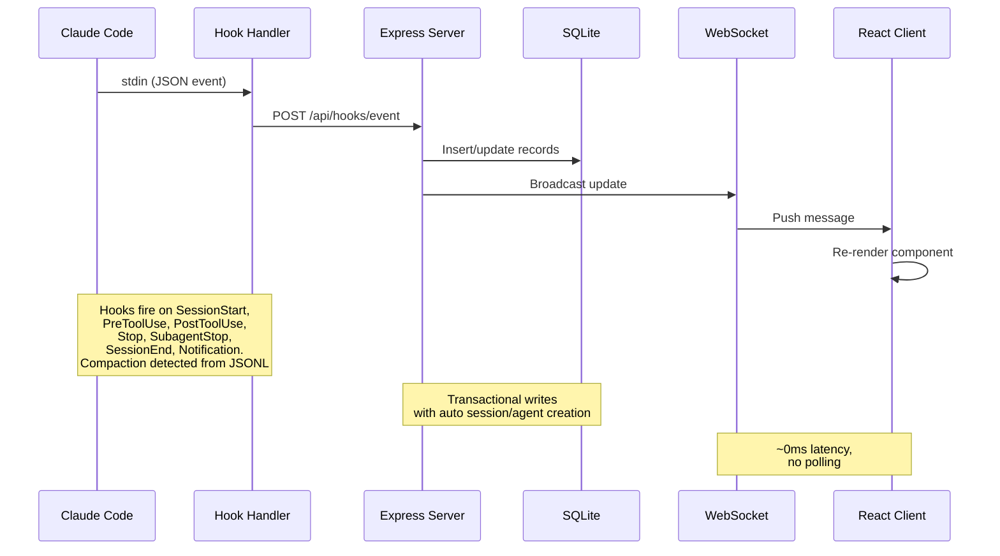

> [!QUAN TRỌNG]
> Xem [KIẾN TRÚC.md](./ARCHITECTURE.md) để tìm hiểu sâu về kiến ​​trúc máy chủ, lược đồ cơ sở dữ liệu, tuyến API, thiết kế WebSocket, định tuyến máy khách, luồng trình xử lý hook, chế độ triển khai và sơ đồ vòng đời chi tiết cho phiên và tác nhân.

### Vòng đời móc

1. **Claude Code** kích hoạt một hook khi bắt đầu phiên, sử dụng công cụ, kết thúc lần lượt, hoàn thành tác nhân phụ và thoát phiên
2. **Hook Handler** (`scripts/hook-handler.js`) đọc sự kiện JSON từ stdin và gửi nó lên API. Lỗi âm thầm với thời gian chờ 5 giây nên nó không bao giờ chặn Claude Code
3. **Máy chủ** xử lý sự kiện bên trong giao dịch SQLite:
   - Tự động tạo phiên và Agent chính trong lần liên hệ đầu tiên
   - Phát hiện lệnh gọi công cụ `Agent` để theo dõi việc tạo tác nhân phụ
   - Trên `SessionStart`, đóng dấu `awaiting_input_since` lên phiên và Agent chính, để CLI mới ngồi ở dòng nhập sẽ rơi ngay vào cột **Đang chờ**
   - Trên `UserPromptSubmit` (người dùng nhấn enter), xóa cờ chờ và đẩy Agent chính sang `working` — đây là tín hiệu đáng tin cậy duy nhất cho biết các lượt văn bản thuần đã bắt đầu, vì chúng không phát ra `PreToolUse`
   - Đặt tác nhân thành "working" trên `PreToolUse` (đồng thời xóa cờ chờ), giữ cho tác nhân hoạt động qua `PostToolUse` (cũng xóa cờ chờ — xử lý tình huống user duyệt prompt xin quyền giữa lúc tool đang chạy)
   - Trên `Stop` không lỗi, Agent chính chuyển sang `waiting` — Claude đã hoàn thành lượt, lượt tiếp theo thuộc về người dùng. `Stop` lỗi đánh dấu Agent và phiên `error`. Các Subagent nền vẫn tiếp tục chạy
   - Trên Notification dạng xin quyền (khớp mẫu: `permission`, `waiting for input`, `needs your approval`, …), đặt agent sang `waiting` và đóng dấu `awaiting_input_since`
   - `SubagentStop` cố tình KHÔNG xóa cờ chờ — Subagent nền hoàn thành không nói lên gì về việc người dùng đã trả lời hay chưa
   - Đánh dấu các Subagent hoàn thành riêng lẻ thông qua `SubagentStop`. Sau khi `res.json()` trả về, chạy fire-and-forget `scanAndImportSubagents` để duyệt các tệp `subagents/agent-*.jsonl` của phiên, ghép cặp `tool_use` ↔ `tool_result` theo `tool_use_id`, và phát các sự kiện `PreToolUse` + `PostToolUse` dưới `agent_id` của chính từng subagent — lấp đầy khoảng trống mà các tool call nội bộ của subagent vốn vô hình với dashboard
   - Trên `SessionEnd` (CLI thoát), xóa cờ chờ. Nếu phiên đang ở trạng thái `error`, trạng thái lỗi được giữ nguyên; ngược lại đánh dấu tất cả Agent + phiên là `completed`
   - Trên `SessionStart`, bất kỳ phiên active nào khác không có hoạt động trong `DASHBOARD_STALE_MINUTES` (mặc định 180 = 3 giờ, có thể ghi đè qua biến môi trường) sẽ được đánh dấu "abandoned" với các Agent của nó hoàn thành. Điều này xử lý `/resume` bên trong phiên, Ctrl+C và các tình huống mồ côi khác mà không có `SessionEnd` sạch
   - Kích hoạt lại các phiên completed/error/abandoned khi có sự kiện công việc mới (phiên được tiếp tục). Các sự kiện Stop và SubagentStop cũng kích hoạt lại các phiên completed/abandoned — thao tác này xử lý các phiên có sẵn được nhập trước khi máy chủ khởi động, trong đó sự kiện hook đầu tiên có thể là Stop
   - **Khôi phục lỗi**: chỉ `UserPromptSubmit` và `PreToolUse` có thể khôi phục phiên từ `error` về `active` — cho thấy người dùng đã chủ động thử lại
   - Phát hiện quá trình nén cuộc hội thoại (`isCompactSummary` trong bản ghi JSONL) và tạo tác nhân + sự kiện `Compaction`. Baseline token được bảo toàn qua các lần nén nên không bị mất usage. Việc đọc transcript sử dụng cache stat-based với incremental byte-offset reads — chỉ các byte mới được thêm vào kể từ lần đọc cuối cùng được parse, giúp tăng tốc ~50 lần cho các phiên dài
   - Trích xuất các lỗi API (`isApiErrorMessage`: giới hạn quota, rate limit, invalid_request) và phản hồi `type: "error"` thô từ JSONL transcript, lưu dưới dạng sự kiện `APIError`. Thời lượng lượt (`system` subtype `turn_duration`) được lưu dưới dạng `TurnDuration`. Lỗi tool result (`toolUseResult.is_error`) được theo dõi dưới dạng `ToolError`
   - **Watchdog phát hiện lỗi** — một timer nền chạy mỗi 15 giây, quét các phiên active không có sự kiện hook gần đây (>10 giây). Nó đọc lại các tệp transcript tìm lỗi API (lỗi xác thực, rate limit, hết quota), suy ra đường dẫn transcript từ `cwd` của phiên cho các phiên import không có `transcript_path` trong dữ liệu sự kiện, và đánh dấu phiên/agent là `error` khi phát hiện lỗi API. Điều này bắt các trường hợp Claude CLI không kích hoạt hook sau lỗi API (ví dụ: lỗi xác thực 401 khi CLI chỉ hiển thị lỗi và chờ)
   - **Khôi phục khi người dùng ngắt lượt (Esc)** — hủy một lượt bằng `Esc` **không kích hoạt hook nào** (một hạn chế đã được ghi nhận của Claude Code), nên nếu không can thiệp Agent chính sẽ bị kẹt mãi ở `working`. Cùng watchdog 15 giây đó khôi phục theo hai cách: (1) khi việc hủy để lại dấu `[Request interrupted by user]` trong transcript (Esc *sau khi* đã có một phần output), transcript cache gắn cờ qua `pendingInterrupt` — được dẫn xuất hoàn toàn từ thứ tự trong transcript (interrupt mới nhất so với hoạt động lượt thực mới nhất, cùng một đồng hồ, nên hoạt động ngay cả với lần hủy dưới một giây) — và phiên chuyển sang **Đang chờ** trong khoảng ~15 giây; (2) khi Esc được nhấn *trước khi có bất kỳ output nào*, Claude Code không ghi dấu nào cả, nên áp dụng phương án dự phòng theo idle-timeout — nếu Agent chính đã ở `working` mà **không có tool nào đang chạy** (`current_tool` null) và **cả sự kiện hook lẫn transcript đều không tiến triển** trong `DASHBOARD_WORKING_IDLE_SECONDS` (mặc định `120`), lượt đó được coi là đã chết và phiên chuyển sang **Đang chờ**. Cả hai đường dẫn đều ghi một sự kiện `Interrupted` và đưa phiên về cùng trạng thái Đang chờ mà một `Stop` bình thường tạo ra. Streaming output (transcript vẫn đang tăng) và các tool call đang chạy (`current_tool` được đặt) được miễn trừ; một lần lật cờ sai hiếm gặp sẽ tự phục hồi ở hook thực tiếp theo
   - Quét máy chủ định kỳ phát hiện các phiên bị bỏ qua và các lần nén mới vượt qua khả năng phát hiện dựa trên sự kiện (ví dụ: `/compact` không kích hoạt hook, `/resume` trong vài giây sau khi tạo phiên). Tần suất được dẫn xuất từ `DASHBOARD_STALE_MINUTES` (¼ ngưỡng, kẹp giữa 60s–5 phút). Quá trình quét chia sẻ transcript cache với trình xử lý hook, tránh I/O trùng lặp. Việc dọn dẹp phiên bỏ dở cũng evict cache để bound memory
4. **WebSocket** thông báo thay đổi tới tất cả các máy khách được kết nối
5. **UI** nhận bản cập nhật và hiển thị lại các thành phần bị ảnh hưởng trong thời gian thực mà không cần thăm dò ý kiến.

### Máy trạng thái Agent

Trạng thái lưu trữ: `working | waiting | completed | error`. Cột
`awaiting_input_since` là bổ sung — nó theo dõi thời điểm Agent bắt đầu
chờ và dùng để hiển thị thời lượng chờ, nhưng `waiting` giờ là trạng thái
lưu trữ thực sự.

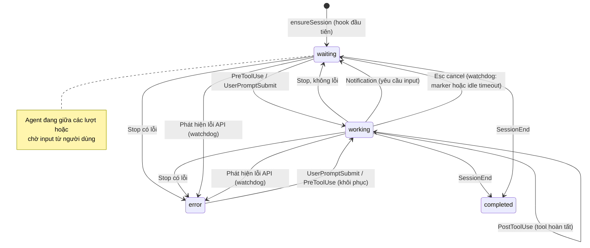

### Máy trạng thái phiên

Trạng thái lưu trữ: `active | completed | error | abandoned`. Trạng thái
**Đang chờ** là lớp phủ UI (status=`active` cộng với `awaiting_input_since`
được đặt).

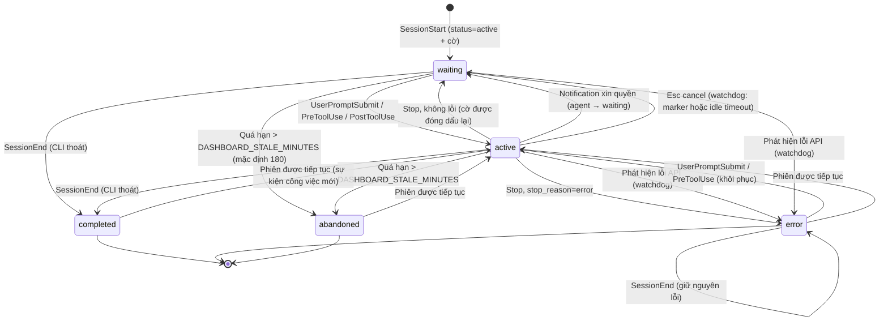

### Luồng tính toán chi phí

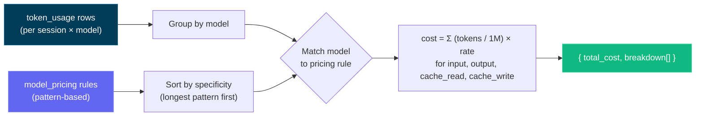

> [!QUAN TRỌNG]
> Luồng tính toán chi phí dựa trên việc sử dụng mã thông báo và quy tắc định giá mô hình. Đảm bảo quy tắc đặt giá của bạn được cập nhật để phản ánh chi phí chính xác. Cập nhật bảng giá mô hình thông qua trang Cài đặt để duy trì theo dõi chi phí chính xác - bảng thông tin không tự động tìm nạp thông tin cập nhật về giá từ các nguồn bên ngoài. Sau khi bạn đặt quy tắc đặt giá, trang tổng quan sẽ áp dụng chúng cho tất cả các phiên để báo cáo chi phí nhất quán.

---

## Cấu hình

| Biến môi trường    | Mặc định       | Sự miêu tả                                   |
| ----------------------- | ------------- | --------------------------------------------- |
| `DASHBOARD_PORT`        | `4820`        | Cổng dành cho máy chủ Express                   |
| `CLAUDE_DASHBOARD_PORT` | `4820`        | Cổng được trình xử lý hook sử dụng để đến máy chủ |
| `NODE_ENV`              | `development` | Đặt thành `production` để phục vụ ứng dụng khách đã xây dựng |
| `DASHBOARD_WORKING_IDLE_SECONDS` | `120` | Idle-working timeout để khôi phục một lượt bị hủy bằng `Esc` **trước khi có bất kỳ output nào** (việc này không để lại dấu nào trong transcript). Khi Agent chính đã ở `working` mà không có tool nào đang chạy và cả sự kiện hook lẫn transcript đều không tiến triển trong khoảng thời gian này, watchdog chuyển phiên sang **Đang chờ**. Giảm giá trị để khôi phục nhanh hơn, đổi lại đôi khi có lần lật cờ sai trên các lượt suy nghĩ im lặng kéo dài (sẽ tự phục hồi) |

---

## Tập lệnh npm

| Yêu cầu                 | Sự miêu tả                                                |
| ----------------------- | ---------------------------------------------------------- |
| `npm run setup`         | Cài đặt phụ thuộc máy chủ và máy khách                     |
| `npm run dev`           | Khởi động đồng thời máy chủ (chế độ xem) + máy khách (Vite HMR) |
| `npm run dev:server`    | Chỉ khởi động máy chủ Express với `--watch`               |
| `npm run dev:client`    | Chỉ khởi động máy chủ Vite dev                             |
| `npm run build`         | Xây dựng ứng dụng khách React thành `client/dist/`                   |
| `npm start`             | Bắt đầu máy chủ sản xuất (phục vụ máy khách được xây dựng)              |
| `npm run install-hooks` | Định cấu hình móc Claude Code trong `~/.claude/settings.json`   |
| `npm run seed`          | Điền vào cơ sở dữ liệu với dữ liệu mẫu                         |
| `npm run import-history`| Nhập các phiên kế thừa từ `~/.claude/` (cũng chạy khi khởi động) |
| `npm run clear-data`    | Xóa tất cả các phiên, tác nhân, sự kiện và việc sử dụng mã thông báo            |
| `npm run mcp:install`   | Cài đặt các phần phụ thuộc cho gói MCP cục bộ (`mcp/`)       |
| `npm run mcp:build`     | Xây dựng TypeScript của máy chủ MCP thành `mcp/build/`             |
| `npm run mcp:start`     | Khởi động máy chủ MCP (stdio Transport - dành cho máy chủ MCP)        |
| `npm run mcp:start:http`| Khởi động máy chủ MCP (truyền tải HTTP + SSE trên cổng 8819)      |
| `npm run mcp:start:repl`| Khởi động máy chủ MCP (REPL tương tác khi hoàn thành tab)   |
| `npm run mcp:dev`       | Chạy máy chủ MCP ở chế độ dev (`tsx`, stdio)                 |
| `npm run mcp:dev:http`  | Chạy máy chủ MCP ở chế độ dev (`tsx`, HTTP + SSE)            |
| `npm run mcp:dev:repl`  | Chạy máy chủ MCP ở chế độ dev (`tsx`, REPL tương tác)      |
| `npm run mcp:typecheck` | Kiểm tra kiểu nguồn MCP mà không phát ra đầu ra bản dựng        |
| `npm run mcp:docker:build` | Xây dựng hình ảnh vùng chứa MCP bằng Docker (`agent-dashboard-mcp:local`) |
| `npm run mcp:podman:build` | Xây dựng hình ảnh vùng chứa MCP bằng Podman (`localhost/agent-dashboard-mcp:local`) |
| `npm run desktop:install` | Cài đặt Electron + electron-builder vào workspace `desktop/` (dựng lại `better-sqlite3` cho ABI của Electron); tiền kiểm bản dựng gốc `better-sqlite3` và in hướng dẫn thiết lập cụ thể (kèm phương án không cần bộ công cụ C++) khi thất bại |
| `npm run desktop:dev`   | Build TypeScript rồi khởi chạy ứng dụng máy tính để bàn Electron |
| `npm run desktop:build` | Biên dịch tiến trình chính của ứng dụng máy tính để bàn thành `desktop/out/` |
| `npm run desktop:test`  | Chạy kiểm thử smoke (spawn Electron rồi thăm dò `/api/health`) |
| `npm run desktop:dmg`   | **macOS:** Tạo DMG **universal** (x64 + arm64) — đúng cho bản phát hành. **Chậm.** |
| `npm run desktop:dmg:arm64` | **macOS:** Tạo DMG chỉ cho Apple Silicon. **Nhanh.** |
| `npm run desktop:dmg:x64`   | **macOS:** Tạo DMG chỉ cho Intel. **Nhanh.** |
| `npm run desktop:win`   | **Windows:** Tạo trình cài **NSIS** `.exe` (x64) — chạy trên Windows |
| `npm run desktop:win:portable` | **Windows:** Tạo bản **portable** (không cần cài) `.exe` (x64) — chạy trên Windows |

---

## Tiện ích mở rộng Agent

Kho lưu trữ này bao gồm lớp mở rộng toàn diện cho cả Claude Code và Codex:

- Claude Code: `CLAUDE.md`, `.claude/rules/`, `.claude/skills/`
- Subagent của Claude: `.claude/agents/`
- Codex: `AGENTS.md`, `.codex/rules/`, `.codex/agents/`, `.codex/skills/`

### Kiến trúc mở rộng

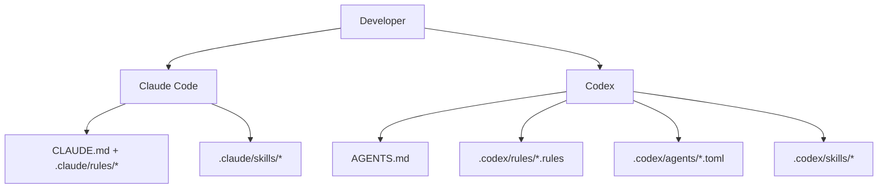

### Lớp Claude Code

- Bối cảnh liên tục:
  - [`CLAUDE.md`](./CLAUDE.md)
- Quy tắc trong phạm vi đường dẫn:
  - [`.claude/rules/backend-node.md`](./.claude/rules/backend-node.md)
  - [`.claude/rules/frontend-react.md`](./.claude/rules/frontend-react.md)
  - [`.claude/rules/mcp-typescript.md`](./.claude/rules/mcp-typescript.md)
  - [`.claude/rules/docs-markdown.md`](./.claude/rules/docs-markdown.md)
- Kỹ năng:
  - `repo-onboarding`
  - `ship-feature`
  - `mcp-operations`
  - `debug-live-issue`
- Chất phụ:
  - `backend-reviewer`
  - `frontend-reviewer`
  - `mcp-reviewer`

### Lớp Codex

- Bối cảnh liên tục:
  - [`AGENTS.md`](./AGENTS.md)
- Chính sách thực hiện:
  - [`.codex/rules/default.rules`](./.codex/rules/default.rules)
- Mẫu đại diện phụ tùy chỉnh:
  - [`.codex/agents/`](./.codex/agents)
- Kỹ năng:
  - [`.codex/skills/`](./.codex/skills)
- Cài đặt:
  - [`.codex/README.md`](./.codex/README.md)

---

## Tabby

Tabby là một chú mèo SVG dễ thương được ghim ở **góc dưới bên phải trên mọi trang**. Nó lắng nghe luồng phiên WebSocket thời gian thực và phản ứng theo đó — vừa thêm chút sinh động cho dashboard, vừa cung cấp cái nhìn tổng quan về trạng thái cùng các hành động nhanh ngay trong tầm tay. Tabby được xây dựng hoàn toàn trên luồng WebSocket sẵn có: **không cần backend mới, không cần API key.**

### Linh vật biết phản ứng

Tabby thể hiện **8 tâm trạng** dựa trên luồng phiên thời gian thực — idle (rảnh rỗi), watching (đang theo dõi), happy (vui), worried (lo lắng), stuck (mắc kẹt), thinking (đang suy nghĩ), sleeping (đang ngủ) và disconnected (mất kết nối). Mắt mèo dõi theo con trỏ chuột, mỗi tâm trạng có hoạt ảnh riêng, để chú mèo luôn phản ánh đúng trạng thái phiên hiện tại.

### Lời thoại bong bóng

Khi có sự kiện đáng chú ý (phiên bắt đầu / kết thúc, có lỗi, lần chạy hoàn tất), Tabby bật lên **lời thoại bong bóng**. Lời thoại được throttle và có thể tắt tiếng.

### Bảng điều khiển (⌘B / Ctrl+B)

Mở bằng cách nhấp vào chú mèo, hoặc nhấn **⌘B / Ctrl+B** (Esc để đóng). Bảng gồm:

- **Dòng trạng thái thời gian thực**: N đang chạy · M bị lỗi · trạng thái kết nối.
- **Hành động nhanh**: nhảy tới Run Claude / Activity / Sessions / các phiên bị lỗi, tắt tiếng, xóa cảnh báo.
- **Ô Ask**: trả lời cục bộ các câu hỏi trạng thái đơn giản; những câu hỏi khác được chuyển sang trang **Run Claude** sẵn có (`/run?prompt=...`) để khởi chạy một phiên Claude Code thật sự. **Không cần backend mới, không cần API key.**

### Trợ năng & Cài đặt

Tabby được xây dựng hoàn toàn trên luồng WebSocket sẵn có, hỗ trợ bàn phím, `aria-live`, và tôn trọng thiết lập `prefers-reduced-motion`. Có thể bật hoặc tắt Tabby bất cứ lúc nào trong phần Settings. Mã nguồn nằm tại `client/src/components/Tabby/`.

---

## Tích hợp MCP

Dự án này bao gồm một máy chủ MCP cấp sản xuất cục bộ tại `mcp/` hiển thị các hoạt động trên bảng điều khiển dưới dạng công cụ cho các tác nhân AI. Nó hỗ trợ ba chế độ vận chuyển để phù hợp với các kịch bản tích hợp khác nhau.

### Chế độ vận chuyển MCP

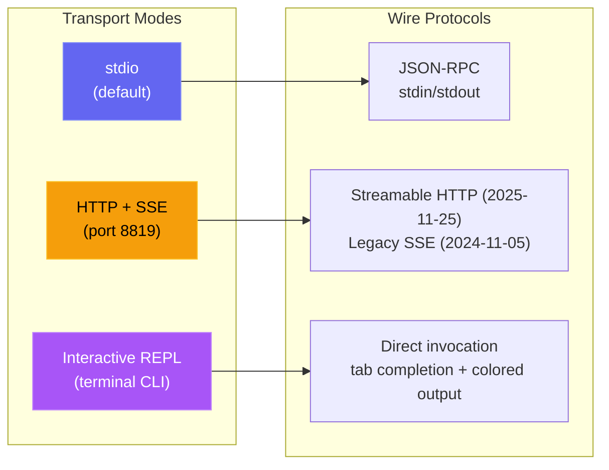

| Cách thức | Yêu cầu | Trường hợp sử dụng |
| --- | --- | --- |
| **stdio** | `npm run mcp:start` | Claude Code, Claude Desktop, máy chủ IDE MCP |
| **HTTP** | `npm run mcp:start:http` | Máy khách MCP từ xa, tích hợp web, nhiều phiên |
| **REPL** | `npm run mcp:start:repl` | Gỡ lỗi hoạt động, gọi công cụ thủ công, quản trị viên cục bộ |

<p align="center">
  
</p>

### Kiến trúc MCP

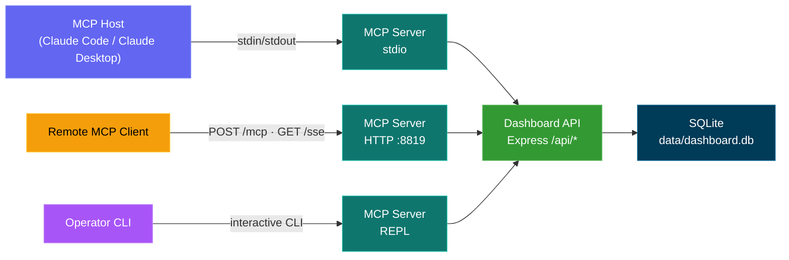

### Bề mặt công cụ MCP

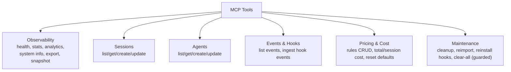

### Mô hình An toàn MCP

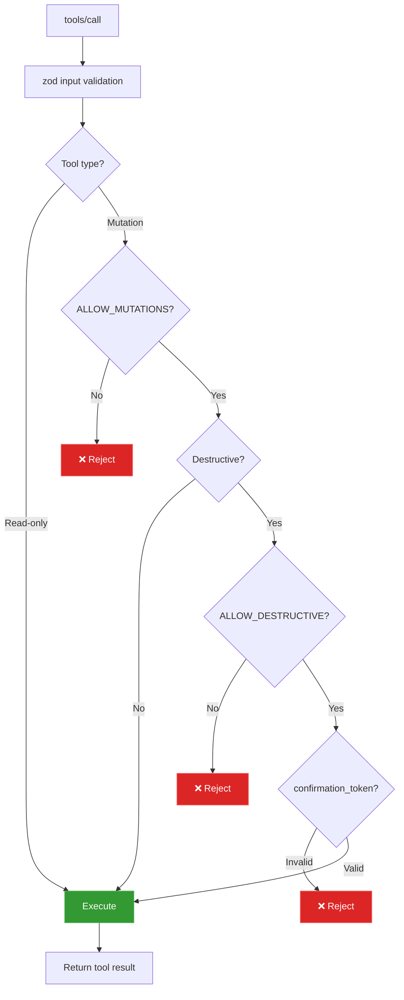

### Chế độ hoạt động MCP

- Chế độ chỉ đọc (mặc định): `MCP_DASHBOARD_ALLOW_MUTATIONS=false`
- Chế độ quản trị viên: `MCP_DASHBOARD_ALLOW_MUTATIONS=true`
- Chế độ hủy diệt: yêu cầu cả hai:
  - `MCP_DASHBOARD_ALLOW_MUTATIONS=true`
  - `MCP_DASHBOARD_ALLOW_DESTRUCTIVE=true`
  - đầu vào công cụ `confirmation_token: "CLEAR_ALL_DATA"`

Chi tiết đầy đủ: [mcp/README.md](./mcp/README.md)

---

## Tham chiếu API

Tất cả các điểm cuối đều trả về JSON. Phản hồi lỗi có dạng `{ error: { code, message } }`.

### OpenAPI / Swagger

| Phương pháp | Con đường                | Sự miêu tả                         |
| ------ | ------------------- | ----------------------------------- |
| `GET`  | `/api/openapi.json` | Thông số OpenAPI 3.0 thô                |
| `GET`  | `/api/docs`         | Tài liệu giao diện người dùng Swagger tương tác |
| `GET`  | `/api/redoc`        | Tài liệu tham chiếu ReDoc (tài liệu API ba khung được tối ưu cho việc đọc). **Tự lưu trữ**: gói được phân phối cục bộ từ `/api/redoc/redoc.standalone.js`, không dùng CDN, hoạt động ngoại tuyến |

Tài liệu OpenAPI được tạo từ `server/openapi.js` và giao diện người dùng Swagger được phân phối trực tiếp bởi chương trình phụ trợ.

Tệp `openapi.yaml` cũng được commit ở thư mục gốc của kho lưu trữ, phản chiếu thông số trực tiếp và được tạo lại qua `npm run openapi:yaml` (nguồn chính thức là `server/openapi.js`; không bao giờ chỉnh sửa thủ công).

Tài liệu API hiện đã **đầy đủ**: mọi route phụ trợ đều được ghi tài liệu (75 mục đường dẫn) kèm tham số, schema, mô tả trường và ví dụ; các nhóm mới được ghi tài liệu gồm `/api/push`, `/api/cc-config`, `/api/run`, `/api/workflows/runs`, `/api/sessions/facets` và `/api/settings/claude-home`.

<p align="center">
  
</p>

<p align="center">
  
</p>

### Sức khỏe

| Phương pháp | Con đường          | Sự miêu tả                           |
| ------ | ------------- | ------------------------------------- |
| `GET`  | `/api/health` | Trả về `{ status: "ok", timestamp }` |

### Phiên

| Phương pháp  | Con đường                            | Thông số truy vấn                                                | Sự miêu tả                                                                                              |
| ------- | -------------------------------- | ---------------------------------------------------------------- | ------------------------------------------------------------------------------------------------------- |
| `GET`   | `/api/sessions`                  | `status`, `q`, `limit`, `offset`                                 | Liệt kê phiên kèm số lượng Agent và chi phí mỗi phiên. `q` tìm không phân biệt hoa thường trên `id` / `name` / `cwd`; `limit` mặc định 50, tối đa 10000; phản hồi gồm `total` cho bộ phân trang |
| `GET`   | `/api/sessions/:id`              | --                                                               | Chi tiết phiên với các Agent và sự kiện                                                                 |
| `GET`   | `/api/sessions/:id/stats`        | --                                                               | Số liệu tổng hợp cấp phiên cho bảng tổng quan: sự kiện, sự kiện theo loại, top công cụ, số lỗi, số đếm tác nhân theo loại/trạng thái, phân tích loại subagent, tổng token, khoảng thời gian |
| `GET`   | `/api/sessions/:id/transcripts`  | --                                                               | Danh sách bản ghi JSONL có sẵn cho phiên (chính + subagent + nén)                                       |
| `GET`   | `/api/sessions/:id/transcript`   | `agent_id`, `limit`, `offset`, `after`, `before`                 | Phát các tin nhắn từ một bản ghi cụ thể với phân trang theo con trỏ                                     |
| `POST`  | `/api/sessions`                  | --                                                               | Tạo phiên (idempotent trên `id`)                                                                        |
| `PATCH` | `/api/sessions/:id`              | --                                                               | Cập nhật trạng thái/siêu dữ liệu phiên                                                                  |

### Agent

| Phương pháp  | Con đường              | Thông số truy vấn                              | Sự miêu tả                   |
| ------- | ----------------- | ----------------------------------------- | ----------------------------- |
| `GET`   | `/api/agents`     | `status`, `session_id`, `limit`, `offset` | Liệt kê các Agent có bộ lọc      |
| `GET`   | `/api/agents/:id` | --                                        | Chi tiết Agent duy nhất           |
| `POST`  | `/api/agents`     | --                                        | Tạo Agent                  |
| `PATCH` | `/api/agents/:id` | --                                        | Cập nhật trạng thái/nhiệm vụ/công cụ của Agent |

### Sự kiện

| Phương pháp | Con đường          | Thông số truy vấn                    | Sự miêu tả                |
| ------ | ------------- | ------------------------------- | -------------------------- |
| `GET`  | `/api/events` | `session_id`, `limit`, `offset` | Liệt kê các sự kiện (mới nhất trước) |

### Thống kê

| Phương pháp | Con đường         | Sự miêu tả                                            |
| ------ | ------------ | ------------------------------------------------------ |
| `GET`  | `/api/stats` | Số lượng tổng hợp, phân phối trạng thái, kết nối WS |

### Phân tích

| Phương pháp | Con đường             | Sự miêu tả                                                |
| ------ | ---------------- | ---------------------------------------------------------- |
| `GET`  | `/api/analytics` | Tổng hợp mã thông báo/công cụ/phiên cho biểu đồ và chế độ xem xu hướng   |

### móc

| Phương pháp | Con đường               | Sự miêu tả                                  |
| ------ | ------------------ | -------------------------------------------- |
| `POST` | `/api/hooks/event` | Nhận và xử lý sự kiện hook Claude Code |

**Tải trọng sự kiện móc:**

```json
{
  "hook_type": "PreToolUse",
  "data": {
    "session_id": "abc-123",
    "tool_name": "Bash",
    "tool_input": { "command": "ls -la" }
  }
}
```

### Định giá

| Phương pháp   | Con đường                     | Sự miêu tả                              |
| -------- | ------------------------ | ---------------------------------------- |
| `GET`    | `/api/pricing`           | Liệt kê tất cả các quy tắc định giá                   |
| `PUT`    | `/api/pricing`           | Tạo hoặc cập nhật quy tắc đặt giá          |
| `DELETE` | `/api/pricing/:pattern`  | Xóa quy tắc đặt giá                    |
| `GET`    | `/api/pricing/cost`      | Tổng chi phí trên tất cả các phiên           |
| `GET`    | `/api/pricing/cost/:id`  | Phân tích chi phí cho một phiên cụ thể    |

### Quy trình làm việc

| Phương pháp | Con đường                          | Sự miêu tả                                             |
| ------ | ----------------------------- | ------------------------------------------------------- |
| `GET`  | `/api/workflows`              | Dữ liệu quy trình công việc tổng hợp (điều phối, công cụ, mẫu). Tùy chọn `?status=active\|thông số truy vấn đã hoàn thành lọc tất cả 11 phần dữ liệu theo trạng thái phiên |
| `GET`  | `/api/workflows/session/:id`  | Thông tin chi tiết mỗi phiên (cây tác nhân, dòng thời gian công cụ, sự kiện) |

### Cài đặt

| Phương pháp | Con đường                           | Sự miêu tả                                      |
| ------ | ------------------------------ | ------------------------------------------------ |
| `GET`  | `/api/settings/info`           | Thông tin hệ thống, số liệu thống kê DB, trạng thái hook               |
| `POST` | `/api/settings/clear-data`     | Xóa tất cả các phiên, Agent, sự kiện, sử dụng token |
| `POST` | `/api/settings/reimport`       | Nhập lại các phiên kế thừa từ `~/.claude/`      |
| `POST` | `/api/settings/reinstall-hooks`| Cài đặt lại móc Claude Code                      |
| `POST` | `/api/settings/reset-pricing`  | Đặt lại giá về mặc định                        |
| `GET`  | `/api/settings/export`         | Xuất tất cả dữ liệu dưới dạng tải xuống JSON                 |
| `POST` | `/api/settings/cleanup`        | Bỏ các phiên cũ, xóa dữ liệu cũ           |

### Nhập lịch sử (Import History)

Đưa các phiên Claude Code hiện có vào dashboard từ ba nguồn khác nhau,
tất cả đều đi qua cùng một bộ phân tích mà máy chủ sử dụng để thu nhận
thời gian thực — nhờ đó, số token, chi phí theo mô hình, compactions,
subagents, lần dùng công cụ và thời lượng lượt được tính giống hệt với
dữ liệu được bắt trực tiếp. Nhập lại là bất biến: phiên được khóa theo
UUID và các cột `baseline_*` ở bảng `token_usage` giữ nguyên tổng token
trước khi compact, nên chạy lại trình nhập không bao giờ nhân đôi token
hay chi phí.

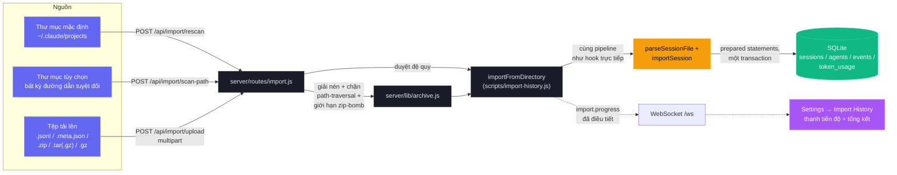

**Các tuyến API**

| Phương pháp | Đường dẫn               | Mô tả                                                                            |
| ----------- | ----------------------- | -------------------------------------------------------------------------------- |
| `GET`       | `/api/import/guide`     | Đường dẫn theo hệ điều hành, lệnh tạo archive, phần mở rộng hỗ trợ, hướng dẫn    |
| `POST`      | `/api/import/rescan`    | Quét lại thư mục mặc định `~/.claude/projects`                                   |
| `POST`      | `/api/import/scan-path` | Quét một thư mục tuyệt đối bất kỳ (body `{ path }`); đi đệ quy                   |
| `POST`      | `/api/import/upload`    | Tải lên đa phần `.jsonl`, `.meta.json`, `.zip`, `.tar(.gz)`, `.gz`               |

**Đầu vào hỗ trợ.** Tệp JSONL rời (`.jsonl`), tệp phụ `.meta.json`, và
các archive (`.zip`, `.tar`, `.tar.gz`/`.tgz`, `.gz`) chứa bất kỳ cấu
trúc thư mục lồng nhau nào. Cả hai bố cục chuẩn của Claude Code đều
được nhận diện tự động: `<project>/<sessionId>/subagents/agent-*.jsonl`
(mặc định) và `<project>/subagents/<sessionId>/agent-*.jsonl` (thay
thế).

**Đảm bảo độ chính xác.** Phiên được dedup theo UUID; nhập lại luôn an
toàn. Các cột compaction `baseline_input` / `baseline_output` /
`baseline_cache_read` / `baseline_cache_write` giữ lại số token trước
khi transcript được compact, nên nhập lại một JSONL sau compact không
bao giờ xóa chi phí lịch sử.

**An toàn.** Giải nén archive kiểm tra từng mục chống path-traversal
(đường dẫn tuyệt đối và đoạn `..` bị từ chối). Giới hạn kích thước giải
nén có thể cấu hình (`CCAM_IMPORT_MAX_EXTRACT_BYTES`, mặc định 4 GB)
chặn các zip/tar/gzip-bomb. Kích thước tải lên bị giới hạn theo từng
tệp (`CCAM_IMPORT_MAX_BYTES`, mặc định 1 GB) và theo yêu cầu
(`CCAM_IMPORT_MAX_FILES`, mặc định 2000). Mỗi yêu cầu có thư mục tạm
riêng và được dọn dẹp trong `finally`, kể cả khi multer từ chối toàn bộ
tệp ngay từ đầu.

**Tiến độ.** Hoạt động nhập được phát sóng qua WebSocket hiện có dưới
dạng `import.progress` (`phase`: `start` / `scan` / `extract` / `parse`
/ `complete` / `error`), đã điều tiết để không ngập kênh khi nhập lớn.

**Giao diện.** Sử dụng bảng **Settings → Import History** trong giao
diện để trải nghiệm nhập lịch sử có hướng dẫn từng bước, kéo-thả, tiến
độ trực tiếp và thẻ tổng kết sau khi nhập (imported / enriched /
skipped / errors).

<p align="center">
  
</p>

### WebSocket

Kết nối với `ws://localhost:4820/ws` để nhận tin nhắn đẩy theo thời gian thực:

```json
{
  "type": "agent_updated",
  "data": { "id": "...", "status": "working", "current_tool": "Edit" },
  "timestamp": "2026-03-05T15:43:01.800Z"
}
```

**Các loại tin nhắn:** `session_created`, `session_updated`, `agent_created`, `agent_updated`, `new_event`

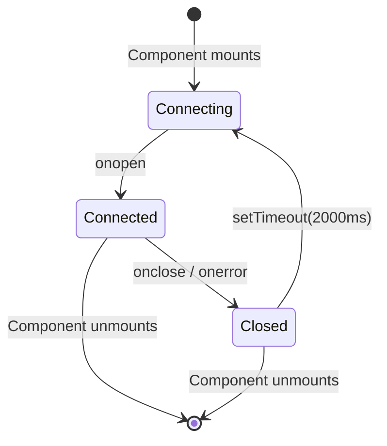

---

## Sự kiện móc nối

Bảng điều khiển xử lý các loại hook Claude Code này:

| Loại hook         | Trigger                        | Hành động trên dashboard                                                                             |
| ----------------- | ------------------------------ | --------------------------------------------------------------------------------------------------- |
| `SessionStart`    | Phiên Claude Code bắt đầu      | Tạo phiên và Agent chính. Đóng dấu `awaiting_input_since` để phiên mới rơi vào **Đang chờ**. Kích hoạt lại các phiên đã tiếp tục. Bỏ các phiên mồ côi không hoạt động trong `DASHBOARD_STALE_MINUTES` (mặc định 180) |
| `UserPromptSubmit`| Người dùng nhấn enter          | Xóa cờ chờ và đẩy Agent chính sang `working` — tín hiệu duy nhất cho biết các lượt văn bản thuần đã bắt đầu, vì chúng không phát ra `PreToolUse` |
| `PreToolUse`      | Agent bắt đầu sử dụng tool     | Xóa cờ chờ, đặt Agent thành `working`, đặt `current_tool`. Nếu tool là `Agent`, tạo bản ghi Subagent |
| `PostToolUse`     | Tool hoàn tất                  | Xóa cờ chờ (xử lý các phê duyệt prompt xin quyền mà Notification đã đóng dấu giữa lúc tool đang chạy). Xóa `current_tool`. Agent ở lại `working` |
| `Stop`            | Claude trả lời xong            | Không lỗi: Agent chính → `waiting` — Claude xong lượt, đến lượt người dùng. `stop_reason=error`: đánh dấu Agent và phiên `error`. Subagent nền vẫn tiếp tục chạy |
| `SubagentStop`    | Subagent nền đã hoàn tất       | Khớp và hoàn thành Subagent theo mô tả, loại hoặc nhiệm vụ. Cố tình KHÔNG xóa cờ chờ — Subagent xong không nói lên gì về người dùng. **Kích hoạt quét JSONL fire-and-forget** (`scanAndImportSubagents`) phát các sự kiện `PreToolUse` + `PostToolUse` cho từng tool dưới `agent_id` của chính subagent, để Timeline hiển thị đầy đủ tool subagent đã chạy chứ không chỉ marker spawn |
| `Notification`    | Notification Agent             | Ghi sự kiện. Tin nhắn xin quyền/yêu cầu input đặt agent sang `waiting` và đóng dấu `awaiting_input_since` (mẫu: `permission`, `waiting for input`, `needs your approval`, …). Notification liên quan đến nén được gắn thẻ `Compaction`. Kích hoạt notification trình duyệt nếu được bật |
| `SessionEnd`      | CLI Claude Code thoát          | Xóa cờ chờ. Nếu phiên đang ở trạng thái `error`, trạng thái lỗi được giữ nguyên; ngược lại đánh dấu tất cả Agent + phiên là `completed` |
| `Compaction`   | `/compact` được phát hiện trong JSONL   | Tạo một tác nhân phụ nén (loại `compaction`) và sự kiện Nén. Được phát hiện qua các mục `isCompactSummary` trong bản ghi JSONL. Cũng được phát hiện bởi máy quét định kỳ cho các phiên hoạt động |
| `APIError`     | Lỗi API trong bản ghi JSONL  | Được trích xuất từ các mục nhập `isApiErrorMessage` (hạn ngạch, giới hạn tỷ lệ, yêu cầu không hợp lệ) và phản hồi thô `type: "error"`. **Ngay lập tức đánh dấu phiên và agent là `error`** — trước đây chỉ ghi nhận sự kiện mà không thay đổi trạng thái. Được lưu trữ dưới dạng sự kiện với chi tiết lỗi |
| `TurnDuration` | Xoay thời gian trong bảng điểm JSONL| Trích xuất từ ​​​​các tin nhắn `system` kiểu con `turn_duration` có `durationMs`. Được lưu trữ dưới dạng sự kiện để phân tích thời gian theo cấp độ |
| `ToolError`    | Lỗi kết quả công cụ trong JSONL     | Trích xuất từ ​​​​các mục `toolUseResult.is_error`. Theo dõi lỗi cấp công cụ để phân tích lan truyền lỗi |
| `Interrupted`  | Lượt bị người dùng hủy (Esc) | Được tổng hợp bởi watchdog — `Esc` không kích hoạt hook nào, nên một phiên kẹt ở `working` được phát hiện từ dấu `[Request interrupted by user]` trong transcript hoặc, khi Esc xảy ra trước khi có bất kỳ output nào, từ idle-working timeout (`DASHBOARD_WORKING_IDLE_SECONDS`). Phiên chuyển sang **Đang chờ** (giống như một `Stop` bình thường) |

---

## Thông báo trình duyệt

Bảng điều khiển hỗ trợ thông báo trình duyệt liên tục thông qua Web Push (VAPID) để cảnh báo theo thời gian thực ngay cả khi tab bảng điều khiển không được tập trung hoặc trình duyệt đang ở chế độ nền.

### Nó hoạt động như thế nào

1. **Bật** thông báo trong trang Cài đặt thông qua nút chuyển đổi chính
2. **Cấp** quyền cho trình duyệt khi được nhắc — điều này sẽ đăng ký một Service Worker và tạo một đăng ký đẩy
3. **Định cấu hình** sự kiện nào kích hoạt thông báo:

| Sự kiện                        | Mặc định | Sự miêu tả                                                     |
| ---------------------------- | ------- | --------------------------------------------------------------- |
| Phiên mới bắt đầu           | Bật      | Kích hoạt khi phiên Claude Code mới được tạo                 |
| Claude trả lời xong   | Tắt     | Kích hoạt các sự kiện `Stop` khi Claude kết thúc lượt phản hồi     |
| Phiên đã đóng               | Tắt     | Kích hoạt `SessionEnd` khi quá trình CLI thoát                |
| Lỗi phiên               | Bật      | Kích hoạt khi phiên kết thúc có lỗi                         |
| Subagent sinh ra             | Tắt     | Kích hoạt khi tác nhân phụ nền được tạo                     |

Ngoài ra, bất kỳ sự kiện hook `Notification` nào từ Claude Code đều kích hoạt thông báo trình duyệt bất kể nút chuyển đổi cho mỗi sự kiện (miễn là nút chuyển đổi chính được bật).

### Kiến trúc thông báo

- **Hệ thống VAPID:** Sử dụng `web-push` trên máy chủ để phân phối tin nhắn an toàn. Các khóa VAPID được tạo tự động và lưu trữ trong `data/vapid-keys.json`.
- **Service Worker:** Một worker chuyên dụng (`client/public/sw.js`) xử lý các sự kiện `push` đến và hiển thị thông báo với `silent: false` để đảm bảo phát lại âm thanh trên macOS.
- **Đăng ký:** Các điểm cuối dành riêng cho trình duyệt được lưu trữ trong bảng `push_subscriptions` trong SQLite.
- **Tính liên tục:** Thông báo vẫn đến ngay cả khi trình duyệt đã đóng, vì Service Worker hoạt động ở chế độ nền.
- **Thông báo kiểm tra:** Nút trong Cài đặt cho phép bạn xác minh hệ thống VAPID và phát lại âm thanh.

---

## Thông báo cập nhật

Bảng điều khiển tự giám sát git checkout của chính nó và hiện một modal bất cứ khi nào nhánh mặc định chuẩn có commit mới đi trước HEAD. **Nhận biết nhánh và fork:** nếu có remote `upstream` (quy ước chuẩn cho fork), nó được ưu tiên hơn `origin`; `master`/`main`/`HEAD` của remote được chọn chính là ref so sánh. `manual_command` tự điều chỉnh theo tình huống — chỉ dùng `git pull --ff-only` khi nhánh cục bộ thực sự theo dõi ref chuẩn, ngược lại dùng `git fetch` (kèm fast-forward merge ở trường hợp fork), để lệnh không bao giờ nói dối. Người dùng nhận được lệnh chính xác để chạy trong terminal — máy chủ **không bao giờ** tự pull hoặc khởi động lại, giữ cho cơ chế này có thể chạy đồng nhất giữa các phiên dev, tiến trình được quản lý bởi pm2/systemd/launchd/Docker, và các triển khai từ xa.

<p align="center">
  
</p>

### Cách hoạt động

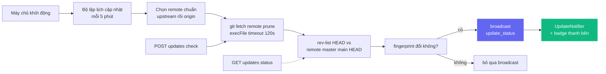

Mỗi lần kiểm tra đều rẻ (`git fetch <remote> --prune` với remote chuẩn — `upstream` nếu có, ngược lại `origin`), gói trong `execFile` (không qua shell) và có timeout 120 giây. Các trường hợp lỗi — mất mạng, cài đặt không phải git, không có remote nào, không phân giải được ref upstream — đều trả về **payload mềm** (ví dụ `fetch_error: "..."`) thay vì ném lỗi, nên một remote không ổn định sẽ không bao giờ làm nghẽn bảng điều khiển.

### Điểm hiển thị trong UI

| Vị trí | Hành vi |
| --- | --- |
| **Modal** (`client/src/components/UpdateNotifier.tsx`) | Hiện khi `update_available === true` và người dùng chưa bỏ qua `remote_sha` này. Hiển thị số commit chậm, ref đang theo dõi, lệnh sao chép được, và ba nút: **Sao chép lệnh** (chính), **Kiểm tra ngay**, **Bỏ qua**. Nhấn ESC hoặc click vào nền cũng đóng được. Được khóa theo `remote_sha` trong `localStorage`, nên một commit upstream mới hơn sẽ tự động mở lại modal. |
| **Nút thanh bên** (`client/src/components/Sidebar.tsx`) | Nút "Kiểm tra cập nhật" thường trực ở footer. Viền ngọc lục bảo + chấm badge xanh khi chậm, màu hổ phách khi lần kiểm tra gần nhất gặp lỗi fetch. Khi click sẽ xóa trạng thái "đã bỏ qua" trước đó, rồi gọi `POST /api/updates/check`. |
| **Terminal máy chủ** | Khi bộ lập lịch chuyển từ "mới nhất" sang "chậm", nó in một khối có khung ra stdout kèm lệnh để người chạy không có UI vẫn nhìn thấy. |

### Giao diện API

| Endpoint | Mục đích |
| --- | --- |
| `GET /api/updates/status` | Kiểm tra chỉ đọc: chạy `git fetch` đối với remote chuẩn, so sánh HEAD với nhánh mặc định của remote đó, trả về payload. |
| `POST /api/updates/check` | Cùng một kiểm tra, nhưng đồng thời broadcast `update_status` qua WebSocket để mọi client đang kết nối cập nhật một lượt. |

Cả hai endpoint trả về cùng một payload:

```json
{
  "git_repo": true,
  "update_available": true,
  "repo_root": "/Users/you/Claude-Code-Agent-Monitor",
  "remote_ref": "upstream/master",
  "canonical_remote": "upstream",
  "current_branch": "master",
  "tracking_upstream": "origin/master",
  "tracks_canonical": false,
  "situation": "fork_or_diverged_tracking",
  "local_sha": "abc1234...",
  "remote_sha": "def5678...",
  "commits_behind": 3,
  "manual_command": "cd \"/...\" && git fetch upstream && git merge --ff-only upstream/master && npm run setup",
  "situation_note": "You're on 'master' tracking 'origin/master'. This command fast-forwards your branch from upstream/master (the canonical default).",
  "message": "3 commit(s) on upstream/master not in your checkout."
}
```

`situation` nhận một trong: `tracking_canonical` (clone thông thường, nhánh cục bộ theo dõi ref chuẩn — `git pull --ff-only` là đủ); `fork_or_diverged_tracking` (tên nhánh cục bộ trùng với chuẩn nhưng theo dõi remote khác, ví dụ fork — `git fetch <remote> && git merge --ff-only <ref>`); `feature_branch` (không ở trên nhánh mặc định — chỉ fetch, để người dùng quyết định cách hợp nhất); `detached_head`.

### Vì sao **không** có tự cập nhật

Không có `POST /api/updates/apply` và cũng không có script tự khởi động lại — đây là lựa chọn thiết kế. Việc để một tiến trình tự thay thế chính nó mà không có trình giám sát bên ngoài là không đáng tin cậy: `npm run dev` (concurrently), `npm start`, `pm2`, `systemd`, `launchd`, Docker đều cần logic khởi động lại khác nhau, và lỗi `git pull` / `npm install` trên một tiến trình đang thoát không có đường rollback sạch sẽ. Chỉ phát hiện thôi giúp hành vi có thể dự đoán được trên mọi trình giám sát, mọi hệ điều hành, mọi trạng thái nhánh, đồng thời vẫn lấp đầy khoảng trống thông tin "khi nào thì mình cần pull?"; thao tác cập nhật thực sự do người dùng tự thực hiện trong shell của mình.

### Cấu hình

| Biến môi trường | Mặc định | Ghi chú |
| --- | --- | --- |
| `DASHBOARD_UPDATE_CHECK` | bật | Đặt `0` / `false` / `off` để tắt hoàn toàn bộ lập lịch. |
| `DASHBOARD_UPDATE_CHECK_INTERVAL_MS` | `300000` (5 phút) | Khoảng thời gian giữa các lần kiểm tra tự động. Sàn là 60 000 ms — giá trị thấp hơn sẽ bị kẹp. |

---

## Hộp thoại trạng thái kết nối

Bấm vào nhãn **Live** / **Disconnected** ở chân thanh bên để mở một bảng chi tiết nhỏ về kênh truyền WebSocket của Dashboard. Bảng hiển thị endpoint `ws://` đang dùng, thời lượng của socket hiện tại, tổng số sự kiện đã nhận, biểu đồ thanh ngang các loại sự kiện phổ biến, biểu đồ đường (sparkline) lưu lượng trong 60 giây gần nhất và danh sách 8 sự kiện gần đây. Các số liệu tích lũy (tổng số, phân bổ theo loại, danh sách gần đây) được lưu qua `localStorage` ở khóa `sidebar-connection-stats` nên sẽ giữ nguyên sau khi tải lại; sparkline và bộ đếm "đã kết nối" cố ý chỉ tồn tại tạm thời. Nút **Reset** ở chân hộp thoại xóa toàn bộ số liệu bất cứ lúc nào.

<p align="center">
  
</p>

---

## Ứng dụng máy tính để bàn (macOS & Windows)

Bảng điều khiển đi kèm một **ứng dụng máy tính để bàn gốc** tùy chọn mà bạn cài đặt một lần rồi quên đi — một `.app` macOS (phân phối dưới dạng `.dmg`) và một `.exe` Windows (một trình cài NSIS cùng một bản portable không cần cài). Mọi thứ bạn thấy trong trình duyệt tại `localhost:4820` đều nằm bên trong cửa sổ này, cộng thêm vòng đời gốc của hệ điều hành: biểu tượng tray, trình đơn ứng dụng, tích hợp tự khởi động và một nút thoát duy nhất dọn dẹp máy chủ gọn gàng.

<p align="center">
  
  <br>
  <em>🍎🪟 <strong>Ứng dụng máy tính để bàn</strong> — vỏ gốc với biểu tượng tray ở menu-bar / khu vực thông báo, Open-at-Login và khoá single-instance. Cùng một bảng điều khiển, chạy trong một cửa sổ hệ điều hành thật (hình minh họa là macOS).</em>
</p>

<p align="center">
  
  <br>
  <em>🪟 Cùng một bảng điều khiển dưới dạng ứng dụng Windows gốc — biểu tượng tray ở khu vực thông báo, trình đơn cửa sổ gốc và Open-at-Login.</em>
</p>

Workspace `desktop/` là **một workspace ngang hàng** với `client/`, `server/`, `mcp/` và `vscode-extension/` — được xây dựng bằng **Electron 35**. Nó **nhúng máy chủ Express ngay trong tiến trình** (`require()` trực tiếp `server/index.js` — không có tiến trình con, không có IPC) và hiển thị ứng dụng React đã build trong một `BrowserWindow`.

> [!LƯU Ý]
> **Trạng thái:** v1, hỗ trợ macOS và Windows. Bản dựng Linux và trình tự cập nhật (auto-updater) nằm ngoài phạm vi của phiên bản này và được theo dõi như các việc tiếp nối.

### Vị trí của ứng dụng máy tính để bàn trong kho mã

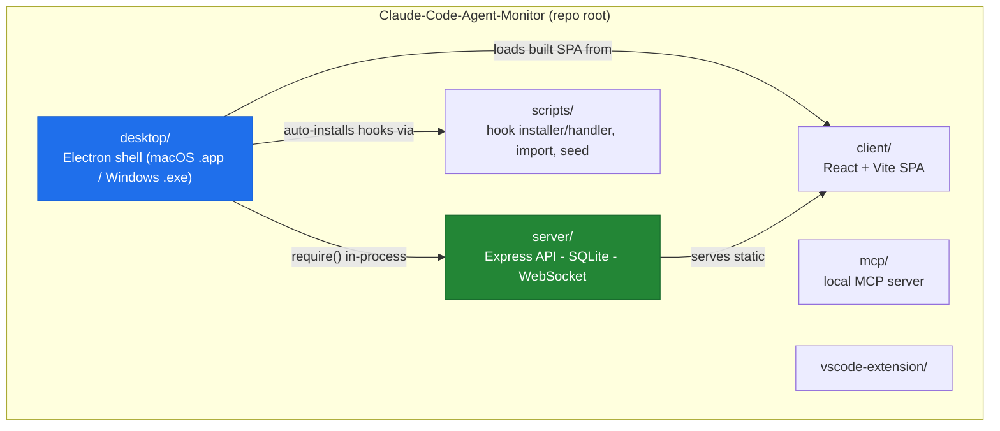

### Vì sao có ứng dụng này bên cạnh PWA

PWA giúp cài đặt bảng điều khiển trong các trình duyệt nền Chromium — rất tốt cho người dùng đã giữ máy chủ chạy sẵn. Ứng dụng máy tính để bàn giải quyết vấn đề bổ sung: **khởi động và giữ cho máy chủ chạy** mà không cần cửa sổ terminal. Hai phương án cùng tồn tại — hãy cài cái nào hợp với quy trình của bạn.

| Khả năng | PWA | Ứng dụng máy tính để bàn |
|---|---|---|
| Cài vào dock / Applications | ✅ | ✅ |
| Quản lý máy chủ Express | ❌ — người dùng phải `npm start` riêng | ✅ — nhúng trong tiến trình |
| Tự khởi động lúc đăng nhập | ❌ | ✅ qua macOS Login Items / Windows startup |
| Biểu tượng tray (menu-bar / khu vực thông báo) cho trạng thái luôn-bật | ❌ | ✅ |
| Trình đơn ứng dụng gốc (phím tắt ⌘, v.v.) | ❌ | ✅ |
| Sống sót sau khi khởi động lại trình duyệt | ⚠️ tùy trình duyệt | ✅ |

### Cài đặt nhanh

**Cách A — tải trình cài dựng sẵn (khuyến nghị):**

Tải từ [**Releases → latest**](https://github.com/hoangsonww/Claude-Code-Agent-Monitor/releases/latest) (công khai, không cần đăng nhập GitHub). Mỗi khi bản cập nhật `version` trong `package.json` được đẩy lên `master`, CI tự động phát hành một `vX.Y.Z` mới, nên liên kết này luôn trỏ đến bản build hiện tại:

| Nền tảng | Tệp asset | Ghi chú |
| --- | --- | --- |
| macOS (Apple Silicon) | `ClaudeCodeMonitor-<ver>-arm64.dmg` | kéo vào `/Applications` |
| macOS (Intel) | `ClaudeCodeMonitor-<ver>-x64.dmg` | kéo vào `/Applications` |
| Windows (trình cài) | `ClaudeCodeMonitor-Setup-<ver>-x64.exe` | cài theo từng người dùng, không cần quyền admin |
| Windows (portable) | `ClaudeCodeMonitor-<ver>-x64-portable.exe` | chạy mà không cần cài |

Nếu cần **bản build theo từng commit**, dùng artifact CI (cần đăng nhập, lưu giữ 14 ngày): `ClaudeCodeMonitor-dmg` từ job `🍎 macOS Desktop (DMG)` và `ClaudeCodeMonitor-win` từ job `🪟 Windows Desktop (EXE)`.

Cài đặt:

- **macOS** — mở (mount) tệp `.dmg`, rồi kéo `Claude Code Monitor.app` vào thư mục `Applications`. macOS có thể hiện cảnh báo Gatekeeper trong lần chạy đầu tiên — xem mục [Gatekeeper / SmartScreen](#gatekeeper--smartscreen-lần-chạy-đầu-tiên) bên dưới.
- **Windows** — chạy `ClaudeCodeMonitor-Setup-<ver>-x64.exe`. Nó cài **theo từng người dùng** vào `%LOCALAPPDATA%\Programs\Claude Code Monitor` (không cần nâng quyền admin) và cho bạn chọn thư mục cài; hoặc chạy `*-portable.exe` để khởi động mà không cần cài. Windows **SmartScreen** có thể hiện cảnh báo trong lần chạy đầu tiên — xem bên dưới.

<p align="center">
  
  <br>
  <em>Trình cài Windows · Bước 1 — <strong>Chọn tùy chọn cài đặt</strong> (theo từng người dùng "Only for me" so với mọi người dùng).</em>
</p>

<p align="center">
  
  <br>
  <em>Trình cài Windows · Bước 2 — <strong>Chọn vị trí cài đặt</strong> (mặc định về <code>%LOCALAPPDATA%\Programs</code> theo từng người dùng).</em>
</p>

<p align="center">
  
  <br>
  <em>Trình cài Windows · Bước 3 — <strong>Hoàn tất</strong> (Finish rồi khởi chạy ứng dụng).</em>
</p>

**Cách B — xây dựng cục bộ:**

```bash
# Trong thư mục gốc dự án, sau khi `git clone`:
npm run setup                # cài phụ thuộc root + client + vscode-extension
npm run build                # build ứng dụng React
npm run desktop:install      # cài Electron + electron-builder vào desktop/ (tiền kiểm phụ thuộc gốc; in hướng dẫn thiết lập khi thất bại)
npm run desktop:dmg:arm64    # macOS: tạo desktop/release/ClaudeCodeMonitor-<ver>-arm64.dmg (nhanh)
npm run desktop:win          # Windows: tạo trình cài NSIS .exe (chạy trên Windows)
```

> [!QUAN TRỌNG]
> **DMG dựng trên macOS, `.exe` Windows dựng trên Windows** — electron-builder đóng gói theo hệ điều hành chủ. Bản dựng universal `npm run desktop:dmg` của macOS **cố tình chậm** (build hai lần rồi hợp nhất bằng `@electron/universal`); khi xây dựng cho **chính máy Mac của bạn**, hãy dùng `npm run desktop:dmg:arm64` (Apple Silicon) hoặc `npm run desktop:dmg:x64` (Intel) — chỉ một kiến trúc, hoàn tất trong khoảng một phút. Trên Windows, `npm run desktop:install` tải `better-sqlite3` dưới dạng nhị phân Electron dựng sẵn, nên trường hợp thông thường không cần bộ công cụ Visual Studio C++. Nếu việc dựng có thất bại (không có nhị phân dựng sẵn, hoặc thiếu bộ công cụ C++), `desktop:install` in ra đúng cách khắc phục theo từng hệ điều hành cùng một phương án không cần bộ công cụ rồi báo lỗi rõ ràng thay vì để lại bản cài hỏng. CI đã dựng sẵn cả DMG macOS lẫn `.exe` Windows và tải lên dưới dạng artifact `ClaudeCodeMonitor-dmg` / `ClaudeCodeMonitor-win`, nên bạn hiếm khi cần tự dựng. DMG macOS khoảng ~80 MB (~250 MB khi giải nén trên đĩa) và trình cài Windows tương đương.

### Điều gì xảy ra khi bạn khởi chạy ứng dụng

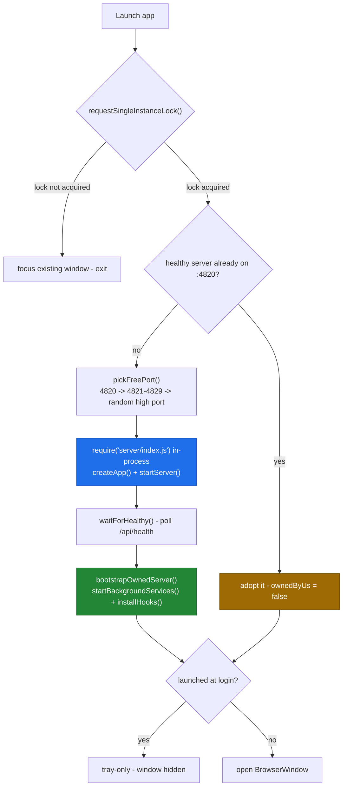

1. Tiến trình chính Electron chọn một cổng trống — ưu tiên **4820**, lùi về 4821–4829, rồi một cổng cao ngẫu nhiên nếu tất cả đều bị chiếm.
2. Nếu đã có thứ gì đó trả lời `/api/health` trên cổng 4820 (ví dụ bạn đã chạy `npm start` trong terminal), ứng dụng sẽ **tiếp quản máy chủ đó** và bỏ qua việc khởi động máy chủ thứ hai — không bind trùng, không tranh chấp SQLite.
3. Ngược lại, nó `require()` trực tiếp `server/index.js` trong cùng tiến trình — cùng runtime Node với tiến trình chính.
4. Lần khởi động đầu tiên với máy chủ **do ứng dụng sở hữu**, nó tự cài hook Claude Code (`installHooks()`) và chạy các dịch vụ nền qua `startBackgroundServices()` (bộ lập lịch cập nhật, `cc-watcher`, đối soát các phiên mồ côi). Việc này được bảo vệ bằng cờ để một lần *Restart Server* không đăng ký trùng các dịch vụ nền.
   - **(macOS)** ứng dụng còn khôi phục `PATH` của login-shell để tính năng "Run Claude" tìm và khởi chạy được `claude` CLI — một ứng dụng khởi chạy từ Finder/Dock vốn chỉ thừa hưởng `PATH` tối thiểu của launchd, sẽ bỏ sót các CLI trong `~/.local/bin`, `/opt/homebrew/bin`, thư mục của trình quản lý phiên bản, v.v. (Trên Windows tiến trình đã thừa hưởng `PATH` của người dùng.)
5. Cửa sổ bảng điều khiển mở ra — trừ khi ứng dụng được khởi chạy lúc đăng nhập (trên macOS qua Login Items; trên Windows qua mục `HKCU\…\Run` có gắn thẻ), khi đó nó ở chế độ chỉ-tray.

### Biểu tượng tray, trình đơn và tự khởi động

- **Biểu tượng tray** — bề mặt trạng thái luôn-bật (menu-bar trên macOS / khu vực thông báo trên Windows). Trình đơn ngữ cảnh gồm: *Open Dashboard, Open in Browser, Restart Server, Show Logs, Open at Login (chuyển đổi), Quit*. Trình đơn được dựng lại mỗi lần mở nên nhãn cổng và ô đánh dấu *Open at Login* luôn cập nhật. macOS dùng glyph template được tô màu; Windows dùng `icon.ico` màu (một template đen sẽ biến mất trên thanh tác vụ tối). (Mục **File ▸ Open Dashboard** (`⌘1`) trong **trình đơn ứng dụng** gốc **chỉ có trên macOS**: macOS vẫn giữ thanh menu toàn cục sau khi cửa sổ ẩn đi nên mục đó có thể mở lại cửa sổ — còn trên Windows/Linux trình đơn gắn liền với cửa sổ và phím tắt menu không thể kích hoạt khi cửa sổ đang ẩn, nên hãy mở lại từ *Open Dashboard* của tray, vốn luôn **đưa cửa sổ lên trước** một cách đáng tin cậy kể cả khi cửa sổ đã thu nhỏ hay bị các cửa sổ khác che khuất.)
- **Biểu tượng cửa sổ và thanh tác vụ** — `BrowserWindow` được gắn với logo ứng dụng màu (`icon.ico` trên Windows, `icon.png` ở nơi khác), nên thanh tiêu đề / thanh tác vụ hiển thị đúng biểu tượng Claude Code Monitor — kể cả khi chạy `npm run desktop:dev` chưa đóng gói cũng không còn hiện biểu tượng Electron chung chung nữa.
- **Đóng cửa sổ thì ẩn đi** — máy chủ vẫn chạy, biểu tượng tray vẫn còn. Nhấp tray để đưa cửa sổ trở lại.
- **Thoát (⌘Q / Ctrl+Q, hoặc tray → Quit)** — tắt máy chủ nhúng một cách gọn gàng, đóng SQLite sạch sẽ (checkpoint WAL) rồi thoát.
- **Khóa một-phiên-bản** — khởi chạy lần hai chỉ đưa cửa sổ hiện có lên trước, không có máy chủ thứ hai, không xung đột cổng. (Áp dụng trên mọi nền tảng.)
- **Tự khởi động lúc đăng nhập** — bật/tắt *Open at Login* trong trình đơn tray. Trên macOS nó đăng ký qua API `SMAppService`, nên mục này xuất hiện trong **System Settings → General → Login Items**; trên Windows nó ghi một mục `HKCU\Software\Microsoft\Windows\CurrentVersion\Run` theo từng người dùng, thấy được trong **Task Manager → Startup**. Khi ứng dụng được khởi chạy lúc đăng nhập, nó bắt đầu ở chế độ **chỉ-tray** — không có cửa sổ nhảy ra trước mặt.
- **Nhật ký** nằm tại `~/Library/Logs/Claude Code Monitor/desktop.log` (macOS) hoặc `%APPDATA%\Claude Code Monitor\logs\desktop.log` (Windows) (dùng *Show Logs* trong trình đơn để mở).
- **Dữ liệu của bạn** (cơ sở dữ liệu SQLite và khóa VAPID) nằm trong thư mục dữ liệu ứng dụng theo từng người dùng, **bên ngoài** gói ứng dụng / thư mục cài — `~/Library/Application Support/Claude Code Monitor/data/` trên macOS, `%APPDATA%\Claude Code Monitor\data\` trên Windows — nên dữ liệu **sống sót qua các lần cài lại và cập nhật ứng dụng**. Một gói đã đóng gói là chỉ-đọc, nên ghi cơ sở dữ liệu bên trong sẽ phá vỡ History Import và việc lưu sự kiện; lưu trong thư mục dữ liệu ứng dụng khắc phục điều này và nghĩa là lịch sử đã nhập của bạn không bị ảnh hưởng khi thay thế hoặc nâng cấp ứng dụng. (Trình gỡ cài NSIS của Windows mặc định giữ lại dữ liệu này.)
- **CLI `claude`** — trên macOS, ứng dụng khôi phục `PATH` của login-shell lúc khởi động, nên tính năng "Run Claude" hoạt động dù một ứng dụng macOS khởi chạy từ Finder/Dock vốn chỉ thừa hưởng `PATH` tối thiểu của launchd. (Trên Windows, `PATH` người dùng được thừa hưởng đã bao gồm nó.)

### Module gốc `better-sqlite3`

`better-sqlite3` là module **gốc** duy nhất trong cây phụ thuộc, và một module gốc phải được biên dịch theo đúng ABI Node mà nó chạy trên đó. Workspace `desktop/` đi kèm một bản sao `better-sqlite3` cục bộ được dựng lại cho ABI của Electron (qua `electron-builder install-app-deps` trong `postinstall`), không động đến bản cài ở thư mục gốc dùng cho `npm run test:server`. Nếu việc dựng lại thất bại, máy chủ vẫn quay về dùng `node:sqlite` tích hợp sẵn nên ứng dụng vẫn khởi động được.

**Tiền kiểm (preflight) phụ thuộc gốc.** `npm run desktop:install` chạy `scripts/install.js`, kiểm tra trước nhị phân gốc `better-sqlite3` cho ABI của Electron. Trên Windows trường hợp thông thường tải về nhị phân Electron **dựng sẵn**, nên không cần bộ công cụ Visual Studio C++. Nếu việc dựng thất bại (không có nhị phân dựng sẵn, hoặc thiếu bộ công cụ C++), nó **báo lỗi rõ ràng và thoát với mã khác 0** thay vì để lại một bản cài hỏng, đồng thời in ra phần khắc phục cụ thể theo từng hệ điều hành:

- **Windows** — cài "Visual Studio Build Tools" kèm workload "Desktop development with C++".
- **macOS** — `xcode-select --install`.
- **Linux** — cài `build-essential` + `python3`.
- Hoặc dùng một Node LTS (20 hoặc 22) vốn đi kèm nhị phân dựng sẵn để bỏ qua hẳn bước biên dịch.

Hoặc, **không cần bộ công cụ C++ nào**, lấy thẳng nhị phân dựng sẵn của Electron:

```bash
cd desktop
npm install --ignore-scripts
node node_modules/electron/install.js
npx electron-builder install-app-deps
```

Bước prebuild (`scripts/prebuild.js`) chắn (gate) mọi script `desktop:*` build/dev: nó **báo lỗi sớm (fail fast) kèm hướng dẫn thiết lập** khi thiếu hẳn nhị phân gốc `better-sqlite3`, biến một sự cố lúc chạy thành một lỗi lúc build có thể sao-chép-dán được.

> [!MẸO]
> **Dành cho người đóng góp:** dựng một DMG sẽ dựng lại `better-sqlite3` cho kiến trúc đích, nên một bản dựng DMG trước đó có thể để lại `better-sqlite3` được dựng cho CPU khác (khiến `desktop:dev` / `desktop:test` lỗi `ERR_DLOPEN_FAILED`). Bước prebuild của ứng dụng máy tính để bàn (`scripts/prebuild.js`) tự chữa lại cho máy cục bộ ở lần build kế tiếp; nếu cần, hãy chạy `npm run desktop:install`.

### Lệnh xây dựng

Tất cả lệnh chạy được từ **thư mục gốc kho mã**. Mọi lệnh đóng gói đều chạy `npm run build` trước, nên bạn không bao giờ cần gọi `electron-builder` trực tiếp.

| Lệnh | Tác dụng |
|---|---|
| `npm run desktop:install` | Cài Electron, electron-builder, types; dựng lại `better-sqlite3` cho ABI của Electron; tiền kiểm bản dựng gốc `better-sqlite3` và in hướng dẫn thiết lập cụ thể (kèm phương án không cần bộ công cụ C++) khi thất bại. |
| `npm run desktop:build` | Prebuild guard + `tsc` → `desktop/out/`. |
| `npm run desktop:dev` | Build, rồi khởi chạy Electron. |
| `npm run desktop:test` | Build, rồi chạy kiểm thử smoke (spawn Electron + thăm dò `/api/health`). |
| `npm run desktop:dmg` | **macOS:** DMG **universal** (x64 + arm64). Đúng cho bản phát hành. **Chậm.** |
| `npm run desktop:dmg:arm64` | **macOS:** DMG chỉ cho Apple Silicon. **Nhanh (~1 phút).** |
| `npm run desktop:dmg:x64` | **macOS:** DMG chỉ cho Intel. **Nhanh (~1 phút).** |
| `npm run desktop:win` | **Windows:** trình cài NSIS `.exe` (x64). |
| `npm run desktop:win:portable` | **Windows:** bản portable không cần cài `.exe` (x64). |

### Hiệu năng xây dựng — hãy đọc mục này

Bản dựng DMG **universal** cố tình chậm — đó là chi phí đóng gói Electron tiêu chuẩn, nhân lên bởi bước hợp nhất universal:

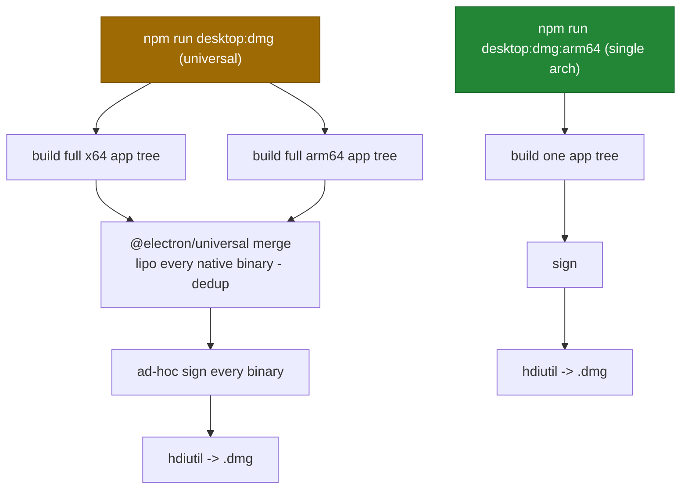

- Xây dựng cho **chính máy Mac của bạn** → dùng `desktop:dmg:arm64` (Apple Silicon) hoặc `desktop:dmg:x64` (Intel). Một kiến trúc, không hợp nhất, hoàn tất trong khoảng một phút.
- Xây dựng **artifact phát hành cho mọi người** → dùng `desktop:dmg` universal và chờ lâu hơn. CI đã dựng DMG universal và tải lên dưới dạng artifact `ClaudeCodeMonitor-dmg` nên bạn hiếm khi cần tự dựng.

### Ký mã và công chứng

DMG macOS được **ký ad-hoc theo mặc định** (`CSC_IDENTITY_AUTO_DISCOVERY=false`) để ai cũng dựng được một `.dmg` hoạt động mà không cần tài khoản Apple Developer trả phí.

- **Ký Developer ID thực sự** được kích hoạt khi cung cấp `CSC_LINK` (tệp `.p12` mã hóa base64) và `CSC_KEY_PASSWORD`.
- **Công chứng (notarization)** là tùy chọn bật thêm: nó chạy khi cả `APPLE_ID`, `APPLE_TEAM_ID` và `APPLE_APP_SPECIFIC_PASSWORD` đều được đặt; ngược lại nó là no-op.
- Bản dựng **Windows** **không ký theo mặc định** (SmartScreen có thể hỏi trong lần chạy đầu — *More info → Run anyway*); **ký Authenticode** chỉ kích hoạt khi cung cấp chứng chỉ tường minh qua `CSC_LINK` + `CSC_KEY_PASSWORD`.

#### Gatekeeper / SmartScreen (lần chạy đầu tiên)

**macOS** — một DMG ký ad-hoc sẽ kích hoạt cảnh báo Gatekeeper trong lần mở đầu tiên (*"Apple could not verify…"*). Cách giải quyết một dòng:

```bash
xattr -cr "/Applications/Claude Code Monitor.app"
```

Hoặc mở  → *System Settings → Privacy & Security*, cuộn tới ứng dụng bị chặn và nhấp *Open Anyway*.

**Windows** — trình cài không ký theo mặc định, nên **SmartScreen** có thể hiện *"Windows protected your PC"* trong lần chạy đầu tiên — nhấp **More info → Run anyway**.

### Tích hợp liên tục (CI)

`.github/workflows/ci.yml` có hai job desktop được **lọc theo đường dẫn** (một job `changes` dùng `dorny/paths-filter` phát hiện thay đổi trong `desktop/**`; các job này cũng chạy trên mọi `push`, hoặc khi PR gắn nhãn `desktop`): job `🍎 macOS Desktop (DMG)` chạy trên `macos-latest` dựng DMG universal rồi tải lên dưới dạng artifact `ClaudeCodeMonitor-dmg` (hai DMG một-kiến-trúc); job `🪟 Windows Desktop (EXE)` chạy trên `windows-latest` dựng rồi tải lên dưới dạng artifact `ClaudeCodeMonitor-win` (trình cài NSIS + bản portable). Khi đẩy bản nâng phiên bản lên `master`, job `release` đính kèm **cả** DMG macOS lẫn `.exe` Windows vào bản GitHub Release `vX.Y.Z` đã phát hành. Biểu tượng Windows (`desktop/assets/icon.ico`) được commit vào kho mã (tạo lại từ `icon.png` bằng `npm run build:win-icon`, dùng PowerShell + .NET, không cần công cụ phụ).

### Thay đổi duy nhất ngoài `desktop/`

Thay đổi duy nhất ngoài workspace `desktop/` là một **tái cấu trúc giữ nguyên hành vi** của `server/index.js`: phần khởi động sau khi máy chủ lắng nghe (bộ lập lịch cập nhật, `cc-watcher`, đối soát phiên mồ côi) được tách ra thành một hàm xuất khẩu `startBackgroundServices()` để máy chủ nhúng chạy đúng những gì `node server/index.js` chạy. Đường dẫn máy chủ chạy độc lập về mặt chức năng không thay đổi. `client/`, `scripts/`, `mcp/` và `vscode-extension/` không bị động đến.

> [!MẸO]
> Tài liệu tham khảo đầy đủ: hướng dẫn cho người dùng nằm trong [`DESKTOP.md`](./DESKTOP.md), còn tài liệu kiến trúc dành cho người đóng góp nằm trong [`desktop/README.md`](./desktop/README.md).

---

## Tiện ích mở rộng VS Code

**Claude Code Agent Monitor** hiện đã có sẵn dưới dạng tiện ích mở rộng VS Code chính thức, cho phép bạn giám sát các tác nhân AI của mình mà không cần rời khỏi trình chỉnh sửa.

<p align="center">
  
</p>

### 🚀 Tính năng chính
- **Thanh bên trực tiếp**: Chế độ xem Activity Bar chuyên dụng hiển thị trạng thái Agent (Đang làm, Đang chờ, Hoàn tất, Lỗi) theo thời gian thực.
- **Phân tích sử dụng**: Theo dõi tổng số token, chi phí USD trực tiếp và số lượng sự kiện ngay trong thanh bên.
- **Tích hợp thanh trạng thái**: Theo dõi nhanh ở thanh dưới cùng hiển thị số lượng phiên và tác nhân đang hoạt động.
- **Điều hướng sâu**: Truy cập bằng một cú nhấp chuột vào các chế độ xem bảng điều khiển cụ thể (Kanban, Analytics, Settings) hoặc các phiên gần đây.
- **Tab tích hợp**: Mở bảng điều khiển giám sát đầy đủ dưới dạng một tab webview VS Code gốc.

### 📦 Cài đặt & Thiết lập
1. Mở thư mục [vscode-extension](./vscode-extension).
2. Cài đặt tiện ích từ Marketplace hoặc tự đóng gói bằng `vsce package`.
3. Đảm bảo máy chủ bảng điều khiển cục bộ của bạn đang chạy (`npm run dev`).
4. Nhấp vào **biểu tượng Radar** trong VS Code Activity Bar để bắt đầu.

Để biết cấu hình chi tiết cho nhà phát triển, hãy xem các thư mục [.vscode](./.vscode) và [vscode-extension](./vscode-extension).

> [!TIP]
> Extension on VS Code Marketplace: [Claude Code Agent Monitor](https://marketplace.visualstudio.com/items?itemName=hoangsonw.claude-code-agent-monitor)

---

## Lưu trữ dữ liệu

- **Công cụ:** SQLite 3 qua `better-sqlite3` (tùy chọn) hoặc tích hợp sẵn Node.js `node:sqlite`
- **Vị trí:** `data/dashboard.db`
- **Chế độ nhật ký:** WAL (đọc đồng thời trong khi ghi)
- **Đặt lại:** Xóa `data/dashboard.db` để xóa tất cả dữ liệu

### Sơ đồ mối quan hệ thực thể

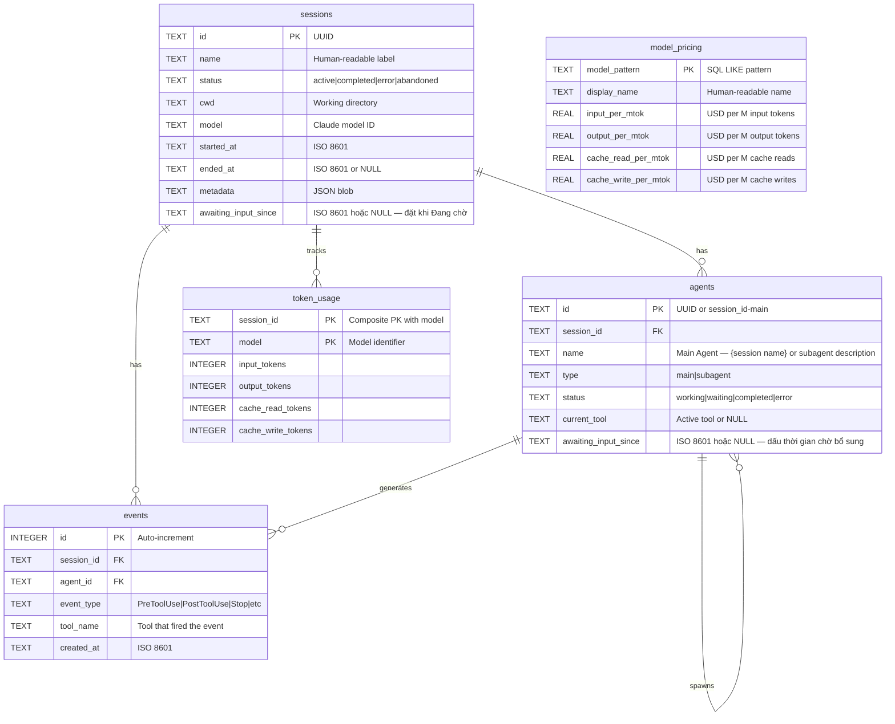

---

## Thị trường plugin

Mở rộng Claude Code bằng các plugin Giám sát tác nhân chính thức — phân tích, công cụ năng suất, tiện ích dành cho nhà phát triển, thông tin chi tiết được hỗ trợ bởi AI, kết nối bảng điều khiển, lan can chi phí, điều tra phiên, điều phối quy trình làm việc, độ tin cậy/SLO và quản trị cấu hình. 10 plugin, 53 kỹ năng, 14 tác nhân, 30 lệnh slash, 3 công cụ CLI, 3 cấu hình hook, 1 máy chủ MCP.

### Thêm thị trường

```bash
claude plugin marketplace add hoangsonww/Claude-Code-Agent-Monitor
```

### Các plugin có sẵn

| Trình cắm | Lệnh cài đặt | Kỹ năng |
|--------|----------------|--------|
| **phân tích ccam** | `claude plugin install ccam-analytics@hoangsonww-claude-code-agent-monitor` | `session-report`, `cost-breakdown`, `usage-trends`, `productivity-score` |
| **lan can chi phí ccam** | `claude plugin install ccam-cost-guard@hoangsonww-claude-code-agent-monitor` | `budget-set`, `spend-forecast`, `cost-alert`, `model-savings`, `daily-budget-check` |
| **năng suất ccam** | `claude plugin install ccam-productivity@hoangsonww-claude-code-agent-monitor` | `daily-standup`, `weekly-report`, `sprint-summary`, `workflow-optimizer` |
| **ccam-devtools** | `claude plugin install ccam-devtools@hoangsonww-claude-code-agent-monitor` | `session-debug`, `hook-diagnostics`, `data-export`, `health-check` |
| **thông tin chi tiết về ccam** | `claude plugin install ccam-insights@hoangsonww-claude-code-agent-monitor` | `pattern-detect`, `anomaly-alert`, `optimization-suggest`, `session-compare` |
| **phiên ccam** | `claude plugin install ccam-sessions@hoangsonww-claude-code-agent-monitor` | `session-search`, `session-timeline`, `transcript-replay`, `cwd-rollup`, `session-cleanup` |
| **quy trình làm việc ccam** | `claude plugin install ccam-workflows@hoangsonww-claude-code-agent-monitor` | `dag-map`, `delegation-audit`, `concurrency-report`, `error-propagation`, `fleet-runs` |
| **chất lượng ccam** | `claude plugin install ccam-quality@hoangsonww-claude-code-agent-monitor` | `error-scan`, `api-error-report`, `hook-failure-audit`, `slo-check`, `regression-alert` |
| **cấu hình ccam** | `claude plugin install ccam-config@hoangsonww-claude-code-agent-monitor` | `config-audit`, `memory-review`, `skill-inventory`, `mcp-audit`, `hook-inventory` |
| **bảng điều khiển ccam** | `claude plugin install ccam-dashboard@hoangsonww-claude-code-agent-monitor` | `dashboard-status`, `quick-stats` + máy chủ MCP |

### Bao gồm các công cụ CLI

- `ccam-stats` — Bảng điều khiển thiết bị đầu cuối (phiên, chi phí, mã thông báo có đường cơ sở nén)
- `ccam-doctor` — Chẩn đoán hệ thống (API, cơ sở dữ liệu, hook, làm mới dữ liệu)
- `ccam-export` — Xuất dữ liệu (JSON, CSV) cho phiên, sự kiện, phân tích, chi phí

### Cách sử dụng ví dụ

```bash
# In Claude Code, after installing a plugin:
/ccam-analytics:session-report latest
/ccam-analytics:cost-breakdown this week
/ccam-productivity:daily-standup today
/ccam-insights:pattern-detect tools
/ccam-dashboard:quick-stats
```

📖 Giấy tờ đầy đủ: [tài liệu/plugin.md](docs/PLUGINS.md)

---

## Dòng trạng thái

Tiện ích dòng trạng thái CLI độc lập dành cho Claude Code hiển thị tên mô hình, người dùng, thư mục làm việc, nhánh git, thanh sử dụng cửa sổ ngữ cảnh và số lượng mã thông báo -- tất cả đều được mã hóa màu bằng các chuỗi thoát ANSI.

```
Sonnet 4.6 | nguyens6 | ~/agent-dashboard/client | main | ████████░░ 79% | 3↑ 2↓ 156586c
```

| Phân đoạn     | Màu sắc                | Ví dụ             |
| ----------- | -------------------- | ------------------- |
| Người mẫu       | lục lam                 | `Sonnet 4.6`        |
| người dùng        | Màu xanh lá                | `nguyens6`          |
| CWD         | Màu vàng               | `~/agent-dashboard` |
| Nhánh Git  | Màu đỏ tươi              | `main`              |
| Thanh ngữ cảnh | Xanh / Vàng / Đỏ | `████████░░ 79%`    |
| Mã thông báo      | mờ                  | `3↑ 2↓ 156586c`     |

Xem [`statusline/README.md`](statusline/README.md) để biết hướng dẫn cài đặt.

<p align="center">
  
</p>

---

## Kiến trúc máy chủ

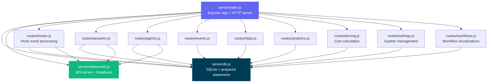

---

## Định tuyến khách hàng

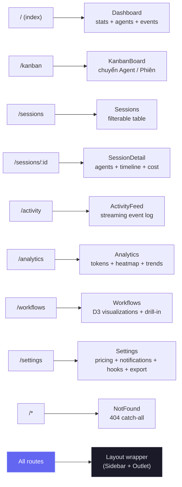

---

## Luồng xử lý móc

```mermaid
flowchart TD
    START["Claude Code fires hook"] --> STDIN["Read stdin to EOF"]
    STDIN --> PARSE{"Parse JSON?"}
    PARSE -->|Success| POST["POST to 127.0.0.1:4820<br/>/api/hooks/event"]
    PARSE -->|Failure| WRAP["Wrap raw input as JSON"]
    WRAP --> POST
    POST --> RESP{"Response?"}
    RESP -->|200 OK| EXIT0["exit(0)"]
    RESP -->|Error| EXIT0
    RESP -->|Timeout 3s| DESTROY["Destroy request"] --> EXIT0
    SAFETY["Safety net: setTimeout 5s"] --> EXIT0

    style EXIT0 fill:#10b981,stroke:#34d399,color:#fff
    style START fill:#6366f1,stroke:#818cf8,color:#fff
```

---

## Chế độ triển khai

Chúng tôi hỗ trợ cả hai chế độ triển khai phát triển và sản xuất với các kiến ​​trúc quy trình khác nhau:

```mermaid
graph LR
    subgraph dev["Development — 2 processes"]
        D_CMD["npm run dev"] --> D_SRV["Express :4820<br/>node --watch"]
        D_CMD --> D_VITE["Vite :5173<br/>HMR"]
        D_BROWSER["Browser"] --> D_VITE
        D_VITE -->|"proxy /api + /ws"| D_SRV
    end

    subgraph prod["Production — 1 process"]
        P_BUILD["npm run build"] --> P_DIST["client/dist/"]
        P_START["npm start"] --> P_SRV["Express :4820<br/>serves static + API"]
        P_BROWSER["Browser"] --> P_SRV
    end

    style D_VITE fill:#646CFF,stroke:#818cf8,color:#fff
    style D_SRV fill:#339933,stroke:#5cb85c,color:#fff
    style P_SRV fill:#339933,stroke:#5cb85c,color:#fff
    style P_DIST fill:#646CFF,stroke:#818cf8,color:#fff
```

Ngoài hai chế độ trên, ứng dụng máy tính để bàn (macOS & Windows) cung cấp một cách chạy thứ ba — máy chủ Express được nhúng ngay trong tiến trình chính Electron, không cần terminal:

```mermaid
flowchart LR
    subgraph desktopmode["Desktop App (macOS & Windows) — 1 process (Electron Main)"]
        MAIN["Electron Main<br/>Node 22 / Electron 35"]
        EMB["server/index.js<br/>embedded via require()"]
        WIN["BrowserWindow<br/>React dashboard"]
        TRAY["tray icon<br/>menu bar / notification area"]
        MAIN --> EMB
        MAIN --> TRAY
        EMB -->|"http + ws on 127.0.0.1:port"| WIN
    end

    style MAIN fill:#1f6feb,stroke:#1158c7,color:#fff
    style EMB fill:#339933,stroke:#5cb85c,color:#fff
```

Sidecar MCP cục bộ tùy chọn (hỗ trợ truyền tải stdio, HTTP+SSE và REPL):

```mermaid
graph LR
    subgraph "MCP Transport Options"
        M_STDIO["MCP Server (stdio)<br/>npm run mcp:start"]
        M_HTTP["MCP Server (HTTP)<br/>npm run mcp:start:http<br/>:8819"]
        M_REPL["MCP Server (REPL)<br/>npm run mcp:start:repl"]
    end

    H["MCP Host"] -->|"stdin/stdout"| M_STDIO
    RC["Remote Client"] -->|"POST /mcp · GET /sse"| M_HTTP
    OP["Operator"] -->|"interactive CLI"| M_REPL

    M_STDIO --> D["Dashboard Server<br/>:4820"]
    M_HTTP --> D
    M_REPL --> D

    style M_STDIO fill:#0f766e,stroke:#14b8a6,color:#fff
    style M_HTTP fill:#0f766e,stroke:#14b8a6,color:#fff
    style M_REPL fill:#0f766e,stroke:#14b8a6,color:#fff
```

### Triển khai đám mây

Thư mục `deployments/` cung cấp cơ sở hạ tầng cấp doanh nghiệp, không phụ thuộc vào đám mây để triển khai bảng thông tin vào sản xuất. Hỗ trợ Helm, Kustomize và Terraform trên AWS, GCP, Azure và OCI với các chiến lược phát hành xanh lam, xanh hoàng yến và luân phiên.

```mermaid
graph TB
  subgraph "Deployment Methods"
    HELM["⎈ Helm Chart<br/>Parameterized installs"]
    KUST["📦 Kustomize<br/>Overlay-based patching"]
    TF["🏗️ Terraform<br/>Full cloud provisioning"]
  end

  subgraph "Cloud Providers"
    AWS["☁️ AWS<br/>ECS Fargate + ALB"]
    GCP["☁️ GCP<br/>Cloud Run + GCLB"]
    AZ["☁️ Azure<br/>ACI + App Gateway"]
    OCI["☁️ OCI<br/>OKE + LBaaS"]
  end

  subgraph "Release Strategies"
    ROLL["Rolling Update"]
    BG["Blue-Green"]
    CAN["Canary + Analysis"]
  end

  subgraph "Observability"
    PROM["📊 Prometheus + Grafana"]
    CX["📡 Coralogix<br/>Logs · Metrics · Traces · SLOs"]
  end

  HELM & KUST --> ROLL & BG & CAN
  TF --> AWS & GCP & AZ & OCI
  ROLL & BG & CAN --> PROM & CX

  style HELM fill:#0f1689,color:#fff
  style KUST fill:#326ce5,color:#fff
  style TF fill:#7b42bc,color:#fff
  style AWS fill:#ff9900,color:#fff
  style GCP fill:#4285f4,color:#fff
  style AZ fill:#0078d4,color:#fff
  style OCI fill:#f80000,color:#fff
  style PROM fill:#e6522c,color:#fff
  style CX fill:#1a1a2e,color:#fff
```

```bash
# Helm (recommended for Kubernetes)
helm install agent-monitor deployments/helm/agent-monitor \
  -f deployments/helm/agent-monitor/values-production.yaml \
  -n agent-monitor --create-namespace

# Kustomize
kubectl apply -k deployments/kubernetes/overlays/production

# Terraform (full infra + app)
cd deployments/terraform/providers/aws
terraform init && terraform apply -var-file=../../environments/production/terraform.tfvars

# Script orchestrator
./deployments/scripts/deploy.sh --env production --method helm --strategy blue-green
```

Ngăn triển khai bao gồm các quy trình CI/CD (GitHub Actions + GitLab CI), giám sát toàn diện (Prometheus, Grafana, Alertmanager với 13 quy tắc cảnh báo, khả năng quan sát toàn bộ ngăn xếp Coralogix với OpenTelemetry Collector để ghi nhật ký, số liệu, dấu vết và theo dõi SLO), tập lệnh vận hành (triển khai, khôi phục, chuyển đổi xanh lam, sao lưu/khôi phục, phá bỏ) và chế độ bảo mật đầy đủ (Tiêu chuẩn bảo mật Pod bị hạn chế, TLS 1.3, mạng chính sách, quét Trivy).

> [!GHI CHÚ]
> 📘 **Hướng dẫn triển khai đầy đủ:** Xem [TRIỂN KHAI.md](DEPLOYMENT.md) để biết hướng dẫn từng bước, sơ đồ kiến ​​trúc và quy trình vận hành.

---

## Cấu trúc dự án

```
agent-dashboard/
|-- CLAUDE.md                   # Claude Code project memory and working agreements
|-- AGENTS.md                   # Codex project instructions
|-- package.json                # Root scripts (dashboard + MCP helpers) + server dependencies
|-- .claude/
|   +-- rules/                  # Path-scoped Claude rules
|   +-- skills/                 # Claude reusable project skills
|   +-- agents/                 # Claude custom subagents
|-- .claude-plugin/
|   +-- marketplace.json        # Plugin marketplace manifest (10 plugins)
|-- plugins/
|   |-- ccam-analytics/         # Analytics: session reports, cost breakdown, usage trends, productivity score
|   |   |-- .claude-plugin/plugin.json
|   |   |-- skills/ (4)         # session-report, cost-breakdown, usage-trends, productivity-score
|   |   |-- agents/             # analytics-advisor (Sonnet model)
|   |   |-- hooks/hooks.json    # Stop + SubagentStop event logging
|   |   +-- bin/ccam-stats      # Terminal dashboard CLI
|   |-- ccam-productivity/      # Productivity: standups, reports, sprints, workflow optimizer
|   |-- ccam-devtools/          # DevTools: debug, diagnostics, export, health checks
|   |   +-- bin/                # ccam-doctor + ccam-export CLIs
|   |-- ccam-insights/          # Insights: patterns, anomalies, optimization, comparison
|   +-- ccam-dashboard/         # Dashboard connector: status, quick stats, MCP integration
|       +-- .mcp.json           # MCP server configuration
|-- server/
|   |-- index.js                 # Express app, HTTP server, static serving
|   |-- db.js                    # SQLite schema, migrations, prepared statements
|   |-- websocket.js             # WebSocket server with heartbeat
|   +-- routes/
|       |-- hooks.js             # Hook event processing (transactional)
|       |-- sessions.js          # Session CRUD
|       |-- agents.js            # Agent CRUD
|       |-- events.js            # Event listing
|       |-- stats.js             # Aggregate statistics
|       |-- analytics.js         # Token, tool, and trend analytics
|       |-- workflows.js         # Aggregate workflow data and per-session drill-in
|       |-- pricing.js           # Model pricing CRUD and cost calculation
|       +-- settings.js          # System info, data management, export, cleanup
|   +-- lib/
|       +-- transcript-cache.js  # Bộ nhớ đệm JSONL transcript dựa trên stat, đọc tăng dần. Dùng trình đọc byte-stream đồng bộ theo từng khối 4 MiB và phân tích theo dòng, không bao giờ nạp toàn bộ tệp thành chuỗi JS, nên các JSONL lớn hơn giới hạn chuỗi tối đa của V8 (~512 MiB trên Node 20 64-bit) vẫn được phân tích mà không khiến Node thoát với "FATAL ERROR: v8::ToLocalChecked Empty MaybeLocal". Trích xuất token, compaction, lỗi API, thời lượng vòng, khối thinking và usage extras (service_tier, speed, inference_geo)
|   +-- compat-sqlite.js         # node:sqlite compatibility wrapper (fallback for better-sqlite3)
|-- client/
|   |-- package.json             # Client dependencies
|   |-- index.html               # HTML entry point
|   |-- vite.config.ts           # Vite + proxy config
|   |-- tailwind.config.js       # Custom dark theme
|   |-- tsconfig.json            # Strict TypeScript
|   +-- src/
|       |-- main.tsx             # React entry
|       |-- App.tsx              # Router + WebSocket provider
|       |-- index.css            # Tailwind + custom utilities
|       |-- lib/
|       |   |-- types.ts         # Shared TypeScript interfaces
|       |   |-- api.ts           # Typed fetch client
|       |   |-- format.ts        # Date/time formatting utilities
|       |   +-- eventBus.ts      # Pub/sub for WebSocket distribution
|       |-- hooks/
|       |   |-- useWebSocket.ts      # Auto-reconnecting WebSocket hook
|       |   +-- useNotifications.ts  # Browser notification triggers from WebSocket events
|       |-- components/
|       |   |-- Layout.tsx       # Shell with sidebar + outlet
|       |   |-- Sidebar.tsx      # Navigation + connection indicator
|       |   |-- AgentCard.tsx    # Agent info card with status
|       |   |-- StatCard.tsx     # Metric card
|       |   |-- StatusBadge.tsx  # Color-coded status pills
|       |   |-- EmptyState.tsx   # Placeholder for empty lists
|       |   +-- workflows/       # D3.js workflow visualization components
|       |       |-- OrchestrationDAG.tsx            # Horizontal DAG of agent spawning patterns
|       |       |-- ToolExecutionFlow.tsx           # d3-sankey diagram of tool-to-tool transitions
|       |       |-- AgentCollaborationNetwork.tsx   # Force-directed agent pipeline graph
|       |       |-- SubagentEffectiveness.tsx       # Scorecard grid with SVG success rings
|       |       |-- WorkflowPatterns.tsx            # Auto-detected orchestration sequences
|       |       |-- ModelDelegationFlow.tsx         # Model routing through agent hierarchies
|       |       |-- ErrorPropagationMap.tsx         # Error clustering by hierarchy depth
|       |       |-- ConcurrencyTimeline.tsx         # Swim-lane parallel agent execution
|       |       |-- SessionComplexityScatter.tsx    # D3 bubble chart (duration vs agents vs tokens)
|       |       |-- CompactionImpact.tsx            # Token compression events and recovery
|       |       |-- WorkflowStats.tsx               # Aggregate workflow statistics
|       |       +-- SessionDrillIn.tsx              # Per-session agent tree, tool timeline, events
|       +-- pages/
|           |-- Dashboard.tsx      # Overview page
|           |-- KanbanBoard.tsx    # Cột trạng thái Agent / Phiên với nút chuyển
|           |-- Sessions.tsx       # Sessions table
|           |-- SessionDetail.tsx  # Single session deep dive
|           |-- ActivityFeed.tsx   # Real-time event stream
|           |-- Analytics.tsx      # Token usage, heatmap, trends
|           |-- Workflows.tsx      # D3.js workflow visualizations and session drill-in
|           |-- Settings.tsx       # Model pricing, notifications, hooks, export, cleanup
|           +-- NotFound.tsx       # 404 catch-all page
|-- scripts/
|   |-- hook-handler.js          # Lightweight stdin-to-HTTP forwarder
|   |-- install-hooks.js         # Auto-configures ~/.claude/settings.json
|   |-- import-history.js        # Nhập phiên từ ~/.claude/ với trích xuất JSONL nâng cao (lỗi API, thời lượng vòng, entrypoint, permission mode, khối thinking, usage extras, tool error, JSONL của subagent). Re-import hoàn toàn tăng dần: tính sẵn high-water mark theo loại sự kiện (`MAX(created_at) GROUP BY event_type` cho mỗi phiên) và chỉ chèn các mục JSONL có `ts > cutoff[type]`, nhờ đó các phiên dài ngày mà transcript liên tục được nối thêm trong nhiều ngày vẫn nhận đầy đủ các sự kiện Stop / PostToolUse / TurnDuration / ToolError ở mỗi lần chạy lại. Đồng thời tiến `sessions.ended_at` về phía trước khi JSONL đã vượt qua giá trị đã lưu và làm mới message-count trong metadata ở mỗi lượt
|   +-- seed.js                  # Sample data generator
|-- mcp/
|   |-- package.json             # MCP package scripts + dependencies
|   |-- README.md                # MCP setup, host config, tool catalog, safety model
|   |-- src/
|   |   |-- index.ts             # MCP runtime entrypoint (transport router)
|   |   |-- server.ts            # MCP server assembly
|   |   |-- clients/             # Dashboard API client with retry/backoff
|   |   |-- config/              # Environment/CLI config parsing
|   |   |-- core/                # Logger, tool registry, result helpers
|   |   |-- policy/              # Mutation/destructive guards
|   |   |-- tools/               # Domain-specific tool modules (6 domains)
|   |   |-- transports/          # HTTP+SSE server, REPL, tool collector
|   |   |-- ui/                  # ANSI banner, colors, formatter, tables
|   |   +-- types/               # Shared MCP type definitions
|   +-- build/                   # Built MCP runtime output
|-- desktop/
|   |-- package.json             # Electron + electron-builder
|   |-- electron-builder.yml     # DMG config; signing/notarization hooks
|   |-- README.md                # Contributor / architecture reference
|   |-- assets/                  # icon.icns + tray PNGs (generated from SVG)
|   |-- src/
|   |   |-- main.ts              # Main process entry — lifecycle
|   |   |-- server-host.ts       # In-process Express boot, port discovery, adoption
|   |   |-- window.ts            # BrowserWindow + persisted geometry
|   |   |-- tray.ts              # Menu-bar icon + context menu
|   |   |-- menu.ts              # Native application menu (File ▸ Open Dashboard is macOS-only)
|   |   |-- login-item.ts        # macOS Login Items (SMAppService) toggle
|   |   |-- logger.ts            # File logger → ~/Library/Logs/.../desktop.log
|   |   +-- constants.ts         # App name, ports, timeouts, window size
|   |-- scripts/                 # prebuild, build-icons, notarize hooks
|   +-- tests/smoke.test.mjs     # Spawn Electron + probe /api/health
|-- deployments/
|   |-- README.md                # Deployment infrastructure reference
|   |-- terraform/               # Cloud provisioning (AWS, GCP, Azure, OCI)
|   |   |-- modules/             # Reusable modules (networking, compute, db, lb, monitoring)
|   |   |-- providers/           # Cloud-specific implementations
|   |   +-- environments/        # Per-env tfvars (dev, staging, production)
|   |-- kubernetes/              # Kustomize manifests
|   |   |-- base/                # 11 base resources (deployment, service, ingress, hpa, etc.)
|   |   |-- overlays/            # Environment overlays (dev, staging, production)
|   |   |-- components/          # Optional add-ons (mcp-sidecar, monitoring)
|   |   +-- strategies/          # Blue-green and canary deployment strategies
|   |-- helm/agent-monitor/      # Helm chart with 12 templates and 4 value sets
|   |-- scripts/                 # Operational scripts (deploy, rollback, backup, teardown)
|   |-- monitoring/              # Prometheus, Grafana, Alertmanager, Coralogix (OTel Collector)
|   +-- ci/                      # CI/CD pipelines (GitHub Actions, GitLab CI)
|-- .codex/
|   |-- config.toml              # Codex runtime configuration
|   |-- README.md                # Codex setup guide for agents and skills
|   |-- rules/                   # Codex execution policy rules
|   |-- agents/                  # Codex custom agent templates
|   +-- skills/                  # Codex project skills
|-- statusline/
|   |-- README.md                # Statusline installation & usage guide
|   |-- statusline.py            # Python script that renders the statusline
|   +-- statusline-command.sh    # Shell wrapper for Claude Code's statusLine config
+-- data/
    +-- dashboard.db             # SQLite database (gitignored)
```

---

## Khắc phục sự cố

| Vấn đề                           | Giải pháp                                                                                                                                                         |
| --------------------------------- | ---------------------------------------------------------------------------------------------------------------------------------------------------------------- |
| `better-sqlite3` không cài đặt được | Điều này không gây tử vong - máy chủ sẽ tự động quay trở lại trạng thái `node:sqlite` tích hợp của Node.js (Node 22+). Trên các phiên bản Node cũ hơn, hãy cài đặt công cụ xây dựng Python 3 và C++, sau đó chạy `npm rebuild better-sqlite3` |
| Móc không bắn                  | Chạy `npm run install-hooks` và khởi động lại Claude Code. Xác minh hook tồn tại trong `~/.claude/settings.json`                                                             |
| Bảng điều khiển không hiển thị dữ liệu           | Đảm bảo máy chủ đang chạy (`npm run dev`) trước khi bắt đầu phiên Claude Code. Kiểm tra `http://localhost:4820/api/health`                                     |
| WebSocket bị ngắt kết nối            | Máy khách tự động kết nối lại sau mỗi 2 giây. Kiểm tra xem cổng 4820 có bị tường lửa chặn không                                                                    |
| Dữ liệu cũ sau khi khởi động lại          | Cơ sở dữ liệu vẫn tồn tại trong suốt quá trình khởi động lại. Chạy `npm run seed` để có dữ liệu demo mới hoặc xóa `data/dashboard.db` để đặt lại                                            |
| Công cụ MCP không kết nối được         | Xác nhận API bảng điều khiển đã hoạt động trên `MCP_DASHBOARD_BASE_URL` và xây dựng lại/khởi động MCP (`npm run mcp:build`, `npm run mcp:start`)                                         |
| Lần chạy đầu macOS hiện "Apple could not verify…" | DMG được ký ad-hoc theo mặc định. Chạy `xattr -cr "/Applications/Claude Code Monitor.app"`, hoặc nhấp *Open Anyway* trong *System Settings → Privacy & Security* |
| Lần chạy đầu Windows hiện "Windows protected your PC" (SmartScreen) | Trình cài không ký theo mặc định. Nhấp **More info → Run anyway** để khởi chạy |
| "Run Claude" báo `claude` không có trong PATH | (macOS) Một ứng dụng macOS khởi chạy từ Finder/Dock chỉ thừa hưởng `PATH` tối thiểu của launchd. Lỗi này đã được sửa — ứng dụng khôi phục `PATH` của login-shell lúc khởi động. Nếu vẫn còn, hãy chắc chắn `claude` là một tệp thực thi thật (không phải alias/hàm shell) và nằm trên `PATH` của shell. Trên Windows, `PATH` người dùng được thừa hưởng đã bao gồm nó |
| Lịch sử đã nhập biến mất sau khi cài lại/cập nhật ứng dụng máy tính để bàn | Các bản dựng cũ lưu cơ sở dữ liệu bên trong gói ứng dụng có thể bị thay thế. Lỗi này đã được sửa — dữ liệu nay nằm tại `~/Library/Application Support/Claude Code Monitor/data/` (macOS) hoặc `%APPDATA%\Claude Code Monitor\data\` (Windows), bên ngoài gói và sống sót qua các lần cài lại. Sau khi nâng cấp từ bản dựng trước khi sửa lỗi, hãy chạy lại **Import History → Rescan** một lần |

---

## Giấy phép

MIT. Xem [GIẤY PHÉP](LICENSE) để biết chi tiết.
