# Agent Dashboard for Claude Code

### Real-time monitoring platform for Claude Code agent activity 🚀

A professional dashboard to track and visualize your Claude Code agent sessions, tool usage, and subagent orchestration in real-time. Built with Node.js, Express, React, and SQLite, it integrates directly with Claude Code via its native hook system for seamless session tracking and analytics.


> [!TIP]
> See also: [README-CN.md](./README-CN.md) (中文版本) and [README-VI.md](./README-VI.md) (Phiên bản tiếng Việt) for localized documentation with region-specific tips and best practices.

---

## Table of Contents

- [Overview](#overview)
- [Internationalization (i18n)](#internationalization-i18n)
- [Features](#features)
- [Quick Start](#quick-start)
- [How It Works](#how-it-works)
- [Configuration](#configuration)
- [npm Scripts](#npm-scripts)
- [Plugin Marketplace](#plugin-marketplace)
- [Agent Extensions](#agent-extensions)
- [MCP Integration](#mcp-integration)
- [API Reference](#api-reference)
- [Hook Events](#hook-events)
- [Browser Notifications](#browser-notifications)
- [Update Notifier](#update-notifier)
- [Tabby — Floating Cat Companion](#tabby--floating-cat-companion)
- [Connection Status Modal](#connection-status-modal)
- [VS Code Extension](#vs-code-extension)
- [Desktop App (macOS & Windows)](#desktop-app-macos--windows)
- [Data Storage](#data-storage)
- [Statusline](#statusline)
- [Server Architecture](#server-architecture)
- [Client Routing](#client-routing)
- [Hook Handler Flow](#hook-handler-flow)
- [Deployment Modes](#deployment-modes)
- [Project Structure](#project-structure)
- [Troubleshooting](#troubleshooting)
- [Contributing](#contributing)
- [License](#license)

---

## Overview

Track sessions, monitor agents in real-time, visualize tool usage, and observe subagent orchestration through a professional dark-themed web interface. Integrates directly with Claude Code via its native hook system.

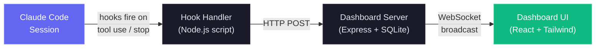
```mermaid
graph LR
    A["Claude Code<br/>Session"] -->|hooks fire on<br/>tool use / stop| B["Hook Handler<br/>(Node.js script)"]
    B -->|HTTP POST| C["Dashboard Server<br/>(Express + SQLite)"]
    C -->|WebSocket<br/>broadcast| D["Dashboard UI<br/>(React + Tailwind)"]
    style A fill:#6366f1,stroke:#818cf8,color:#fff
    style B fill:#1a1a28,stroke:#2a2a3d,color:#e4e4ed
    style C fill:#1a1a28,stroke:#2a2a3d,color:#e4e4ed
    style D fill:#10b981,stroke:#34d399,color:#fff
```

In addition to the real-time monitoring dashboard, it also includes a local MCP server implementation in `mcp/` that exposes a catalog of tools for introspecting and managing the dashboard itself, making it easy to integrate dashboard operations directly into your Claude Code workflows. There is also an agent extension layer, which provides Claude Code plugins, skills, and subagents for dashboard interaction, analytics, and workflow intelligence.

<a href="https://www.star-history.com/?repos=hoangsonww%2FClaude-Code-Agent-Monitor&type=date&legend=top-left">
 <picture>
   <source media="(prefers-color-scheme: dark)" srcset="https://api.star-history.com/chart?repos=hoangsonww/Claude-Code-Agent-Monitor&type=date&theme=dark&legend=top-left" />
   <source media="(prefers-color-scheme: light)" srcset="https://api.star-history.com/chart?repos=hoangsonww/Claude-Code-Agent-Monitor&type=date&legend=top-left" />
   
 </picture>
</a>

### Internationalization (i18n)

The UI ships with built-in locale switching for English (`en`), Chinese (`zh`), and Vietnamese (`vi`). Language resources are loaded by namespace and persisted through browser storage for stable user preference across refreshes.

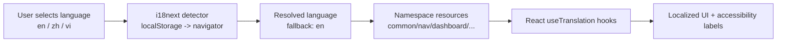
```mermaid
flowchart LR
    A["User selects language<br/>en / zh / vi"] --> B["i18next detector<br/>localStorage -> navigator"]
    B --> C["Resolved language<br/>fallback: en"]
    C --> D["Namespace resources<br/>common/nav/dashboard/..."]
    D --> E["React useTranslation hooks"]
    E --> F["Localized UI + accessibility labels"]
```

For full architecture and operational guidance, see [docs/I18N.md](./docs/I18N.md).

### User Interface

Comes with a sleek dark theme, responsive design, and intuitive navigation to explore your agent activity:

<p align="center">
  
  <br>
  <em>📡 <strong>Dashboard · Monitor</strong> — overview stats, active agent cards, and recent activity feed</em>
</p>

<p align="center">
  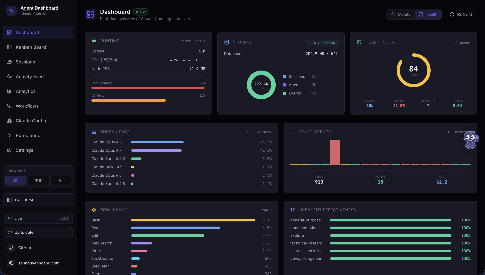
  <br>
  <em>🩺 <strong>Dashboard · Health</strong> — composite health score ring, storage engine donut chart, cache hit / error / success gauges, tool invocation bars, subagent effectiveness, model token distribution, and compaction stats — all auto-refreshing every 5 s</em>
</p>

<p align="center">
  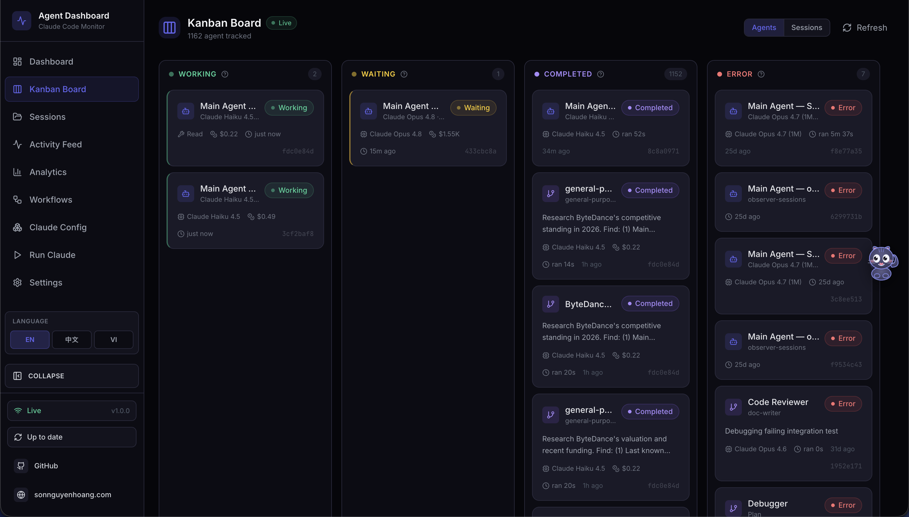
  <br>
  <em>📋 <strong>Kanban Board (agents)</strong> — agents grouped by status across 4 columns: Working / Waiting / Completed / Error. The yellow Waiting column surfaces sessions blocked on user input (permission prompts, end-of-turn, or sitting at a fresh prompt). Each card shows model, cost, and current tool at a glance.</em>
</p>

<p align="center">
  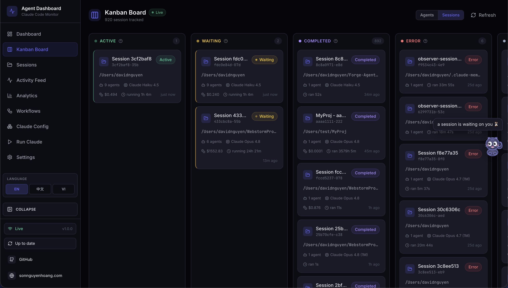
  <br>
  <em>🗂️ <strong>Kanban Board (sessions)</strong> — sessions grouped by status across 5 columns: Active / Waiting / Completed / Error / Abandoned, toggleable from the same page. Hover any column header for a tooltip explaining the lifecycle transition.</em>
</p>

<p align="center">
  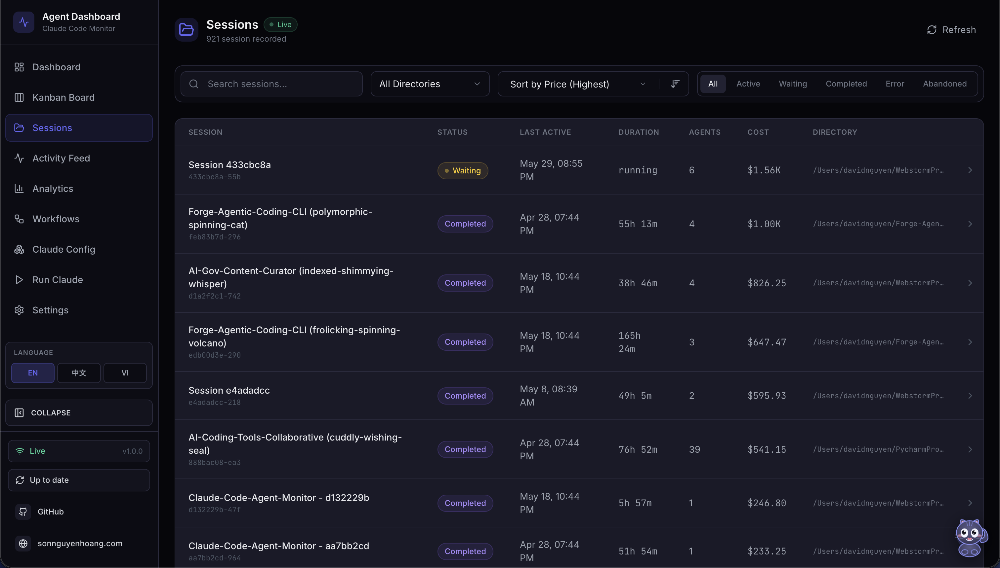
  <br>
  <em>📂 <strong>Sessions</strong> — searchable, filterable, server-paginated table of every recorded session with cost, model, agent count, and duration</em>
</p>

<p align="center">
  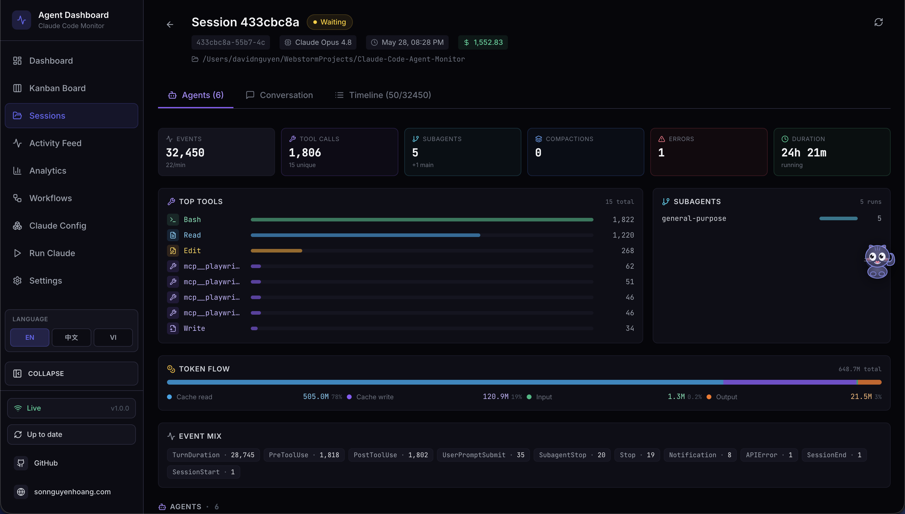
  <br>
  <em>🤖 <strong>Session Detail · Agents</strong> — real-time overview tiles (events, tool calls, subagents, compactions, errors, duration), top-tool usage bars, subagent type breakdown, token flow, and the agent hierarchy tree</em>
</p>

<p align="center">
  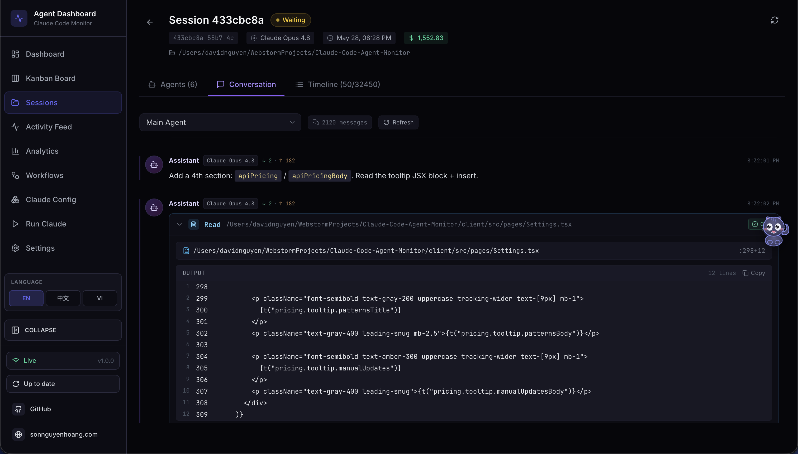
  <br>
  <em>💬 <strong>Session Detail · Conversation</strong> — live transcript viewer with markdown rendering, syntax-highlighted code blocks (line numbers + copy), per-tool styled tool calls, slash-command pills with their captured TUI output, and inline session-rename markers</em>
</p>

<p align="center">
  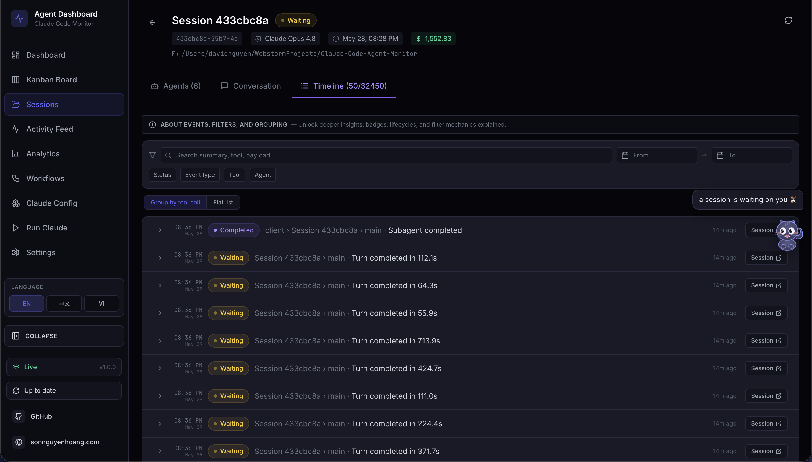
  <br>
  <em>🔬 <strong>Session Detail · Timeline</strong> — chronological event timeline with multi-dimension filters, Pre/Post grouping by `tool_use_id`, and tool-aware payload renderers</em>
</p>

<p align="center">
  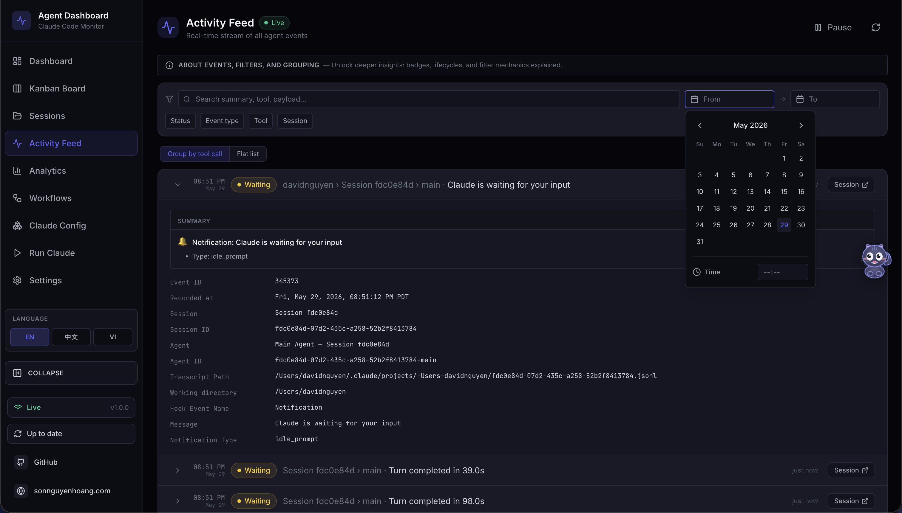
  <br>
  <em>📰 <strong>Activity Feed</strong> — real-time event log with pause / resume, grouping, multi-dimension filters, and a "Session →" jump button per row</em>
</p>

<p align="center">
  
  <br>
  <em>📊 <strong>Analytics</strong> — token usage by model, tool frequency, activity heatmap, and session trends with live / offline indicator</em>
</p>

<p align="center">
  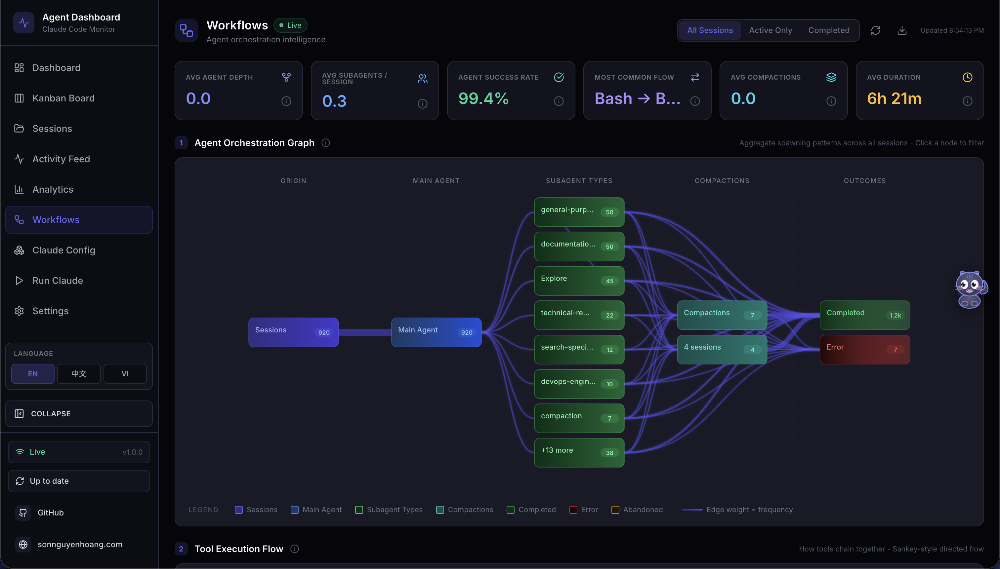
  <br>
  <em>🔀 <strong>Workflows</strong> — agent orchestration DAGs, tool execution Sankey diagrams, collaboration networks, and 11 interactive sections of workflow intelligence</em>
</p>

<p align="center">
  
  <br>
  <em>🧬 <strong>Workflow Runs (Workflows page)</strong> — "dynamic workflows" spawned by the <code>Workflow</code> tool, reconstructed from on-disk run journals: status, agent count, tokens, and tool calls, expandable into a per-agent breakdown (phase, state, tokens, tools, duration) with humanized result previews</em>
</p>

<p align="center">
  
  <br>
  <em>🧬 <strong>Workflow Runs · expanded</strong> — a run opened up: clickable color-coded phase filters, the per-agent metrics table, and a full list of clickable result items that expand to each agent's complete prompt and result</em>
</p>

<p align="center">
  
  <br>
  <em>🧬 <strong>Workflow Runs (Session detail)</strong> — the same fleets linked to their launching session, so a session's dynamic-workflow sub-agents and their folded-in token cost are visible inline</em>
</p>

<p align="center">
  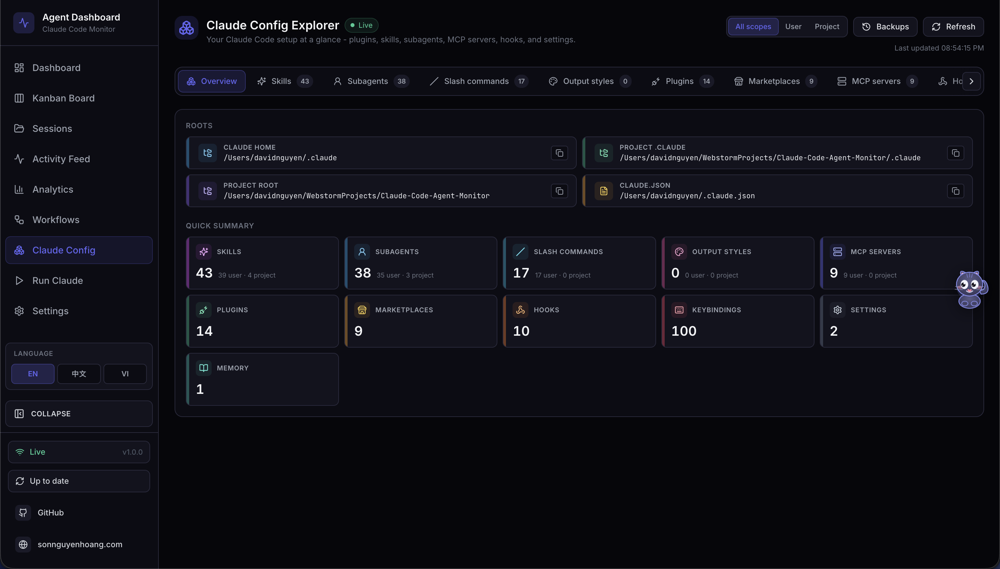
  <br>
  <em>🧰 <strong>Claude Config Explorer</strong> — 12-tab inspector for everything Claude Code knows about: skills, subagents, slash commands, output styles, plugins (with per-plugin contributions), marketplaces, MCP servers, hooks, settings (with secret-key redaction), memory (the user + project `CLAUDE.md` files plus the per-project file-based memory store — every `*.md` under `~/.claude/projects/<slug>/memory/`, grouped by project and searchable), keybindings, and statusline. Create / edit / delete on low-risk text-file surfaces — including the per-project auto-memory files — with mandatory timestamped backups</em>
</p>

<p align="center">
  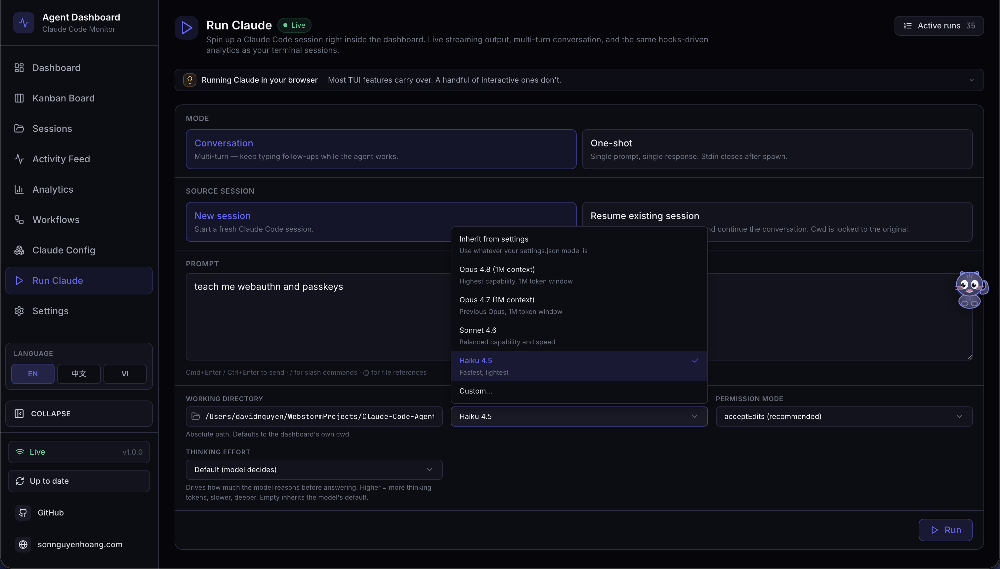
  <br>
  <em>▶️ <strong>Run Claude</strong> — spawn <code>claude</code> subprocesses right inside the dashboard. Pick mode (Conversation / One-shot), source (new session vs resume from your full history), working directory (autocomplete with recent cwds), model, permission mode, and thinking effort. Same-origin guard prevents browser drive-by spawning</em>
</p>

<p align="center">
  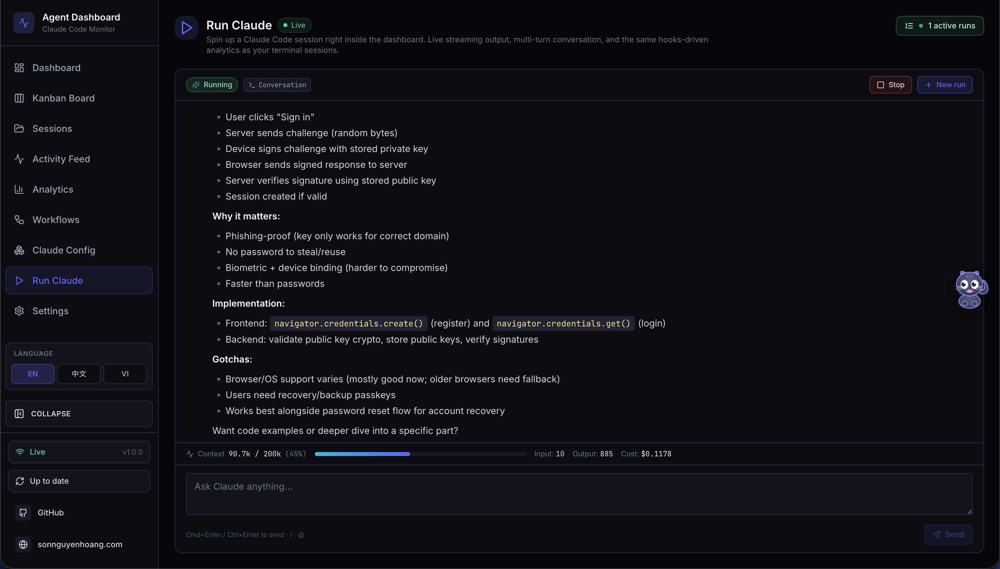
  <br>
  <em>💬 <strong>Run Claude · live stream</strong> — chat-style streaming output with real character-by-character rendering via <code>--include-partial-messages</code>. Tool uses, tool results, and thinking blocks all collapsible. Active runs switcher in the header lets you leave a run in the background and re-attach later. "View session →" deep-links into the regular Sessions UI as soon as the session ID is known</em>
</p>

<p align="center">
  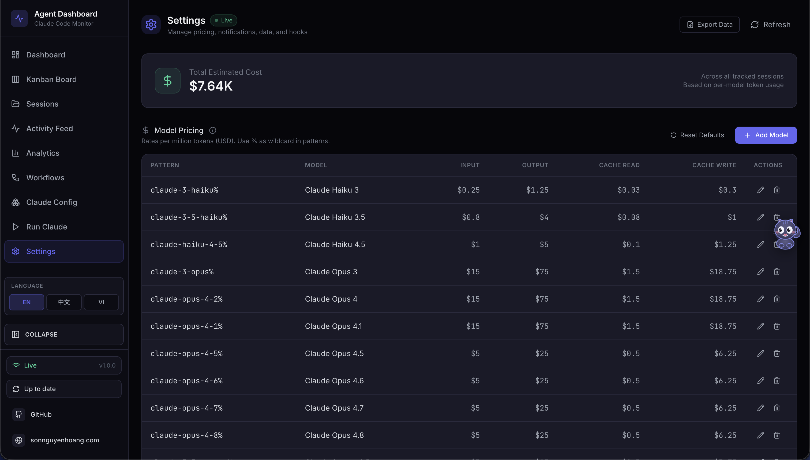
  <br>
  <em>⚙️ <strong>Settings</strong> — model pricing rules, hook installation status, data management, notification preferences, and system info</em>
</p>

<p align="center">
  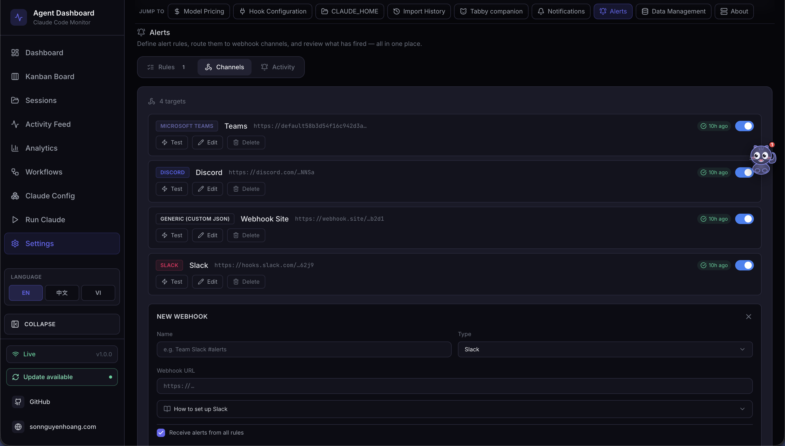
  <br>
  <em>🔔 <strong>Settings · Alerts</strong> — rules-based alerting engine and outbound webhooks in one place: alert rules (event pattern / inactivity / stuck agent / token threshold) with per-rule cooldown, a live fired-alert feed, and 14 first-class webhook providers (Slack, Discord, Teams, Google Chat, Mattermost, Rocket.Chat, Telegram, PagerDuty, Opsgenie, Splunk On-Call, Zapier, Make, n8n, Pipedream) plus a generic JSON endpoint with optional HMAC signing</em>
</p>

The sidebar provides quick access to the Dashboard, Kanban Board, Sessions list, Activity Feed, Analytics, Workflows, and Settings. Each page is designed to give you deep insights into your Claude Code agent activity with real-time updates and rich visualizations.

---

## Features

The dashboard offers a comprehensive set of features to monitor and analyze your Claude Code sessions and agents:

| Feature                            | Description                                                                                                                                                                                                                                                                  |
|------------------------------------|------------------------------------------------------------------------------------------------------------------------------------------------------------------------------------------------------------------------------------------------------------------------------|
| **Dashboard**                      | Two tabs persisted in `localStorage`: **Monitor** — overview stats (6 stat cards), active agent cards with collapsible subagent hierarchy, and recent activity feed with dynamic item counts that fill available viewport height via `ResizeObserver`. **Health** — composite system health score ring (weighted: 0.4 × success rate + 0.25 × cache hit rate + 0.25 × (100 − error rate) + 0.1 × (100 − heap %)), storage engine donut chart with record distribution, cache performance / error rate / success rate gauges, tool invocation horizontal bar chart (top 8), subagent effectiveness bars, model token distribution, and compaction impact stats. All health metrics auto-refresh every 5 s from `/api/settings/info` and `/api/workflows`. Cursor-following tooltips with viewport edge detection on every chart |
| **Kanban Board**                   | Two views with a header toggle (persisted in `localStorage`): **Agents** — 4 columns (Working / Waiting / Completed / Error) — and **Sessions** — 5 columns (Active / Waiting / Completed / Error / Abandoned). The **Waiting** column maps directly to the persisted `waiting` status on agents — set when Claude Code is sitting at a prompt (fresh session, between turns, or blocked on a permission Notification) and transitions to `working` the moment the user resumes (UserPromptSubmit / PreToolUse). Each column header shows a `?` tooltip explaining lifecycle transitions. Cards fetch by persisted status from the server (effectively unlimited per status), then paginate client-side at 10 cards per column with a "Show more" affordance. WS subscription scopes to the active view (`agent_*` vs `session_*` frames) so off-view updates don't trigger refetches. |
| **Sessions**                       | Searchable, filterable, **server-paginated** table of every recorded session. Each page click hits `/api/sessions?status=&q=&limit=10&offset=…`, so cost computation runs only over the visible page — independent of how many sessions exist in the database. The search box (`q=`) does case-insensitive matching across `id` / `name` / `cwd` on the server with a 300 ms debounce, and the response carries a `total` count for the paginator UI. Status filter, search, and pagination compose. Each session's human-readable **name** is read from the transcript and kept in sync in real time — an explicit title from `/rename`, `claude -n`, or the picker's `Ctrl+R` (the JSONL `custom-title` line) always wins, otherwise the auto-generated `ai-title` fills in; the dashboard surfaces that name (falling back to the short ID) on cards, the Dashboard, the Activity Feed, and the Run resume picker. |
| **Session Detail**                 | Per-session real-time overview panel with active-agent banner (current tool + task), six tile counters (events with events/min rate, tool calls, subagents, compactions, errors, ticking duration), top-tool usage bars, subagent type breakdown, stacked token-flow strip, and event-type pill cloud — all live-refreshed on hook events. Below it: agent hierarchy tree, full event timeline with multi-dimension filters (status, event type, tool, agent, text search, date range), Pre/Post grouping by `tool_use_id`, human-readable summary block, tool-aware input/response renderers (terminal for Bash, unified diff for Edit, line-numbered code for Read/Write, match list for Grep, key/value card for MCP tools), and a Conversation tab that renders transcripts with markdown (headings, lists, blockquotes, tables, task lists), syntax-highlighted code blocks (js/ts, python, json, bash, html, css, sql, yaml, diff) with line numbers and copy-to-clipboard, and per-tool styled tool calls (Bash → terminal, Edit → side-by-side old/new, Write → file label, Read → path chip, Grep → pattern card) |
| **Activity Feed**                  | Real-time streaming event log with pause/resume, multi-dimension filters (same toolbar as Session Detail plus a Session filter), server-driven "Load more" pagination, debounced filter-aware live refresh preserving the loaded page size, grouping toggle, origin prefix showing project › session › subagent, and a "Session →" button per row                                         |
| **Analytics**                      | Token usage, tool frequency, activity heatmap (centered, day-of-week aligned starting Sunday, day-name tooltips), session trends, live/offline connection indicator. While the analytics payload loads, the chart region (not just the stat tiles) shows **pulsing skeleton placeholders** that mirror the chart layout, so the page never flashes empty/zero charts |
| **Live Updates**                   | WebSocket push -- no polling, instant UI updates                                                                                                                                                                                                                             |
| **Auto-Discovery**                 | Sessions and agents are created automatically from hook events                                                                                                                                                                                                               |
| **History Import**                 | Imports sessions from `~/.claude/` on startup. Enhanced JSONL extraction: API errors (quota/rate/invalid_request), turn durations, entrypoint (cli/sdk-ts), permission modes, thinking block counts, usage extras (service_tier, speed, inference_geo), tool result errors, and subagent JSONL files (`subagents/agent-*.jsonl` with `.meta.json`). Backfills existing sessions on re-import. Recent JSONL files (< 10 min) are imported as "active" |
| **Subagent Hierarchy**             | Collapsible parent-child agent tree on Dashboard and Session Detail. Agents with subagents show expand/collapse chevrons; leaf agents show a dot indicator. Auto-expands when subagents are active                                                                           |
| **Background Agents**              | Correctly tracks backgrounded subagents without premature completion                                                                                                                                                                                                         |
| **Subagent Tool Attribution**      | Subagent-internal tool calls (Read, Bash, Edit, Grep, …) live only in per-subagent JSONL files — Claude Code emits no hooks for them. On every `SubagentStop` the dashboard fires a fire-and-forget `scanAndImportSubagents` pass that parses each `subagents/agent-*.jsonl`, pairs `tool_use` blocks with their matching `tool_result` by `tool_use_id`, and emits `PreToolUse` + `PostToolUse` events under the subagent's own `agent_id`. Idempotent (`data LIKE '%"tool_use_id":"X"%'` dedup) and merges into a live hook-created subagent row when one matches by type + start-time within 30 s, so no parallel `<sid>-jsonl-*` rows are created. The same path runs on `npm run setup` startup import for full historical backfill — sessions that pre-date the dashboard get full per-subagent tool timelines. Activity Feed and Session Detail render the parent chain as `main › coder › explorer` for nested subagents |
| **Cost Tracking**                  | Per-model cost estimation with configurable pricing rules and per-session breakdowns. Compaction-aware token accounting preserves totals across context compressions. Transcript reads are cached with incremental byte-offset updates for efficient token extraction        |
| **Transcript Cache**               | Real-time extraction from JSONL transcripts: tokens, compactions, API errors (`isApiErrorMessage` entries stored as `APIError` events), turn durations (stored as `TurnDuration` events), thinking block counts, and usage extras (service_tier, speed, inference_geo). Per-entry growable arrays are tail-capped at `TRANSCRIPT_CACHE_MAX_ARRAY_LEN` (default `1000`, configurable) — both during parse and at finalize — so even a session that runs for days cannot grow a single cache entry without bound. Each entry stores only `{mtimeMs, size, bytesRead, result}`, so there's no shadow copy of the same data at both the top level and inside `result`. Session metadata is enriched with these fields in real-time |
| **Notifications**                  | Full Web Push (VAPID) pipeline for reliable delivery. Arrive even when the tab is backgrounded or the browser is closed. Explicitly configured for macOS audio support. Configurable per-event toggles with subscription management |
| **Alerts**                         | Rules-based alerting engine — configured entirely in **Settings → Alerts & Notifications**, a tabbed **Rules / Channels / Activity** control center (no separate page). Define alert rules with four condition types — **event pattern** (match event type / tool name / summary text, optionally requiring N matching events inside a time window, e.g. "more than 5 errors in 2 minutes"), **inactivity** (active session with no events for N minutes), **stuck agent** (agent sitting in `working`/`waiting` with no activity for N minutes), and **token threshold** (session total tokens past a limit). Event-driven rules evaluate server-side on every hook ingest (after the ingest transaction — alerting can never slow down or fail hook delivery); time-based rules run on a 60 s sweep. Fired alerts are persisted to `alert_events` with per-rule + per-session **cooldown dedup** (default 300 s), broadcast as `alert_triggered` WebSocket messages, and surface in the **Activity** tab's live feed with acknowledge / acknowledge-all, an unacknowledged-only filter, and per-alert "View session" links. Rules support enable/disable toggling and cascade their history on delete. Fired alerts also fan out to **universal webhook targets** configured in the **Channels** tab — **14 first-class providers** plus a generic endpoint: **Slack**, **Discord**, **Microsoft Teams**, **Google Chat**, **Mattermost**, **Rocket.Chat** (native chat payloads); **Telegram** (Bot API), **PagerDuty** (Events API v2), **Opsgenie** (Alert API + GenieKey auth), **Splunk On-Call** (VictorOps REST); and **Zapier**, **Make**, **n8n**, **Pipedream**, or any **generic** endpoint (clean JSON envelope with optional **HMAC-SHA256** signing and custom headers). Each provider is described by a server-side registry that declares its payload formatter, how its URL is resolved (some derive it from credentials — e.g. Telegram from the bot token, Opsgenie from the region — others default it), and which credential fields the UI renders. Targets support optional per-rule scoping, a synchronous "Send test" probe, and a recorded delivery log. Delivery runs detached from the alert path with a request timeout and bounded retry/backoff, so it can never slow or block monitoring; target URLs, secrets, and credential fields are stored server-side and never returned by the API (masked/redacted in every response) |
| **Update Notifier**                | Server periodically runs a non-blocking `git fetch` and compares the local checkout to `origin/master`/`origin/main`/`origin/HEAD`. When upstream is ahead, the UI surfaces a modal with the exact `git pull && npm run setup` command and a one-click **Copy** button; the Sidebar gets a persistent "Check for updates" button with live badge. The dashboard never pulls or restarts itself — the user runs the command in a terminal — so the mechanism cannot break dev sessions, pm2/systemd/Docker supervision, or leave orphaned processes |
| **Settings**                       | System info, hook status, model pricing management, notification preferences, data export, session cleanup. The Model Pricing section exposes an info popover (the `i` icon next to the title) explaining how rule lookup works (first matching pattern wins), the SQL-style `%` wildcard syntax with concrete examples (`claude-opus-4-7%`, `claude-%-haiku`, exact ids), and that prices must be updated manually when Anthropic publishes new rates — already-stored sessions keep the price applied at ingest time. The CLAUDE_HOME box and Import History panel are fully i18n-driven across en/vi/zh |
| **MCP Server (Local)**             | Enterprise-grade local MCP server in `mcp/` with three transport modes (stdio, HTTP+SSE, interactive REPL), 25 typed tools across 6 domains, strict input schemas, retry/backoff, localhost-only API enforcement, and tiered mutation/destructive safety gates. HTTP mode serves Streamable HTTP (2025-11-25) and legacy SSE (2024-11-05) on configurable port. REPL mode provides tab-completed interactive tool invocation with colored output |
| **Workflows**                      | D3.js-powered visualization page with 11 interactive sections: agent orchestration DAG, tool execution Sankey diagram, collaboration network, subagent effectiveness (day-of-week sparklines with portal-rendered tooltips that escape the card's `overflow:hidden` and clamp to the viewport so they never get clipped), detected workflow patterns, model delegation flow, error propagation map (horizontal bars with rate badges, agent type breakdown, API/session error cards), concurrency timeline, session complexity scatter, compaction impact analysis (redesigned as a clear "sessions by compaction count" histogram with axis titles, stat tiles — total / sessions affected / avg / peak — an explanatory help line, and per-bar hover tooltips), and per-session drill-in. Each section's right-aligned subtitle clamps to a single line (ellipsis + hover title) so a long translation never wraps the header. **Rich, i18n-aware tooltips throughout:** every chart's section title carries an `i` icon that opens a structured "What this shows / How to read it / Why it matters" popover; hovering nodes, edges, bars, and bubbles surfaces multi-section tooltips with deterministic, value-dependent interpretations (e.g. share-of-source / share-of-target percentages, success-rate health buckets, family descriptions for Opus / Sonnet / Haiku, timing patterns like front-loaded / mid-session / back-loaded). Each of the six headline stat cards has a bottom-right info popover explaining how the metric is calculated and what its current value means in plain language. Tooltips are DOM-mutated through a single ref per chart with container-level `mouseleave` fallbacks, so they never lag behind the cursor or stick after re-render. Clicking a row in **Detected Workflow Patterns** expands an in-place detail panel with the full step sequence, stats grid, a deterministic narrative (loop detection, frequency bucket), and a practical suggestion. Status filter tabs (Active Only / Completed / All) filter all 11 sections. Cross-filtering, JSON export, and real-time WebSocket auto-refresh with 3-second debounce. A **Workflow Runs** panel surfaces "dynamic workflows" — the fleets of sub-agents spawned by the `Workflow` tool (and self-paced `/loop`) — which emit no hooks and are instead reconstructed from on-disk run journals (`workflows/wf_<runId>.json`): each run shows its phases and a per-agent token / tool-call / duration breakdown, with live `running` detection before the journal is written and a linked subsection on each Session Detail page |
| **Compaction Tracking**            | Detects `/compact` events from JSONL transcripts, creates compaction agents and events. Backfills legacy compactions on startup. A periodic scanner (cadence derived from `DASHBOARD_STALE_MINUTES`) catches compactions even when no hooks fire. Reads each active session's transcript path directly from `sessions.transcript_path` (populated by the hook handler on the first event that carries it, plus a one-time backfill from `events`) instead of doing a `SELECT DISTINCT json_extract(events.data, '$.transcript_path')` over the entire events table — so the sweep is O(active sessions) and stays cheap on a mature database. Shares the transcript cache so no duplicate file reads occur. Synthetic compaction rows are stamped with the transcript timestamp on both `started_at` and `ended_at` so duration is exactly 0 (compaction is instantaneous); a startup repair migration also heals any pre-existing rows where `ended_at < started_at` (issue #156) |
| **Subsessions/Resumed Sessions**   | Automatically reactivates sessions when new events arrive, correctly handles `/resume` and orphaned sessions. Periodic sweep (every ¼ of `DASHBOARD_STALE_MINUTES`, clamped to 60 s – 5 min) marks abandoned sessions that slip past event-based detection                                                                     |
| **Pre-Existing Session Detection** | Sessions already running when the server starts are imported as "active" (based on recent JSONL file modification). Stop events also reactivate imported completed/abandoned sessions, so the first hook from an in-progress session always surfaces it on the dashboard     |
| **Responsive Design**              | Mobile-friendly layouts with stacking grids, scrollable tables, and collapsible sidebar                                                                                                                                                                                      |
| **UI Localization**                | Built-in language switching with translated UI copy and accessibility labels for English (`en`), Chinese (`zh`), and Vietnamese (`vi`). Coverage now extends end-to-end through the Workflows tooltips: stat-card calculations and value-bucket interpretations, per-chart "What / How to read / Why" popovers, every graph's hover tooltip (orchestration, tool flow, pipeline, model delegation, concurrency), the Workflow Patterns detail-panel narratives and suggestions, the Settings → Model Pricing info popover, the CLAUDE_HOME panel, and the entire Import History flow                                                                                                                                                                       |
| **Seed Data**                      | Built-in seed script for demos and development                                                                                                                                                                                                                               |
| **Statusline**                     | Color-coded CLI statusline showing model, context usage, git branch, per-direction tokens, and session cost (USD)                                                                                                                                                            |
| **Model Name Formatting**          | Human-friendly model names throughout the UI: raw identifiers like `claude-opus-4-7-20260101` or `claude-opus-4-7[1m]` display as "Claude Opus 4.7" or "Claude Opus 4.7 (1M)". Handles Claude, GPT, and Gemini families with automatic version dot-joining, date/latest suffix stripping, provider prefix removal, and context-window tag formatting. Settings page retains raw names for pricing rule configuration |
| **Plugin Marketplace**             | Official Claude Code plugin marketplace with 10 plugins (ccam-analytics, ccam-productivity, ccam-devtools, ccam-insights, ccam-dashboard, ccam-cost-guard, ccam-sessions, ccam-workflows, ccam-quality, ccam-config). 53 skills, 14 agents, 30 slash commands, 3 CLI tools, 3 hook configs. All grounded in actual data model — token baselines, pricing engine, workflow intelligence (11 datasets), session metadata. Install via `claude plugin marketplace add` |
| **Run Claude**                     | Spawn `claude` subprocesses directly from the dashboard with a chat-style streaming UI. Two modes: **Conversation** (multi-turn — stdin stays open, follow-up turns are piped as stream-json envelopes) and **One-shot** (headless, single prompt → single response). Conversation mode also supports **resuming any existing session** via `claude --resume <id>` — pick from your full sessions history with a searchable picker. The unified active-runs / history modal also offers two zero-config jump buttons: **Resume** on any past conversation row spawns `claude --resume <id>` immediately and seeds the chat with the prior transcript so you land in the live view with full context (no need to retype a prompt — the spawn idles on stdin until you send a follow-up); **View** on any past one-shot row loads the captured transcript inline into the run viewer as read-only (no spawn — same panel, no Stop/follow-up controls). Active runs switcher in the header lets you leave a run in the background, start another, and re-attach later. Re-attach is durable: the client reconciles the spawner's in-memory envelope log (`?envelopes=1`) with the session's on-disk JSONL transcript and prefers whichever has more user/assistant messages, so navigating away from a resumed run and coming back keeps the full prior history visible (the spawner only sees post-spawn turns; the transcript file has prior + current). Model dropdown (Opus 4.7 / 1M / Sonnet 4.6 / Haiku 4.5 / custom), permission-mode picker with explicit `bypassPermissions` warning, **thinking-effort** field (low / medium / high — wired to `--effort`), cwd autocomplete pre-filled with the dashboard's own cwd plus recent session cwds. Real character-by-character streaming via `--include-partial-messages`, plus a client-side **typewriter smoothing layer** that drips each `text_delta` / `thinking_delta` through `requestAnimationFrame` so even short replies (where claude bundles the whole answer into one or two chunks) appear to type in. The merge code keeps the `_streaming` flag and the delta-accumulated `content` array intact when claude's canonical `assistant` envelope arrives mid-stream, so thinking blocks aren't dropped at completion. WebSocket dispatch wraps each envelope in `flushSync` so React 18's auto-batching doesn't collapse bursts of deltas into a single render. **TUI parity (Tier 1)**: a collapsible **limitations banner** that minimizes to a slim pill (never disappears) explaining what stream-json mode can and can't do vs. the terminal TUI; a **prompt editor with slash-command autocomplete** with tiered scoring (exact name → starts-with → word-boundary → contains → subsequence → description-contains) that lists user / project / plugin commands (executed client-side via template expansion before send) and surfaces built-in CLI commands like `/clear`, `/model`, `/config` with a "CLI only — won't run from here" badge; **`@`-file references** with debounced fuzzy-search across the run's cwd (skipping `node_modules`, `.git`, `dist`, `build`, etc.); a **live context-window / token meter** showing input + output + cache-read tokens and running cost, computed from `stream_event` and `result.usage` envelopes during live streaming and from finalized assistant `usage` blocks (input / output / cache-read / cache-creation) when seeded from a transcript on resume / view / re-attach, so the meter populates immediately instead of sitting at 0/200k. Progress bar goes indigo → amber → red at 80% / 95% of the model's context cap; a **status header** with the active model, effort, permission mode, cwd, session ID, envelope count, and elapsed time. Autocomplete dropdowns open upward so they don't collide with the cwd picker below. Live / Offline indicator next to the title. Same-origin guard on the route prevents browser drive-by spawning. Concurrency is effectively uncapped by default (sanity ceiling of 10000 to prevent fork-bomb footguns from a buggy client; the terminal TUI has no cap and neither do we). Set `RUN_MAX_CONCURRENT` if you want a real ceiling. Spawned sessions fire the same hooks any `claude` process does, so they show up automatically in Sessions / Analytics / Kanban / Workflows — and Sessions / SessionDetail surface a green **▶ Run** badge / banner that links back to the Run page for any session that's currently being driven from there |
| **Claude Config Explorer**         | A 12-tab inspector at `/cc-config` for everything Claude Code knows about: skills, subagents, slash commands, output styles, plugins (with per-plugin contributions count + author/license/homepage from `plugin.json`), marketplaces (with plugin counts read from each `marketplace.json`), MCP servers, hooks (with `~/.claude/hooks/` script listing), settings (an at-a-glance **Current configuration** summary of the options `/config` controls — model, verbose, theme, output style, effort, auto-compact, notifications, … — resolved across user/project/project-local scopes with unset options shown as defaults, plus the per-file structured key-value view + raw JSON toggle, secret-key redaction), memory (the user + project `CLAUDE.md` files **plus** the per-project file-based memory store — every `*.md` under `~/.claude/projects/<slug>/memory/`, i.e. a `MEMORY.md` index plus one file per remembered fact, often 100+; grouped by project in collapsible sections that split index files from per-fact files, with a search box), keybindings (grouped by context with `<kbd>` chips), and statusline (config + script content). For low-risk text-file surfaces (skills / agents / commands / output styles / memory — including the per-project auto-memory files) the page supports **create / edit / delete with mandatory timestamped backups** atomically written outside the directories Claude Code scans, plus a Backups modal with auto-built `mv` restore commands. Plugins, MCP, hooks-in-settings, and `settings.json` files stay read-only with explainer banners + copy-able CLI commands so the user knows the exact command to run themselves. **Live updates**: a `cc-watcher` running on the server uses `fs.watch` on `~/.claude/` (recursive where the platform supports it) plus `~/.claude.json`, debounced at 500 ms, to broadcast a `cc_config_changed` WebSocket message whenever Claude Code config changes — either via dashboard mutations or external tools (CLI installing a plugin, manually editing `settings.json`, dropping a new skill). The page subscribes and refetches automatically; a Live / Offline pill next to the title shows WebSocket status |
| **Tabby**                          | A floating cat companion pinned to the bottom-right corner of every page. Built entirely on the existing WebSocket `eventBus` — **no new backend, no API key, no new dependencies**. A reactive SVG mascot with cursor-tracking eyes and **eight moods** derived from the live session stream (`idle`, `watching`, `happy`, `worried`, `stuck`, `thinking`, `sleeping`, `disconnected`), each with its own animation (tail flick, ear perk, head bob, shake, sparkle, zzz, alert "!"). **Auto-surface speech bubbles** post short, throttled, coalesced quips on notable events (session started/finished, errors, run completed) and can be muted. Click the cat or press **⌘B / Ctrl+B** (Esc closes) to open a **panel** with a live status line (`N live · M errored · connection state`), quick actions (jump to Run Claude / Activity / Sessions / errored sessions, mute bubbles, clear alerts), and an **Ask** box: simple status questions ("what's running", "any errors", "status") are answered locally from cached data, while any other question hands off to the **Run Claude** page (deep-links to `/run?prompt=…`) to spawn a real Claude Code session. Accessible (keyboard-operable, `aria-live` bubbles, honors `prefers-reduced-motion`), degrades safe to a calm `disconnected` state if the socket is down, toggleable in **Settings** (localized in en/zh/vi). Implementation lives in `client/src/components/Tabby/` |
| **Progressive Web App (PWA)**      | Three independent PWAs — dashboard, landing page, and wiki — each with its own Web App Manifest and Service Worker. Install any of them to your home screen / dock for a standalone, chrome-less experience. The dashboard SW serves Vite's content-hashed bundles under `/assets/` cache-first (URLs are immutable per build, so cache hits are always correct) and treats everything else — navigations, the SW itself, `manifest.json`, icons, root `/` — as network-first with cache fallback. Combined with explicit `Cache-Control` headers on the production Express static middleware (`immutable` for `/assets/*`, `no-cache, must-revalidate` for `index.html`, `sw.js`, `manifest.json`), a rebuild always replaces the in-browser bundle without a hard refresh; a `controllerchange` listener in the client reloads exactly once when a new SW takes over an already-controlled page. The VAPID push-notification pipeline is preserved. The landing-page and wiki SWs precache their respective shells and lazy-cache images on first visit, enabling offline access after a single load. All manifests use SVG icons (`favicon.svg`) with `sizes="any"` for modern browsers, and include `apple-mobile-web-app-capable` + `apple-touch-icon` meta tags for iOS standalone mode |
| **Desktop App (macOS & Windows)**  | Optional native desktop app built with Electron 35, living in the `desktop/` workspace alongside `client/`, `server/`, `mcp/`, and `vscode-extension/`. Ships as a macOS `.app` (`.dmg`) **and** a Windows `.exe` (NSIS installer + no-install portable). It embeds the existing Express server **in-process** (`require()`s `server/index.js` — no child process, no IPC) and renders the built React client in a `BrowserWindow`. Adds a native title bar, a menu-bar / notification-area (tray) icon whose single-click dropdown shows a **live status snapshot** (sessions, agents, events today) pulled from SQLite at click time, a native application menu, auto-start at login (macOS Login Items via `SMAppService`; Windows per-user `HKCU\…\Run`), a **⌘Q / Ctrl+Q confirmation dialog** (second press bypasses), window-close-hides-but-server-keeps-running, a single-instance lock, and tray actions for **Open in Browser**, **Restart Server**, and **Show Logs**. Prefers port 4820 (falls back to 4821–4829 then a random high port), adopts a healthy dashboard already running on 4820 instead of double-binding, and **coexists with the web dashboard** — both `npm run dev` and the desktop app can run together with hooks fanning out to both. Notifications fire as native OS toasts (Web Push doesn't work reliably inside Electron). On first owned-server boot it auto-installs Claude Code hooks and starts the background services, so an install-only user gets events flowing with zero manual setup. See [`DESKTOP.md`](./DESKTOP.md) and [`desktop/README.md`](./desktop/README.md) |
| **Self-hosted assets (no CDN)**    | Every font and script is served locally, so the dashboard and docs make **zero third-party CDN requests** — they render fully offline and leak nothing to external hosts. The React app bundles Inter + JetBrains Mono via [`@fontsource`](https://fontsource.org/) (latin subset; Vite emits content-hashed WOFF2 into `dist/assets/` at build time, no `<link>` to Google Fonts). The landing page and wiki load a self-hosted `fonts/fonts.css` `@font-face` sheet from the repo-root `fonts/` directory. The wiki's Mermaid is vendored locally as `wiki/mermaid.min.js` (the genuine minified `mermaid@10.9.6`) instead of jsDelivr, and the VS Code extension's error page falls back to a system font stack. No `fonts.googleapis.com`, `fonts.gstatic.com`, or `cdn.jsdelivr.net` calls remain anywhere |
| **Session splash screen**          | A brief branding splash on app load (once per browser session): a **time-aware greeting** (Good morning / afternoon / evening / Working late), a bold tagline, two subtexts, and an animated node-graph brand mark over a dark atmospheric backdrop (radial glow + drifting constellation + grain). Fully localized (en/zh/vi). The overlay is **opaque from the first paint** so the app never flashes through, holds ~2.5 s, then fades out; click anywhere to skip, and it honors `prefers-reduced-motion`. CSS-only animations, no added dependencies |

---

## Quick Start

### Prerequisites

- **Node.js** >= 18.0.0 (22+ recommended)
- **npm** >= 9.0.0

### 1. Install

```bash
git clone https://github.com/hoangsonww/Claude-Code-Agent-Monitor.git
cd Claude-Code-Agent-Monitor
npm run setup
```

### 2. Configure Claude Code Hooks

```bash
npm run install-hooks
```

This adds hook entries to `~/.claude/settings.json` that forward events to the dashboard. Existing hooks are preserved.

### 3. Start

```bash
# Development (hot reload on both server and client)
npm run dev

# Production (single process, built client)
npm run build && npm start
```

> [!TIP]
> **Makefile alternative** — all commands are also available via `make` if you have it installed on your system. Run `make help` to see every target, or use shortcuts like `make dev`, `make build`, `make test`, etc.

### 4. Open

| Mode        | URL                     |
| ----------- | ----------------------- |
| Development | `http://localhost:5173` |
| Production  | `http://localhost:4820` |

### 5. Optional: Build and run the local MCP server

```bash
npm run mcp:install
npm run mcp:build
npm run mcp:start              # stdio (default — for MCP host integration)
npm run mcp:start:http         # HTTP + SSE server on port 8819
npm run mcp:start:repl         # interactive CLI with tab completion
```

For stdio mode, configure your MCP host (Claude Code / Claude Desktop / other MCP clients):

- command: `node`
- args: `["<ABSOLUTE_PATH>/mcp/build/index.js"]`

For HTTP mode, point remote MCP clients at `http://127.0.0.1:8819/mcp` (Streamable HTTP) or `http://127.0.0.1:8819/sse` (legacy SSE).

See [mcp/README.md](./mcp/README.md) for full host configuration, transport details, safety flags, and tool catalog.

### Optional: Seed Demo Data

```bash
npm run seed
```

Creates 8 sample sessions, 23 agents, and 106 events so you can explore the UI immediately.

### Alternative: Desktop App (macOS & Windows)

If you'd rather not keep a terminal open, install the optional **native desktop app**. It embeds the server in-process, adds a menu-bar / notification-area (tray) icon, and supports auto-start at login (macOS Login Items / Windows startup).

The fastest path is to **download a pre-built installer** from the [latest GitHub Release](https://github.com/hoangsonww/Claude-Code-Agent-Monitor/releases/latest) (CI auto-publishes a `vX.Y.Z` whenever `package.json` is bumped on `master`):

- **macOS** — grab `ClaudeCodeMonitor-<version>-arm64.dmg` (Apple Silicon) or `-x64.dmg` (Intel) and drag **Claude Code Monitor.app** into `/Applications`.
- **Windows** — grab `ClaudeCodeMonitor-Setup-<version>-x64.exe` (installer) or `ClaudeCodeMonitor-<version>-x64-portable.exe` (no-install) and run it.

To build it yourself instead:

```bash
npm run desktop:install        # install Electron + electron-builder into desktop/ (preflights native deps; prints setup help on failure)
npm run desktop:dmg:arm64      # macOS: fast single-arch DMG (Apple Silicon)
npm run desktop:win            # Windows: NSIS installer .exe (run on Windows)
```

Full coverage of the desktop app — download, install, tray/menu features, build commands, and signing — is in the [Desktop App (macOS & Windows)](#desktop-app-macos--windows) section below. See also [`DESKTOP.md`](./DESKTOP.md) (user guide) and [`desktop/README.md`](./desktop/README.md) (architecture).

### Alternative: Docker / Podman

A `Dockerfile` and `docker-compose.yml` are included. Both Docker and Podman are supported.

**With Docker Compose:**

```bash
docker compose up -d --build
```

**With Podman Compose:**

```bash
CLAUDE_HOME="$HOME/.claude" podman compose up -d --build
```

**With plain Docker or Podman (no Compose):**

```bash
# Docker
docker build -t agent-monitor .
docker run -d --name agent-monitor \
  -p 4820:4820 \
  -v "$HOME/.claude:/root/.claude:ro" \
  -v agent-monitor-data:/app/data \
  agent-monitor

# Podman
podman build -t agent-monitor .
podman run -d --name agent-monitor \
  -p 4820:4820 \
  -v "$HOME/.claude:/root/.claude:ro" \
  -v agent-monitor-data:/app/data \
  agent-monitor
```

The dashboard is then available at `http://localhost:4820`. The server binds `127.0.0.1` by default, so to make it reachable beyond the container's own loopback set `DASHBOARD_HOST=0.0.0.0` **and** `DASHBOARD_TOKEN` (see [Configuration](#configuration) and [`.github/SECURITY.md`](./.github/SECURITY.md)).

**Volume mounts:**

| Mount | Purpose |
|---|---|
| `~/.claude:/root/.claude:ro` | Read legacy session history for import |
| `agent-monitor-data:/app/data` | Persist the SQLite database across restarts |

> [!IMPORTANT]
> **Note:** Claude Code hooks must still point to a running hook-handler process on the host. The container itself does not receive hooks — run `npm run install-hooks` **on the host** to configure hooks that POST to `http://localhost:4820`. Running the installer inside a container is **refused** (issue #193) so it can't write a container-internal handler path into a bind-mounted host `~/.claude`; override with `CCAM_ALLOW_CONTAINER_HOOKS=1` only if you actually run Claude Code inside the same container.

---

## How It Works

The dashboard integrates with Claude Code via its native hook system to provide real-time monitoring of agent activity. Here's an overview of the architecture and data flow:

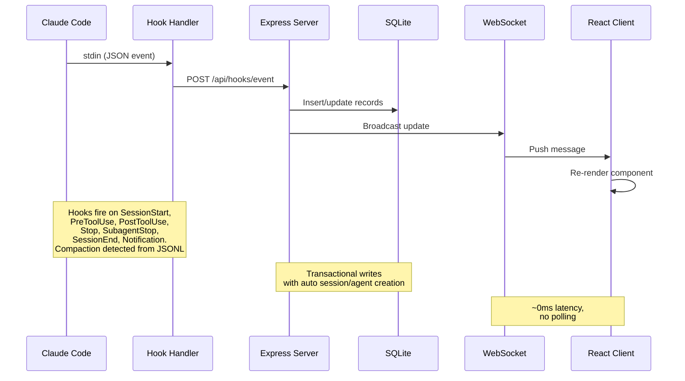
```mermaid
sequenceDiagram
    participant CC as Claude Code
    participant HH as Hook Handler
    participant API as Express Server
    participant DB as SQLite
    participant WS as WebSocket
    participant UI as React Client

    CC->>HH: stdin (JSON event)
    HH->>API: POST /api/hooks/event
    API->>DB: Insert/update records
    API->>WS: Broadcast update
    WS->>UI: Push message
    UI->>UI: Re-render component

    Note over CC,HH: Hooks fire on SessionStart,<br/>PreToolUse, PostToolUse,<br/>Stop, SubagentStop,<br/>SessionEnd, Notification.<br/>Compaction detected from JSONL
    Note over API,DB: Transactional writes<br/>with auto session/agent creation
    Note over WS,UI: ~0ms latency,<br/>no polling
```

> [!IMPORTANT]
> See [ARCHITECTURE.md](./ARCHITECTURE.md) for a deep dive into the server architecture, database schema, API routes, WebSocket design, client routing, hook handler flow, deployment modes, and detailed lifecycle diagrams for sessions and agents.

### Hook Lifecycle

1. **Claude Code** fires a hook on session start, tool use, turn end, subagent completion, and session exit
2. **Hook Handler** (`scripts/hook-handler.js`) reads the JSON event from stdin, resolves every live dashboard via `~/.claude/.agent-dashboard.json` (or `CLAUDE_DASHBOARD_PORT` if set), and POSTs the same payload to each one in parallel. Fails silently with a 5 s safety-net timeout so it never blocks Claude Code, and per-target promises never reject so a single dead listener can't starve the others. Multiple dashboards running together (e.g. `npm run dev` + the macOS desktop app) all receive every event.
3. **Server** processes the event inside a SQLite transaction:
   - Auto-creates sessions and main agents on first contact
   - Detects `Agent` tool calls to track subagent creation
   - On `SessionStart`, stamps the session and main agent's `awaiting_input_since` so a fresh CLI sitting at the prompt lands in **Waiting** immediately
   - On `UserPromptSubmit` (user hits enter), clears the waiting flag and promotes the main agent to `working` — the only reliable signal that text-only assistant turns have started, since they emit no `PreToolUse`
   - Sets agent to "working" on `PreToolUse` (also clears the waiting flag), keeps it working through `PostToolUse`
   - On `Stop` (Claude finishes responding), main agent goes to "waiting" — Claude finished its turn, ball is in the user's court. Background subagents continue running. Session stays `active`. Stop with `stop_reason=error` marks the agent `error` and the session `error`
   - On a permission `Notification` (matched by message pattern: `permission`, `waiting for input`, `needs your approval`, …), sets the agent to `waiting` and stamps `awaiting_input_since`
   - `SubagentStop` deliberately does NOT clear the waiting flag (a backgrounded subagent finishing tells us nothing about the human)
   - Marks subagents completed individually via `SubagentStop`. After `res.json()` returns, fires a fire-and-forget `scanAndImportSubagents` pass that walks the session's `subagents/agent-*.jsonl` files, pairs `tool_use` ↔ `tool_result` blocks by `tool_use_id`, and emits `PreToolUse` + `PostToolUse` events under each subagent's own `agent_id` — closing the gap where subagent-internal tool calls would otherwise be invisible to the dashboard
   - On `SessionEnd` (CLI process exits), drops the waiting flag. If the session is in `error`, the error state is preserved; otherwise marks all agents + the session as `completed`
   - On `SessionStart`, any other active session with no activity for `DASHBOARD_STALE_MINUTES` (default 180 = 3 h, env-overridable) is automatically marked "abandoned" with its agents completed. This handles `/resume` inside a session, Ctrl+C, and other scenarios where a session is orphaned without a clean `SessionEnd`
   - Reactivates completed/error/abandoned sessions when new work events arrive (session resumed). Stop and SubagentStop events also reactivate completed/abandoned sessions — this handles pre-existing sessions imported before the server started, where the first hook event may be a Stop
   - **Error recovery**: only `UserPromptSubmit` and `PreToolUse` can recover a session from `error` back to `active` — indicating the user actively retried
   - Detects conversation compaction (`isCompactSummary` entries in the JSONL transcript) and creates `Compaction` agents + events. Token baselines are preserved across compactions so no usage is lost. Transcript reads use a shared stat-based cache with incremental byte-offset reads — only new bytes appended since the last read are parsed, giving ~50x speedup for long sessions
   - Extracts API errors (`isApiErrorMessage` entries: quota limits, rate limits, invalid_request) and raw `type: "error"` responses from JSONL transcripts, stored as `APIError` events. Turn durations (`system` subtype `turn_duration`) are stored as `TurnDuration` events. Tool result errors (`toolUseResult.is_error`) are tracked as `ToolError` events
   - **Error detection watchdog** — a background timer runs every 15 seconds, scanning active sessions with no recent hook events (>10 s stale). It re-reads their transcript files looking for API errors (auth failures, rate limits, quota exhaustion), derives transcript paths from session `cwd` for imported sessions without `transcript_path` in event data, and marks sessions/agents as `error` when API errors are found. This catches cases where the Claude CLI does not fire a hook after an API error (e.g., 401 auth failures where the CLI shows the error and waits)
   - **User-interrupt (Esc) recovery** — cancelling a turn with `Esc` fires **no hook** (a documented Claude Code limitation), so without intervention the main agent would stay stuck in `working` forever. The same 15 s watchdog recovers these two ways: (1) when the cancel leaves a `[Request interrupted by user]` marker in the transcript (Esc *after* some output), the transcript cache flags it via `pendingInterrupt` — derived purely from transcript ordering (latest interrupt vs latest real turn activity, same clock, so it works even for a sub-second cancel) — and the session moves to **Waiting** within ~15 s; (2) when Esc is pressed *before any output*, Claude Code writes no marker at all, so an idle-timeout fallback applies — if the main agent has been `working` with **no tool in flight** and **neither a hook event nor the transcript has advanced** for `DASHBOARD_WORKING_IDLE_SECONDS` (default `120`), the turn is treated as dead and the session moves to **Waiting**. Both paths log an `Interrupted` event and land the session in the same Waiting state a normal `Stop` produces. Streaming output (transcript still growing) and in-flight tool calls (`current_tool` set) are exempt; a rare false flip self-heals on the next real hook
   - A periodic server sweep catches abandoned sessions and new compactions that slipped past event-based detection (e.g., `/compact` fires no hook, `/resume` within seconds of session creation). Cadence is derived from `DASHBOARD_STALE_MINUTES` (¼ of the threshold, clamped to 60 s – 5 min). The sweep reads `transcript_path` directly off each active session row (a small index lookup) instead of scanning the events table for it; the column is populated by the hook handler the first time it sees a transcript path and is one-time-backfilled from existing events by the `db.js` migration, with a partial index `idx_sessions_active_tp` covering exactly the rows the sweep reads. The sweep shares the transcript cache with the hook handler, avoiding duplicate I/O. Abandoned session cleanup also evicts the transcript cache entry to bound memory
4. **WebSocket** broadcasts the change to all connected clients
5. **UI** receives the update and re-renders the affected components in real-time with no polling.

### Agent State Machine

Persisted statuses: `working | waiting | completed | error`. The
`awaiting_input_since` column is supplementary — it tracks when the agent
started waiting and is used for duration display, but `waiting` is now a
real persisted status.

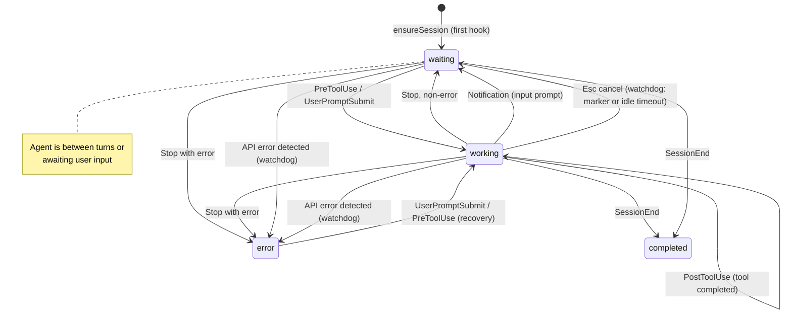
```mermaid
stateDiagram-v2
    [*] --> waiting: ensureSession (first hook)
    waiting --> working: PreToolUse / UserPromptSubmit
    working --> working: PostToolUse (tool completed)
    working --> waiting: Stop, non-error
    working --> waiting: Notification (input prompt)
    working --> waiting: Esc cancel (watchdog: marker or idle timeout)
    waiting --> error: Stop with error
    working --> error: Stop with error
    waiting --> error: API error detected (watchdog)
    working --> error: API error detected (watchdog)
    error --> working: UserPromptSubmit / PreToolUse (recovery)
    working --> completed: SessionEnd
    waiting --> completed: SessionEnd

    note right of waiting
        Agent is between turns or
        awaiting user input
    end note
```

### Session State Machine

Persisted statuses: `active | completed | error | abandoned`. The
**Waiting** session state is a UI overlay (status=`active` with
`awaiting_input_since` set).

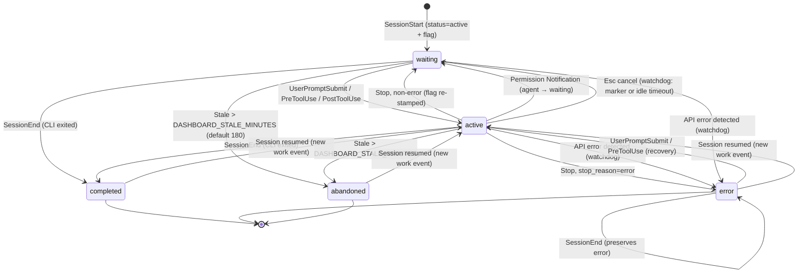
```mermaid
stateDiagram-v2
    [*] --> waiting: SessionStart (status=active + flag)
    waiting --> active: UserPromptSubmit / PreToolUse / PostToolUse
    active --> waiting: Stop, non-error (flag re-stamped)
    active --> waiting: Permission Notification (agent → waiting)
    active --> waiting: Esc cancel (watchdog: marker or idle timeout)
    active --> error: Stop, stop_reason=error
    active --> error: API error detected (watchdog)
    waiting --> error: API error detected (watchdog)
    error --> active: UserPromptSubmit / PreToolUse (recovery)
    waiting --> completed: SessionEnd (CLI exited)
    active --> completed: SessionEnd (CLI exited)
    error --> error: SessionEnd (preserves error)
    waiting --> abandoned: Stale > DASHBOARD_STALE_MINUTES (default 180)
    active --> abandoned: Stale > DASHBOARD_STALE_MINUTES
    completed --> active: Session resumed (new work event)
    error --> active: Session resumed (new work event)
    abandoned --> active: Session resumed (new work event)
    completed --> [*]
    error --> [*]
    abandoned --> [*]
```

### Cost Calculation Flow

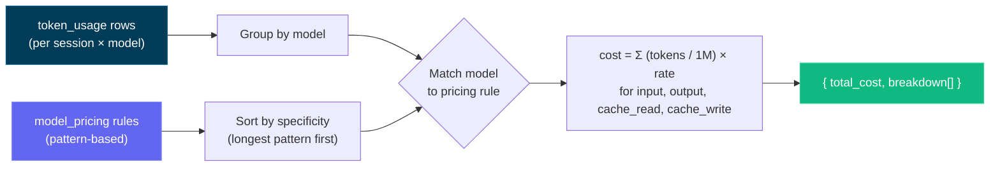
```mermaid
flowchart LR
    TU["token_usage rows<br/>(per session × model)"] --> GROUP["Group by model"]
    PR["model_pricing rules<br/>(pattern-based)"] --> SORT["Sort by specificity<br/>(longest pattern first)"]
    GROUP --> MATCH{"Match model<br/>to pricing rule"}
    SORT --> MATCH
    MATCH --> CALC["cost = Σ (tokens / 1M) × rate<br/>for input, output, cache_read, cache_write"]
    CALC --> RESULT["{ total_cost, breakdown[] }"]
    style TU fill:#003B57,stroke:#005f8a,color:#fff
    style PR fill:#6366f1,stroke:#818cf8,color:#fff
    style RESULT fill:#10b981,stroke:#34d399,color:#fff
```

> [!IMPORTANT]
> The cost calculation flow is based on token usage and model pricing rules. Ensure your pricing rules are up-to-date to reflect accurate costs. Update the model pricing table via the Settings page to maintain accurate cost tracking - the dashboard does not automatically fetch pricing updates from external sources. Once you set the pricing rules, the dashboard applies them retroactively to all sessions for consistent cost reporting.

---

## Configuration

| Environment Variable    | Default       | Description                                   |
| ----------------------- | ------------- | --------------------------------------------- |
| `DASHBOARD_PORT`        | `4820`        | Port for the Express server                   |
| `CLAUDE_DASHBOARD_PORT` | `4820`        | Port used by hook handler to reach the server |
| `NODE_ENV`              | `development` | Set to `production` to serve the built client |
| `DASHBOARD_UPDATE_CHECK` | _(enabled)_ | Set to `0` / `false` / `off` to disable periodic git upstream checks |
| `DASHBOARD_UPDATE_CHECK_INTERVAL_MS` | `300000` (5 min) | Interval between automatic checks; floor 60 000 ms. Users can also click **Check now** in the update modal or in the sidebar to run one on demand. |
| `DASHBOARD_WORKING_IDLE_SECONDS` | `120` | Idle-working timeout for recovering a turn cancelled with `Esc` **before any output** (which leaves no transcript marker). When the main agent has been `working` with no tool in flight and neither a hook event nor the transcript has advanced for this long, the watchdog moves the session to **Waiting**. Lower it for snappier recovery at the cost of occasional false flips on long silent-thinking turns (which self-heal) |
| `DASHBOARD_HOST`        | `127.0.0.1`   | Interface the server binds to. Loopback by default (not network-reachable). Set to `0.0.0.0` to expose on a LAN (logs a startup warning) |
| `DASHBOARD_TOKEN`       | _(unset)_     | When set, every `/api/*` request and the WebSocket must present the token (`Authorization: Bearer <token>`, `x-dashboard-token` header, or `?token=`). Off by default — loopback bind is the trust boundary |
| `DASHBOARD_ALLOWED_HOSTS` | _(loopback)_ | Comma-separated extra `Host` values allowed on HTTP + WebSocket upgrades (DNS-rebinding guard). Add your LAN hostnames here when binding beyond loopback |

> [!IMPORTANT]
> **Secure by default.** The server binds `127.0.0.1` and is **not** reachable from the network out of the box ([GHSA-gr74-4xfh-6jw9](./.github/SECURITY.md)). To expose it on a LAN, set **both** `DASHBOARD_HOST` (e.g. `0.0.0.0`) **and** `DASHBOARD_TOKEN` (which then gates `/api/*` and the WebSocket), and list your LAN hostnames in `DASHBOARD_ALLOWED_HOSTS`. See [`.env.example`](./.env.example) and [`.github/SECURITY.md`](./.github/SECURITY.md) for details.

For git clones, the server periodically `git fetch`es `origin` and compares your checkout to `origin/master`, `origin/main`, or `origin/HEAD`. When you are behind, a message appears in the server terminal and a modal appears in the UI with the exact command to run. The dashboard never pulls or restarts itself — you copy the command, run it in a terminal, then restart the server the same way you started it.

---

## npm Scripts

| Command                 | Description                                                |
| ----------------------- | ---------------------------------------------------------- |
| `npm run setup`         | Install server and client dependencies                     |
| `npm run update:pull-setup` | `git pull --ff-only` then `npm run setup` (manual upgrade) |
| `npm run dev`           | Start server (watch mode) + client (Vite HMR) concurrently |
| `npm run dev:server`    | Start only the Express server with `--watch`               |
| `npm run dev:client`    | Start only the Vite dev server                             |
| `npm run build`         | Build the React client to `client/dist/`                   |
| `npm start`             | Start production server (serves built client)              |
| `npm test`              | Run the full suite (server `node --test` + client Vitest)  |
| `npm run test:server`   | Run backend tests (`node --test server/__tests__/`)        |
| `npm run test:client`   | Run frontend Vitest tests, including **render snapshots for every screen** (`client/src/pages/__tests__/screens.snapshot.test.tsx`); regenerate baselines after intentional UI changes with `cd client && npx vitest run -u` |
| `npm run install-hooks` | Configure Claude Code hooks in `~/.claude/settings.json`   |
| `npm run seed`          | Populate database with sample data                         |
| `npm run import-history`| Import legacy sessions from `~/.claude/` (also runs on startup) |
| `npm run clear-data`    | Delete all sessions, agents, events, and token usage            |
| `npm run mcp:install`   | Install dependencies for local MCP package (`mcp/`)       |
| `npm run mcp:build`     | Build MCP server TypeScript into `mcp/build/`             |
| `npm run mcp:start`     | Start MCP server (stdio transport — for MCP hosts)        |
| `npm run mcp:start:http`| Start MCP server (HTTP + SSE transport on port 8819)      |
| `npm run mcp:start:repl`| Start MCP server (interactive REPL with tab completion)   |
| `npm run mcp:dev`       | Run MCP server in dev mode (`tsx`, stdio)                 |
| `npm run mcp:dev:http`  | Run MCP server in dev mode (`tsx`, HTTP + SSE)            |
| `npm run mcp:dev:repl`  | Run MCP server in dev mode (`tsx`, interactive REPL)      |
| `npm run mcp:typecheck` | Type-check MCP source without emitting build output        |
| `npm run mcp:docker:build` | Build MCP container image with Docker (`agent-dashboard-mcp:local`) |
| `npm run mcp:podman:build` | Build MCP container image with Podman (`localhost/agent-dashboard-mcp:local`) |
| `npm run desktop:install` | Install Electron + electron-builder into the `desktop/` workspace (rebuilds `better-sqlite3` for Electron's ABI); preflights the native `better-sqlite3` build and prints actionable setup help (incl. a no-toolchain alternative) on failure |
| `npm run desktop:dev`   | Build and launch the Electron desktop app for local iteration  |
| `npm run desktop:build` | Compile the desktop TypeScript sources into `desktop/out/`      |
| `npm run desktop:test`  | Run the desktop smoke test (spawn Electron, probe `/api/health`) |
| `npm run desktop:dmg`   | Build the **universal** (x64 + arm64) macOS DMG — correct for release, **slow** |
| `npm run desktop:dmg:arm64` | Build an Apple-Silicon-only DMG — **fast**, recommended for your own Mac |
| `npm run desktop:dmg:x64` | Build an Intel-only DMG — **fast**                           |
| `npm run desktop:win`   | Build a Windows **NSIS installer** `.exe` (x64) — run on Windows |
| `npm run desktop:win:portable` | Build a Windows **portable** (no-install) `.exe` (x64) — run on Windows |

---

## Agent Extensions

This repository includes a comprehensive extension layer for both Claude Code and Codex:

- Claude Code: `CLAUDE.md`, `.claude/rules/`, `.claude/skills/`
- Claude subagents: `.claude/agents/`
- Codex: `AGENTS.md`, `.codex/rules/`, `.codex/agents/`, `.codex/skills/`

### Extension Architecture

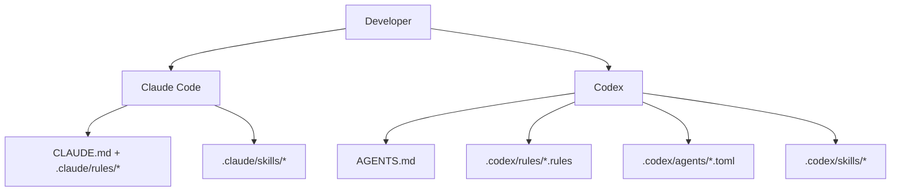
```mermaid
graph TD
    USER["Developer"]
    CLAUDE["Claude Code"]
    CODEX["Codex"]
    MEMORY["CLAUDE.md + .claude/rules/*"]
    C_SKILLS[".claude/skills/*"]
    AGENTS_MD["AGENTS.md"]
    X_RULES[".codex/rules/*.rules"]
    X_AGENTS[".codex/agents/*.toml"]
    X_SKILLS[".codex/skills/*"]

    USER --> CLAUDE
    USER --> CODEX
    CLAUDE --> MEMORY
    CLAUDE --> C_SKILLS
    CODEX --> AGENTS_MD
    CODEX --> X_RULES
    CODEX --> X_AGENTS
    CODEX --> X_SKILLS
```

### Claude Code Layer

- Persistent context:
  - [`CLAUDE.md`](./CLAUDE.md)
- Path-scoped rules:
  - [`.claude/rules/backend-node.md`](./.claude/rules/backend-node.md)
  - [`.claude/rules/frontend-react.md`](./.claude/rules/frontend-react.md)
  - [`.claude/rules/mcp-typescript.md`](./.claude/rules/mcp-typescript.md)
  - [`.claude/rules/docs-markdown.md`](./.claude/rules/docs-markdown.md)
- Skills:
  - `repo-onboarding`
  - `ship-feature`
  - `mcp-operations`
  - `debug-live-issue`
- Subagents:
  - `backend-reviewer`
  - `frontend-reviewer`
  - `mcp-reviewer`

### Codex Layer

- Persistent context:
  - [`AGENTS.md`](./AGENTS.md)
- Execution policy:
  - [`.codex/rules/default.rules`](./.codex/rules/default.rules)
- Custom subagent templates:
  - [`.codex/agents/`](./.codex/agents)
- Skills:
  - [`.codex/skills/`](./.codex/skills)
- Setup:
  - [`.codex/README.md`](./.codex/README.md)

---

## MCP Integration

This project includes a local, production-grade MCP server at `mcp/` that exposes dashboard operations as tools for AI agents. It supports three transport modes to suit different integration scenarios.

### MCP Transport Modes

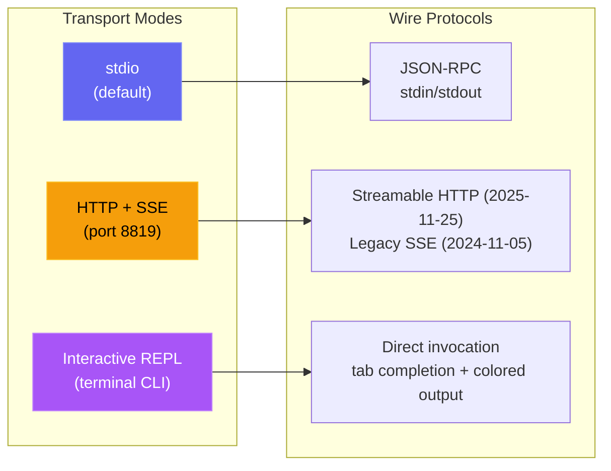
```mermaid
flowchart LR
    subgraph Transports["Transport Modes"]
        STDIO["stdio\n(default)"]
        HTTP["HTTP + SSE\n(port 8819)"]
        REPL["Interactive REPL\n(terminal CLI)"]
    end

    subgraph Protocols["Wire Protocols"]
        P1["JSON-RPC\nstdin/stdout"]
        P2["Streamable HTTP (2025-11-25)\nLegacy SSE (2024-11-05)"]
        P3["Direct invocation\ntab completion + colored output"]
    end

    STDIO --> P1
    HTTP --> P2
    REPL --> P3

    style STDIO fill:#6366f1,stroke:#818cf8,color:#fff
    style HTTP fill:#f59e0b,stroke:#fbbf24,color:#000
    style REPL fill:#a855f7,stroke:#c084fc,color:#fff
```

| Mode | Command | Use Case |
| --- | --- | --- |
| **stdio** | `npm run mcp:start` | Claude Code, Claude Desktop, IDE MCP hosts |
| **HTTP** | `npm run mcp:start:http` | Remote MCP clients, web integrations, multi-session |
| **REPL** | `npm run mcp:start:repl` | Ops debugging, manual tool invocation, local admin |

<p align="center">
  
</p>

### MCP Architecture

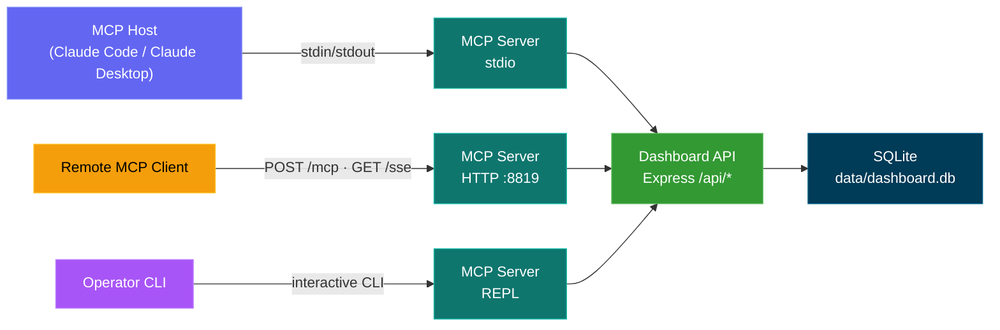
```mermaid
graph LR
    HOST["MCP Host<br/>(Claude Code / Claude Desktop)"]
    HTTP_CLIENT["Remote MCP Client"]
    OPERATOR["Operator CLI"]

    MCP_STDIO["MCP Server<br/>stdio"]
    MCP_HTTP["MCP Server<br/>HTTP :8819"]
    MCP_REPL["MCP Server<br/>REPL"]

    API["Dashboard API<br/>Express /api/*"]
    DB["SQLite<br/>data/dashboard.db"]

    HOST -->|"stdin/stdout"| MCP_STDIO
    HTTP_CLIENT -->|"POST /mcp · GET /sse"| MCP_HTTP
    OPERATOR -->|"interactive CLI"| MCP_REPL

    MCP_STDIO --> API
    MCP_HTTP --> API
    MCP_REPL --> API
    API --> DB

    style HOST fill:#6366f1,stroke:#818cf8,color:#fff
    style HTTP_CLIENT fill:#f59e0b,stroke:#fbbf24,color:#000
    style OPERATOR fill:#a855f7,stroke:#c084fc,color:#fff
    style MCP_STDIO fill:#0f766e,stroke:#14b8a6,color:#fff
    style MCP_HTTP fill:#0f766e,stroke:#14b8a6,color:#fff
    style MCP_REPL fill:#0f766e,stroke:#14b8a6,color:#fff
    style API fill:#339933,stroke:#5cb85c,color:#fff
    style DB fill:#003B57,stroke:#005f8a,color:#fff
```

### MCP Tool Surface

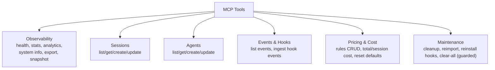
```mermaid
graph TD
    ROOT["MCP Tools"]
    OBS["Observability<br/>health, stats, analytics,<br/>system info, export, snapshot"]
    SES["Sessions<br/>list/get/create/update"]
    AGT["Agents<br/>list/get/create/update"]
    EVT["Events & Hooks<br/>list events, ingest hook events"]
    PRC["Pricing & Cost<br/>rules CRUD, total/session cost, reset defaults"]
    MNT["Maintenance<br/>cleanup, reimport, reinstall hooks, clear-all (guarded)"]

    ROOT --> OBS
    ROOT --> SES
    ROOT --> AGT
    ROOT --> EVT
    ROOT --> PRC
    ROOT --> MNT
```

### MCP Safety Model

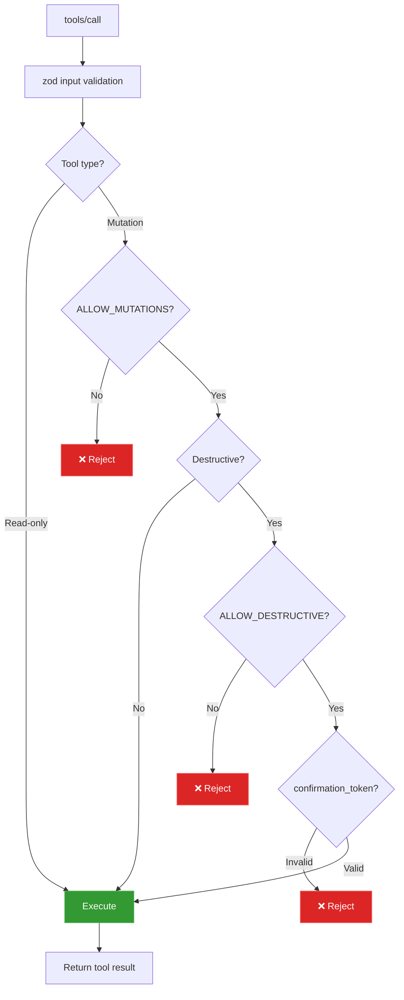
```mermaid
flowchart TD
    CALL["tools/call"] --> VALIDATE["zod input validation"]
    VALIDATE --> TYPE{"Tool type?"}
    TYPE -->|Read-only| EXEC["Execute"]
    TYPE -->|Mutation| M_FLAG{"ALLOW_MUTATIONS?"}
    M_FLAG -->|No| DENY1["❌ Reject"]
    M_FLAG -->|Yes| DEST{"Destructive?"}
    DEST -->|No| EXEC
    DEST -->|Yes| D_FLAG{"ALLOW_DESTRUCTIVE?"}
    D_FLAG -->|No| DENY2["❌ Reject"]
    D_FLAG -->|Yes| TOKEN{"confirmation_token?"}
    TOKEN -->|Invalid| DENY3["❌ Reject"]
    TOKEN -->|Valid| EXEC
    EXEC --> RESULT["Return tool result"]

    style EXEC fill:#339933,stroke:#5cb85c,color:#fff
    style DENY1 fill:#dc2626,stroke:#f87171,color:#fff
    style DENY2 fill:#dc2626,stroke:#f87171,color:#fff
    style DENY3 fill:#dc2626,stroke:#f87171,color:#fff
```

### MCP Operational Modes

- Read-only mode (default): `MCP_DASHBOARD_ALLOW_MUTATIONS=false`
- Admin mode: `MCP_DASHBOARD_ALLOW_MUTATIONS=true`
- Destructive mode: requires both:
  - `MCP_DASHBOARD_ALLOW_MUTATIONS=true`
  - `MCP_DASHBOARD_ALLOW_DESTRUCTIVE=true`
  - tool input `confirmation_token: "CLEAR_ALL_DATA"`

Full details: [mcp/README.md](./mcp/README.md)

---

## API Reference

All endpoints return JSON. Error responses follow the shape `{ error: { code, message } }`.

### OpenAPI / Swagger / ReDoc

There are three ways to explore the HTTP API, all driven by a single OpenAPI 3.0.3 spec (default server port `4820`):

| Method | Path                            | Description                                                                                       |
| ------ | ------------------------------- | ------------------------------------------------------------------------------------------------- |
| `GET`  | `/api/openapi.json`             | Raw OpenAPI 3.0.3 JSON spec                                                                        |
| `GET`  | `/api/docs`                     | Interactive **Swagger UI** — try-it-out request execution                                         |
| `GET`  | `/api/redoc`                    | **ReDoc** reference — a clean, read-optimized three-panel rendering of the same spec              |
| `GET`  | `/api/redoc/redoc.standalone.js`| Self-hosted ReDoc bundle (served locally via the `redoc` dependency, never a CDN — works offline) |

The OpenAPI document is generated from `server/openapi.js` (`createOpenApiSpec()`), merged with supplementary fragments under `server/openapi-extra/`. Swagger UI and ReDoc are both served directly by the backend; the ReDoc bundle is served locally (`GET /api/redoc/redoc.standalone.js`) so the reference works fully offline / air-gapped, consistent with the project's no-external-assets policy.

Coverage is comprehensive: every backend route is documented (75 path entries) across these tags — Health, Sessions, Agents, Events, Stats, Analytics, Hooks, Pricing, Workflows, Settings, Updates, Alerts, Webhooks, Push, CcConfig (Claude Code config explorer), Run (dashboard-spawned runs), and Documentation — each with parameters, request/response schemas, field-level descriptions, and realistic examples.

A committed **`openapi.yaml`** at the repo root mirrors the live spec. It is generated from `server/openapi.js` (never hand-edited) — regenerate it after API changes with:

```bash
npm run openapi:yaml
```

<p align="center">
  
</p>

<p align="center">
  
</p>

### Health

| Method | Path          | Description                           |
| ------ | ------------- | ------------------------------------- |
| `GET`  | `/api/health` | Returns `{ status: "ok", timestamp }` |

### Sessions

| Method  | Path                            | Query Params                                                     | Description                                                                                  |
| ------- | ------------------------------- | ---------------------------------------------------------------- | -------------------------------------------------------------------------------------------- |
| `GET`   | `/api/sessions`                 | `status`, `q`, `limit`, `offset`                                 | List sessions with agent counts and per-session cost. `q` does case-insensitive search across `id` / `name` / `cwd`. `limit` defaults to 50, max 10000. Response includes `total` for paginators. |
| `GET`   | `/api/sessions/:id`             | --                                                               | Session detail with agents and events                                                        |
| `GET`   | `/api/sessions/:id/stats`       | --                                                               | Aggregated counts powering the Session Detail overview panel: events, events-by-type, top tool usage, error count, agent type/status counts, subagent type breakdown, token totals, time range |
| `GET`   | `/api/sessions/:id/transcripts` | --                                                               | List available JSONL transcripts for the session (main + subagents + compactions)            |
| `GET`   | `/api/sessions/:id/transcript`  | `agent_id`, `limit`, `offset`, `after`, `before`                 | Stream messages from a specific transcript with cursor-based pagination. Assistant `usage` includes `input_tokens`, `output_tokens`, `cache_read_input_tokens`, `cache_creation_input_tokens` so the Run page meter can hydrate fully on resume / re-attach |
| `POST`  | `/api/sessions`                 | --                                                               | Create session (idempotent on `id`)                                                          |
| `PATCH` | `/api/sessions/:id`             | --                                                               | Update session status/metadata                                                               |

### Agents

| Method  | Path              | Query Params                              | Description                   |
| ------- | ----------------- | ----------------------------------------- | ----------------------------- |
| `GET`   | `/api/agents`     | `status`, `session_id`, `limit`, `offset` | List agents with filters      |
| `GET`   | `/api/agents/:id` | --                                        | Single agent detail           |
| `POST`  | `/api/agents`     | --                                        | Create agent                  |
| `PATCH` | `/api/agents/:id` | --                                        | Update agent status/task/tool |

### Events

| Method | Path          | Query Params                    | Description                |
| ------ | ------------- | ------------------------------- | -------------------------- |
| `GET`  | `/api/events` | `session_id`, `limit`, `offset` | List events (newest first) |

### Stats

| Method | Path         | Description                                            |
| ------ | ------------ | ------------------------------------------------------ |
| `GET`  | `/api/stats` | Aggregate counts, status distributions, WS connections |

### Analytics

| Method | Path             | Description                                                |
| ------ | ---------------- | ---------------------------------------------------------- |
| `GET`  | `/api/analytics` | Token/tool/session aggregates for charts and trend views   |

### Hooks

| Method | Path               | Description                                  |
| ------ | ------------------ | -------------------------------------------- |
| `POST` | `/api/hooks/event` | Receive and process a Claude Code hook event |

**Hook event payload:**

```json
{
  "hook_type": "PreToolUse",
  "data": {
    "session_id": "abc-123",
    "tool_name": "Bash",
    "tool_input": { "command": "ls -la" }
  }
}
```

### Pricing

| Method   | Path                     | Description                              |
| -------- | ------------------------ | ---------------------------------------- |
| `GET`    | `/api/pricing`           | List all pricing rules                   |
| `PUT`    | `/api/pricing`           | Create or update a pricing rule          |
| `DELETE` | `/api/pricing/:pattern`  | Delete a pricing rule                    |
| `GET`    | `/api/pricing/cost`      | Total cost across all sessions           |
| `GET`    | `/api/pricing/cost/:id`  | Cost breakdown for a specific session    |

### Workflows

| Method | Path                          | Description                                             |
| ------ | ----------------------------- | ------------------------------------------------------- |
| `GET`  | `/api/workflows`              | Aggregate workflow data (orchestration, tools, patterns). Optional `?status=active\|completed` query param filters all 11 data sections by session status |
| `GET`  | `/api/workflows/session/:id`  | Per-session drill-in (agent tree, tool timeline, events) |

### Alerts

| Method   | Path                     | Description                                                            |
| -------- | ------------------------ | ---------------------------------------------------------------------- |
| `GET`    | `/api/alerts`            | Fired-alert feed, newest first (`?unacked=true`, `limit`, `offset`)    |
| `POST`   | `/api/alerts/:id/ack`    | Acknowledge one alert                                                  |
| `POST`   | `/api/alerts/ack-all`    | Acknowledge every unacked alert                                        |
| `GET`    | `/api/alerts/rules`      | List alert rules                                                       |
| `POST`   | `/api/alerts/rules`      | Create a rule (`event_pattern` \| `inactivity` \| `status_duration` \| `token_threshold`) |
| `PATCH`  | `/api/alerts/rules/:id`  | Update name / config / enabled / cooldown (rule type is immutable)     |
| `DELETE` | `/api/alerts/rules/:id`  | Delete a rule and its fired-alert history                              |

### Webhooks

| Method   | Path                              | Description                                                                          |
| -------- | --------------------------------- | ------------------------------------------------------------------------------------ |
| `GET`    | `/api/webhooks/providers`         | Supported providers + their config fields (drives the UI form)                       |
| `GET`    | `/api/webhooks`                   | List webhook targets (URLs masked, secrets redacted)                                 |
| `POST`   | `/api/webhooks`                   | Create a target (14 first-class providers + `generic`)                               |
| `PATCH`  | `/api/webhooks/:id`               | Update name / url / enabled / secret / headers / rule scope (type is immutable)      |
| `DELETE` | `/api/webhooks/:id`               | Delete a target and its delivery log                                                 |
| `POST`   | `/api/webhooks/:id/test`          | Send a synthetic test alert and report the delivery result                           |
| `GET`    | `/api/webhooks/:id/deliveries`    | Recent delivery log for a target (`limit`, `offset`)                                  |

### Settings

| Method | Path                           | Description                                      |
| ------ | ------------------------------ | ------------------------------------------------ |
| `GET`  | `/api/settings/info`           | System info, DB stats, hook status               |
| `POST` | `/api/settings/clear-data`     | Delete all sessions, agents, events, token usage |
| `POST` | `/api/settings/reimport`       | Re-import legacy sessions from `~/.claude/`      |
| `POST` | `/api/settings/reinstall-hooks`| Reinstall Claude Code hooks                      |
| `POST` | `/api/settings/reset-pricing`  | Reset pricing to defaults                        |
| `GET`  | `/api/settings/export`         | Export all data as JSON download                 |
| `POST` | `/api/settings/cleanup`        | Abandon stale sessions, purge old data           |

### Claude Config Explorer (`/api/cc-config`)

Read-only inspection of every Claude Code configuration surface, plus carefully-gated mutations for low-risk text-file artifacts. All write paths create timestamped backups under `<root>/cc-config-backups/<type>/` before mutating.

| Method   | Path                                | Description |
| -------- | ----------------------------------- | ----------- |
| `GET`    | `/api/cc-config/overview`           | Roots (claude home, project .claude, project root, ~/.claude.json) + counts for every surface |
| `GET`    | `/api/cc-config/skills`             | Skills under `<scope>/.claude/skills/<name>/SKILL.md` with parsed frontmatter; `?scope=user\|project\|all` |
| `GET`    | `/api/cc-config/agents`             | Subagents `<scope>/.claude/agents/*.md` |
| `GET`    | `/api/cc-config/commands`           | Slash commands `<scope>/.claude/commands/*.md` |
| `GET`    | `/api/cc-config/output-styles`      | Output styles `<scope>/.claude/output-styles/*.md` |
| `GET`    | `/api/cc-config/plugins`            | Installed plugins from `~/.claude/plugins/installed_plugins.json`, joined with `enabledPlugins` from settings; each entry includes `contributes` (count of skills/agents/commands/hooks/output-styles inside the plugin's install dir) plus `plugin.json` metadata |
| `GET`    | `/api/cc-config/marketplaces`       | Registered marketplaces from `known_marketplaces.json`, enriched with each marketplace's own `marketplace.json` (plugin count, owner, description) |
| `GET`    | `/api/cc-config/mcp`                | MCP servers from `~/.claude.json` (top-level + per-project) and `settings.json` |
| `GET`    | `/api/cc-config/hooks`              | Hooks aggregated across user / project / project-local `settings.json` files |
| `GET`    | `/api/cc-config/hook-scripts`       | Files in `~/.claude/hooks/` (the helper scripts referenced by `hooks.<event>.command`) |
| `GET`    | `/api/cc-config/keybindings`        | `~/.claude/keybindings.json` parsed into context-grouped key/action pairs |
| `GET`    | `/api/cc-config/statusline`         | `settings.json.statusLine` config + the actual `statusline.py` / `statusline-command.sh` content if present |
| `GET`    | `/api/cc-config/settings`           | User / project / project-local settings JSON, with secret-like keys (matching `/token\|secret\|password\|api[_-]?key\|auth/i`) replaced by `"<redacted>"` |
| `GET`    | `/api/cc-config/memory`             | `CLAUDE.md` files at user + project scope, plus per-project file-based memory: `scope:"auto-memory"` items (each carrying `project`, `name`, `isIndex`, and parsed `frontmatter`) for every `*.md` under `~/.claude/projects/<slug>/memory/`. Mutate via `PUT`/`DELETE /api/cc-config/file` with `{ scope: "auto-memory", type: "auto-memory", project, name }` (backups land in `<memory-dir>/.cc-config-backups/auto-memory/`) |
| `GET`    | `/api/cc-config/file?path=…`        | Body of a single file (path-contained to CLAUDE_HOME / project .claude / project CLAUDE.md) |
| `GET`    | `/api/cc-config/backups`            | Listing of all timestamped backups, optionally filtered `?scope=&type=` |
| `PUT`    | `/api/cc-config/file`               | Create or overwrite a text-file artifact. Body: `{ scope, type, name?, content }`. Auto-backs-up if file exists. Atomic temp + rename. 256 KB content cap, strict `name` regex |
| `DELETE` | `/api/cc-config/file`               | Backup-then-delete a text-file artifact. Skill dirs are backed up whole (preserving bundled assets) before recursive removal |

### Run Claude (`/api/run`)

HTTP surface for spawning and supervising `claude` subprocesses from the dashboard. Same-origin guard on every route — browser requests must come from a localhost origin; missing-Origin (CLI/curl) requests pass.

| Method   | Path                              | Description |
| -------- | --------------------------------- | ----------- |
| `GET`    | `/api/run`                        | List all in-memory run handles (live + recently finished); also returns `maxConcurrent` and `activeCount` |
| `GET`    | `/api/run/binary`                 | Probe whether `claude` is on `PATH` and where it lives — used by the UI to surface a clear error before spawning |
| `GET`    | `/api/run/cwds`                   | Suggested working directories: dashboard server cwd, `$HOME`, and recent cwds from the sessions table |
| `GET`    | `/api/run/files?cwd=…&q=…`        | Fuzzy file search inside `cwd` for the Run page's `@`-file autocomplete. Skips `node_modules`, `.git`, `dist`, `build`, `.next`, `.cache`, `coverage`, etc. Cwd is required and must exist; results are capped and ranked by basename match |
| `POST`   | `/api/run`                        | Spawn a new run. Body: `{ prompt, mode: "headless"\|"conversation", cwd?, model?, permissionMode?, resumeSessionId?, effort? }`. Headless puts prompt in argv via `-p` and closes stdin. Conversation pipes the prompt over stdin as a stream-json envelope and keeps stdin open for follow-ups. `resumeSessionId` (conversation only) adds `--resume <id>`; when set, `prompt` may be empty — the spawner skips the initial stdin write and `claude` idles on the resumed conversation until the user posts a follow-up via `POST /api/run/:id/message`. `effort` (`low` / `medium` / `high`) maps to `--effort`. The spawner always passes `--output-format stream-json --verbose --include-partial-messages` so the UI can render character-by-character deltas. Concurrency is effectively uncapped (default ceiling 10000 — override with `RUN_MAX_CONCURRENT`) |
| `GET`    | `/api/run/:id`                    | Current handle state. `?envelopes=1` includes the in-memory envelope log so the UI can replay history when re-attaching |
| `POST`   | `/api/run/:id/message`            | Send a follow-up turn to a running conversation (conversation mode only). Body: `{ text }` |
| `DELETE` | `/api/run/:id`                    | Stop a run. SIGTERM, escalating to SIGKILL after 5 s |

Output streams over the existing dashboard WebSocket as three message types: `run_stream` (parsed stream-json envelope, including `stream_event` deltas from `--include-partial-messages`), `run_status` (status transitions), `run_input_ack` (stdin write confirmed). The Config Explorer page subscribes to a fourth message — `cc_config_changed` — broadcast by `server/lib/cc-watcher.js` (via `fs.watch` on `~/.claude/`) and by `routes/cc-config.js` after every successful PUT/DELETE, with payload `{ source: "dashboard"|"fs", action?, scope?, type?, name?, paths? }`. The Sessions list and SessionDetail page poll `/api/run` (and listen for `run_status`) to badge any session currently being driven by an in-flight Run with a clickable **▶ Run** indicator that links back to `/run`.

### Import History

Bring existing Claude Code sessions into the dashboard from three
different sources, all funneled through the same parser the server uses
for live ingestion so imported tokens, per-model cost, compactions,
subagents, tool use, and turn durations match real-time capture
bit-for-bit. Re-imports are idempotent: sessions are keyed by ID and
compaction baselines preserve pre-compaction token totals, so running
the importer twice never double-counts usage or cost.

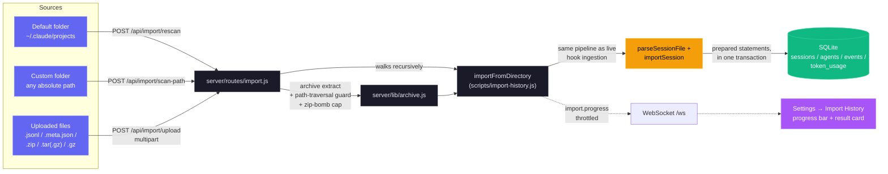
```mermaid
flowchart LR
    subgraph Sources
      A1["Default folder<br/>~/.claude/projects"]
      A2["Custom folder<br/>any absolute path"]
      A3["Uploaded files<br/>.jsonl / .meta.json /<br/>.zip / .tar(.gz) / .gz"]
    end

    A1 -->|POST /api/import/rescan| R["server/routes/import.js"]
    A2 -->|POST /api/import/scan-path| R
    A3 -->|POST /api/import/upload<br/>multipart| R

    R -->|archive extract<br/>+ path-traversal guard<br/>+ zip-bomb cap| X["server/lib/archive.js"]
    R -->|walks recursively| I["importFromDirectory<br/>(scripts/import-history.js)"]
    X --> I
    I -->|same pipeline as live<br/>hook ingestion| P["parseSessionFile +<br/>importSession"]
    P -->|prepared statements,<br/>in one transaction| D[("SQLite<br/>sessions / agents / events /<br/>token_usage")]
    I -.->|import.progress<br/>throttled| W["WebSocket /ws"]
    W -.-> U["Settings → Import History<br/>progress bar + result card"]

    style A1 fill:#6366f1,stroke:#818cf8,color:#fff
    style A2 fill:#6366f1,stroke:#818cf8,color:#fff
    style A3 fill:#6366f1,stroke:#818cf8,color:#fff
    style R fill:#1a1a28,stroke:#2a2a3d,color:#e4e4ed
    style X fill:#1a1a28,stroke:#2a2a3d,color:#e4e4ed
    style I fill:#1a1a28,stroke:#2a2a3d,color:#e4e4ed
    style P fill:#f59e0b,stroke:#fbbf24,color:#000
    style D fill:#10b981,stroke:#34d399,color:#fff
    style U fill:#a855f7,stroke:#c084fc,color:#fff
```

**Routes**

| Method | Path                    | Description                                                              |
| ------ | ----------------------- | ------------------------------------------------------------------------ |
| `GET`  | `/api/import/guide`     | OS-aware paths, archive command, supported extensions, step instructions |
| `POST` | `/api/import/rescan`    | Rescan the default `~/.claude/projects` directory                        |
| `POST` | `/api/import/scan-path` | Scan an absolute directory (body `{ path }`); walks recursively          |
| `POST` | `/api/import/upload`    | Multipart upload of `.jsonl`, `.meta.json`, `.zip`, `.tar(.gz)`, `.gz`   |

**Supported inputs.** Loose JSONL (`.jsonl`) session transcripts, their
companion `.meta.json` sidecars, and archives (`.zip`, `.tar`,
`.tar.gz`/`.tgz`, plain `.gz`) containing any nested directory layout.
Both canonical Claude Code layouts are recognized automatically:
`<project>/<sessionId>/subagents/agent-*.jsonl` (default) and
`<project>/subagents/<sessionId>/agent-*.jsonl` (alternative).

**Accuracy guarantees.** Sessions are deduplicated by UUID; re-running
the importer is always safe. The compaction `baseline_input` /
`baseline_output` / `baseline_cache_read` / `baseline_cache_write`
columns preserve token counts from before a transcript was compacted,
so re-ingesting a post-compaction JSONL never erases historical cost.
Event-level dedup uses a per-event-type high-water mark
(`MAX(created_at) GROUP BY event_type` for the session): on every
re-import only JSONL entries with `ts > cutoff[type]` are inserted, so
long-running sessions whose transcripts grow across multiple days
continue to receive Stop / PostToolUse / TurnDuration / ToolError
events without duplicating earlier work. `sessions.ended_at` is rolled
forward to the JSONL's last activity when it surpasses the stored
value, and message-count metadata is refreshed on every pass.

**Huge-transcript safety.** The shared transcript cache
(`server/lib/transcript-cache.js`) reads JSONL files in 4 MiB chunks
and decodes only one line at a time, so transcripts larger than V8's
max JS string length (~512 MiB on 64-bit Node 20) parse without
aborting the process with `FATAL ERROR: v8::ToLocalChecked Empty
MaybeLocal`. The same chunked path is used by hook ingestion, the
periodic compaction sweep, and the history importer — none of them
materialize the full file as a single JS string. Per-entry growable
arrays (`turnDurations`, `errors`, `compaction.entries`,
`usageExtras.*`) are tail-capped at `TRANSCRIPT_CACHE_MAX_ARRAY_LEN`
(default `1000`), with trimming applied during parse at a `2 × cap`
watermark so a fresh full-file parse on a multi-day session can't
build an unbounded transient before finalization.

**Safety.** Archive extraction validates every entry against path
traversal (absolute paths and `..` segments are rejected). A
configurable extraction cap (`CCAM_IMPORT_MAX_EXTRACT_BYTES`, default
4 GB) stops zip/tar/gzip bombs. Upload size is capped per file
(`CCAM_IMPORT_MAX_BYTES`, default 1 GB) and per request
(`CCAM_IMPORT_MAX_FILES`, default 2000). All staging directories are
per-request and reclaimed in `finally`, including when multer rejects
all files up front.

**Progress.** Import activity is broadcast over the existing WebSocket
as `import.progress` messages (`phase`: `start` / `scan` / `extract` /
`parse` / `complete` / `error`), throttled to avoid flooding the
channel on large imports.

**UI.** Use the **Settings → Import History** panel for a guided,
drag-and-drop experience with step-by-step instructions, live progress,
and a post-import summary showing imported / enriched / skipped /
error counts.

<p align="center">
  
</p>

### WebSocket

Connect to `ws://localhost:4820/ws` to receive real-time push messages:

```json
{
  "type": "agent_updated",
  "data": { "id": "...", "status": "working", "current_tool": "Edit" },
  "timestamp": "2026-03-05T15:43:01.800Z"
}
```

**Message types:** `session_created`, `session_updated`, `agent_created`, `agent_updated`, `new_event`, `alert_triggered`, `alert_updated`

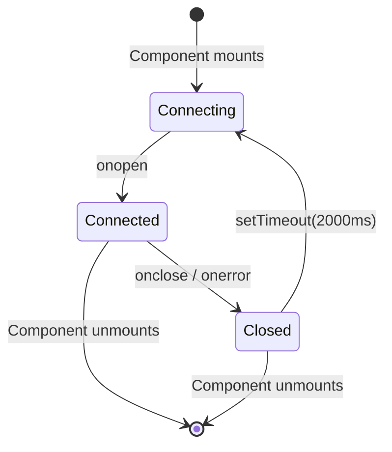
```mermaid
stateDiagram-v2
    [*] --> Connecting: Component mounts
    Connecting --> Connected: onopen
    Connected --> Closed: onclose / onerror
    Closed --> Connecting: setTimeout(2000ms)
    Connected --> [*]: Component unmounts
    Closed --> [*]: Component unmounts
```

---

## Hook Events

The dashboard processes these Claude Code hook types:

| Hook Type           | Trigger                        | Dashboard Action                                                                             |
| ------------------- | ------------------------------ | -------------------------------------------------------------------------------------------- |
| `SessionStart`      | Claude Code session begins     | Creates session and main agent. Stamps `awaiting_input_since` so a fresh session lands in **Waiting**. Reactivates resumed sessions. Abandons orphaned sessions with no activity for `DASHBOARD_STALE_MINUTES` (default 180) |
| `UserPromptSubmit`  | User hits enter on a prompt    | Clears the waiting flag and promotes the main agent to `working` — the only signal that text-only assistant turns have started, since they emit no `PreToolUse` |
| `PreToolUse`        | Agent starts using a tool      | Clears the waiting flag, sets agent to `working`, sets `current_tool`. If tool is `Agent`, creates a subagent record |
| `PostToolUse`       | Tool execution completed       | Clears the waiting flag (handles permission-prompt approvals where the Notification stamped it mid-tool). Clears `current_tool`. Agent stays `working` |
| `Stop`              | Claude finishes responding     | Non-error: main agent → `waiting` — Claude finished its turn, ball is in the user's court. `stop_reason=error`: marks the agent and session `error`. Background subagents keep running |
| `SubagentStop`      | Background agent finished      | Matches and completes the subagent by description, type, or task. Deliberately does NOT clear the waiting flag — a subagent finishing tells us nothing about the human. **Triggers a fire-and-forget JSONL scan** (`scanAndImportSubagents`) that emits per-tool `PreToolUse` + `PostToolUse` events under the subagent's own `agent_id` so the Timeline shows every tool the subagent ran, not just the spawn marker |
| `Notification`      | Agent notification             | Logs event. Permission/input-prompt messages set the agent to `waiting` and stamp `awaiting_input_since` (matched by pattern: `permission`, `waiting for input`, `needs your approval`, …). Compaction notifications are tagged as `Compaction` events. Triggers a browser notification if enabled |
| `SessionEnd`        | Claude Code CLI process exits  | Drops the waiting flag. If the session is already in `error`, the error state is preserved; otherwise marks all agents and the session as `completed` |
| `Compaction`   | `/compact` detected in JSONL   | Creates a compaction subagent (type `compaction`) and Compaction event. Detected via `isCompactSummary` entries in the transcript JSONL. Also detected by periodic scanner for active sessions |
| `APIError`     | API error in JSONL transcript  | Extracted from `isApiErrorMessage` entries (quota, rate limit, invalid_request) and raw `type: "error"` responses. **Now immediately marks the session and agent as `error`** — previously recorded as events without changing status. Stored as event with error details |
| `TurnDuration` | Turn timing in JSONL transcript| Extracted from `system` subtype `turn_duration` messages with `durationMs`. Stored as event for turn-level timing analysis |
| `ToolError`    | Tool result error in JSONL     | Extracted from `toolUseResult.is_error` entries. Tracks tool-level failures for error propagation analysis |
| `Interrupted`  | Turn cancelled by the user (Esc) | Synthesized by the watchdog — `Esc` fires no hook, so a stuck `working` session is detected from the transcript's `[Request interrupted by user]` marker or, when Esc preceded any output, from the idle-working timeout (`DASHBOARD_WORKING_IDLE_SECONDS`). The session moves to **Waiting** (same as a normal `Stop`) |

---

## Browser Notifications

The dashboard supports persistent browser notifications via Web Push (VAPID) for real-time alerts even when the dashboard tab is not focused or the browser is backgrounded.

### How It Works

1. **Enable** notifications in the Settings page via the master toggle
2. **Grant** browser permission when prompted — this registers a Service Worker and creates a push subscription
3. **Configure** which events trigger notifications:

| Event                        | Default | Description                                                     |
| ---------------------------- | ------- | --------------------------------------------------------------- |
| New session starts           | On      | Fires when a new Claude Code session is created                 |
| Claude finished responding   | Off     | Fires on `Stop` events when Claude finishes a response turn     |
| Session closed               | Off     | Fires on `SessionEnd` when the CLI process exits                |
| Session errors               | On      | Fires when a session ends with an error                         |
| Subagent spawned             | Off     | Fires when a background subagent is created                     |

Additionally, any `Notification` hook event from Claude Code triggers a browser notification regardless of the per-event toggles (as long as the master toggle is enabled).

### Notifications Architecture

- **VAPID Pipeline:** Uses `web-push` on the server for secure message delivery. VAPID keys are auto-generated and stored in `data/vapid-keys.json`.
- **Service Worker:** A dedicated worker (`client/public/sw.js`) handles incoming `push` events and displays notifications with `silent: false` to ensure audio playback on macOS.
- **Subscriptions:** Browser-specific endpoints are stored in the `push_subscriptions` table in SQLite.
- **Persistence:** Notifications arrive even if the browser is closed, as the Service Worker operates in the background.
- **Test notification:** button in Settings lets you verify the VAPID pipeline and audio playback.

### PWA & Offline Support

The project ships three independent Progressive Web Apps — one each for the **dashboard**, **landing page**, and **wiki**. Each has its own `manifest.json` and Service Worker so the browser treats them as separate installable applications.

| Surface | Manifest | Service Worker | Caching Strategy |
| --- | --- | --- | --- |
| Dashboard (`client/`) | `client/public/manifest.json` | `client/public/sw.js` | Vite's content-hashed bundles under `/assets/*` are served cache-first (URLs are immutable per build). Everything else — navigations, the SW itself, `manifest.json`, icons, root `/` — is network-first with cache fallback, so a rebuild always shows the freshest UI without a hard refresh. API (`/api/*`), WebSocket (`/ws`), and Vite HMR requests are never cached. Push notification handlers are preserved alongside the caching logic. The Express static middleware (`server/index.js`) reinforces this by sending `Cache-Control: public, max-age=31536000, immutable` for `/assets/*` and `Cache-Control: no-cache, must-revalidate` for `index.html`, `sw.js`, and `manifest.json`. `client/src/main.tsx` listens for `controllerchange`: when a new SW activates on an already-controlled page it reloads exactly once (first installs do not). |
| Landing page (root) | `manifest.json` | `sw.js` | Precaches the HTML shell, favicon, and OG image. Screenshot PNGs are lazy-cached on first view (cache-first) to avoid a heavy initial precache. Navigation is network-first with offline fallback. |
| Wiki (`wiki/`) | `wiki/manifest.json` | `wiki/sw.js` | Precaches `index.html`, `style.css`, `script.js`, manifest, and favicon. Fully offline-capable after one visit. Network-first HTML, cache-first for CSS/JS. |

**Cache lifecycle:** All three SWs call `skipWaiting()` on install and delete stale caches on activate (keyed by version strings like `dashboard-v2`, `landing-v1`, `wiki-v1`). Bumping the version constant forces a clean refresh.

**iOS support:** All three HTML files include `<meta name="apple-mobile-web-app-capable" content="yes">` and `<meta name="apple-mobile-web-app-status-bar-style" content="black-translucent">` for standalone home-screen mode on Safari.

**Icons:** Manifests reference `favicon.svg` with `sizes="any"` and `type="image/svg+xml"` — supported in Chrome 107+, Firefox 110+, Edge 107+. Apple touch icons also use the SVG favicon.

---

## Update Notifier

The dashboard watches its own git checkout and surfaces a modal whenever the canonical default branch has commits ahead of HEAD. **Branch- and fork-aware:** if you have an `upstream` remote (the standard convention for forks), it's preferred over `origin`; the chosen remote's `master`/`main`/`HEAD` is the comparison ref. The `manual_command` adapts to your situation — `git pull --ff-only` only when your branch actually tracks the canonical ref, otherwise a `git fetch` (and a fast-forward merge in the fork case) so the command never lies. Users get the exact command to run in a terminal — the server **never** pulls or restarts itself, which keeps the mechanism portable across dev sessions, pm2/systemd/launchd/Docker supervision, and remote deployments.

<p align="center">
  
</p>

### How It Works

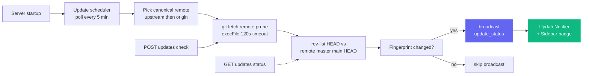
```mermaid
flowchart LR
    S["Server startup"] --> SCHED["Update scheduler<br/>poll every 5 min"]
    SCHED --> PICK["Pick canonical remote<br/>upstream then origin"]
    PICK --> FETCH["git fetch remote prune<br/>execFile 120s timeout"]
    FETCH --> CMP["rev-list HEAD vs<br/>remote master main HEAD"]
    CMP --> FP["Fingerprint changed?"]
    FP -->|yes| WS["broadcast<br/>update_status"]
    FP -->|no| IDLE["skip broadcast"]
    WS --> CLIENT["UpdateNotifier<br/>+ Sidebar badge"]

    CHECK["POST updates check"] --> FETCH
    STATUS["GET updates status"] -.-> CMP

    style WS fill:#6366f1,stroke:#818cf8,color:#fff
    style CLIENT fill:#10b981,stroke:#34d399,color:#fff
```

A single check is cheap (`git fetch <remote> --prune` against the canonical remote — `upstream` if configured, else `origin`), wrapped with `execFile` (no shell) and a 120s timeout. Failures — offline network, non-git install, no remotes configured, unresolvable upstream ref — all return **soft payloads** (e.g. `fetch_error: "..."`) rather than throwing, so a flaky remote never blocks the dashboard.

### UI Surfaces

| Surface | Behavior |
| --- | --- |
| **Modal** (`client/src/components/UpdateNotifier.tsx`) | Appears when `update_available === true` and the user hasn't already dismissed this specific `remote_sha`. Shows commits-behind, the tracked ref, an optional `situation_note` (when on a feature branch / fork the note explains why the command differs), the copy-pastable command, and three buttons: **Copy command** (primary), **Check now**, **Dismiss**. ESC and backdrop clicks dismiss. Keyed by `remote_sha` in `localStorage`, so a newer upstream commit re-opens the modal automatically. |
| **Sidebar button** (`client/src/components/Sidebar.tsx`) | Always-visible "Check for updates" button in the footer. Emerald border + green badge dot when behind, amber when the last check hit a fetch error. Clicking it clears any prior dismissal, then fires `POST /api/updates/check`. |
| **Server terminal** | When the scheduler transitions from "up to date" to "behind," it prints a framed block to stdout with the command so users running headless still see it. |

### API Surface

| Endpoint | Purpose |
| --- | --- |
| `GET /api/updates/status` | Read-only check: runs `git fetch` against the canonical remote, compares HEAD to its default branch, returns the payload. |
| `POST /api/updates/check` | Same check, but also broadcasts `update_status` over WebSocket so all connected clients update at once. |

Both endpoints return the same payload shape:

```json
{
  "git_repo": true,
  "update_available": true,
  "repo_root": "/Users/you/Claude-Code-Agent-Monitor",
  "remote_ref": "upstream/master",
  "canonical_remote": "upstream",
  "current_branch": "master",
  "tracking_upstream": "origin/master",
  "tracks_canonical": false,
  "situation": "fork_or_diverged_tracking",
  "local_sha": "abc1234...",
  "remote_sha": "def5678...",
  "commits_behind": 3,
  "manual_command": "cd \"/...\" && git fetch upstream && git merge --ff-only upstream/master && npm run setup",
  "situation_note": "You're on 'master' tracking 'origin/master'. This command fast-forwards your branch from upstream/master (the canonical default).",
  "message": "3 commit(s) on upstream/master not in your checkout."
}
```

`situation` is one of `tracking_canonical` (typical clone on the default branch — `git pull --ff-only` works), `fork_or_diverged_tracking` (local branch name matches canonical, but tracks a different remote — `git fetch <remote> && git merge --ff-only <ref>`), `feature_branch` (off the default branch — fetch only, integration left to the user), or `detached_head`.

### What's Intentionally **Not** Here

There is no `POST /api/updates/apply` and no self-restart helper, by design. Self-updating a process from inside itself is unreliable without an external supervisor — `npm run dev` (concurrently), `npm start`, `pm2`, `systemd`, `launchd`, and Docker each need different restart logic, and `git pull` / `npm install` failures on a dying server have no clean rollback path. Detection-only keeps behaviour predictable across every supervisor, every OS, and every branch state, while still closing the "when do I need to pull?" information gap; the user owns the actual update in their own shell.

### Configuration

| Env Var | Default | Notes |
| --- | --- | --- |
| `DASHBOARD_UPDATE_CHECK` | enabled | Set to `0` / `false` / `off` to disable the scheduler entirely. |
| `DASHBOARD_UPDATE_CHECK_INTERVAL_MS` | `300000` (5 min) | Interval between automatic checks. Floor is 60 000 ms — values below are clamped. |

---

## Tabby — Floating Cat Companion

**Tabby** is a cute floating cat companion pinned to the bottom-right corner of every page in the dashboard. Always present, it turns the live session stream into an at-a-glance, reactive mascot you can also talk to.

<p align="center">
  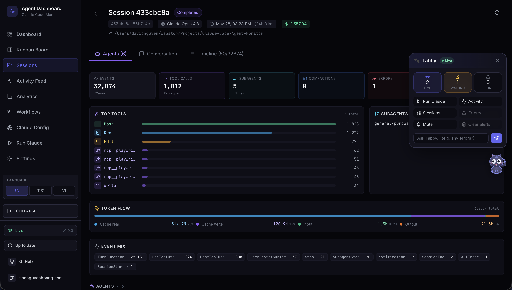
</p>

### Reactive mascot

Tabby is a cursor-tracking SVG cat with **eight moods** derived from the live session stream, each with its own animation:

| Mood | When | Animation |
| --- | --- | --- |
| `idle` | Nothing notable happening | Resting tail flick |
| `watching` | Sessions are active | Ear perk, eyes follow the cursor |
| `happy` | A session or run finished cleanly | Head bob + sparkle |
| `worried` | Something looks off | Subtle shake |
| `stuck` | A session appears blocked | Alert "!" |
| `thinking` | An agent is mid-work | Slow head bob |
| `sleeping` | Quiet for a while | `zzz` |
| `disconnected` | WebSocket is down | Calm, still pose |

### Speech bubbles

Tabby auto-surfaces short quips on notable events (session started/finished, errors, run completed). Bubbles are **throttled and coalesced** so a burst of events never spams the screen, they use `aria-live` for screen readers, and they can be **muted** from the panel.

### Panel

Open the panel by clicking the cat or pressing **⌘B / Ctrl+B** (Esc closes). It shows:

- A live **status line** — `N live · M errored · connection state`.
- **Quick actions** — jump to Run Claude, Activity, Sessions, or errored sessions; mute bubbles; clear alerts.
- An **Ask** box (see below).

### Ask box → Run Claude handoff

The **Ask** box answers simple status questions locally from cached data — for example "what's running", "any errors", or "status". Any other question is handed off to the existing **Run Claude** page (it deep-links to `/run?prompt=…`) to spawn a real Claude Code session. Tabby never calls an LLM itself; it simply reuses the Run Claude page for anything beyond a quick status lookup.

### Accessibility & safe degradation

Tabby is keyboard-operable, uses `aria-live` for its bubbles, and honors `prefers-reduced-motion`. If the WebSocket is down it degrades safely to a calm `disconnected` state rather than erroring. You can toggle Tabby on or off in **Settings** (localized in English, Chinese, and Vietnamese), and the implementation lives in `client/src/components/Tabby/`.

---

## Connection Status Modal

Click the **Live** / **Disconnected** pill in the sidebar footer to open a small details panel about the dashboard's WebSocket transport. It shows the active `ws://` endpoint, how long the current socket has been up, total events received, top event types as a horizontal bar chart, a 60-second throughput sparkline, and the last 8 events as a recent-activity list. Cumulative stats (totals, type breakdown, recent list) persist across reloads via `localStorage` under `sidebar-connection-stats`; the rolling sparkline and "connected since" timer are intentionally ephemeral. A **Reset** button in the footer clears everything on demand.

<p align="center">
  
</p>

---

## VS Code Extension

The **Claude Code Agent Monitor** is available as a first-class VS Code extension, allowing you to monitor your AI agents without leaving your editor.

<p align="center">
  
</p>

### 🚀 Key Features
- **Live Sidebar**: Dedicated Activity Bar view showing real-time Agent Health (Working, Waiting, Completed, etc.).
- **Usage Analytics**: Track total tokens, live USD costs, and event counts directly in the sidebar.
- **Status Bar Integration**: Quick-glance pulse monitor in the bottom bar showing active sessions and agents.
- **Deep Navigation**: One-click access to specific dashboard views (Kanban, Analytics, Settings) or recent sessions.
- **Integrated Tab**: Opens the full monitoring dashboard as a native VS Code webview tab.

### 📦 Installation & Setup
1. Open the [vscode-extension](./vscode-extension) directory.
2. Install the Marketplace extension or package it yourself using `vsce package`.
3. Ensure your local dashboard server is running (`npm run dev`).
4. Click the **Radar icon** in the VS Code Activity Bar to get started.

For detailed developer configuration, see the [.vscode](./.vscode) and [vscode-extension](./vscode-extension) directories.

> [!TIP]
> Extension on VS Code Marketplace: [Claude Code Agent Monitor](https://marketplace.visualstudio.com/items?itemName=hoangsonw.claude-code-agent-monitor)

---

## Desktop App (macOS & Windows)

The dashboard also ships as an optional **native desktop application** you install once and forget — a macOS `.app` (distributed as a `.dmg`) and a Windows `.exe` (an NSIS installer plus a no-install portable build). It lives in the `desktop/` workspace, a sibling of `client/`, `server/`, `mcp/`, and `vscode-extension/`, and is built with **Electron 35**.

<p align="center">
  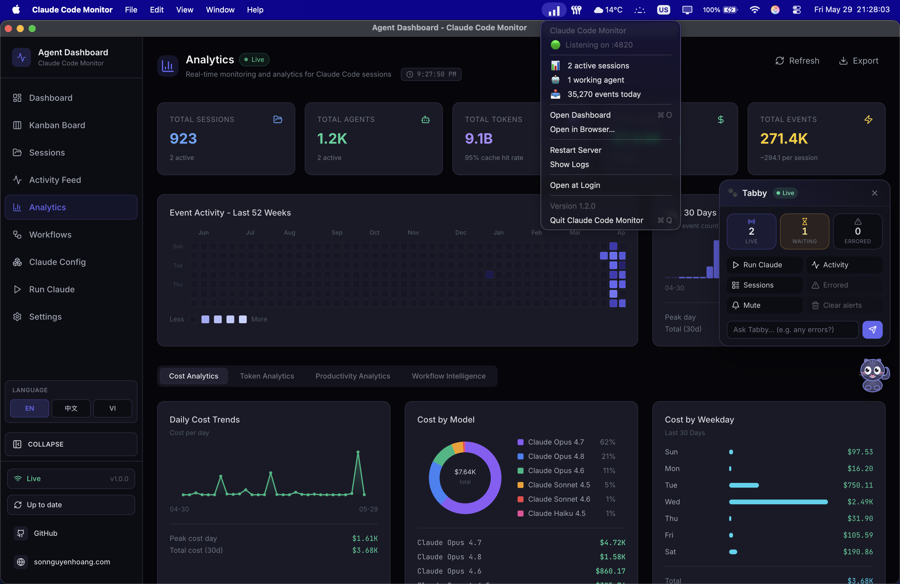
  <br>
  <em>🍎🪟 <strong>Desktop App</strong> — native shell with a menu-bar / notification-area (tray) icon, Open-at-Login, and a single-instance lock. The same dashboard, in a real OS window (macOS shown).</em>
</p>

<p align="center">
  
  <br>
  <em>🪟 The same dashboard as a native Windows app — notification-area (tray) icon, native window menu, and Open-at-Login.</em>
</p>

Everything you see in the browser at `localhost:4820` lives inside this window, with native OS lifecycle on top: a tray icon, a native application menu, auto-start integration, and a single quit button that cleanly shuts the server down.

### How it works

Unlike running the dashboard from a terminal, the desktop app needs no `npm start`, no open shell, and no second copy of the server. The Electron **main process** hosts the Express server **in-process** — it `require()`s `server/index.js` directly in the same Node runtime, with **no child process and no IPC** — and points a Chromium `BrowserWindow` at the built React client.

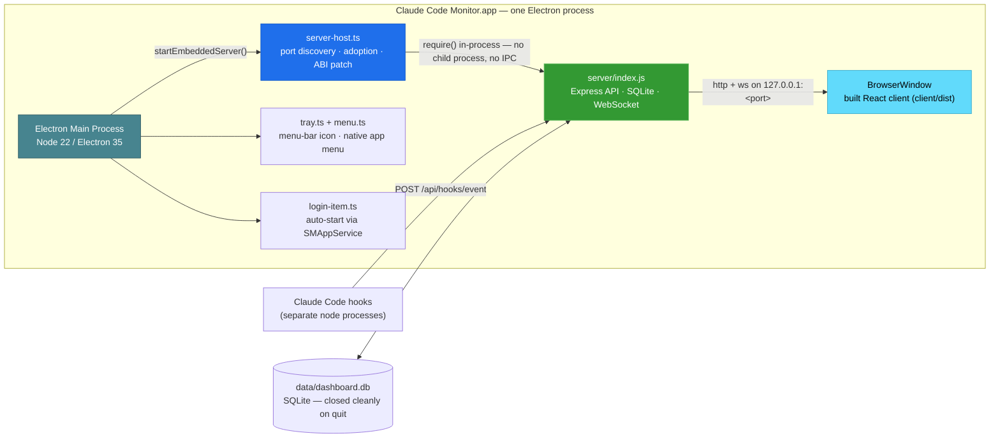
```mermaid
flowchart LR
    subgraph electron["Claude Code Monitor.app — one Electron process"]
        main["Electron Main Process<br/>Node 22 / Electron 35"]
        host["server-host.ts<br/>port discovery · adoption · ABI patch"]
        express["server/index.js<br/>Express API · SQLite · WebSocket"]
        win["BrowserWindow<br/>built React client (client/dist)"]
        tray["tray.ts + menu.ts<br/>menu-bar icon · native app menu"]
        login["login-item.ts<br/>auto-start via SMAppService"]
        main -->|"startEmbeddedServer()"| host
        host -->|"require() in-process — no child process, no IPC"| express
        main --> tray
        main --> login
        express -->|"http + ws on 127.0.0.1:&lt;port&gt;"| win
    end

    hooks["Claude Code hooks<br/>(separate node processes)"] -->|"POST /api/hooks/event"| express
    sqlite[("data/dashboard.db<br/>SQLite — closed cleanly on quit")] <--> express

    style main fill:#47848F,stroke:#2f5a62,color:#fff
    style express fill:#339933,stroke:#5cb85c,color:#fff
    style win fill:#61DAFB,stroke:#3aa9c9,color:#000
    style host fill:#1f6feb,stroke:#1158c7,color:#fff
```

On launch the app:

1. Picks a free port — preferring **4820**, falling back to **4821–4829**, then a random high port if all of those are taken.
2. If a healthy dashboard server already answers `/api/health` on `4820` (e.g. you ran `npm start` in a terminal), it **adopts that server** instead of double-binding — no port collision, no SQLite contention. An adopted server keeps running after you quit the app.
3. Otherwise it boots the embedded server, and on **first owned-server boot** auto-installs the Claude Code hooks and starts the background services (update scheduler, `cc-watcher`, orphaned-run reconciliation). A DMG-only user therefore gets events flowing with **zero manual setup** — no checkout, no `npm run install-hooks`.
4. **(macOS)** Recovers your **login-shell `PATH`** so the **Run Claude** feature can find and spawn the `claude` CLI — a Finder/Dock-launched app otherwise inherits only launchd's minimal `PATH` and would miss CLIs in `~/.local/bin`, `/opt/homebrew/bin`, version-manager bins, etc. (On Windows the process already inherits the user `PATH`.)
5. Opens the dashboard window — unless the app was launched at login (on macOS via Login Items; on Windows via the tagged `HKCU\…\Run` entry), in which case it stays tray-only.
6. On quit, shuts the embedded server down gracefully and **closes SQLite cleanly** (WAL checkpoint).

### Features

- **Tray icon** — always-on status surface (macOS menu bar / Windows notification area). Left-click toggles the dashboard window; right-click opens a context menu with **Open Dashboard**, **Open in Browser**, **Restart Server**, **Show Logs**, **Open at Login** (toggle), and **Quit**. macOS uses a tinted template glyph; Windows uses the colored `icon.ico` (a black template would vanish on the dark taskbar).
- **Window & taskbar icon** — the `BrowserWindow` is wired to the colored app logo (`icon.ico` on Windows, `icon.png` elsewhere), so the title bar / taskbar show the real Claude Code Monitor icon — even an unpackaged `npm run desktop:dev` run no longer shows the generic Electron icon.
- **Native application menu** — standard `About` / `File` / `Edit` / `View` / `Window` / `Help` menu with `⌘` / `Ctrl` shortcuts. The **File → Open Dashboard** item (`⌘1`) is **macOS-only**: macOS keeps a global menu bar after the window hides, so it can reopen the window — on Windows/Linux the menu is attached to the window and can't fire while it's hidden, so reopen from the tray's **Open Dashboard** instead (which reliably raises the window even when minimized or behind other windows).
- **Auto-start at login** — toggle **Open at Login** from the tray or app menu. On macOS it registers through the modern `SMAppService` API, so the entry appears under **System Settings → General → Login Items**; on Windows it writes a per-user `HKCU\Software\Microsoft\Windows\CurrentVersion\Run` entry, visible in **Task Manager → Startup**.
- **Window-close hides, server keeps running** — closing the window just hides it; the server and tray stay up. Click the tray to bring the window back.
- **Single-instance lock** — double-launching simply focuses the existing window; no second server, no port collision. (Applies on every platform.)
- **Data survives reinstalls and updates** — the SQLite database and VAPID keys live in the per-user app-data directory **outside the app bundle / install dir** — `~/Library/Application Support/Claude Code Monitor/data/` on macOS, `%APPDATA%\Claude Code Monitor\data\` on Windows. A packaged bundle is read-only, so writing the database inside it would break History Import and event persistence; keeping it in app-data fixes that and means your imported history is untouched when you replace or upgrade the app. (The Windows NSIS uninstaller keeps this data by default.)
- **`claude` CLI on PATH** — on macOS the app recovers your login-shell `PATH` at startup, so the **Run Claude** feature works even though a Finder/Dock-launched app would otherwise only inherit launchd's minimal `PATH`. (On Windows the inherited user `PATH` already includes it.)
- **Logs** — the main process writes to `~/Library/Logs/Claude Code Monitor/desktop.log` (macOS) or `%APPDATA%\Claude Code Monitor\logs\desktop.log` (Windows); reach it from the tray menu's **Show Logs**.

### Get it

**Option A — download a pre-built installer (recommended).** From **[Releases → latest](https://github.com/hoangsonww/Claude-Code-Agent-Monitor/releases/latest)** (public, no GitHub sign-in). CI auto-publishes a new `vX.Y.Z` release whenever the version in `package.json` is bumped on `master`, so this link always serves the current build:

| Platform | Asset | Notes |
| --- | --- | --- |
| macOS (Apple Silicon) | `ClaudeCodeMonitor-<ver>-arm64.dmg` | drag into `/Applications` |
| macOS (Intel) | `ClaudeCodeMonitor-<ver>-x64.dmg` | drag into `/Applications` |
| Windows (installer) | `ClaudeCodeMonitor-Setup-<ver>-x64.exe` | per-user install, no admin |
| Windows (portable) | `ClaudeCodeMonitor-<ver>-x64-portable.exe` | run without installing |

Per-commit fresh builds also live as CI artifacts (sign-in required, 14-day retention): `ClaudeCodeMonitor-dmg` from the `🍎 macOS Desktop (DMG)` job and `ClaudeCodeMonitor-win` from the `🪟 Windows Desktop (EXE)` job — useful for testing `master` before the next release tag.

**Option B — build it yourself.** From the repo root:

```bash
npm run setup                # install root + client deps, build client, install hooks
npm run build                # build the React client (client/dist)
npm run desktop:install      # install Electron + electron-builder into desktop/ (preflights native deps; prints setup help on failure)
npm run desktop:dmg:arm64    # macOS:   fast single-arch DMG → desktop/release/ClaudeCodeMonitor-<ver>-arm64.dmg
npm run desktop:win          # Windows: NSIS installer → desktop/release/ClaudeCodeMonitor-Setup-<ver>-x64.exe
```

> [!NOTE]
> **DMGs build on macOS; Windows `.exe`s build on Windows** — electron-builder packages for the host OS. The macOS universal `npm run desktop:dmg` build is intentionally **slow** (it builds the app twice and merges with `@electron/universal`); for your own Mac use the single-arch `desktop:dmg:arm64` / `desktop:dmg:x64`. On Windows, `better-sqlite3` is fetched as a prebuilt Electron binary by `npm run desktop:install`, so no Visual Studio C++ toolchain is needed in the common case. If the build does fail (no prebuilt binary, or a missing C++ toolchain), `desktop:install` prints the exact per-OS fix plus a no-toolchain alternative and fails loudly instead of leaving a broken install.

### Install it

**macOS:**

1. Double-click the `.dmg` to mount it.
2. Drag **Claude Code Monitor.app** into your `/Applications` folder.
3. The DMG is **ad-hoc signed** by default, so macOS Gatekeeper warns on first launch (*"Apple could not verify…"*). Clear the quarantine attribute:

   ```bash
   xattr -cr "/Applications/Claude Code Monitor.app"
   ```

   Or open **System Settings → Privacy & Security** and click **Open Anyway**.

4. Launch the app. The tray icon appears and the dashboard window opens.

**Windows:**

1. Run `ClaudeCodeMonitor-Setup-<ver>-x64.exe`. It installs **per-user** under `%LOCALAPPDATA%\Programs\Claude Code Monitor` (no administrator elevation) and lets you pick the install directory; or run the `*-portable.exe` to launch without installing.
2. The installer is **unsigned** by default, so Windows **SmartScreen** may show *"Windows protected your PC"* on first launch — click **More info → Run anyway**.
3. Launch from the Start menu / desktop shortcut. The notification-area (tray) icon appears and the dashboard window opens.

<p align="center">
  
  <br>
  <em>Windows installer · Step 1 — <strong>Choose Installation Options</strong> (per-user "Only for me" vs. all users).</em>
</p>

<p align="center">
  
  <br>
  <em>Windows installer · Step 2 — <strong>Choose Install Location</strong> (defaults to per-user <code>%LOCALAPPDATA%\Programs</code>).</em>
</p>

<p align="center">
  
  <br>
  <em>Windows installer · Step 3 — <strong>Completing Setup</strong> (Finish and launch the app).</em>
</p>

### Build commands

All commands run from the **repo root**:

| Command                     | What it does                                                                 |
| --------------------------- | ---------------------------------------------------------------------------- |
| `npm run desktop:install`   | Install Electron + electron-builder into `desktop/`; rebuild `better-sqlite3` for Electron's ABI; preflights the native `better-sqlite3` build and prints actionable setup help (incl. a no-toolchain alternative) on failure |
| `npm run desktop:build`     | Compile the desktop TypeScript sources into `desktop/out/`                    |
| `npm run desktop:dev`       | Build and launch the Electron app for local iteration                         |
| `npm run desktop:test`      | Run the smoke test (spawn Electron, probe `/api/health`, shut down)            |
| `npm run desktop:dmg`       | **macOS:** build the **universal** (x64 + arm64) DMG — correct for release, **slow** |
| `npm run desktop:dmg:arm64` | **macOS:** build an Apple-Silicon-only DMG — **fast** (~1 min), recommended for your own Mac |
| `npm run desktop:dmg:x64`   | **macOS:** build an Intel-only DMG — **fast** (~1 min)                         |
| `npm run desktop:win`       | **Windows:** build the NSIS installer `.exe` (x64)                             |
| `npm run desktop:win:portable` | **Windows:** build the no-install portable `.exe` (x64)                     |

The resulting macOS DMG is **~80 MB** (≈ 250 MB on disk once installed) and the Windows installer is comparable — the standard Electron bundle tax.

### Signing & notarization

The macOS DMG is **ad-hoc signed** by default so anyone can build a working `.app` without a paid Apple Developer account — the `package` script sets `CSC_IDENTITY_AUTO_DISCOVERY=false` so a code-signing certificate already in the contributor's keychain is never auto-picked. Real **Developer ID signing** is opt-in via `CSC_LINK` (a base64-encoded `.p12`) and `CSC_KEY_PASSWORD`; **Apple notarization** is opt-in via `APPLE_ID`, `APPLE_TEAM_ID`, and `APPLE_APP_SPECIFIC_PASSWORD`. The **Windows** build is **unsigned** by default (SmartScreen may prompt on first launch — *More info → Run anyway*); Authenticode signing activates only when an explicit certificate is provided via `CSC_LINK` + `CSC_KEY_PASSWORD`. CI picks all of these up automatically when provided — no code change required.

### Implementation notes

- **`better-sqlite3`** is the only native module in the dependency tree, and a native module must be compiled against the exact Node ABI it runs on. The `desktop/` workspace ships its **own copy** of `better-sqlite3` rebuilt for Electron's ABI and uses a process-local `require` redirect to point `server/db.js` at it; the repo-root copy stays built for system Node (so `npm run test:server` keeps working).
- **Building a DMG rebuilds `better-sqlite3` for the target architecture**, which can leave the desktop copy built for the other CPU arch and break `npm run desktop:dev` / `npm run desktop:test` with `ERR_DLOPEN_FAILED`. The desktop `prebuild` step now **auto-heals** the native module for the local machine on the next build, so the dev and smoke-test flows keep working after an arch-specific DMG build. The `prebuild` step also **fails fast with setup help** when the `better-sqlite3` native binary is missing entirely, turning a runtime crash into a copy-pasteable build-time error.
- The **only change outside `desktop/`** is a behavior-preserving refactor of `server/index.js`: its post-listen bootstrap (update scheduler, `cc-watcher`, orphaned-run reconciliation) was extracted into an exported `startBackgroundServices()` so the embedded server runs exactly what `node server/index.js` runs. The standalone `node server/index.js` path is functionally unchanged; `client/`, `scripts/`, `mcp/`, and `vscode-extension/` are untouched.
- Two path-filtered desktop CI jobs build, smoke-test, and package the app: **`🍎 macOS Desktop (DMG)`** on `macos-latest` (uploads the `ClaudeCodeMonitor-dmg` artifact — two single-arch DMGs) and **`🪟 Windows Desktop (EXE)`** on `windows-latest` (uploads the `ClaudeCodeMonitor-win` artifact — NSIS installer + portable). On a version-bump push to `master`, the `release` job attaches **both** the macOS DMGs and the Windows `.exe`s to the published `vX.Y.Z` GitHub Release. The Windows icon (`desktop/assets/icon.ico`) is committed to the repo (regenerate it from `icon.png` with `npm run build:win-icon`, PowerShell + .NET, no extra tooling).

For the full user guide (download, install, Gatekeeper / SmartScreen, tray menu, auto-start) see [`DESKTOP.md`](./DESKTOP.md); for the contributor / architecture reference (process model, boot lifecycle, port discovery, build pipeline — with Mermaid diagrams) see [`desktop/README.md`](./desktop/README.md).

---

## Data Storage

- **Engine:** SQLite 3 via `better-sqlite3` (optional) or Node.js built-in `node:sqlite`
- **Location:** `data/dashboard.db`
- **Journal mode:** WAL (concurrent reads during writes)
- **Reset:** Delete `data/dashboard.db` to clear all data

### Entity Relationship Diagram

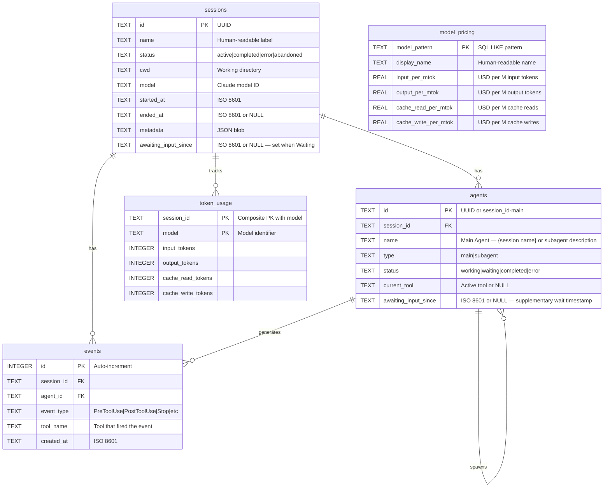
```mermaid
erDiagram
    sessions ||--o{ agents : has
    sessions ||--o{ events : has
    sessions ||--o{ token_usage : tracks
    agents ||--o{ events : generates
    agents ||--o{ agents : spawns

    sessions {
        TEXT id PK "UUID"
        TEXT name "Human-readable label"
        TEXT status "active|completed|error|abandoned"
        TEXT cwd "Working directory"
        TEXT model "Claude model ID"
        TEXT started_at "ISO 8601"
        TEXT ended_at "ISO 8601 or NULL"
        TEXT metadata "JSON blob"
        TEXT awaiting_input_since "ISO 8601 or NULL — set when Waiting"
    }

    agents {
        TEXT id PK "UUID or session_id-main"
        TEXT session_id FK
        TEXT name "Main Agent — {session name} or subagent description"
        TEXT type "main|subagent"
        TEXT status "working|waiting|completed|error"
        TEXT current_tool "Active tool or NULL"
        TEXT awaiting_input_since "ISO 8601 or NULL — supplementary wait timestamp"
    }

    events {
        INTEGER id PK "Auto-increment"
        TEXT session_id FK
        TEXT agent_id FK
        TEXT event_type "PreToolUse|PostToolUse|Stop|etc"
        TEXT tool_name "Tool that fired the event"
        TEXT created_at "ISO 8601"
    }

    token_usage {
        TEXT session_id PK "Composite PK with model"
        TEXT model PK "Model identifier"
        INTEGER input_tokens
        INTEGER output_tokens
        INTEGER cache_read_tokens
        INTEGER cache_write_tokens
    }

    model_pricing {
        TEXT model_pattern PK "SQL LIKE pattern"
        TEXT display_name "Human-readable name"
        REAL input_per_mtok "USD per M input tokens"
        REAL output_per_mtok "USD per M output tokens"
        REAL cache_read_per_mtok "USD per M cache reads"
        REAL cache_write_per_mtok "USD per M cache writes"
    }
```

---

## Plugin Marketplace

Extend Claude Code with official Agent Monitor plugins — analytics, productivity tools, developer utilities, AI-powered insights, dashboard connectivity, cost guardrails, session forensics, workflow orchestration, reliability/SLOs, and config governance. 10 plugins, 53 skills, 14 agents, 30 slash commands, 3 CLI tools, 3 hook configs, 1 MCP server.

### Add the marketplace

```bash
claude plugin marketplace add hoangsonww/Claude-Code-Agent-Monitor
```

### Available plugins

| Plugin | Install command | Skills |
|--------|----------------|--------|
| **ccam-analytics** | `claude plugin install ccam-analytics@hoangsonww-claude-code-agent-monitor` | `session-report`, `cost-breakdown`, `usage-trends`, `productivity-score` |
| **ccam-cost-guard** | `claude plugin install ccam-cost-guard@hoangsonww-claude-code-agent-monitor` | `budget-set`, `spend-forecast`, `cost-alert`, `model-savings`, `daily-budget-check` |
| **ccam-productivity** | `claude plugin install ccam-productivity@hoangsonww-claude-code-agent-monitor` | `daily-standup`, `weekly-report`, `sprint-summary`, `workflow-optimizer` |
| **ccam-devtools** | `claude plugin install ccam-devtools@hoangsonww-claude-code-agent-monitor` | `session-debug`, `hook-diagnostics`, `data-export`, `health-check` |
| **ccam-insights** | `claude plugin install ccam-insights@hoangsonww-claude-code-agent-monitor` | `pattern-detect`, `anomaly-alert`, `optimization-suggest`, `session-compare` |
| **ccam-sessions** | `claude plugin install ccam-sessions@hoangsonww-claude-code-agent-monitor` | `session-search`, `session-timeline`, `transcript-replay`, `cwd-rollup`, `session-cleanup` |
| **ccam-workflows** | `claude plugin install ccam-workflows@hoangsonww-claude-code-agent-monitor` | `dag-map`, `delegation-audit`, `concurrency-report`, `error-propagation`, `fleet-runs` |
| **ccam-quality** | `claude plugin install ccam-quality@hoangsonww-claude-code-agent-monitor` | `error-scan`, `api-error-report`, `hook-failure-audit`, `slo-check`, `regression-alert` |
| **ccam-config** | `claude plugin install ccam-config@hoangsonww-claude-code-agent-monitor` | `config-audit`, `memory-review`, `skill-inventory`, `mcp-audit`, `hook-inventory` |
| **ccam-dashboard** | `claude plugin install ccam-dashboard@hoangsonww-claude-code-agent-monitor` | `dashboard-status`, `quick-stats` + MCP server |

### CLI tools included

- `ccam-stats` — Terminal dashboard (sessions, costs, tokens with compaction baselines)
- `ccam-doctor` — System diagnostics (API, database, hooks, data freshness)
- `ccam-export` — Data export (JSON, CSV) for sessions, events, analytics, costs

### Example usage

```bash
# In Claude Code, after installing a plugin:
/ccam-analytics:session-report latest
/ccam-analytics:cost-breakdown this week
/ccam-productivity:daily-standup today
/ccam-insights:pattern-detect tools
/ccam-dashboard:quick-stats
```

> A server test (`server/__tests__/plugins-marketplace.test.js`) validates the marketplace ↔ `plugins/` directory bijection and every plugin's `plugin.json`, agents, skills, and commands.

📖 Full documentation: [docs/plugins.md](docs/PLUGINS.md)

---

## Statusline

A standalone CLI statusline utility for Claude Code that displays model name, user, working directory, git branch, context window usage bar, per-direction token counts, and session cost -- all color-coded with ANSI escape sequences.

```
nguyens6@host ~/agent-dashboard/client | Sonnet 4.6 | main | ████████░░ 79% | 3↑ 2↓ 156586c | $0.4231
```

| Segment     | Color                | Example                                                        |
| ----------- | -------------------- | -------------------------------------------------------------- |
| Model       | Cyan                 | `Sonnet 4.6`                                                   |
| User        | Green                | `nguyens6`                                                     |
| CWD         | Yellow               | `~/agent-dashboard`                                            |
| Git branch  | Magenta              | `main`                                                         |
| Context bar | Green / Yellow / Red | `████████░░ 79%`                                               |
| Tokens      | Green / Cyan / Dim   | `3↑ 2↓ 156586c` (green `↑` in, cyan `↓` out, dim `c` cache)    |
| Cost (USD)  | Green / Yellow / Red | `$0.4231` (session total — shown on API and subscription plans)|

Cost color thresholds: green under $5, yellow $5–$20, red $20+.

See [`statusline/README.md`](statusline/README.md) for installation instructions.

<p align="center">
  
</p>

---

## Server Architecture

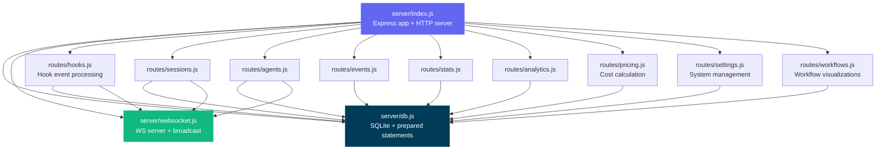
```mermaid
graph TD
    INDEX["server/index.js<br/>Express app + HTTP server"]
    DB["server/db.js<br/>SQLite + prepared statements"]
    WS["server/websocket.js<br/>WS server + broadcast"]
    HOOKS["routes/hooks.js<br/>Hook event processing"]
    SESSIONS["routes/sessions.js"]
    AGENTS["routes/agents.js"]
    EVENTS["routes/events.js"]
    STATS["routes/stats.js"]
    ANALYTICS["routes/analytics.js"]
    PRICING["routes/pricing.js<br/>Cost calculation"]
    SETTINGS["routes/settings.js<br/>System management"]
    WORKFLOWS["routes/workflows.js<br/>Workflow visualizations"]

    INDEX --> DB & WS
    INDEX --> HOOKS & SESSIONS & AGENTS & EVENTS & STATS & ANALYTICS & PRICING & SETTINGS & WORKFLOWS
    HOOKS --> DB & WS
    SESSIONS --> DB & WS
    AGENTS --> DB & WS
    EVENTS --> DB
    STATS --> DB
    ANALYTICS --> DB
    PRICING --> DB
    SETTINGS --> DB
    WORKFLOWS --> DB

    style INDEX fill:#6366f1,stroke:#818cf8,color:#fff
    style DB fill:#003B57,stroke:#005f8a,color:#fff
    style WS fill:#10b981,stroke:#34d399,color:#fff
```

---

## Client Routing

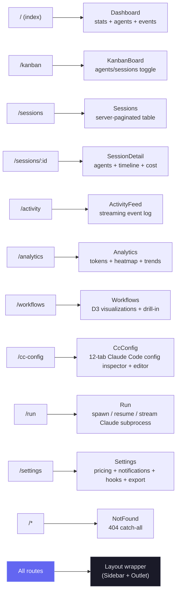
```mermaid
graph LR
    ROOT["/ (index)"] --> DASH["Dashboard<br/>stats + agents + events"]
    K["/kanban"] --> KANBAN["KanbanBoard<br/>agents/sessions toggle"]
    S["/sessions"] --> SESS["Sessions<br/>server-paginated table"]
    D["/sessions/:id"] --> DETAIL["SessionDetail<br/>agents + timeline + cost"]
    A["/activity"] --> ACT["ActivityFeed<br/>streaming event log"]
    AN["/analytics"] --> ANALYTICS["Analytics<br/>tokens + heatmap + trends"]
    WF["/workflows"] --> WORKFLOWS["Workflows<br/>D3 visualizations + drill-in"]
    CC["/cc-config"] --> CCCONFIG["CcConfig<br/>12-tab Claude Code config inspector + editor"]
    RUN["/run"] --> RUNPAGE["Run<br/>spawn / resume / stream Claude subprocess"]
    ST["/settings"] --> SETTINGS["Settings<br/>pricing + notifications + hooks + export"]
    NF["/*"] --> NOTFOUND["NotFound<br/>404 catch-all"]

    ALL["All routes"] --> LAYOUT["Layout wrapper<br/>(Sidebar + Outlet)"]

    style ALL fill:#6366f1,stroke:#818cf8,color:#fff
    style LAYOUT fill:#1a1a28,stroke:#2a2a3d,color:#e4e4ed
```

---

## Hook Handler Flow

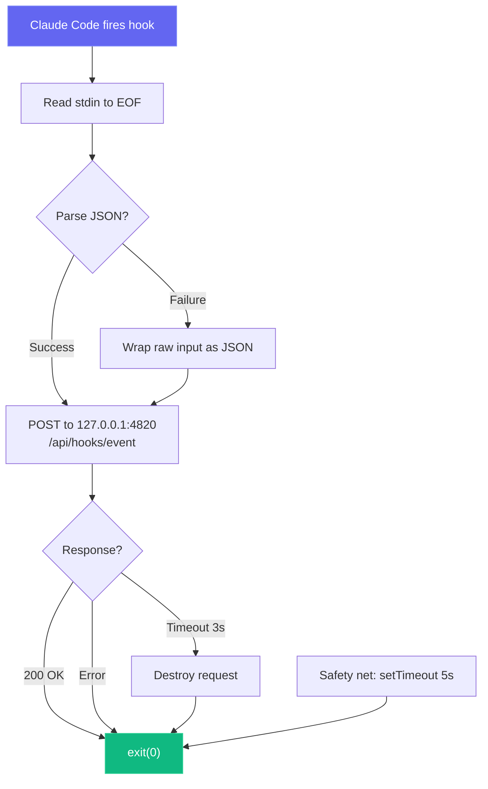
```mermaid
flowchart TD
    START["Claude Code fires hook"] --> STDIN["Read stdin to EOF"]
    STDIN --> PARSE{"Parse JSON?"}
    PARSE -->|Success| POST["POST to 127.0.0.1:4820<br/>/api/hooks/event"]
    PARSE -->|Failure| WRAP["Wrap raw input as JSON"]
    WRAP --> POST
    POST --> RESP{"Response?"}
    RESP -->|200 OK| EXIT0["exit(0)"]
    RESP -->|Error| EXIT0
    RESP -->|Timeout 3s| DESTROY["Destroy request"] --> EXIT0
    SAFETY["Safety net: setTimeout 5s"] --> EXIT0

    style EXIT0 fill:#10b981,stroke:#34d399,color:#fff
    style START fill:#6366f1,stroke:#818cf8,color:#fff
```

---

## Deployment Modes

We support both development and production deployment modes with different process architectures:

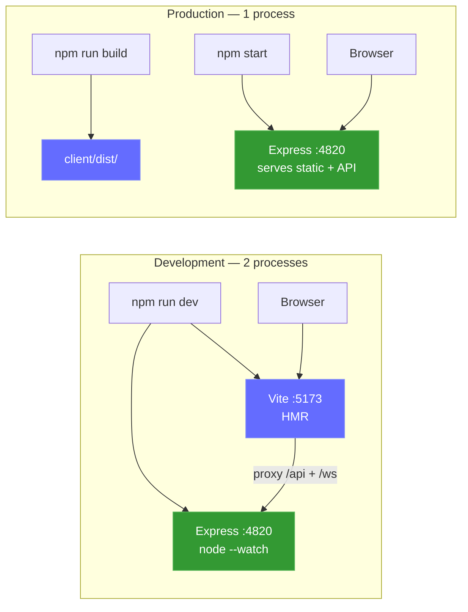
```mermaid
graph LR
    subgraph dev["Development — 2 processes"]
        D_CMD["npm run dev"] --> D_SRV["Express :4820<br/>node --watch"]
        D_CMD --> D_VITE["Vite :5173<br/>HMR"]
        D_BROWSER["Browser"] --> D_VITE
        D_VITE -->|"proxy /api + /ws"| D_SRV
    end

    subgraph prod["Production — 1 process"]
        P_BUILD["npm run build"] --> P_DIST["client/dist/"]
        P_START["npm start"] --> P_SRV["Express :4820<br/>serves static + API"]
        P_BROWSER["Browser"] --> P_SRV
    end

    style D_VITE fill:#646CFF,stroke:#818cf8,color:#fff
    style D_SRV fill:#339933,stroke:#5cb85c,color:#fff
    style P_SRV fill:#339933,stroke:#5cb85c,color:#fff
    style P_DIST fill:#646CFF,stroke:#818cf8,color:#fff
```

Optional local MCP sidecar (supports stdio, HTTP+SSE, and REPL transports):

```mermaid
graph LR
    subgraph "MCP Transport Options"
        M_STDIO["MCP Server (stdio)<br/>npm run mcp:start"]
        M_HTTP["MCP Server (HTTP)<br/>npm run mcp:start:http<br/>:8819"]
        M_REPL["MCP Server (REPL)<br/>npm run mcp:start:repl"]
    end

    H["MCP Host"] -->|"stdin/stdout"| M_STDIO
    RC["Remote Client"] -->|"POST /mcp · GET /sse"| M_HTTP
    OP["Operator"] -->|"interactive CLI"| M_REPL

    M_STDIO --> D["Dashboard Server<br/>:4820"]
    M_HTTP --> D
    M_REPL --> D

    style M_STDIO fill:#0f766e,stroke:#14b8a6,color:#fff
    style M_HTTP fill:#0f766e,stroke:#14b8a6,color:#fff
    style M_REPL fill:#0f766e,stroke:#14b8a6,color:#fff
```

Optional **desktop app (macOS & Windows)** — a single Electron process that hosts the Express server in-process (no terminal, no child process):

```mermaid
flowchart LR
    subgraph desktop["Desktop App (macOS & Windows) — 1 Electron process"]
        E_MAIN["Electron Main Process<br/>(Node 22 / Electron 35)"]
        E_HOST["server-host.ts<br/>require() server/index.js"]
        E_SRV["Embedded Express :4820<br/>API · SQLite · WebSocket"]
        E_WIN["BrowserWindow<br/>built React client"]
        E_TRAY["Menu-bar (tray) icon<br/>+ native app menu"]
        E_MAIN --> E_HOST
        E_HOST -->|"in-process require()"| E_SRV
        E_MAIN --> E_TRAY
        E_SRV -->|"http + ws on 127.0.0.1"| E_WIN
    end

    E_HOOKS["Claude Code hooks"] -->|"POST /api/hooks/event"| E_SRV

    style E_MAIN fill:#47848F,stroke:#2f5a62,color:#fff
    style E_SRV fill:#339933,stroke:#5cb85c,color:#fff
    style E_WIN fill:#61DAFB,stroke:#3aa9c9,color:#000
```

### Cloud Deployment

The `deployments/` directory provides cloud-agnostic, enterprise-grade infrastructure for deploying the dashboard to production. Supports Helm, Kustomize, and Terraform across AWS, GCP, Azure, and OCI with blue-green, canary, and rolling release strategies.

```mermaid
graph TB
  subgraph "Deployment Methods"
    HELM["⎈ Helm Chart<br/>Parameterized installs"]
    KUST["📦 Kustomize<br/>Overlay-based patching"]
    TF["🏗️ Terraform<br/>Full cloud provisioning"]
  end

  subgraph "Cloud Providers"
    AWS["☁️ AWS<br/>ECS Fargate + ALB"]
    GCP["☁️ GCP<br/>Cloud Run + GCLB"]
    AZ["☁️ Azure<br/>ACI + App Gateway"]
    OCI["☁️ OCI<br/>OKE + LBaaS"]
  end

  subgraph "Release Strategies"
    ROLL["Rolling Update"]
    BG["Blue-Green"]
    CAN["Canary + Analysis"]
  end

  subgraph "Observability"
    PROM["📊 Prometheus + Grafana"]
    CX["📡 Coralogix<br/>Logs · Metrics · Traces · SLOs"]
  end

  HELM & KUST --> ROLL & BG & CAN
  TF --> AWS & GCP & AZ & OCI
  ROLL & BG & CAN --> PROM & CX

  style HELM fill:#0f1689,color:#fff
  style KUST fill:#326ce5,color:#fff
  style TF fill:#7b42bc,color:#fff
  style AWS fill:#ff9900,color:#fff
  style GCP fill:#4285f4,color:#fff
  style AZ fill:#0078d4,color:#fff
  style OCI fill:#f80000,color:#fff
  style PROM fill:#e6522c,color:#fff
  style CX fill:#1a1a2e,color:#fff
```

```bash
# Helm (recommended for Kubernetes)
helm install agent-monitor deployments/helm/agent-monitor \
  -f deployments/helm/agent-monitor/values-production.yaml \
  -n agent-monitor --create-namespace

# Kustomize
kubectl apply -k deployments/kubernetes/overlays/production

# Terraform (full infra + app)
cd deployments/terraform/providers/aws
terraform init && terraform apply -var-file=../../environments/production/terraform.tfvars

# Script orchestrator
./deployments/scripts/deploy.sh --env production --method helm --strategy blue-green
```

The deployment stack includes CI/CD pipelines (GitHub Actions + GitLab CI), comprehensive monitoring (Prometheus, Grafana, Alertmanager with 13 alert rules, Coralogix full-stack observability with OpenTelemetry Collector for logs, metrics, traces, and SLO tracking), operational scripts (deploy, rollback, blue-green switch, backup/restore, teardown), and a full security posture (Restricted Pod Security Standard, TLS 1.3, network policies, Trivy scanning).

> [!NOTE]
> 📘 **Full deployment guide:** See [DEPLOYMENT.md](DEPLOYMENT.md) for step-by-step instructions, architecture diagrams, and operational workflows.

---

## Project Structure

```
agent-dashboard/
|-- CLAUDE.md                   # Claude Code project memory and working agreements
|-- AGENTS.md                   # Codex project instructions
|-- package.json                # Root scripts (dashboard + MCP helpers) + server dependencies
|-- .claude/
|   +-- rules/                  # Path-scoped Claude rules
|   +-- skills/                 # Claude reusable project skills
|   +-- agents/                 # Claude custom subagents
|-- .claude-plugin/
|   +-- marketplace.json        # Plugin marketplace manifest (10 plugins)
|-- plugins/
|   |-- ccam-analytics/         # Analytics: session reports, cost breakdown, usage trends, productivity score
|   |   |-- .claude-plugin/plugin.json
|   |   |-- skills/ (4)         # session-report, cost-breakdown, usage-trends, productivity-score
|   |   |-- agents/             # analytics-advisor (Sonnet model)
|   |   |-- hooks/hooks.json    # Stop + SubagentStop event logging
|   |   +-- bin/ccam-stats      # Terminal dashboard CLI
|   |-- ccam-productivity/      # Productivity: standups, reports, sprints, workflow optimizer
|   |-- ccam-devtools/          # DevTools: debug, diagnostics, export, health checks
|   |   +-- bin/                # ccam-doctor + ccam-export CLIs
|   |-- ccam-insights/          # Insights: patterns, anomalies, optimization, comparison
|   |-- ccam-cost-guard/        # Cost guardrails: budgets, spend forecast, cost alerts, model savings
|   |-- ccam-sessions/          # Session forensics: search, timeline, transcript replay, cwd rollup, cleanup
|   |-- ccam-workflows/         # Workflow orchestration: DAG map, delegation audit, concurrency, fleet runs
|   |-- ccam-quality/           # Reliability & SLOs: error scan, API-error report, hook-failure audit, SLO check
|   |-- ccam-config/            # Config & memory governance: config audit, memory review, skill/MCP/hook inventory
|   +-- ccam-dashboard/         # Dashboard connector: status, quick stats, MCP integration
|       +-- .mcp.json           # MCP server configuration
|-- server/
|   |-- index.js                 # Express app, HTTP server, static serving
|   |-- db.js                    # SQLite schema, migrations, prepared statements
|   |-- websocket.js             # WebSocket server with heartbeat
|   +-- routes/
|       |-- hooks.js             # Hook event processing (transactional)
|       |-- sessions.js          # Session CRUD
|       |-- agents.js            # Agent CRUD
|       |-- events.js            # Event listing
|       |-- stats.js             # Aggregate statistics
|       |-- analytics.js         # Token, tool, and trend analytics
|       |-- workflows.js         # Aggregate workflow data and per-session drill-in
|       |-- pricing.js           # Model pricing CRUD and cost calculation
|       +-- settings.js          # System info, data management, export, cleanup
|   +-- lib/
|       +-- transcript-cache.js  # Stat-based JSONL transcript cache with chunked sync byte-stream reader (4 MiB chunks, line-by-line UTF-8 decode) so files larger than V8's max string length (~512 MiB) parse without aborting Node with "FATAL ERROR: v8::ToLocalChecked Empty MaybeLocal". Extracts tokens, compactions, API errors, turn durations, thinking blocks, and usage extras (service_tier, speed, inference_geo)
|   +-- compat-sqlite.js         # node:sqlite compatibility wrapper (fallback for better-sqlite3)
|-- client/
|   |-- package.json             # Client dependencies
|   |-- index.html               # HTML entry point
|   |-- vite.config.ts           # Vite + proxy config
|   |-- tailwind.config.js       # Custom dark theme
|   |-- tsconfig.json            # Strict TypeScript
|   +-- src/
|       |-- main.tsx             # React entry
|       |-- App.tsx              # Router + WebSocket provider
|       |-- index.css            # Tailwind + custom utilities
|       |-- lib/
|       |   |-- types.ts         # Shared TypeScript interfaces
|       |   |-- api.ts           # Typed fetch client
|       |   |-- format.ts        # Date/time formatting utilities
|       |   +-- eventBus.ts      # Pub/sub for WebSocket distribution
|       |-- hooks/
|       |   |-- useWebSocket.ts      # Auto-reconnecting WebSocket hook
|       |   +-- useNotifications.ts  # Browser notification triggers from WebSocket events
|       |-- components/
|       |   |-- Layout.tsx       # Shell with sidebar + outlet
|       |   |-- Sidebar.tsx      # Navigation + connection indicator
|       |   |-- AgentCard.tsx    # Agent info card with status
|       |   |-- StatCard.tsx     # Metric card
|       |   |-- StatusBadge.tsx  # Color-coded status pills
|       |   |-- EmptyState.tsx   # Placeholder for empty lists
|       |   +-- workflows/       # D3.js workflow visualization components
|       |       |-- OrchestrationDAG.tsx            # Horizontal DAG of agent spawning patterns
|       |       |-- ToolExecutionFlow.tsx           # d3-sankey diagram of tool-to-tool transitions
|       |       |-- AgentCollaborationNetwork.tsx   # Force-directed agent pipeline graph
|       |       |-- SubagentEffectiveness.tsx       # Scorecard grid with SVG success rings
|       |       |-- WorkflowPatterns.tsx            # Auto-detected orchestration sequences
|       |       |-- ModelDelegationFlow.tsx         # Model routing through agent hierarchies
|       |       |-- ErrorPropagationMap.tsx         # Error clustering by hierarchy depth
|       |       |-- ConcurrencyTimeline.tsx         # Swim-lane parallel agent execution
|       |       |-- SessionComplexityScatter.tsx    # D3 bubble chart (duration vs agents vs tokens)
|       |       |-- CompactionImpact.tsx            # Token compression events and recovery
|       |       |-- WorkflowStats.tsx               # Aggregate workflow statistics
|       |       +-- SessionDrillIn.tsx              # Per-session agent tree, tool timeline, events
|       +-- pages/
|           |-- Dashboard.tsx      # Overview page
|           |-- KanbanBoard.tsx    # Agents/Sessions toggle, status columns
|           |-- Sessions.tsx       # Server-paginated sessions table
|           |-- SessionDetail.tsx  # Single session deep dive
|           |-- ActivityFeed.tsx   # Real-time event stream
|           |-- Analytics.tsx      # Token usage, heatmap, trends
|           |-- Workflows.tsx      # D3.js workflow visualizations and session drill-in
|           |-- Settings.tsx       # Model pricing, notifications, hooks, export, cleanup
|           +-- NotFound.tsx       # 404 catch-all page
|-- scripts/
|   |-- hook-handler.js          # Lightweight stdin-to-HTTP forwarder
|   |-- install-hooks.js         # Auto-configures ~/.claude/settings.json
|   |-- import-history.js        # Imports sessions from ~/.claude/ with enhanced JSONL extraction (API errors, turn durations, entrypoint, permission modes, thinking blocks, usage extras, tool errors, subagent JSONL files). Re-import is fully incremental: a per-event-type high-water mark (`MAX(created_at) GROUP BY event_type` per session) is computed up-front and only JSONL entries with `ts > cutoff[type]` are inserted, so long-running sessions whose transcripts grow across multiple days continue to receive Stop / PostToolUse / TurnDuration / ToolError events on every re-run. Also rolls `sessions.ended_at` forward when the JSONL advances past the stored value and refreshes message-count metadata on every pass
|   +-- seed.js                  # Sample data generator
|-- mcp/
|   |-- package.json             # MCP package scripts + dependencies
|   |-- README.md                # MCP setup, host config, tool catalog, safety model
|   |-- src/
|   |   |-- index.ts             # MCP runtime entrypoint (transport router)
|   |   |-- server.ts            # MCP server assembly
|   |   |-- clients/             # Dashboard API client with retry/backoff
|   |   |-- config/              # Environment/CLI config parsing
|   |   |-- core/                # Logger, tool registry, result helpers
|   |   |-- policy/              # Mutation/destructive guards
|   |   |-- tools/               # Domain-specific tool modules (6 domains)
|   |   |-- transports/          # HTTP+SSE server, REPL, tool collector
|   |   |-- ui/                  # ANSI banner, colors, formatter, tables
|   |   +-- types/               # Shared MCP type definitions
|   +-- build/                   # Built MCP runtime output
|-- desktop/
|   |-- package.json             # Electron + electron-builder dependencies and scripts
|   |-- electron-builder.yml     # DMG packaging config; signing/notarization hooks
|   |-- tsconfig.json            # Strict TypeScript (src/ -> out/)
|   |-- README.md                # Desktop app architecture reference (contributor docs)
|   |-- assets/                  # icon.svg + generated icon.icns + tray PNGs
|   |-- src/
|   |   |-- main.ts              # Electron main process entry — lifecycle, wiring
|   |   |-- server-host.ts       # In-process Express boot, port discovery, adoption, DB close
|   |   |-- window.ts            # BrowserWindow + persisted window geometry
|   |   |-- tray.ts              # Menu-bar (tray) icon + context menu
|   |   |-- menu.ts              # Native application menu (File ▸ Open Dashboard is macOS-only)
|   |   |-- login-item.ts        # macOS Login Items auto-start toggle (SMAppService)
|   |   |-- logger.ts            # File logger -> ~/Library/Logs/Claude Code Monitor/desktop.log
|   |   |-- constants.ts         # App name, ports, timeouts, window size
|   |   +-- preload.ts           # Intentionally empty (zero renderer privilege)
|   |-- scripts/
|   |   |-- install.js           # Preflights native deps for desktop:install; prints setup help + exits non-zero on failure
|   |   |-- preflight.js         # Shared better-sqlite3 binary check + actionable per-OS setup help (incl. no-toolchain alternative)
|   |   |-- prebuild.js          # Ensures root + client are built before tsc; fails fast with setup help if native binary missing
|   |   |-- build-icons.sh       # SVG -> PNG/ICNS via qlmanage/sips/iconutil
|   |   +-- notarize.js          # electron-builder afterSign hook (opt-in notarization)
|   +-- tests/
|       +-- smoke.test.mjs       # Spawn Electron + probe /api/health
|-- deployments/
|   |-- README.md                # Deployment infrastructure reference
|   |-- terraform/               # Cloud provisioning (AWS, GCP, Azure, OCI)
|   |   |-- modules/             # Reusable modules (networking, compute, db, lb, monitoring)
|   |   |-- providers/           # Cloud-specific implementations
|   |   +-- environments/        # Per-env tfvars (dev, staging, production)
|   |-- kubernetes/              # Kustomize manifests
|   |   |-- base/                # 11 base resources (deployment, service, ingress, hpa, etc.)
|   |   |-- overlays/            # Environment overlays (dev, staging, production)
|   |   |-- components/          # Optional add-ons (mcp-sidecar, monitoring)
|   |   +-- strategies/          # Blue-green and canary deployment strategies
|   |-- helm/agent-monitor/      # Helm chart with 12 templates and 4 value sets
|   |-- scripts/                 # Operational scripts (deploy, rollback, backup, teardown)
|   |-- monitoring/              # Prometheus, Grafana, Alertmanager, Coralogix (OTel Collector)
|   +-- ci/                      # CI/CD pipelines (GitHub Actions, GitLab CI)
|-- .codex/
|   |-- config.toml              # Codex runtime configuration
|   |-- README.md                # Codex setup guide for agents and skills
|   |-- rules/                   # Codex execution policy rules
|   |-- agents/                  # Codex custom agent templates
|   +-- skills/                  # Codex project skills
|-- statusline/
|   |-- README.md                # Statusline installation & usage guide
|   |-- statusline.py            # Python script that renders the statusline
|   +-- statusline-command.sh    # Shell wrapper for Claude Code's statusLine config
+-- data/
    +-- dashboard.db             # SQLite database (gitignored)
```

---

## Troubleshooting

| Problem                           | Solution                                                                                                                                                         |
| --------------------------------- | ---------------------------------------------------------------------------------------------------------------------------------------------------------------- |
| `better-sqlite3` fails to install | This is non-fatal — the server falls back to Node.js built-in `node:sqlite` automatically (Node 22+). On older Node versions, install Python 3 and C++ build tools, then run `npm rebuild better-sqlite3` |
| Hooks not firing                  | Run `npm run install-hooks` and restart Claude Code. Verify hooks exist in `~/.claude/settings.json`                                                             |
| Dashboard shows no data           | Ensure the server is running (`npm run dev`) before starting a Claude Code session. Check `http://localhost:4820/api/health`                                     |
| WebSocket disconnected            | The client auto-reconnects every 2 seconds. Check that port 4820 is not blocked by a firewall                                                                    |
| Stale data after restart          | The database persists across restarts. Run `npm run seed` for fresh demo data, or delete `data/dashboard.db` to reset                                            |
| MCP tools fail to connect         | Confirm dashboard API is up on `MCP_DASHBOARD_BASE_URL` and rebuild/start MCP (`npm run mcp:build`, `npm run mcp:start`)                                         |

---

## Contributing

Contributions are welcome — see [`.github/CONTRIBUTING.md`](.github/CONTRIBUTING.md) for the full guide.

All contributors must sign the [Contributor License Agreement](https://github.com/hoangsonww/Claude-Code-Agent-Monitor/blob/master/CLA.md). This is enforced automatically on every pull request by the `🖋️ CLA Assistant` GitHub Action: the first time you open a PR, a bot asks you to sign by commenting `I have read the CLA Document and I hereby sign the CLA`. The PR's **CLA Assistant** status check stays red until you do, and signing once covers all future contributions.

---

## License

MIT. See [LICENSE](LICENSE) for details.
