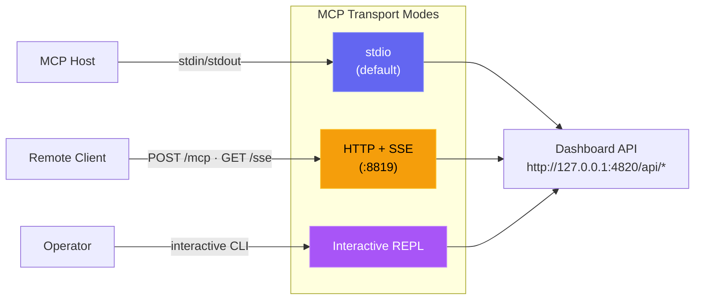
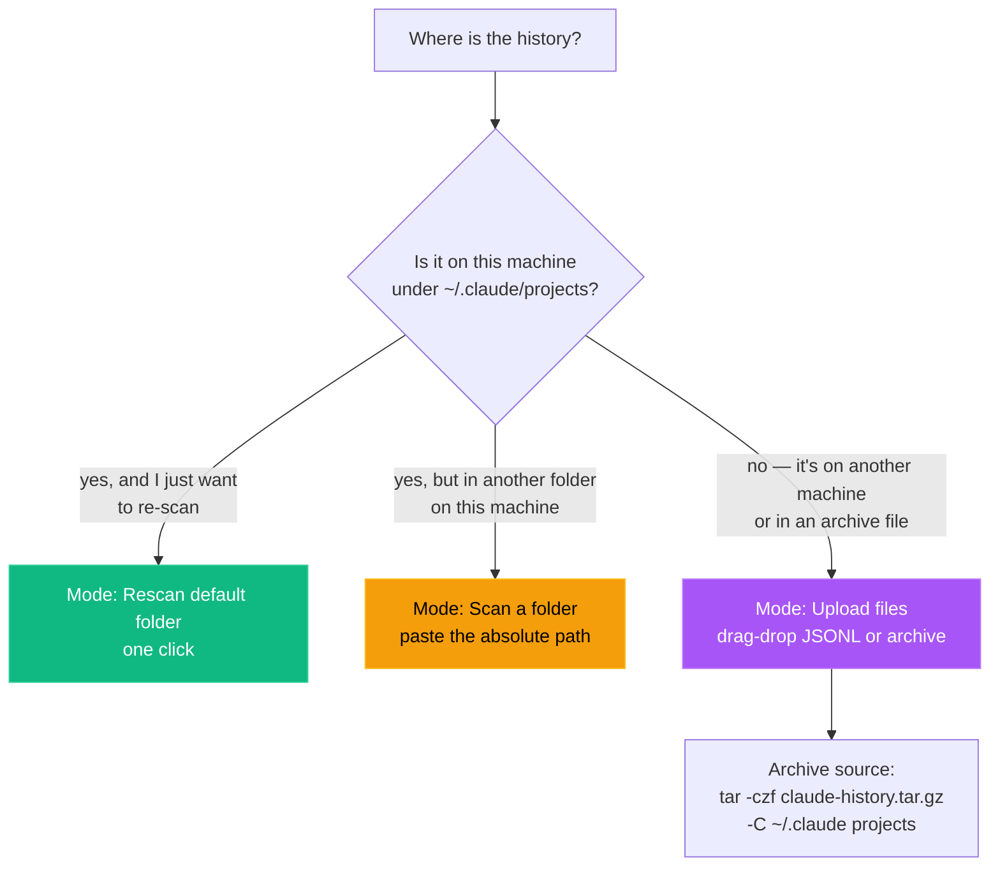

# Setup Guide

A comprehensive guide to setting up and configuring the Agent Dashboard, including how it integrates with Claude Code, environment variables, container deployment, and troubleshooting common issues.

## How it works

Agent Dashboard integrates with Claude Code through its native hook system. When Claude Code performs any action (session start, tool use, turn completion, subagent finish, session exit), it fires a hook that calls a small Node.js script bundled with this project. That script forwards the event over HTTP to the dashboard server, which stores it in SQLite and broadcasts it to the browser over WebSocket.

```
Claude Code  →  hook fires  →  hook-handler.js  →  POST /api/hooks/event
                                                         ↓
Browser  ←  WebSocket broadcast  ←  Express server  ←  SQLite
```

No extra Claude Code configuration is required in the normal host-run path — when you start the dashboard with `npm run dev` or `npm start`, the server configures the hooks automatically on startup. Container deployments are the exception: after the container is up, run `npm run install-hooks` on the host so Claude Code points at `http://localhost:4820`.

---

## Configuration

### Hook auto-installation

When the dashboard is running directly on the host, the server writes the following to `~/.claude/settings.json` every time it starts:

```json
{
  "hooks": {
    "SessionStart": [{ "hooks": [{ "type": "command", "command": "node \"/path/to/scripts/hook-handler.js\" SessionStart" }] }],
    "PreToolUse":   [{ "matcher": "*", "hooks": [{ "type": "command", "command": "node \"/path/to/scripts/hook-handler.js\" PreToolUse" }] }],
    "PostToolUse":  [{ "matcher": "*", "hooks": [{ "type": "command", "command": "node \"/path/to/scripts/hook-handler.js\" PostToolUse" }] }],
    "Stop":         [{ "matcher": "*", "hooks": [{ "type": "command", "command": "node \"/path/to/scripts/hook-handler.js\" Stop" }] }],
    "SubagentStop": [{ "matcher": "*", "hooks": [{ "type": "command", "command": "node \"/path/to/scripts/hook-handler.js\" SubagentStop" }] }],
    "Notification": [{ "matcher": "*", "hooks": [{ "type": "command", "command": "node \"/path/to/scripts/hook-handler.js\" Notification" }] }],
    "SessionEnd":   [{ "hooks": [{ "type": "command", "command": "node \"/path/to/scripts/hook-handler.js\" SessionEnd" }] }]
  }
}
```

> [!NOTE]
> Note: `SessionStart` and `SessionEnd` hooks do not support the `matcher` field — they fire unconditionally on every session start and exit.

Existing hooks in that file are preserved. The dashboard only adds or updates entries that contain `hook-handler.js`.

To re-run hook installation manually:

```bash
npm run install-hooks
```

> [!TIP]
> Container note: do not rely on hook auto-install from inside Docker or Podman. The hook path written by a container would point at the container filesystem, not the host. Start the container first, then run `npm run install-hooks` on the host. As a safeguard (issue #193), the installer now **detects container execution and refuses to run** (exiting non-zero) so it can never poison a bind-mounted host `~/.claude`; the containerized server logs the same guidance instead of silently writing a bad path. If you genuinely run Claude Code inside the same container, override with `CCAM_ALLOW_CONTAINER_HOOKS=1 npm run install-hooks`.

> [!NOTE]
> Prefer a ready-made dev environment? This repo ships an **optional** Dev Container (`.devcontainer/`) for VS Code / GitHub Codespaces — Node 22, native build tools for `better-sqlite3`, Python, and ports `4820`/`5173` preconfigured. It's purely opt-in and changes nothing for host-based development. See [`.devcontainer/README.md`](.devcontainer/README.md). (Hooks remain host-side there too.)

### Container runtime (Docker / Podman)

The repo includes both a multi-stage `Dockerfile` and a `docker-compose.yml` file. The container image serves the built client and API on port `4820`, stores SQLite data under `/app/data`, and can import legacy Claude history from a read-only `~/.claude` mount.

```bash
# Docker Compose
docker compose up -d --build

# Podman Compose
CLAUDE_HOME="$HOME/.claude" podman compose up -d --build

# Plain Docker
docker build -t agent-monitor .
docker run -d --name agent-monitor \
  -p 4820:4820 \
  -v "$HOME/.claude:/root/.claude:ro" \
  -v agent-monitor-data:/app/data \
  agent-monitor

# Plain Podman
podman build -t agent-monitor .
podman run -d --name agent-monitor \
  -p 4820:4820 \
  -v "$HOME/.claude:/root/.claude:ro" \
  -v agent-monitor-data:/app/data \
  agent-monitor
```

Container-specific behavior:

- The dashboard is available at `http://localhost:4820`
- `~/.claude:/root/.claude:ro` is used for history import only
- `agent-monitor-data:/app/data` persists the SQLite database
- Claude Code hooks still execute on the host, so install them from the host with `npm run install-hooks`

### Environment variables

| Variable | Default | Description |
|---|---|---|
| `DASHBOARD_PORT` | `4820` | Port the Express server listens on |
| `CLAUDE_DASHBOARD_PORT` | `4820` | Port the hook handler uses when posting events to the dashboard |
| `DASHBOARD_DB_PATH` | `data/dashboard.db` | Path to the SQLite database file |
| `NODE_ENV` | `development` | Set to `production` to serve built client |
| `CCAM_IMPORT_MAX_BYTES` | `1073741824` (1 GB) | Maximum size per uploaded file on `/api/import/upload` |
| `CCAM_IMPORT_MAX_FILES` | `2000` | Maximum number of files per upload request |
| `CCAM_IMPORT_MAX_EXTRACT_BYTES` | `4294967296` (4 GB) | Maximum uncompressed bytes any single archive is allowed to expand to (zip-bomb defense) |
| `MCP_DASHBOARD_BASE_URL` | `http://127.0.0.1:4820` | Base URL used by the local MCP server to call dashboard APIs |
| `MCP_DASHBOARD_ALLOW_MUTATIONS` | `false` | Enables mutating MCP tools |
| `MCP_DASHBOARD_ALLOW_DESTRUCTIVE` | `false` | Enables destructive MCP tools (in addition to mutations) |
| `MCP_TRANSPORT` | `stdio` | MCP transport mode: `stdio`, `http`, `repl` |
| `MCP_HTTP_PORT` | `8819` | Port for the MCP HTTP+SSE server (only when `MCP_TRANSPORT=http`) |
| `MCP_HTTP_HOST` | `127.0.0.1` | Bind address for the MCP HTTP server |

Example with a custom port:

```bash
DASHBOARD_PORT=9000 npm run dev
```

> [!NOTE]
> You usually do **not** need to set `DASHBOARD_PORT` manually. `npm run dev` is wrapped by `scripts/dev.js`, which probes both `127.0.0.1` and `::1` (so an SSH `LocalForward` bound to one loopback can't slip past) and picks the first free port in `4820–4859` automatically. The chosen port is propagated to the Vite dev proxy via `DASHBOARD_PORT`, and the Express server writes it to `~/.claude/.agent-dashboard.json` so the Claude Code hook handler discovers it without any env var.
>
> Multiple dashboards can run side by side — for example `npm run dev` and the desktop app (macOS or Windows) at the same time. Each one appends its `{port, pid, startedAt}` entry to the discovery file, and `scripts/hook-handler.js` fan-outs every hook event to every live entry, so both UIs keep their real-time stream.
>
> Setting `CLAUDE_DASHBOARD_PORT=N` overrides discovery entirely and forces the hook handler to a single port — useful for tests and container setups where the in-process discovery file isn't reachable from the host.
>
> If you bypass the picker (e.g. `npm run dev:raw`, container builds, or anything else that calls `node server/index.js` directly), make sure your client is built / proxied against the port the server actually bound.

### MCP server (optional)

The project includes a local MCP server under `mcp/` so AI agents can call dashboard operations through standardized tools. It supports three transport modes: stdio for MCP host integration, HTTP+SSE for networked clients, and an interactive REPL for operator debugging.



Quick start:

```bash
npm run mcp:install
npm run mcp:build
npm run mcp:start              # stdio (for Claude Code / Claude Desktop)
npm run mcp:start:http         # HTTP + SSE server on port 8819
npm run mcp:start:repl         # interactive CLI with tab completion
```

For full host config and tool catalog, see [mcp/README.md](./mcp/README.md).

### Agent extension setup (Claude Code + Codex)

This repository ships extension files for both agent ecosystems:

- Claude Code:
  - `CLAUDE.md`
  - `.claude/rules/*`
  - `.claude/skills/*`
  - `.claude/agents/*`
- Codex:
  - `AGENTS.md`
  - `.codex/config.toml`
  - `.codex/rules/default.rules`
  - `.codex/agents/*`
  - `.codex/skills/*`

See [`.codex/README.md`](./.codex/README.md) for Codex extension details.

### VS Code extension setup

The **Claude Code Agent Monitor** is available as an integrated VS Code extension for seamless monitoring within your editor.

- **Activity Bar View**: Adds a custom "Radar" icon to the activity bar providing real-time agent health, token counts, and session stats.
- **Status Bar Integration**: Displays live session and agent pulse counts in the bottom bar.
- **Embedded Dashboard**: Renders the full web dashboard directly in a VS Code editor tab.
- **Automated Detection**: Automatically finds your dashboard server on ports `5173` or `4820`.

<p align="center">
  
</p>

To install or develop the extension:
1. Open the [vscode-extension](./vscode-extension) directory in VS Code.
2. Run `npm install` and `npm run package` to generate a local `.vsix` installer.
3. For developer details, see [vscode-extension/README.md](./vscode-extension/README.md).

> [!TIP]
> Extension on VS Code Marketplace: [Claude Code Agent Monitor](https://marketplace.visualstudio.com/items?itemName=hoangsonw.claude-code-agent-monitor)

### PWA configuration (optional)

The dashboard, landing page, and wiki each ship as independent Progressive Web Apps. No configuration is required — manifests and service workers are included out of the box.

**Customising the manifest:** Edit the `manifest.json` in the relevant directory (`client/public/` for dashboard, root for landing, `wiki/` for wiki). Common fields to change:

- `name` / `short_name` — displayed on the home screen / dock
- `theme_color` — address bar / title bar tint (default: `#6366f1`)
- `background_color` — splash screen background
- `start_url` — entry point when launched from home screen

**Updating the service worker cache:** Each SW has a `CACHE_NAME` constant (e.g. `dashboard-v2`). After deploying new assets, bump the version string to force browsers to re-fetch — though for the dashboard this is rarely needed: hashed `/assets/*` URLs are immutable per build, everything else is fetched network-first with cache fallback, and a `controllerchange` listener in the client reloads the page exactly once when a new SW takes over, so a rebuild propagates without a hard refresh.

**Browser support:** PWA install prompts appear in Chrome 107+, Edge 107+, and Firefox 110+ (desktop and Android). Safari supports `apple-mobile-web-app-capable` for iOS home-screen mode but does not show an install banner.

**Verifying PWA status:** Open DevTools → Application → Manifest to confirm the manifest loads. Check the Service Workers section to verify the SW is registered and active. The Lighthouse PWA audit should pass all core checks.

### Desktop App Setup

The `desktop/` workspace ships the dashboard as a **native desktop app** for both **macOS** (a `.app` distributed as a `.dmg`) and **Windows** (an `.exe` — an NSIS installer plus a no-install portable build), built with Electron 35. It is an Electron shell that **embeds the existing Express server in-process** — it does not reimplement anything. For installation (download a pre-built installer from the [latest GitHub Release](https://github.com/hoangsonww/Claude-Code-Agent-Monitor/releases/latest) or the per-commit `ClaudeCodeMonitor-dmg` / `ClaudeCodeMonitor-win` CI artifact, or build one locally — then on macOS mount, drag, Gatekeeper bypass; on Windows run the installer / portable, SmartScreen bypass), see [INSTALL.md → Desktop App (macOS & Windows)](./INSTALL.md#desktop-app-macos--windows-optional). The full user guide is [`DESKTOP.md`](./DESKTOP.md); the contributor / architecture reference is [`desktop/README.md`](./desktop/README.md).

This section covers the parts of running the desktop app that matter for setup.

**Building and running.** All commands run from the repo root. electron-builder packages for the **host OS** — build the macOS DMG on a Mac (`desktop:dmg*`) and the Windows `.exe` on Windows (`desktop:win*`):

| Script | Command | Description |
|---|---|---|
| `desktop:install` | `npm run desktop:install` | Install Electron + electron-builder into `desktop/`; fetches `better-sqlite3` as a prebuilt Electron binary for Electron's ABI (no Visual Studio C++ toolchain needed in the common case; on macOS, Xcode CLI tools cover any fallback build). Preflights the native `better-sqlite3` build; on failure prints actionable per-OS setup help plus a no-toolchain alternative and exits non-zero (also enforced by the desktop `prebuild` gate) |
| `desktop:build` | `npm run desktop:build` | Prebuild guard + `tsc` → `desktop/out/` |
| `desktop:dev` | `npm run desktop:dev` | Build, then launch Electron against `out/main.js` |
| `desktop:test` | `npm run desktop:test` | Build, then run the smoke test (spawn Electron, probe `/api/health`) |
| `desktop:dmg` | `npm run desktop:dmg` | **macOS** — **Universal** (x64 + arm64) DMG → `desktop/release/`. Correct for release. **Slow.** |
| `desktop:dmg:arm64` | `npm run desktop:dmg:arm64` | **macOS** — Apple-Silicon-only DMG → `desktop/release/`. **Fast (~1 min).** |
| `desktop:dmg:x64` | `npm run desktop:dmg:x64` | **macOS** — Intel-only DMG → `desktop/release/`. **Fast (~1 min).** |
| `desktop:win` | `npm run desktop:win` | **Windows** — NSIS installer `.exe` (x64) → `desktop/release/`. |
| `desktop:win:portable` | `npm run desktop:win:portable` | **Windows** — no-install portable `.exe` (x64) → `desktop/release/`. |

> [!NOTE]
> Every `desktop:dmg*` / `desktop:win*` script chains `npm run build` first. Running `electron-builder` bare skips the TypeScript compile and fails with `entry file out/main.js does not exist`. `npm run clean` inside `desktop/` deletes `out/` and `release/` — after a clean you must `npm run desktop:build` again before packaging.

> [!TIP]
> On macOS, building a DMG rebuilds the native `better-sqlite3` module for the **target** architecture, which can leave it built for the wrong CPU arch for your local machine. The desktop `prebuild` step auto-heals this — it rebuilds `better-sqlite3` for the local machine on the next `desktop:build` — so `npm run desktop:dev` and `npm run desktop:test` keep working after a cross-arch DMG build with no manual `npm run desktop:install` needed.

**Hooks are auto-installed by the app.** On its first **owned-server** boot the desktop app writes the Claude Code hook configuration to `~/.claude/settings.json` itself, then starts the background services (update scheduler, `cc-watcher` config watcher, orphaned-run reconciliation) — the same `startBackgroundServices()` that `node server/index.js` runs. An install-only user (macOS or Windows) therefore never needs `npm run install-hooks` from a checkout: just **start a new Claude Code session** after the app is running. (If the app *adopts* an existing server instead of starting its own, that server already did its own hook bootstrap — see port adoption below.)

**Port-adoption behavior.** When the desktop app launches, its embedded server picks a port:

1. It prefers **`4820`**.
2. If a healthy dashboard server already answers `GET /api/health` on `4820` (for example you ran `npm start` in a terminal), the app **adopts that server** instead of double-binding — no SQLite contention. An adopted server is *not* owned by the app, so quitting the app leaves it running.
3. Otherwise it falls back to `4821`–`4829`, then to a random high port (`49152`–`49500`).

The chosen port is shown in the tray menu. The embedded server also honors the dashboard env vars in [Environment variables](#environment-variables) (`DASHBOARD_PORT` is set automatically by the desktop host).

**Data directory.** The packaged app stores its SQLite database and VAPID keys in a per-user app-data directory — `~/Library/Application Support/Claude Code Monitor/data/` on macOS, `%APPDATA%\Claude Code Monitor\data\` on Windows — **outside** the app bundle / install dir. The desktop host sets `DASHBOARD_DATA_DIR` to this per-user location automatically. Keeping writable state out of the bundle means a packaged, code-signed (and therefore read-only) `.app` never tries to write inside itself, and your imported history and events **survive app reinstalls and updates** (the Windows NSIS uninstaller keeps this data by default). (Older macOS builds kept the database inside the bundle, which broke History Import; after upgrading from a pre-fix build, re-run **Settings → Import History → Rescan** once to close the one-time data gap.)

**`claude` CLI resolution.** A Finder/Dock-launched macOS app inherits only launchd's minimal `PATH`, not your login-shell `PATH`. So the app can find and spawn the `claude` CLI for the "Run Claude" feature, the desktop host recovers your login-shell `PATH` at startup. (On Windows the process already inherits the user `PATH`, so no recovery is needed.) If "Run Claude" still reports that `claude` is not on `PATH`, make sure `claude` is a real executable on your shell `PATH` — a shell alias or function cannot be spawned.

**Auto-start at login.** Toggle *Open at Login* from the tray menu or the application menu. On macOS it registers via the first-party `SMAppService` API (Electron's `app.setLoginItemSettings`), so the entry appears under  → *System Settings → General → Login Items*. On Windows it writes a per-user `HKCU\Software\Microsoft\Windows\CurrentVersion\Run` entry, visible in *Task Manager → Startup*. When the app is launched at login, it starts **tray-only** — the dashboard window stays hidden until you click the tray icon.

**Logs.** The Electron main process has no terminal when launched from Finder / the Start menu, so it writes to a per-user log file:

```
~/Library/Logs/Claude Code Monitor/desktop.log     # macOS
%APPDATA%\Claude Code Monitor\logs\desktop.log      # Windows
```

Open it from the tray menu → **Show Logs**. Set `CCAM_DESKTOP_VERBOSE=1` to also mirror `info`/`warn` lines to stdout when running via `npm run desktop:dev`.

**Lifecycle reminder.** Closing the dashboard window only **hides** it — the server and tray keep running. **Quit** (⌘Q or tray → *Quit*) shuts the embedded server down gracefully and exits. Double-launching just focuses the existing window (single-instance lock); it never starts a second server.

---

## Database

The SQLite database is created automatically at `data/dashboard.db` on first run. The directory is created if it does not exist. The database uses WAL mode for concurrent reads and foreign keys for referential integrity.

### Clear all data

To remove all sessions, agents, events, and token usage (useful after running seed data or for a clean start):

```bash
npm run clear-data
```

### Data management via Settings page

The Settings page (`/settings`) provides a UI for:

- **Model Pricing** — view and edit per-model cost rates, reset to defaults, add custom models
- **Hook Configuration** — check which hooks are installed and reinstall them
- **Data Export** — download all sessions, agents, events, and pricing as a JSON file
- **Session Cleanup** — abandon stale active sessions after N hours, purge old completed sessions after N days
- **Clear All Data** — remove all sessions, agents, events, and token usage
- **Data Management** and **About** sections render with loading placeholders while server info is being fetched, so the page is always fully navigable

### Seed demo data

To populate the dashboard with sample sessions, agents, and events for UI exploration:

```bash
npm run seed
```

---

## Importing existing Claude Code history

The dashboard automatically imports sessions from `~/.claude/projects/` on
**every startup**, so if Claude Code has been used on this machine, you'll
see history immediately after the first launch. If you need to bring in
history from another machine, from a backup, or just force a rescan, use
**Settings → Import History** in the UI — it's a guided, drag-and-drop
experience with live progress.

<p align="center">
  
</p>

### Pick the right mode



### Step-by-step: moving history from one machine to another

**On the source machine**, bundle the projects folder:

```bash
# macOS / Linux
tar -czf claude-history.tar.gz -C ~/.claude projects

# Windows (PowerShell, via built-in tar)
tar -czf claude-history.tar.gz -C "$env:USERPROFILE\.claude" projects
```

Transfer the resulting `claude-history.tar.gz` to the destination machine
however you like — AirDrop, `scp`, USB, cloud storage.

**On the destination machine**, in the dashboard:

1. Open **Settings → Import History**.
2. Pick **Upload files** (the third tab).
3. Drag the archive onto the drop zone.
4. Click **Upload & Import** and watch the progress.
5. When the green result card appears, open **Analytics → Cost** to confirm
   per-model token totals and estimated cost.

### Supported inputs

Any of the following can be dropped onto the upload zone or found inside a
folder given to **Scan a folder**:

- `.jsonl` — session transcripts
- `.meta.json` — subagent metadata sidecars
- `.zip` — extracted with path-traversal protection
- `.tar`, `.tar.gz`, `.tgz` — extracted via the `tar` package
- `.gz` — single gzipped JSONL (streaming-decompressed)

### Accuracy guarantees

- **Idempotent** — re-importing never double-counts. Sessions are
  deduplicated by UUID.
- **Cost-preserving** — the `token_usage` table uses `baseline_*` columns
  to preserve pre-compaction token totals, so re-ingesting a compacted
  transcript never erases historical cost.
- **Same parser as live** — `parseSessionFile` + `importSession` is the
  single source of truth for both hook-driven ingestion and manual
  import, so imported numbers match captured numbers exactly.

### Safety

Archive extraction is hardened against path traversal and archive bombs.
The defaults are generous for real-world transcripts but tight enough to
stop obvious attacks; see the env vars table above for
`CCAM_IMPORT_MAX_BYTES`, `CCAM_IMPORT_MAX_FILES`, and
`CCAM_IMPORT_MAX_EXTRACT_BYTES`.

### CLI alternative

For scripts and automation, the same logic runs from the terminal:

```bash
# Import (or re-import) everything under ~/.claude/projects
npm run import-history

# Dry run — show what would be imported without writing
node scripts/import-history.js --dry-run

# Scope to a single project dir
node scripts/import-history.js --project my-project
```

---

## Scripts reference

| Script | Command | Description |
|---|---|---|
| `setup` | `npm run setup` | Install all dependencies (server + client) |
| `dev` | `npm run dev` | Start server + client in development mode |
| `start` | `npm start` | Start server in production mode |
| `build` | `npm run build` | Build the React client to `client/dist/` |
| `install-hooks` | `npm run install-hooks` | Write Claude Code hooks to `~/.claude/settings.json` |
| `clear-data` | `npm run clear-data` | Delete all data from the database |
| `seed` | `npm run seed` | Insert demo sessions/agents/events |
| `import-history` | `npm run import-history` | Import legacy sessions from `~/.claude/` (also runs on startup) |
| `mcp:install` | `npm run mcp:install` | Install MCP package dependencies |
| `mcp:build` | `npm run mcp:build` | Build MCP server into `mcp/build/` |
| `mcp:start` | `npm run mcp:start` | Start MCP server (stdio, for MCP hosts) |
| `mcp:start:http` | `npm run mcp:start:http` | Start MCP HTTP+SSE server on port 8819 |
| `mcp:start:repl` | `npm run mcp:start:repl` | Start interactive MCP REPL |
| `mcp:dev` | `npm run mcp:dev` | Start MCP server in dev mode (stdio) |
| `mcp:dev:http` | `npm run mcp:dev:http` | Start MCP HTTP server in dev mode |
| `mcp:dev:repl` | `npm run mcp:dev:repl` | Start MCP REPL in dev mode |
| `mcp:typecheck` | `npm run mcp:typecheck` | Type-check MCP source |
| `mcp:docker:build` | `npm run mcp:docker:build` | Build MCP container image with Docker |
| `mcp:podman:build` | `npm run mcp:podman:build` | Build MCP container image with Podman |
| `test:mcp` | `npm run test:mcp` | Run MCP server unit tests |
| `claude` | Claude CLI | Uses `CLAUDE.md`, `.claude/rules`, and `.claude/skills` automatically |
| `test` | `npm test` | Run all server and client tests |
| `test:server` | `npm run test:server` | Run server integration tests only |
| `test:client` | `npm run test:client` | Run client unit tests only |
| `format` | `npm run format` | Format all files with Prettier |
| `format:check` | `npm run format:check` | Check formatting without writing |

---

## Makefile targets

All npm scripts are mirrored as `make` targets for convenience. Run `make help` to list them:

```bash
make help
```

Commonly used targets:

| Make target | Equivalent npm command | Description |
|---|---|---|
| `make setup` | `npm run setup` + MCP install | Install all dependencies (root + client + MCP) |
| `make dev` | `npm run dev` | Start server + client in watch mode |
| `make build` | `npm run build` | Build the React client for production |
| `make start` | `npm start` | Start the production server |
| `make prod` | `npm run build && npm start` | Build then start in one step |
| `make test` | `npm test` | Run all tests (server + client) |
| `make test-server` | `npm run test:server` | Run server tests only |
| `make test-client` | `npm run test:client` | Run client tests only |
| `make format` | `npm run format` | Format all files with Prettier |
| `make format-check` | `npm run format:check` | Check formatting without writing |
| `make mcp-build` | `npm run mcp:build` | Compile MCP TypeScript |
| `make mcp-typecheck` | `npm run mcp:typecheck` | Type-check MCP source |
| `make seed` | `npm run seed` | Load demo data |
| `make clear-data` | `npm run clear-data` | Delete all data rows |
| `make docker-up` | `docker compose up -d` | Start via docker-compose |
| `make docker-down` | `docker compose down` | Stop docker-compose stack |

---

## Statusline (optional)

The `statusline/` directory contains a standalone terminal statusline for Claude Code showing model, working directory, git branch, context window usage, and token counts. It is independent of the web dashboard.

See [statusline/README.md](./statusline/README.md) for installation instructions.

---

## Troubleshooting

### `better-sqlite3` errors during `npm install` / `npm run setup`

These warnings are **harmless**. `better-sqlite3` is an optional dependency — if it cannot compile, npm skips it and the server falls back to Node.js built-in `node:sqlite` (available on Node 22+).

You do **not** need Python, Visual Studio Build Tools, or any C++ compiler to run this project on Node 22+.

If you are on Node 18 or 20 and `better-sqlite3` prebuilds are not available for your platform, you have two options:

1. **Upgrade to Node.js 22+** — the built-in `node:sqlite` fallback requires no native compilation at all
2. **Install build tools** and run `npm rebuild better-sqlite3`:
   - **Windows:** install [Visual Studio Build Tools](https://visualstudio.microsoft.com/visual-cpp-build-tools/) with the C++ workload
   - **macOS:** `xcode-select --install`
   - **Linux:** `sudo apt install python3 make g++` (Debian/Ubuntu)

### "SQLite backend not available" error on startup

This means neither `better-sqlite3` nor `node:sqlite` could be loaded. The most common cause is running Node.js < 22 without `better-sqlite3` prebuilds. Upgrade to Node.js 22+ to resolve this.

### Database is locked / busy errors

The SQLite database uses WAL mode with a 5-second busy timeout. If you see lock errors:

- Ensure only one dashboard server instance is running
- Check for zombie `node server/index.js` processes: `ps aux | grep server/index`
- Delete `data/dashboard.db-wal` and `data/dashboard.db-shm` if the server was killed uncleanly, then restart

---

### No sessions appearing after starting Claude Code

**Check 1 — Is the server running?**

```bash
curl http://localhost:4820/api/health
# Expected: {"status":"ok","timestamp":"..."}
```

**Check 2 — Are hooks installed?**

Open `~/.claude/settings.json` and confirm it contains a `hooks` section with entries referencing `hook-handler.js`. If not, run:

```bash
npm run install-hooks
```

**Check 3 — Did you start a new Claude Code session after the server started?**

Hooks only apply to sessions started after installation. Restart Claude Code.

**Check 4 — Is Node.js in PATH when Claude Code runs hooks?**

On some systems, the shell environment when Claude Code fires hooks may not include the full PATH. Test with:

```bash
node --version
```

If Node.js is not found, use the full path to `node` in the hook command. Edit `scripts/install-hooks.js`, replace `node` with the absolute path (e.g. `/usr/local/bin/node`), and re-run `npm run install-hooks`.

---

### Dashboard shows "Disconnected" in the sidebar

The WebSocket connection to the server failed. Ensure the server is running:

```bash
npm run dev
```

The client will automatically reconnect every 2 seconds once the server is available.

---

### Events Today shows 0 despite recent activity

This was a known timezone bug (fixed in current version). If you are still seeing this, ensure you are running the latest code and restart the server.

---

### Port 4820 already in use

```bash
DASHBOARD_PORT=4821 npm run dev
```

Then update the Vite proxy in `client/vite.config.ts`:

```ts
proxy: {
  "/api": "http://localhost:4821",
  "/ws":  { target: "ws://localhost:4821", ws: true }
}
```

And make sure Claude Code posts hooks to the new port:

```bash
CLAUDE_DASHBOARD_PORT=4821 claude
# or edit scripts/hook-handler.js and change the default port
```

---

### Docker / Podman container starts but no sessions appear

**Check 1 — Is the container healthy?**

```bash
curl http://localhost:4820/api/health
# Expected: {"status":"ok","timestamp":"..."}
```

**Check 2 — Did you install hooks on the host?**

Hooks run on the host machine, not inside the container. After the container is up:

```bash
npm run install-hooks
```

**Check 3 — Are hooks pointing to the right port?**

Open `~/.claude/settings.json` and verify the hook commands reference `localhost:4820` (or whatever port the container is mapped to). If you changed the port mapping, update hooks accordingly.

---

### Docker build fails during `npm ci`

If the build fails in Stage 1 with `better-sqlite3` errors, this is expected and should not block the build — `better-sqlite3` is an optional dependency. If the build still fails:

- Ensure you are using the latest Dockerfile (it should use `node:22-alpine` and **not** install `python3`, `make`, or `g++`)
- Run `docker build --no-cache -t agent-monitor .` to force a clean rebuild
- Check that `package.json` has `better-sqlite3` under `optionalDependencies`, not `dependencies`

---

### macOS desktop app — `npm run desktop:dmg` is extremely slow

This is expected. The universal DMG build compiles and packages the app **twice** (once per architecture), then `@electron/universal` merges both trees and signs every binary — gigabytes of disk I/O. The silent `packaging arch=universal` step can sit for several minutes; it is not hung.

For a build that targets your own Mac, use a single-arch command instead — it skips the merge and finishes in roughly a minute:

```bash
npm run desktop:dmg:arm64   # Apple Silicon
npm run desktop:dmg:x64     # Intel
```

CI already produces the universal DMG — pulled either from the [latest GitHub Release](https://github.com/hoangsonww/Claude-Code-Agent-Monitor/releases/latest) (CI auto-publishes a `vX.Y.Z` when `package.json` is bumped on `master`) or from the per-commit `ClaudeCodeMonitor-dmg` workflow artifact — so you rarely need to build it locally.

---

### Desktop app — `entry file out/main.js does not exist`

You ran `electron-builder` without a TypeScript compile. `npm run clean` (in `desktop/`) deletes `out/`, and `electron-builder` only packages — it does not compile. Re-run `npm run desktop:build` first, or use a `desktop:dmg*` / `desktop:win*` script (each one chains `npm run build` for you). Never invoke `electron-builder` bare.

---

### macOS desktop app — Gatekeeper blocks the app on first launch

The DMG is **ad-hoc signed** by default (the project ships no paid Apple Developer ID), so macOS shows *"Apple could not verify…"* the first time you open the app. Strip the quarantine attribute:

```bash
xattr -cr "/Applications/Claude Code Monitor.app"
```

Or open  → *System Settings → Privacy & Security* and click *Open Anyway*. Real Developer ID signing and notarization are opt-in via the `CSC_LINK` / `CSC_KEY_PASSWORD` and `APPLE_ID` / `APPLE_TEAM_ID` / `APPLE_APP_SPECIFIC_PASSWORD` repository secrets — see [`DESKTOP.md`](./DESKTOP.md#notarization-for-the-maintainer).

---

### Windows desktop app — SmartScreen blocks the app on first launch

The Windows `.exe` (NSIS installer and portable build) is **unsigned** by default, so Windows SmartScreen shows *"Windows protected your PC"* the first time you run it. Click **More info → Run anyway**. Authenticode signing is opt-in via the `CSC_LINK` / `CSC_KEY_PASSWORD` repository secrets — CI picks them up automatically when provided.

---

### Desktop app — no sessions appearing

The desktop app installs hooks on its **first owned-server boot**, not before. After the app is running, start a **new** Claude Code session and confirm `~/.claude/settings.json` contains entries referencing `hook-handler.js`. If the app adopted an existing server on `4820`, that server's own hook configuration applies instead. For a blank dashboard window, check the desktop log (`~/Library/Logs/Claude Code Monitor/desktop.log` on macOS, `%APPDATA%\Claude Code Monitor\logs\desktop.log` on Windows) via tray → *Show Logs* and use tray → *Restart Server*.
