# Client Application

Enterprise-grade React + TypeScript dashboard for real-time Claude Code agent monitoring.


---

## Table of Contents

- [Overview](#overview)
- [Architecture](#architecture)
- [Component Hierarchy](#component-hierarchy)
- [State Management](#state-management)
- [WebSocket Integration](#websocket-integration)
- [Routing](#routing)
- [API Client](#api-client)
- [UI Components](#ui-components)
- [Utilities](#utilities)
- [Testing](#testing)
- [Build & Deployment](#build--deployment)
- [Development](#development)
- [Performance](#performance)
- [Accessibility](#accessibility)

---

## Overview

The client is a single-page application (SPA) built with modern web technologies:

- **React 18.3** - Component-based UI with hooks and concurrent features
- **TypeScript 5.7** - Full type safety across components, utilities, and API contracts
- **Vite 6.1** - Lightning-fast HMR during development, optimized production builds
- **Tailwind CSS 3.4** - Utility-first CSS framework for rapid UI development
- **React Router 6.28** - Client-side routing with nested layouts
- **WebSocket** - Real-time event streaming from server
- **Lucide Icons** - Modern, consistent icon set

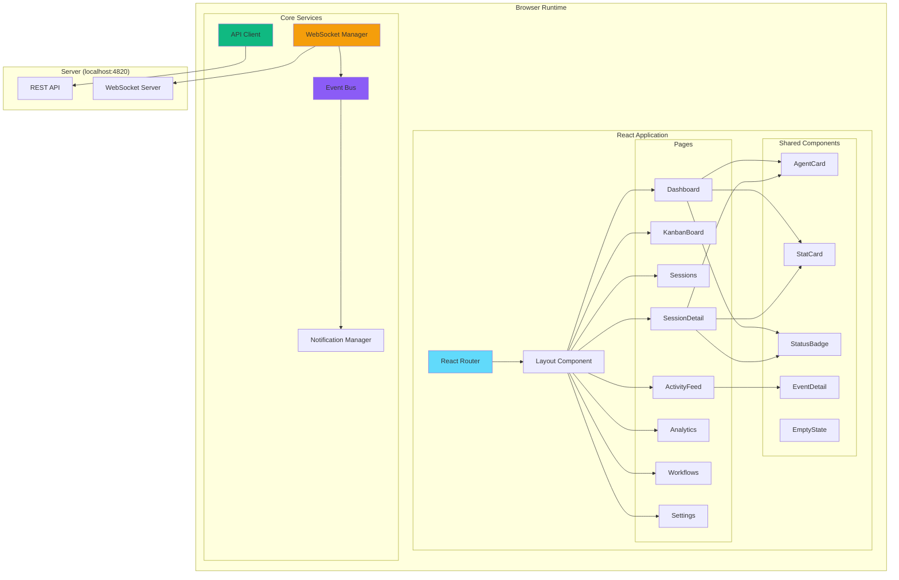

---

## Architecture

### Component Architecture

The client follows a layered architecture with clear separation of concerns:

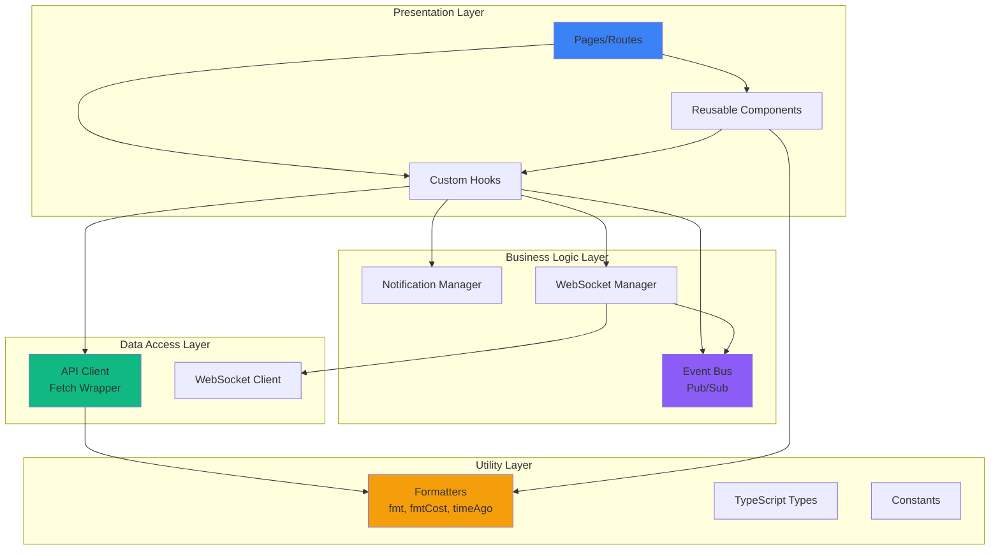

### Directory Structure

```
client/
├── src/
│   ├── components/         # Reusable UI components
│   │   ├── __tests__/      # Component tests
│   │   ├── AgentCard.tsx
│   │   ├── StatCard.tsx
│   │   ├── StatusBadge.tsx
│   │   ├── EventDetail.tsx  # Inline hook payload viewer (used by ActivityFeed + SessionDetail)
│   │   ├── EmptyState.tsx
│   │   ├── Sidebar.tsx
│   │   ├── Layout.tsx
│   │   └── workflows/      # D3.js workflow visualization components (12 files)
│   │
│   ├── pages/              # Route pages
│   │   ├── Dashboard.tsx
│   │   ├── KanbanBoard.tsx
│   │   ├── Sessions.tsx
│   │   ├── SessionDetail.tsx
│   │   ├── ActivityFeed.tsx  # Real-time event log; row click expands payload; Session btn navigates
│   │   ├── Analytics.tsx
│   │   ├── Workflows.tsx
│   │   ├── Settings.tsx
│   │   └── NotFound.tsx
│   │
│   ├── lib/                # Core utilities & business logic
│   │   ├── __tests__/      # Utility tests
│   │   ├── api.ts          # REST API client
│   │   ├── eventBus.ts     # WebSocket pub/sub + connection state
│   │   ├── format.ts       # Formatters (formatTime, timeAgo, fmtCost)
│   │   └── types.ts        # TypeScript type definitions
│   │
│   ├── hooks/
│   │   ├── useWebSocket.ts      # Auto-reconnecting WebSocket hook
│   │   └── useNotifications.ts  # Browser push notification triggers
│   │
│   ├── i18n/               # Internationalization (en / zh / vi)
│   ├── App.tsx             # Root component + router setup
│   ├── main.tsx            # Entry point
│   └── index.css           # Tailwind + custom utilities
│
├── public/                 # Static assets (sw.js service worker)
├── index.html              # HTML template
├── vite.config.ts          # Vite + proxy config
├── tailwind.config.js      # Custom dark theme
├── tsconfig.json           # Strict TypeScript config
└── package.json
```

---

## Component Hierarchy

### Page Components

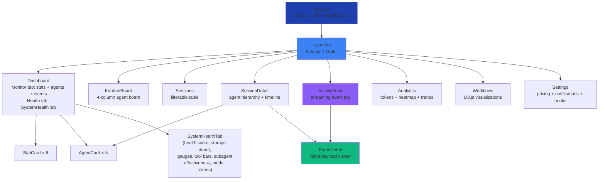

### Component Props Flow

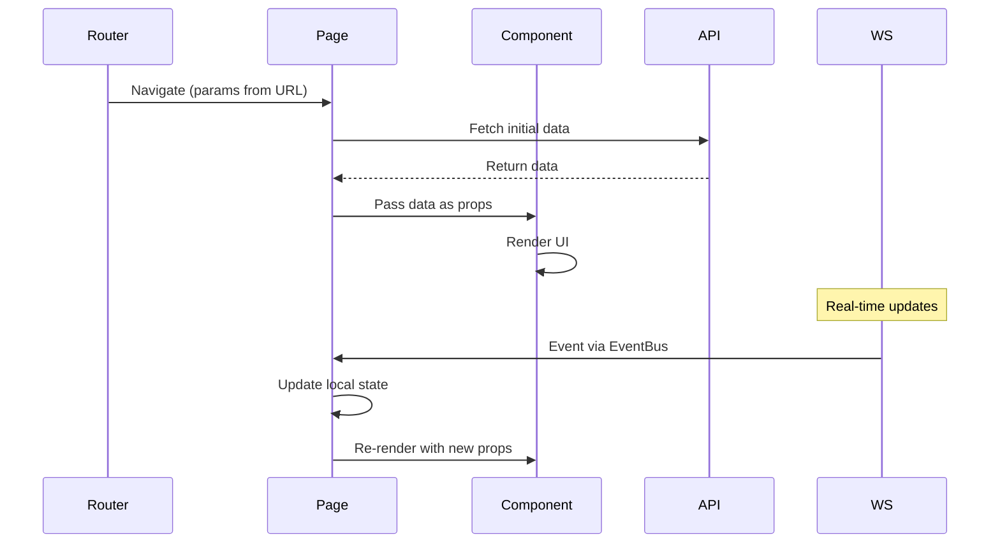

---

## State Management

The client uses **local component state** and **React hooks** for state management. No global state library (Redux, Zustand) is used to keep the architecture simple.

### State Strategy

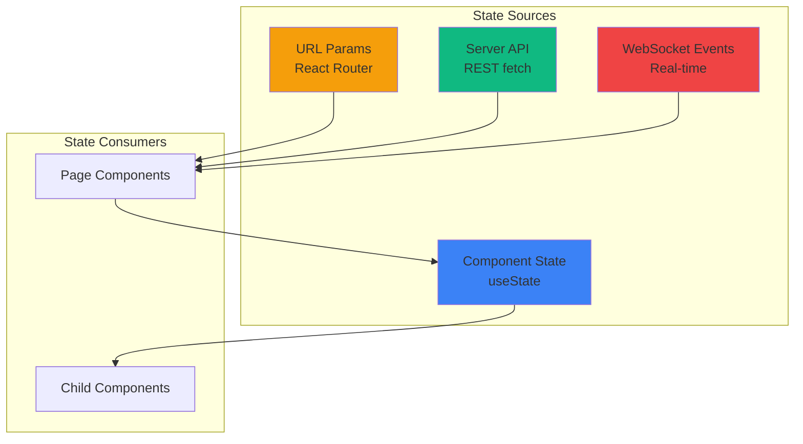

### State Update Pattern

1. **Initial Load**: Page component fetches data via API client on mount (`useEffect`)
2. **URL Changes**: React Router triggers re-render, page refetches data
3. **Real-time Updates**: WebSocket events trigger state updates via `EventBus`
4. **User Actions**: Click handlers call API, optimistically update local state

Example from `SessionDetailPage`:

```typescript
function SessionDetailPage() {
  const { sessionId } = useParams();
  const [session, setSession] = useState(null);
  const [agents, setAgents] = useState([]);
  
  // Initial load
  useEffect(() => {
    fetchSession(sessionId).then(setSession);
    fetchAgents(sessionId).then(setAgents);
  }, [sessionId]);
  
  // Real-time updates
  useEffect(() => {
    const unsubscribe = eventBus.on('agent.created', (agent) => {
      if (agent.session_id === sessionId) {
        setAgents(prev => [...prev, agent]);
      }
    });
    return unsubscribe;
  }, [sessionId]);
}
```

---

## WebSocket Integration

### WebSocket Lifecycle

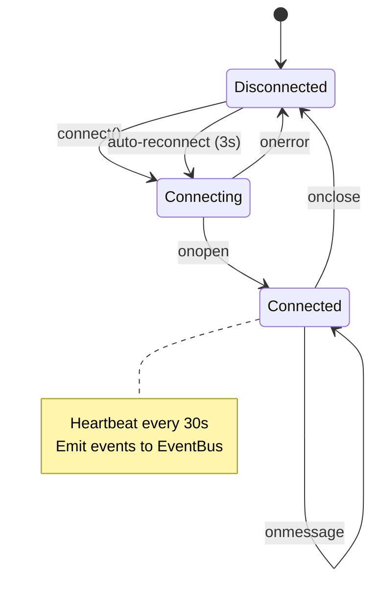

### WebSocket Message Flow

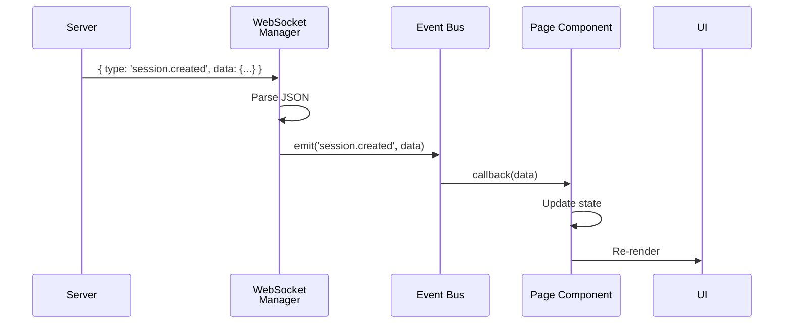

### Event Types

Server broadcasts these event types over WebSocket:

| Event Type | Payload | Triggered By |
|------------|---------|--------------|
| `session.created` | Session object | SessionStart hook |
| `session.updated` | Session object | Any hook touching session |
| `agent.created` | Agent object | PreToolUse hook |
| `agent.updated` | Agent object | PostToolUse/Stop hooks |
| `tool.executed` | Tool execution record | PostToolUse hook |
| `notification.received` | Notification object | Notification hook |

### EventBus Pattern

The `eventBus` is a simple pub/sub system:

```typescript
// lib/eventBus.ts
class EventBus {
  private listeners = new Map<string, Set<Function>>();
  
  on(event: string, callback: Function): () => void {
    if (!this.listeners.has(event)) {
      this.listeners.set(event, new Set());
    }
    this.listeners.get(event)!.add(callback);
    
    // Return unsubscribe function
    return () => this.listeners.get(event)?.delete(callback);
  }
  
  emit(event: string, data: any): void {
    this.listeners.get(event)?.forEach(cb => cb(data));
  }
}

export const eventBus = new EventBus();
```

Usage in components:

```typescript
useEffect(() => {
  const unsubscribe = eventBus.on('session.created', handleNewSession);
  return unsubscribe; // Cleanup on unmount
}, []);
```

---

## Routing

### Route Structure

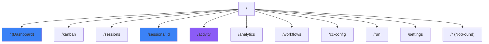

### Route Configuration

```tsx
// App.tsx
import { BrowserRouter, Routes, Route } from 'react-router-dom';

function App() {
  return (
    <BrowserRouter>
      <Routes>
        <Route path="/" element={<Layout />}>
          <Route index element={<Dashboard />} />
          <Route path="kanban" element={<KanbanBoard />} />
          <Route path="sessions" element={<Sessions />} />
          <Route path="sessions/:id" element={<SessionDetail />} />
          <Route path="activity" element={<ActivityFeed />} />
          <Route path="analytics" element={<Analytics />} />
          <Route path="workflows" element={<Workflows />} />
          <Route path="cc-config" element={<CcConfig />} />
          <Route path="run" element={<Run />} />
          <Route path="settings" element={<Settings />} />
          <Route path="*" element={<NotFound />} />
        </Route>
      </Routes>
    </BrowserRouter>
  );
}
```

### Navigation Flow

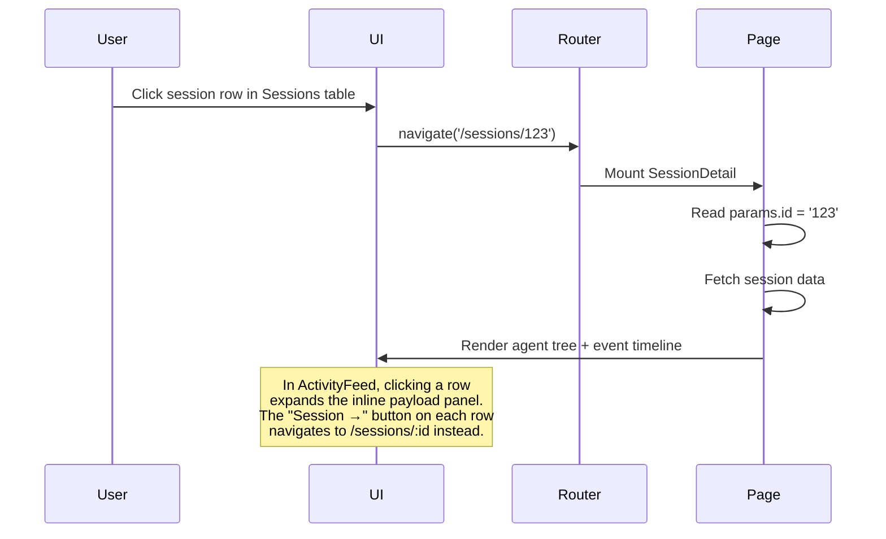

---

## API Client

### API Architecture

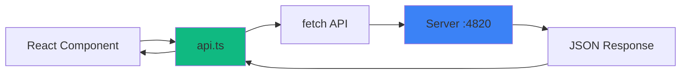

### API Client Structure

```typescript
// lib/api.ts
const BASE_URL = 'http://localhost:4820';

class APIClient {
  private async request(path: string, options?: RequestInit) {
    const response = await fetch(`${BASE_URL}${path}`, options);
    if (!response.ok) throw new Error(`API error: ${response.statusText}`);
    return response.json();
  }
  
  // Sessions
  getSessions() { return this.request('/api/sessions'); }
  getSession(id: string) { return this.request(`/api/sessions/${id}`); }
  
  // Agents
  getAgents(sessionId: string) {
    return this.request(`/api/sessions/${sessionId}/agents`);
  }
  getAgent(id: string) { return this.request(`/api/agents/${id}`); }
  
  // Tools
  getTools(agentId: string) {
    return this.request(`/api/agents/${agentId}/tools`);
  }
  
  // Pricing
  getPricingRules() { return this.request('/api/pricing'); }
  createPricingRule(rule: PricingRule) {
    return this.request('/api/pricing', {
      method: 'POST',
      headers: { 'Content-Type': 'application/json' },
      body: JSON.stringify(rule)
    });
  }
  deletePricingRule(pattern: string) {
    return this.request(`/api/pricing/${encodeURIComponent(pattern)}`, {
      method: 'DELETE'
    });
  }
}

export const api = new APIClient();
```

### Error Handling

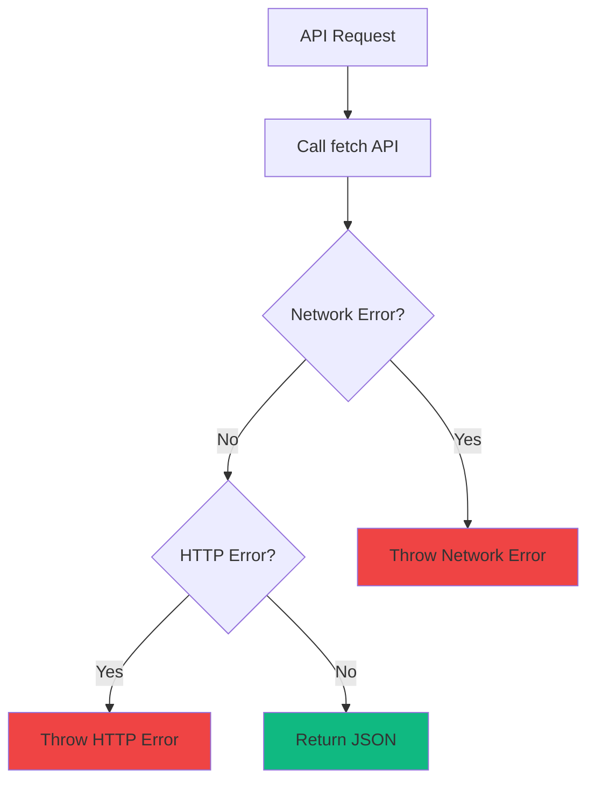

---

## UI Components

### Component Catalog

#### SessionCard

Displays session summary with status, model, cost, and agent count.

**Props:**
```typescript
interface SessionCardProps {
  session: Session;
}
```

**Visual Structure:**
```
┌────────────────────────────────────────┐
│ 🟢 Session Title         $0.45         │
│ claude-sonnet-4                        │
│ Started: 2 hours ago                   │
│ Agents: 3 | Tools: 12                  │
└────────────────────────────────────────┘
```

#### AgentCard

Shows agent type, status, tool usage, and cost breakdown.

**Props:**
```typescript
interface AgentCardProps {
  agent: Agent;
}
```

#### ToolCard

Displays tool execution details with timing and token usage.

**Props:**
```typescript
interface ToolCardProps {
  tool: ToolExecution;
}
```

#### EventTimeline

Chronological view of session events (hooks, tools, notifications).

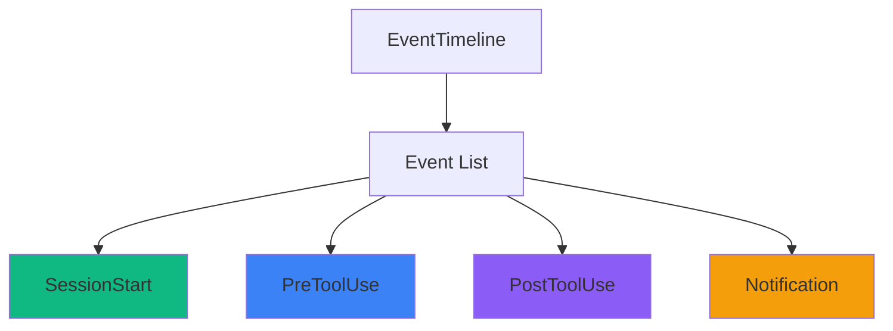

#### ActivityFeed (`pages/ActivityFeed.tsx`)

Real-time streaming event log with pause/resume, pagination, and inline payload expansion.

**UX interaction model:**

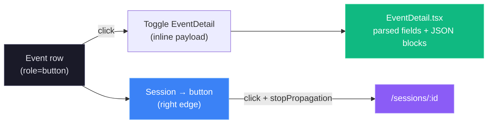

- The entire row is clickable (keyboard accessible via `Enter`/`Space`) and toggles the `EventDetail` dropdown.
- The chevron icon rotates 90° when a row is expanded — it is a visual indicator only, not a separate button.
- The **Session →** button uses `e.stopPropagation()` so navigating to session details never collapses an open payload panel.
- Multiple rows can be expanded simultaneously (state stored in `Set<number>`).

#### EventDetail (`components/EventDetail.tsx`)

Renders the hook payload for a single event inline below its row. Scalars appear as `key: value` pairs; objects and arrays render in a terminal-styled code block with a copy button.

---

## Utilities

### Formatters (lib/format.ts)

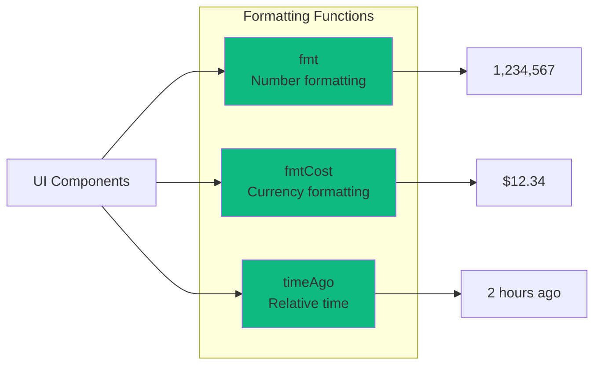

**Function Signatures:**

```typescript
// Format large numbers with commas
export function fmt(n: number | null | undefined): string;
// Examples: fmt(1234) → "1,234"
//           fmt(null) → "—"

// Format cost in dollars
export function fmtCost(cost: number | null | undefined): string;
// Examples: fmtCost(1.234) → "$1.23"
//           fmtCost(0) → "$0.00"

// Relative time string
export function timeAgo(date: string | Date | null | undefined): string;
// Examples: timeAgo('2024-03-18T12:00:00Z') → "2 hours ago"
//           timeAgo(null) → "—"
```

### Type Definitions (lib/types.ts)

All TypeScript interfaces match server response shapes:

```typescript
interface Session {
  id: string;
  session_id: string;
  model: string;
  status: 'active' | 'completed' | 'error' | 'abandoned';
  total_cost: number;
  created_at: string;
  updated_at: string;
}

interface Agent {
  id: number;
  agent_id: string;
  session_id: string;
  agent_type: string;
  status: 'working' | 'waiting' | 'completed' | 'error';
  input_tokens: number;
  output_tokens: number;
  cost: number;
  created_at: string;
}

interface ToolExecution {
  id: number;
  agent_id: string;
  tool_name: string;
  duration_ms: number;
  success: boolean;
  created_at: string;
}
```

---

## Testing

### Test Stack

- **Vitest** - Fast unit test runner (Vite-native)
- **React Testing Library** - Component testing
- **jsdom** - Browser environment simulation

### Test Structure

```
client/src/
├── components/__tests__/
│   ├── AgentCard.test.tsx
│   ├── SessionCard.test.tsx
│   └── EventTimeline.test.tsx
│
├── pages/__tests__/
│   ├── screens.snapshot.test.tsx          # render snapshots for every screen
│   └── __snapshots__/                      # committed .snap baselines
│
└── lib/__tests__/
    ├── format.test.ts
    ├── eventBus.test.ts
    └── api.test.ts
```

### Running Tests

```bash
# Run all tests
npm test

# Watch mode
npm run test:watch

# Coverage report
npm run test:coverage
```

### Example Test

```tsx
// components/__tests__/SessionCard.test.tsx
import { render, screen } from '@testing-library/react';
import { SessionCard } from '../SessionCard';

test('renders session title and cost', () => {
  const session = {
    id: '1',
    session_id: 'sess_123',
    model: 'claude-sonnet-4',
    total_cost: 1.23,
    status: 'active',
    created_at: '2024-03-18T12:00:00Z'
  };
  
  render(<SessionCard session={session} />);
  
  expect(screen.getByText('sess_123')).toBeInTheDocument();
  expect(screen.getByText('$1.23')).toBeInTheDocument();
});
```

### Snapshot Testing

`pages/__tests__/screens.snapshot.test.tsx` renders **every routed screen**
(Dashboard, Kanban, Sessions, Session detail, Activity feed, Analytics,
Workflows, Claude Config, Run, Settings, Not found) and asserts each against a
committed snapshot in `pages/__tests__/__snapshots__/`. These are structural
regression guards — they catch unintended changes to layout, markup, or
localized copy.

To keep snapshots **deterministic** across machines and CI, the suite:

- mocks the API layer (`vi.mock("../../lib/api", …)`) to a loaded-empty state
  (empty collections + zeroed scalars), so no live data or noisy chart DOM
  leaks in — `importOriginal` keeps non-`api` exports real;
- stubs `eventBus`, push notifications, and the jsdom-missing
  `ResizeObserver` / `IntersectionObserver` / `matchMedia` / `scroll*` APIs;
- pins the clock (`vi.useFakeTimers`) and timezone (`TZ=UTC`) so any rendered
  timestamps are stable.

When you change a screen **intentionally**, review the diff and regenerate the
baselines:

```bash
cd client && npx vitest run -u src/pages/__tests__/screens.snapshot.test.tsx
```

Commit the updated `.snap` file alongside the change.

---

## Build & Deployment

### Development Build

```bash
npm run dev
```

Starts Vite dev server with HMR at `http://localhost:5173`

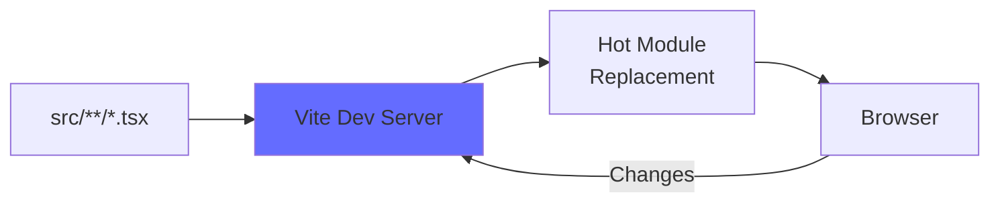

### Production Build

```bash
npm run build
```

Output: `client/dist/` (optimized static files)

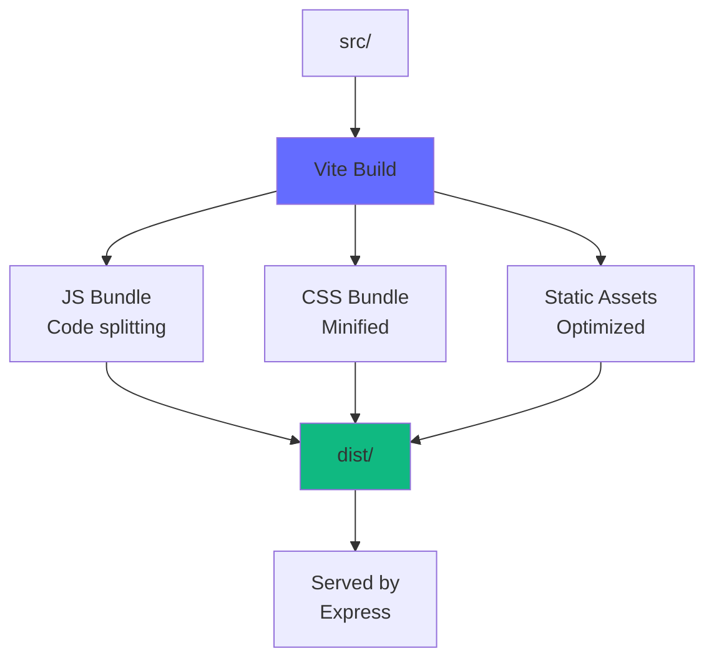

### Build Optimizations

1. **Code Splitting** - Lazy load routes with `React.lazy()`
2. **Tree Shaking** - Remove unused code
3. **Minification** - Terser for JS, cssnano for CSS
4. **Asset Hashing** - Cache busting with content hashes
5. **Compression** - Gzip/Brotli (handled by Express)

---

## Development

### Prerequisites

- Node.js >= 18.0.0
- npm >= 9.0.0

### Setup

```bash
# Install dependencies
npm install

# Start dev server
npm run dev
```

### Environment Variables

The client uses hardcoded API URL (`http://localhost:4820`). For custom configuration, update `lib/api.ts`:

```typescript
const BASE_URL = import.meta.env.VITE_API_URL || 'http://localhost:4820';
```

Then create `.env`:

```
VITE_API_URL=http://localhost:4820
```

### Hot Module Replacement (HMR)

Vite provides instant feedback on code changes:

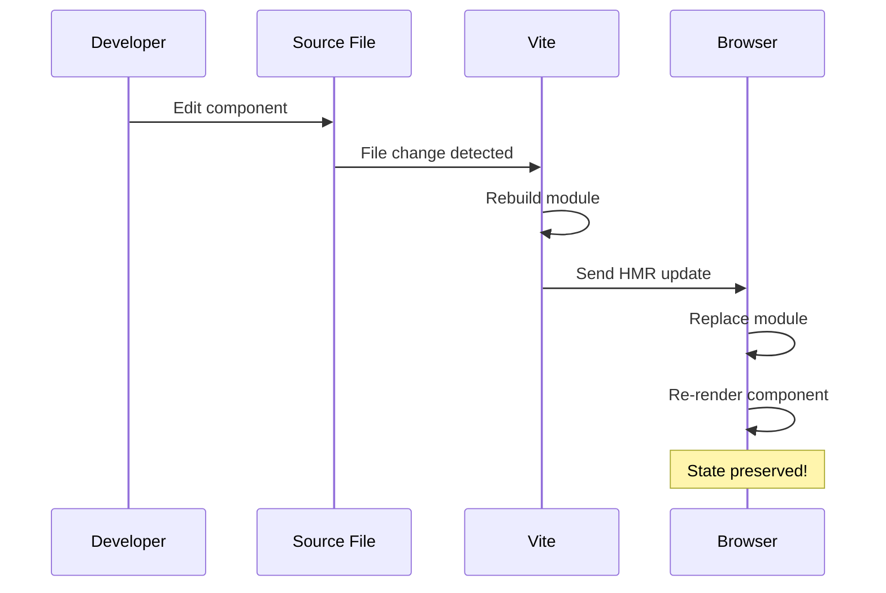

---

## Performance

### Metrics

- **First Contentful Paint (FCP)**: < 0.5s
- **Time to Interactive (TTI)**: < 1.5s
- **Bundle Size**: ~150KB gzipped (main chunk)

### Optimization Techniques

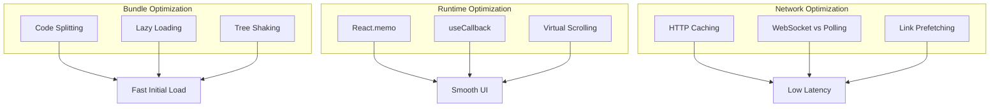

### Virtual Scrolling

For large lists (100+ sessions), implement virtual scrolling:

```tsx
import { useVirtualizer } from '@tanstack/react-virtual';

function SessionList({ sessions }) {
  const parentRef = useRef(null);
  const virtualizer = useVirtualizer({
    count: sessions.length,
    getScrollElement: () => parentRef.current,
    estimateSize: () => 100, // estimated row height
  });
  
  return (
    <div ref={parentRef} style={{ height: '600px', overflow: 'auto' }}>
      <div style={{ height: `${virtualizer.getTotalSize()}px` }}>
        {virtualizer.getVirtualItems().map(virtualRow => (
          <SessionCard
            key={sessions[virtualRow.index].id}
            session={sessions[virtualRow.index]}
          />
        ))}
      </div>
    </div>
  );
}
```

---

## Accessibility

### WCAG 2.1 Level AA Compliance

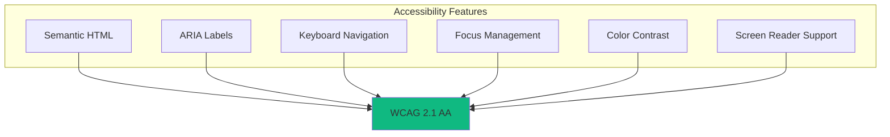

### Implementation Checklist

- ✅ Semantic HTML5 elements (`<nav>`, `<main>`, `<article>`)
- ✅ ARIA labels on interactive elements
- ✅ Keyboard navigation (Tab, Enter, Escape)
- ✅ Focus indicators (outline on :focus)
- ✅ Color contrast ratio >= 4.5:1 for text
- ✅ Alternative text for icons (aria-label)
- ✅ Skip links for screen readers

### Example

```tsx
<button
  onClick={handleDelete}
  aria-label="Delete pricing rule"
  className="focus:outline-blue-500"
>
  <Trash2 aria-hidden="true" />
</button>
```

---

## Summary

The client is a production-ready React application with:

- 🚀 **Modern Stack** - React 18, TypeScript, Vite, Tailwind
- ⚡ **Real-time** - WebSocket integration for live updates
- 🧪 **Tested** - Vitest + React Testing Library
- 📦 **Optimized** - Code splitting, tree shaking, lazy loading
- ♿ **Accessible** - WCAG 2.1 AA compliant
- 🎨 **Maintainable** - Clear architecture, type-safe, well-documented

For server documentation, see [server/README.md](../server/README.md).

