# `desktop/` — Native macOS App (Electron)

The **desktop workspace** ships the Claude Code Agent Monitor dashboard as a
native macOS `.app` (distributed as a `.dmg`). It is an Electron shell that
**embeds the existing Express server in-process** and renders the already-built
React client in a `BrowserWindow`.

> **One-line mental model:** *Electron is a window onto the same code.* The
> desktop app does not reimplement the dashboard — it `require()`s
> `server/index.js` directly, in the same Node runtime as the Electron main
> process, and points a Chromium window at it.

For the **user-facing** guide (download, install, Gatekeeper, tray menu,
auto-start) see [`../DESKTOP.md`](../DESKTOP.md). This file is the
**contributor / architecture** reference.

---

## Table of contents

- [TL;DR](#tldr)
- [Where the desktop app sits](#where-the-desktop-app-sits)
- [Process model](#process-model)
- [Boot lifecycle](#boot-lifecycle)
- [Server hosting & port discovery](#server-hosting--port-discovery)
- [`better-sqlite3` native-module handling](#better-sqlite3-native-module-handling)
- [Background services & hook bootstrap](#background-services--hook-bootstrap)
- [Window, tray & menu](#window-tray--menu)
- [Auto-start (Login Items)](#auto-start-login-items)
- [Source tree](#source-tree)
- [Packaged app layout](#packaged-app-layout)
- [Build pipeline](#build-pipeline)
- [Commands](#commands)
- [Build performance — read this](#build-performance--read-this)
- [Code signing & notarization](#code-signing--notarization)
- [Continuous integration](#continuous-integration)
- [Smoke test](#smoke-test)
- [Environment variables](#environment-variables)
- [Logs & troubleshooting](#logs--troubleshooting)
- [What this workspace does *not* touch](#what-this-workspace-does-not-touch)

---

## TL;DR

```bash
# From the repo root:
npm run setup            # install root + client deps, build client, install hooks
npm run build            # build client/dist (the SPA the Electron window loads)
npm run desktop:install  # install Electron, electron-builder, types into desktop/
npm run desktop:dev      # tsc → launch Electron pointing at out/main.js
npm run desktop:test     # smoke test (spawn Electron + probe /api/health)

# Build a DMG:
npm run desktop:dmg          # universal (x64 + arm64) — correct for release, SLOW
npm run desktop:dmg:arm64    # Apple Silicon only — fast, for your own machine
npm run desktop:dmg:x64      # Intel only — fast
```

> ⚠️ The **universal** build is intentionally slow (it builds the app twice and
> merges the two architectures). For running on your own Mac, use the
> arch-specific command. See [Build performance](#build-performance--read-this).

---

## Where the desktop app sits

`desktop/` is a **sibling workspace** — not a npm-workspaces conversion. It has
its own `package.json`, its own `node_modules`, and its own toolchain. It
consumes the rest of the repo as plain files.

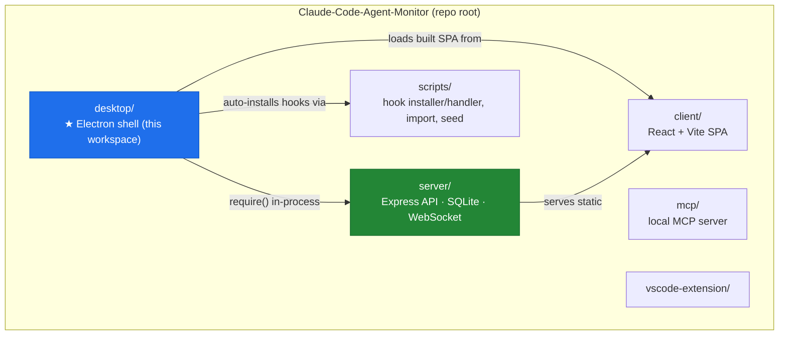

The desktop app touches **no other workspace's runtime behavior**. The only
change outside `desktop/` is a behavior-preserving refactor of
`server/index.js` (see [the last section](#what-this-workspace-does-not-touch)).

---

## Process model

Electron runs a **main process** (Node.js) and one or more **renderer
processes** (Chromium). In this app:

- The **main process** hosts the embedded Express server *and* manages the
  window, tray, and menus. There is **no child process and no IPC** for the
  server — it runs inside the main process's own event loop.
- The **renderer** is just Chromium loading `http://127.0.0.1:<port>` — exactly
  the same origin a normal browser would. The `preload.ts` is intentionally
  empty, so the renderer has zero privileged surface.

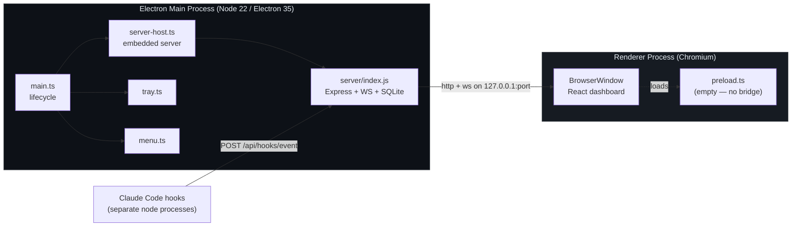

---

## Boot lifecycle

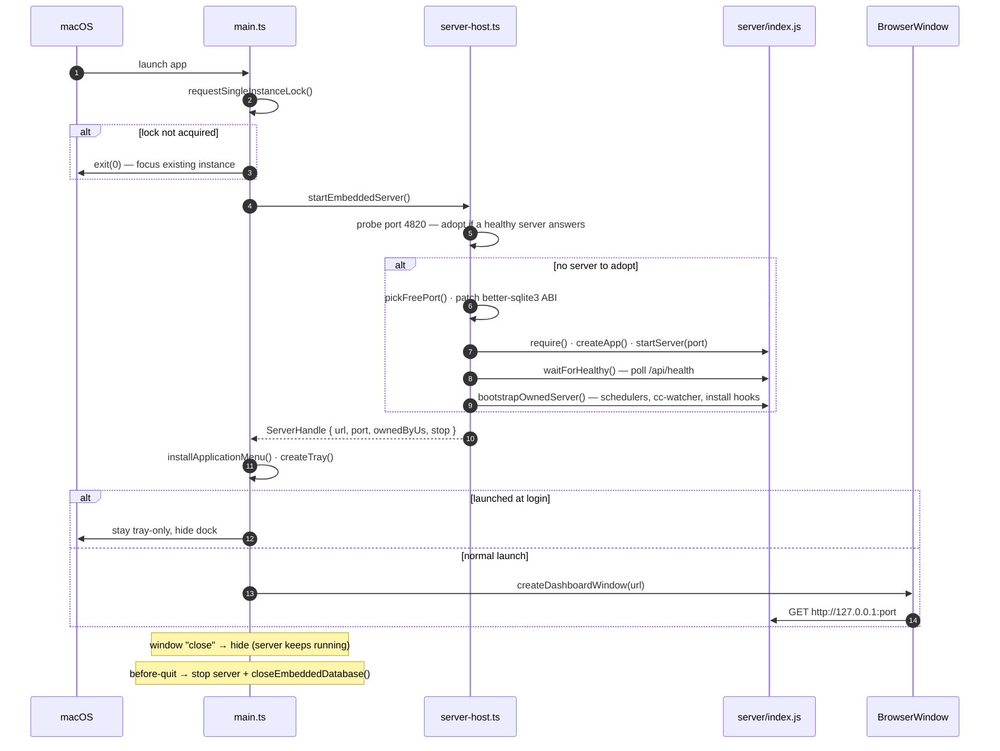

Key behaviors:

| Event | Behavior |
|---|---|
| Second launch | `requestSingleInstanceLock()` fails → the new process exits and the existing window is focused. |
| Window close | Intercepted — the window **hides**, the server and tray keep running. |
| `window-all-closed` | App stays alive (tray-only mode). |
| Launched at login | The dashboard window is **not** shown — only the tray icon. |
| `before-quit` | If we own the server: stop the HTTP server, then `closeEmbeddedDatabase()` for a clean WAL checkpoint, then `app.exit(0)`. |

---

## Server hosting & port discovery

`server-host.ts` is the **only file** that imports `server/index.js`. It picks
a port, boots the server, and returns a `ServerHandle`.

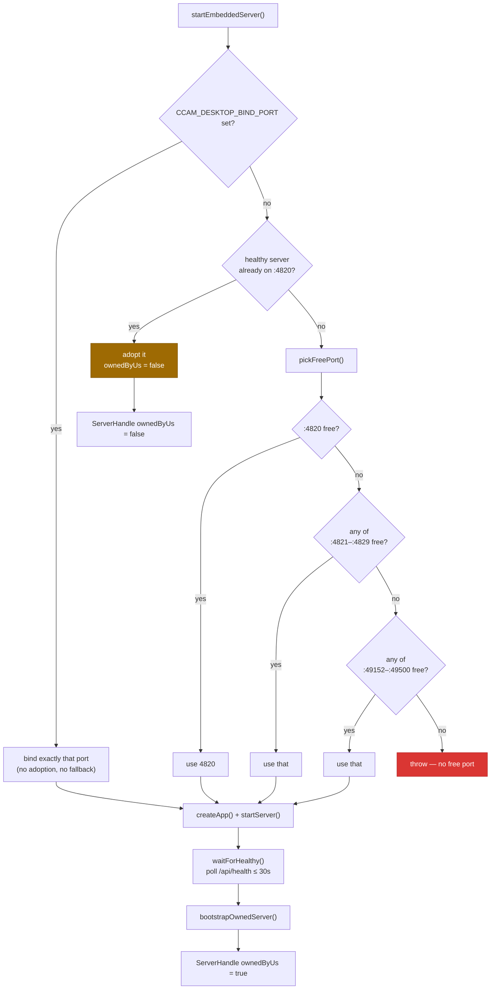

**Adoption** — `probePort()` connects, then checks that the listener answers
`GET /api/health` with `{ status: "ok" }`. If a healthy dashboard server is
already on `:4820` (e.g. you ran `npm start` in a terminal), the desktop app
**adopts** it rather than double-binding. An adopted server is *not* owned by
the app — quitting the app leaves it running.

**`ServerHandle`:**

```ts
interface ServerHandle {
  url: string;          // e.g. "http://127.0.0.1:4820"
  port: number;
  ownedByUs: boolean;   // false when adopted
  stop: () => Promise<void>;
}
```

**Hook port discovery** — because the embedded server may bind a fallback port
(4821+) when 4820 is taken, the Claude Code hook handler must not assume 4820.
On startup the server writes its live port to `~/.claude/.agent-dashboard.json`
(`server/lib/server-info.js`); `scripts/hook-handler.js` reads that file to
target the running server. Without this, hook events would be POSTed to 4820 —
nothing would receive them and the dashboard would stay empty.

---

## `better-sqlite3` native-module handling

`better-sqlite3` is the only **native** module in the dependency tree, and a
native module must be compiled against the exact Node ABI it runs on. The repo
root's copy is built for the **system Node** (so `npm run test:server` works);
Electron ships its **own Node ABI**.

The desktop workspace solves this without disturbing the root install:

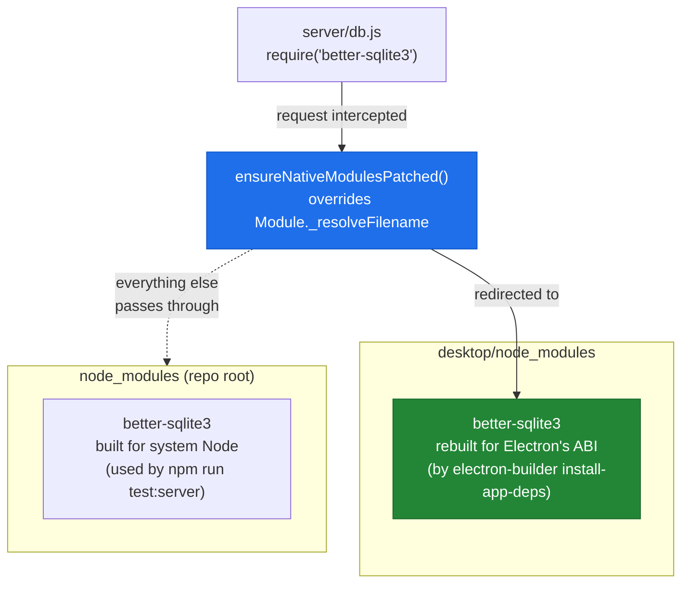

- The patch is **process-local** and installed exactly once, before
  `server/index.js` is `require()`d.
- It rewrites *only* `require("better-sqlite3")`; every other module resolves
  normally.
- `electron-builder.yml` therefore **excludes** the root `better-sqlite3` from
  the bundle (it would trip `@electron/universal`'s identical-file detector)
  and `asarUnpack`s the desktop copy (native `.node` files cannot live inside
  an `asar` archive).
- PR #37's `compat-sqlite` (`node:sqlite`) fallback remains as a safety net —
  one reason the desktop app pins **Electron 35** (its bundled Node 22.16 has
  `node:sqlite`; Electron 31's Node 20 did not).

---

## Background services & hook bootstrap

`node server/index.js` runs its production bootstrap from an
`if (require.main === module)` block. Because the desktop app **`require()`s**
that module, the block never fires — so the bootstrap was extracted into an
exported `startBackgroundServices()` that both paths call.

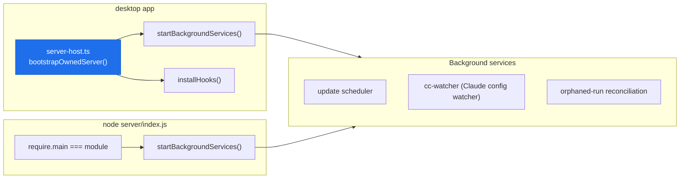

`bootstrapOwnedServer()` runs **once** (guarded by a module-level flag so a
*Restart Server* does not double-register schedulers/watchers) and:

1. Calls `startBackgroundServices()` — the update scheduler, the `cc-watcher`
   config watcher, and one-time orphaned-run reconciliation.
2. Calls `installHooks()` — writes the Claude Code hook configuration to
   `~/.claude/settings.json`, so a **DMG-only user gets events flowing**
   without ever running `npm run install-hooks` from a checkout.

It runs only when the server is **owned** by the app — an adopted server has
already done its own bootstrap.

---

## Window, tray & menu

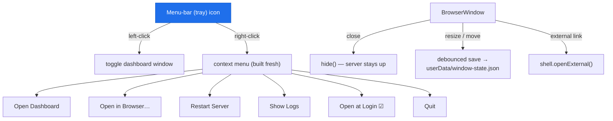

- **Tray** — the always-on surface. Left-click toggles the window; right-click
  pops the context menu. The menu is rebuilt on each open so the port label and
  *Open at Login* checkbox are always current. (The tray deliberately does
  **not** use `setContextMenu`, which on macOS would make a left-click open the
  menu and collide with the toggle behavior.)
- **Window** — `BrowserWindow` with `contextIsolation: true`,
  `nodeIntegration: false`, an empty preload, and `webSecurity: true`. Geometry
  is persisted to `window-state.json` under `app.getPath('userData')`. External
  links open in the system browser, never inside Electron.
- **Application menu** — standard macOS menu (`About`, `Open at Login`, `File`,
  `Edit`, `View`, `Window`, `Help`). `⌘R` is owned by `View ▸ reload`.

---

## Auto-start (Login Items)

Auto-start uses Electron's first-party `app.setLoginItemSettings` — which wraps
the modern macOS `SMAppService` / `ServiceManagement` framework — **not** a
`LaunchAgent` plist. The toggle therefore appears in
**System Settings → General → Login Items** where users expect to manage it.

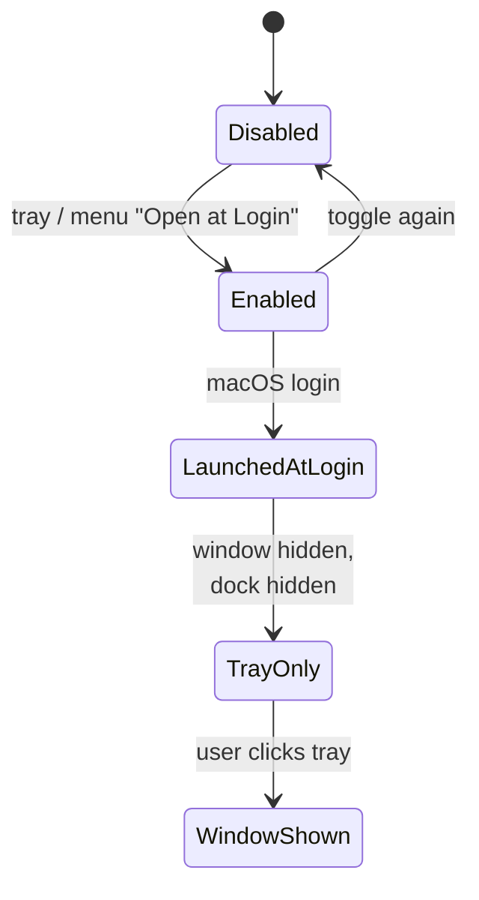

When macOS launches the app at login (`wasOpenedAtLogin`), it starts
**tray-only** with `openAsHidden: true` — no window jumps into the user's face.

---

## Source tree

```
desktop/
├── src/
│   ├── main.ts          # main process entry — lifecycle, dialogs, wiring
│   ├── server-host.ts   # ★ in-process Express boot, port discovery, adoption,
│   │                    #   better-sqlite3 ABI patch, DB + discovery-file close,
│   │                    #   /api/stats snapshot poller for the tray dropdown
│   ├── window.ts        # BrowserWindow + persisted geometry; native macOS
│   │                    #   titleBarStyle: 'default' (clear traffic-light row)
│   ├── menu.ts          # native application menu
│   ├── tray.ts          # menu-bar icon + single-click dropdown w/ live
│   │                    #   {sessions, agents, events-today} snapshot
│   ├── login-item.ts    # macOS Login Items (SMAppService)
│   ├── shell-path.ts    # recover the user's shell PATH (so `claude` is found)
│   ├── logger.ts        # file logger → app.getPath('logs')/desktop.log
│   ├── constants.ts     # APP_NAME, ports, timeouts, window size
│   └── preload.ts       # intentionally empty (zero renderer privilege)
├── scripts/
│   ├── prebuild.js      # ensures client/dist + root node_modules exist
│   ├── notarize.js      # electron-builder afterSign hook (opt-in)
│   └── build-icons.sh   # regenerate icon.icns + tray PNGs from SVG
├── assets/              # icon.icns, icon.png, tray-icon-Template*.png, SVGs
├── tests/
│   └── smoke.test.mjs   # spawn Electron + probe /api/health
├── electron-builder.yml # DMG packaging config
├── tsconfig.json        # strict; src/ → out/
└── package.json
```

Compiled output lands in `desktop/out/` (git-ignored); packaged artifacts in
`desktop/release/` (git-ignored).

---

## Packaged app layout

`electron-builder` produces `Claude Code Monitor.app`. The Electron main
process code is packed into `app.asar`; the rest of the repo is shipped as
**`extraResources`** (plain files under `Resources/app/`):

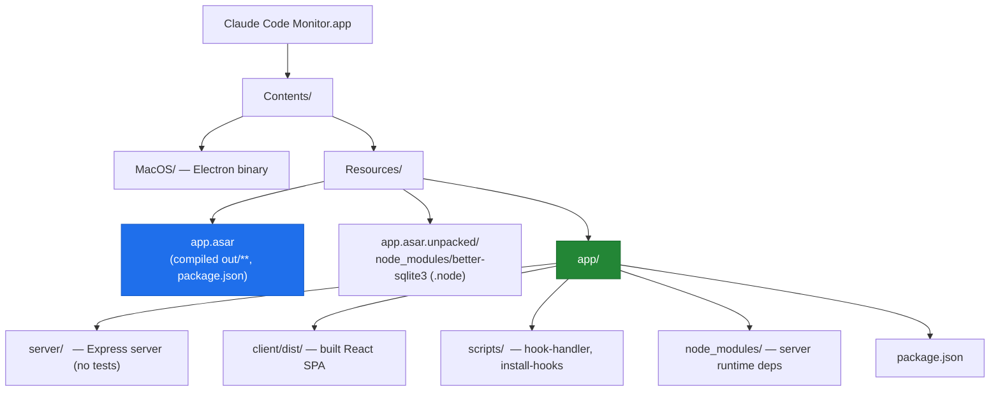

At runtime `server-host.ts` resolves this root: `process.resourcesPath/app`
when packaged, or the repo root in development.

---

## Build pipeline

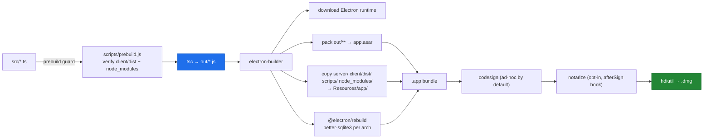

A **universal** build runs the *packaging → rebuild → sign* steps **twice**
(once per architecture), then `@electron/universal` merges the two app trees
into a single fat binary before the DMG step.

---

## Commands

All commands are runnable from the **repo root** (`desktop:*`) or from inside
`desktop/`. Every script that packages first runs `npm run build`, so you never
need to invoke `electron-builder` bare (doing so skips the TypeScript compile
and fails with *"entry file out/main.js does not exist"*).

| Repo-root command | `desktop/` command | What it does |
|---|---|---|
| `npm run desktop:install` | `npm install` | Install Electron, electron-builder, types; rebuild `better-sqlite3` for Electron's ABI (`postinstall`). |
| `npm run desktop:build` | `npm run build` | Prebuild guard + `tsc` → `out/`. |
| `npm run desktop:dev` | `npm run dev` | Build, then launch Electron against `out/main.js`. |
| `npm run desktop:test` | `npm test` | Build, then run the smoke test. |
| `npm run desktop:dmg` | `npm run dmg` | **Universal** DMG (x64 + arm64). Correct for release. **Slow.** |
| `npm run desktop:dmg:arm64` | `npm run dmg:arm64` | Apple-Silicon-only DMG. **Fast.** |
| `npm run desktop:dmg:x64` | `npm run dmg:x64` | Intel-only DMG. **Fast.** |
| — | `npm run build:icons` | Regenerate `icon.icns` + tray PNGs from the SVGs. |
| — | `npm run clean` | Remove `out/` and `release/`. |

> **After `npm run clean`** you must `npm run build` again before packaging —
> `clean` deletes `out/`, and `electron-builder` only *packages*, it does not
> compile. The `dmg*` scripts chain the build for you; a bare
> `electron-builder` call does not.

---

## Build performance — read this

**DMG builds can be very slow.** This is expected — it is the standard Electron
packaging cost, multiplied by the universal merge:

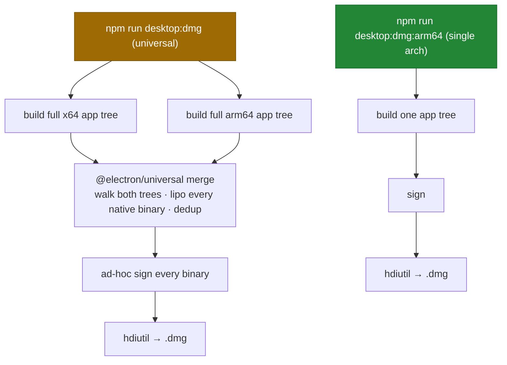

Why universal is slow:

1. **Everything happens twice** — electron-builder builds a full x64 app tree
   *and* a full arm64 app tree, then `@electron/universal` walks both and
   `lipo`s every native binary into a fat binary.
2. **The app tree is large** — the server's entire production dependency tree
   (`express`, `swagger-ui-express`, `ws`, …) ships as `extraResources`; that's
   tens of thousands of files, walked and copied for each architecture.
3. **Per-binary code signing** runs over the whole merged bundle.

Net effect: a ~250 MB app is built, copied, and signed several times over —
gigabytes of disk I/O. The Electron runtime downloads (~110 MB each) are *not*
the bottleneck; the silent `packaging arch=universal` merge is.

**Guidance:**

- Building for **your own Mac** → use `desktop:dmg:arm64` (Apple Silicon) or
  `desktop:dmg:x64` (Intel). One architecture, no merge — finishes in roughly a
  minute instead of many.
- Building a **release artifact for everyone** → use the universal
  `desktop:dmg` and expect it to take a while. CI builds the universal DMG and
  uploads it as the `ClaudeCodeMonitor-dmg` artifact, so you rarely need to
  build it locally.
- The bundle is **~80 MB DMG / ~250 MB on disk** regardless — the standard
  Electron tax.

---

## Code signing & notarization

The DMG is **ad-hoc signed by default** so anyone can build a working `.dmg`
without a paid Apple Developer account.

- The `package` script sets **`CSC_IDENTITY_AUTO_DISCOVERY=false`** so a
  code-signing certificate already in the contributor's macOS keychain is
  **never** picked up. (Without this, electron-builder auto-discovers such a
  cert and attempts `type=distribution` signing, which fails on a non–Developer
  ID cert with *"Application … could not be found"*.)
- **Real Developer ID signing** activates when `CSC_LINK` (a base64-encoded
  `.p12`) and `CSC_KEY_PASSWORD` are provided — `CSC_LINK` is an *explicit*
  certificate and is unaffected by the auto-discovery flag.
- **Notarization** is opt-in: `desktop/scripts/notarize.js` (an
  `electron-builder` `afterSign` hook) runs only when `APPLE_ID`,
  `APPLE_TEAM_ID`, and `APPLE_APP_SPECIFIC_PASSWORD` are all set. Otherwise it
  is a no-op.

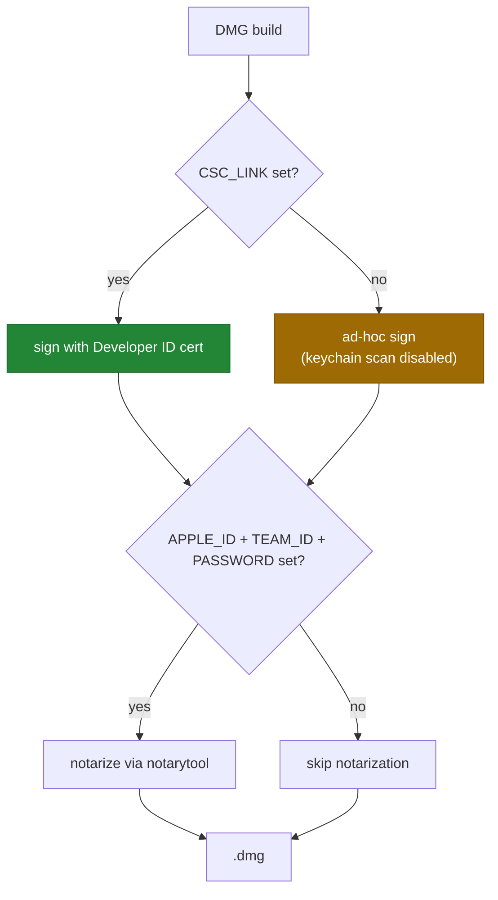

An ad-hoc DMG triggers a Gatekeeper warning on first launch. The one-line
workaround is in [`../DESKTOP.md`](../DESKTOP.md):
`xattr -cr "/Applications/Claude Code Monitor.app"`.

---

## Continuous integration

The `🍎 macOS Desktop (DMG)` job in `.github/workflows/ci.yml`:

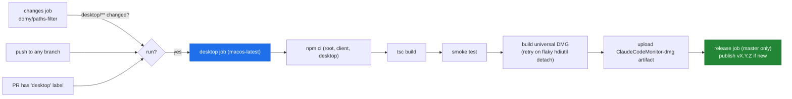

- The job is **path-filtered** — a `changes` job (`dorny/paths-filter`)
  detects `desktop/**` edits; the desktop job also runs on any `push` or when a
  PR carries the `desktop` label.
- **DMG build resilience** — `electron-builder` finalizes the DMG with
  `hdiutil detach`, which is intermittently flaky on GitHub macOS runners. The
  step disables Spotlight indexing and retries the build up to 3 times,
  force-detaching any stale volume between attempts.
- The built DMG is uploaded as the **`ClaudeCodeMonitor-dmg`** artifact
  (downloadable from the workflow run).
- On `master`, a follow-on **`release`** job reads the version from
  `package.json` and publishes `vX.Y.Z` as a GitHub Release with the DMG
  attached — but only when no release exists for that version yet, so bumping
  the version is what cuts a release. The result is a permanent, anonymous
  download URL at `releases/latest`.

---

## Smoke test

`tests/smoke.test.mjs` is intentionally minimal — it proves the embedded server
boots, without needing a display (so CI needs no `xvfb`).

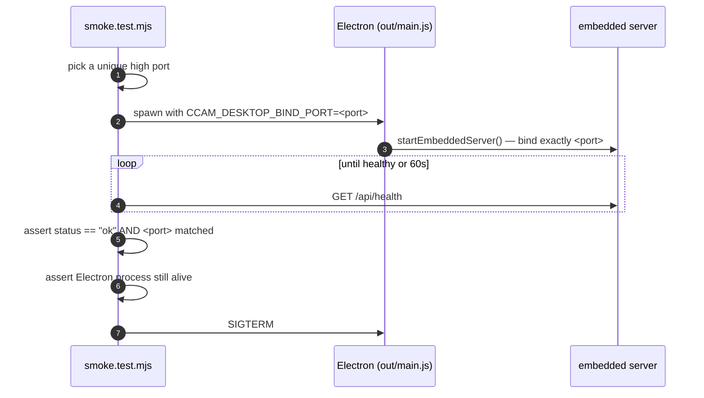

`CCAM_DESKTOP_BIND_PORT` forces the server onto an exact port (no adoption, no
fallback) so the test can be certain it probed *this* process and not an
unrelated server on `:4820`.

---

## Environment variables

| Variable | Used by | Effect |
|---|---|---|
| `CCAM_DESKTOP_BIND_PORT` | `server-host.ts` | Bind exactly this port — disables adoption and fallback. Used by the smoke test. |
| `CCAM_DESKTOP_NO_ADOPT` | `server-host.ts` | `=1` → never adopt an existing `:4820` server; always start our own. |
| `CCAM_DESKTOP_VERBOSE` | `logger.ts` | Mirror `info`/`warn` log lines to stdout (errors always go to stderr). |
| `DASHBOARD_DATA_DIR` | `server-host.ts` → server | Set automatically to `app.getPath('userData')/data` so the SQLite database and VAPID keys live in the per-user Application Support directory, never inside the (possibly read-only) `.app` bundle. |
| `CSC_IDENTITY_AUTO_DISCOVERY` | electron-builder | Set to `false` by the `package` script — forces ad-hoc signing. |
| `CSC_LINK` / `CSC_KEY_PASSWORD` | electron-builder | Explicit Developer ID `.p12` for real signing. |
| `APPLE_ID` / `APPLE_TEAM_ID` / `APPLE_APP_SPECIFIC_PASSWORD` | `notarize.js` | Enable Apple notarization when all three are set. |

The embedded server also honors the dashboard's own env vars (`DASHBOARD_PORT`
and `DASHBOARD_DATA_DIR` are set automatically by `server-host.ts`; everything
else in [`../SETUP.md`](../SETUP.md) applies).

> **Writable state never lives in the `.app` bundle.** A packaged, code-signed,
> or app-translocated bundle is read-only; a database written there would break
> History Import and event persistence. `server-host.ts` points
> `DASHBOARD_DATA_DIR` at `~/Library/Application Support/Claude Code Monitor/data/`,
> which is also why your imported history survives an app reinstall or update.

---

## Logs & troubleshooting

The Electron main process has no console when launched from Finder, so
`logger.ts` writes to a per-user file:

```
~/Library/Logs/Claude Code Monitor/desktop.log
```

Reach it from the tray menu → **Show Logs**.

| Symptom | Cause / fix |
|---|---|
| `entry file out/main.js does not exist` | You ran `electron-builder` without building first. Run `npm run build` (or use a `dmg*` script). |
| Signing fails: `Application … could not be found` after retries | A keychain cert was auto-discovered. The `package` script now sets `CSC_IDENTITY_AUTO_DISCOVERY=false`; ensure you build via `npm run dmg*`, not bare `electron-builder`. |
| DMG build hangs on `packaging arch=universal` | Not hung — the universal merge is slow. See [Build performance](#build-performance--read-this). Use `dmg:arm64` / `dmg:x64` for speed. |
| `hdiutil detach … exit code 1` in CI | Flaky GitHub runner; the CI step already retries with Spotlight disabled. Re-run the job if it still fails. |
| Dashboard window is blank | The embedded server failed `/api/health` within 30 s — check `desktop.log`. |
| Gatekeeper blocks the app | Ad-hoc DMG. `xattr -cr "/Applications/Claude Code Monitor.app"`. |
| Hooks not firing | The app installs hooks on first owned-server boot; start a **new** Claude Code session afterwards. Verify entries in `~/.claude/settings.json`. |
| "Run Claude" says `claude` isn't on your PATH | `shell-path.ts` recovers the login-shell PATH at startup. If `claude` is a shell _alias_ or _function_ (not a real binary), it cannot be spawned — install the `claude` CLI as an executable. Check `desktop.log` for the `user PATH resolved` line. |
| `desktop:dev` / `desktop:test` fail with `ERR_DLOPEN_FAILED` | A prior DMG build left `better-sqlite3` built for the other CPU arch. `prebuild.js` auto-heals this on the next build; if needed, run `npm run desktop:install`. |
| Imported history disappeared after reinstall | Fixed — the database now lives in `~/Library/Application Support/Claude Code Monitor/data/`, outside the bundle. A one-time gap exists only across the upgrade from a build that predated this fix; re-run **Import History → Rescan**. |

---

## What this workspace does *not* touch

By design, changes outside `desktop/` are kept to a minimum:

- **`server/index.js`** — its post-listen bootstrap was extracted into an
  exported `startBackgroundServices()` so the embedded server boots the same
  one-time legacy-session import, update scheduler, `cc-watcher`, and
  orphaned-run reconciliation that `node server/index.js` does. A
  **behavior-preserving refactor** — the standalone server path is functionally
  unchanged. (The legacy-session import previously lived in the
  `require.main === module` block, so the embedded server never ran it and the
  desktop dashboard started empty; moving it into `startBackgroundServices()`
  fixes that.) The server also publishes its live port on startup.
- **`server/lib/server-info.js`** *(new)* — multi-server discovery file at
  `~/.claude/.agent-dashboard.json`. Every running dashboard appends its
  `{port, pid, startedAt}` entry on startup, removes it on clean shutdown,
  and stale entries are pruned by a `process.kill(pid, 0)` liveness check on
  read. Exposes `writeServerInfo`, `removeServerInfo`,
  `resolveAllDashboardPorts` (fan-out targets), and the legacy single-port
  `resolveDashboardPort`. The file also carries legacy root-level
  `port`/`pid`/`startedAt` fields populated from the most recently started
  live server, so older hook handlers bundled inside an already-installed
  `.app` still resolve to a reachable port.
- **`scripts/hook-handler.js`** — `Promise.all` fan-out of every hook
  payload to every live server returned by `resolveAllDashboardPorts()`
  (`CLAUDE_DASHBOARD_PORT` overrides to a single target). This is what lets
  the desktop app coexist with `npm run dev` — both dashboards receive every
  event and both stay real-time.
- **`server/lib/push.js`** — `sendPushToAll()` now also fires a **native
  Electron notification** when `process.versions.electron` is set, so the
  desktop app surfaces notifications via the OS API instead of relying on Web
  Push (which fails inside Electron — no FCM credentials in the Chromium
  build). The standalone server path is unchanged: the native leg is a no-op
  there, and Web Push delivers as before.
- **`scripts/dev.js`** *(new)* — `npm run dev`'s entry point. Probes both
  `127.0.0.1` and `::1` for a free port in `4820–4859` (so an SSH
  `LocalForward` with loopback-specific binds can't shadow Node's wildcard
  listen), exports `DASHBOARD_PORT`, then spawns the existing
  `concurrently` server + client pipeline. `npm run dev:raw` bypasses it
  for parity with the old behaviour.

`client/`, `mcp/`, and `vscode-extension/` are **untouched**. If you find
yourself wanting to edit those, that belongs in a separate PR.

---

*User-facing docs: [`../DESKTOP.md`](../DESKTOP.md) · Project architecture:
[`../ARCHITECTURE.md`](../ARCHITECTURE.md) · Setup: [`../SETUP.md`](../SETUP.md)*
