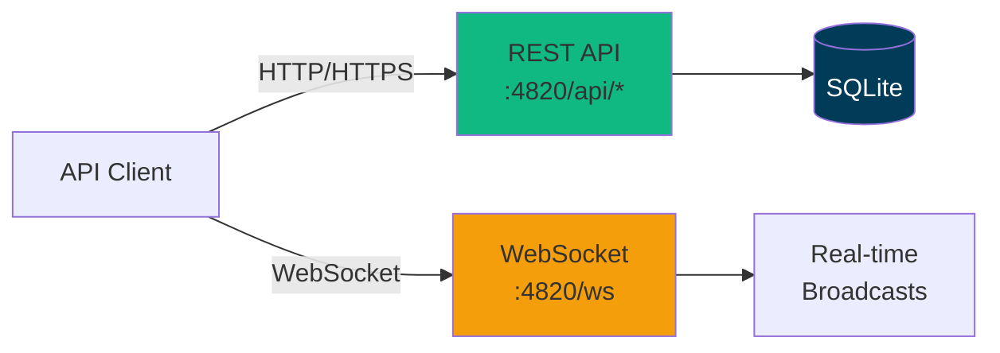
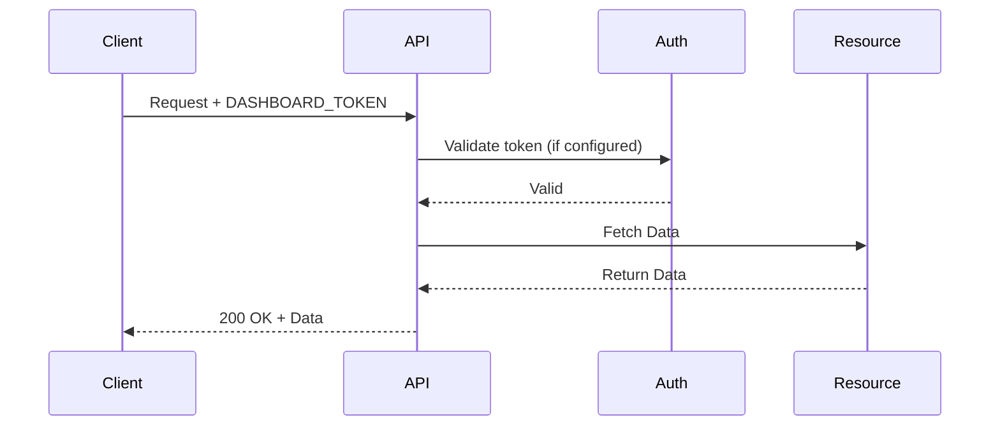
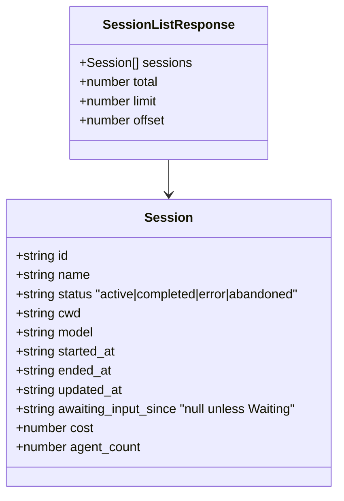
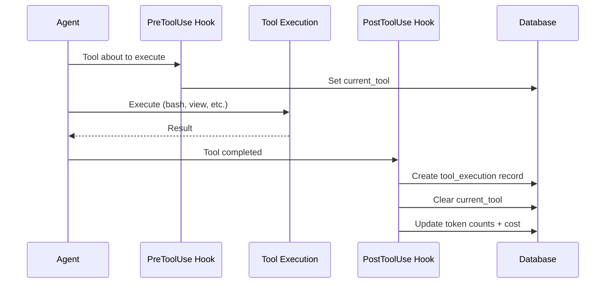
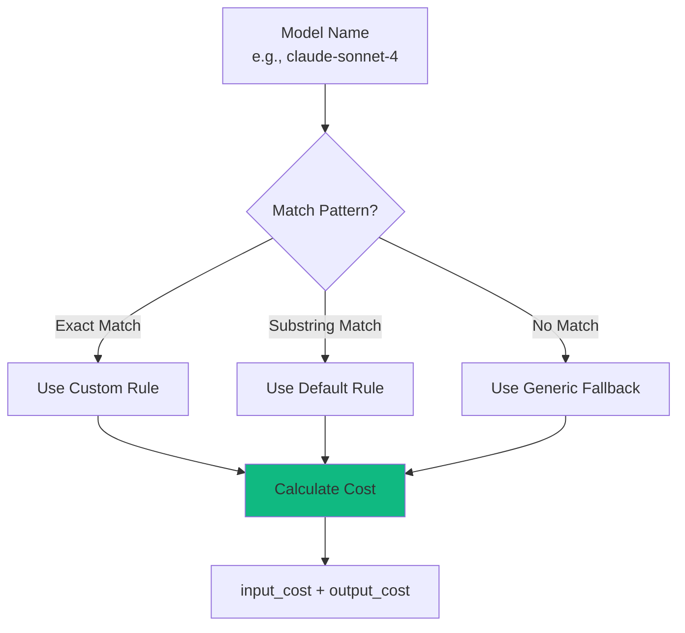
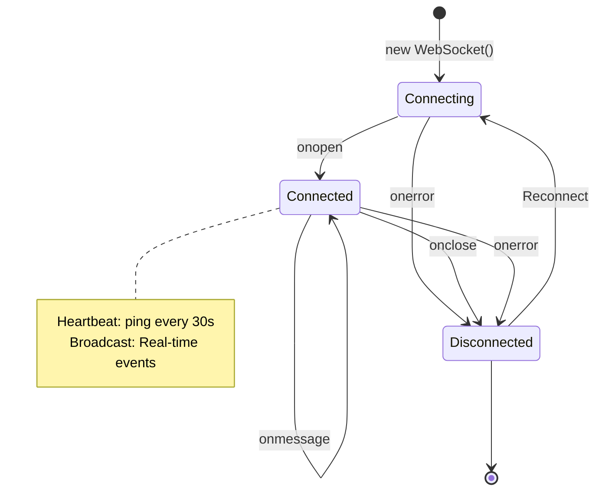
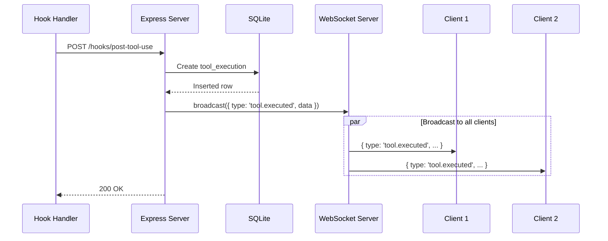
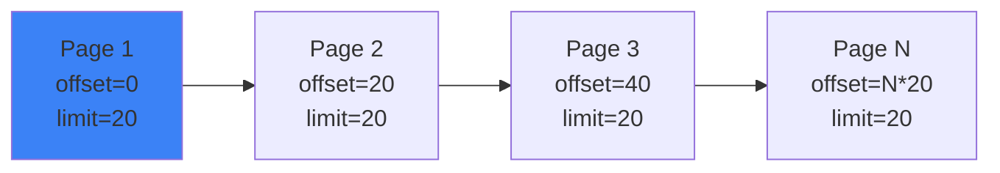

# API Reference

Complete REST API and WebSocket documentation for Agent Dashboard.

---

## Table of Contents

- [Overview](#overview)
- [Authentication](#authentication)
- [Base URL](#base-url)
- [REST API](#rest-api)
  - [Sessions](#sessions)
  - [Agents](#agents)
  - [Tools](#tools)
  - [Pricing](#pricing)
  - [Notifications](#notifications)
- [WebSocket API](#websocket-api)
- [Error Handling](#error-handling)
- [Rate Limiting](#rate-limiting)
- [Pagination](#pagination)
- [Examples](#examples)

---

## Overview

The Agent Dashboard API provides programmatic access to Claude Code session monitoring data.



**Protocols:**
- **REST API** - HTTP/JSON for queries and mutations
- **WebSocket** - Real-time event streaming

---

## Authentication

The server is **local-first** and is hardened to keep the dashboard off the network by default (see GHSA-gr74-4xfh-6jw9). The trust boundary is the loopback bind, layered with origin and host checks:

- **Loopback bind by default** — the server binds `127.0.0.1`, so it is not network-reachable out of the box. Operators opt into a wider bind with `DASHBOARD_HOST` (e.g. `DASHBOARD_HOST=0.0.0.0` for LAN access), which logs a startup warning.
- **CORS restricted to loopback origins** — cross-origin web pages cannot read API responses. Requests with no `Origin` (curl, server-to-server) still work.
- **Host-header allowlist** — both HTTP requests and WebSocket upgrades are checked against an allowlist to block DNS-rebinding. Add extra LAN names (when you bind beyond loopback) via `DASHBOARD_ALLOWED_HOSTS` (comma-separated).

For deliberate LAN exposure, set `DASHBOARD_HOST` to a non-loopback address and list the names clients use in `DASHBOARD_ALLOWED_HOSTS`.

### Optional token (`DASHBOARD_TOKEN`)

Authentication is **off by default** (the loopback bind is the trust boundary). When `DASHBOARD_TOKEN` is set, every `/api/*` request **and** the WebSocket must present the token. It is strongly recommended whenever you bind beyond loopback. Pass it any of these ways:

- `Authorization: Bearer <token>` header
- `x-dashboard-token: <token>` header
- `?token=<token>` query parameter

These paths stay exempt even when a token is configured: `/api/health`, `/api/openapi.json`, `/api/docs`, and `/api/hooks` (local Claude Code hook ingestion). Requests that fail the check get `401` with error code `EUNAUTHORIZED`.



---

## Base URL

```
http://localhost:4820
```

For production, use HTTPS:

```
https://dashboard.example.com
```

---

## REST API

### Sessions

#### List Sessions

```http
GET /api/sessions
```

Returns all sessions, ordered by most recent activity.

**Query Parameters:**

| Parameter | Type | Default | Description |
|-----------|------|---------|-------------|
| `limit` | integer | 50 | Maximum sessions to return (1-1000) |
| `offset` | integer | 0 | Pagination offset |
| `status` | string | - | Filter by persisted status: `active`, `completed`, `error`, `abandoned`. The UI **Waiting** state is derived from the `awaiting_input_since` column and is not a queryable enum — filter `status=active` and inspect `awaiting_input_since` (non-null = Waiting) |

**Example Request:**

```bash
curl http://localhost:4820/api/sessions?limit=10&status=active
```

**Example Response:**

```json
{
  "sessions": [
    {
      "id": 1,
      "session_id": "sess_abc123",
      "model": "claude-sonnet-4",
      "status": "active",
      "total_cost": 1.23,
      "agent_count": 3,
      "tool_count": 12,
      "created_at": "2024-03-18T12:00:00Z",
      "updated_at": "2024-03-18T14:30:00Z"
    }
  ],
  "total": 42,
  "limit": 10,
  "offset": 0
}
```

**Response Schema:**



---

#### Get Session

```http
GET /api/sessions/:id
```

Returns single session details.

**Path Parameters:**

| Parameter | Type | Description |
|-----------|------|-------------|
| `id` | string | Session ID (e.g., `sess_abc123`) |

**Example Request:**

```bash
curl http://localhost:4820/api/sessions/sess_abc123
```

**Example Response:**

```json
{
  "session": {
    "id": 1,
    "session_id": "sess_abc123",
    "model": "claude-sonnet-4",
    "status": "active",
    "total_cost": 1.23,
    "created_at": "2024-03-18T12:00:00Z",
    "updated_at": "2024-03-18T14:30:00Z"
  }
}
```

**Error Responses:**

| Code | Description |
|------|-------------|
| 404 | Session not found |
| 500 | Internal server error |

---

#### Get Session Stats

```http
GET /api/sessions/:id/stats
```

Returns aggregated counts powering the Session Detail overview panel. All aggregation runs in SQL — the response is cheap to compute even for sessions with tens of thousands of events.

**Path Parameters:**

| Parameter | Type | Description |
|-----------|------|-------------|
| `id` | string | Session ID |

**Example Request:**

```bash
curl http://localhost:4820/api/sessions/sess_abc123/stats
```

**Example Response:**

```json
{
  "session_id": "sess_abc123",
  "total_events": 14082,
  "events_by_type": [
    { "event_type": "PreToolUse", "count": 5210 },
    { "event_type": "PostToolUse", "count": 5208 }
  ],
  "tools_used": [
    { "tool_name": "Bash", "count": 1842 },
    { "tool_name": "Read", "count": 1340 }
  ],
  "error_count": 12,
  "first_event_at": "2026-04-26T18:59:00.000Z",
  "last_event_at": "2026-04-29T21:30:14.000Z",
  "agents": {
    "total": 12,
    "main": 1,
    "subagent": 11,
    "compaction": 5,
    "by_status": { "completed": 11, "working": 1 }
  },
  "subagent_types": [
    { "subagent_type": "Explore", "count": 4 }
  ],
  "tokens": {
    "input_tokens": 1376,
    "output_tokens": 760304,
    "cache_read_tokens": 337641891,
    "cache_write_tokens": 5126047
  }
}
```

**Error Responses:**

| Code | Description |
|------|-------------|
| 404 | Session not found |
| 500 | Internal server error |

---

#### Get Session Agents

```http
GET /api/sessions/:id/agents
```

Returns all agents for a session.

**Path Parameters:**

| Parameter | Type | Description |
|-----------|------|-------------|
| `id` | string | Session ID |

**Example Request:**

```bash
curl http://localhost:4820/api/sessions/sess_abc123/agents
```

**Example Response:**

```json
{
  "agents": [
    {
      "id": "sess_abc123-main",
      "session_id": "sess_abc123",
      "name": "Main Agent - my-project",
      "type": "main",
      "subagent_type": null,
      "status": "idle",
      "current_tool": null,
      "task": null,
      "started_at": "2024-03-18T12:00:00Z",
      "ended_at": null,
      "updated_at": "2024-03-18T12:05:00Z",
      "parent_agent_id": null,
      "awaiting_input_since": "2024-03-18T12:05:00Z"
    }
  ]
}
```

> **Note on `status` vs Waiting** — agents are persisted with one of `idle | connected | working | completed | error`. The yellow **Waiting** badge surfaced in the dashboard is a UI overlay derived from `awaiting_input_since` being non-null on a non-terminal agent (typically `idle` after a `Stop`, or `connected` right after `SessionStart`). Filter `?status=idle` on `/api/agents` and inspect `awaiting_input_since` to enumerate currently-waiting main agents.

---

### Agents

#### Get Agent

```http
GET /api/agents/:id
```

Returns single agent details.

**Path Parameters:**

| Parameter | Type | Description |
|-----------|------|-------------|
| `id` | string | Agent ID (e.g., `agent_xyz789`) |

**Example Request:**

```bash
curl http://localhost:4820/api/agents/agent_xyz789
```

**Example Response:**

```json
{
  "agent": {
    "id": 1,
    "agent_id": "agent_xyz789",
    "session_id": "sess_abc123",
    "agent_type": "explore",
    "status": "completed",
    "current_tool": null,
    "input_tokens": 1500,
    "output_tokens": 800,
    "cost": 0.45,
    "created_at": "2024-03-18T12:00:00Z",
    "updated_at": "2024-03-18T12:05:00Z"
  }
}
```

---

#### Get Agent Tools

```http
GET /api/agents/:id/tools
```

Returns tool executions for an agent.

**Path Parameters:**

| Parameter | Type | Description |
|-----------|------|-------------|
| `id` | string | Agent ID |

**Example Request:**

```bash
curl http://localhost:4820/api/agents/agent_xyz789/tools
```

**Example Response:**

```json
{
  "tools": [
    {
      "id": 1,
      "agent_id": "agent_xyz789",
      "tool_name": "bash",
      "duration_ms": 1234,
      "success": 1,
      "error_message": null,
      "created_at": "2024-03-18T12:01:00Z"
    },
    {
      "id": 2,
      "agent_id": "agent_xyz789",
      "tool_name": "view",
      "duration_ms": 45,
      "success": 1,
      "error_message": null,
      "created_at": "2024-03-18T12:02:00Z"
    }
  ]
}
```

**Tool Execution Flow:**



---

### Tools

#### List All Tools

```http
GET /api/tools
```

Returns all tool executions across all sessions.

**Query Parameters:**

| Parameter | Type | Default | Description |
|-----------|------|---------|-------------|
| `limit` | integer | 100 | Max tools to return |
| `tool_name` | string | - | Filter by tool name |
| `success` | boolean | - | Filter by success status |

**Example Request:**

```bash
curl http://localhost:4820/api/tools?limit=50&tool_name=bash
```

**Example Response:**

```json
{
  "tools": [
    {
      "id": 1,
      "agent_id": "agent_xyz789",
      "tool_name": "bash",
      "duration_ms": 1234,
      "success": 1,
      "error_message": null,
      "created_at": "2024-03-18T12:01:00Z"
    }
  ],
  "total": 156
}
```

---

### Pricing

#### List Pricing Rules

```http
GET /api/pricing
```

Returns all pricing rules (default + custom).

**Example Request:**

```bash
curl http://localhost:4820/api/pricing
```

**Example Response:**

```json
{
  "rules": [
    {
      "id": 1,
      "pattern": "claude-sonnet-4",
      "input_cost_per_1m": 3.0,
      "output_cost_per_1m": 15.0,
      "is_default": true,
      "created_at": "2024-03-18T12:00:00Z"
    },
    {
      "id": 10,
      "pattern": "gpt-5.1-codex",
      "input_cost_per_1m": 2.5,
      "output_cost_per_1m": 10.0,
      "is_default": false,
      "created_at": "2024-03-18T14:30:00Z"
    }
  ]
}
```

**Pricing Rule Matching:**



---

#### Create Pricing Rule

```http
POST /api/pricing
```

Create custom pricing rule.

**Request Body:**

```json
{
  "pattern": "gpt-5.1-codex",
  "input_cost_per_1m": 2.5,
  "output_cost_per_1m": 10.0
}
```

**Validation Rules:**

| Field | Type | Constraints |
|-------|------|-------------|
| `pattern` | string | Required, unique, 1-100 chars |
| `input_cost_per_1m` | number | Required, >= 0 |
| `output_cost_per_1m` | number | Required, >= 0 |

**Example Request:**

```bash
curl -X POST http://localhost:4820/api/pricing \
  -H "Content-Type: application/json" \
  -d '{
    "pattern": "gpt-5.1-codex",
    "input_cost_per_1m": 2.5,
    "output_cost_per_1m": 10.0
  }'
```

**Example Response:**

```json
{
  "rule": {
    "id": 10,
    "pattern": "gpt-5.1-codex",
    "input_cost_per_1m": 2.5,
    "output_cost_per_1m": 10.0,
    "created_at": "2024-03-18T14:30:00Z"
  }
}
```

**Error Responses:**

| Code | Description |
|------|-------------|
| 400 | Invalid request body |
| 409 | Pattern already exists |
| 500 | Database error |

---

#### Delete Pricing Rule

```http
DELETE /api/pricing/:pattern
```

Delete custom pricing rule (default rules cannot be deleted).

**Path Parameters:**

| Parameter | Type | Description |
|-----------|------|-------------|
| `pattern` | string | Pattern to delete (URL-encoded) |

**Example Request:**

```bash
# Pattern must be URL-encoded
curl -X DELETE http://localhost:4820/api/pricing/gpt-5.1-codex
```

**Example Response:**

```json
{
  "deleted": true
}
```

**Error Responses:**

| Code | Description |
|------|-------------|
| 404 | Pattern not found |
| 403 | Cannot delete default rule |
| 500 | Database error |

---

### Notifications

#### Get Session Notifications

```http
GET /api/sessions/:id/notifications
```

Returns notifications for a session.

**Path Parameters:**

| Parameter | Type | Description |
|-----------|------|-------------|
| `id` | string | Session ID |

**Example Request:**

```bash
curl http://localhost:4820/api/sessions/sess_abc123/notifications
```

**Example Response:**

```json
{
  "notifications": [
    {
      "id": 1,
      "session_id": "sess_abc123",
      "notification_type": "backgroundTaskComplete",
      "message": "Explore agent completed",
      "created_at": "2024-03-18T12:05:00Z"
    }
  ]
}
```

### Claude Config Explorer

The `/api/cc-config/*` namespace powers the Claude Config Explorer page. All read endpoints are pure file reads under `CLAUDE_HOME` and the project's `.claude/` dir; mutations are limited to low-risk text-file artifacts (skills, subagents, slash commands, output styles, memory) and always create a timestamped backup before writing. Plugins, MCP servers, hooks-in-settings, and live `settings.json` files stay read-only because they are written concurrently by the running Claude Code CLI.

```http
GET /api/cc-config/overview
GET /api/cc-config/skills?scope=user|project|all
GET /api/cc-config/agents
GET /api/cc-config/commands
GET /api/cc-config/output-styles
GET /api/cc-config/plugins
GET /api/cc-config/marketplaces
GET /api/cc-config/mcp
GET /api/cc-config/hooks
GET /api/cc-config/hook-scripts
GET /api/cc-config/keybindings
GET /api/cc-config/statusline
GET /api/cc-config/settings
GET /api/cc-config/memory
GET /api/cc-config/file?path=<absolute-path>
GET /api/cc-config/backups[?scope=&type=]
PUT /api/cc-config/file        Body: { scope, type, name?, content }
DELETE /api/cc-config/file     Body: { scope, type, name? }
```

`scope` is `"user"`, `"project"`, or `"auto-memory"`. `type` is one of `skills`, `agents`, `commands`, `output-styles`, `memory`, `auto-memory`. `name` is required for everything except `memory` (which is `CLAUDE.md` itself). On `PUT`, `name` is validated against `^[A-Za-z0-9][A-Za-z0-9._-]{0,63}$` (for `auto-memory` it must instead be a flat `*.md` filename). Settings are returned with secret-like keys (matching `/token|secret|password|api[_-]?key|auth/i`) replaced by `"<redacted>"`.

`GET /api/cc-config/memory` also surfaces the per-project file-based memory store — every `*.md` under `~/.claude/projects/<slug>/memory/` (the common pattern of a `MEMORY.md` index plus one file per remembered fact). Those items have `scope: "auto-memory"` and carry `project` (the `projects/<slug>` dir name), `name` (filename), `isIndex` (true for `MEMORY.md` / `INDEX-*.md`, which sort first), and parsed `frontmatter`. They are **editable**: `PUT`/`DELETE /api/cc-config/file` accept `{ scope: "auto-memory", type: "auto-memory", project, name, content? }` and create a timestamped backup under `<memory-dir>/.cc-config-backups/auto-memory/` before mutating (an invalid `project` slug returns `EBADPROJECT`). `GET /api/cc-config/backups` lists these with `scope: "auto-memory"` and `project` set. Bodies are also readable via `GET /api/cc-config/file` (they live under `CLAUDE_HOME`).

Backup paths look like `<root>/cc-config-backups/<type>/<base>.<ISO>.bak[.dir]` — outside the directories Claude Code scans, so a deleted skill cannot resurface as a backup-named one. The Backups modal in the UI auto-builds `mv` restore commands.

### Run Claude

The `/api/run/*` namespace spawns and supervises `claude` subprocesses from the dashboard. Every route enforces a same-origin / loopback-Origin guard; browser requests must come from `localhost`, `127.0.0.1`, `::1`, or `0.0.0.0`. CLI / curl requests with no `Origin` header pass through. When `DASHBOARD_TOKEN` is set, a valid token is also required here (like the rest of `/api/*` — see [Authentication](#authentication)).

```http
GET    /api/run                       List all handles + concurrency state
GET    /api/run/binary                { found, path } for the `claude` binary
GET    /api/run/cwds                  Suggested cwds (dashboard, home, recent)
GET    /api/run/files?cwd=&q=         Fuzzy file search inside cwd for the @-file autocomplete
                                       (skips node_modules, .git, dist, build, .next, .cache, coverage, vendor)
POST   /api/run                       Spawn — Body: { prompt, mode, cwd?, model?, permissionMode?, resumeSessionId?, effort? }
POST   /api/run/:id/message           Send follow-up turn — Body: { text }
GET    /api/run/:id[?envelopes=1]     Handle state; ?envelopes=1 includes the in-memory envelope log
DELETE /api/run/:id                   Stop (SIGTERM → SIGKILL after 5 s)
```

`mode` is `"headless"` (single-shot, stdin closed after spawn, prompt in argv via `-p`) or `"conversation"` (multi-turn, stdin stays open, prompt and follow-ups piped as stream-json envelopes). `resumeSessionId` requires conversation mode and adds `--resume <id>` so the run continues an existing Claude Code session — the cwd is locked to the original session's cwd. **When `resumeSessionId` is set, `prompt` may be empty** — the spawner skips the initial stdin write and `claude --resume` idles on the resumed conversation until the user posts a follow-up via `POST /api/run/:id/message`. Headless mode and fresh conversations still require a non-empty prompt (`EBADPROMPT` otherwise). `effort` (`"low"` / `"medium"` / `"high"`) maps to `--effort` and tunes the model's thinking budget. The spawner always passes `--output-format stream-json --verbose --include-partial-messages` so output streams over the existing dashboard WebSocket as `run_stream` (parsed envelopes, including `stream_event` deltas for character-by-character rendering), `run_status` (status transitions), and `run_input_ack` (stdin write confirmed). Concurrency is effectively uncapped (default ceiling 10000, override with `RUN_MAX_CONCURRENT`) — the terminal TUI has no cap and neither does the dashboard; the ceiling exists only to prevent fork-bomb footguns from a buggy client.

Spawned `claude` processes fire the dashboard's hooks like any other CLI session, so they show up in `/api/sessions`, the analytics, the Kanban board, and the Workflows page automatically — the Run page itself just owns the live streaming UX.

---

## WebSocket API

### Connection

```javascript
const ws = new WebSocket('ws://localhost:4820/ws');

ws.onopen = () => {
  console.log('Connected to Agent Dashboard');
};

ws.onmessage = (event) => {
  const message = JSON.parse(event.data);
  console.log('Received:', message);
};

ws.onerror = (error) => {
  console.error('WebSocket error:', error);
};

ws.onclose = () => {
  console.log('Disconnected');
};
```

When `DASHBOARD_TOKEN` is configured, pass the token as `?token=<token>` on the `/ws` upgrade (an `x-dashboard-token` header also works):

```javascript
const ws = new WebSocket('ws://localhost:4820/ws?token=YOUR_DASHBOARD_TOKEN');
```

### WebSocket Lifecycle



### Event Types

Server broadcasts JSON messages to all connected clients:

#### session.created

Sent when a new session is created.

```json
{
  "type": "session.created",
  "data": {
    "id": 1,
    "session_id": "sess_abc123",
    "model": "claude-sonnet-4",
    "status": "active",
    "total_cost": 0,
    "created_at": "2024-03-18T12:00:00Z",
    "updated_at": "2024-03-18T12:00:00Z"
  }
}
```

#### session.updated

Sent when session data changes (status, cost, etc.).

```json
{
  "type": "session.updated",
  "data": {
    "id": 1,
    "session_id": "sess_abc123",
    "model": "claude-sonnet-4",
    "status": "completed",
    "total_cost": 1.23,
    "created_at": "2024-03-18T12:00:00Z",
    "updated_at": "2024-03-18T14:30:00Z"
  }
}
```

#### agent.created

Sent when a new agent starts.

```json
{
  "type": "agent.created",
  "data": {
    "id": 1,
    "agent_id": "agent_xyz789",
    "session_id": "sess_abc123",
    "agent_type": "explore",
    "status": "running",
    "current_tool": null,
    "input_tokens": 0,
    "output_tokens": 0,
    "cost": 0,
    "created_at": "2024-03-18T12:00:00Z",
    "updated_at": "2024-03-18T12:00:00Z"
  }
}
```

#### agent.updated

Sent when agent data changes (tokens, status, current_tool).

```json
{
  "type": "agent.updated",
  "data": {
    "id": 1,
    "agent_id": "agent_xyz789",
    "session_id": "sess_abc123",
    "agent_type": "explore",
    "status": "completed",
    "current_tool": null,
    "input_tokens": 1500,
    "output_tokens": 800,
    "cost": 0.45,
    "created_at": "2024-03-18T12:00:00Z",
    "updated_at": "2024-03-18T12:05:00Z"
  }
}
```

#### tool.executed

Sent when a tool execution completes.

```json
{
  "type": "tool.executed",
  "data": {
    "id": 1,
    "agent_id": "agent_xyz789",
    "tool_name": "bash",
    "duration_ms": 1234,
    "success": 1,
    "error_message": null,
    "created_at": "2024-03-18T12:01:00Z"
  }
}
```

#### notification.received

Sent when a notification is created.

```json
{
  "type": "notification.received",
  "data": {
    "id": 1,
    "session_id": "sess_abc123",
    "notification_type": "backgroundTaskComplete",
    "message": "Explore agent completed",
    "created_at": "2024-03-18T12:05:00Z"
  }
}
```

#### run_stream / run_status / run_input_ack

Broadcast by `routes/run.js` and `lib/run-spawner.js` for `/run` page subprocesses. `run_stream.data.envelope` is a parsed stream-json envelope; the spawner runs claude with `--include-partial-messages` so this includes `stream_event` deltas (`message_start`, `content_block_delta` text/thinking deltas, `message_stop`, etc.) for character-level streaming.

```json
{ "type": "run_stream", "data": { "id": "<run-id>", "envelope": { "type": "stream_event", "event": { "type": "content_block_delta", "index": 0, "delta": { "type": "text_delta", "text": "Hello" } } } } }
{ "type": "run_status", "data": { "id": "<run-id>", "status": "running", "at": 1700000000000 } }
{ "type": "run_input_ack", "data": { "id": "<run-id>", "messageId": "<uuid>", "at": 1700000000000 } }
```

#### cc_config_changed

Broadcast whenever Claude Code configuration changes — either by dashboard mutations on `PUT/DELETE /api/cc-config/file` (`source: "dashboard"`) or by `lib/cc-watcher.js` picking up external `fs.watch` events on `~/.claude/` and `~/.claude.json` (`source: "fs"`, debounced at 500 ms). The Config Explorer page subscribes and refetches automatically.

```json
{ "type": "cc_config_changed", "data": { "source": "dashboard", "action": "write", "scope": "user", "type": "skill", "name": "my-skill" } }
{ "type": "cc_config_changed", "data": { "source": "fs", "paths": ["/Users/foo/.claude/settings.json"] } }
```

### Event Flow



---

## Error Handling

### Error Response Format

All error responses follow this structure:

```json
{
  "error": "Human-readable error message",
  "code": "ERROR_CODE",
  "details": {
    "field": "Additional context"
  }
}
```

### HTTP Status Codes

| Code | Meaning | Example |
|------|---------|---------|
| 200 | Success | Resource retrieved |
| 201 | Created | Resource created |
| 400 | Bad Request | Invalid JSON, missing fields |
| 404 | Not Found | Session/agent not found |
| 409 | Conflict | Duplicate pattern |
| 500 | Server Error | Database error |

### Error Examples

**400 Bad Request:**

```json
{
  "error": "Missing required field: pattern",
  "code": "VALIDATION_ERROR",
  "details": {
    "field": "pattern",
    "message": "Pattern is required"
  }
}
```

**404 Not Found:**

```json
{
  "error": "Session not found",
  "code": "NOT_FOUND",
  "details": {
    "session_id": "sess_invalid"
  }
}
```

**409 Conflict:**

```json
{
  "error": "Pricing rule already exists",
  "code": "DUPLICATE_PATTERN",
  "details": {
    "pattern": "claude-sonnet-4"
  }
}
```

---

## Rate Limiting

Currently, no rate limiting is enforced. For production deployments, implement rate limiting:

```javascript
// Using express-rate-limit
import rateLimit from 'express-rate-limit';

const limiter = rateLimit({
  windowMs: 15 * 60 * 1000, // 15 minutes
  max: 100, // Limit each IP to 100 requests per windowMs
  message: 'Too many requests, please try again later.'
});

app.use('/api/', limiter);
```

---

## Pagination

For endpoints returning lists, use `limit` and `offset`:

```http
GET /api/sessions?limit=20&offset=40
```

**Pagination Pattern:**



**Response includes pagination metadata:**

```json
{
  "sessions": [...],
  "total": 156,
  "limit": 20,
  "offset": 40,
  "has_more": true
}
```

---

## Examples

### Full Session Workflow

```javascript
// 1. List sessions
const sessions = await fetch('http://localhost:4820/api/sessions');
const { sessions: sessionList } = await sessions.json();

// 2. Get specific session
const sessionId = sessionList[0].session_id;
const session = await fetch(`http://localhost:4820/api/sessions/${sessionId}`);
const sessionData = await session.json();

// 3. Get session agents
const agents = await fetch(`http://localhost:4820/api/sessions/${sessionId}/agents`);
const { agents: agentList } = await agents.json();

// 4. Get agent tools
const agentId = agentList[0].agent_id;
const tools = await fetch(`http://localhost:4820/api/agents/${agentId}/tools`);
const { tools: toolList } = await tools.json();

console.log('Session:', sessionData);
console.log('Agents:', agentList);
console.log('Tools:', toolList);
```

### Real-time Monitoring

```javascript
// Connect to WebSocket
const ws = new WebSocket('ws://localhost:4820/ws');

ws.onopen = () => {
  console.log('Connected to real-time stream');
};

ws.onmessage = (event) => {
  const message = JSON.parse(event.data);
  
  switch (message.type) {
    case 'session.created':
      console.log('New session:', message.data.session_id);
      break;
    
    case 'agent.updated':
      console.log('Agent updated:', message.data.agent_id);
      console.log('Cost:', message.data.cost);
      break;
    
    case 'tool.executed':
      console.log('Tool executed:', message.data.tool_name);
      console.log('Duration:', message.data.duration_ms, 'ms');
      break;
  }
};
```

### Creating Pricing Rules

```javascript
// Create custom rule
const response = await fetch('http://localhost:4820/api/pricing', {
  method: 'POST',
  headers: { 'Content-Type': 'application/json' },
  body: JSON.stringify({
    pattern: 'my-custom-model',
    input_cost_per_1m: 5.0,
    output_cost_per_1m: 20.0
  })
});

const { rule } = await response.json();
console.log('Created rule:', rule);

// List all rules
const rules = await fetch('http://localhost:4820/api/pricing');
const { rules: ruleList } = await rules.json();
console.log('All rules:', ruleList);

// Delete rule
await fetch('http://localhost:4820/api/pricing/my-custom-model', {
  method: 'DELETE'
});
```

---

## Summary

The Agent Dashboard API provides:

- ✅ **RESTful endpoints** for querying sessions, agents, tools, pricing
- ✅ **WebSocket streaming** for real-time updates
- ✅ **Type-safe responses** with consistent JSON structure
- ✅ **Error handling** with descriptive error codes
- ✅ **Pagination** for large datasets
- ✅ **Pricing management** with custom rule support

For integration examples, see [docs/INTEGRATION.md](./INTEGRATION.md).
