# Database Schema Reference

Comprehensive database schema documentation for Agent Dashboard SQLite database.

---

## Table of Contents

- [Overview](#overview)
- [Schema Diagram](#schema-diagram)
- [Table Definitions](#table-definitions)
- [Indexes](#indexes)
- [Migrations](#migrations)
- [Query Patterns](#query-patterns)
- [Performance Optimization](#performance-optimization)
- [Data Integrity](#data-integrity)
- [Backup Strategies](#backup-strategies)

---

## Overview

Agent Dashboard uses **SQLite 3** as its primary data store with the following characteristics:

- **File-based** - Single database file, portable across systems
- **Embedded** - No separate server process required
- **ACID compliant** - Transactions ensure data integrity
- **WAL mode** - Write-Ahead Logging for better concurrency
- **Prepared statements** - Prevent SQL injection, optimize performance

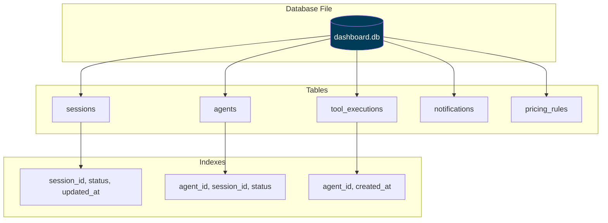

**Database Location:**
- Development: `./data/dashboard.db`
- Production: `/var/lib/agent-dashboard/dashboard.db` (configurable via `DASHBOARD_DB_PATH`)

---

## Schema Diagram

### Entity-Relationship Diagram

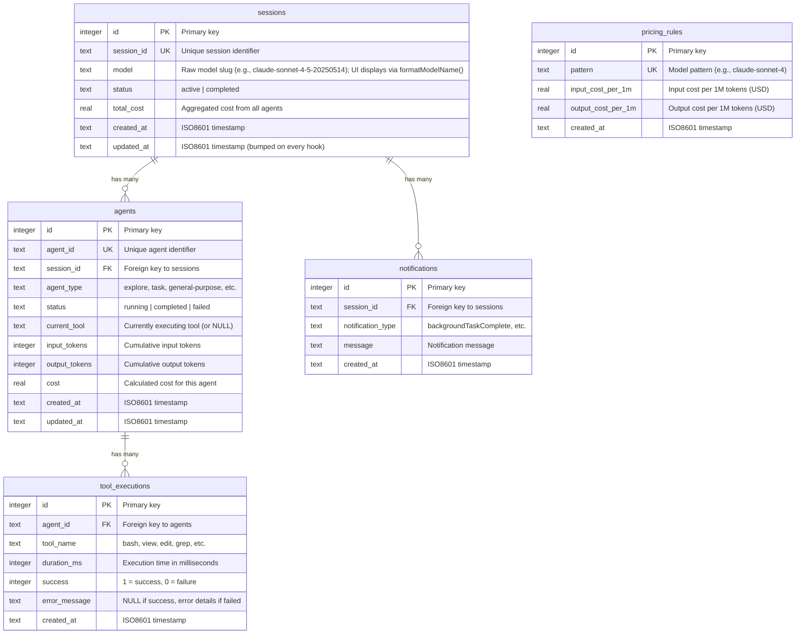

### Relationship Cardinality

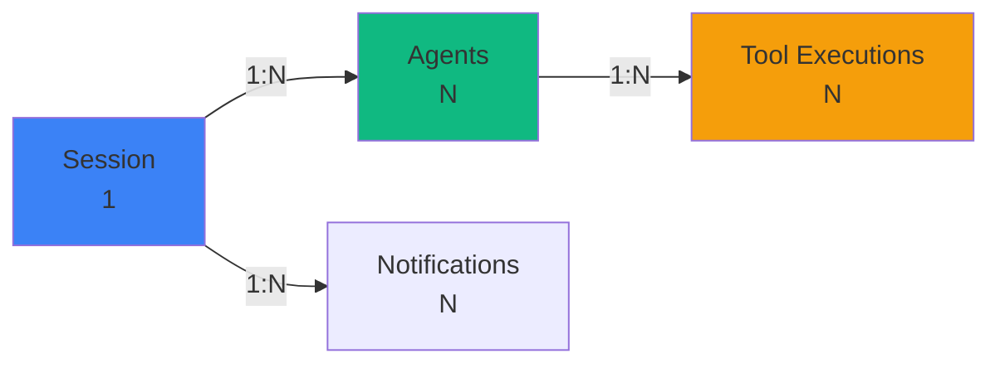

---

## Table Definitions

### sessions

Tracks Claude Code sessions (one per CLI invocation or background task). Schema mirrors `server/db.js`.

```sql
CREATE TABLE sessions (
    id TEXT PRIMARY KEY,                                              -- UUID from Claude Code
    name TEXT,
    status TEXT NOT NULL DEFAULT 'active'
        CHECK (status IN ('active','completed','error','abandoned')),
    cwd TEXT,
    model TEXT,
    started_at TEXT NOT NULL DEFAULT (strftime('%Y-%m-%dT%H:%M:%fZ','now')),
    ended_at TEXT,
    metadata TEXT,
    updated_at TEXT NOT NULL DEFAULT (strftime('%Y-%m-%dT%H:%M:%fZ','now')),
    awaiting_input_since TEXT,                                        -- NULL unless Waiting
    transcript_path TEXT                                              -- absolute path to JSONL transcript
);
```

**Columns:**

| Column | Type | Nullable | Description |
|--------|------|----------|-------------|
| `id` | TEXT | NO | Session UUID (assigned by Claude Code) |
| `name` | TEXT | YES | Human-readable label. Synced from the transcript title by `routes/hooks.js` (and the 15 s watchdog) on every event: the `custom-title` line (`/rename`, `claude -n`, picker `Ctrl+R`) always wins, otherwise the auto-generated `ai-title` fills a placeholder/auto name. Falls back to `Session <id8>` |
| `status` | TEXT | NO | `active`, `completed`, `error`, or `abandoned` (CHECK-constrained) |
| `cwd` | TEXT | YES | Working directory the CLI was launched from |
| `model` | TEXT | YES | Claude model ID (e.g. `claude-opus-4-7`) |
| `started_at` | TEXT | NO | ISO 8601 timestamp |
| `ended_at` | TEXT | YES | ISO 8601 timestamp on terminal transition |
| `metadata` | TEXT | YES | JSON blob for extras (turn duration totals, thinking blocks, …) |
| `updated_at` | TEXT | NO | Bumped on every event for staleness detection |
| `awaiting_input_since` | TEXT | YES | ISO 8601 stamp set when the session is **Waiting** (Stop, SessionStart, permission Notification, or watchdog user-interrupt/Esc recovery). NULL otherwise |
| `transcript_path` | TEXT | YES | Absolute path to the session's JSONL transcript. Written by `routes/hooks.js` on the first event that carries it (subsequent events no-op via a SQL guard) and read by the periodic compaction sweep — so the sweep touches only active session rows instead of scanning the entire `events` table for `json_extract(data,'$.transcript_path')`. Backfilled once from `events` by the `db.js` migration |

**Constraints:**
- `status` must be one of the four enum values
- `awaiting_input_since` is ignored on non-`active` sessions for UI bucketing

**Lifecycle:**

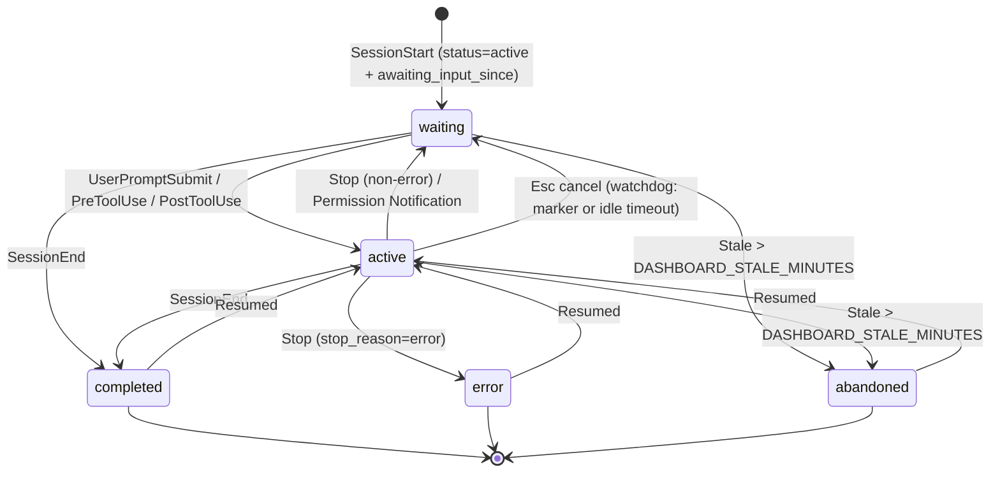

---

### agents

Tracks main agents and subagents within a session. Main agents have id `${session_id}-main`; subagents get a fresh UUID.

```sql
CREATE TABLE agents (
    id TEXT PRIMARY KEY,
    session_id TEXT NOT NULL,
    name TEXT NOT NULL,
    type TEXT NOT NULL DEFAULT 'main' CHECK (type IN ('main','subagent')),
    subagent_type TEXT,
    status TEXT NOT NULL DEFAULT 'idle'
        CHECK (status IN ('idle','connected','working','completed','error')),
    task TEXT,
    current_tool TEXT,
    started_at TEXT NOT NULL DEFAULT (strftime('%Y-%m-%dT%H:%M:%fZ','now')),
    ended_at TEXT,
    parent_agent_id TEXT,
    metadata TEXT,
    updated_at TEXT NOT NULL DEFAULT (strftime('%Y-%m-%dT%H:%M:%fZ','now')),
    awaiting_input_since TEXT,                                        -- main-agent waiting flag
    FOREIGN KEY (session_id) REFERENCES sessions(id) ON DELETE CASCADE,
    FOREIGN KEY (parent_agent_id) REFERENCES agents(id) ON DELETE SET NULL
);
```

**Columns:**

| Column | Type | Nullable | Description |
|--------|------|----------|-------------|
| `id` | TEXT | NO | UUID (subagents) or `${session_id}-main` (main agent) |
| `session_id` | TEXT | NO | FK to `sessions.id`, cascades on delete |
| `name` | TEXT | NO | Display label (e.g. `Main Agent - {session name}` or subagent description) |
| `type` | TEXT | NO | `main` or `subagent` |
| `subagent_type` | TEXT | YES | `Explore`, `general-purpose`, `code-review`, `compaction`, … |
| `status` | TEXT | NO | `idle`, `connected`, `working`, `completed`, `error` (CHECK-constrained). The dashboard's **Waiting** badge is the UI overlay produced by `awaiting_input_since`; it is not a persisted status |
| `task` | TEXT | YES | Subagent prompt / brief |
| `current_tool` | TEXT | YES | Tool currently running (cleared on `PostToolUse`) |
| `parent_agent_id` | TEXT | YES | FK to spawning agent for nested subagent trees |
| `metadata` | TEXT | YES | JSON blob for extras |
| `awaiting_input_since` | TEXT | YES | Mirrors the parent session's flag for the main agent. NULL on subagents |

**Lifecycle:**

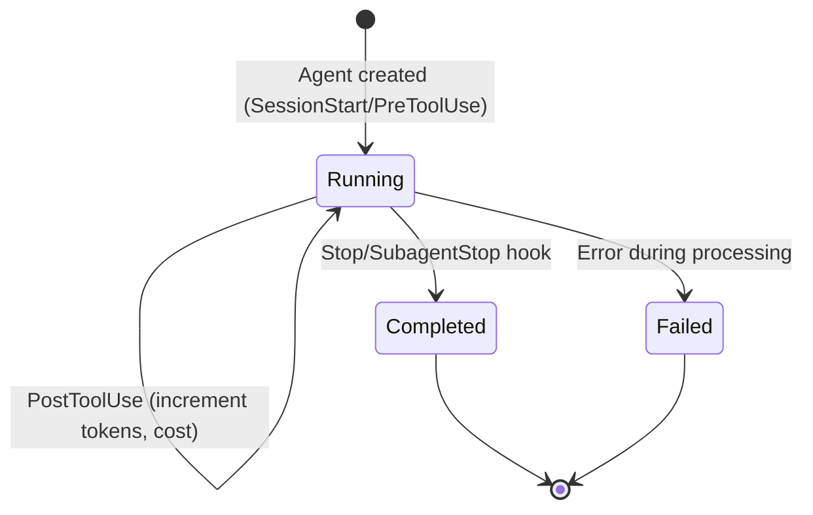

**current_tool Behavior:**
- Set to tool name on `PreToolUse` hook (e.g., `"bash"`, `"view"`)
- Cleared to `NULL` on `PostToolUse` hook
- Used to show real-time tool execution in UI

---

### tool_executions

Records each tool call made by agents.

```sql
CREATE TABLE tool_executions (
    id INTEGER PRIMARY KEY AUTOINCREMENT,
    agent_id TEXT NOT NULL,
    tool_name TEXT NOT NULL,
    duration_ms INTEGER,
    success INTEGER DEFAULT 1,
    error_message TEXT,
    created_at TEXT DEFAULT (datetime('now')),
    FOREIGN KEY (agent_id) REFERENCES agents(agent_id)
);
```

**Columns:**

| Column | Type | Nullable | Description |
|--------|------|----------|-------------|
| `id` | INTEGER | NO | Auto-increment primary key |
| `agent_id` | TEXT | NO | Foreign key to `agents.agent_id` |
| `tool_name` | TEXT | NO | Tool name (`bash`, `view`, `edit`, `grep`, etc.) |
| `duration_ms` | INTEGER | YES | Execution time in milliseconds |
| `success` | INTEGER | NO | 1 = success, 0 = failure |
| `error_message` | TEXT | YES | NULL if success, error details if failed |
| `created_at` | TEXT | NO | ISO8601 timestamp of execution |

**Common Tool Names:**
- `bash` - Shell command execution
- `view` - File/directory viewing
- `edit` - File editing
- `grep` - Code search
- `glob` - File pattern matching
- `task` - Sub-agent invocation
- `sql` - SQLite query execution

**Duration Distribution:**

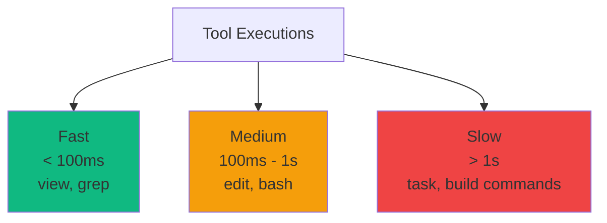

---

### notifications

Stores system notifications from Claude Code.

```sql
CREATE TABLE notifications (
    id INTEGER PRIMARY KEY AUTOINCREMENT,
    session_id TEXT NOT NULL,
    notification_type TEXT NOT NULL,
    message TEXT,
    created_at TEXT DEFAULT (datetime('now')),
    FOREIGN KEY (session_id) REFERENCES sessions(session_id)
);
```

**Columns:**

| Column | Type | Nullable | Description |
|--------|------|----------|-------------|
| `id` | INTEGER | NO | Auto-increment primary key |
| `session_id` | TEXT | NO | Foreign key to `sessions.session_id` |
| `notification_type` | TEXT | NO | Type of notification |
| `message` | TEXT | YES | Notification message content |
| `created_at` | TEXT | NO | ISO8601 timestamp |

**Common Notification Types:**
- `backgroundTaskComplete` - Background agent finished
- `errorOccurred` - Error during execution
- `systemMessage` - General system message

---

### pricing_rules

Custom pricing rules for cost calculation.

```sql
CREATE TABLE pricing_rules (
    id INTEGER PRIMARY KEY AUTOINCREMENT,
    pattern TEXT UNIQUE NOT NULL,
    input_cost_per_1m REAL NOT NULL,
    output_cost_per_1m REAL NOT NULL,
    created_at TEXT DEFAULT (datetime('now'))
);
```

**Columns:**

| Column | Type | Nullable | Description |
|--------|------|----------|-------------|
| `id` | INTEGER | NO | Auto-increment primary key |
| `pattern` | TEXT | NO | Model pattern (exact match or substring) |
| `input_cost_per_1m` | REAL | NO | Input cost per 1M tokens (USD) |
| `output_cost_per_1m` | REAL | NO | Output cost per 1M tokens (USD) |
| `created_at` | TEXT | NO | ISO8601 timestamp |

**Default Pricing Rules:**

| Pattern | Input ($/1M) | Output ($/1M) |
|---------|--------------|---------------|
| `claude-sonnet-4` | $3.00 | $15.00 |
| `claude-opus-4` | $15.00 | $75.00 |
| `claude-haiku-4` | $0.80 | $4.00 |
| `gpt-5.1-codex` | $2.50 | $10.00 |
| `gpt-5-mini` | $0.15 | $0.60 |

---

## Indexes

### sessions Indexes

```sql
CREATE INDEX idx_sessions_session_id ON sessions(session_id);
CREATE INDEX idx_sessions_status ON sessions(status);
CREATE INDEX idx_sessions_updated_at ON sessions(updated_at DESC);

-- Partial index covering only the rows the periodic compaction sweep reads:
-- active sessions with a known transcript_path. Writes to other sessions skip
-- the index entirely, so the maintenance cost stays bounded by the small set
-- of live sessions.
CREATE INDEX idx_sessions_active_tp
    ON sessions(status, transcript_path)
    WHERE status='active' AND transcript_path IS NOT NULL;
```

**Query Patterns:**
- `SELECT * FROM sessions WHERE session_id = ?` - Primary key lookup
- `SELECT * FROM sessions WHERE status = 'active'` - Filter by status
- `SELECT * FROM sessions ORDER BY updated_at DESC LIMIT 50` - Recent sessions
- `SELECT id, transcript_path FROM sessions WHERE status='active' AND transcript_path IS NOT NULL ORDER BY updated_at DESC` — periodic compaction sweep (covered by the partial index above)

### agents Indexes

```sql
CREATE INDEX idx_agents_agent_id ON agents(agent_id);
CREATE INDEX idx_agents_session_id ON agents(session_id);
CREATE INDEX idx_agents_status ON agents(status);
```

**Query Patterns:**
- `SELECT * FROM agents WHERE agent_id = ?` - Primary key lookup
- `SELECT * FROM agents WHERE session_id = ?` - All agents for session
- `SELECT * FROM agents WHERE status = 'running'` - Active agents

### tool_executions Indexes

```sql
CREATE INDEX idx_tools_agent_id ON tool_executions(agent_id);
CREATE INDEX idx_tools_created_at ON tool_executions(created_at DESC);
```

**Query Patterns:**
- `SELECT * FROM tool_executions WHERE agent_id = ?` - All tools for agent
- `SELECT * FROM tool_executions ORDER BY created_at DESC LIMIT 100` - Recent tools

### notifications Indexes

```sql
CREATE INDEX idx_notifications_session_id ON notifications(session_id);
```

**Query Patterns:**
- `SELECT * FROM notifications WHERE session_id = ?` - All notifications for session

---

## Migrations

### Schema Versioning

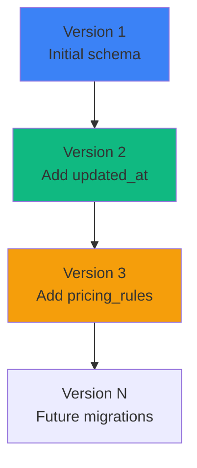

### Migration Strategy

```javascript
// db.js - Schema versioning
const SCHEMA_VERSION = 3;

function runMigrations() {
  const currentVersion = db.pragma('user_version', { simple: true });
  
  if (currentVersion < 1) {
    // Initial schema
    db.exec(`
      CREATE TABLE sessions (...);
      CREATE TABLE agents (...);
      -- etc.
    `);
    db.pragma('user_version = 1');
  }
  
  if (currentVersion < 2) {
    // Add updated_at column
    db.exec(`ALTER TABLE sessions ADD COLUMN updated_at TEXT DEFAULT (datetime('now'))`);
    db.pragma('user_version = 2');
  }
  
  if (currentVersion < 3) {
    // Add pricing_rules table
    db.exec(`CREATE TABLE pricing_rules (...)`);
    db.pragma('user_version = 3');
  }
}
```

### Migration Workflow

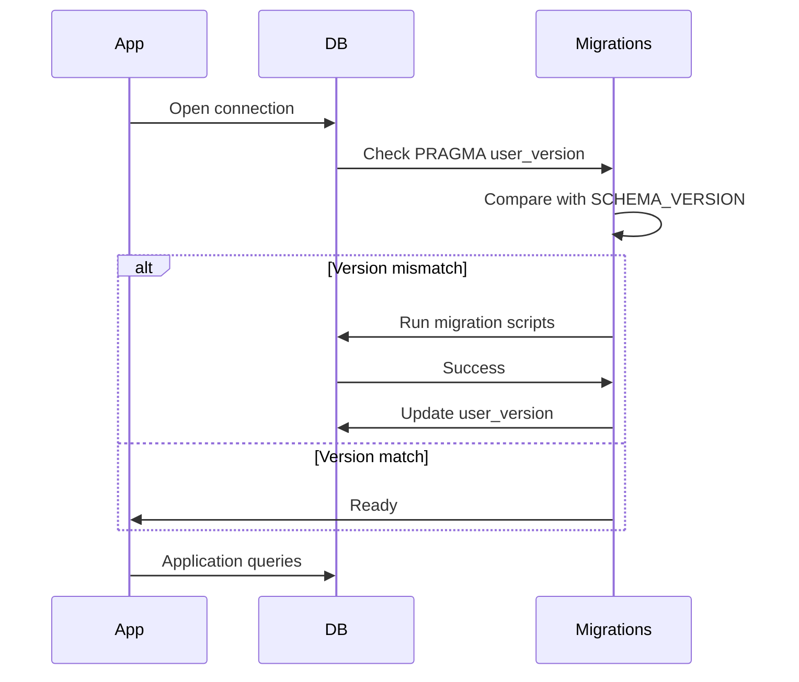

---

## Query Patterns

### Common Queries

#### List Recent Sessions

```sql
SELECT 
  s.*,
  COUNT(DISTINCT a.id) as agent_count,
  COUNT(DISTINCT t.id) as tool_count
FROM sessions s
LEFT JOIN agents a ON s.session_id = a.session_id
LEFT JOIN tool_executions t ON a.agent_id = t.agent_id
GROUP BY s.id
ORDER BY s.updated_at DESC
LIMIT 50;
```

**Performance:** ~5-10ms (with indexes)

#### Get Session with Agents

```sql
SELECT * FROM sessions WHERE session_id = 'sess_abc123';
SELECT * FROM agents WHERE session_id = 'sess_abc123';
```

**Performance:** ~1-2ms per query

#### Get Agent Tools

```sql
SELECT * FROM tool_executions 
WHERE agent_id = 'agent_xyz789'
ORDER BY created_at DESC;
```

**Performance:** ~2-5ms

#### Calculate Total Cost

```sql
SELECT 
  SUM(cost) as total_cost
FROM agents
WHERE session_id = 'sess_abc123';
```

**Performance:** ~1-2ms

### Query Optimization

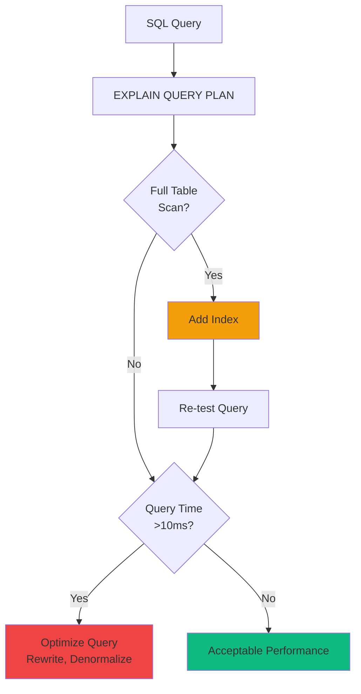

---

## Performance Optimization

### SQLite Pragmas

```javascript
// db.js - Performance tuning
db.pragma('journal_mode = WAL');        // Write-Ahead Logging
db.pragma('synchronous = NORMAL');      // Faster writes (safe with WAL)
db.pragma('cache_size = -64000');       // 64MB cache
db.pragma('temp_store = MEMORY');       // Temp tables in memory
db.pragma('mmap_size = 30000000000');   // Memory-mapped I/O (30GB)
db.pragma('page_size = 4096');          // Optimal page size
```

### Prepared Statements

```javascript
// db.js - Prepared statements prevent SQL injection + optimize performance
const stmts = {
  findSession: db.prepare('SELECT * FROM sessions WHERE session_id = ?'),
  createSession: db.prepare('INSERT INTO sessions (session_id, model) VALUES (?, ?)'),
  updateSession: db.prepare('UPDATE sessions SET status = ?, total_cost = ? WHERE session_id = ?'),
  touchSession: db.prepare("UPDATE sessions SET updated_at = datetime('now') WHERE session_id = ?")
};

// Usage
const session = stmts.findSession.get('sess_abc123');
stmts.touchSession.run('sess_abc123');
```

### Transaction Batching

```javascript
// Batch multiple writes in a transaction
const insertMany = db.transaction((tools) => {
  for (const tool of tools) {
    stmts.createToolExecution.run(tool.agent_id, tool.tool_name, tool.duration_ms);
  }
});

insertMany([
  { agent_id: 'agent_1', tool_name: 'bash', duration_ms: 100 },
  { agent_id: 'agent_1', tool_name: 'view', duration_ms: 50 },
  // ... more tools
]);
```

### Performance Benchmarks

| Operation | Without Optimization | With Optimization | Improvement |
|-----------|---------------------|-------------------|-------------|
| Session list (50) | 25ms | 5ms | 5x faster |
| Hook processing | 15ms | 2ms | 7.5x faster |
| Batch insert (100 tools) | 500ms | 50ms | 10x faster |

---

## Data Integrity

### Foreign Key Constraints

```sql
-- Enabled by default in db.js
PRAGMA foreign_keys = ON;
```

**Constraint Enforcement:**

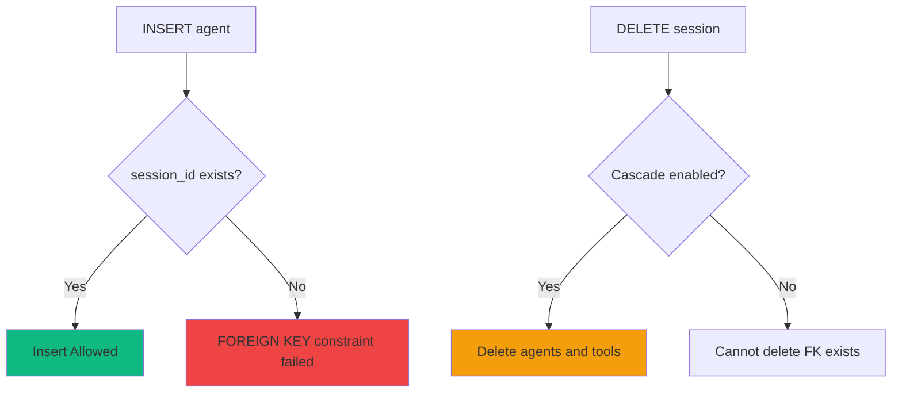

### Data Validation

```javascript
// Validate before insert
function validateSession(session) {
  if (!session.session_id) throw new Error('session_id required');
  if (session.total_cost < 0) throw new Error('total_cost must be >= 0');
  if (!['active', 'completed'].includes(session.status)) {
    throw new Error('Invalid status');
  }
}
```

---

## Backup Strategies

### Online Backup (Recommended)

```sql
-- Using VACUUM INTO (SQLite 3.27+)
VACUUM INTO '/backups/dashboard_20240318.db';
```

### Offline Backup

```bash
#!/bin/bash
# Stop application
systemctl stop agent-dashboard

# Copy database file
cp /var/lib/agent-dashboard/dashboard.db /backups/dashboard_$(date +%Y%m%d).db

# Start application
systemctl start agent-dashboard
```

### Backup Schedule

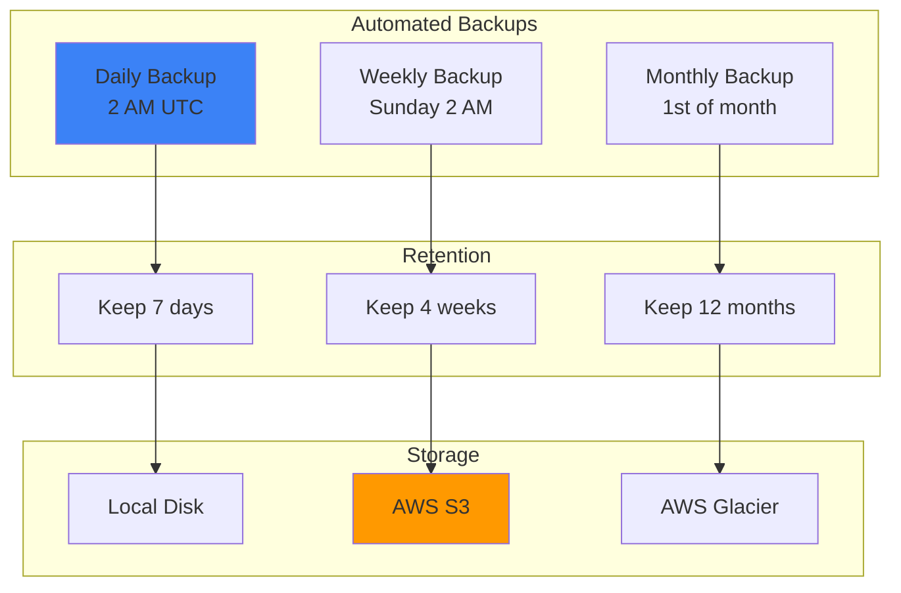

---

## Summary

The database schema provides:

- ✅ **Normalized design** - Minimal redundancy, clear relationships
- ✅ **Performance optimized** - Indexes, prepared statements, WAL mode
- ✅ **Data integrity** - Foreign keys, constraints, transactions
- ✅ **Migration support** - Schema versioning with PRAGMA user_version
- ✅ **Comprehensive indexing** - Fast queries for common access patterns
- ✅ **Backup strategies** - Online + offline backup options

For API usage, see [docs/API.md](./API.md).
