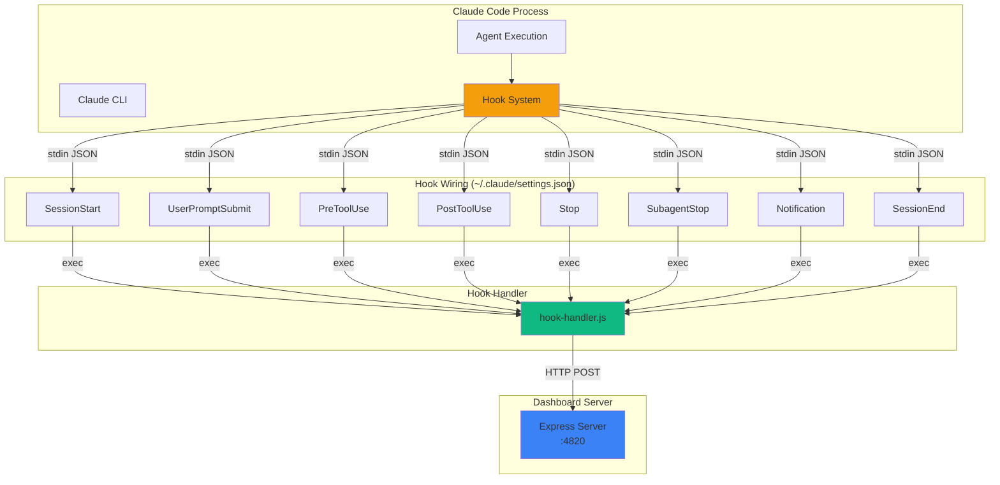
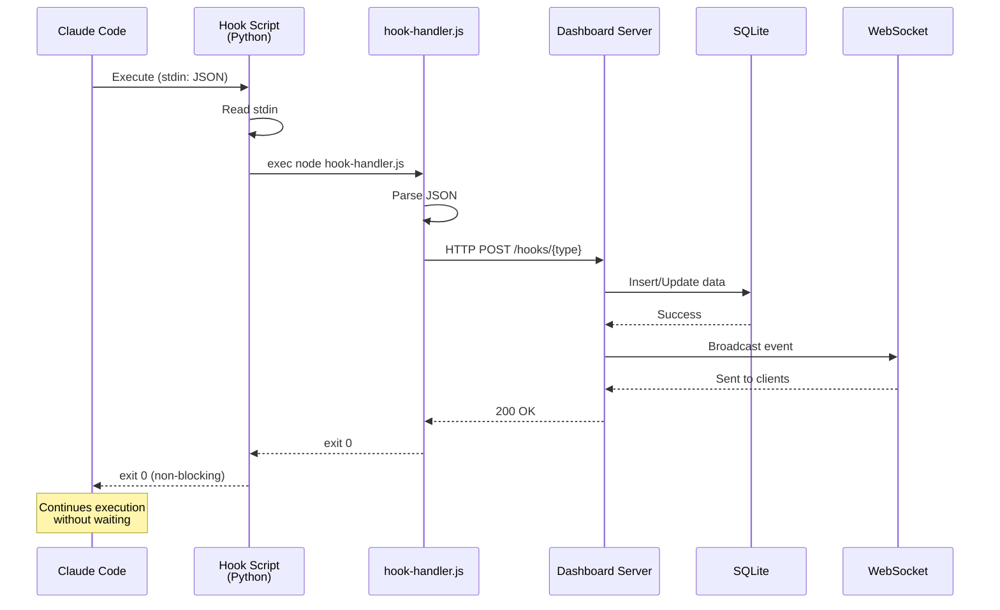
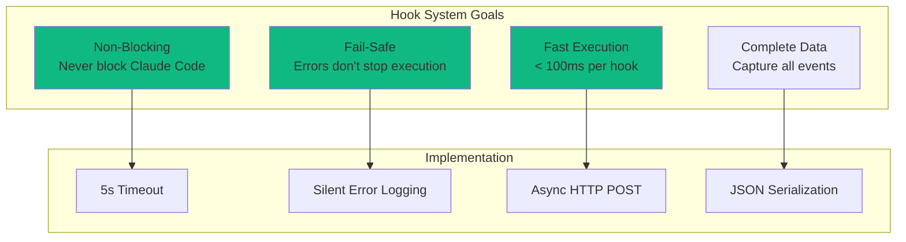
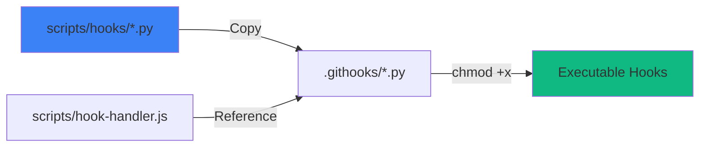
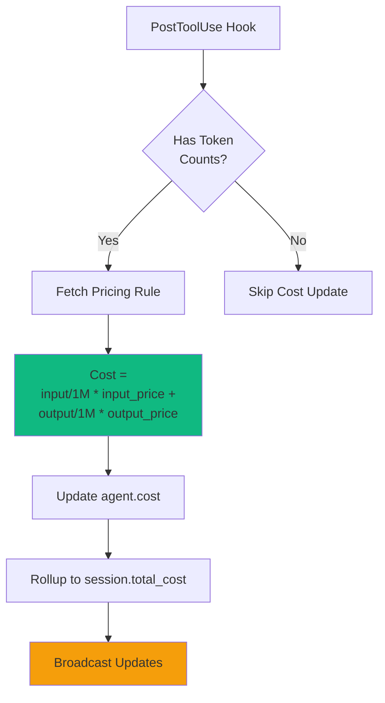
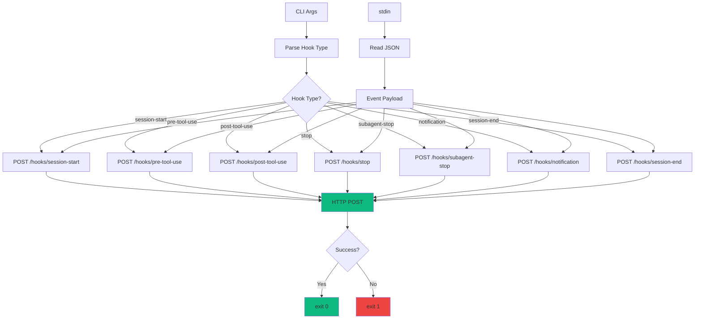
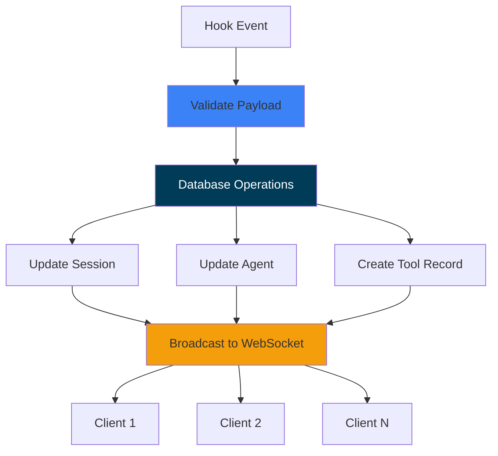
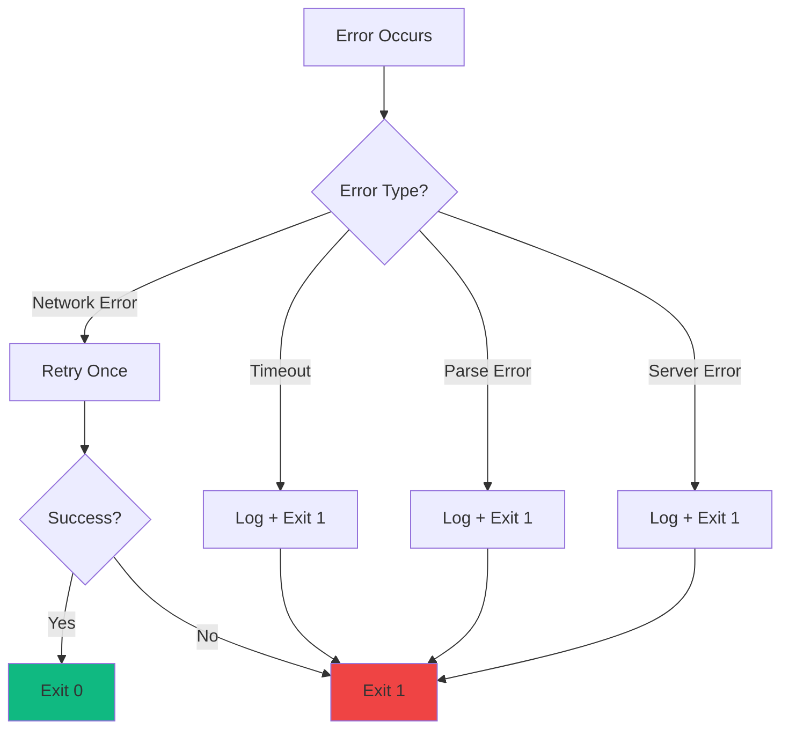
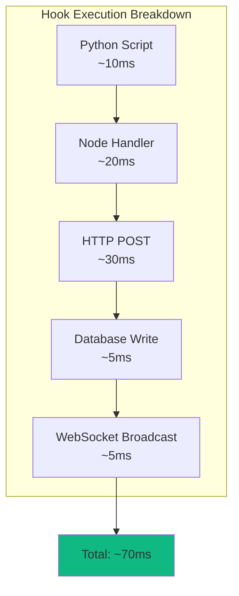
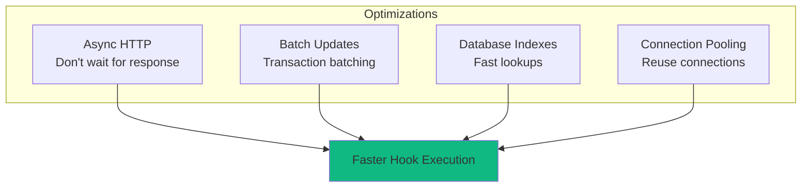

# Hook System Integration Guide

Comprehensive guide to integrating with Claude Code's hook system for real-time agent monitoring.

---

## Table of Contents

- [Overview](#overview)
- [Hook Architecture](#hook-architecture)
- [Hook Installation](#hook-installation)
- [Hook Types](#hook-types)
- [Hook Handler Implementation](#hook-handler-implementation)
- [Event Processing](#event-processing)
- [Error Handling](#error-handling)
- [Performance Considerations](#performance-considerations)
- [Testing Hooks](#testing-hooks)
- [Troubleshooting](#troubleshooting)

---

## Overview

Claude Code provides a hook system that allows external tools to receive real-time events during agent execution. Agent Dashboard uses these hooks to capture session lifecycle, tool executions, and notifications.



---

## Hook Architecture

### Hook Execution Flow



> **Security:** the hook handler POSTs to the loopback dashboard (`127.0.0.1:<port>`).
> The `/api/hooks` ingestion path is **exempt** from the optional `DASHBOARD_TOKEN`
> gate — it is a local-only write — so hooks keep working without a token even when
> one is configured for the rest of the API (GHSA-gr74-4xfh-6jw9).

### Hook System Characteristics

**Design Principles:**



---

## Hook Installation

### Installation Script

```bash
# Install hooks
npm run install-hooks
```

> [!IMPORTANT]
> **Hooks are a host-side step.** Claude Code runs on your host, so the hook
> command must reference a `hook-handler.js` path that exists on the **host**.
> Run `npm run install-hooks` on the host — never inside a container. When run
> inside Docker/Podman, the installer **refuses** and exits non-zero (issue
> #193): a container-internal path written into a bind-mounted `~/.claude` would
> break every host hook with `MODULE_NOT_FOUND`. The host handler POSTs to
> `http://localhost:4820`, which a containerized dashboard already publishes.
> (Escape hatch for running Claude Code *inside* the same container:
> `CCAM_ALLOW_CONTAINER_HOOKS=1 npm run install-hooks`.)

This copies hook scripts from `scripts/hooks/` to `.githooks/`:



### Manual Installation

```bash
#!/bin/bash
# scripts/install-hooks.js

HOOKS_DIR=".githooks"
SOURCE_DIR="scripts/hooks"

# Create hooks directory
mkdir -p "$HOOKS_DIR"

# Copy hook scripts
cp "$SOURCE_DIR/session-start.py" "$HOOKS_DIR/"
cp "$SOURCE_DIR/pre-tool-use.py" "$HOOKS_DIR/"
cp "$SOURCE_DIR/post-tool-use.py" "$HOOKS_DIR/"
cp "$SOURCE_DIR/stop.py" "$HOOKS_DIR/"
cp "$SOURCE_DIR/subagent-stop.py" "$HOOKS_DIR/"
cp "$SOURCE_DIR/notification.py" "$HOOKS_DIR/"
cp "$SOURCE_DIR/session-end.py" "$HOOKS_DIR/"

# Make executable
chmod +x "$HOOKS_DIR"/*.py

echo "Hooks installed in .githooks/"
```

### Verification

```bash
# Check hook files exist
ls -la .githooks/

# Expected output:
# session-start.py
# pre-tool-use.py
# post-tool-use.py
# stop.py
# subagent-stop.py
# notification.py
# session-end.py
```

---

## Hook Types

### 1. SessionStart

Triggered when a Claude Code session starts (fresh launch, `--resume`, `/clear`, etc.).

**Payload Example:**

```json
{
  "type": "sessionStart",
  "sessionId": "sess_abc123",
  "source": "startup",
  "model": "claude-sonnet-4",
  "timestamp": "2024-03-18T12:00:00Z"
}
```

**Purpose:**
- Create the session and main-agent records on first contact
- Stamp `awaiting_input_since` so the dashboard shows the row in **Waiting** from the moment the CLI lands at a prompt
- Reactivate completed/abandoned sessions on resume
- Sweep other active sessions whose last activity is older than `DASHBOARD_STALE_MINUTES` (default 180), marking them `abandoned` with their agents `completed`

---

### 2. UserPromptSubmit

Triggered the moment the user hits enter on a prompt — fires *before* Claude does any work.

**Payload Example:**

```json
{
  "type": "userPromptSubmit",
  "sessionId": "sess_abc123",
  "prompt": "Refactor this function...",
  "timestamp": "2024-03-18T12:00:30Z"
}
```

**Purpose:**
- Clear `awaiting_input_since` on the session and main agent
- Promote the main agent to `working` so the dashboard reflects "Claude is now thinking on this" through the entire response — including text-only replies that emit no `PreToolUse` before `Stop`

---

### 3. PreToolUse

Triggered before a tool executes.

**Payload Example:**

```json
{
  "type": "preToolUse",
  "sessionId": "sess_abc123",
  "agentId": "agent_main_001",
  "toolName": "bash",
  "timestamp": "2024-03-18T12:01:00Z"
}
```

**Purpose:**
- Clear `awaiting_input_since` (Claude can only call a tool after fresh user input)
- Set agent to `working`, set `current_tool`
- Track tool execution start time
- If tool name is `Agent`, create a subagent record

---

### 4. PostToolUse

Triggered after a tool completes execution.

**Payload Example:**

```json
{
  "type": "postToolUse",
  "sessionId": "sess_abc123",
  "agentId": "agent_main_001",
  "toolName": "bash",
  "durationMs": 1234,
  "success": true,
  "inputTokens": 1500,
  "outputTokens": 800,
  "timestamp": "2024-03-18T12:01:01.234Z"
}
```

**Purpose:**
- Clear `awaiting_input_since` (covers permission-prompt approval mid-tool)
- Clear `current_tool` on agent (agent stays `working`)
- Update agent token counts via shared transcript cache
- Calculate and update cost
- Rollup cost to session

**Cost Calculation Flow:**



---

### 5. Stop

Triggered when Claude finishes a turn (NOT when the session is closed).

**Payload Example:**

```json
{
  "type": "stop",
  "sessionId": "sess_abc123",
  "stop_reason": "end_turn",
  "timestamp": "2024-03-18T12:05:00Z"
}
```

**Purpose:**
- Non-error: set main agent to `idle` and stamp `awaiting_input_since` — Claude finished its turn, ball is in the user's court. The session shows as **Waiting** until `UserPromptSubmit` / `PreToolUse` fires
- Error (`stop_reason="error"`): drop `awaiting_input_since`, mark the session `error`
- Background subagents continue running — they complete individually via `SubagentStop`, never via `Stop`

> **Note:** `Stop` does **not** fire when the user cancels a turn with `Esc` — interrupts emit no hook at all. The dashboard instead recovers cancelled turns from the transcript (see [User interrupts (Esc)](#user-interrupts-esc--no-hook-fires)).

---

### 6. SubagentStop

Triggered when a sub-agent (explore, task, etc.) completes.

**Payload Example:**

```json
{
  "type": "subagentStop",
  "sessionId": "sess_abc123",
  "agentId": "agent_explore_002",
  "agentType": "explore",
  "timestamp": "2024-03-18T12:03:00Z"
}
```

**Purpose:**
- Match the finishing subagent by description, type, or task and mark it `completed`
- **Deliberately does NOT clear `awaiting_input_since`** — a backgrounded subagent finishing tells us nothing about whether the human has responded
- **Triggers a fire-and-forget JSONL scan** (`scanAndImportSubagents` from `scripts/import-history.js`) after `res.json()` returns. The scan walks the session's `subagents/agent-*.jsonl` files, pairs each assistant `tool_use` block with the next matching user `tool_result` block by `tool_use_id`, and emits per-tool `PreToolUse` + `PostToolUse` events under the subagent's own `agent_id`. Idempotent (`data LIKE '%"tool_use_id":"X"%'` dedup) and merges into a hook-created live row when one matches by `subagent_type + started_at` within 30 s — closes the gap where subagent-internal tool calls would otherwise be invisible to the dashboard
- **Attributes per-subagent tokens to each subagent's OWN model** (issue #185). Each subagent transcript carries its own `msg.usage` under its own `msg.model`; the scan writes those token buckets to `token_usage` keyed by the real model (e.g. a Haiku QA agent under an Opus orchestrator) so cost is no longer priced at the orchestrator's rate. The subagent's resolved model is also stamped onto its agent row (`metadata.model`). Buckets whose model equals the parent session's model are deliberately **skipped** here — that bucket is owned by the main-transcript writer, and double-writing it would trip `replaceTokenUsage`'s compaction baseline-shift; same-model subagents are reconciled by the authoritative `importSession` / `reconcileTokens` path instead
- Imported tool events carry `imported: true, source: "subagent_jsonl"` in their JSON `data` payload so analytics can distinguish backfilled rows from live hook-captured ones if needed

---

### 7. Notification

Triggered when Claude Code sends a system notification.

**Payload Example:**

```json
{
  "type": "notification",
  "sessionId": "sess_abc123",
  "notificationType": "backgroundTaskComplete",
  "message": "Explore agent completed successfully",
  "timestamp": "2024-03-18T12:03:00Z"
}
```

**Purpose:**
- Log the event for the activity feed
- If the message matches a permission/input-prompt pattern (`permission`, `waiting for input`, `needs your approval`, `awaiting your response`, …), stamp `awaiting_input_since` so the session lands in **Waiting**
- If the message matches a compaction pattern, tag as a `Compaction` event
- Trigger a browser notification when the user has notifications enabled

---

### 8. SessionEnd

Triggered when a Claude Code session ends.

**Payload Example:**

```json
{
  "type": "sessionEnd",
  "sessionId": "sess_abc123",
  "timestamp": "2024-03-18T14:30:00Z"
}
```

**Purpose:**
- Drop `awaiting_input_since` on the session and any agents that still have it
- Mark all agents and the session as `completed`
- Evict the session's transcript from the shared transcript cache

---

## Hook Handler Implementation

### hook-handler.js Architecture



### Implementation

```javascript
#!/usr/bin/env node
// scripts/hook-handler.js

const http = require('http');
const fs = require('fs');

const HOOK_TYPE = process.argv[2];
const SERVER_URL = 'http://localhost:4820';
const TIMEOUT = 5000; // 5s timeout

// Read JSON from stdin
let inputData = '';
process.stdin.setEncoding('utf8');
process.stdin.on('data', (chunk) => inputData += chunk);

process.stdin.on('end', () => {
  try {
    const payload = JSON.parse(inputData);
    sendToServer(HOOK_TYPE, payload);
  } catch (err) {
    console.error('[hook-handler] JSON parse error:', err);
    process.exit(1);
  }
});

function sendToServer(hookType, payload) {
  const postData = JSON.stringify(payload);
  
  const options = {
    hostname: 'localhost',
    port: 4820,
    path: `/hooks/${hookType}`,
    method: 'POST',
    headers: {
      'Content-Type': 'application/json',
      'Content-Length': Buffer.byteLength(postData)
    },
    timeout: TIMEOUT
  };
  
  const req = http.request(options, (res) => {
    let responseData = '';
    res.on('data', (chunk) => responseData += chunk);
    res.on('end', () => {
      if (res.statusCode === 200) {
        process.exit(0);
      } else {
        console.error(`[hook-handler] Server error: ${res.statusCode}`);
        process.exit(1);
      }
    });
  });
  
  req.on('error', (err) => {
    console.error('[hook-handler] Request error:', err);
    process.exit(1);
  });
  
  req.on('timeout', () => {
    console.error('[hook-handler] Request timeout');
    req.destroy();
    process.exit(1);
  });
  
  req.write(postData);
  req.end();
}
```

> **Port resolution & fan-out.** The snippet above shows a single fixed `4820`
> for clarity. The real `scripts/hook-handler.js` resolves **every** live
> dashboard at runtime via `server/lib/server-info.js`:
>
> 1. If `CLAUDE_DASHBOARD_PORT` is set in the environment, the handler treats
>    it as an explicit operator override and POSTs to that single port —
>    no discovery, no fan-out (useful for tests and container setups).
> 2. Otherwise it reads `~/.claude/.agent-dashboard.json`, a JSON document
>    that lists every dashboard server currently running on the machine.
>    Each server appends its `{port, pid, startedAt}` entry on startup and
>    removes it on a clean shutdown. The handler **prunes any entry whose
>    PID is no longer alive** (so a crashed server self-evicts the next
>    time anyone reads the file) and POSTs the hook payload to every
>    remaining entry **in parallel**.
> 3. If neither yields a target, the handler falls back to `4820`.
>
> This is what lets the macOS desktop app coexist with `npm run dev` (or
> two `npm start` instances on different ports) without either dashboard
> losing its real-time stream — both receive the same events and update
> simultaneously.

---

## Event Processing

### Server-Side Hook Processing

```javascript
// server/routes/hooks.js

router.post('/session-start', (req, res) => {
  try {
    const { sessionId, model, agentId, agentType } = req.body;
    
    // Upsert session
    let session = stmts.findSession.get(sessionId);
    if (!session) {
      stmts.createSession.run(sessionId, model);
      session = stmts.findSession.get(sessionId);
      broadcast({ type: 'session.created', data: session });
    }
    
    // Create main agent
    if (!stmts.findAgent.get(agentId)) {
      stmts.createAgent.run(agentId, sessionId, agentType);
      const agent = stmts.findAgent.get(agentId);
      broadcast({ type: 'agent.created', data: agent });
    }
    
    // Touch session (update updated_at)
    stmts.touchSession.run(sessionId);
    
    res.json({ success: true });
  } catch (err) {
    console.error('session-start error:', err);
    res.json({ success: false, error: err.message });
  }
});
```

### Event Processing Pipeline



### Transcript-derived sync

On every event that carries a `transcript_path`, the shared `TranscriptCache` re-reads the JSONL (incrementally) and the ingestor keeps three session fields in sync with what the user is actually doing in the CLI:

- **Tokens / cost** — usage is accumulated per model bucket (compaction-aware baselines).
- **Model** — the most recent assistant entry's model keeps `sessions.model` current after a `/model` switch.
- **Name** — the session title is read from the transcript: the `custom-title` line (`/rename`, `claude -n`, picker `Ctrl+R`) always wins, otherwise the auto-generated `ai-title` fills a placeholder/auto name (so a user-chosen name is never clobbered). `sessions.name` is updated via a no-op-guarded statement and a `session_updated` broadcast fires only on a real change, so the dashboard reflects renames in real time. The 15 s error-detection watchdog runs the same sync for active sessions left idle right after a `/rename`.

### User interrupts (Esc) — no hook fires

Cancelling a turn with `Esc` fires **no hook at all** (a documented Claude Code limitation — there is no `Stop`, `Notification`, or other event on interrupt). Since `UserPromptSubmit` has already promoted the main agent to `working`, an un-handled cancel would leave the session stuck in `working` indefinitely. The dashboard recovers it from the transcript, via the same 15 s watchdog, two ways:

1. **Marker path** — when the cancel happens *after* some output, Claude Code appends a `[Request interrupted by user]` user entry (with an `interruptedMessageId`). `TranscriptCache` reports `pendingInterrupt`, computed from transcript ordering alone: the latest interrupt timestamp vs the latest real turn activity, both on Claude Code's clock. (It is **not** compared against the session's last hook event — those clocks differ, and for a sub-second cancel the `UserPromptSubmit` event is recorded *after* the transcript interrupt, the precise case that used to stay stuck.) The session moves to **Waiting** within ~15 s.
2. **Idle-working timeout** — when Esc is pressed *before any output*, Claude Code writes **no marker**; the only evidence is silence. When the main agent has been `working` with `current_tool` null and **neither a hook event nor the transcript mtime** has advanced for `DASHBOARD_WORKING_IDLE_SECONDS` (default `120`), the turn is treated as dead. A streaming/long-output turn (transcript still growing) and an in-flight tool call are exempt by those guards; a rare false flip self-heals on the next real hook.

Both paths land the session in **Waiting** (main agent → `waiting`, `awaiting_input_since` stamped — identical to a non-error `Stop`) and log an `Interrupted` event. A resume (new prompt in the transcript) clears `pendingInterrupt` and the fresh hook keeps the session non-stale.

---

## Error Handling

### Error Handling Strategy



### Hook Script Error Handling

```python
#!/usr/bin/env python3
# .githooks/session-start.py

import sys
import json
import subprocess
import logging

logging.basicConfig(
    filename='.githooks/hooks.log',
    level=logging.ERROR,
    format='%(asctime)s - %(levelname)s - %(message)s'
)

try:
    data = json.load(sys.stdin)
    
    result = subprocess.run(
        ['node', 'scripts/hook-handler.js', 'session-start'],
        input=json.dumps(data),
        text=True,
        timeout=5,
        capture_output=True
    )
    
    if result.returncode != 0:
        logging.error(f'Hook handler failed: {result.stderr}')
    
except Exception as e:
    logging.error(f'Hook error: {str(e)}')

# Always exit 0 to avoid blocking Claude Code
sys.exit(0)
```

---

## Performance Considerations

### Hook Execution Time



**Performance Targets:**

| Phase | Target | Actual |
|-------|--------|--------|
| Hook script | < 20ms | ~10ms |
| Handler | < 30ms | ~20ms |
| HTTP POST | < 50ms | ~30ms |
| Database | < 10ms | ~5ms |
| **Total** | **< 100ms** | **~70ms** |

### Optimization Techniques



---

## Testing Hooks

### Manual Testing

```bash
# Test session-start hook
echo '{"type":"sessionStart","sessionId":"test_001","model":"claude-sonnet-4","agentId":"agent_test","agentType":"general-purpose"}' | \
  python3 .githooks/session-start.py

# Test pre-tool-use hook
echo '{"type":"preToolUse","sessionId":"test_001","agentId":"agent_test","toolName":"bash"}' | \
  python3 .githooks/pre-tool-use.py

# Test post-tool-use hook
echo '{"type":"postToolUse","sessionId":"test_001","agentId":"agent_test","toolName":"bash","durationMs":100,"success":true,"inputTokens":1000,"outputTokens":500}' | \
  python3 .githooks/post-tool-use.py
```

### Integration Testing

```javascript
// server/__tests__/hooks.test.js
import { test } from 'node:test';
import assert from 'node:assert';

test('session-start hook creates session', async () => {
  const payload = {
    sessionId: 'test_session',
    model: 'claude-sonnet-4',
    agentId: 'test_agent',
    agentType: 'general-purpose'
  };
  
  const response = await fetch('http://localhost:4820/hooks/session-start', {
    method: 'POST',
    headers: { 'Content-Type': 'application/json' },
    body: JSON.stringify(payload)
  });
  
  const data = await response.json();
  assert.strictEqual(data.success, true);
  
  // Verify session exists
  const session = await fetch('http://localhost:4820/api/sessions/test_session');
  assert.strictEqual(session.status, 200);
});
```

---

## Troubleshooting

### Common Issues

| Issue | Symptoms | Solution |
|-------|----------|----------|
| Hooks not executing | No data in dashboard | Check `.githooks/` exists and scripts are executable |
| Timeout errors | Hooks take >5s | Check server is running, reduce timeout |
| Parse errors | JSON parse failed | Validate hook payload format |
| Permission denied | Hook script won't run | `chmod +x .githooks/*.py` |
| Server connection refused | HTTP POST fails | Start dashboard server (`npm start`) |

### Debug Mode

```bash
# Enable hook logging
export DASHBOARD_DEBUG=1

# Run hook manually with verbose output
python3 -u .githooks/session-start.py < test-payload.json
```

### Health Check

```bash
# Check server is running
curl http://localhost:4820/api/sessions

# Expected: {"sessions": [...]}
```

---

## Summary

The hook system provides:

- ✅ **Real-time event capture** - Lifecycle, tools, notifications
- ✅ **Non-blocking execution** - Never delays Claude Code
- ✅ **Fail-safe design** - Errors don't stop execution
- ✅ **Fast processing** - < 100ms per hook
- ✅ **Complete coverage** - All agent lifecycle events
- ✅ **Easy installation** - One-command setup

For server-side processing, see [server/README.md](../server/README.md).
