# Documentation Index

Comprehensive documentation for the Agent Dashboard project.

---

## Quick Links

- [Architecture Overview](../ARCHITECTURE.md) - System design and technical reference
- [I18N Architecture](./I18N.md) - Internationalization architecture and usage guide
- [Setup Guide](../SETUP.md) - Installation and configuration
- [Installation](../INSTALL.md) - Detailed installation instructions

---

## Documentation Sections

### 📘 Core Documentation

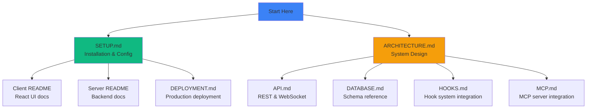

---

### 📋 Documentation Catalog

| Document | Description | Audience |
|----------|-------------|----------|
| [client/README.md](../client/README.md) | React frontend architecture, components, state management | Frontend developers |
| [server/README.md](../server/README.md) | Express backend, database, WebSocket, API | Backend developers |
| [API.md](./API.md) | REST API endpoints (sessions, agents, events, stats, analytics, hooks, pricing, workflows, settings, import history, **cc-config**, **run**), WebSocket protocol (including `run_stream` / `run_status` / `run_input_ack` for the Run page) | Integration developers |
| [DATABASE.md](./DATABASE.md) | SQLite schema, queries, performance | Database administrators |
| [HOOKS.md](./HOOKS.md) | Claude Code hook system integration | Hook developers |
| [MCP.md](./MCP.md) | MCP server setup and tool reference | MCP integrators |
| [DEPLOYMENT.md](./DEPLOYMENT.md) | Production deployment strategies | DevOps engineers |
| [I18N.md](./I18N.md) | Language architecture, locale strategy, and rollout checklist | Frontend and product teams |

---

## Getting Started

### For New Users

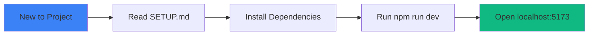

**Quick Start:**

1. Read [SETUP.md](../SETUP.md)
2. Run `npm run setup`
3. Run `npm run dev`
4. Open browser to `http://localhost:5173`

---

### For Frontend Developers

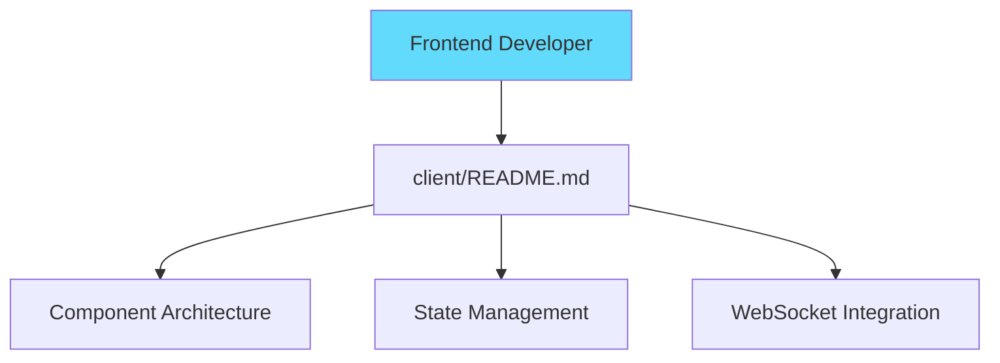

**Key Documents:**

- [client/README.md](../client/README.md) - Complete frontend guide
- [API.md](./API.md#websocket-api) - WebSocket protocol
- Component source: `client/src/components/`

---

### For Backend Developers

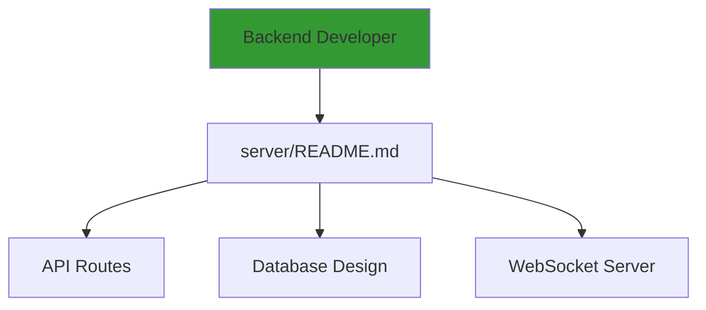

**Key Documents:**

- [server/README.md](../server/README.md) - Complete backend guide
- [DATABASE.md](./DATABASE.md) - Schema and queries
- [HOOKS.md](./HOOKS.md) - Hook processing
- API source: `server/routes/`

---

### For DevOps Engineers

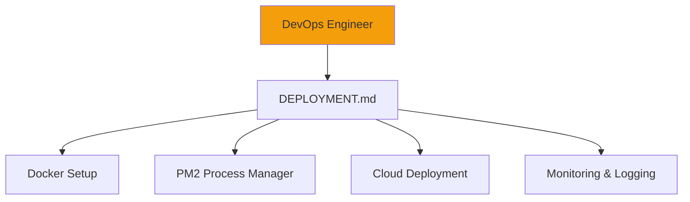

**Key Documents:**

- [DEPLOYMENT.md](./DEPLOYMENT.md) - Complete deployment guide
- [DATABASE.md](./DATABASE.md#backup-strategies) - Backup strategies
- [server/README.md](../server/README.md#performance) - Performance tuning

---

### For Integration Developers

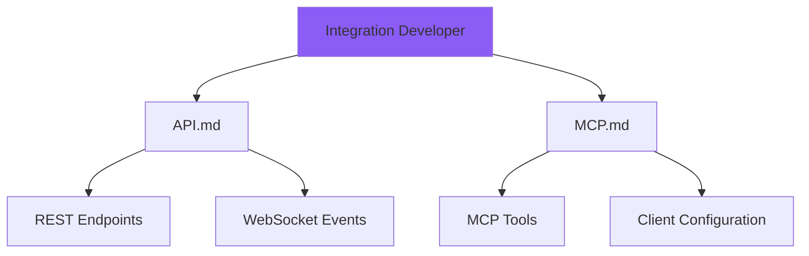

**Key Documents:**

- [API.md](./API.md) - Complete API reference
- [MCP.md](./MCP.md) - MCP server integration
- [HOOKS.md](./HOOKS.md) - Custom hook integration

---

## Architecture Overview

### System Components

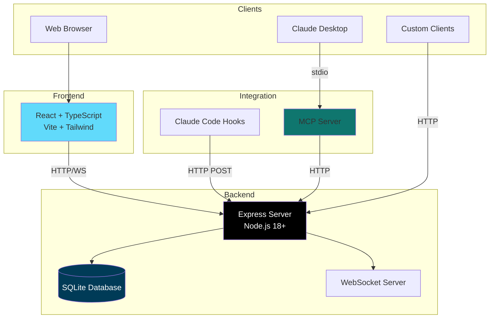

**Technology Stack:**

| Layer | Technology |
|-------|------------|
| **Frontend** | React 18, TypeScript 5.7, Vite 6, Tailwind CSS |
| **Backend** | Node.js 18+, Express 4.21, WebSocket |
| **Database** | SQLite 3 (better-sqlite3 or node:sqlite) |
| **Integration** | Claude Code Hooks, MCP Server |

### Internationalization Support (en/zh/vi)

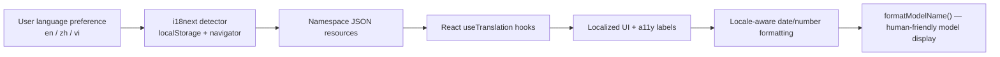

Supported language codes are explicitly `en`, `zh`, and `vi`. Use [I18N.md](./I18N.md) for architecture details, naming conventions, language switching flow, localization behavior, and rollout guidance.

---

## Feature Documentation

### Real-Time Updates

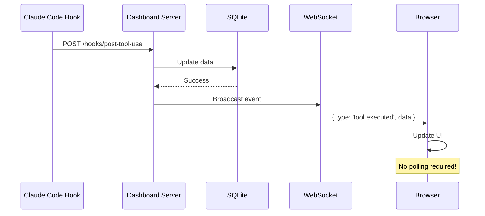

**Documentation:**
- [WebSocket Protocol](./API.md#websocket-api)
- [Client Integration](../client/README.md#websocket-integration)
- [Server Broadcasting](../server/README.md#websocket-protocol)

---

### Pricing System

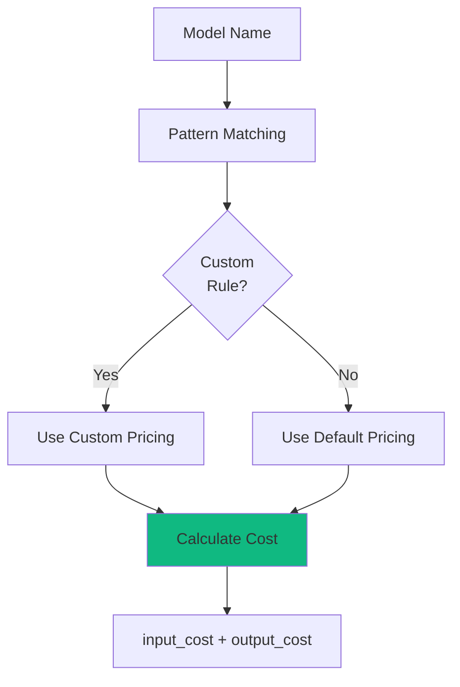

**Documentation:**
- [Pricing API](./API.md#pricing)
- [Database Schema](./DATABASE.md#pricing_rules)
- [Server Implementation](../server/README.md#pricing-calculation)

---

### Hook System

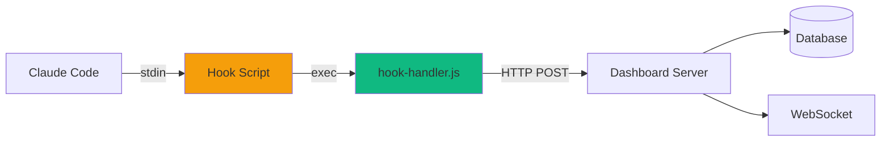

**Documentation:**
- [Hook System Guide](./HOOKS.md)
- [Hook Processing](../server/README.md#hook-processing)
- [Installation](../SETUP.md#install-hooks)

---

## API Documentation

### REST API Summary

| Endpoint | Method | Description |
|----------|--------|-------------|
| `/api/sessions` | GET | List sessions |
| `/api/sessions/:id` | GET | Get session |
| `/api/sessions/:id/agents` | GET | List session agents |
| `/api/agents/:id` | GET | Get agent |
| `/api/agents/:id/tools` | GET | List agent tools |
| `/api/pricing` | GET | List pricing rules |
| `/api/pricing` | POST | Create pricing rule |
| `/api/pricing/:pattern` | DELETE | Delete pricing rule |

**Full Reference:** [API.md](./API.md#rest-api)

---

### WebSocket Events

| Event Type | Triggered By |
|------------|--------------|
| `session.created` | SessionStart hook |
| `session.updated` | Any session update |
| `agent.created` | New agent started |
| `agent.updated` | Agent status/cost change |
| `tool.executed` | Tool execution completed |
| `notification.received` | System notification |

**Full Reference:** [API.md](./API.md#websocket-api)

---

## Database Schema

### Entity Relationships

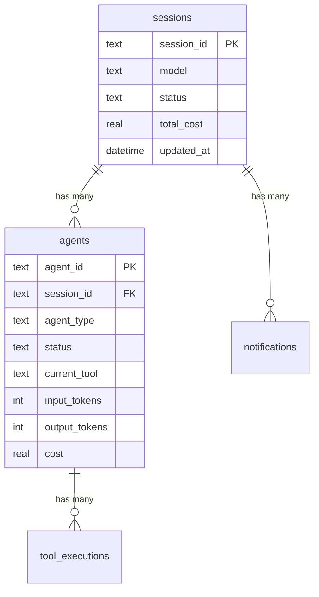

**Full Reference:** [DATABASE.md](./DATABASE.md)

---

## Deployment Options

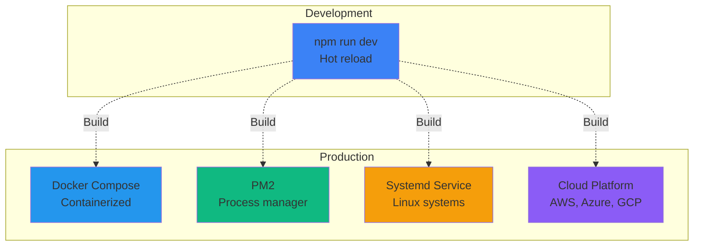

**Full Reference:** [DEPLOYMENT.md](./DEPLOYMENT.md)

---

## Performance Metrics

### Benchmarks

| Metric | Target | Actual |
|--------|--------|--------|
| Hook processing | < 100ms | ~70ms |
| API response time | < 50ms | ~30ms |
| WebSocket latency | < 10ms | ~5ms |
| Database query | < 10ms | ~5ms |
| Session list (50) | < 20ms | ~10ms |

**Optimization Details:**
- [Server Performance](../server/README.md#performance)
- [Database Tuning](./DATABASE.md#performance-optimization)
- [Client Performance](../client/README.md#performance)

---

## Contributing

### Development Workflow

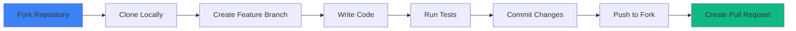

**Before submitting:**

1. Run tests: `npm test` (server `node --test` + client Vitest, including per-screen render snapshots — regenerate intentional UI changes with `cd client && npx vitest run -u`)
2. Check formatting: `npm run format:check`
3. Build: `npm run build`
4. Update docs if needed

---

## Support & Resources

### Getting Help

- **Issues:** [GitHub Issues](https://github.com/your-org/agent-dashboard/issues)
- **Discussions:** [GitHub Discussions](https://github.com/your-org/agent-dashboard/discussions)
- **Documentation:** This folder

### Additional Resources

- [Claude Code Documentation](https://docs.anthropic.com/claude/docs)
- [Model Context Protocol (MCP)](https://modelcontextprotocol.io/)
- [SQLite Documentation](https://sqlite.org/docs.html)
- [React Documentation](https://react.dev/)
- [Express Documentation](https://expressjs.com/)

---

## License

This project is licensed under the MIT License. See [LICENSE](../LICENSE) for details.

---

## Summary

This documentation covers:

- ✅ **Complete architecture** - Frontend, backend, database, integrations
- ✅ **API reference** - REST endpoints, WebSocket events
- ✅ **Deployment guides** - Docker, PM2, systemd, cloud
- ✅ **Performance tuning** - Database, server, client optimizations
- ✅ **Integration guides** - Hooks, MCP, custom clients
- ✅ **Internationalization** - Language resources, switching flow, locale formatting, rollout checklist
- ✅ **Development guides** - Setup, testing, contributing

**Start with:** [SETUP.md](../SETUP.md) for installation, then explore specific areas based on your role.
