# Server Application

Enterprise-grade Node.js backend for Claude Code agent monitoring with real-time WebSocket updates.


---

## Table of Contents

- [Overview](#overview)
- [Architecture](#architecture)
- [Database Design](#database-design)
- [API Reference](#api-reference)
- [WebSocket Protocol](#websocket-protocol)
- [Hook Processing](#hook-processing)
- [Pricing System](#pricing-system)
- [Data Flow](#data-flow)
- [Error Handling](#error-handling)
- [Performance](#performance)
- [Testing](#testing)
- [Deployment](#deployment)
- [Configuration](#configuration)

---

## Overview

The server is a lightweight Express application that:

1. **Receives hook events** from Claude Code via HTTP POST (stdin → hook-handler.js → server)
2. **Persists data** in SQLite database with schema migrations
3. **Broadcasts updates** to connected web clients via WebSocket
4. **Serves REST API** for sessions, agents, events, stats, analytics, pricing, workflows, settings, and docs
5. **Manages pricing rules** for cost calculation and attribution

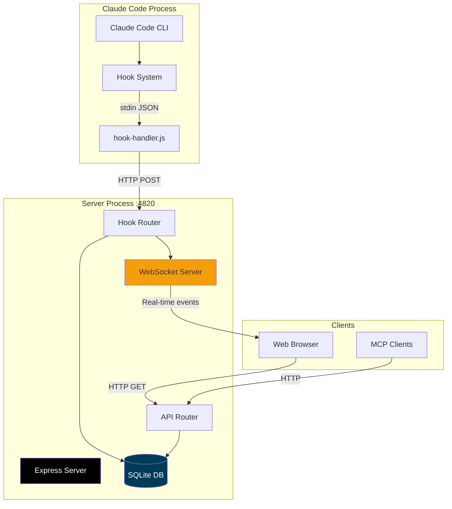

---

## Architecture

### Server Structure

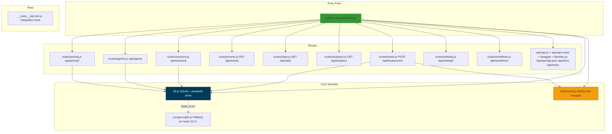

### Directory Structure

```
server/
├── index.js               # Express app + server bootstrap
├── db.js                  # SQLite connection + prepared statements
├── websocket.js           # WebSocket server + broadcast
├── compat-sqlite.js       # Fallback for node:sqlite (Node 22.5+)
│
├── routes/
│   ├── hooks.js           # Hook ingestion endpoints
│   ├── sessions.js        # Session CRUD API
│   ├── agents.js          # Agent CRUD API
│   ├── events.js          # Event list API
│   ├── stats.js           # Dashboard stats API
│   ├── analytics.js       # Analytics aggregate API
│   ├── pricing.js         # Pricing rules + cost API
│   ├── settings.js        # Ops/settings API
│   └── workflows.js       # Workflow intelligence API
│
├── openapi.js             # OpenAPI 3.0.3 spec generator (createOpenApiSpec)
├── openapi-extra/         # Supplementary OpenAPI fragments merged into the spec
│   ├── cc-config.js       #   /api/cc-config/* paths + schemas
│   ├── push.js            #   /api/push/* paths + schemas
│   ├── run.js             #   /api/run/* paths + schemas
│   └── misc.js            #   remaining route groups
│
├── lib/
│   └── redoc.js           # Serves ReDoc reference (/api/redoc) + self-hosted bundle
│
└── __tests__/
    └── api.test.js        # Integration tests
```

---

## Database Design

### Schema Overview

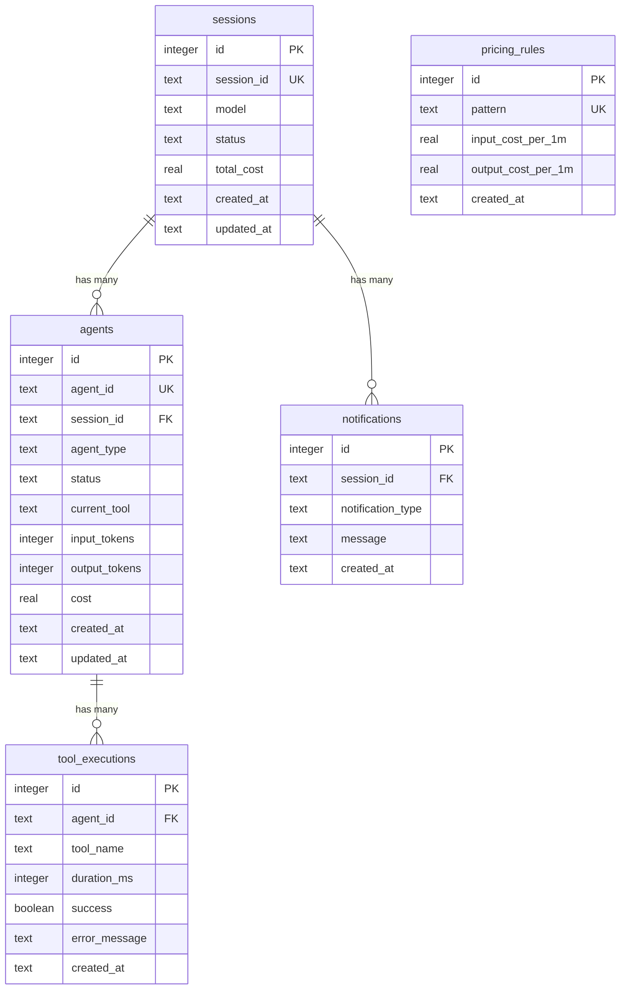

### Table Definitions

#### `sessions`

Tracks Claude Code sessions (one per CLI invocation or agent task).

```sql
CREATE TABLE sessions (
    id INTEGER PRIMARY KEY AUTOINCREMENT,
    session_id TEXT UNIQUE NOT NULL,
    model TEXT,
    status TEXT DEFAULT 'active',
    total_cost REAL DEFAULT 0,
    created_at TEXT DEFAULT (datetime('now')),
    updated_at TEXT DEFAULT (datetime('now'))
);

CREATE INDEX idx_sessions_session_id ON sessions(session_id);
CREATE INDEX idx_sessions_status ON sessions(status);
CREATE INDEX idx_sessions_updated_at ON sessions(updated_at DESC);
```

#### `agents`

Tracks individual agents (main agent, explore, task, code-review, etc.).

```sql
CREATE TABLE agents (
    id INTEGER PRIMARY KEY AUTOINCREMENT,
    agent_id TEXT UNIQUE NOT NULL,
    session_id TEXT NOT NULL,
    agent_type TEXT,
    status TEXT DEFAULT 'running',
    current_tool TEXT,
    input_tokens INTEGER DEFAULT 0,
    output_tokens INTEGER DEFAULT 0,
    cost REAL DEFAULT 0,
    created_at TEXT DEFAULT (datetime('now')),
    updated_at TEXT DEFAULT (datetime('now')),
    FOREIGN KEY (session_id) REFERENCES sessions(session_id)
);

CREATE INDEX idx_agents_agent_id ON agents(agent_id);
CREATE INDEX idx_agents_session_id ON agents(session_id);
CREATE INDEX idx_agents_status ON agents(status);
```

#### `tool_executions`

Records each tool call (bash, view, edit, grep, etc.).

```sql
CREATE TABLE tool_executions (
    id INTEGER PRIMARY KEY AUTOINCREMENT,
    agent_id TEXT NOT NULL,
    tool_name TEXT NOT NULL,
    duration_ms INTEGER,
    success INTEGER DEFAULT 1,
    error_message TEXT,
    created_at TEXT DEFAULT (datetime('now')),
    FOREIGN KEY (agent_id) REFERENCES agents(agent_id)
);

CREATE INDEX idx_tools_agent_id ON tool_executions(agent_id);
CREATE INDEX idx_tools_created_at ON tool_executions(created_at DESC);
```

#### `notifications`

Stores system notifications (backgroundTaskComplete, etc.).

```sql
CREATE TABLE notifications (
    id INTEGER PRIMARY KEY AUTOINCREMENT,
    session_id TEXT NOT NULL,
    notification_type TEXT NOT NULL,
    message TEXT,
    created_at TEXT DEFAULT (datetime('now')),
    FOREIGN KEY (session_id) REFERENCES sessions(session_id)
);

CREATE INDEX idx_notifications_session_id ON notifications(session_id);
```

#### `pricing_rules`

Custom pricing rules for model pattern matching.

```sql
CREATE TABLE pricing_rules (
    id INTEGER PRIMARY KEY AUTOINCREMENT,
    pattern TEXT UNIQUE NOT NULL,
    input_cost_per_1m REAL NOT NULL,
    output_cost_per_1m REAL NOT NULL,
    created_at TEXT DEFAULT (datetime('now'))
);
```

### Database Module (db.js)

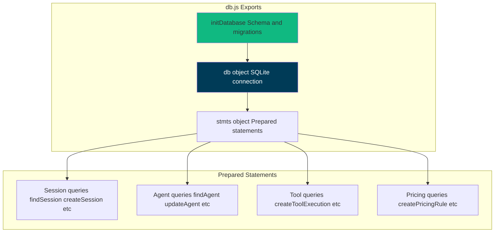

**Key Functions:**

```javascript
// Initialize database (create tables, indexes, defaults)
initDatabase();

// Prepared statements (prevents SQL injection, optimizes performance)
stmts.findSession.get(session_id);
stmts.createSession.run(session_id, model);
stmts.updateSession.run(status, total_cost, session_id);
stmts.touchSession.run(session_id); // Update updated_at

stmts.findAgent.get(agent_id);
stmts.createAgent.run(agent_id, session_id, agent_type);
stmts.updateAgent.run(status, input_tokens, output_tokens, cost, current_tool, agent_id);

stmts.createToolExecution.run(agent_id, tool_name, duration_ms, success, error_message);
stmts.createNotification.run(session_id, notification_type, message);
stmts.createPricingRule.run(pattern, input_cost_per_1m, output_cost_per_1m);
```

---

## API Reference

All endpoints return JSON unless noted. Error responses use:

```json
{
  "error": {
    "code": "SOME_CODE",
    "message": "Human-readable explanation"
  }
}
```

### OpenAPI / Swagger / ReDoc

| Method | Path                             | Description                                                                          |
| ------ | -------------------------------- | ------------------------------------------------------------------------------------ |
| `GET`  | `/api/openapi.json`              | Raw OpenAPI 3.0.3 spec                                                                |
| `GET`  | `/api/docs`                      | Interactive **Swagger UI** (try-it-out request execution)                            |
| `GET`  | `/api/redoc`                     | **ReDoc** reference — clean, read-optimized three-panel rendering of the same spec   |
| `GET`  | `/api/redoc/redoc.standalone.js` | Self-hosted ReDoc bundle (via the `redoc` dependency, never a CDN — works offline)   |

The OpenAPI spec is generated from `server/openapi.js` (`createOpenApiSpec()`), merged with supplementary fragments under `server/openapi-extra/`, and is the source of truth for request/response contracts. It now documents every backend route (75 path entries). Both Swagger UI and ReDoc (`server/lib/redoc.js`) render the same spec; the ReDoc bundle is served locally so the reference works offline / air-gapped. A committed `openapi.yaml` at the repo root mirrors the live spec — regenerate it after API changes with `npm run openapi:yaml` (never hand-edit it).

### Core Endpoints

| Method  | Path                | Description                                      |
| ------- | ------------------- | ------------------------------------------------ |
| `GET`   | `/api/health`       | Server health check                              |
| `GET`   | `/api/sessions`     | List sessions (`status`, `limit`, `offset`)     |
| `GET`   | `/api/sessions/:id` | Session detail (includes `agents` + `events`)   |
| `POST`  | `/api/sessions`     | Create session (idempotent by `id`)             |
| `PATCH` | `/api/sessions/:id` | Update session                                   |
| `GET`   | `/api/sessions/:id/transcripts` | List the session's transcript files (main + sub-agents) |
| `GET`   | `/api/sessions/:id/transcript`  | Cursor-paginated message stream for one transcript |
| `GET`   | `/api/agents`       | List agents (`status`, `session_id`, pagination)|
| `GET`   | `/api/agents/:id`   | Agent detail                                     |
| `POST`  | `/api/agents`       | Create agent (idempotent by `id`)               |
| `PATCH` | `/api/agents/:id`   | Update agent                                     |
| `GET`   | `/api/events`       | List events (`session_id`, `limit`, `offset`)   |
| `GET`   | `/api/stats`        | Dashboard aggregate counters                     |
| `GET`   | `/api/analytics`    | Analytics aggregates for charts/trends           |

**Session names** are kept in sync with the transcript title: on every hook event (and in the 15 s watchdog) the ingestor reads the latest `custom-title` (`/rename`, `claude -n`, picker `Ctrl+R`) or `ai-title` (auto) from the JSONL and updates `sessions.name` — `custom-title` always wins, `ai-title` only fills a placeholder/auto name — broadcasting `session_updated` so the UI reflects renames in real time.

**Transcript stream** (`GET /api/sessions/:id/transcript`) returns `user` / `assistant` messages plus: synthetic `session_event` rename markers (from `custom-title`), and local slash-command I/O surfaced from `system`/`local_command` lines (the `<command-name>` pill + `<local-command-stdout>`/`stderr` output, e.g. `/color`, `/rename`, custom commands). Content-less `local_command` lines and other `system` subtypes are dropped.

### Hook Ingestion

| Method | Path               | Description                                    |
| ------ | ------------------ | ---------------------------------------------- |
| `POST` | `/api/hooks/event` | Ingest one Claude Code hook event envelope     |

Request body shape:

```json
{
  "hook_type": "PreToolUse",
  "data": {
    "session_id": "abc-123",
    "tool_name": "Bash"
  }
}
```

### Pricing

| Method   | Path                      | Description                            |
| -------- | ------------------------- | -------------------------------------- |
| `GET`    | `/api/pricing`            | List pricing rules                     |
| `PUT`    | `/api/pricing`            | Create/update a pricing rule           |
| `DELETE` | `/api/pricing/:pattern`   | Delete pricing rule                    |
| `GET`    | `/api/pricing/cost`       | Total cost across all sessions         |
| `GET`    | `/api/pricing/cost/:id`   | Cost breakdown for one session         |

### Workflows

| Method | Path                          | Description                                                         |
| ------ | ----------------------------- | ------------------------------------------------------------------- |
| `GET`  | `/api/workflows`              | Aggregate workflow intelligence (`?status=active\|completed\|...`) |
| `GET`  | `/api/workflows/session/:id`  | Per-session drill-in (tree, timeline, swim lanes, events)          |

### Settings / Ops

| Method | Path                           | Description                                      |
| ------ | ------------------------------ | ------------------------------------------------ |
| `GET`  | `/api/settings/info`           | System info, DB stats, hooks status, cache stats. Also powers the Dashboard Health tab (server uptime, memory, CPU, DB record counts, WAL/journal mode, transcript cache hit/miss rates) |
| `POST` | `/api/settings/clear-data`     | Delete all sessions/agents/events/token usage    |
| `POST` | `/api/settings/reimport`       | Re-import legacy sessions from `~/.claude/`      |
| `POST` | `/api/settings/reinstall-hooks`| Reinstall Claude Code hooks                      |
| `POST` | `/api/settings/reset-pricing`  | Reset pricing table to defaults                  |
| `GET`  | `/api/settings/export`         | Export all data as JSON attachment               |
| `POST` | `/api/settings/cleanup`        | Abandon stale sessions and purge old data        |

### Claude Config Explorer (`/api/cc-config`)

Reads — and carefully gated mutations for low-risk text-file artifacts — for every Claude Code configuration surface. Mutations always create timestamped backups under `<root>/cc-config-backups/<type>/` before writing.

| Method   | Path                                  | Description |
| -------- | ------------------------------------- | ----------- |
| `GET`    | `/api/cc-config/overview`             | Roots + counts for every surface (used by the Overview tab) |
| `GET`    | `/api/cc-config/skills`               | Skills with parsed frontmatter, `?scope=user\|project\|all` |
| `GET`    | `/api/cc-config/agents`               | Subagents under `<scope>/.claude/agents/*.md` |
| `GET`    | `/api/cc-config/commands`             | Slash commands under `<scope>/.claude/commands/*.md` |
| `GET`    | `/api/cc-config/output-styles`        | Output styles under `<scope>/.claude/output-styles/*.md` |
| `GET`    | `/api/cc-config/plugins`              | Installed plugins joined with `enabledPlugins` + per-plugin `contributes` count + `plugin.json` metadata |
| `GET`    | `/api/cc-config/marketplaces`         | `known_marketplaces.json` enriched with each marketplace's own `marketplace.json` |
| `GET`    | `/api/cc-config/mcp`                  | MCP servers from `~/.claude.json` and `settings.json` |
| `GET`    | `/api/cc-config/hooks`                | Hooks aggregated across user / project / project-local `settings.json` |
| `GET`    | `/api/cc-config/hook-scripts`         | Files in `~/.claude/hooks/` (helper scripts referenced by hook commands) |
| `GET`    | `/api/cc-config/keybindings`          | `~/.claude/keybindings.json` parsed into context-grouped key/action pairs |
| `GET`    | `/api/cc-config/statusline`           | `settings.json.statusLine` config + script content if present |
| `GET`    | `/api/cc-config/settings`             | User / project / project-local settings JSON, secret keys redacted |
| `GET`    | `/api/cc-config/memory`               | `CLAUDE.md` files at user + project scope. Also returns the per-project file-based memory store as `scope:"auto-memory"` items (each carrying `project`, `name`, `isIndex`, and parsed `frontmatter`) — every `*.md` under `~/.claude/projects/<slug>/memory/` |
| `GET`    | `/api/cc-config/file?path=…`          | Body of a single file (path-contained to allowed roots) |
| `GET`    | `/api/cc-config/backups[?scope=&type=]` | Listing of all timestamped backups. Also lists `scope:"auto-memory"` backups (each carrying `project`) |
| `PUT`    | `/api/cc-config/file`                 | Create or overwrite a text-file artifact (skills/agents/commands/output-styles/memory). Body: `{ scope, type, name?, content }`. Auto-backs-up if file exists. Atomic temp + rename. 256 KB cap. Per-project file-based memory is also editable via `{ scope: "auto-memory", type: "auto-memory", project, name }` — backups land under `<memory-dir>/.cc-config-backups/auto-memory/`, and an invalid project slug returns `EBADPROJECT` |
| `DELETE` | `/api/cc-config/file`                 | Backup-then-delete a text-file artifact. Skill dirs are backed up whole before recursive removal |

### Run Claude (`/api/run`)

HTTP surface for spawning and supervising `claude` subprocesses from the dashboard. Every route enforces a same-origin / loopback-Origin guard against browser CSRF.

| Method   | Path                          | Description |
| -------- | ----------------------------- | ----------- |
| `GET`    | `/api/run`                    | List handles + `maxConcurrent` + `activeCount` |
| `GET`    | `/api/run/binary`             | Probe whether `claude` is on `PATH` |
| `GET`    | `/api/run/cwds`               | Suggested cwds (dashboard, home, recent from sessions) |
| `GET`    | `/api/run/files?cwd=…&q=…`    | Fuzzy file search inside `cwd` for the Run page's `@`-file autocomplete. Skips `node_modules`, `.git`, `dist`, `build`, `.next`, `.cache`, `coverage`, `vendor`, etc. Cwd is required and must exist; results are capped and ranked by basename match |
| `POST`   | `/api/run`                    | Spawn. Body: `{ prompt, mode, cwd?, model?, permissionMode?, resumeSessionId?, effort? }`. `effort` (`low`/`medium`/`high`) maps to `--effort`. When `resumeSessionId` is set in conversation mode, `prompt` may be empty — the spawner skips the initial stdin write and `claude --resume` idles until the client POSTs a follow-up to `/api/run/:id/message`. Spawner always passes `--output-format stream-json --verbose --include-partial-messages` for character-by-character streaming. Concurrency is effectively uncapped by default (ceiling 10000, override with `RUN_MAX_CONCURRENT`) — the terminal TUI has no cap and neither does the dashboard; the ceiling is sanity-only to prevent fork-bomb footguns |
| `POST`   | `/api/run/:id/message`        | Send follow-up turn (conversation mode only). Body: `{ text }` |
| `GET`    | `/api/run/:id`                | Handle state. `?envelopes=1` includes the in-memory envelope log for re-attach |
| `DELETE` | `/api/run/:id`                | Stop (SIGTERM → SIGKILL after 5 s) |

WebSocket message types added: `run_stream` (parsed stream-json envelope, including `stream_event` deltas from `--include-partial-messages`), `run_status` (status transitions), `run_input_ack` (stdin write confirmed), and `cc_config_changed` (broadcast by `lib/cc-watcher.js` on `fs.watch` events under `~/.claude/` and by `routes/cc-config.js` after every successful PUT/DELETE — debounced at 500 ms, payload `{ source: "dashboard"|"fs", action?, scope?, type?, name?, paths? }`).

### Import History

Bring existing Claude Code sessions into the dashboard. All four entry
points share the same JSONL parser (`parseSessionFile` +
`importSession`) used by live ingestion, so imported tokens and cost
calculations match real-time captured sessions exactly. Re-imports are
idempotent (dedupe by session ID; compaction `baseline_*` columns
prevent token double-counting).

| Method | Path                      | Description                                                              |
| ------ | ------------------------- | ------------------------------------------------------------------------ |
| `GET`  | `/api/import/guide`       | OS-aware paths, archive command, supported extensions, step instructions |
| `POST` | `/api/import/rescan`      | Rescan the default `~/.claude/projects` directory                        |
| `POST` | `/api/import/scan-path`   | Scan any absolute directory path (body: `{ path }`); walks recursively   |
| `POST` | `/api/import/upload`      | Multipart upload of `.jsonl`, `.meta.json`, `.zip`, `.tar(.gz)`, `.gz`   |

**Source files**

| File                           | Role                                                                                                   |
| ------------------------------ | ------------------------------------------------------------------------------------------------------ |
| `server/routes/import.js`      | Express router, request validation, temp-dir lifecycle, progress broadcasts                            |
| `server/lib/archive.js`        | Safe archive extractors (`.zip` / `.tar(.gz)` / `.gz`) with path-traversal and size-cap enforcement    |
| `scripts/import-history.js`    | Generalized directory walker (`importFromDirectory`) + shared `parseSessionFile` / `importSession`. Re-import is fully incremental: per-event-type high-water mark (`MAX(created_at) GROUP BY event_type` per session) drives `ts > cutoff[type]` dedup for Stop / PostToolUse / TurnDuration / ToolError, and `sessions.ended_at` is rolled forward when the JSONL has progressed past the stored value |
| `server/lib/transcript-cache.js` | Chunked 4 MiB sync byte-stream reader for JSONL transcripts — never materializes the whole file as a JS string, so files larger than V8's max string length (~512 MiB on 64-bit Node 20) parse without aborting Node with `FATAL ERROR: v8::ToLocalChecked Empty MaybeLocal` |

**Request flow (upload)**

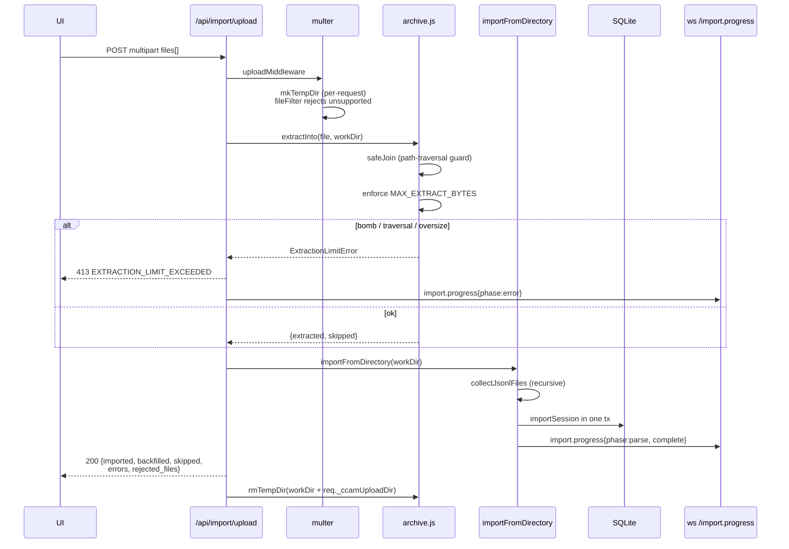

**Supported source layouts.** Both canonical Claude Code JSONL layouts
are recognised automatically — `<proj>/<sid>/subagents/agent-*.jsonl`
(default) and `<proj>/subagents/<sid>/agent-*.jsonl` (alternative) —
and orphan subagent files (parent JSONL missing from the upload) are
attached to an existing DB session whenever the inferred session ID
matches one probed from either layout candidate.

**Environment variables**

| Variable                          | Default     | Purpose                                                           |
| --------------------------------- | ----------- | ----------------------------------------------------------------- |
| `CCAM_IMPORT_MAX_BYTES`           | `1073741824` | Maximum size per uploaded file                                   |
| `CCAM_IMPORT_MAX_FILES`           | `2000`      | Maximum files per upload request                                 |
| `CCAM_IMPORT_MAX_EXTRACT_BYTES`   | `4294967296` | Total uncompressed bytes allowed per archive (zip-bomb guard)   |

**WebSocket event schema.** Progress is broadcast on `/ws` with type
`import.progress`. Messages are throttled at ~150 ms; the terminal
`complete` and `error` frames are always delivered.

```json
{
  "type": "import.progress",
  "timestamp": "2026-04-18T15:48:34.123Z",
  "data": {
    "importId": "upload-1729264114000",
    "phase": "parse",
    "source": "upload",
    "processed": 184,
    "total": 512,
    "current": "/tmp/ccam-import-work-xyz/project/<uuid>.jsonl",
    "counters": { "imported": 120, "backfilled": 40, "skipped": 20, "errors": 4 }
  }
}
```

Phases: `start` → `scan` → `extract` (upload only) → `parse` →
`complete`, with `error` / `extract_error` replacing `complete` on
failure.

**Response envelopes**

```jsonc
// 200 — import completed
{
  "ok": true,
  "source": "upload",            // "default" | "path" | "upload"
  "path": "/abs/path",           // only for source=path
  "imported": 120,
  "backfilled": 40,
  "skipped": 20,
  "errors": 4,
  "sessions_seen": 180,
  "files_scanned": 512,
  "files_received": 8,           // upload only
  "rejected_files": [],          // upload only; unsupported extensions
  "entries_extracted": 180,      // upload only
  "entries_skipped": 0           // upload only
}

// 400 — validation failure
{ "error": { "code": "PATH_NOT_FOUND", "message": "..." } }

// 413 — extraction cap exceeded (zip-bomb defense)
{
  "error": { "code": "EXTRACTION_LIMIT_EXCEEDED", "message": "..." },
  "offending_file": "suspicious.tar.gz"
}
```

---

## WebSocket Protocol

### Connection Lifecycle

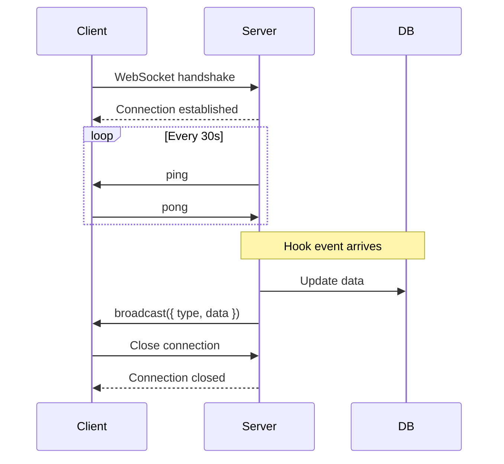

### Message Types

Server broadcasts JSON messages to all connected clients:

```typescript
// Session created
{
  "type": "session.created",
  "data": { ...session object }
}

// Session updated (status change, cost update)
{
  "type": "session.updated",
  "data": { ...session object }
}

// Agent created
{
  "type": "agent.created",
  "data": { ...agent object }
}

// Agent updated (status, tokens, cost)
{
  "type": "agent.updated",
  "data": { ...agent object }
}

// Tool executed
{
  "type": "tool.executed",
  "data": { ...tool execution object }
}

// Notification received
{
  "type": "notification.received",
  "data": { ...notification object }
}
```

### Broadcasting Logic

```javascript
// websocket.js
function broadcast(message) {
  const payload = JSON.stringify(message);
  wss.clients.forEach(client => {
    if (client.readyState === WebSocket.OPEN) {
      client.send(payload);
    }
  });
}

// Usage in routes/hooks.js
broadcast({ type: 'session.created', data: session });
```

---

## Hook Processing

### Hook Event Flow

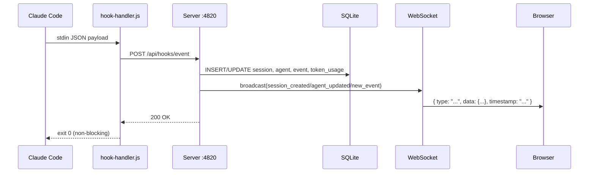

### Hook Endpoints

All hook traffic is sent to one endpoint:

| Method | Endpoint | Notes |
|--------|----------|-------|
| `POST` | `/api/hooks/event` | Body includes `hook_type` and `data`; server routes behavior by hook type |

Supported `hook_type` values include `PreToolUse`, `PostToolUse`, `Stop`, `SubagentStop`, `Notification`, `SessionStart`, and `SessionEnd`.

### Hook Processing Logic

```javascript
// routes/hooks.js
router.post("/event", (req, res) => {
  const { hook_type, data } = req.body;
  if (!hook_type || !data) {
    return res.status(400).json({
      error: { code: "INVALID_INPUT", message: "hook_type and data are required" },
    });
  }

  const event = processEvent(hook_type, data); // updates sessions, agents, events, tokens
  if (!event) {
    return res.status(400).json({
      error: { code: "MISSING_SESSION", message: "session_id is required in data" },
    });
  }

  res.json({ ok: true, event });
});
```

### Pricing Calculation

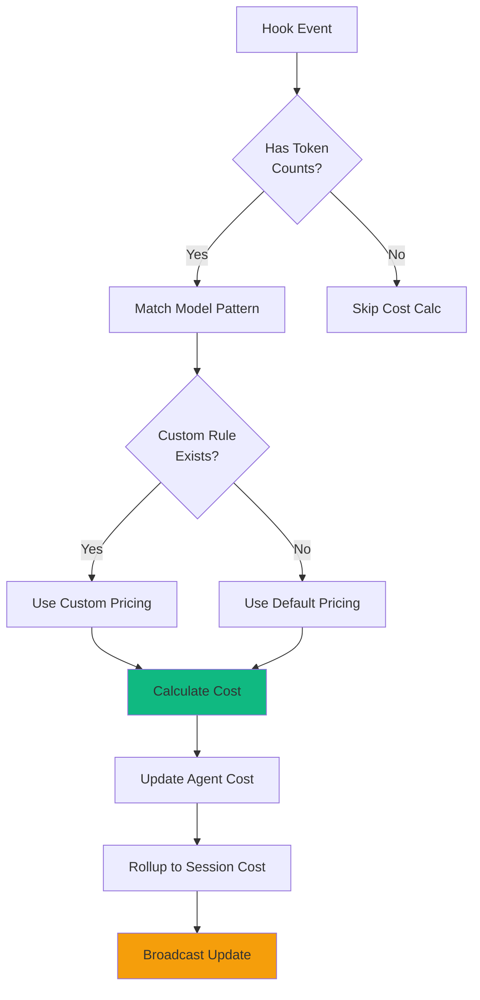

**Cost Formula:**

```javascript
function calculateCost(model, inputTokens, outputTokens) {
  // Find matching pricing rule (custom or default)
  const rule = findPricingRule(model);
  
  // Cost = (input tokens / 1M * input price) + (output tokens / 1M * output price)
  const inputCost = (inputTokens / 1_000_000) * rule.input_cost_per_1m;
  const outputCost = (outputTokens / 1_000_000) * rule.output_cost_per_1m;
  
  return inputCost + outputCost;
}
```

### Default Pricing Rules

Loaded on first run from `db.js`:

```javascript
// [pattern, display_name, input, output, cache_read, cache_write_5m, cache_write_1h]
// (rates per million tokens; 5m write ≈ 1.25× input, 1h write ≈ 2× input)
const DEFAULT_PRICING = [
  ["claude-fable-5%", "Claude Fable 5", 10, 50, 1, 12.5, 20],
  ["claude-mythos-5%", "Claude Mythos 5", 10, 50, 1, 12.5, 20],
  ["claude-opus-4-8%", "Claude Opus 4.8", 5, 25, 0.5, 6.25, 10],
  ["claude-sonnet-4-6%", "Claude Sonnet 4.6", 3, 15, 0.3, 3.75, 6],
  ["claude-haiku-4-5%", "Claude Haiku 4.5", 1, 5, 0.1, 1.25, 2],
  // ... one explicit row per model (see server/db.js for the full list)
];
```

---

## Data Flow

### Session Lifecycle

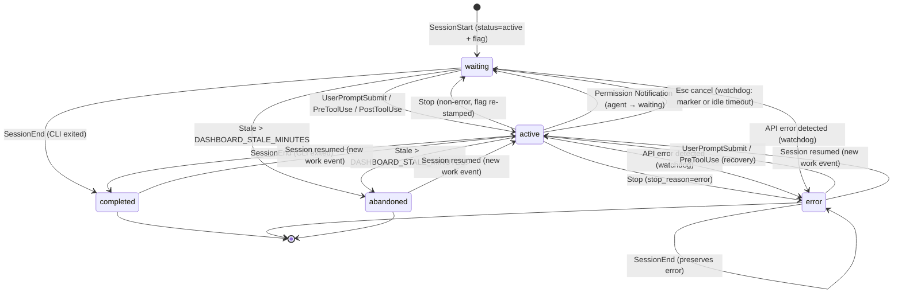

### Agent Lifecycle

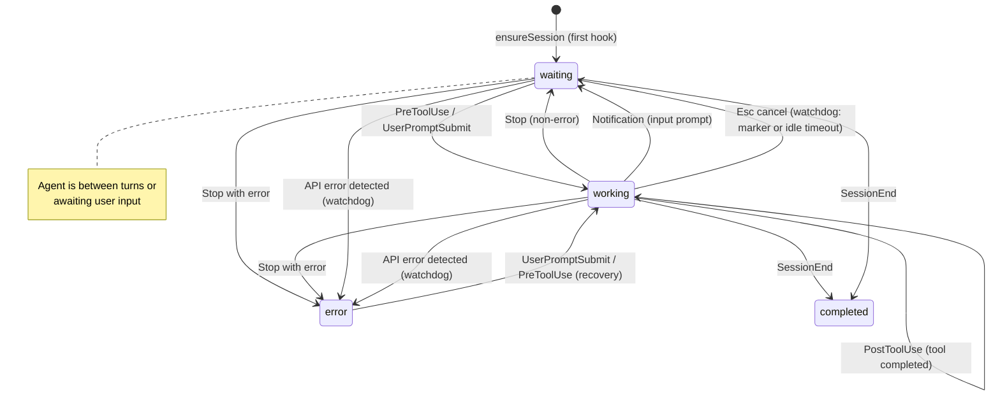

### Hook to Database Flow

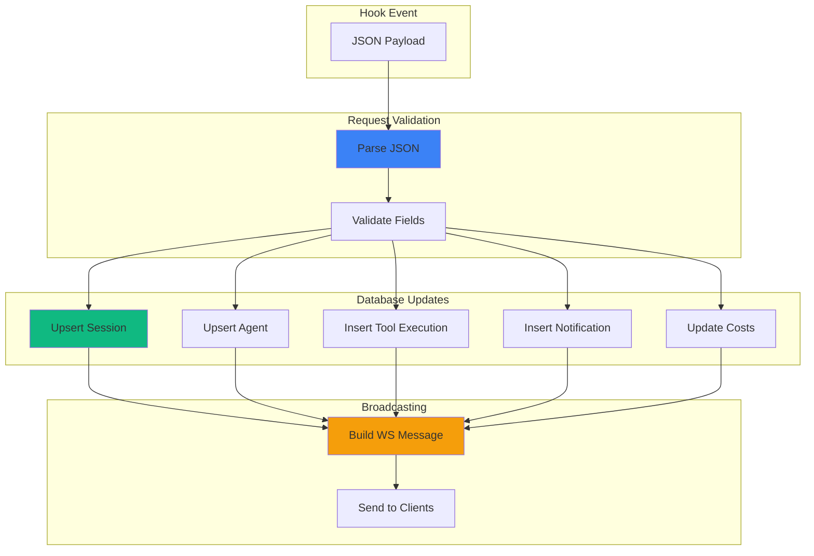

---

## Error Handling

### HTTP Error Codes

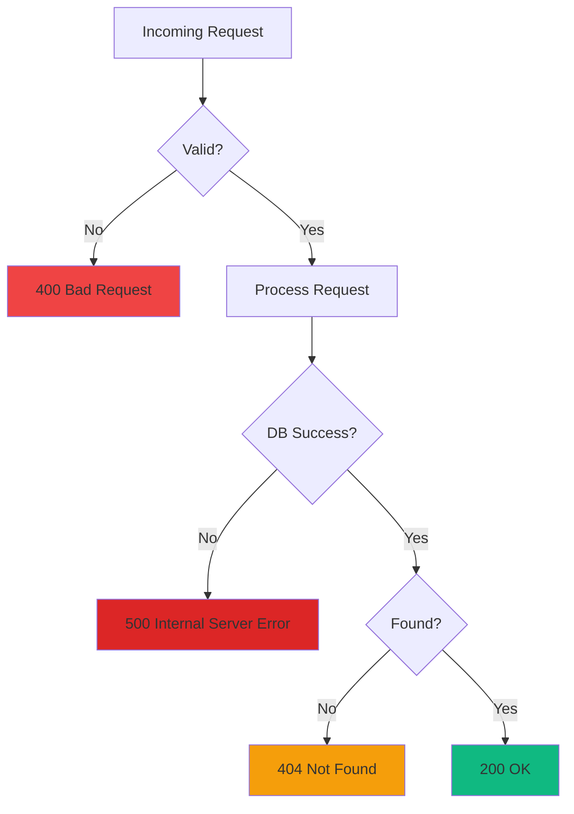

### Error Response Format

```json
{
  "error": "Session not found",
  "code": "NOT_FOUND",
  "details": {
    "session_id": "sess_invalid"
  }
}
```

### Graceful Degradation

```javascript
// Hook endpoint never throws unhandled errors to Claude Code
router.post("/api/hooks/event", (req, res) => {
  try {
    // Process hook
    processHookEvent(req.body);
    res.json({ ok: true });
  } catch (err) {
    console.error("Hook processing error:", err);
    // Still return 200 to avoid blocking Claude Code
    res.json({ ok: false, error: err.message });
  }
});
```

### Error Detection Watchdog

The server runs a background error detection timer every 15 seconds that proactively catches API errors even when Claude Code fails to fire hooks:

1. **Stale session scan** — finds active sessions with no recent hook events (>10 seconds since last event)
2. **Transcript re-read** — re-reads JSONL transcript files for those sessions looking for API errors (401 auth failures, rate limits, quota exhaustion)
3. **Path derivation** — for imported sessions that don't have `transcript_path` in event data, derives the transcript path from the session's `cwd`
4. **Error marking** — marks sessions and agents as `error` when API errors are found in transcripts

This catches cases where the Claude CLI doesn't fire a hook after an API error (e.g., 401 auth failures where the CLI just shows the error message and waits for user input).

### User-Interrupt (Esc) Recovery

Cancelling a turn with `Esc` fires **no Claude Code hook** (a documented CLI limitation), so the `UserPromptSubmit` that promoted the main agent to `working` is never undone — the session would otherwise sit in `working` forever. The same 15 s watchdog recovers it, with two detection paths:

1. **Transcript marker** — when the cancel happens *after* some output, Claude Code writes a `[Request interrupted by user]` entry (carrying an `interruptedMessageId`) to the transcript. `TranscriptCache` exposes `pendingInterrupt`, computed purely from transcript ordering — the latest interrupt timestamp vs the latest real turn activity (assistant output or a genuine user prompt), both on Claude Code's clock. This is deliberately **not** compared against the session's last hook event: those are different clocks, and for a sub-second cancel the `UserPromptSubmit` event is stamped *after* the transcript interrupt, which is exactly what left such sessions stuck. Recovers within ~15 s.
2. **Idle-working timeout** — when Esc is pressed *before any output*, Claude Code writes **no marker at all**; the only signal is silence. When the main agent has been `working` with `current_tool` null and **neither a hook event nor the transcript mtime** has advanced for `DASHBOARD_WORKING_IDLE_SECONDS` (default `120`), the turn is treated as dead. Streaming output (transcript still growing) and in-flight tool calls are exempt by these guards; a rare false flip self-heals on the next real hook.

Both paths move the session to **Waiting** (main agent → `waiting`, `awaiting_input_since` stamped) — the same state a normal `Stop` produces — and log an `Interrupted` event. If the user resumes (a new prompt lands in the transcript), `pendingInterrupt` flips back to false and the fresh hook keeps the session non-stale.

### API Error → Error State Flow

API errors detected in JSONL transcripts (`isApiErrorMessage` entries: quota limits, rate limits, `invalid_request`) now **immediately mark the session and agent as `error`**. Previously, these errors were recorded as `APIError` events but did not change session/agent status.

Error state transitions:
- `Stop` with `stop_reason=error` → agent `error`, session `error`
- API error in transcript (hook-based or watchdog) → session `error`, agent `error`
- `Notification` indicating input prompt → agent `waiting` (status change, not just flag)
- `SessionEnd` on error session → **preserves** `error` status (previously always set to `completed`)

### Error Recovery

Only two events can recover a session from `error` back to `active`:
- **`UserPromptSubmit`** — user hits enter on a new prompt (active retry)
- **`PreToolUse`** — agent begins using a tool (session resumed with work)

This ensures error states are only cleared by deliberate user action, not by background activity.

---

## Performance

### Query Optimization

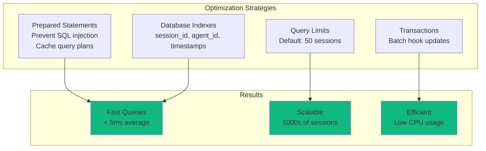

### Benchmarks

| Operation | Average Time | Notes |
|-----------|--------------|-------|
| Hook ingestion | 2-5 ms | Includes DB write + broadcast |
| Session list query | 3-8 ms | 50 sessions with agent counts |
| Session detail query | 1-2 ms | Single session lookup |
| Agent tools query | 5-15 ms | 100 tool executions |
| WebSocket broadcast | < 1 ms | Per client |

### Memory Usage

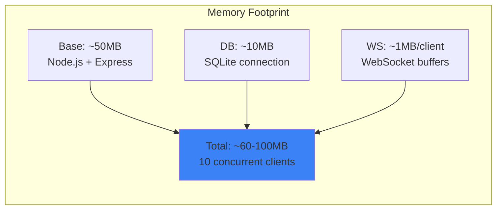

### Scaling Considerations

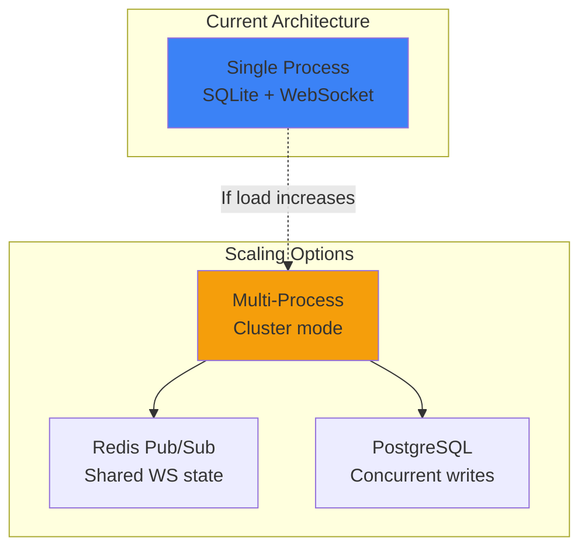

**Current limits:**
- SQLite: 1000s of sessions, 10,000s of tool executions
- WebSocket: 100+ concurrent clients
- CPU: Low (<5% idle, <20% during hook bursts)

For >1000 concurrent clients or >100k sessions, consider:
- Cluster mode with Redis pub/sub for WebSocket broadcasting
- PostgreSQL for better concurrent write performance
- Read replicas for API queries

---

## Testing

### Test Structure

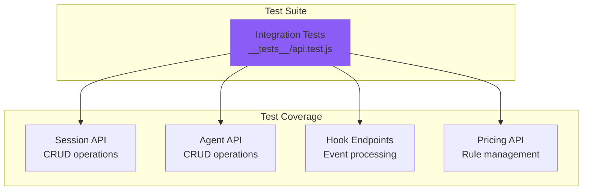

### Running Tests

```bash
# Run all server tests
npm run test:server

# Run with verbose output
node --test --test-reporter=spec server/__tests__/*.test.js
```

### Example Test

```javascript
// __tests__/api.test.js
import { test } from 'node:test';
import assert from 'node:assert';

test("POST /api/hooks/event ingests hook payload", async () => {
  const response = await fetch("http://localhost:4820/api/hooks/event", {
    method: 'POST',
    headers: { 'Content-Type': 'application/json' },
    body: JSON.stringify({
      hook_type: "SessionStart",
      data: {
        session_id: "test_session",
        model: "claude-sonnet-4",
        session_name: "Example Session",
      },
    })
  });
  
  const data = await response.json();
  assert.strictEqual(data.ok, true);
  
  // Verify session created
  const session = await fetch('http://localhost:4820/api/sessions/test_session');
  const sessionData = await session.json();
  assert.strictEqual(sessionData.session.model, 'claude-sonnet-4');
});
```

---

## Deployment

### Production Checklist

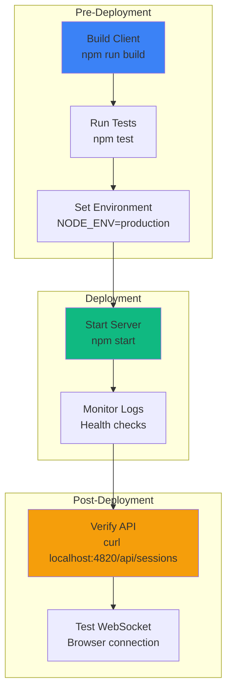

### Environment Variables

```bash
# Server configuration
DASHBOARD_PORT=4820                # Server port
NODE_ENV=production                # Environment mode

# Network exposure & hardening (see server/lib/security.js)
DASHBOARD_HOST=127.0.0.1           # Bind address; default loopback. Set 0.0.0.0 to widen (logs a warning)
DASHBOARD_TOKEN=                   # Optional bearer token; when set, /api/* and the WebSocket require it (off by default)
DASHBOARD_ALLOWED_HOSTS=           # Extra Host-header names to allow (comma-separated), e.g. for LAN access

# Database
DASHBOARD_DB_PATH=./data/dashboard.db  # SQLite database path

# Logging
LOG_LEVEL=info                     # Log level (debug, info, warn, error)
```

### Running in Production

```bash
# Start server (production mode)
NODE_ENV=production node server/index.js

# With PM2 (process manager)
pm2 start server/index.js --name agent-dashboard

# With systemd
sudo systemctl start agent-dashboard
```

### Docker Deployment

```dockerfile
# Dockerfile (root of project)
FROM node:18-alpine

WORKDIR /app

# Install dependencies
COPY package*.json ./
COPY client/package*.json ./client/
RUN npm ci --production && cd client && npm ci --production

# Build client
COPY client ./client
RUN cd client && npm run build

# Copy server
COPY server ./server
COPY data ./data

EXPOSE 4820

CMD ["node", "server/index.js"]
```

```bash
# Build and run
docker build -t agent-dashboard .
docker run -p 4820:4820 -v $(pwd)/data:/app/data agent-dashboard
```

---

## Configuration

### Server Configuration (index.js)

```javascript
const PORT = parseInt(process.env.DASHBOARD_PORT || '4820', 10);
const HOST = process.env.DASHBOARD_HOST || '127.0.0.1';
const DB_PATH = process.env.DASHBOARD_DB_PATH || './data/dashboard.db';

const { corsOptions, hostGuard, tokenGuard } = require('./lib/security');

const app = express();
app.use(cors(corsOptions()));    // loopback-only origins
app.use(hostGuard);              // Host-header allowlist (anti DNS-rebinding)
app.use('/api', tokenGuard);     // optional DASHBOARD_TOKEN bearer auth
app.use(express.json({ limit: '10mb' }));

server.listen(PORT, HOST);       // binds 127.0.0.1 by default
```

The server **binds `127.0.0.1` (loopback) by default**, so it is not
network-reachable out of the box (CVE / advisory `GHSA-gr74-4xfh-6jw9`).
The hardening helpers all live in [`server/lib/security.js`](lib/security.js):

- **`corsOptions()`** restricts CORS to loopback origins — cross-origin pages
  in a browser cannot read responses (no-Origin clients such as `curl` still work).
- **`hostGuard`** enforces a Host-header allowlist on HTTP requests and WebSocket
  upgrades, blocking DNS-rebinding attacks.
- **`tokenGuard`** is a no-op unless `DASHBOARD_TOKEN` is set; when it is, every
  `/api/*` request (and the WebSocket) must present the token via
  `Authorization: Bearer <token>`, an `x-dashboard-token` header, or `?token=`.

Set **`DASHBOARD_HOST`** (e.g. `0.0.0.0`) to widen the bind beyond loopback —
this logs a startup warning and you should set **`DASHBOARD_TOKEN`** for auth
when you do. Add extra LAN Host names that should be accepted to
**`DASHBOARD_ALLOWED_HOSTS`** (comma-separated).

### Database Configuration (db.js)

```javascript
// SQLite connection options
const db = new Database(DB_PATH, {
  verbose: process.env.NODE_ENV === 'development' ? console.log : undefined,
  fileMustExist: false
});

// Performance pragmas
db.pragma('journal_mode = WAL');  // Write-Ahead Logging
db.pragma('synchronous = NORMAL'); // Faster writes
db.pragma('cache_size = -64000');  // 64MB cache
db.pragma('temp_store = MEMORY');  // Temp tables in memory
```

### WebSocket Configuration (websocket.js)

```javascript
const wss = new WebSocketServer({
  server: httpServer,
  path: '/ws',
  clientTracking: true,
  maxPayload: 1024 * 1024 // 1MB max message size
});

// Heartbeat interval
const HEARTBEAT_INTERVAL = 30000; // 30s
```

---

## Summary

The server is production-ready with:

- 🚀 **High Performance** - Sub-5ms hook processing, prepared statements, WAL mode
- 📊 **Comprehensive API** - RESTful endpoints for all data access
- ⚡ **Real-time Updates** - WebSocket broadcasting with heartbeat
- 🗄️ **Robust Storage** - SQLite with indexes, migrations, transactions
- 💰 **Flexible Pricing** - Custom pricing rules with pattern matching
- 🧪 **Well Tested** - Integration tests with Node.js test runner
- 🔒 **Secure** - Prepared statements, input validation, loopback bind by default, Host-header allowlist, loopback-only CORS, optional `DASHBOARD_TOKEN` auth
- 📈 **Scalable** - Handles 1000s of sessions, 100+ concurrent clients

For client documentation, see [client/README.md](../client/README.md).
